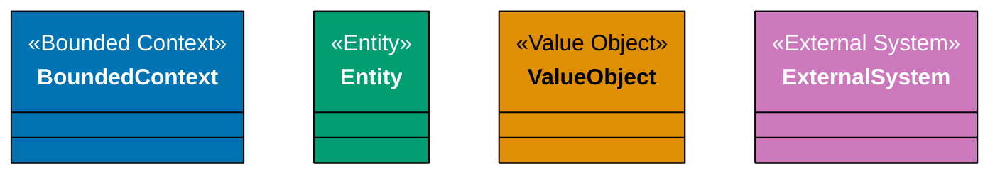
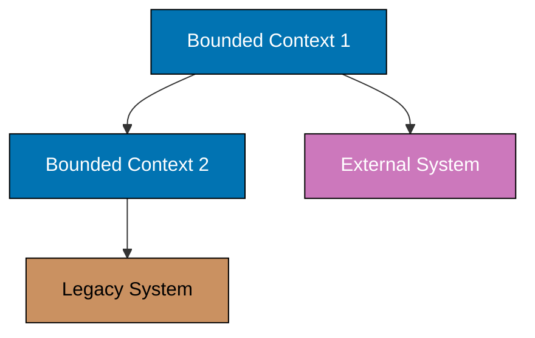
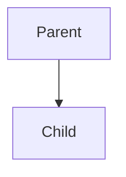
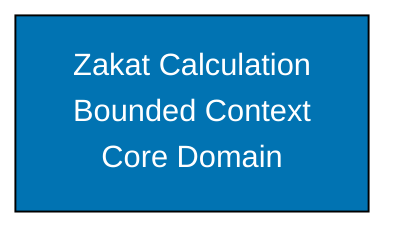
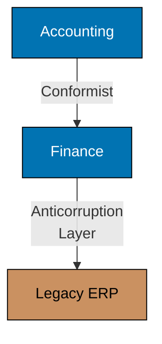
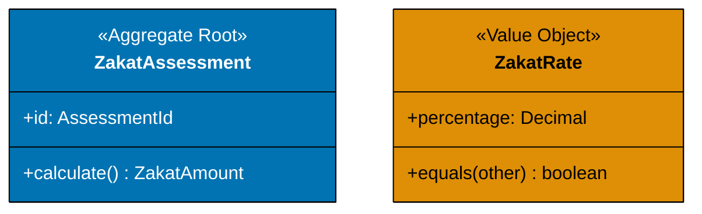
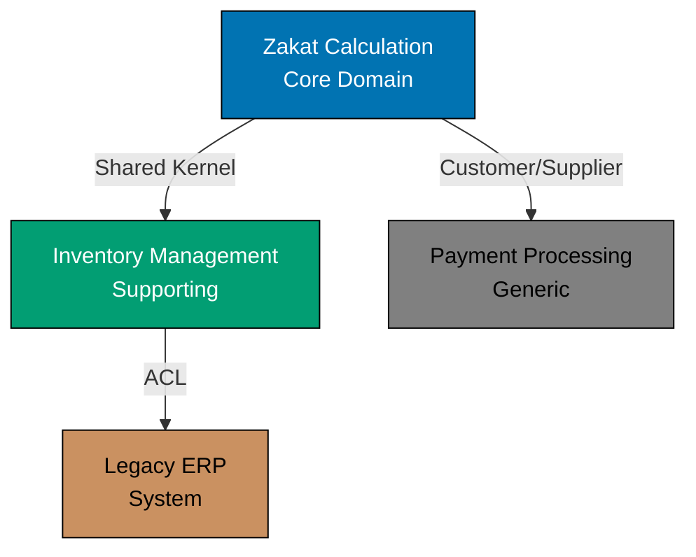
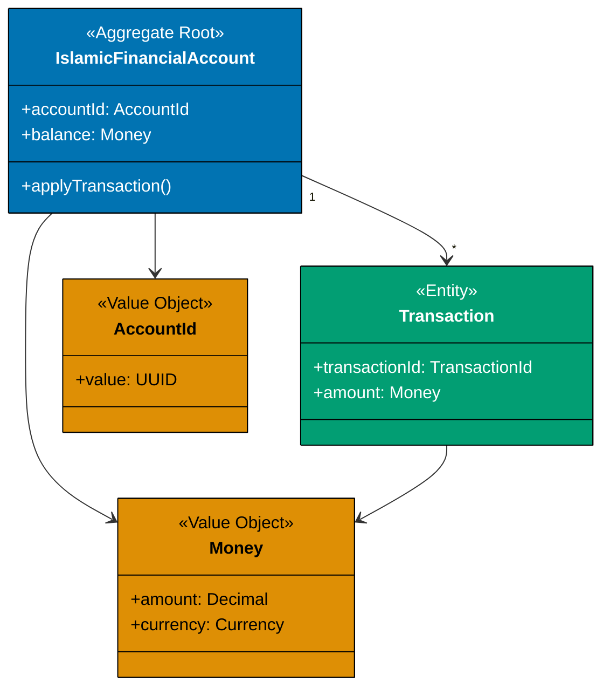
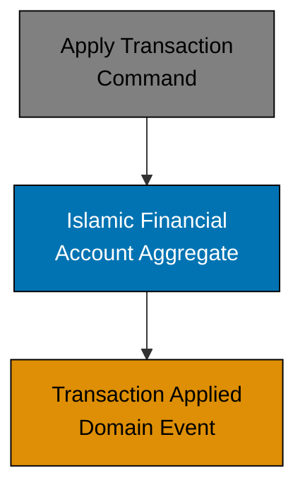

# WCAG AA-Compliant Color Palette for DDD Diagrams

This color palette ensures all Mermaid diagrams in the DDD documentation meet WCAG AA accessibility standards for color contrast, making them readable for users with color vision deficiencies.

## Color Specifications

### Primary Colors (White Text)

**Blue: `#0173B2`**

- **Usage**: Bounded Contexts, Aggregate Roots, Core Domain elements
- **Text Color**: White (`#FFFFFF`)
- **Contrast Ratio**: 7.19:1 (WCAG AAA compliant)
- **Example**: Bounded Context boxes, Aggregate Root classes

**Teal: `#029E73`**

- **Usage**: Entities within Aggregates, Supporting Subdomains
- **Text Color**: White (`#FFFFFF`)
- **Contrast Ratio**: 5.93:1 (WCAG AA compliant)
- **Example**: Entity classes, Supporting Domain services

**Purple: `#CC78BC`**

- **Usage**: External Systems, Context Relationships
- **Text Color**: White (`#FFFFFF`)
- **Contrast Ratio**: 4.52:1 (WCAG AA compliant)
- **Example**: External API integrations, Anti-Corruption Layers

### Secondary Colors (Black Text)

**Orange: `#DE8F05`**

- **Usage**: Value Objects, Domain Events
- **Text Color**: Black (`#000000`)
- **Contrast Ratio**: 8.12:1 (WCAG AAA compliant)
- **Example**: Money, ZakatRate, DomainEvent classes

**Brown: `#CA9161`**

- **Usage**: Legacy Systems, Generic Subdomains
- **Text Color**: Black (`#000000`)
- **Contrast Ratio**: 4.77:1 (WCAG AA compliant)
- **Example**: Legacy database connections, third-party libraries

**Gray: `#808080`**

- **Usage**: Supporting Services, Infrastructure
- **Text Color**: Black (`#000000`)
- **Contrast Ratio**: 3.95:1 (WCAG AA compliant)
- **Example**: Application Services, Infrastructure concerns

## Mermaid Syntax

### Class Diagrams

### Graph Diagrams

## Usage Guidelines

### 1. Consistent Application

Apply colors consistently across all DDD documentation:

- **Bounded Contexts**: Always blue
- **Aggregates**: Always blue (aggregate roots) and teal (contained entities)
- **Value Objects**: Always orange
- **Domain Events**: Always orange
- **External Systems**: Always purple
- **Legacy Systems**: Always brown
- **Infrastructure**: Always gray

### 2. Diagram Orientation

Prefer `graph TD` (top-down) orientation for better mobile readability:

Avoid `graph LR` (left-right) unless horizontal flow is semantically important.

### 3. Multi-line Labels

Use ` ` for multi-line labels to improve readability:

### 4. Relationship Labels

Always label relationships with clear, descriptive text:

### 5. Stereotype Annotations

Use UML-style stereotypes for clarity:

## Color Contrast Verification

All colors have been tested against WCAG AA standards (4.5:1 for normal text, 3:1 for large text):

| Color  | Hex       | Text Color | Contrast Ratio | WCAG Level |
| ------ | --------- | ---------- | -------------- | ---------- |
| Blue   | `#0173B2` | White      | 7.19:1         | AAA        |
| Teal   | `#029E73` | White      | 5.93:1         | AA         |
| Orange | `#DE8F05` | Black      | 8.12:1         | AAA        |
| Purple | `#CC78BC` | White      | 4.52:1         | AA         |
| Brown  | `#CA9161` | Black      | 4.77:1         | AA         |
| Gray   | `#808080` | Black      | 3.95:1         | AA         |

## Examples from DDD Documentation

### Bounded Context Map

### Aggregate Structure

### Domain Events

## Related Documentation

- [Diagram Standards](../../../../governance/conventions/formatting/diagrams.md) - Repository-wide diagram conventions
- [Accessibility First Principle](../../../../governance/principles/content/accessibility-first.md) - WCAG AA compliance requirements
- [C4 Color Palette](../../c4-architecture-model/ex-c4armo__14-templates/color-palette.md) - C4 diagram colors (same palette)

## Tools for Verification

- [WebAIM Contrast Checker](https://webaim.org/resources/contrastchecker/) - Online WCAG contrast verification
- [Coolors Contrast Checker](https://coolors.co/contrast-checker) - Alternative contrast tool
- [Coblis Color Blindness Simulator](https://www.color-blindness.com/coblis-color-blindness-simulator/) - Test diagrams for color vision deficiencies
