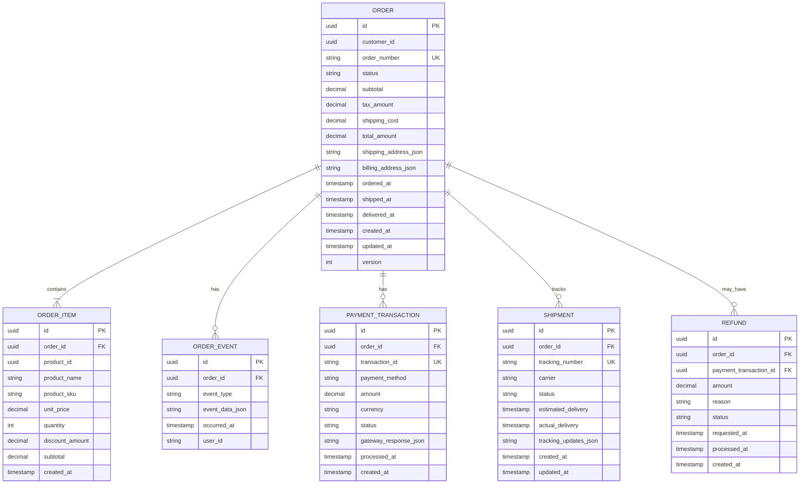

# C4 Architecture Model

Comprehensive explanation of the C4 model for visualizing software architecture through hierarchical abstraction levels.

## Overview

The **C4 model** is an easy-to-learn, developer-friendly approach to software architecture diagramming created by Simon Brown. It provides a systematic way to visualize software architecture at different levels of detail, making it accessible to both technical and non-technical audiences.

The name "C4" comes from the four hierarchical levels that form the core of the model:

1. **Context** - How the system fits into the world
2. **Container** - The high-level technical building blocks
3. **Component** - The internal structure of containers
4. **Code** - Implementation details and class structures

Unlike heavyweight modeling approaches that can overwhelm developers, the C4 model focuses on simplicity and practicality while maintaining enough rigor to be useful for architecture documentation.

## History and Origins

Simon Brown created the C4 model between 2006 and 2011 based on his experiences teaching software architecture. The diagram types were formally named in 2010, and the "C4" name was adopted in 2011. The model evolved from UML (Unified Modeling Language) and the 4+1 architectural view model, but deliberately simplifies these concepts to make architecture more accessible to modern development teams.

## Purpose and Benefits

### Why C4 Model Exists

The C4 model addresses several common challenges in software architecture documentation:

1. **Inconsistent Abstractions**: Teams often mix different levels of detail in single diagrams, creating confusion
2. **Over-complex Notations**: Formal modeling languages like UML can be intimidating and incompatible with agile workflows
3. **Missing Documentation**: Many teams skip architecture documentation entirely due to perceived complexity
4. **Poor Communication**: Architecture diagrams fail to effectively communicate with diverse audiences

### Key Benefits

**Developer-Friendly Approach:**

- Simple enough for any developer to understand and create
- No extensive training required unlike UML or ArchiMate
- Fits naturally into agile and continuous delivery workflows
- Focuses on practical communication over formal correctness

**Hierarchical Abstraction:**

- Different levels of zoom for different audiences
- Executive stakeholders see context diagrams
- Developers and architects see component and code diagrams
- Each level provides appropriate detail without overwhelming

**Notation Independence:**

- Not tied to specific diagramming tools or syntax
- Works with any diagramming tool (draw.io, Mermaid, PlantUML, etc.)
- Emphasizes clarity over strict notation rules
- Teams can adapt visual conventions to their needs

**Progressive Disclosure:**

- Start with high-level context and drill down as needed
- You don't need all four levels - use what adds value
- Most teams find context and container diagrams sufficient
- Component and code diagrams reserved for complex areas

## The Four Core Levels

### Level 1: System Context Diagram

**Purpose**: Shows how the software system fits into the world around it.

**Audience**: Everyone - executives, stakeholders, developers, operations teams.

**Contains**:

- The software system being documented (in scope)
- People who use the system (actors/personas)
- Other software systems the system interacts with (external dependencies)
- Relationships showing how they interact

**Key Questions Answered**:

- What does this system do?
- Who uses it?
- What other systems does it integrate with?
- What are the system boundaries?

**Example Elements**:

- **In Scope**: "Open Sharia Enterprise Platform - Monorepo with 8 applications"
- **External Users**: Developers, Content Authors, Learners, Enterprise Users
- **External Systems**: GitHub, Vercel, Kubernetes, Container Registry, DNS/CDN

**Best Practices**:

- Keep it high-level - no internal details
- One system context diagram per software system
- Show the big picture that everyone can understand
- Include major user types and external dependencies

**When to Use**:

- Starting point for all architecture documentation
- Presenting to non-technical stakeholders
- Onboarding new team members
- Defining system scope and boundaries

**Example: E-Commerce Microservices Platform Context**


**Diagram Explanation**:

- **In Scope** (blue): E-Commerce Microservices Platform - the distributed system we're documenting
- **People** (teal): Multiple user types with different roles and access levels
- **External Systems** (purple): Third-party services for payments, notifications, shipping, analytics, and legacy system integration
- **Relationships**: Show how diverse users and external systems interact with the platform

This high-level view answers: "What does this distributed system do?" and "How does it fit into the broader ecosystem?" Notice we don't show internal microservices here - that's for the Container diagram.

### Level 2: Container Diagram

**Purpose**: Shows the high-level technical building blocks (containers) of the system.

**Audience**: Technical stakeholders - developers, architects, operations teams.

**Contains**:

- Containers (deployable/executable units)
- Technology choices for each container
- Communication patterns between containers
- External systems from context diagram

**Important**: In C4 terminology, "container" means a deployable/executable unit like:

- Web application
- Mobile app
- Desktop application
- Database
- File system
- Microservice

NOT Docker containers (though they often align).

**Key Questions Answered**:

- What are the major technical building blocks?
- How do they communicate?
- What technology stack is used?
- What can be deployed independently?

**Example Elements**:

- **Web Containers**: ose-platform-web (Hugo Static Site), ayokoding-web (Hugo Static Site), dolphin-fe (Next.js)
- **Backend Containers**: dolphin-be (Spring Boot)
- **CLI Tools**: ayokoding-cli (Go), butler-cli (Go)
- **Test Containers**: dolphin-fe-e2e (Playwright), dolphin-be-e2e (Playwright)
- **Infrastructure**: Nx Workspace, Shared Libraries

**Best Practices**:

- One container diagram per software system
- Show major technology choices
- Include all containers that run at runtime
- Clearly label communication protocols (HTTP, gRPC, message queues)
- Color-code containers by type (frontend, backend, database, etc.)

**When to Use**:

- Explaining the overall shape of the system
- Identifying deployment boundaries
- Planning infrastructure and DevOps
- Understanding technology stack decisions

**Example: E-Commerce Microservices Platform Containers**


**Diagram Explanation**:

- **Frontend Applications** (blue): Multiple client applications (web, mobile, admin) serving different user types
- **API Gateway** (purple): Single entry point for all client requests, handles routing, auth, rate limiting
- **Microservices** (teal): Six independently deployable services, each with specific business capability
  - **User Service**: Authentication, user profiles, account management
  - **Product Service**: Product catalog, search, recommendations
  - **Order Service**: Order processing, order lifecycle management
  - **Payment Service**: Payment processing, transaction management
  - **Notification Service**: Email/SMS notifications across all domains
  - **Inventory Service**: Stock management, inventory tracking
- **Databases** (coral): Each microservice owns its database (database-per-service pattern), using different technologies based on needs
- **Message Bus** (orange): Asynchronous communication between services via events
- **Distributed Cache** (orange): Shared Redis cluster for performance optimization
- **Technology Diversity**: Different languages/frameworks chosen per service needs (polyglot architecture)

This diagram reveals the microservices architecture inside the E-Commerce Platform. Key patterns visible:

1. **Database per Service**: Each service has its own database, ensuring loose coupling
2. **API Gateway Pattern**: Centralized entry point for client requests
3. **Event-Driven Communication**: Services communicate asynchronously via message bus
4. **Polyglot Persistence**: Different database technologies (PostgreSQL, MongoDB, MySQL) based on service needs
5. **Independent Deployment**: Each microservice can be deployed, scaled, and updated independently

### Level 3: Component Diagram

**Purpose**: Shows the internal structure of a single container by breaking it down into components.

**Audience**: Developers and architects working on specific containers.

**Contains**:

- Components (groupings of related functionality)
- Component responsibilities
- Relationships between components
- External dependencies (other containers, systems)

**Important**: A "component" is a grouping of related functionality behind a well-defined interface:

- REST Controllers (API layer)
- Services (business logic)
- Repositories (data access)
- Authentication filters
- Event publishers
- Configuration managers

**Key Questions Answered**:

- How is this container structured internally?
- What are the major responsibilities?
- How do components interact?
- Where are the architectural boundaries?

**Example Elements** (from dolphin-be Spring Boot backend):

- **API Layer**: REST Controllers, API Documentation, Request Validation
- **Security Layer**: Authentication Filter, Authorization Service, Security Config
- **Business Logic Layer**: Business Services, Domain Models, Business Rules Engine
- **Data Access Layer**: Repositories, JPA Entities, Query Services
- **Integration Layer**: Event Publisher, External API Clients, Message Broker Client
- **Infrastructure**: Exception Handler, Logging Service, Configuration, Health Checks

**Best Practices**:

- Create one component diagram per container (not all containers need one)
- Only create for containers with significant internal complexity
- Group related functionality into cohesive components
- Show major dependencies between components
- Indicate technology choices for components

**When to Use**:

- Planning internal architecture of complex containers
- Explaining layered or modular architecture
- Identifying refactoring opportunities
- Onboarding developers to specific containers

**Example: Order Service Components (Java Spring Boot Microservice)**


**Diagram Explanation**:

- **API Layer** (blue): REST endpoints exposing order operations, DTOs for data transfer, validation
- **Security Layer** (purple): JWT-based authentication, security context management
- **Business Logic Layer** (teal): Core order processing logic
  - **Order Facade**: Orchestrates complex operations across multiple services
  - **Order Domain Service**: Manages order lifecycle (create, update, cancel, complete)
  - **Pricing Service**: Calculates order totals, discounts, taxes
  - **Validation Service**: Enforces business rules and constraints
- **Data Access Layer** (coral): JPA repositories, entity mappings, custom queries
- **Integration Layer**: External service clients and messaging
  - **Payment Service Client**: Synchronous REST calls to Payment Service
  - **Inventory Service Client**: Synchronous REST calls to Inventory Service
  - **Event Publisher**: Publishes domain events (OrderCreated, OrderCancelled) to Kafka
  - **Cache Manager**: Redis caching for performance
- **Infrastructure Layer** (orange): Cross-cutting concerns
  - **Exception Handler**: Centralized error handling and HTTP responses
  - **Circuit Breaker**: Fault tolerance for external service calls (Resilience4j)
  - **Metrics Collector**: Application metrics and observability (Micrometer)

This diagram shows the internal architecture of the Order Service microservice. Key patterns visible:

1. **Hexagonal Architecture**: Clear separation between domain logic and external concerns
2. **Service Clients**: HTTP clients for synchronous inter-service communication
3. **Event-Driven**: Publishes events to message bus for asynchronous communication
4. **Circuit Breaker**: Resilience pattern to handle failures in dependent services
5. **Caching**: Redis cache to reduce database load and improve response times
6. **Domain-Driven Design**: Facade and domain service separation for complex orchestration

### Level 4: Code Diagram

**Purpose**: Provides implementation-level details that can be mapped directly to code.

**Audience**: Developers implementing or maintaining specific components.

**Contains**:

- Classes, interfaces, and their relationships
- Database schemas (entity-relationship diagrams)
- Code-level design patterns
- Implementation details

**Important**: C4 model doesn't prescribe specific notation for this level. Use existing standards:

- **UML Class Diagrams**: For object-oriented code
- **Entity-Relationship Diagrams**: For database schemas
- **IDE-Generated Diagrams**: For code structure
- **Sequence Diagrams**: For runtime behavior

**Key Questions Answered**:

- How is this component implemented?
- What are the class structures?
- What is the database schema?
- What design patterns are used?

**Example Elements**:

- **UML Class Diagrams**: UserController, UserService, UserRepository, User entity, Role entity
- **Database ER Diagrams**: USER table, ROLE table, USER_ROLE junction table, AUDIT_LOG table
- **Package Structures**: Go package hierarchy for ayokoding-cli

**Best Practices**:

- Only create for critical or complex components
- Use automated diagram generation where possible (IDE tools)
- Keep diagrams focused on specific areas
- Consider whether code itself is better documentation
- Update diagrams when code changes significantly

**When to Use**:

- Documenting complex algorithms or patterns
- Explaining database schema design
- Onboarding to legacy codebases
- Capturing critical design decisions

**When NOT to Use**:

- For simple, self-documenting code
- When IDE-generated diagrams suffice
- For rapidly changing code (diagrams become stale)

**Example 1: Order Service Database Schema (Entity-Relationship Diagram)**



**Example 2: Class Diagram (Order Service Domain Model & Controllers)**


**Diagram Explanations**:

**Entity-Relationship Diagram** (Order Service Database):

- Shows the complete database schema owned by Order Service microservice
- **Key Tables**:
  - **ORDER**: Core order aggregate with status tracking, pricing, addresses (JSON), timestamps
  - **ORDER_ITEM**: Line items within order with product snapshots (name, SKU, price at time of order)
  - **ORDER_EVENT**: Event sourcing table tracking all state changes for audit trail
  - **PAYMENT_TRANSACTION**: Payment records linked to orders
  - **SHIPMENT**: Shipping tracking information per order
  - **REFUND**: Refund requests and processing status
- **Microservices Pattern**: Order Service owns this entire schema (database-per-service)
- **Denormalization**: Product details copied into ORDER_ITEM (not foreign key to Product table in another service)
- **Version Field**: Optimistic locking for concurrent updates (`version` column in ORDER table)
- **JSON Columns**: Flexible storage for addresses and complex data without rigid schema
- **Audit Trail**: ORDER_EVENT table captures complete order history

**UML Class Diagram** (Order Service Java Classes):

- Shows Spring Boot implementation architecture
- **API Layer**:
  - **OrderController**: REST endpoints (`@RestController`) handling HTTP requests
- **Orchestration Layer**:
  - **OrderFacade**: Orchestrates complex multi-step operations across services
- **Domain Layer**:
  - **OrderDomainService**: Core business logic for order lifecycle
  - **PricingService**: Handles all pricing calculations (tax, shipping, discounts)
  - **Order Entity**: Rich domain model with business methods (`@Entity`)
  - **OrderItem**: Value object within Order aggregate
  - **OrderStatus**: Enumeration with expanded states for microservices workflow
- **Data Access**:
  - **OrderRepository**: Spring Data JPA repository interface
- **Integration**:
  - **PaymentServiceClient**: Feign client calling Payment Service via REST
  - **InventoryServiceClient**: Feign client calling Inventory Service via REST
  - **EventPublisher**: Kafka producer publishing domain events
- **Resilience**:
  - **CircuitBreaker**: Resilience4j pattern protecting external calls

**Microservices Patterns Visible**:

1. **Service Clients with Circuit Breaker**: Resilient inter-service communication
2. **Event Publishing**: Domain events published to Kafka for async processing
3. **Facade Pattern**: Complex orchestration separated from domain logic
4. **Rich Domain Model**: Order entity with business methods, not anemic data holder
5. **Optimistic Locking**: Version field in Order entity for concurrency control

These code-level diagrams guide developers implementing the Order Service microservice. The ER diagram shows database-per-service isolation, while the class diagram reveals layered architecture with resilience patterns for distributed systems.

## Supplementary Diagrams

Beyond the four core levels, C4 model includes supporting diagram types that complement the static structural views with additional perspectives.

### Understanding Supplementary vs. Core Diagrams

**Core Diagrams** (Context, Container, Component, Code):

- Focus on **static structure** at different zoom levels
- Show **what exists** and **how it's organized**
- Hierarchical relationship - each level zooms into the previous
- Most teams need only Context and Container diagrams

**Supplementary Diagrams** (Landscape, Dynamic, Deployment):

- Provide **additional perspectives** beyond structure
- Show **relationships across systems**, **runtime behavior**, or **infrastructure mapping**
- Not hierarchical - each addresses a different concern
- Created only when they add specific value

### When to Use Each Supplementary Diagram Type

| Diagram Type         | Purpose                                                               | When to Create                                                                          | Typical Audience                                              |
| -------------------- | --------------------------------------------------------------------- | --------------------------------------------------------------------------------------- | ------------------------------------------------------------- |
| **System Landscape** | Shows multiple systems and their relationships within an organization | Enterprise architecture, multiple systems interacting, organizational overview needed   | Enterprise architects, technical leadership, product managers |
| **Dynamic**          | Illustrates runtime behavior and time-ordered interactions            | Complex workflows, authentication flows, error handling paths, event-driven processes   | Developers, architects, security reviewers                    |
| **Deployment**       | Maps containers to infrastructure and deployment environments         | Infrastructure planning, DevOps setup, scaling strategy, multi-environment architecture | DevOps engineers, infrastructure teams, cloud architects      |

### Decision Matrix: Which Diagram to Create?

**Start Here** (always create these):

1. **System Context** - Mandatory starting point
2. **Container Diagram** - Shows technical building blocks

**Add When Needed**:

1. **System Landscape** - Only if documenting multiple systems across an organization
2. **Dynamic Diagram** - Only for complex workflows that aren't obvious from structure alone
3. **Deployment Diagram** - Only when infrastructure topology matters for understanding
4. **Component Diagrams** - Only for containers with significant internal complexity
5. **Code Diagrams** - Rarely needed; use when existing code alone is insufficient

### How Supplementary Diagrams Work Together

Supplementary diagrams complement core diagrams by answering different questions:

- **System Landscape** answers: "What other systems exist in our organization and how do they relate?"
- **Dynamic Diagram** answers: "What happens when this workflow executes?"
- **Deployment Diagram** answers: "Where does this software run and on what infrastructure?"

These are **orthogonal concerns** - they don't replace each other or form a hierarchy. A complete architecture documentation set might include:

- **1 System Landscape** (optional, enterprise-level)
- **1 System Context** per system
- **1 Container Diagram** per system
- **1-2 Dynamic Diagrams** for critical workflows
- **1-2 Deployment Diagrams** for production and development environments
- **2-3 Component Diagrams** for complex containers
- **1-2 Code Diagrams** for critical components (rare)

**Key Principle**: Create only diagrams that help someone understand the system better. Over-documentation creates maintenance burden and becomes outdated quickly.

### System Landscape Diagram

**Purpose**: Shows multiple software systems and how they relate within an organization or enterprise ecosystem.

**Audience**: Enterprise architects, technical leadership, senior management, product managers, and anyone needing an organizational-level view of the software landscape.

**Scope**: Organization-wide perspective. While a System Context diagram shows one system and its external dependencies, a System Landscape diagram shows multiple systems (often 5-15) and the relationships between them.

**Contains**:

- Multiple software systems (both in-house and external)
- People/organizations that interact with systems
- High-level relationships showing which systems integrate
- Organizational or domain boundaries (optional groupings)

**Key Questions Answered**:

- What software systems exist in our organization?
- How do our systems integrate with each other?
- Which external systems do we depend on?
- What are the major integration points across the enterprise?
- Where are the organizational boundaries between system ownership?

**System Context vs. System Landscape**:

| Aspect             | System Context                                                 | System Landscape                                                       |
| ------------------ | -------------------------------------------------------------- | ---------------------------------------------------------------------- |
| **Focus**          | Single system being documented                                 | Multiple systems across organization                                   |
| **Scope**          | One system + its external dependencies                         | Entire enterprise software ecosystem                                   |
| **Audience**       | System stakeholders (developers, architects, product managers) | Enterprise architects, technical leadership, executives                |
| **Granularity**    | Shows users and external systems interacting with ONE system   | Shows how MULTIPLE systems relate to each other                        |
| **Quantity**       | One per software system                                        | Typically one per organization or business domain                      |
| **Detail Level**   | Medium detail on system boundaries and integrations            | High-level overview, minimal detail                                    |
| **When to Create** | Always - starting point for system documentation               | Optional - only for enterprise architecture or multi-system portfolios |

**When to Use**:

- Documenting enterprise architecture across multiple teams
- Showing how systems owned by different teams integrate
- Providing organizational overview for executive stakeholders
- Identifying redundant systems or integration opportunities
- Planning enterprise-wide migrations or consolidations
- Onboarding enterprise architects or technical leaders

**When NOT to Use**:

- Single-system projects (use System Context instead)
- Small organizations with only 1-2 systems
- When system integrations are simple or non-existent

**Example: Enterprise E-Commerce System Landscape**


**Diagram Explanation**:

- **Our Organization** (blue): Five different systems owned and operated by the organization
  - **E-Commerce Platform**: Modern microservices architecture, customer-facing
  - **Inventory Management**: Monolithic system managing stock levels
  - **Warehouse Management**: Legacy system for fulfillment operations
  - **Analytics Platform**: Data pipeline aggregating events from all systems
  - **CRM**: SaaS integration for customer relationship management
- **Users** (teal): Three types of actors interacting with organizational systems
- **External Systems** (purple): Third-party services providing capabilities
- **Integration Points**: Lines show key integration relationships
  - E-Commerce Platform acts as central hub
  - Inventory and Warehouse systems directly integrated
  - Analytics consumes events from multiple systems
  - External systems provide payment, shipping, email, and accounting capabilities

This landscape view reveals:

1. **System Diversity**: Mix of modern microservices, monolith, legacy system, and SaaS integration
2. **Central Hub**: E-Commerce Platform is the primary entry point and orchestrator
3. **Data Flow**: Analytics aggregates events from multiple sources
4. **External Dependencies**: Four critical third-party integrations
5. **Integration Complexity**: 13 integration points across the organization

**Best Practices**:

- **Limit to 5-15 systems**: More than 15 systems becomes cluttered; split into multiple landscapes
- **Group by organizational boundaries**: Use subgraphs to show team or domain ownership
- **Show only key integrations**: Don't include every possible connection; focus on critical paths
- **Update regularly**: Landscape changes as systems are added, retired, or consolidated
- **Use consistent naming**: Match system names to how they're known in the organization
- **Include system maturity indicators**: Consider labeling legacy, modern, or planned systems
- **Complement with System Context diagrams**: Create detailed System Context diagrams for each system shown in the landscape

### Dynamic Diagram

**Purpose**: Illustrates runtime behavior and interactions over time.

**Formats**:

- **Collaboration Format**: Shows objects and messages between them
- **Sequence Format**: Shows time-ordered interactions (similar to UML sequence diagrams)

**When to Use**:

- Explaining complex workflows
- Documenting authentication flows
- Showing transaction processing
- Illustrating error handling paths

**Example Use Cases**:

- User authentication flow across microservices
- Order processing with inter-service communication
- Event-driven inventory updates

**Example: Order Creation Flow (Microservices Sequence Diagram)**


**Diagram Explanation**:

This sequence diagram illustrates a complex microservices orchestration:

1. **API Gateway**: Entry point handling authentication and routing
2. **Synchronous Calls**:
   - Order Service calls Product Service for product details
   - Order Service calls Inventory Service to reserve stock
   - Order Service calls Payment Service to process payment
3. **Database Operations**: Order Service writes to its own database
4. **Asynchronous Events**:
   - Order Service publishes `OrderCreated` event to Kafka
   - Notification Service subscribes and sends confirmation email
   - Inventory Service subscribes and commits reservation
5. **Error Handling**:
   - Payment failure triggers compensation (release inventory reservation)
   - Inventory unavailability returns early error
6. **Microservices Patterns**:
   - **Saga Pattern**: Coordinated transaction across services
   - **Compensation**: Rollback actions on failure (release reservation)
   - **Event-Driven**: Async notifications via message bus
   - **Circuit Breaker**: (Not shown) Protects against cascading failures

This diagram reveals the complexity of distributed systems: synchronous service-to-service calls, asynchronous event propagation, compensation logic, and multiple failure scenarios. Compare this to a monolithic sequence diagram to see the trade-offs of microservices architecture.

#### Dynamic Diagram Formats: Sequence vs. Collaboration

The C4 model supports two formats for dynamic diagrams, each with different visualization styles:

**Sequence Format** (shown above):

- **Focus**: Time-ordered interactions from top to bottom
- **Layout**: Vertical timeline with participants as columns
- **Strengths**: Clear temporal ordering, shows concurrency and parallelism
- **Best for**: Complex workflows with many steps, error handling with alternatives, asynchronous patterns
- **Notation**: Similar to UML sequence diagrams

**Collaboration Format**:

- **Focus**: Objects and the numbered messages between them
- **Layout**: Network-style diagram with objects as nodes
- **Strengths**: Shows object relationships and message flow without timeline
- **Best for**: Simple interactions, object collaboration patterns, spatial relationships
- **Notation**: Similar to UML communication diagrams

**Sequence vs. Collaboration Format Comparison**:

| Aspect                   | Sequence Format                                             | Collaboration Format                                           |
| ------------------------ | ----------------------------------------------------------- | -------------------------------------------------------------- |
| **Temporal Focus**       | Strong - vertical timeline                                  | Weak - numbered steps only                                     |
| **Object Relationships** | Weak - shown as separate columns                            | Strong - spatial proximity shows collaboration                 |
| **Concurrency**          | Easy to show (parallel vertical lines)                      | Difficult to represent                                         |
| **Complex Branching**    | Clear with alt/opt/loop blocks                              | Becomes cluttered                                              |
| **Simple Flows**         | Can feel over-structured for 3-4 steps                      | Concise and clear                                              |
| **Best Use**             | Complex workflows, microservices orchestration, error paths | Simple request-response, object collaboration, design patterns |
| **Tool Support**         | Better (UML sequence widely supported)                      | Limited (less common in modern tools)                          |

**When to Use Each Format**:

- **Use Sequence Format** (recommended default):
  - Workflows with 5+ steps
  - Asynchronous message patterns
  - Error handling and alternative flows
  - Microservices orchestrations
  - When temporal ordering is critical

- **Use Collaboration Format**:
  - Simple request-response (3-4 steps)
  - Showing object relationships in addition to messages
  - Design pattern illustrations
  - When spatial layout matters more than timeline

**Example: Authentication Flow (Collaboration Format)**


**Diagram Explanation**:

This collaboration-style diagram shows the same authentication flow with numbered steps instead of a vertical timeline:

1. **User submits credentials** to Web Application (form submission)
2. **Web Application calls Auth Service** via REST API (POST /login)
3. **Auth Service queries User Database** to retrieve user record
4. **Database returns user record** with hashed password
5. **Auth Service validates password** internally (bcrypt comparison)
6. **Auth Service stores JWT token** in Token Store (Redis for revocation)
7. **Token Store confirms storage** to Auth Service
8. **Auth Service returns JWT token** to Web Application
9. **Web Application sets cookie** and redirects user to dashboard

**Advantages of collaboration format for this flow**:

- **Spatial proximity**: Auth Service at center shows it coordinates the flow
- **Object relationships clear**: Auth Service interacts with both database and token store
- **Concise for simple flow**: 9 steps fit naturally without vertical space constraints
- **Design pattern visible**: Request-response pattern between components

**Compare to sequence format**: The sequence diagram would show the same flow with a vertical timeline, making temporal ordering clearer but using more vertical space. For simple authentication with no error paths or parallelism, collaboration format is sufficient.

**Recommendation**: Use sequence format by default for C4 dynamic diagrams. Collaboration format is less common in modern tooling and harder to render in diagram-as-code tools. Most C4 practitioners use sequence diagrams exclusively.

### Deployment Diagram

**Purpose**: Maps software containers to infrastructure and deployment environments.

**Contains**:

- Infrastructure nodes (servers, containers, cloud services)
- Deployed containers
- Deployment environments (dev, staging, prod)
- Network boundaries and security zones

**When to Use**:

- Planning infrastructure provisioning
- Documenting deployment architecture
- Explaining multi-environment setups
- Identifying scaling opportunities

**Example Elements**:

- Cloud platforms (AWS, Azure, Vercel)
- Kubernetes clusters
- Multi-environment setup (dev, staging, prod)
- Container orchestration and load balancers

**Example: Microservices on Kubernetes (Production Deployment)**


**Diagram Explanation**:

This deployment diagram shows microservices deployed to Kubernetes production cluster:

**Infrastructure Components**:

- **Cloud Load Balancer**: External entry point (AWS ALB, GCP GLB, Azure Load Balancer)
- **Ingress Controller**: Kubernetes ingress routing traffic to services (NGINX, Traefik)
- **Namespaces**: Logical isolation (API Gateway namespace, Microservices namespace)
- **Pods**: Kubernetes deployment units, each running one or more containers
- **StatefulSets**: For stateful applications (databases) with persistent storage
- **Kafka Cluster**: 3-broker cluster for high availability and event streaming

**Microservices Deployment**:

- **Order Service**: 2 pod replicas (horizontal scaling)
- **Product Service**: 1 pod (can scale horizontally)
- **Payment Service**: 1 pod (stateless, can scale)
- **Inventory Service**: 1 pod (handles inventory events)
- **Notification Service**: 1 pod (consumes Kafka events)

**Database-per-Service**:

- Each microservice has its own database (StatefulSet with persistent volumes)
- Different database technologies: PostgreSQL, MongoDB, MySQL
- No shared databases - enforces loose coupling

**Messaging Infrastructure**:

- **Kafka Cluster**: 3 brokers for fault tolerance
- **Event Streaming**: Asynchronous communication between services
- **Replication**: Kafka brokers replicate data for durability

**Key Deployment Patterns**:

1. **Container Orchestration**: Kubernetes manages scheduling, scaling, self-healing
2. **Service Discovery**: Kubernetes DNS for service-to-service communication
3. **Horizontal Scaling**: Multiple pod replicas with load balancing
4. **StatefulSets**: Persistent storage for databases
5. **Namespace Isolation**: Logical separation of concerns
6. **External Services**: Managed third-party APIs (Stripe, SendGrid, Twilio)

**Not Shown** (implied by Kubernetes):

- Health checks (liveness/readiness probes)
- Auto-scaling (HPA - Horizontal Pod Autoscaler)
- ConfigMaps and Secrets for configuration
- Service mesh (Istio/Linkerd) for observability
- Persistent volumes for StatefulSets

This diagram helps DevOps teams understand deployment topology, scaling strategies, and infrastructure dependencies that are invisible in Container diagrams. The complexity of deploying microservices on Kubernetes becomes clear compared to monolithic deployments.

#### Multi-Environment Deployment Patterns

Real-world applications deploy to multiple environments with different infrastructure configurations. Understanding these patterns helps teams plan deployment strategies and infrastructure requirements.

**Common Environments**:

- **Development**: Local or minimal cloud infrastructure for feature development
- **Staging**: Production-like environment for integration testing
- **Production**: Live environment serving real users

**Deployment Strategies**:

- **Blue-Green**: Two identical environments, switch traffic between them
- **Canary**: Gradual rollout to subset of users before full deployment
- **Rolling**: Sequential update of instances one at a time

##### Blue-Green Deployment Pattern

**Blue-Green Example: Zero-Downtime Deployment**


**Pattern Explanation**:

- **Blue Environment**: Currently serving 100% of production traffic (v1.2.3)
- **Green Environment**: New version deployed but not yet active (v1.3.0)
- **Shared Database**: Both environments connect to same database (schema compatible)
- **Traffic Router**: DNS or load balancer routes traffic to active environment
- **Monitoring**: Health checks verify green environment before switch
- **Deployment Process**:
  1. Deploy new version to green environment
  2. Run automated tests against green environment
  3. Switch traffic from blue to green (instant cutover)
  4. Monitor green environment for issues
  5. If issues occur: switch back to blue (instant rollback)
  6. If successful: blue becomes next green for future deployments

**Advantages**: Zero downtime, instant rollback, full testing before production traffic

**Challenges**: Requires double infrastructure, database migrations must be compatible with both versions

##### Canary Deployment Pattern

**Canary Example: Gradual Rollout**


**Pattern Explanation**:

- **Stable Instances**: 4 instances running v1.2.3 (80% of traffic)
- **Canary Instance**: 1 instance running v1.3.0 (20% of traffic)
- **Weighted Routing**: Load balancer sends minority of requests to canary
- **Metrics Monitoring**: Compare error rates and latency between stable and canary
- **Gradual Rollout Process**:
  1. Deploy v1.3.0 to 1 instance (canary receives 20% traffic)
  2. Monitor canary metrics for 1-2 hours
  3. If metrics healthy: deploy to 2 more instances (50% traffic)
  4. If still healthy: deploy to all instances (100% traffic)
  5. If issues detected at any stage: roll back canary instances

**Advantages**: Limits blast radius of bugs, real production testing with subset of users, gradual confidence building

**Challenges**: Requires robust metrics and alerting, more complex deployment automation, users may see inconsistent behavior

##### Development Environment Pattern

**Development Example: Minimal Local Infrastructure**


**Pattern Explanation**:

- **Developer Workstation**: All infrastructure runs locally via Docker Compose
- **App Container**: Application with hot-reload (code changes reflect immediately)
- **Local Databases**: PostgreSQL and Redis containers with persistent volumes
- **Mocked External Services**:
  - Payment Gateway: Stripe Test Mode (no real charges)
  - Email Service: MailHog (captures emails locally, no sending)
- **Development Workflow**:
  1. Developer runs `docker-compose up` to start all services
  2. Makes code changes in IDE with hot-reload
  3. Tests against local databases and mocked services
  4. No cloud infrastructure needed for development
  5. Tear down with `docker-compose down`

**Advantages**: Fast feedback loop, no cloud costs, works offline, isolated environment per developer

**Challenges**: Different from production (e.g., single instance vs. cluster), may miss infrastructure-specific bugs

**Cloud vs. On-Premise Deployment Patterns**:

| Aspect                | Cloud (AWS/GCP/Azure)                        | On-Premise (Private Data Center)             |
| --------------------- | -------------------------------------------- | -------------------------------------------- |
| **Infrastructure**    | Managed services (RDS, S3, Load Balancers)   | Self-managed servers, storage, networking    |
| **Scaling**           | Auto-scaling groups, elastic resources       | Manual provisioning, fixed capacity          |
| **Deployment**        | Kubernetes (EKS/GKE/AKS), ECS, Lambda        | Kubernetes, Docker Swarm, VMs                |
| **Networking**        | Virtual Private Cloud (VPC), Security Groups | Physical network, firewalls, VLANs           |
| **Storage**           | Object storage (S3), managed databases       | SAN/NAS, self-hosted databases               |
| **Cost Model**        | Pay-per-use, operational expense             | Capital expense (hardware), fixed costs      |
| **Disaster Recovery** | Multi-region replication, automated backups  | Manual backup procedures, limited redundancy |
| **Deployment Speed**  | Minutes (API-driven provisioning)            | Days/weeks (hardware procurement)            |

**When to Create Multiple Deployment Diagrams**:

- **Per Environment**: Create separate diagrams for dev, staging, production if infrastructure differs significantly
- **Per Deployment Strategy**: Document blue-green or canary patterns when using these strategies
- **Cloud vs. On-Premise**: Show both deployment targets if supporting hybrid infrastructure
- **Scaling Scenarios**: Show both small-scale (startup) and large-scale (enterprise) deployments
- **Migration Phases**: Document current state and future state during infrastructure migrations

**Best Practices**:

- **Start simple**: Development environment diagram is often sufficient for small projects
- **Add production diagram**: When deploying to cloud or on-premise, create production deployment diagram
- **Document deployment automation**: Include CI/CD pipeline tools (GitHub Actions, Jenkins) as infrastructure components
- **Show scaling strategy**: Indicate which containers can scale horizontally
- **Update during infrastructure changes**: Deployment diagrams become stale quickly; review quarterly

## Notation and Conventions

### Core Abstractions

The C4 model uses five fundamental elements:

1. **Person**: Human users or actors (internal or external)
2. **Software System**: The highest level of abstraction (the system being documented or external systems)
3. **Container**: Deployable/executable unit (application, database, file system)
4. **Component**: Grouping of related functionality within a container
5. **Relationship**: Line connecting elements showing interaction

### Visual Conventions

**Flexibility First - Notation Independence**:

The C4 model is **deliberately and intentionally notation-independent** - this is a core design principle, not an oversight.

**Why Notation Independence Matters**:

Unlike UML (which prescribes specific shapes, stereotypes, and symbols), C4 model allows teams to choose notation that works for their context:

- **Team Preference**: Use boxes, circles, hexagons - whatever your team finds clearest
- **Tool Flexibility**: Not locked into specific diagramming software
- **Cultural Adaptation**: Different regions and industries have different visual conventions
- **Accessibility**: Teams can adapt notation for accessibility needs (color blindness, print-friendly)
- **Evolution**: Notation can evolve as tools and standards change without invalidating the model

**What C4 Prescribes** (non-negotiable):

1. **Four levels of abstraction**: Context, Container, Component, Code
2. **Element types**: Person, Software System, Container, Component, Relationship
3. **Labeling format**: Name, Type, Technology (for containers/components)
4. **Hierarchical zooming**: Each level zooms into the previous

**What C4 Doesn't Prescribe** (team decides):

- Shape types (rectangles vs. circles vs. hexagons)
- Color schemes (as long as they're distinguishable)
- Layout algorithms (manual vs. automatic)
- Specific notation standards (UML vs. custom)
- Diagram rendering tools (draw.io vs. Mermaid vs. Structurizr)

**Key Principle**: The **model** (abstractions and concepts) is standardized. The **notation** (visual representation) is flexible.

**Emphasis**:

- **Clarity**: Diagrams should be immediately understandable
- **Consistency**: Use the same visual language within and across diagrams
- **Accessibility**: Consider color blindness and black-and-white printing
- **Team Adoption**: Choose notation your team actually uses, not theoretical perfection

**Required Elements**:

Every C4 diagram must include:

1. **Title**: Describing diagram type and scope (e.g., "System Context - Open Sharia Enterprise")
2. **Key/Legend**: Explaining notation used (shapes, colors, line styles, etc.)
3. **Element Types**: Explicitly labeling each element type (Person, Software System, Container, Component)

**Element Labeling**:

Each element should show:

- **Name**: Clear, descriptive name
- **Type**: Element type in brackets (e.g., [Software System], [Container: Next.js])
- **Description**: Brief summary of responsibilities (one line)
- **Technology** (for containers/components): Technology stack or implementation approach

Example:

```
dolphin-be
[Container: Spring Boot]
Backend services for enterprise applications
```

#### Element Labeling Format Standards

The C4 model recommends a specific three-line format for labeling elements in diagrams:

**Standard Format**:

```
[Name]
[Type: Technology]
Brief description of responsibilities
```

**Line-by-Line Breakdown**:

1. **Line 1 - Name**: The element's unique identifier (e.g., "User Service", "PostgreSQL", "Payment Gateway")
2. **Line 2 - Type with Technology**: Element classification and implementation technology in brackets
   - System Context: `[Software System]` or `[Person]`
   - Container: `[Container: Spring Boot]`, `[Container: React]`, `[Database: PostgreSQL]`
   - Component: `[Component: REST Controller]`, `[Component: Repository]`
3. **Line 3 - Description**: One-line summary of what this element does or provides (focus on responsibilities, not implementation details)

**Good vs. Bad Labeling Examples**:

| Diagram Level            | Good Example                                                                             | Bad Example               | Why Bad Example Fails                                                             |
| ------------------------ | ---------------------------------------------------------------------------------------- | ------------------------- | --------------------------------------------------------------------------------- |
| **System Context**       | `E-Commerce Platform`<br/>`[Software System]`<br/>Enables online shopping                | `System`<br/>Main app     | No type specified, vague name, no description                                     |
| **Container**            | `Order Service`<br/>`[Container: Spring Boot]`<br/>Handles order processing              | `OrderService`<br/>`Java` | No brackets around type, missing "Container" classification, technology too vague |
| **Container (Database)** | `Order Database`<br/>`[Database: PostgreSQL]`<br/>Stores order and payment data          | `DB`<br/>`Postgres`       | Abbreviation unclear, missing database schema purpose                             |
| **Component**            | `OrderController`<br/>`[Component: REST Controller]`<br/>Exposes order management API    | `Controller`<br/>REST     | Too generic name, missing component classification, no description                |
| **Person**               | `Customer`<br/>`[Person]`<br/>Shops online via web/mobile                                | `User`                    | Too generic (which type of user?), no description                                 |
| **External System**      | `Payment Gateway`<br/>`[External System: Stripe API]`<br/>Processes credit card payments | `Stripe`                  | Missing "External System" classification, no responsibility description           |

**Per-Diagram-Type Labeling Rules**:

| Diagram Type       | Name Format                                       | Type Format                         | Technology Detail                                        | Description Focus                  |
| ------------------ | ------------------------------------------------- | ----------------------------------- | -------------------------------------------------------- | ---------------------------------- |
| **System Context** | Business-oriented name (E-Commerce Platform)      | `[Software System]` or `[Person]`   | Omit technology (high-level view)                        | Business capability                |
| **Container**      | Technical component name (Order Service, User DB) | `[Container: Technology]`           | Specific technology (Spring Boot, PostgreSQL)            | Technical responsibility           |
| **Component**      | Code-level name (OrderController, UserRepository) | `[Component: Pattern/Type]`         | Design pattern or type (REST Controller, JPA Repository) | Specific function within container |
| **Code**           | Class/interface name (Order, IOrderRepository)    | `[Class]`, `[Interface]`, `[Table]` | Language-specific (Java, TypeScript)                     | Implementation detail              |

**Technology Specificity Guidelines**:

| Diagram Level      | Technology Detail                    | Examples                                                                                           |
| ------------------ | ------------------------------------ | -------------------------------------------------------------------------------------------------- |
| **System Context** | None - focus on business purpose     | `[Software System]` (NOT `[Software System: Java]`)                                                |
| **Container**      | Specific framework or platform       | `[Container: Spring Boot]`, `[Container: React]`, `[Database: PostgreSQL]`, `[Message Bus: Kafka]` |
| **Component**      | Design pattern or architectural role | `[Component: REST Controller]`, `[Component: Service Layer]`, `[Component: Repository]`            |
| **Code**           | Specific language/framework class    | `[Class: @RestController]`, `[Interface: JpaRepository]`, `[Entity: @Entity]`                      |

**Common Labeling Mistakes to Avoid**:

1. **Missing Brackets**: Writing `Container: Spring Boot` instead of `[Container: Spring Boot]`
2. **No Element Type**: Writing `Spring Boot` instead of `[Container: Spring Boot]`
3. **Vague Technology**: Writing `[Container: Java]` instead of `[Container: Spring Boot]` (be specific about framework, not just language)
4. **Too Much Detail at High Levels**: Writing `[Software System: Microservices with Spring Boot, React, PostgreSQL]` (save details for Container diagram)
5. **Implementation in Description**: Writing "Implemented in Java using Spring Boot" instead of focusing on responsibilities (implementation shown in Type line)
6. **Generic Names**: Using "Service", "Database", "API" without qualifying which service/database/API
7. **Inconsistent Terminology**: Mixing "Service" and "Microservice" for same type of container
8. **Abbreviations**: Using "DB" instead of "Database", "FE" instead of "Frontend"

**Special Cases**:

**External Systems**:

```
Payment Gateway
[External System: Stripe API]
Processes credit card transactions
```

Use `[External System: Technology]` to distinguish from in-scope containers.

**Cloud Services**:

```
S3 Bucket
[Cloud Storage: AWS S3]
Stores uploaded user files
```

Use `[Cloud Storage]`, `[Cloud Database]`, `[Cloud Function]` for managed cloud services.

**Legacy Systems**:

```
Legacy Inventory System
[Software System: Mainframe COBOL]
Manages warehouse stock levels
```

Consider adding "(Legacy)" to description or type to signal technical debt.

**Shared Databases** (anti-pattern in microservices):

```
Shared Database
[Database: PostgreSQL - SHARED]
Used by Order and Payment services
```

Explicitly label shared databases to highlight architectural coupling.

**Best Practices**:

- **Be consistent**: Use the same format and terminology across all diagrams
- **Focus on clarity**: If three lines feel too verbose, omit description for simple elements
- **Align with team conventions**: Adapt format to what your team finds most readable
- **Use full names**: Avoid abbreviations unless universally understood in your domain
- **Update labels when refactoring**: Keep diagram labels synchronized with actual system names
- **Include version numbers for external systems**: E.g., `[External System: Stripe API v2024-11-20]` when API version matters

**Relationship Labeling**:

Lines connecting elements should:

- Be **unidirectional** (show direction with arrow)
- Show **single relationship** per line (not bidirectional)
- Include **descriptive label** (better than generic "Uses")
- Specify **technology/protocol** for inter-process communication (HTTP/REST, gRPC, WebSocket, etc.)

Example relationships:

- "Reads from and writes to [JDBC/SQL]"
- "Makes REST API calls to [HTTPS]"
- "Publishes events to [RabbitMQ/AMQP]"
- "Authenticates using [OAuth 2.0]"

### Color Coding

Colors are not mandated but recommended for clarity:

**Common Conventions**:

- **In-scope system/containers**: Blue or primary color
- **External systems**: Gray or muted color
- **People/actors**: Green or distinct color
- **Databases**: Red or contrasting color
- **Background/grouping**: Light colors for subgraphs

**Accessibility Considerations**:

- Use patterns or labels in addition to color
- Test for color blindness compatibility
- Ensure sufficient contrast for readability
- Consider black-and-white printing

**Example from Open Sharia Enterprise**:

```
- Open Sharia Enterprise Platform: #0077b6 (primary blue)
- External Users: #2a9d8f (teal)
- External Systems: #6a4c93 (purple)
- Backend Services: #e76f51 (coral)
- Test Suites: #f4a261 (orange)
- Infrastructure: #457b9d (slate blue)
- Databases: #9d0208 (dark red)
```

## When to Use the C4 Model

### Ideal Use Cases

**Custom-Built Software Systems**:

The C4 model works best for:

- Custom applications developed in-house
- Microservices architectures
- Web applications and APIs
- Mobile applications
- Cloud-native systems
- Monorepo architectures (like Nx workspaces)

**Team Contexts**:

Particularly valuable when:

- Teams find UML/ArchiMate too complex or heavyweight
- You need architecture documentation that developers will actually maintain
- Multiple audiences need different levels of detail
- Agile/continuous delivery workflows require lightweight documentation
- New team members need onboarding materials

### When C4 May Not Fit

**Not Universally Applicable**:

The C4 model is designed for custom-built software systems. It has significant limitations for certain system types and contexts where different approaches are more appropriate.

**System Types Where C4 Struggles**:

**Embedded Systems and Firmware**:

C4 focuses on software architecture, but embedded systems require modeling hardware-software interactions, timing constraints, memory layouts, and real-time behavior. For these systems:

- Use hardware description languages (HDLs) for hardware components
- Use timing diagrams for real-time constraints
- Use memory maps for resource allocation
- Consider UML deployment diagrams with hardware nodes
- C4 can document the software layers (e.g., RTOS, drivers, application) but misses critical hardware integration

**Heavily Customized Enterprise Platforms**:

SAP, Salesforce, Oracle E-Business Suite, and similar platforms with extensive customization present challenges:

- **Problem**: C4 shows custom software systems. When 90% is platform-provided and 10% is customization, C4 becomes awkward
- **Alternative**: Document customizations separately (custom objects, workflows, integrations) rather than trying to model the entire platform
- **When C4 works**: If you build custom applications that integrate with these platforms (show platform as external system)
- **When C4 doesn't work**: If you're configuring the platform without writing custom code

**Infrastructure-as-Code Only**:

Systems defined purely through infrastructure configuration (Terraform, CloudFormation) without custom application code:

- C4 models software systems, not infrastructure topology
- Use cloud provider architecture diagrams instead
- If you do have custom software deployed on this infrastructure, C4 applies to the software, not the IaC definitions

**Libraries, Frameworks, and SDKs**:

C4 is for software **systems** (deployed, running applications), not software **libraries**:

- **Don't use C4 for**: Documenting a React component library, npm package, or Python SDK
- **Reason**: Libraries don't "run" - they're consumed by systems
- **Alternative**: Use package diagrams, API documentation, or design pattern documentation
- **Exception**: If your library requires a server component or CLI tool, C4 can document those deployable parts

**Pure Data Pipelines**:

ETL/ELT pipelines that only transform and move data without business logic:

- C4 can show pipeline architecture (containers for ingestion, transformation, storage)
- But data flow diagrams or DAG visualizations (Apache Airflow, dbt) may be more appropriate
- Consider C4 when pipelines include significant custom logic or microservices

**System Type Suitability Table**:

| System Type                            | C4 Suitability | Reason                                                   | Better Alternative                                   |
| -------------------------------------- | -------------- | -------------------------------------------------------- | ---------------------------------------------------- |
| **Custom Web Application**             | Excellent      | Core use case - custom software with clear boundaries    | N/A                                                  |
| **Microservices Architecture**         | Excellent      | Multiple deployable units, clear container boundaries    | N/A                                                  |
| **Mobile + Backend System**            | Excellent      | Multiple containers (mobile app, backend API, database)  | N/A                                                  |
| **Embedded System with Firmware**      | Poor           | Hardware-software integration, timing constraints        | Hardware diagrams, timing diagrams                   |
| **SAP with Heavy Customization**       | Poor           | Platform-provided functionality dominates                | SAP-specific modeling, integration diagrams          |
| **Salesforce with Apex Code**          | Fair           | Can model custom Apex services, but feels awkward        | Salesforce architecture diagrams                     |
| **Infrastructure-as-Code (Terraform)** | Poor           | Infrastructure configuration, not running software       | Cloud provider diagrams                              |
| **React Component Library**            | Poor           | Not a deployed system, consumed by applications          | API documentation, Storybook                         |
| **ETL Data Pipeline**                  | Fair           | Can show pipeline containers, but data flow matters more | Data flow diagrams, DAG visualization                |
| **Serverless Functions (AWS Lambda)**  | Good           | Each function is a container, clear boundaries           | Consider simpler function diagrams for small systems |
| **Monolithic Desktop Application**     | Good           | Single container with components, clear structure        | N/A                                                  |
| **IoT System (Edge + Cloud)**          | Good           | Show edge devices, gateway, cloud backend separately     | N/A                                                  |

**Supplementary Diagrams Needed**:

C4 focuses on **static structure**. You'll need other diagram types for:

- **Business Processes**: Use BPMN (Business Process Model and Notation)
- **State Machines**: Use UML state diagrams
- **Data Models**: Use Entity-Relationship Diagrams
- **Data Flow**: Use data flow diagrams (DFD)
- **Network Topology**: Use infrastructure diagrams
- **Sequence of Operations**: Use C4 dynamic diagrams or UML sequence diagrams

**Scaling Considerations**:

For very large systems (600+ elements):

- **Don't create monolithic diagrams**: Single diagrams with hundreds of elements become unreadable
- **Split by bounded context**: Create separate C4 diagram sets for each business domain (e.g., Order Management, User Management, Payments)
- **Use system landscape diagrams**: Organizational overview showing how multiple systems relate
- **Focus on integration points**: For large microservices architectures, document key integration patterns rather than every service
- **Selective component diagrams**: Only create component diagrams for complex or critical containers

**When to Question C4 Usage**:

- If your "container diagram" has 50+ containers, consider splitting by domain
- If you're spending more time maintaining diagrams than code, simplify
- If stakeholders don't understand the diagrams, you may be over-documenting
- If the system is simple (3-4 components), C4 may be overkill - a single diagram might suffice

## Comparison to Other Approaches

### C4 vs. UML (Unified Modeling Language)

**UML**:

- **Pros**: Comprehensive, standardized, supports many diagram types
- **Cons**: Complex, steep learning curve, can be overwhelming for teams

**C4**:

- **Pros**: Simple, developer-friendly, easier to learn and maintain
- **Cons**: Less comprehensive, focuses only on structure (not behavior extensively)

**Relationship**:

C4 is a **simplified version** of UML concepts:

- C4 component diagrams  UML component diagrams (but simpler)
- C4 code diagrams often use UML class diagrams
- C4 dynamic diagrams  UML sequence diagrams

**When to Choose**:

- **Use UML** if your team already successfully uses it and has expertise
- **Use C4** if UML feels too heavyweight or incompatible with your agile workflow
- **Use Both** - C4 for high-level architecture, UML for detailed design

### C4 vs. arc42

**arc42**:

- Template-based architecture documentation framework
- Comprehensive sections for all architecture concerns
- More than just diagrams - includes decisions, quality requirements, etc.

**C4**:

- Focused specifically on architecture visualization
- Hierarchical diagram approach
- Less prescriptive about documentation structure

**Relationship**:

C4 and arc42 **complement each other**:

- **C4 System Context**  arc42 "Context and Scope"
- **C4 Container Diagram**  arc42 "Building Block View (Level 1)"
- **C4 Component Diagram**  arc42 "Building Block View (Level 2)"
- **C4 Code Diagram**  arc42 "Building Block View (Level 3)"

**When to Choose**:

- **Use arc42** for comprehensive architecture documentation framework
- **Use C4** for architecture visualization specifically
- **Use Both** - C4 diagrams within arc42 structure

### C4 vs. 4+1 View Model

**4+1 View Model**:

- Five views: Logical, Development, Process, Physical, and Scenarios (+1)
- Academic and comprehensive
- Separates concerns across multiple views

**C4**:

- Four hierarchical levels of the same system
- Single progression from context to code
- Simpler and more pragmatic

**Relationship**:

C4 evolved from 4+1 but deliberately simplifies:

- C4 focuses on hierarchical zoom levels
- 4+1 separates different architectural perspectives
- C4 prioritizes ease of use over comprehensive coverage

## Best Practices

### Creating Effective C4 Diagrams

**Start High, Drill Down**:

1. Always begin with System Context diagram
2. Create Container diagram for overall architecture
3. Only create Component diagrams where complexity justifies it
4. Reserve Code diagrams for truly complex components

**You Don't Need All Four Levels**:

Most teams find **Context + Container diagrams sufficient** for documentation needs. Component and Code diagrams add value only for:

- Complex containers with significant internal structure
- Areas requiring detailed documentation
- Legacy code needing explanation
- Onboarding-critical components

**Focus on Value**:

Ask: "Does this diagram help someone understand the system better?"

If not, skip it. Over-documentation wastes time and becomes outdated quickly.

### Diagram Quality Guidelines

**Keep Diagrams Focused**:

- **Small Systems**: 1 context diagram, 1 container diagram
- **Medium Systems**: 1 context, 1 container, 2-3 component diagrams
- **Large Systems**: 1 landscape, multiple context diagrams (per bounded context), focused container/component diagrams

**Avoid Clutter**:

- Don't show hundreds of elements in one diagram
- Split large systems into multiple focused diagrams
- Group related containers into subgraphs
- Show only relevant relationships (not every possible connection)

**Use Consistent Notation**:

- Establish team conventions for shapes and colors
- Document your notation choices in diagram keys
- Apply same style across all diagrams
- Update diagrams when notation changes

**Keep Diagrams Updated**:

- Review during architecture changes
- Update as part of feature development
- Automate diagram generation where possible
- Don't create diagrams you won't maintain

### Team Collaboration

**Shared Ownership**:

- Don't assume architects create container diagrams and developers create code diagrams
- Encourage team collaboration on all levels
- Use diagrams as communication tools, not deliverables
- Iterate and refine diagrams together

**Tool Selection**:

- Choose tools that team actually uses (not perfect tools they ignore)
- Prefer tools that integrate with version control
- Consider diagram-as-code approaches (Mermaid, PlantUML, Structurizr DSL)
- Balance power with ease of use

**Documentation Culture**:

- Make architecture documentation part of definition of done
- Review diagrams during code reviews
- Use diagrams in team meetings and presentations
- Celebrate good documentation examples

### Tooling Philosophy: Modeling vs. Diagramming

Understanding the distinction between **modeling tools** and **diagramming tools** helps you choose the right approach for C4 diagrams.

**Modeling Tools** (model-first approach):

- **Concept**: Create a model (data structure), generate diagrams from model
- **Example**: Structurizr (official C4 tool), Enterprise Architect with C4 plugin
- **Workflow**: Define systems, containers, components, and relationships in code or UI  tool renders diagrams automatically
- **Advantages**:
  - Single source of truth (model)
  - Multiple views generated from same model
  - Consistency enforced automatically
  - Easier to keep synchronized across diagrams
- **Disadvantages**:
  - Steeper learning curve (learn modeling DSL or API)
  - Less visual freedom (layout controlled by tool)
  - Tool lock-in (model format specific to tool)

**Diagramming Tools** (diagram-first approach):

- **Concept**: Manually draw diagrams using shapes and connectors
- **Examples**: draw.io, Mermaid, PlantUML, Lucidchart, Excalidraw
- **Workflow**: Drag boxes, draw arrows, add labels  create diagram directly
- **Advantages**:
  - Easy to learn (visual interface or simple syntax)
  - Full control over layout and appearance
  - Wide tool choice, no lock-in
  - Familiar to most developers
- **Disadvantages**:
  - No single source of truth (each diagram independent)
  - Manual synchronization across diagrams
  - Inconsistencies possible (same element different names)
  - More maintenance burden

**Structurizr: Official C4 Modeling Tool**:

Structurizr was created by Simon Brown (C4 model creator) specifically for C4 diagrams:

- **Structurizr DSL**: Text-based language for defining architecture models
- **Structurizr Lite**: Free, open-source, self-hosted version
- **Structurizr Cloud**: Commercial SaaS offering with collaboration features
- **Benefits**:
  - Purpose-built for C4 model
  - Automatic layout with manual override
  - Multiple diagram types from single model
  - Version control friendly (DSL is text)
- **When to use**: Teams serious about architecture documentation, willing to invest in learning DSL

**Tool Comparison Table (2026 Recommendations)**:

| Tool            | Type        | Cost                       | C4 Support                 | Learning Curve | Version Control   | Team Collaboration           | Best For                                    |
| --------------- | ----------- | -------------------------- | -------------------------- | -------------- | ----------------- | ---------------------------- | ------------------------------------------- |
| **Structurizr** | Modeling    | Free (Lite) / Paid (Cloud) | Native (official)          | Medium-High    | Excellent (DSL)   | Good (Cloud)                 | Serious C4 practitioners, large teams       |
| **Mermaid**     | Diagramming | Free                       | Good (C4 diagram type)     | Low-Medium     | Excellent (text)  | Good (GitHub/Markdown)       | Documentation-as-code, open source projects |
| **PlantUML**    | Diagramming | Free                       | Good (C4-PlantUML library) | Medium         | Excellent (text)  | Good (any text editor)       | Java teams, enterprise developers           |
| **draw.io**     | Diagramming | Free                       | Fair (C4 stencils)         | Low            | Fair (XML format) | Good (desktop/web)           | Quick ad-hoc diagrams, non-technical teams  |
| **Lucidchart**  | Diagramming | Paid                       | Fair (templates)           | Low            | Fair              | Excellent (real-time collab) | Distributed teams, non-developers           |
| **Excalidraw**  | Diagramming | Free                       | Fair (manual)              | Very Low       | Good (JSON)       | Good (shareable links)       | Lightweight whiteboarding, sketches         |

**Diagram-as-Code: 2026 Best Practices**:

Modern teams prefer text-based diagram tools that integrate with version control:

**Recommended Stack**:

1. **Primary: Mermaid** (in Markdown files)
   - Native GitHub rendering
   - Simple syntax, low learning curve
   - C4 diagram type supported
   - Integrates with documentation sites (Hugo, Jekyll, MkDocs)
2. **Advanced: Structurizr DSL** (for complex systems)
   - Model-first approach
   - Automatic diagram generation
   - Better for large systems (20+ containers)
3. **Prototyping: draw.io or Excalidraw** (for quick sketches)
   - Whiteboard sessions
   - Iterate quickly before codifying in Mermaid/Structurizr

**This Repository's Approach (Mermaid)**:

Open Sharia Enterprise uses **Mermaid diagrams** for C4 model documentation:

**Why Mermaid**:

- **GitHub-native**: Renders automatically in markdown files
- **Version controlled**: Text format diffs well in Git
- **Accessible**: WCAG-compliant color palette enforced
- **Portable**: Works in Obsidian, VS Code, documentation sites
- **No build step**: Renders client-side in browser

**Trade-offs Accepted**:

- **Manual synchronization**: Each diagram independent, must update related diagrams manually
- **No automatic layout**: Must arrange elements by hand
- **Limited C4 features**: Mermaid C4 support simpler than Structurizr

**When to Switch**:

If this repository grows beyond 30 containers or requires complex cross-cutting views, consider migrating to Structurizr DSL while keeping Mermaid for simple diagrams.

### Practical Workflow: Creating C4 Diagrams

**Step-by-Step Process for New Systems**:

**Phase 1: Initial Documentation (First Week)**

1. **Gather Context** (30 minutes)
   - Interview stakeholders: who uses the system? What external systems does it depend on?
   - List all users, external systems, and integration points
2. **Create System Context Diagram** (30 minutes)
   - Draw the system (one box)
   - Add users (people boxes)
   - Add external systems (other system boxes)
   - Connect with labeled relationships
   - Review with team for accuracy
3. **Create Container Diagram** (1 hour)
   - List all deployable units (apps, databases, services)
   - Identify technology stack for each container
   - Draw containers with technology labels
   - Connect containers showing communication protocols
   - Review with developers for completeness

**Deliverable**: 2 diagrams in 2 hours. You now have minimum viable architecture documentation.

**Phase 2: Detailed Documentation (As Needed)**

1. **Identify Complex Containers** (15 minutes)
   - Which containers have non-obvious internal structure?
   - Which containers cause confusion for new team members?
   - Which containers require component-level understanding?
2. **Create Component Diagrams** (1 hour per container)
   - For each complex container:
     - List major components (controllers, services, repositories)
     - Show component relationships
     - Indicate external dependencies
   - Review with developers who work on that container
3. **Document Key Workflows** (1 hour per workflow)
   - Identify critical user journeys or processes
   - Create Dynamic diagram (sequence or collaboration)
   - Show error paths and edge cases
   - Review with developers and QA

**Phase 3: Infrastructure Documentation (Before Deployment)**

1. **Create Deployment Diagram** (1-2 hours)
   - Document production infrastructure
   - Show containers mapped to infrastructure
   - Identify scaling strategy
   - Document external dependencies (cloud services, third-party APIs)

**Completeness Checklists**:

**System Context Diagram Checklist**:

- [ ] System clearly identified with name and description
- [ ] All user types shown (internal and external)
- [ ] All external systems shown (third-party, legacy, other teams)
- [ ] Relationships labeled with purpose (not just "uses")
- [ ] Diagram has title and legend
- [ ] Reviewed with stakeholders for accuracy

**Container Diagram Checklist**:

- [ ] All deployable units identified (apps, services, databases, message queues)
- [ ] Technology stack specified for each container (`[Container: Spring Boot]`)
- [ ] Communication protocols labeled (`HTTP/REST`, `gRPC`, `AMQP`)
- [ ] External systems from context diagram included
- [ ] Database-per-service pattern visible (if microservices)
- [ ] Diagram has title and legend
- [ ] Reviewed with development team

**Component Diagram Checklist** (per container):

- [ ] Major components identified (controllers, services, repositories, clients)
- [ ] Component responsibilities described
- [ ] Design patterns noted (`[Component: REST Controller]`)
- [ ] External dependencies shown (other containers, external systems)
- [ ] Database access components identified
- [ ] Diagram has title indicating which container
- [ ] Reviewed with container developers

**Deployment Diagram Checklist**:

- [ ] Infrastructure type specified (Kubernetes, AWS ECS, on-premise VMs)
- [ ] All containers mapped to infrastructure nodes
- [ ] Scaling strategy visible (replicas, auto-scaling groups)
- [ ] Network boundaries shown (VPCs, subnets, security groups)
- [ ] External services mapped to infrastructure (S3, RDS, external APIs)
- [ ] Environment clearly labeled (dev, staging, production)
- [ ] Reviewed with DevOps/infrastructure team

**Diagram Evolution as System Grows**:

**Startup Phase** (1-5 containers):

- 1 System Context
- 1 Container Diagram
- 0-1 Component Diagrams

**Growth Phase** (6-15 containers):

- 1 System Context
- 1 Container Diagram (may split by domain)
- 2-3 Component Diagrams (critical services)
- 1-2 Dynamic Diagrams (key workflows)
- 1 Deployment Diagram (production)

**Maturity Phase** (16+ containers):

- 1 System Landscape
- 2-4 System Context Diagrams (per bounded context)
- 2-4 Container Diagrams (per bounded context)
- 5-8 Component Diagrams (selective, complex services only)
- 3-5 Dynamic Diagrams (authentication, critical transactions)
- 2-3 Deployment Diagrams (dev, staging, prod)

**Maintenance Cadence**:

- **Weekly**: Review during sprint planning if architecture changes planned
- **Monthly**: Quick audit - do diagrams match reality?
- **Quarterly**: Comprehensive review - update all stale diagrams
- **On Major Changes**: Update immediately when deploying significant architecture changes

## Limitations and Scope

### What C4 Doesn't Cover

**Static Structure Only**:

C4 primarily focuses on **static architecture** (boxes and lines showing structure). For runtime behavior, supplement with:

- **Dynamic Diagrams** (C4 supplementary type)
- **Sequence Diagrams** (UML)
- **BPMN Process Flows**
- **State Machine Diagrams**

**Not a Complete Documentation Framework**:

C4 doesn't address:

- Architecture Decision Records (ADRs)
- Quality attribute scenarios
- Architectural principles and constraints
- Technology radar or standards
- Deployment procedures
- Operational runbooks

Consider combining C4 with comprehensive frameworks like arc42 for full coverage.

### Common Mistakes to Avoid

**Mixing Abstraction Levels**:

- Don't mix context-level and component-level details in same diagram
- Keep each diagram focused on its level
- Use hierarchical links between diagrams instead

**Over-Documenting**:

- Creating diagrams for every container (when many are simple)
- Documenting implementation details that change frequently
- Making diagrams no one reads or maintains

**Under-Labeling**:

- Missing diagram titles or keys
- Unlabeled relationships ("uses" doesn't say much)
- No technology indicators on containers
- Missing element type specifications

**Stale Documentation**:

- Creating diagrams once and never updating
- Diagrams contradicting actual architecture
- No process for keeping diagrams current

**Tool Obsession**:

- Spending more time on tooling than documentation
- Choosing complex tools that team won't adopt
- Over-engineering diagram generation

## C4 Model in This Repository

### Current Usage

The Open Sharia Enterprise platform uses C4 model for architecture documentation in:

**Reference Documentation**: [docs/reference/re\_\_system-architecture.md](../reference/re__system-architecture.md)

**C4 Levels Implemented**:

1. **System Context** (Level 1): Shows OSE platform, users, and external systems
2. **Container Diagram** (Level 2): Shows 8 applications across technology stacks
3. **Component Diagrams** (Level 3): Detailed breakdowns for:
   - dolphin-be (Spring Boot backend)
   - dolphin-fe (Next.js frontend)
   - ayokoding-cli (Go CLI tool)
   - butler-cli (Go CLI tool)
   - ose-platform-web (Hugo static site)
   - ayokoding-web (Hugo static site)
   - E2E test suites (Playwright)
4. **Code Diagrams** (Level 4): Includes:
   - Database ER diagrams for dolphin-be
   - Class diagrams for Spring Boot architecture
   - Component hierarchies for React/Next.js
   - Package structures for Go applications

**Supplementary Diagrams**:

- **Dynamic Diagrams**: Sequence diagrams for authentication flows, transaction processing, content pipeline
- **Deployment Diagrams**: Multi-environment deployment architecture (local, dev, staging, prod)

### Diagramming Approach

**Tool**: Mermaid diagrams (text-based, version-controlled)

**Color Palette**: WCAG-compliant, color-blind friendly palette from [governance/conventions/formatting/diagrams.md](../../governance/conventions/formatting/diagrams.md)

**Accessibility**: All diagrams include proper legends and contrast ratios meeting WCAG AA standards

### Learning from Examples

To see C4 model in practice, review:

1. **System Context Diagram**: High-level view of platform and integrations
2. **Container Diagram**: Technical building blocks and communication patterns
3. **Component Diagrams**: Internal architecture of complex containers
4. **Sequence Diagrams**: Runtime flows and interactions

These diagrams demonstrate how C4 model scales from simple overview to detailed implementation documentation while maintaining clarity at each level.

## Frequently Asked Questions (FAQ)

### General C4 Model Questions

**Q: Do different team members create different C4 diagram levels?**

**A**: No - this is a common misconception. The C4 model is NOT a delegation framework where architects create context diagrams, team leads create container diagrams, and developers create component diagrams.

**Reality**:

- **Any team member** can create any C4 diagram level
- **Collaboration is encouraged**: Architects and developers work together on all levels
- **Diagram ownership** follows code ownership: teams owning a system typically own its diagrams
- **Level choice** depends on need, not role: create context diagrams for stakeholder presentations, component diagrams for complex areas

The hierarchical levels are for **abstraction and zoom**, not organizational hierarchy.

**Q: How many C4 diagrams should I create?**

**A**: Minimum viable documentation approach:

**For small systems** (single application):

- 1 System Context diagram (mandatory)
- 1 Container diagram (highly recommended)
- 0-2 Component diagrams (only for complex containers)
- 0-1 Code diagrams (rarely needed)
- 0-1 Deployment diagrams (if infrastructure matters)

**For medium systems** (microservices, 5-10 services):

- 1 System Context diagram
- 1 Container diagram
- 2-4 Component diagrams (for critical services)
- 1-2 Dynamic diagrams (for key workflows)
- 1 Deployment diagram (production)

**For large systems** (enterprise, 20+ services):

- 1 System Landscape diagram
- 3-5 System Context diagrams (per bounded context)
- 3-5 Container diagrams (per bounded context)
- 5-10 Component diagrams (selective, for complex services)
- 3-5 Dynamic diagrams (authentication, critical workflows)
- 2-3 Deployment diagrams (dev, staging, prod)

**Golden rule**: Only create diagrams that help someone understand the system. More diagrams  better documentation.

**Q: When should I split a large diagram into multiple smaller diagrams?**

**A**: Split when a diagram becomes too large to be useful:

**Size thresholds**:

- **Context diagram**: 15+ external systems  create system landscape or split by integration domain
- **Container diagram**: 30+ containers  split by bounded context or business domain
- **Component diagram**: 20+ components  this container is too complex, consider refactoring or splitting into multiple focused diagrams

**600+ element rule** (from official C4 FAQ):

If your diagram software is rendering 600+ elements (boxes, lines, labels), the diagram is unreadable. Split immediately.

**Readability test**:

- Can someone understand this diagram in 30 seconds?
- Can you print this diagram on A4/Letter paper and read it?
- Can you present this diagram in a meeting without zooming?

If answer is "no" to any question, split the diagram.

**Q: Should I use C4 to document libraries, frameworks, or SDKs?**

**A**: Generally no - C4 is for software **systems** that run/deploy, not reusable libraries.

**Don't use C4 for**:

- npm packages (React components, utility libraries)
- Python packages (data science libraries, SDKs)
- Java libraries (Apache Commons, Guava)
- Mobile SDKs (analytics SDKs, payment SDKs)

**Why**: Libraries don't have "containers" (they're not deployed) or "system context" (they're consumed, not standalone).

**Use instead**:

- API documentation (Javadoc, JSDoc, Sphinx)
- Architecture Decision Records (ADRs)
- Package dependency diagrams
- Design pattern documentation

**Exception**: If your library includes deployable components:

- CLI tools (can be documented with C4)
- Backend services that SDK calls (C4 applies to backend)
- Example applications that use the library (C4 for example apps)

**Q: Can I use C4 model with arc42 architecture documentation framework?**

**A**: Yes - they complement each other perfectly.

**Integration mapping**:

| arc42 Section                                | C4 Diagram Type    | Notes                        |
| -------------------------------------------- | ------------------ | ---------------------------- |
| **Section 3: Context and Scope**             | System Context     | arc42 Section 3 = C4 Level 1 |
| **Section 5: Building Block View (Level 1)** | Container Diagram  | arc42 Level 1 = C4 Level 2   |
| **Section 5: Building Block View (Level 2)** | Component Diagram  | arc42 Level 2 = C4 Level 3   |
| **Section 5: Building Block View (Level 3)** | Code Diagram       | arc42 Level 3 = C4 Level 4   |
| **Section 6: Runtime View**                  | Dynamic Diagram    | C4 supplementary diagrams    |
| **Section 7: Deployment View**               | Deployment Diagram | C4 supplementary diagrams    |

**Benefits of combining**:

- arc42 provides comprehensive template (decisions, quality requirements, risks)
- C4 provides clear visualization approach
- C4 diagrams slot directly into arc42 sections
- arc42 adds context C4 doesn't cover (ADRs, quality attributes, glossary)

**Q: How do I keep C4 diagrams up to date?**

**A**: Make diagram updates part of your development workflow.

**Strategies**:

1. **Definition of Done**: Include "update architecture diagrams" in DoD for features that change architecture
2. **Code Review Checklist**: Reviewers check if Container/Component diagrams need updates
3. **Quarterly Reviews**: Schedule architecture review sessions every 3 months to audit diagrams
4. **Diagram-as-Code**: Use Structurizr DSL or PlantUML to version control diagrams alongside code
5. **Automated Generation**: Generate Container diagrams from code annotations (limited tooling available)
6. **Simplify Diagrams**: Fewer diagrams = less maintenance burden

**Warning signs diagrams are stale**:

- Diagram shows containers/services that no longer exist
- New team members say "this doesn't match reality"
- Deployment diagram shows old infrastructure (pre-Kubernetes migration)
- Technology labels reference deprecated frameworks

**Maintenance schedule**:

- **High-level diagrams** (Context, Container): Review quarterly or when major changes occur
- **Detailed diagrams** (Component, Code): Review as needed, may become stale quickly
- **Dynamic diagrams**: Review when workflows change significantly
- **Deployment diagrams**: Review when infrastructure changes (migrations, scaling events)

**Q: What's the difference between C4 "containers" and Docker containers?**

**A**: They're different concepts that sometimes overlap.

**C4 Container** (architectural abstraction):

- **Definition**: Separately deployable/executable unit
- **Examples**: Web application, mobile app, database, serverless function, CLI tool
- **Not limited to Docker**: Can be VM, physical server, desktop application, mobile app

**Docker Container** (implementation technology):

- **Definition**: Lightweight OS-level virtualization using Docker
- **Examples**: Docker image running on Docker Engine
- **Specific technology**: One of many ways to deploy software

**Relationship**:

- **One-to-one**: Often a C4 container is deployed as a Docker container (microservice in Docker)
- **One-to-many**: A C4 container (mobile app) has no Docker containers
- **Many-to-one**: Multiple C4 components might share one Docker container (monolith)

**Example**:

System with 4 C4 containers:

1. **React Web App** (C4 container)  runs as Docker container in Kubernetes
2. **Spring Boot API** (C4 container)  runs as Docker container in Kubernetes
3. **PostgreSQL Database** (C4 container)  runs as Docker container in Kubernetes
4. **iOS Mobile App** (C4 container)  NO Docker container (deployed to App Store)

Result: 3 Docker containers, 4 C4 containers.

**Q: How detailed should element descriptions be?**

**A**: Keep descriptions to one line focusing on responsibilities, not implementation.

**Too brief** (bad):

- "API" - what API? What does it do?
- "Database" - what data? What schema?

**Too detailed** (bad):

- "Spring Boot microservice implemented in Java 17 using Spring Data JPA for PostgreSQL persistence with connection pooling configured via HikariCP and OAuth2 security via Spring Security module"

**Just right** (good):

- "Order Service - Handles order creation, payment processing, and fulfillment coordination"
- "Order Database - Stores order history, line items, and payment transactions"

**Rule**: If you can't read the description in 2 seconds, it's too long.

**Q: Should I include external libraries in Component diagrams?**

**A**: Generally no - Component diagrams show **your code's** internal structure, not third-party libraries.

**Don't show**:

- Spring Framework, Express.js, React (these are the technology choice, not components)
- Jackson, Lodash, Axios (utility libraries used everywhere)
- Log4j, Winston (cross-cutting infrastructure)

**Do show**:

- Your `OrderController`, `PaymentService`, `UserRepository` components
- Your custom modules and packages
- Integration points where you call external systems (show the integration component, not the library)

**Exception**: Show library if it's architecturally significant:

- Circuit breaker library (Resilience4j) if resilience is key architectural concern
- GraphQL server library if it defines API layer architecture
- ORM framework (Hibernate, Sequelize) if data access strategy matters

**Q: How do I document microservices that share code via shared libraries?**

**A**: Show shared libraries as external dependencies, not duplicate components.

**Approach**:

1. **Container Diagram**: Each microservice is separate container (don't show shared library)
2. **Component Diagram**: Show library as external dependency
3. **External Dependency Notation**:

```
Shared Validation Library
[External Library: npm package]
Business rule validation used by multiple services
```

**Anti-pattern**: Duplicating shared library components in every microservice's component diagram. This creates maintenance burden and obscures what's truly service-specific.

**Alternative**: Create a separate C4 diagram set for the shared library if it's complex enough to warrant documentation.

**Q: Should I use C4 for frontend applications?**

**A**: Yes - C4 works well for frontend applications.

**Frontend as Container**:

Show frontend application as container in Container diagram:

```
Web Application
[Container: React SPA]
Customer-facing web interface
```

**Frontend Component Diagram**:

Show internal structure:

- **UI Components**: HeaderComponent, ProductListComponent, CheckoutComponent
- **State Management**: Redux store, Context providers
- **API Clients**: OrderAPIClient, UserAPIClient
- **Routing**: React Router configuration

**Frontend-specific considerations**:

- Show API integration points (which backend services does frontend call?)
- Show state management architecture if complex (Redux, MobX, Context API)
- Show routing structure if application has many routes
- Consider showing authentication flow in Dynamic diagram

**Q: What if my team doesn't have time to create diagrams?**

**A**: Create only what adds value; don't aim for perfection.

**Minimum viable C4 documentation** (30 minutes):

1. **System Context diagram** (10 minutes): Whiteboard sketch showing system, users, external systems
2. **Container diagram** (20 minutes): List all deployable units with technology choices

That's it. Two diagrams, 30 minutes. This covers 80% of what stakeholders need.

**Don't create**:

- Component diagrams if code is self-explanatory
- Code diagrams (almost never needed)
- Deployment diagrams if infrastructure is standard (Kubernetes, AWS)

**Recommendation**: Start with Context + Container. Add more diagrams only when asked "how does X work internally?" or "what happens during Y workflow?"

## Further Learning

### Official Resources

**Primary Documentation**:

- [C4 Model Official Website](https://c4model.com/) - Comprehensive guide and examples
- [Simon Brown's Website](https://simonbrown.je/) - Creator's blog and presentations
- [C4 Model FAQ](https://c4model.com/faq) - Common questions and best practices

**Books**:

- [The C4 Model for Visualising Software Architecture](https://leanpub.com/visualising-software-architecture) - Comprehensive book by Simon Brown
- [The C4 Model (O'Reilly, 2026)](https://www.oreilly.com/library/view/the-c4-model/9798341660113/) - New edition with early access

**Additional Materials**:

- [C4 Model Wikipedia](https://en.wikipedia.org/wiki/C4_model) - Overview and history
- [Diagrams | C4 model](https://c4model.com/diagrams) - Detailed diagram type explanations
- [Notation | C4 model](https://c4model.com/diagrams/notation) - Visual conventions guide

### Community and Tools

**Diagramming Tools**:

- **Structurizr**: Purpose-built tool for C4 diagrams (by Simon Brown)
- **PlantUML**: C4-PlantUML library for text-based diagrams
- **Mermaid**: C4 diagram support in markdown-based tool
- **draw.io**: Visual diagramming tool with C4 stencils
- **Lucidchart**: Commercial tool with C4 templates

**Resources**:

- [C4-PlantUML GitHub](https://github.com/plantuml-stdlib/C4-PlantUML) - PlantUML integration
- Workshop materials and conference talks by Simon Brown
- Case studies from organizations using C4 model

## Related Documentation

**Repository Architecture**:

- [System Architecture Reference](../reference/re__system-architecture.md) - C4 diagrams for OSE platform
- [Monorepo Structure Reference](../reference/re__monorepo-structure.md) - Nx workspace architecture
- [Repository Governance Architecture](../../governance/repository-governance-architecture.md) - Six-layer governance

**Documentation Standards**:

- [Ditaxis Framework](../../governance/conventions/meta/diataxis-framework.md) - Documentation organization
- [Diagrams Convention](../../governance/conventions/formatting/diagrams.md) - Mermaid diagram standards
- [Accessible Diagrams Skill](../../.claude/skills/docs-creating-accessible-diagrams/SKILL.md) - WCAG-compliant color palette

**Development Practices**:

- [Simplicity Over Complexity Principle](../../governance/principles/general/simplicity-over-complexity.md) - Why C4 model fits our values
- [Explicit Over Implicit Principle](../../governance/principles/software-engineering/explicit-over-implicit.md) - Clear architecture documentation

## Sources

This document was created using information from the following authoritative sources:

- [Home | C4 model](https://c4model.com/) - Official C4 model website
- [FAQ | C4 model](https://c4model.com/faq) - Frequently asked questions and best practices
- [Diagrams | C4 model](https://c4model.com/diagrams) - Diagram types and usage guide
- [Notation | C4 model](https://c4model.com/diagrams/notation) - Visual notation conventions
- [The C4 Model [Book]](https://www.oreilly.com/library/view/the-c4-model/9798341660113/) - O'Reilly book (2026 edition)
- [Simon Brown](https://simonbrown.je) - Creator's website and resources
- [C4 model - Wikipedia](https://en.wikipedia.org/wiki/C4_model) - Overview and history
- [What is C4 Model? Complete Guide for Software Architecture](https://miro.com/diagramming/c4-model-for-software-architecture/) - Miro guide
- [C4 Model: Importance, Use Cases, and Examples](https://www.codesee.io/learning-center/c4-model) - CodeSee learning center
- [The C4 Model for Software Architecture - InfoQ](https://www.infoq.com/articles/C4-architecture-model/) - InfoQ article

---

**Document Metadata**:

- **Created**: 2026-01-18
- **Author**: Claude Code (AI agent)
- **License**: MIT (same as repository)
- **Validation**: Web-searched and verified against official C4 model sources
