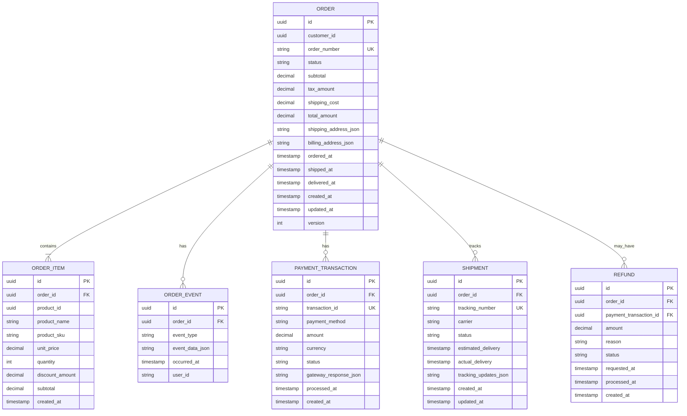

# C4 Architecture Model

Comprehensive explanation of the C4 model for visualizing software architecture through hierarchical abstraction levels.

## Overview

The **C4 model** is an easy-to-learn, developer-friendly approach to software architecture diagramming created by Simon Brown. It provides a systematic way to visualize software architecture at different levels of detail, making it accessible to both technical and non-technical audiences.

The name "C4" comes from the four hierarchical levels that form the core of the model:

1. **Context** - How the system fits into the world
2. **Container** - The high-level technical building blocks
3. **Component** - The internal structure of containers
4. **Code** - Implementation details and class structures

Unlike heavyweight modeling approaches that can overwhelm developers, the C4 model focuses on simplicity and practicality while maintaining enough rigor to be useful for architecture documentation.

## History and Origins

Simon Brown created the C4 model between 2006 and 2011 based on his experiences teaching software architecture. The diagram types were formally named in 2010, and the "C4" name was adopted in 2011. The model evolved from UML (Unified Modeling Language) and the 4+1 architectural view model, but deliberately simplifies these concepts to make architecture more accessible to modern development teams.

## Purpose and Benefits

### Why C4 Model Exists

The C4 model addresses several common challenges in software architecture documentation:

1. **Inconsistent Abstractions**: Teams often mix different levels of detail in single diagrams, creating confusion
2. **Over-complex Notations**: Formal modeling languages like UML can be intimidating and incompatible with agile workflows
3. **Missing Documentation**: Many teams skip architecture documentation entirely due to perceived complexity
4. **Poor Communication**: Architecture diagrams fail to effectively communicate with diverse audiences

### Key Benefits

**Developer-Friendly Approach:**

- Simple enough for any developer to understand and create
- No extensive training required unlike UML or ArchiMate
- Fits naturally into agile and continuous delivery workflows
- Focuses on practical communication over formal correctness

**Hierarchical Abstraction:**

- Different levels of zoom for different audiences
- Executive stakeholders see context diagrams
- Developers and architects see component and code diagrams
- Each level provides appropriate detail without overwhelming

**Notation Independence:**

- Not tied to specific diagramming tools or syntax
- Works with any diagramming tool (draw.io, Mermaid, PlantUML, etc.)
- Emphasizes clarity over strict notation rules
- Teams can adapt visual conventions to their needs

**Progressive Disclosure:**

- Start with high-level context and drill down as needed
- You don't need all four levels - use what adds value
- Most teams find context and container diagrams sufficient
- Component and code diagrams reserved for complex areas

## The Four Core Levels

### Level 1: System Context Diagram

**Purpose**: Shows how the software system fits into the world around it.

**Audience**: Everyone - executives, stakeholders, developers, operations teams.

**Contains**:

- The software system being documented (in scope)
- People who use the system (actors/personas)
- Other software systems the system interacts with (external dependencies)
- Relationships showing how they interact

**Key Questions Answered**:

- What does this system do?
- Who uses it?
- What other systems does it integrate with?
- What are the system boundaries?

**Example Elements**:

- **In Scope**: "Open Sharia Enterprise Platform - Monorepo with 8 applications"
- **External Users**: Developers, Content Authors, Learners, Enterprise Users
- **External Systems**: GitHub, Vercel, Kubernetes, Container Registry, DNS/CDN

**Best Practices**:

- Keep it high-level - no internal details
- One system context diagram per software system
- Show the big picture that everyone can understand
- Include major user types and external dependencies

**When to Use**:

- Starting point for all architecture documentation
- Presenting to non-technical stakeholders
- Onboarding new team members
- Defining system scope and boundaries

**Example: E-Commerce Microservices Platform Context**


**Diagram Explanation**:

- **In Scope** (blue): E-Commerce Microservices Platform - the distributed system we're documenting
- **People** (teal): Multiple user types with different roles and access levels
- **External Systems** (purple): Third-party services for payments, notifications, shipping, analytics, and legacy system integration
- **Relationships**: Show how diverse users and external systems interact with the platform

This high-level view answers: "What does this distributed system do?" and "How does it fit into the broader ecosystem?" Notice we don't show internal microservices here - that's for the Container diagram.

### Level 2: Container Diagram

**Purpose**: Shows the high-level technical building blocks (containers) of the system.

**Audience**: Technical stakeholders - developers, architects, operations teams.

**Contains**:

- Containers (deployable/executable units)
- Technology choices for each container
- Communication patterns between containers
- External systems from context diagram

**Important**: In C4 terminology, "container" means a deployable/executable unit like:

- Web application
- Mobile app
- Desktop application
- Database
- File system
- Microservice

NOT Docker containers (though they often align).

**Key Questions Answered**:

- What are the major technical building blocks?
- How do they communicate?
- What technology stack is used?
- What can be deployed independently?

**Example Elements**:

- **Web Containers**: ose-platform-web (Hugo Static Site), ayokoding-web (Hugo Static Site), dolphin-fe (Next.js)
- **Backend Containers**: dolphin-be (Spring Boot)
- **CLI Tools**: ayokoding-cli (Go), butler-cli (Go)
- **Test Containers**: dolphin-fe-e2e (Playwright), dolphin-be-e2e (Playwright)
- **Infrastructure**: Nx Workspace, Shared Libraries

**Best Practices**:

- One container diagram per software system
- Show major technology choices
- Include all containers that run at runtime
- Clearly label communication protocols (HTTP, gRPC, message queues)
- Color-code containers by type (frontend, backend, database, etc.)

**When to Use**:

- Explaining the overall shape of the system
- Identifying deployment boundaries
- Planning infrastructure and DevOps
- Understanding technology stack decisions

**Example: E-Commerce Microservices Platform Containers**


**Diagram Explanation**:

- **Frontend Applications** (blue): Multiple client applications (web, mobile, admin) serving different user types
- **API Gateway** (purple): Single entry point for all client requests, handles routing, auth, rate limiting
- **Microservices** (teal): Six independently deployable services, each with specific business capability
  - **User Service**: Authentication, user profiles, account management
  - **Product Service**: Product catalog, search, recommendations
  - **Order Service**: Order processing, order lifecycle management
  - **Payment Service**: Payment processing, transaction management
  - **Notification Service**: Email/SMS notifications across all domains
  - **Inventory Service**: Stock management, inventory tracking
- **Databases** (coral): Each microservice owns its database (database-per-service pattern), using different technologies based on needs
- **Message Bus** (orange): Asynchronous communication between services via events
- **Distributed Cache** (orange): Shared Redis cluster for performance optimization
- **Technology Diversity**: Different languages/frameworks chosen per service needs (polyglot architecture)

This diagram reveals the microservices architecture inside the E-Commerce Platform. Key patterns visible:

1. **Database per Service**: Each service has its own database, ensuring loose coupling
2. **API Gateway Pattern**: Centralized entry point for client requests
3. **Event-Driven Communication**: Services communicate asynchronously via message bus
4. **Polyglot Persistence**: Different database technologies (PostgreSQL, MongoDB, MySQL) based on service needs
5. **Independent Deployment**: Each microservice can be deployed, scaled, and updated independently

### Level 3: Component Diagram

**Purpose**: Shows the internal structure of a single container by breaking it down into components.

**Audience**: Developers and architects working on specific containers.

**Contains**:

- Components (groupings of related functionality)
- Component responsibilities
- Relationships between components
- External dependencies (other containers, systems)

**Important**: A "component" is a grouping of related functionality behind a well-defined interface:

- REST Controllers (API layer)
- Services (business logic)
- Repositories (data access)
- Authentication filters
- Event publishers
- Configuration managers

**Key Questions Answered**:

- How is this container structured internally?
- What are the major responsibilities?
- How do components interact?
- Where are the architectural boundaries?

**Example Elements** (from dolphin-be Spring Boot backend):

- **API Layer**: REST Controllers, API Documentation, Request Validation
- **Security Layer**: Authentication Filter, Authorization Service, Security Config
- **Business Logic Layer**: Business Services, Domain Models, Business Rules Engine
- **Data Access Layer**: Repositories, JPA Entities, Query Services
- **Integration Layer**: Event Publisher, External API Clients, Message Broker Client
- **Infrastructure**: Exception Handler, Logging Service, Configuration, Health Checks

**Best Practices**:

- Create one component diagram per container (not all containers need one)
- Only create for containers with significant internal complexity
- Group related functionality into cohesive components
- Show major dependencies between components
- Indicate technology choices for components

**When to Use**:

- Planning internal architecture of complex containers
- Explaining layered or modular architecture
- Identifying refactoring opportunities
- Onboarding developers to specific containers

**Example: Order Service Components (Java Spring Boot Microservice)**


**Diagram Explanation**:

- **API Layer** (blue): REST endpoints exposing order operations, DTOs for data transfer, validation
- **Security Layer** (purple): JWT-based authentication, security context management
- **Business Logic Layer** (teal): Core order processing logic
  - **Order Facade**: Orchestrates complex operations across multiple services
  - **Order Domain Service**: Manages order lifecycle (create, update, cancel, complete)
  - **Pricing Service**: Calculates order totals, discounts, taxes
  - **Validation Service**: Enforces business rules and constraints
- **Data Access Layer** (coral): JPA repositories, entity mappings, custom queries
- **Integration Layer**: External service clients and messaging
  - **Payment Service Client**: Synchronous REST calls to Payment Service
  - **Inventory Service Client**: Synchronous REST calls to Inventory Service
  - **Event Publisher**: Publishes domain events (OrderCreated, OrderCancelled) to Kafka
  - **Cache Manager**: Redis caching for performance
- **Infrastructure Layer** (orange): Cross-cutting concerns
  - **Exception Handler**: Centralized error handling and HTTP responses
  - **Circuit Breaker**: Fault tolerance for external service calls (Resilience4j)
  - **Metrics Collector**: Application metrics and observability (Micrometer)

This diagram shows the internal architecture of the Order Service microservice. Key patterns visible:

1. **Hexagonal Architecture**: Clear separation between domain logic and external concerns
2. **Service Clients**: HTTP clients for synchronous inter-service communication
3. **Event-Driven**: Publishes events to message bus for asynchronous communication
4. **Circuit Breaker**: Resilience pattern to handle failures in dependent services
5. **Caching**: Redis cache to reduce database load and improve response times
6. **Domain-Driven Design**: Facade and domain service separation for complex orchestration

### Level 4: Code Diagram

**Purpose**: Provides implementation-level details that can be mapped directly to code.

**Audience**: Developers implementing or maintaining specific components.

**Contains**:

- Classes, interfaces, and their relationships
- Database schemas (entity-relationship diagrams)
- Code-level design patterns
- Implementation details

**Important**: C4 model doesn't prescribe specific notation for this level. Use existing standards:

- **UML Class Diagrams**: For object-oriented code
- **Entity-Relationship Diagrams**: For database schemas
- **IDE-Generated Diagrams**: For code structure
- **Sequence Diagrams**: For runtime behavior

**Key Questions Answered**:

- How is this component implemented?
- What are the class structures?
- What is the database schema?
- What design patterns are used?

**Example Elements**:

- **UML Class Diagrams**: UserController, UserService, UserRepository, User entity, Role entity
- **Database ER Diagrams**: USER table, ROLE table, USER_ROLE junction table, AUDIT_LOG table
- **Package Structures**: Go package hierarchy for ayokoding-cli

**Best Practices**:

- Only create for critical or complex components
- Use automated diagram generation where possible (IDE tools)
- Keep diagrams focused on specific areas
- Consider whether code itself is better documentation
- Update diagrams when code changes significantly

**When to Use**:

- Documenting complex algorithms or patterns
- Explaining database schema design
- Onboarding to legacy codebases
- Capturing critical design decisions

**When NOT to Use**:

- For simple, self-documenting code
- When IDE-generated diagrams suffice
- For rapidly changing code (diagrams become stale)

**Example 1: Order Service Database Schema (Entity-Relationship Diagram)**



**Example 2: Class Diagram (Order Service Domain Model & Controllers)**


**Diagram Explanations**:

**Entity-Relationship Diagram** (Order Service Database):

- Shows the complete database schema owned by Order Service microservice
- **Key Tables**:
  - **ORDER**: Core order aggregate with status tracking, pricing, addresses (JSON), timestamps
  - **ORDER_ITEM**: Line items within order with product snapshots (name, SKU, price at time of order)
  - **ORDER_EVENT**: Event sourcing table tracking all state changes for audit trail
  - **PAYMENT_TRANSACTION**: Payment records linked to orders
  - **SHIPMENT**: Shipping tracking information per order
  - **REFUND**: Refund requests and processing status
- **Microservices Pattern**: Order Service owns this entire schema (database-per-service)
- **Denormalization**: Product details copied into ORDER_ITEM (not foreign key to Product table in another service)
- **Version Field**: Optimistic locking for concurrent updates (`version` column in ORDER table)
- **JSON Columns**: Flexible storage for addresses and complex data without rigid schema
- **Audit Trail**: ORDER_EVENT table captures complete order history

**UML Class Diagram** (Order Service Java Classes):

- Shows Spring Boot implementation architecture
- **API Layer**:
  - **OrderController**: REST endpoints (`@RestController`) handling HTTP requests
- **Orchestration Layer**:
  - **OrderFacade**: Orchestrates complex multi-step operations across services
- **Domain Layer**:
  - **OrderDomainService**: Core business logic for order lifecycle
  - **PricingService**: Handles all pricing calculations (tax, shipping, discounts)
  - **Order Entity**: Rich domain model with business methods (`@Entity`)
  - **OrderItem**: Value object within Order aggregate
  - **OrderStatus**: Enumeration with expanded states for microservices workflow
- **Data Access**:
  - **OrderRepository**: Spring Data JPA repository interface
- **Integration**:
  - **PaymentServiceClient**: Feign client calling Payment Service via REST
  - **InventoryServiceClient**: Feign client calling Inventory Service via REST
  - **EventPublisher**: Kafka producer publishing domain events
- **Resilience**:
  - **CircuitBreaker**: Resilience4j pattern protecting external calls

**Microservices Patterns Visible**:

1. **Service Clients with Circuit Breaker**: Resilient inter-service communication
2. **Event Publishing**: Domain events published to Kafka for async processing
3. **Facade Pattern**: Complex orchestration separated from domain logic
4. **Rich Domain Model**: Order entity with business methods, not anemic data holder
5. **Optimistic Locking**: Version field in Order entity for concurrency control

These code-level diagrams guide developers implementing the Order Service microservice. The ER diagram shows database-per-service isolation, while the class diagram reveals layered architecture with resilience patterns for distributed systems.

## Supplementary Diagrams

Beyond the four core levels, C4 model includes supporting diagram types:

### System Landscape Diagram

**Purpose**: Shows multiple software systems and how they relate within an organization.

**When to Use**:

- Documenting enterprise architecture
- Showing how multiple systems interact
- Providing organizational overview
- Identifying integration points across systems

**Scope**: Broader than system context - shows many systems at once.

### Dynamic Diagram

**Purpose**: Illustrates runtime behavior and interactions over time.

**Formats**:

- **Collaboration Format**: Shows objects and messages between them
- **Sequence Format**: Shows time-ordered interactions (similar to UML sequence diagrams)

**When to Use**:

- Explaining complex workflows
- Documenting authentication flows
- Showing transaction processing
- Illustrating error handling paths

**Example Use Cases**:

- User authentication flow across microservices
- Order processing with inter-service communication
- Event-driven inventory updates

**Example: Order Creation Flow (Microservices Sequence Diagram)**


**Diagram Explanation**:

This sequence diagram illustrates a complex microservices orchestration:

1. **API Gateway**: Entry point handling authentication and routing
2. **Synchronous Calls**:
   - Order Service calls Product Service for product details
   - Order Service calls Inventory Service to reserve stock
   - Order Service calls Payment Service to process payment
3. **Database Operations**: Order Service writes to its own database
4. **Asynchronous Events**:
   - Order Service publishes `OrderCreated` event to Kafka
   - Notification Service subscribes and sends confirmation email
   - Inventory Service subscribes and commits reservation
5. **Error Handling**:
   - Payment failure triggers compensation (release inventory reservation)
   - Inventory unavailability returns early error
6. **Microservices Patterns**:
   - **Saga Pattern**: Coordinated transaction across services
   - **Compensation**: Rollback actions on failure (release reservation)
   - **Event-Driven**: Async notifications via message bus
   - **Circuit Breaker**: (Not shown) Protects against cascading failures

This diagram reveals the complexity of distributed systems: synchronous service-to-service calls, asynchronous event propagation, compensation logic, and multiple failure scenarios. Compare this to a monolithic sequence diagram to see the trade-offs of microservices architecture.

### Deployment Diagram

**Purpose**: Maps software containers to infrastructure and deployment environments.

**Contains**:

- Infrastructure nodes (servers, containers, cloud services)
- Deployed containers
- Deployment environments (dev, staging, prod)
- Network boundaries and security zones

**When to Use**:

- Planning infrastructure provisioning
- Documenting deployment architecture
- Explaining multi-environment setups
- Identifying scaling opportunities

**Example Elements**:

- Cloud platforms (AWS, Azure, Vercel)
- Kubernetes clusters
- Multi-environment setup (dev, staging, prod)
- Container orchestration and load balancers

**Example: Microservices on Kubernetes (Production Deployment)**


**Diagram Explanation**:

This deployment diagram shows microservices deployed to Kubernetes production cluster:

**Infrastructure Components**:

- **Cloud Load Balancer**: External entry point (AWS ALB, GCP GLB, Azure Load Balancer)
- **Ingress Controller**: Kubernetes ingress routing traffic to services (NGINX, Traefik)
- **Namespaces**: Logical isolation (API Gateway namespace, Microservices namespace)
- **Pods**: Kubernetes deployment units, each running one or more containers
- **StatefulSets**: For stateful applications (databases) with persistent storage
- **Kafka Cluster**: 3-broker cluster for high availability and event streaming

**Microservices Deployment**:

- **Order Service**: 2 pod replicas (horizontal scaling)
- **Product Service**: 1 pod (can scale horizontally)
- **Payment Service**: 1 pod (stateless, can scale)
- **Inventory Service**: 1 pod (handles inventory events)
- **Notification Service**: 1 pod (consumes Kafka events)

**Database-per-Service**:

- Each microservice has its own database (StatefulSet with persistent volumes)
- Different database technologies: PostgreSQL, MongoDB, MySQL
- No shared databases - enforces loose coupling

**Messaging Infrastructure**:

- **Kafka Cluster**: 3 brokers for fault tolerance
- **Event Streaming**: Asynchronous communication between services
- **Replication**: Kafka brokers replicate data for durability

**Key Deployment Patterns**:

1. **Container Orchestration**: Kubernetes manages scheduling, scaling, self-healing
2. **Service Discovery**: Kubernetes DNS for service-to-service communication
3. **Horizontal Scaling**: Multiple pod replicas with load balancing
4. **StatefulSets**: Persistent storage for databases
5. **Namespace Isolation**: Logical separation of concerns
6. **External Services**: Managed third-party APIs (Stripe, SendGrid, Twilio)

**Not Shown** (implied by Kubernetes):

- Health checks (liveness/readiness probes)
- Auto-scaling (HPA - Horizontal Pod Autoscaler)
- ConfigMaps and Secrets for configuration
- Service mesh (Istio/Linkerd) for observability
- Persistent volumes for StatefulSets

This diagram helps DevOps teams understand deployment topology, scaling strategies, and infrastructure dependencies that are invisible in Container diagrams. The complexity of deploying microservices on Kubernetes becomes clear compared to monolithic deployments.

## Notation and Conventions

### Core Abstractions

The C4 model uses five fundamental elements:

1. **Person**: Human users or actors (internal or external)
2. **Software System**: The highest level of abstraction (the system being documented or external systems)
3. **Container**: Deployable/executable unit (application, database, file system)
4. **Component**: Grouping of related functionality within a container
5. **Relationship**: Line connecting elements showing interaction

### Visual Conventions

**Flexibility First**:

The C4 model is deliberately notation-independent. Rather than prescribing specific shapes or colors, it emphasizes:

- **Clarity**: Diagrams should be immediately understandable
- **Consistency**: Use the same visual language within and across diagrams
- **Accessibility**: Consider color blindness and black-and-white printing

**Required Elements**:

Every C4 diagram must include:

1. **Title**: Describing diagram type and scope (e.g., "System Context - Open Sharia Enterprise")
2. **Key/Legend**: Explaining notation used (shapes, colors, line styles, etc.)
3. **Element Types**: Explicitly labeling each element type (Person, Software System, Container, Component)

**Element Labeling**:

Each element should show:

- **Name**: Clear, descriptive name
- **Type**: Element type in brackets (e.g., [Software System], [Container: Next.js])
- **Description**: Brief summary of responsibilities (one line)
- **Technology** (for containers/components): Technology stack or implementation approach

Example:

```
dolphin-be
[Container: Spring Boot]
Backend services for enterprise applications
```

**Relationship Labeling**:

Lines connecting elements should:

- Be **unidirectional** (show direction with arrow)
- Show **single relationship** per line (not bidirectional)
- Include **descriptive label** (better than generic "Uses")
- Specify **technology/protocol** for inter-process communication (HTTP/REST, gRPC, WebSocket, etc.)

Example relationships:

- "Reads from and writes to [JDBC/SQL]"
- "Makes REST API calls to [HTTPS]"
- "Publishes events to [RabbitMQ/AMQP]"
- "Authenticates using [OAuth 2.0]"

### Color Coding

Colors are not mandated but recommended for clarity:

**Common Conventions**:

- **In-scope system/containers**: Blue or primary color
- **External systems**: Gray or muted color
- **People/actors**: Green or distinct color
- **Databases**: Red or contrasting color
- **Background/grouping**: Light colors for subgraphs

**Accessibility Considerations**:

- Use patterns or labels in addition to color
- Test for color blindness compatibility
- Ensure sufficient contrast for readability
- Consider black-and-white printing

**Example from Open Sharia Enterprise**:

```
- Open Sharia Enterprise Platform: #0077b6 (primary blue)
- External Users: #2a9d8f (teal)
- External Systems: #6a4c93 (purple)
- Backend Services: #e76f51 (coral)
- Test Suites: #f4a261 (orange)
- Infrastructure: #457b9d (slate blue)
- Databases: #9d0208 (dark red)
```

## When to Use the C4 Model

### Ideal Use Cases

**Custom-Built Software Systems**:

The C4 model works best for:

- Custom applications developed in-house
- Microservices architectures
- Web applications and APIs
- Mobile applications
- Cloud-native systems
- Monorepo architectures (like Nx workspaces)

**Team Contexts**:

Particularly valuable when:

- Teams find UML/ArchiMate too complex or heavyweight
- You need architecture documentation that developers will actually maintain
- Multiple audiences need different levels of detail
- Agile/continuous delivery workflows require lightweight documentation
- New team members need onboarding materials

### When C4 May Not Fit

**Not Universally Applicable**:

The C4 model has limitations for:

- **Embedded Systems**: Hardware-software integration needs different abstractions
- **Heavily Customized Enterprise Solutions**: SAP, Salesforce with extensive customization
- **Infrastructure-as-Code Only**: Systems without custom software components
- **Business Process Modeling**: Use BPMN for process flows, not C4

**Supplementary Diagrams Needed**:

C4 focuses on **static structure**. You'll need other diagram types for:

- **Business Processes**: Use BPMN (Business Process Model and Notation)
- **State Machines**: Use UML state diagrams
- **Data Models**: Use Entity-Relationship Diagrams
- **Network Topology**: Use infrastructure diagrams

**Scaling Considerations**:

For very large systems:

- Avoid single diagrams with hundreds of elements
- Create multiple focused diagrams around:
  - Business domains or bounded contexts
  - Individual microservices
  - Specific integration points
- Use system landscape diagrams for organization-wide view

## Comparison to Other Approaches

### C4 vs. UML (Unified Modeling Language)

**UML**:

- **Pros**: Comprehensive, standardized, supports many diagram types
- **Cons**: Complex, steep learning curve, can be overwhelming for teams

**C4**:

- **Pros**: Simple, developer-friendly, easier to learn and maintain
- **Cons**: Less comprehensive, focuses only on structure (not behavior extensively)

**Relationship**:

C4 is a **simplified version** of UML concepts:

- C4 component diagrams ≈ UML component diagrams (but simpler)
- C4 code diagrams often use UML class diagrams
- C4 dynamic diagrams ≈ UML sequence diagrams

**When to Choose**:

- **Use UML** if your team already successfully uses it and has expertise
- **Use C4** if UML feels too heavyweight or incompatible with your agile workflow
- **Use Both** - C4 for high-level architecture, UML for detailed design

### C4 vs. arc42

**arc42**:

- Template-based architecture documentation framework
- Comprehensive sections for all architecture concerns
- More than just diagrams - includes decisions, quality requirements, etc.

**C4**:

- Focused specifically on architecture visualization
- Hierarchical diagram approach
- Less prescriptive about documentation structure

**Relationship**:

C4 and arc42 **complement each other**:

- **C4 System Context** → arc42 "Context and Scope"
- **C4 Container Diagram** → arc42 "Building Block View (Level 1)"
- **C4 Component Diagram** → arc42 "Building Block View (Level 2)"
- **C4 Code Diagram** → arc42 "Building Block View (Level 3)"

**When to Choose**:

- **Use arc42** for comprehensive architecture documentation framework
- **Use C4** for architecture visualization specifically
- **Use Both** - C4 diagrams within arc42 structure

### C4 vs. 4+1 View Model

**4+1 View Model**:

- Five views: Logical, Development, Process, Physical, and Scenarios (+1)
- Academic and comprehensive
- Separates concerns across multiple views

**C4**:

- Four hierarchical levels of the same system
- Single progression from context to code
- Simpler and more pragmatic

**Relationship**:

C4 evolved from 4+1 but deliberately simplifies:

- C4 focuses on hierarchical zoom levels
- 4+1 separates different architectural perspectives
- C4 prioritizes ease of use over comprehensive coverage

## Best Practices

### Creating Effective C4 Diagrams

**Start High, Drill Down**:

1. Always begin with System Context diagram
2. Create Container diagram for overall architecture
3. Only create Component diagrams where complexity justifies it
4. Reserve Code diagrams for truly complex components

**You Don't Need All Four Levels**:

Most teams find **Context + Container diagrams sufficient** for documentation needs. Component and Code diagrams add value only for:

- Complex containers with significant internal structure
- Areas requiring detailed documentation
- Legacy code needing explanation
- Onboarding-critical components

**Focus on Value**:

Ask: "Does this diagram help someone understand the system better?"

If not, skip it. Over-documentation wastes time and becomes outdated quickly.

### Diagram Quality Guidelines

**Keep Diagrams Focused**:

- **Small Systems**: 1 context diagram, 1 container diagram
- **Medium Systems**: 1 context, 1 container, 2-3 component diagrams
- **Large Systems**: 1 landscape, multiple context diagrams (per bounded context), focused container/component diagrams

**Avoid Clutter**:

- Don't show hundreds of elements in one diagram
- Split large systems into multiple focused diagrams
- Group related containers into subgraphs
- Show only relevant relationships (not every possible connection)

**Use Consistent Notation**:

- Establish team conventions for shapes and colors
- Document your notation choices in diagram keys
- Apply same style across all diagrams
- Update diagrams when notation changes

**Keep Diagrams Updated**:

- Review during architecture changes
- Update as part of feature development
- Automate diagram generation where possible
- Don't create diagrams you won't maintain

### Team Collaboration

**Shared Ownership**:

- Don't assume architects create container diagrams and developers create code diagrams
- Encourage team collaboration on all levels
- Use diagrams as communication tools, not deliverables
- Iterate and refine diagrams together

**Tool Selection**:

- Choose tools that team actually uses (not perfect tools they ignore)
- Prefer tools that integrate with version control
- Consider diagram-as-code approaches (Mermaid, PlantUML, Structurizr DSL)
- Balance power with ease of use

**Documentation Culture**:

- Make architecture documentation part of definition of done
- Review diagrams during code reviews
- Use diagrams in team meetings and presentations
- Celebrate good documentation examples

## Limitations and Scope

### What C4 Doesn't Cover

**Static Structure Only**:

C4 primarily focuses on **static architecture** (boxes and lines showing structure). For runtime behavior, supplement with:

- **Dynamic Diagrams** (C4 supplementary type)
- **Sequence Diagrams** (UML)
- **BPMN Process Flows**
- **State Machine Diagrams**

**Not a Complete Documentation Framework**:

C4 doesn't address:

- Architecture Decision Records (ADRs)
- Quality attribute scenarios
- Architectural principles and constraints
- Technology radar or standards
- Deployment procedures
- Operational runbooks

Consider combining C4 with comprehensive frameworks like arc42 for full coverage.

### Common Mistakes to Avoid

**Mixing Abstraction Levels**:

- Don't mix context-level and component-level details in same diagram
- Keep each diagram focused on its level
- Use hierarchical links between diagrams instead

**Over-Documenting**:

- Creating diagrams for every container (when many are simple)
- Documenting implementation details that change frequently
- Making diagrams no one reads or maintains

**Under-Labeling**:

- Missing diagram titles or keys
- Unlabeled relationships ("uses" doesn't say much)
- No technology indicators on containers
- Missing element type specifications

**Stale Documentation**:

- Creating diagrams once and never updating
- Diagrams contradicting actual architecture
- No process for keeping diagrams current

**Tool Obsession**:

- Spending more time on tooling than documentation
- Choosing complex tools that team won't adopt
- Over-engineering diagram generation

## C4 Model in This Repository

### Current Usage

The Open Sharia Enterprise platform uses C4 model for architecture documentation in:

**Reference Documentation**: [docs/reference/re\_\_system-architecture.md](../reference/re__system-architecture.md)

**C4 Levels Implemented**:

1. **System Context** (Level 1): Shows OSE platform, users, and external systems
2. **Container Diagram** (Level 2): Shows 8 applications across technology stacks
3. **Component Diagrams** (Level 3): Detailed breakdowns for:
   - dolphin-be (Spring Boot backend)
   - dolphin-fe (Next.js frontend)
   - ayokoding-cli (Go CLI tool)
   - butler-cli (Go CLI tool)
   - ose-platform-web (Hugo static site)
   - ayokoding-web (Hugo static site)
   - E2E test suites (Playwright)
4. **Code Diagrams** (Level 4): Includes:
   - Database ER diagrams for dolphin-be
   - Class diagrams for Spring Boot architecture
   - Component hierarchies for React/Next.js
   - Package structures for Go applications

**Supplementary Diagrams**:

- **Dynamic Diagrams**: Sequence diagrams for authentication flows, transaction processing, content pipeline
- **Deployment Diagrams**: Multi-environment deployment architecture (local, dev, staging, prod)

### Diagramming Approach

**Tool**: Mermaid diagrams (text-based, version-controlled)

**Color Palette**: WCAG-compliant, color-blind friendly palette from [governance/conventions/formatting/diagrams.md](../../governance/conventions/formatting/diagrams.md)

**Accessibility**: All diagrams include proper legends and contrast ratios meeting WCAG AA standards

### Learning from Examples

To see C4 model in practice, review:

1. **System Context Diagram**: High-level view of platform and integrations
2. **Container Diagram**: Technical building blocks and communication patterns
3. **Component Diagrams**: Internal architecture of complex containers
4. **Sequence Diagrams**: Runtime flows and interactions

These diagrams demonstrate how C4 model scales from simple overview to detailed implementation documentation while maintaining clarity at each level.

## Further Learning

### Official Resources

**Primary Documentation**:

- [C4 Model Official Website](https://c4model.com/) - Comprehensive guide and examples
- [Simon Brown's Website](https://simonbrown.je/) - Creator's blog and presentations
- [C4 Model FAQ](https://c4model.com/faq) - Common questions and best practices

**Books**:

- [The C4 Model for Visualising Software Architecture](https://leanpub.com/visualising-software-architecture) - Comprehensive book by Simon Brown
- [The C4 Model (O'Reilly, 2026)](https://www.oreilly.com/library/view/the-c4-model/9798341660113/) - New edition with early access

**Additional Materials**:

- [C4 Model Wikipedia](https://en.wikipedia.org/wiki/C4_model) - Overview and history
- [Diagrams | C4 model](https://c4model.com/diagrams) - Detailed diagram type explanations
- [Notation | C4 model](https://c4model.com/diagrams/notation) - Visual conventions guide

### Community and Tools

**Diagramming Tools**:

- **Structurizr**: Purpose-built tool for C4 diagrams (by Simon Brown)
- **PlantUML**: C4-PlantUML library for text-based diagrams
- **Mermaid**: C4 diagram support in markdown-based tool
- **draw.io**: Visual diagramming tool with C4 stencils
- **Lucidchart**: Commercial tool with C4 templates

**Resources**:

- [C4-PlantUML GitHub](https://github.com/plantuml-stdlib/C4-PlantUML) - PlantUML integration
- Workshop materials and conference talks by Simon Brown
- Case studies from organizations using C4 model

## Related Documentation

**Repository Architecture**:

- [System Architecture Reference](../reference/re__system-architecture.md) - C4 diagrams for OSE platform
- [Monorepo Structure Reference](../reference/re__monorepo-structure.md) - Nx workspace architecture
- [Repository Governance Architecture](../../governance/repository-governance-architecture.md) - Six-layer governance

**Documentation Standards**:

- [Diátaxis Framework](../../governance/conventions/meta/diataxis-framework.md) - Documentation organization
- [Diagrams Convention](../../governance/conventions/formatting/diagrams.md) - Mermaid diagram standards
- [Accessible Diagrams Skill](../../.claude/skills/docs-creating-accessible-diagrams/SKILL.md) - WCAG-compliant color palette

**Development Practices**:

- [Simplicity Over Complexity Principle](../../governance/principles/general/simplicity-over-complexity.md) - Why C4 model fits our values
- [Explicit Over Implicit Principle](../../governance/principles/software-engineering/explicit-over-implicit.md) - Clear architecture documentation

## Sources

This document was created using information from the following authoritative sources:

- [Home | C4 model](https://c4model.com/) - Official C4 model website
- [FAQ | C4 model](https://c4model.com/faq) - Frequently asked questions and best practices
- [Diagrams | C4 model](https://c4model.com/diagrams) - Diagram types and usage guide
- [Notation | C4 model](https://c4model.com/diagrams/notation) - Visual notation conventions
- [The C4 Model [Book]](https://www.oreilly.com/library/view/the-c4-model/9798341660113/) - O'Reilly book (2026 edition)
- [Simon Brown](https://simonbrown.je) - Creator's website and resources
- [C4 model - Wikipedia](https://en.wikipedia.org/wiki/C4_model) - Overview and history
- [What is C4 Model? Complete Guide for Software Architecture](https://miro.com/diagramming/c4-model-for-software-architecture/) - Miro guide
- [C4 Model: Importance, Use Cases, and Examples](https://www.codesee.io/learning-center/c4-model) - CodeSee learning center
- [The C4 Model for Software Architecture - InfoQ](https://www.infoq.com/articles/C4-architecture-model/) - InfoQ article

---

**Document Metadata**:

- **Created**: 2026-01-18
- **Author**: Claude Code (AI agent)
- **License**: MIT (same as repository)
- **Validation**: Web-searched and verified against official C4 model sources
