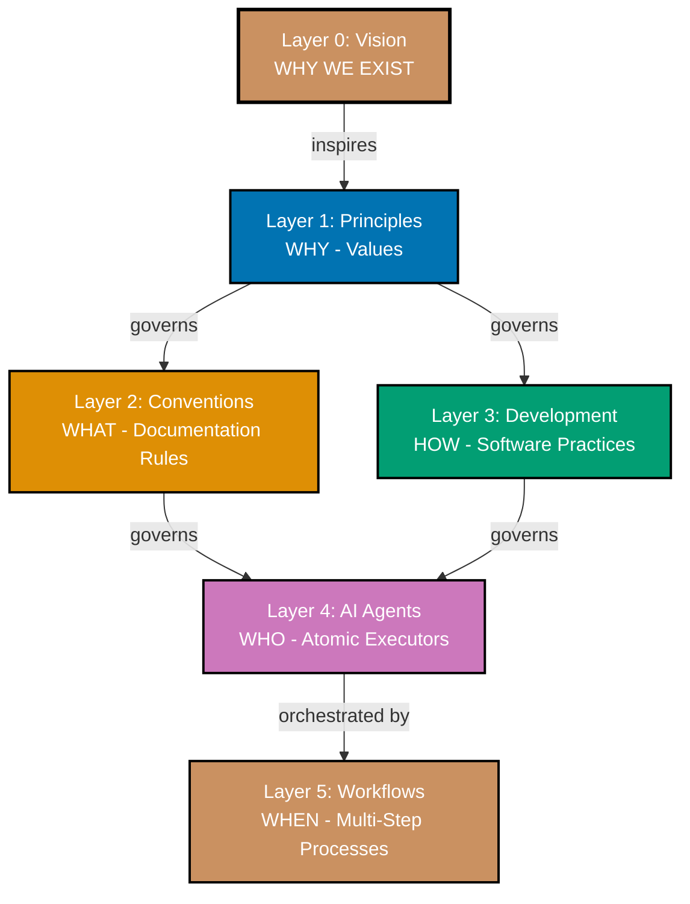

# Repository Architecture: Six-Layer Hierarchy

This document explains the complete six-layer architecture that governs the open-sharia-enterprise repository. Each layer builds on the foundation of the layer above, creating a traceable hierarchy from foundational purpose to automated workflows.

## 🎯 Purpose

The six-layer architecture provides:

1. **Clear governance** - Each layer governs the layer below
2. **Complete traceability** - Every rule traces back to foundational vision and principles
3. **Separation of concerns** - Vision, values, standards, practices, implementation, and orchestration are distinct
4. **Systematic consistency** - Changes propagate through layers in a predictable way

## 📊 The Six Layers



### Layer 0: Vision (WHY WE EXIST)

**Location**: `docs/explanation/vision/`

**Purpose**: Foundational purpose establishing WHY the project exists and WHAT change we seek.

**Key Document**: [Vision - Open Sharia Enterprise](./vision/ex-vi__open-sharia-enterprise.md)

**Core Vision**:

- **Democratize Shariah-compliant enterprise** - Making ethical Islamic business solutions accessible to everyone
- **Problem**: Islamic finance locked in closed, expensive, proprietary systems
- **Solution**: Open-source halal enterprise solutions that anyone can build, deploy, and benefit from
- **Success metric**: When anyone globally can access, understand, and contribute to Islamic enterprise

**Characteristics**:

- Immutable foundational purpose
- Answers: "Why does this project exist?"
- Changes extremely rarely (only if mission fundamentally shifts)
- All other layers serve this vision

**Example**:

> "We exist to democratize Islamic finance by providing open-source, accessible, and verifiable enterprise solutions that anyone can use, understand, and contribute to."

### Layer 1: Principles (WHY - Foundational Values)

**Location**: `docs/explanation/principles/`

**Purpose**: Foundational values that serve the vision and govern all conventions and development practices.

**Key Document**: [Core Principles Index](./principles/README.md)

**Six Principles**:

1. **Explicit Over Implicit** - Transparent configuration, no magic
2. **Accessibility First** - WCAG compliance, universal design
3. **Simplicity Over Complexity** - Flat structures, KISS/YAGNI
4. **Automation Over Manual** - Git hooks, AI agents
5. **Progressive Disclosure** - Layer complexity gradually
6. **No Time Estimates** - Outcomes over duration

**Characteristics**:

- Stable values that rarely change
- Each principle must include "Vision Supported" section
- Answers: "Why do we value this approach?"
- Governs both conventions (documentation) and development (software)

**Example Traceability**:

```
Vision: "Accessible to everyone"
    ↓ inspires
Principle: Accessibility First
    ↓ governs
Convention: Color Accessibility Convention (verified accessible palette)
Development: Hugo Development Convention (semantic HTML, ARIA labels)
```

### Layer 2: Conventions (WHAT - Documentation Rules)

**Location**: `docs/explanation/conventions/`

**Purpose**: Documentation standards that implement core principles. Defines WHAT rules we follow for writing, organizing, and formatting documentation.

**Key Document**: [Conventions Index](./conventions/README.md)

**Scope**: Documentation rules for:

- docs/ directory (all markdown files)
- Hugo sites (ayokoding-web, ose-platform-web)
- plans/ directory
- README files across repository

**Example Conventions**:

- **File Naming Convention** - `[prefix]__[content-identifier].[extension]`
- **Linking Convention** - GitHub-compatible relative paths with `.md`
- **Color Accessibility Convention** - Verified color-blind friendly palette
- **Content Quality Principles** - Active voice, proper heading hierarchy, alt text
- **Diátaxis Framework** - Four documentation types (Tutorials, How-To, Reference, Explanation)

**Characteristics**:

- Each convention MUST include "Principles Implemented/Respected" section
- Implemented by AI agents (Layer 4)
- Changes more frequently than principles
- Answers: "What documentation rules do we follow?"

**Example Traceability**:

```
Principle: Explicit Over Implicit
    ↓ governs
Convention: File Naming Convention (explicit prefixes encode directory path)
    ↓ governs
Agent: docs-file-manager (enforces naming when renaming files)
```

### Layer 3: Development (HOW - Software Practices)

**Location**: `docs/explanation/development/`

**Purpose**: Software practices that implement core principles. Defines HOW we develop, test, and deploy software.

**Key Document**: [Development Index](./development/README.md)

**Scope**: Software practices for:

- Source code (JavaScript, TypeScript, future: Java, Kotlin, Python)
- Hugo themes and layouts
- Build systems and tooling
- AI agents (.claude/agents/)
- Git workflows

**Example Practices**:

- **Trunk Based Development** - Single main branch, small frequent commits
- **Code Quality Convention** - Git hooks (Prettier, Commitlint, pre-push tests)
- **AI Agents Convention** - Agent structure, frontmatter, tool permissions
- **Maker-Checker-Fixer Pattern** - Three-stage workflow for quality
- **Implementation Workflow** - Make it work, make it right, make it fast

**Characteristics**:

- Each practice MUST include both "Principles Implemented/Respected" AND "Conventions Implemented/Respected" sections
- Implemented by AI agents (Layer 4) and automation (git hooks, build tools)
- Changes more frequently than conventions
- Answers: "How do we develop software?"

**Example Traceability**:

```
Principle: Automation Over Manual
    ↓ governs
Development: Code Quality Convention (automated git hooks)
    ↓ governs
Implementation: Husky + lint-staged (pre-commit formatting)
```

### Layer 4: AI Agents (WHO - Atomic Task Executors)

**Location**: `.claude/agents/`

**Purpose**: Automated implementers that enforce conventions and development practices. Each agent implements and validates specific rules from layers 2 and 3.

**Key Document**: [Agents Index](../.claude/agents/README.md)

**Agent Families**:

- **Makers** - Create/update content (docs-maker, readme-maker, plan-maker)
- **Checkers** - Validate quality (docs-checker, repo-rules-checker, plan-checker)
- **Fixers** - Apply validated fixes (docs-fixer, repo-rules-fixer, plan-fixer)
- **Navigation** - Manage structure (ayokoding-navigation-maker, ayokoding-structure-maker)
- **Operations** - Deploy and manage (ayokoding-deployer, docs-file-manager)

**Characteristics**:

- Each agent enforces specific conventions or practices
- Agents are atomic - one clear responsibility
- Frontmatter includes: name, description, tools, model, color
- Answers: "Who enforces the rules?"

**Example Traceability**:

```
Convention: Color Accessibility Convention
    ↓ implemented by
Agent: docs-checker (validates diagram colors against palette)
Agent: docs-fixer (applies color corrections)
    ↓ orchestrated by
Workflow: Maker-Checker-Fixer (Layer 5)
```

### Layer 5: Workflows (WHEN - Multi-Step Processes)

**Location**: `docs/explanation/workflows/`

**Purpose**: Orchestrated multi-step processes that compose AI agents to achieve specific goals with clear termination criteria.

**Key Document**: [Workflows Index](./workflows/README.md)

**Workflow Families**:

- **Maker-Checker-Fixer** - Content quality (docs, readme, ayokoding, ose-platform)
- **Check-Fix** - Iterative validation (ayokoding-check-fix, docs-check-fix)
- **Plan-Execute-Validate** - Project planning workflow

**Characteristics**:

- Define sequences (sequential/parallel/conditional)
- Manage state between steps
- Include human approval checkpoints
- Have clear termination criteria (exit conditions)
- Answers: "When do we run which agents in what order?"

**Example Workflow**:

```
Maker-Checker-Fixer Workflow:
1. Maker creates content → output: draft files
2. Checker validates → output: audit report
3. User reviews audit → decision: approve/reject
4. Fixer applies validated fixes → output: corrected files
5. Terminate when: all HIGH/MEDIUM findings resolved
```

## 🔗 Complete Traceability Examples

### Example 1: Color Accessibility

**Layer 0 - Vision**: Democratize Islamic enterprise → accessible to everyone

**Layer 1 - Principle**: [Accessibility First](./principles/content/ex-pr-co__accessibility-first.md)

- Vision supported: Accessible tools enable global participation in Islamic finance
- Key value: Design for universal access from the start

**Layer 2 - Convention**: [Color Accessibility Convention](./conventions/ex-co__color-accessibility.md)

- Implements: Accessibility First principle
- Rule: Use only verified color-blind friendly palette (Blue, Orange, Teal, Purple, Brown)
- WCAG AA compliance required

**Layer 3 - Development**: [AI Agents Convention](./development/ex-de__ai-agents.md)

- Respects: Color Accessibility Convention
- Practice: Agent color categorization uses accessible palette
- Implementation: Frontmatter `color` field limited to accessible colors

**Layer 4 - Agents**:

- **docs-checker**: Validates diagram colors against palette
- **docs-fixer**: Applies color corrections to non-compliant diagrams
- **agent-maker**: Validates new agents use accessible colors in frontmatter

**Layer 5 - Workflow**: [Maker-Checker-Fixer](./workflows/ex-wf__maker-checker-fixer.md)

- Orchestrates: docs-maker → docs-checker → docs-fixer
- Ensures: All diagrams use accessible colors through automated validation and fixing

### Example 2: Explicit Configuration

**Layer 0 - Vision**: Transparent, verifiable Islamic enterprise

**Layer 1 - Principle**: [Explicit Over Implicit](./principles/software-engineering/ex-pr-se__explicit-over-implicit.md)

- Vision supported: Transparency enables verification of Shariah compliance
- Key value: Code should be transparent and understandable

**Layer 2 - Convention**: [File Naming Convention](./conventions/ex-co__file-naming-convention.md)

- Implements: Explicit Over Implicit principle
- Rule: Prefix encodes directory path explicitly (`ex-co__` = explanation/conventions/)

**Layer 3 - Development**: [AI Agents Convention](./development/ex-de__ai-agents.md)

- Respects: File Naming Convention
- Practice: Agent files use kebab-case, explicit tool permissions in frontmatter
- Implementation: No default tool access, all tools explicitly whitelisted

**Layer 4 - Agents**:

- **agent-maker**: Validates new agents have explicit tools field
- **repo-rules-checker**: Audits agents for missing tool declarations
- **docs-file-manager**: Enforces naming convention when renaming files

**Layer 5 - Workflow**: [Repo-Rules-Check-Fix](./workflows/ex-wf__repo-rules-check-fix.md)

- Orchestrates: repo-rules-checker → repo-rules-fixer
- Ensures: All agents maintain explicit tool permissions

### Example 3: Automation for Consistency

**Layer 0 - Vision**: Reliable, trustworthy Islamic enterprise systems

**Layer 1 - Principle**: [Automation Over Manual](./principles/software-engineering/ex-pr-se__automation-over-manual.md)

- Vision supported: Automation ensures consistent Shariah compliance validation
- Key value: Machines handle repetitive tasks, humans focus on creative work

**Layer 2 - Convention**: [Content Quality Principles](./conventions/ex-co__content-quality.md)

- Implements: Automation Over Manual principle
- Rule: Automated validation of active voice, heading hierarchy, alt text

**Layer 3 - Development**: [Code Quality Convention](./development/ex-de__code-quality.md)

- Respects: Content Quality Principles
- Practice: Git hooks automate formatting and validation
- Implementation: Husky + lint-staged + Prettier + Commitlint

**Layer 4 - Agents**:

- **docs-checker**: Automated content quality validation
- **ayokoding-content-general-checker**: Automated general Hugo content validation
- **ayokoding-content-by-example-checker**: Automated by-example tutorial validation
- **plan-checker**: Automated plan completeness validation

**Layer 5 - Workflow**: [Ayokoding-Check-Fix](./workflows/ex-wf__ayokoding-check-fix.md)

- Orchestrates: ayokoding-content-general-checker → ayokoding-content-general-fixer
- Ensures: All Hugo content meets quality standards through automated iteration

## 🏗️ Using the Architecture

### When Creating New Content

**Question**: "Where does my new document go?"

**Answer**: Determine the layer:

- **Vision** - Only if changing fundamental project purpose (extremely rare)
- **Principles** - If defining a foundational VALUE that governs decisions
- **Conventions** - If defining WHAT documentation rules to follow
- **Development** - If defining HOW to develop software
- **Workflows** - If orchestrating multiple agents in a repeatable sequence

**Process**:

1. Identify the layer based on "what question does this answer?"
2. Create document in appropriate directory
3. Add traceability sections (Principles/Conventions Implemented/Respected)
4. Update index files
5. Use repo-rules-maker to propagate changes

### When Making Changes

**Process**:

1. **Start at the appropriate layer** - Don't modify Vision unless mission changes
2. **Check dependencies** - What layers depend on this change?
3. **Update traceability** - Ensure all references are updated
4. **Propagate changes** - Use repo-rules-maker to update CLAUDE.md, indices, agents
5. **Validate** - Use repo-rules-checker to verify consistency

**Example**: Adding a new principle

1. Create principle document in `docs/explanation/principles/`
2. Add "Vision Supported" section showing how it serves the vision
3. Update `docs/explanation/principles/README.md` index
4. Use repo-rules-maker to propagate to CLAUDE.md
5. Create conventions/practices that implement the principle
6. Create/update agents to enforce the principle

### When Troubleshooting

**Question**: "Why do we have this rule?"

**Answer**: Trace up the layers:

1. **Start at the rule** - Find the convention or practice
2. **Check traceability** - Read "Principles Implemented/Respected" section
3. **Read the principle** - Understand the foundational value
4. **Check vision alignment** - See "Vision Supported" section in principle
5. **Understand the WHY** - Now you know why the rule exists

**Example**: "Why do we use `ex-co__` prefixes in filenames?"

```
Rule: File Naming Convention (Layer 2)
    ↓ implements
Principle: Explicit Over Implicit (Layer 1)
    ↓ serves
Vision: Transparent, verifiable systems (Layer 0)

Answer: Explicit prefixes make file locations transparent without
opening files, supporting our vision of verifiable systems.
```

## 🎯 Key Principles

### Immutability Decreases Down the Layers

- **Layer 0 (Vision)**: Nearly immutable - only changes if mission fundamentally shifts
- **Layer 1 (Principles)**: Very stable - rarely change, require strong justification
- **Layer 2 (Conventions)**: Moderately stable - change when documentation needs evolve
- **Layer 3 (Development)**: Moderately stable - change when software practices evolve
- **Layer 4 (Agents)**: Changes frequently - new agents added, existing agents updated
- **Layer 5 (Workflows)**: Changes frequently - new workflows as needs emerge

### Traceability is Mandatory

Every convention, practice, and agent MUST be traceable:

- **Conventions** → MUST include "Principles Implemented/Respected" section
- **Development practices** → MUST include both "Principles" AND "Conventions" sections
- **Agents** → MUST reference which conventions/practices they enforce (in description or documentation)
- **Workflows** → MUST reference which agents they orchestrate (in definition)

### Changes Propagate Down

When changing a layer, all lower layers may need updates:

- **Vision change** → May require principle, convention, practice, agent, workflow updates
- **Principle change** → May require convention, practice, agent, workflow updates
- **Convention change** → May require agent and workflow updates
- **Practice change** → May require agent and workflow updates
- **Agent change** → May require workflow updates

Use **repo-rules-maker** to propagate changes systematically.

## 🔍 Verification and Validation

### Layer Alignment Checks

**repo-rules-checker** validates:

1. All conventions reference principles
2. All practices reference both principles and conventions
3. All agents reference conventions/practices
4. No circular dependencies between layers
5. CLAUDE.md consistent with convention/practice documents

### Traceability Audits

Periodically verify:

1. Every convention traces to at least one principle
2. Every practice traces to principles AND conventions
3. Every agent enforces specific conventions/practices
4. Every workflow orchestrates appropriate agents
5. All "Vision Supported" sections accurately describe alignment

## 📚 Related Documentation

**Layer 0**:

- [Vision - Open Sharia Enterprise](./vision/ex-vi__open-sharia-enterprise.md)

**Layer 1**:

- [Core Principles Index](./principles/README.md)
- Individual principles in `docs/explanation/principles/`

**Layer 2**:

- [Conventions Index](./conventions/README.md)
- 22 convention documents in `docs/explanation/conventions/`

**Layer 3**:

- [Development Index](./development/README.md)
- 12 practice documents in `docs/explanation/development/`

**Layer 4**:

- [Agents Index](../.claude/agents/README.md)
- Agent files in `.claude/agents/`

**Layer 5**:

- [Workflows Index](./workflows/README.md)
- [Workflow Pattern Convention](./workflows/ex-wf__workflow-pattern.md)

**Meta-Documentation**:

- [Diátaxis Framework](./conventions/ex-co__diataxis-framework.md) - Four documentation types
- [Convention Writing Convention](./conventions/ex-co__convention-writing.md) - How to write conventions
- [AI Agents Convention](./development/ex-de__ai-agents.md) - How to create agents

## Principles Implemented/Respected

**REQUIRED SECTION**: All explanation documents providing architectural guidance must include this section.

This architecture document implements/respects the following principles:

- **[Explicit Over Implicit](./principles/software-engineering/ex-pr-se__explicit-over-implicit.md)**: The six-layer architecture explicitly defines the governance hierarchy, making relationships between vision, principles, conventions, practices, agents, and workflows transparent and traceable.

- **[Simplicity Over Complexity](./principles/general/ex-pr-ge__simplicity-over-complexity.md)**: The linear hierarchy (0→1→2→3→4→5) provides a simple mental model. Each layer has a clear purpose, avoiding complex cross-dependencies or matrix structures.

- **[Progressive Disclosure](./principles/content/ex-pr-co__progressive-disclosure.md)**: The architecture layers complexity - beginners understand vision and principles, intermediate users work with conventions/practices, advanced users create agents and workflows.

---

**Last Updated**: 2025-12-24
