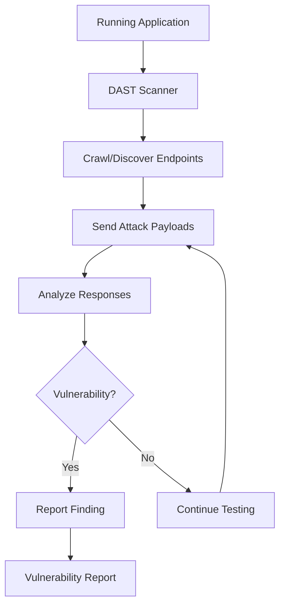
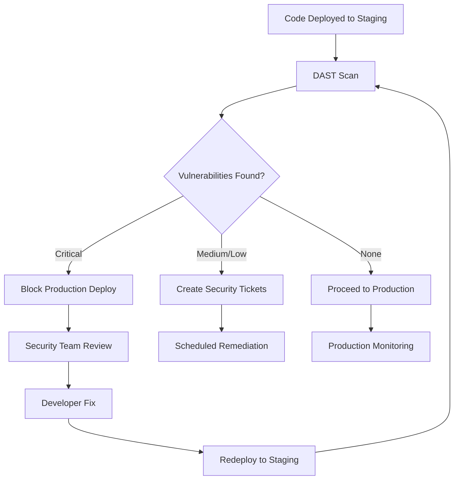
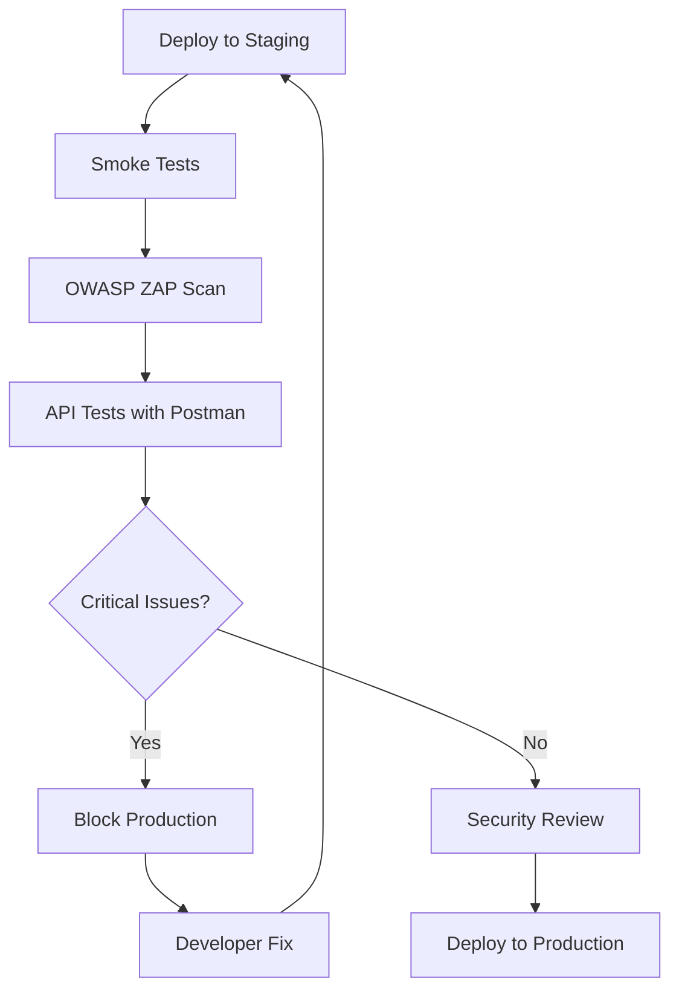
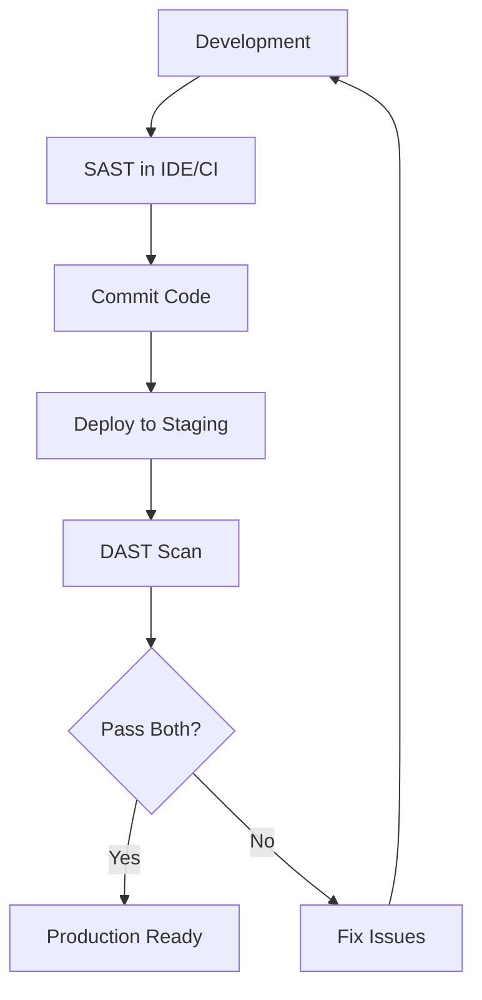

# DAST (Dynamic Application Security Testing)

## 📋 Overview

**Dynamic Application Security Testing (DAST)** is a security testing methodology that analyzes applications in their **running state** to identify security vulnerabilities. DAST is often referred to as "black-box testing" because it tests applications from the outside without knowledge of the internal code structure, simulating how an attacker would interact with the application.

## 💡 Core Concept

DAST tools work by interacting with a running application through its exposed interfaces (web pages, APIs, etc.), sending various inputs and observing responses to identify security vulnerabilities. The analysis happens during runtime, testing the application as it would be experienced by end users or potential attackers.

## How DAST Works

### Testing Techniques

1. **Crawling/Discovery**
   - Maps application structure and endpoints
   - Discovers forms, parameters, and API endpoints
   - Identifies entry points for testing

2. **Fuzzing**
   - Sends malformed or unexpected inputs
   - Tests boundary conditions
   - Identifies input validation failures

3. **Attack Simulation**
   - Sends known attack payloads
   - Tests for common vulnerabilities (OWASP Top 10)
   - Attempts exploitation scenarios

4. **Response Analysis**
   - Analyzes HTTP responses for vulnerability indicators
   - Checks for error messages exposing sensitive info
   - Validates security headers and configurations

## Common Vulnerabilities Detected by DAST

### Injection Attacks

- **SQL Injection**: Malicious SQL in database queries
- **Cross-Site Scripting (XSS)**: Script injection in web pages
- **Command Injection**: OS command execution
- **LDAP Injection**: Directory service attacks

### Authentication & Session Management

- **Broken Authentication**: Weak login mechanisms
- **Session Fixation**: Predictable session tokens
- **Insecure Session Management**: Session timeout issues
- **Credential Stuffing**: Testing weak passwords

### Authorization & Access Control

- **Broken Access Control**: Unauthorized resource access
- **Insecure Direct Object References (IDOR)**: Accessing other users' data
- **Missing Function Level Access Control**: Privilege escalation
- **Path Traversal**: Unauthorized file access

### Configuration Issues

- **Security Misconfiguration**: Insecure server settings
- **Missing Security Headers**: HSTS, CSP, X-Frame-Options
- **Default Credentials**: Unchanged default passwords
- **Directory Listing**: Exposed file structure
- **Verbose Error Messages**: Stack traces in production

### Cryptography & Transport

- **Weak SSL/TLS Configuration**: Outdated protocols
- **Certificate Issues**: Expired or invalid certificates
- **Mixed Content**: HTTP resources on HTTPS pages
- **Sensitive Data in Transit**: Unencrypted transmission

### Cross-Site Attacks

- **Cross-Site Request Forgery (CSRF)**: Unauthorized actions
- **Cross-Site Scripting (XSS)**: Reflected, Stored, DOM-based
- **Clickjacking**: UI redressing attacks

### Business Logic

- **Rate Limiting Issues**: No protection against brute force
- **Mass Assignment**: Unintended parameter binding
- **Race Conditions**: Concurrent request vulnerabilities

## Advantages of DAST

### Real-World Testing

- Tests actual running application
- Simulates real attacker behavior
- Validates deployed configuration

### Technology Agnostic

- No source code access needed
- Works with any technology stack
- Tests third-party components

### Runtime Vulnerability Detection

- Finds configuration issues
- Identifies environment-specific problems
- Tests authentication/authorization flows

### No False Positives from Code Analysis

- Reports actual exploitable vulnerabilities
- Confirms vulnerabilities are reachable
- Provides proof of concept

### Comprehensive Coverage

- Tests entire application stack (frontend, backend, infrastructure)
- Validates security controls are functioning
- Tests integrations with external systems

## Limitations of DAST

### Late Detection

- Issues found after deployment
- More expensive to fix
- May require architectural changes

### Limited Code Coverage

- Only tests executed paths
- Cannot reach all code branches
- Misses dead code vulnerabilities

### No Source Context

- Cannot pinpoint exact code location
- Makes remediation harder
- Requires debugging to find root cause

### Performance Impact

- Slower than static analysis
- Requires running environment
- May impact application performance during scan

### Requires Running Application

- Needs deployed/staging environment
- May require test data setup
- Authentication setup complexity

### Business Logic Blind Spots

- Cannot understand complex workflows
- May miss context-specific vulnerabilities
- Requires manual testing for business logic

## DAST in the SDLC

### Integration Points

1. **Staging Environment** - Automated scans before production
2. **Pre-production Checks** - Final security validation
3. **Production Monitoring** - Continuous security testing
4. **Scheduled Scans** - Regular vulnerability assessments
5. **Post-deployment Verification** - Validate security after releases

## Popular DAST Tools

### Open Source

- **OWASP ZAP (Zed Attack Proxy)** - Full-featured web security scanner
- **Nikto** - Web server vulnerability scanner
- **Wapiti** - Web application vulnerability scanner
- **Arachni** - Feature-rich web security scanner
- **Nuclei** - Fast, template-based vulnerability scanner

### Commercial

- **Burp Suite Professional** - Advanced web security testing
- **Acunetix** - Automated web vulnerability scanner
- **Nessus** - Comprehensive vulnerability scanner
- **AppScan** - Enterprise-grade DAST solution
- **Veracode Dynamic Analysis** - Cloud-based DAST

### API-Specific

- **Postman** - API testing with security checks
- **REST Assured** - API testing framework
- **OWASP ZAP with API add-ons** - API-focused scanning

## Best Practices

### Scan Configuration

- **Authentication Setup**: Configure valid credentials for authenticated scanning
- **Crawl Depth**: Balance coverage vs. scan time
- **Attack Intensity**: Adjust based on environment sensitivity
- **Exclude Sensitive Actions**: Prevent data deletion or emails during scans

### Scheduling

- **Regular Scans**: Weekly or bi-weekly automated scans
- **Pre-release Scans**: Mandatory before production deployment
- **Continuous Monitoring**: Ongoing production environment scanning
- **On-demand Scans**: After significant changes or incidents

### Environment Considerations

- **Use Staging**: Primary scanning in staging environment
- **Production Scans**: Careful, low-intensity scans
- **Test Data**: Use realistic but non-sensitive data
- **Performance Monitoring**: Watch for scan impact

### Result Management

- **Triage Findings**: Validate and prioritize vulnerabilities
- **Track Remediation**: Use ticketing system for fixes
- **Retest Fixes**: Verify vulnerabilities are resolved
- **Trend Analysis**: Monitor security posture over time

### Team Integration

- **Developer Training**: Teach how to interpret DAST results
- **Security Champions**: Designate DAST experts in teams
- **Collaboration**: Security and development work together
- **Knowledge Sharing**: Document common issues and fixes

## DAST for Open Sharia Enterprise

### Why DAST Matters for Fintech

As a fintech application, Open Sharia Enterprise must test:

- API security and authentication
- Transaction processing flows
- Payment gateway integrations
- User data access controls
- Regulatory compliance requirements

DAST validates:

- Security controls are functioning as intended
- APIs cannot be exploited
- Authentication cannot be bypassed
- Configuration is secure in deployment

### Recommended Implementation

1. **Primary Tool**: OWASP ZAP
   - Free and open source
   - Excellent API testing support
   - CI/CD integration available
   - Active community and updates

2. **Secondary Tool**: Nuclei
   - Fast, template-based scanning
   - Custom templates for fintech-specific checks
   - Great for targeted testing

3. **API Testing**: Postman with Newman
   - Automated API security testing
   - Easy to integrate with CI/CD
   - Developer-friendly workflow

### Integration Strategy

### Testing Phases

1. **Phase 1: Basic Scanning**
   - Passive scanning during development
   - Quick feedback on obvious issues
   - No blocking, informational only

2. **Phase 2: Pre-production**
   - Full active scanning in staging
   - Authentication-based testing
   - API endpoint testing
   - Critical issues block deployment

3. **Phase 3: Production Monitoring**
   - Low-intensity continuous scanning
   - Monitors for configuration drift
   - Validates security controls
   - Monthly comprehensive scans

## SAST vs DAST Comparison

| Aspect                   | SAST                         | DAST                         |
| ------------------------ | ---------------------------- | ---------------------------- |
| **Testing Phase**        | Development (pre-deployment) | Testing/Production (runtime) |
| **Code Access**          | Requires source code         | No source code needed        |
| **Perspective**          | Inside-out (white-box)       | Outside-in (black-box)       |
| **Coverage**             | All code paths               | Only executed paths          |
| **Speed**                | Fast, automated              | Slower, requires running app |
| **False Positives**      | Higher rate                  | Lower rate                   |
| **Fix Cost**             | Lower (early detection)      | Higher (late detection)      |
| **Configuration Issues** | Cannot detect                | Can detect                   |
| **Runtime Issues**       | Cannot detect                | Can detect                   |

### Complementary Use

SAST and DAST should be used together:

## Complementary Approaches

DAST works best when combined with:

- **[SAST](./ex-in-se__sast.md)** - Early detection of code-level vulnerabilities
- **SCA (Software Composition Analysis)** - Checks dependencies for known CVEs
- **Penetration Testing** - Manual testing of complex attack scenarios
- **Bug Bounty Programs** - Crowdsourced security testing
- **Security Monitoring** - Runtime application self-protection (RASP)

## Further Reading

- [OWASP DAST Overview](https://owasp.org/www-community/Vulnerability_Scanning_Tools)
- [OWASP ZAP Documentation](https://www.zaproxy.org/docs/)
- [NIST Guidelines on DAST](https://www.nist.gov/cyberframework)

## Related Documentation

- [SAST Explanation](./ex-in-se__sast.md)
- [Security Concepts Index](./README.md)
- [Development Conventions](../development/README.md)
