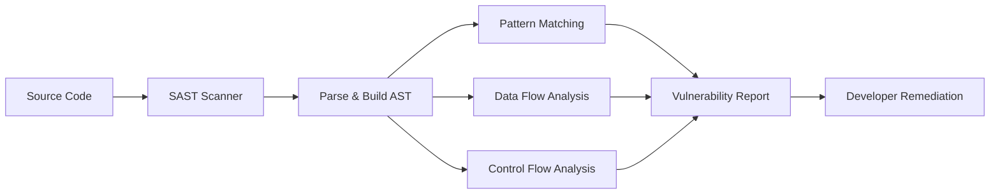
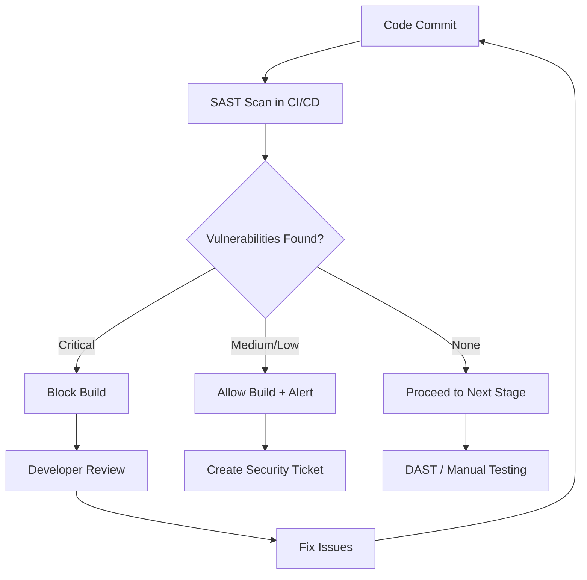
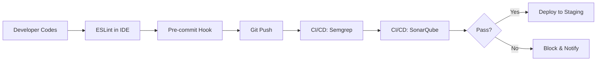

# SAST (Static Application Security Testing)

## 📋 Overview

**Static Application Security Testing (SAST)** is a security testing methodology that analyzes application source code, bytecode, or binaries for security vulnerabilities **without executing the program**. SAST is often referred to as "white-box testing" because it requires full visibility into the application's internal structure and code.

## 💡 Core Concept

SAST tools work by examining the static codebase to identify potential security flaws, coding errors, and violations of secure coding standards. The analysis happens during the development phase, before the application is deployed or run, enabling early detection of security issues.

## How SAST Works

### Analysis Techniques

1. **Syntax Analysis**
   - Parses code into Abstract Syntax Tree (AST)
   - Identifies code patterns matching known vulnerabilities

2. **Data Flow Analysis**
   - Tracks how data moves through the application
   - Identifies tainted data flows (e.g., user input reaching SQL queries)

3. **Control Flow Analysis**
   - Examines execution paths through the code
   - Identifies unreachable code or logic errors

4. **Pattern Matching**
   - Compares code against known vulnerability patterns
   - Checks for insecure API usage

## Common Vulnerabilities Detected by SAST

### Input Validation Issues

- **SQL Injection**: Unsanitized user input in database queries
- **Cross-Site Scripting (XSS)**: Unescaped output in web pages
- **Command Injection**: User input in system commands
- **Path Traversal**: Unvalidated file paths

### Authentication & Authorization

- **Hard-coded Credentials**: Passwords or API keys in source code
- **Weak Authentication Logic**: Flawed login mechanisms
- **Broken Access Control**: Missing permission checks

### Cryptography

- **Weak Encryption Algorithms**: Use of MD5, SHA1, DES
- **Insecure Random Number Generation**: Predictable random values
- **Hard-coded Cryptographic Keys**: Encryption keys in code

### Code Quality

- **Buffer Overflows**: Array boundary violations
- **Null Pointer Dereferences**: Potential crashes
- **Resource Leaks**: Unclosed files, connections, or memory
- **Race Conditions**: Threading issues

### Configuration

- **Insecure Defaults**: Default passwords, debug mode enabled
- **Missing Security Headers**: CORS, CSP, HSTS headers
- **Sensitive Data Exposure**: Logs containing PII or secrets

## Advantages of SAST

### Early Detection (Shift Left)

- Identifies vulnerabilities during development
- Cheaper to fix issues before deployment
- Reduces security debt accumulation

### Complete Code Coverage

- Can analyze 100% of codebase
- Not limited to executed paths
- Examines dead code and edge cases

### Precise Location Information

- Provides exact file names and line numbers
- Shows vulnerable code snippets
- Enables quick remediation

### Integration with Development Workflow

- Runs in CI/CD pipelines automatically
- Integrates with IDEs for real-time feedback
- Can block builds with critical vulnerabilities

### Compliance Support

- Helps meet regulatory requirements (PCI-DSS, GDPR, SOC2)
- Documents security due diligence
- Provides audit trails

## Limitations of SAST

### False Positives

- May flag secure code as vulnerable
- Requires manual review and triage
- Can cause alert fatigue

### Context Limitations

- Cannot understand runtime environment
- Misses configuration-based vulnerabilities
- Cannot detect architectural flaws

### Language/Framework Dependency

- Requires language-specific analyzers
- May not support all frameworks
- Custom code patterns may be missed

### Runtime Blind Spots

- Cannot detect timing attacks
- Misses authentication/session issues
- Cannot test actual deployed configuration

### Performance

- Deep analysis can be slow
- Large codebases require significant time
- May impact developer productivity if too intrusive

## SAST in the SDLC

### Integration Points

1. **IDE Integration** - Real-time feedback while coding
2. **Pre-commit Hooks** - Scan before code is committed
3. **CI/CD Pipeline** - Automated scanning on every build
4. **Pull Request Checks** - Security review before merge
5. **Scheduled Scans** - Regular full codebase analysis

## Popular SAST Tools

### Open Source

- **SonarQube** - Multi-language security and quality analysis
- **Semgrep** - Fast, customizable pattern-based scanning
- **Bandit** - Python-specific security linter
- **Brakeman** - Ruby on Rails security scanner
- **ESLint + Security Plugins** - JavaScript/TypeScript security rules

### Commercial

- **Checkmarx** - Enterprise SAST platform
- **Veracode** - Cloud-based security testing
- **Fortify** - Comprehensive application security
- **Snyk Code** - Developer-first security scanning

## Best Practices

### Configuration

- **Tune for Your Stack**: Configure for languages/frameworks you use
- **Customize Rules**: Adjust rules based on your security policies
- **Set Thresholds**: Define acceptable risk levels
- **Suppress False Positives**: Document and suppress known safe patterns

### Workflow Integration

- **Start Early**: Introduce SAST from project inception
- **Fast Feedback**: Prioritize IDE/commit-time scanning
- **Automate**: Run in CI/CD without manual intervention
- **Fail Fast**: Block critical vulnerabilities immediately

### Team Adoption

- **Train Developers**: Educate on common vulnerabilities
- **Share Results**: Make findings visible to the team
- **Track Metrics**: Monitor vulnerability trends over time
- **Continuous Improvement**: Regularly review and update rules

### Remediation

- **Prioritize by Risk**: Focus on critical/high severity first
- **Fix at Source**: Address root causes, not symptoms
- **Verify Fixes**: Re-scan after remediation
- **Document Decisions**: Record why issues were suppressed

## SAST for Open Sharia Enterprise

### Why SAST Matters for Fintech

As a fintech application, Open Sharia Enterprise handles:

- Sensitive financial data
- Personal identifiable information (PII)
- Payment processing
- Authentication and authorization

SAST helps protect against:

- Data breaches from injection attacks
- Exposure of hard-coded credentials
- Weak cryptographic implementations
- Authorization bypass vulnerabilities

### Recommended Implementation

1. **Primary Tool**: SonarQube Community Edition
   - Supports Node.js/JavaScript/TypeScript
   - Free for open source projects
   - Excellent CI/CD integration

2. **Secondary Tool**: Semgrep
   - Fast, targeted scanning
   - Custom rules for fintech-specific patterns
   - Low false positive rate

3. **IDE Integration**: ESLint with security plugins
   - Real-time feedback while coding
   - Catches issues before commit
   - Minimal performance impact

### Integration Strategy

## Complementary Approaches

SAST works best when combined with other security testing methods:

- **[DAST](./ex-in-se__dast.md)** - Tests running application for runtime vulnerabilities
- **SCA (Software Composition Analysis)** - Scans dependencies for known vulnerabilities
- **Manual Code Review** - Human review for business logic flaws
- **Penetration Testing** - Simulated attacks on deployed application

## Further Reading

- [OWASP SAST Overview](https://owasp.org/www-community/Source_Code_Analysis_Tools)
- [NIST Guidelines on SAST](https://www.nist.gov/cyberframework)
- [SAST vs DAST Comparison](./ex-in-se__dast.md)

## Related Documentation

- [DAST Explanation](./ex-in-se__dast.md)
- [Security Concepts Index](./README.md)
- [Development Conventions](../development/README.md)
