# Defensive Security

## 📋 Overview

**Defensive Security** is the practice of protecting systems, networks, applications, and data from unauthorized access, exploitation, and attacks. It encompasses the tools, processes, and people that work together to prevent, detect, and respond to security threats before they cause harm.

## 💡 Core Concept

Defensive security operates on the principle of **defense-in-depth**: implementing multiple layers of security controls so that if one layer is breached, others remain to protect your assets. It's a proactive, continuous approach to keeping systems secure.

## Key Defensive Security Domains

### Network Security

Protecting network infrastructure and data in transit.

**Key Controls:**

- **Firewalls** - Block unauthorized network traffic
- **Intrusion Detection/Prevention Systems (IDS/IPS)** - Detect and block malicious network activity
- **VPNs (Virtual Private Networks)** - Encrypt data in transit
- **Network Segmentation** - Isolate critical systems
- **DDoS Protection** - Defend against distributed denial-of-service attacks
- **SSL/TLS Encryption** - Secure communication channels

**Technologies:**

- Palo Alto Networks, Cisco ASA, pfSense (firewalls)
- Suricata, Zeek (IDS/IPS)
- Cloudflare, Akamai (DDoS protection)
- Wireguard, OpenVPN (VPN solutions)

### Application Security

Securing software applications from code-level to deployment.

**Key Controls:**

- **Secure Coding Practices** - Write code without vulnerabilities
- **Input Validation** - Prevent injection attacks
- **Output Encoding** - Prevent cross-site scripting
- **Authentication** - Verify user identity
- **Authorization** - Control access to resources
- **API Security** - Protect API endpoints
- **Secrets Management** - Secure storage of credentials and keys

**Testing Approaches:**

- SAST (Static Application Security Testing) - Analyze code before deployment
- DAST (Dynamic Application Security Testing) - Test running applications
- IAST (Interactive Application Security Testing) - Real-time analysis during testing

**Tools:**

- SonarQube, Semgrep, Checkmarx (SAST)
- OWASP ZAP, Burp Suite (DAST)
- HashiCorp Vault, AWS Secrets Manager (secrets management)

### Identity and Access Management (IAM)

Controlling who can access what and ensuring proper identity verification.

**Key Controls:**

- **Authentication** - Verify user identity (passwords, MFA, biometrics)
- **Authorization** - Grant appropriate permissions
- **Multi-Factor Authentication (MFA)** - Require multiple verification methods
- **Role-Based Access Control (RBAC)** - Limit access based on roles
- **Privileged Access Management (PAM)** - Control admin/root access
- **Single Sign-On (SSO)** - Centralized authentication
- **Password Policies** - Enforce strong password requirements

**Best Practices:**

- Enforce strong passwords (12+ characters, complexity)
- Require MFA for all critical systems
- Implement principle of least privilege
- Regular access reviews and cleanup
- Separate admin and user accounts
- Monitor privileged access

**Tools:**

- Okta, Azure AD, Keycloak (identity management)
- Duo, Microsoft Authenticator (MFA)
- HashiCorp Boundary, Vault (PAM)

### Data Protection

Safeguarding sensitive information at rest, in transit, and in use.

**Key Controls:**

- **Encryption at Rest** - Encrypt stored data
- **Encryption in Transit** - Encrypt data being transmitted
- **Data Classification** - Categorize data by sensitivity
- **Access Controls** - Limit who can view data
- **Data Masking** - Hide sensitive data in non-production
- **Backup and Recovery** - Ensure data can be restored
- **Data Loss Prevention (DLP)** - Prevent unauthorized data exfiltration

**Technologies:**

- AES-256, RSA (encryption algorithms)
- TLS 1.3, SSL (transport security)
- HashiCorp Vault, AWS KMS (key management)
- Commvault, Veeam (backup solutions)

### Infrastructure Security

Hardening servers, cloud infrastructure, and system configurations.

**Key Controls:**

- **Patch Management** - Keep systems updated
- **Configuration Hardening** - Remove unnecessary services
- **Operating System Hardening** - Secure OS configuration
- **Container Security** - Secure containerized applications
- **Cloud Security** - Secure cloud services and configurations
- **Vulnerability Management** - Find and fix vulnerabilities
- **Asset Management** - Track and manage all IT assets

**Practices:**

- Regular patching (monthly or as needed)
- Remove default credentials
- Disable unnecessary services
- Enable security updates automatically
- Use configuration management tools
- Regular vulnerability scanning

**Tools:**

- Nessus, Qualys (vulnerability scanning)
- Ansible, Terraform (infrastructure as code)
- Snyk, Twistlock (container security)
- AWS Security Hub, Azure Security Center (cloud security)

### Monitoring and Detection

Continuously monitoring systems for suspicious activity and security incidents.

**Key Controls:**

- **Security Information and Event Management (SIEM)** - Collect and analyze security logs
- **Intrusion Detection Systems (IDS)** - Detect unauthorized access
- **Endpoint Detection and Response (EDR)** - Monitor and respond to endpoint threats
- **Security Monitoring** - Real-time monitoring of systems
- **Log Aggregation** - Centralize logs for analysis
- **Alerting** - Notify on suspicious activity
- **Threat Intelligence** - Monitor for known threats

**Monitoring Focus:**

- Authentication attempts (successful and failed)
- File modifications and system changes
- Network traffic anomalies
- Privileged access usage
- Configuration changes
- Data access patterns
- Malware signatures

**Tools:**

- Splunk, ELK Stack, Datadog (SIEM)
- CrowdStrike, Microsoft Defender (EDR)
- Wazuh, Osquery (monitoring)
- MISP, AlienVault (threat intelligence)

### Incident Response

Procedures and processes for responding to and recovering from security incidents.

**Key Components:**

1. **Preparation** - Establish incident response team and procedures
2. **Detection** - Identify that an incident has occurred
3. **Analysis** - Understand the scope and impact
4. **Containment** - Limit the damage and spread
5. **Eradication** - Remove the attacker and their tools
6. **Recovery** - Restore systems to normal operation
7. **Post-Incident** - Analyze and improve processes

**IR Best Practices:**

- Establish incident response team before incident occurs
- Document procedures in an incident response plan
- Regular tabletop exercises and drills
- 24/7 incident response capability
- Clear communication during incidents
- Preserve evidence for investigation
- Post-incident review and lessons learned

## Defense-in-Depth Strategy

```mermaid
graph TD
    Attacker["⚠️ ATTACKER<br/>External Threat"]

    Attacker -->|Encounters| Layer1["🌐 LAYER 1: Network Perimeter<br/>━━━━━━━━━━━━━━━━<br/>Firewalls • IDS/IPS • DDoS Protection"]

    Layer1 -->|Breaks Through| Layer2["🛡️ LAYER 2: Application Layer<br/>━━━━━━━━━━━━━━━━<br/>WAF • API Gateway • Rate Limiting"]

    Layer2 -->|Bypasses| Layer3["🔐 LAYER 3: Identity & Access<br/>━━━━━━━━━━━━━━━━<br/>Authentication • MFA • Authorization"]

    Layer3 -->|Overcomes| Layer4["⚙️ LAYER 4: Infrastructure<br/>━━━━━━━━━━━━━━━━<br/>Patching • Hardening • Config Mgmt"]

    Layer4 -->|Penetrates| Layer5["💾 LAYER 5: Data Protection<br/>━━━━━━━━━━━━━━━━<br/>Encryption • Access Control • Masking"]

    Layer5 -->|Finally Reaches| Assets["🎯 PROTECTED ASSETS<br/>Sensitive Data & Systems"]

    Monitor["🔍 DETECTION & MONITORING<br/>SIEM • EDR • Incident Response"]
    Monitor -.->|Watches & Alerts| Layer1
    Monitor -.->|On All Layers| Layer2
    Monitor -.->|Detects Breaches| Layer3
    Monitor -.->|Responds To| Layer4
    Monitor -.->|Protects| Layer5

    style Attacker fill:#ffcccc,stroke:#b71c1c,stroke-width:3px
    style Layer1 fill:#e3f2fd,stroke:#1565c0,stroke-width:2px
    style Layer2 fill:#e8f5e9,stroke:#2e7d32,stroke-width:2px
    style Layer3 fill:#f3e5f5,stroke:#6a1b9a,stroke-width:2px
    style Layer4 fill:#fffde7,stroke:#f57f17,stroke-width:2px
    style Layer5 fill:#fce4ec,stroke:#c2185b,stroke-width:2px
    style Assets fill:#c8e6c9,stroke:#1b5e20,stroke-width:3px
    style Monitor fill:#ffebee,stroke:#c62828,stroke-width:3px
```

### Layered Approach

1. **Perimeter Defense** - Stop threats at network boundary
2. **Application Defense** - Protect application code and logic
3. **Identity Defense** - Verify users and control access
4. **Data Defense** - Encrypt and protect sensitive information
5. **Infrastructure Defense** - Harden systems and remove vulnerabilities
6. **Detection & Response** - Identify and respond to breaches

## Defensive Security in the SDLC

## Defensive vs Offensive Security

```mermaid
graph TD
    A["🛡️ Defensive Security<br/>Blue Team<br/>Protect & Prevent"] -->|Validates| C["Complete<br/>Security"]
    B["⚔️ Offensive Security<br/>Red Team<br/>Find & Exploit"] -->|Tests| C
    C -->|Improves| A

    style A fill:#e3f2fd
    style B fill:#fff3e0
    style C fill:#f1f8e9
```

### Key Differences

| Aspect       | Defensive             | Offensive             |
| ------------ | --------------------- | --------------------- |
| **Goal**     | Prevent and protect   | Find and exploit      |
| **Approach** | Build defenses        | Test defenses         |
| **Team**     | Blue Team             | Red Team              |
| **Timeline** | Continuous            | Periodic              |
| **Mindset**  | "How do we prevent?"  | "How do we break in?" |
| **Tools**    | Firewalls, SIEM, WAF  | Scanners, frameworks  |
| **Success**  | Systems remain secure | Vulnerabilities found |

### Working Together

Defensive and offensive security form a continuous improvement cycle:

1. **Blue Team** builds and maintains defenses
2. **Red Team** tests those defenses
3. **Red Team findings** inform **Blue Team** improvements
4. **Blue Team** implements fixes
5. **Cycle repeats** with updated defense mechanisms

## Defensive Security Best Practices

### For Development Teams

- Write secure code (OWASP Top 10 awareness)
- Validate all input
- Use established security libraries
- Implement proper authentication/authorization
- Encrypt sensitive data
- Avoid hardcoding secrets
- Regular code review
- Security testing (SAST/DAST)

### For Operations Teams

- Keep systems patched and updated
- Implement strong access controls
- Monitor logs for suspicious activity
- Maintain configuration management
- Implement backup and recovery
- Test disaster recovery procedures
- Follow change management
- Enable audit logging

### For Organizations

- Conduct regular security training
- Establish security policies and procedures
- Perform periodic security assessments
- Maintain incident response procedures
- Monitor emerging threats
- Keep security tools current
- Foster security-aware culture
- Regular security reviews

## Defensive Security Tools by Category

### Network Security

- **Firewalls**: Palo Alto Networks, Cisco ASA, pfSense, Fortinet FortiGate
- **IDS/IPS**: Suricata, Zeek, Snort, Airwall
- **VPN**: Wireguard, OpenVPN, Cisco AnyConnect
- **WAF**: ModSecurity, AWS WAF, Cloudflare

### Application Security

- **SAST**: SonarQube, Semgrep, Checkmarx, Fortify
- **DAST**: OWASP ZAP, Burp Suite, Acunetix
- **Dependency Scanning**: Snyk, Dependabot, WhiteSource
- **API Security**: Apigee, Kong, Tyk

### Identity & Access

- **Identity Providers**: Okta, Azure AD, Keycloak, FreeIPA
- **MFA**: Duo, Microsoft Authenticator, Google Authenticator
- **PAM**: HashiCorp Boundary, CyberArk, Delinea
- **Secrets Management**: HashiCorp Vault, AWS Secrets Manager, Azure Key Vault

### Data Protection

- **Encryption**: AES, RSA, TLS implementations
- **Key Management**: HashiCorp Vault, AWS KMS, Azure Key Vault
- **DLP**: Symantec, Forcepoint, Digital Guardian
- **Backup**: Commvault, Veeam, Bacula

### Monitoring & Detection

- **SIEM**: Splunk, ELK Stack, Datadog, Sumo Logic
- **EDR**: CrowdStrike, Microsoft Defender, SentinelOne
- **Log Management**: Graylog, Loki, Splunk
- **Monitoring**: Prometheus, Grafana, New Relic

### Infrastructure Security

- **Vulnerability Scanning**: Nessus, Qualys, OpenVAS
- **Configuration Management**: Ansible, Terraform, Puppet
- **Cloud Security**: AWS Security Hub, Azure Security Center, Google Cloud Security
- **Container Security**: Docker Security Scanning, Trivy, Twistlock

## Defensive Security for Open Sharia Enterprise

### Why Defensive Security Matters for Fintech

As a financial technology company, Open Sharia Enterprise must:

- **Prevent Fraud** - Secure transaction processing
- **Protect Customer Data** - Safeguard PII and financial information
- **Ensure Availability** - Keep services running (prevent DDoS, outages)
- **Maintain Integrity** - Prevent data modification or tampering
- **Meet Compliance** - Adhere to PCI DSS, GDPR, SOC 2, and financial regulations
- **Build Trust** - Demonstrate security to customers and partners

### Recommended Implementation Phases

1. **Foundation Phase**
   - Implement network perimeter security (firewalls, IDS/IPS)
   - Establish identity and access management (authentication, authorization)
   - Implement application security scanning (SAST)
   - Set up basic monitoring and logging

2. **Development Phase**
   - Secure development practices (code review, secure coding)
   - Implement secrets management
   - Add data encryption (at rest and in transit)
   - Implement patch management process

3. **Operations Phase**
   - Deploy SIEM for centralized monitoring
   - Implement endpoint detection and response
   - Establish incident response procedures
   - Set up backup and recovery

4. **Optimization Phase**
   - Fine-tune detection rules
   - Conduct security training
   - Perform assessments and audits
   - Continuous improvement process

### Defensive Controls by Priority

**Critical (Implement First):**

- Authentication and authorization
- Network firewalls
- Encryption for sensitive data
- Patch management
- Monitoring and alerting

**High (Implement Early):**

- Application security testing (SAST/DAST)
- Secrets management
- Data backup and recovery
- Access logging and audit
- Incident response procedures

**Medium (Implement Next):**

- Advanced threat detection (EDR)
- DLP (data loss prevention)
- Configuration hardening
- Vulnerability scanning
- Security awareness training

**Ongoing:**

- Threat intelligence monitoring
- Continuous vulnerability management
- Security assessments
- Process improvement
- Team training and updates

## Defensive vs SAST vs DAST vs Offensive

```mermaid
graph TD
    A["Comprehensive<br/>Security Program"]
    B["🛡️ Defensive Controls<br/>Prevent & Protect<br/>Continuous"]
    C["SAST<br/>Code Analysis<br/>Development"]
    D["DAST<br/>Runtime Testing<br/>Testing Phase"]
    E["⚔️ Offensive Testing<br/>Active Exploitation<br/>Periodic"]
    F["Detection & Response<br/>Monitor & React<br/>Continuous"]

    A --> B
    A --> C
    A --> D
    A --> E
    A --> F

    style A fill:#f1f8e9
    style B fill:#e3f2fd
    style C fill:#e8f5e9
    style D fill:#fff3e0
    style E fill:#ffe0b2
    style F fill:#ffebee
```

### When Each Is Used

- **Defensive Controls**: Always active, preventing attacks
- **SAST**: During development, before code is deployed
- **DAST**: During testing and staging phases
- **Offensive Testing**: Periodic assessments (quarterly or bi-annually)
- **Detection & Response**: Continuous monitoring, responds when incidents occur

## Defensive Security Culture

### Building a Security-Aware Organization

1. **Leadership Support** - Security is a business priority
2. **Training & Awareness** - Regular security education
3. **Clear Policies** - Documented security requirements
4. **Accountability** - Consequences for security violations
5. **Continuous Improvement** - Learn from incidents
6. **Open Communication** - Safe reporting of issues
7. **Security in Hiring** - Background checks, security training
8. **Regular Assessment** - Evaluate security posture

## Further Reading

- [NIST Cybersecurity Framework](https://www.nist.gov/cyberframework)
- [OWASP Secure Coding Practices](https://owasp.org/www-project-secure-coding-practices-quick-reference-guide/)
- [CIS Controls](https://www.cisecurity.org/controls)
- [SANS Security Training](https://www.sans.org/training/)
- [Cloud Security Alliance](https://cloudsecurityalliance.org/)

## Related Documentation

- [Information Security (InfoSec) Overview](./ex-in-se__infosec.md)
- [Offensive Security](./ex-in-se__offensive-security.md)
- [SAST (Static Application Security Testing)](./ex-in-se__sast.md)
- [DAST (Dynamic Application Security Testing)](./ex-in-se__dast.md)
- [Information Security Index](./README.md)
- [Development Conventions](../development/README.md)
