# Information Security (InfoSec)

## 📋 Overview

**Information Security (InfoSec)** is the practice of protecting digital assets—data, systems, networks, and applications—from unauthorized access, theft, modification, disruption, or destruction. It encompasses policies, processes, tools, and practices designed to ensure the confidentiality, integrity, and availability of critical information.

## 💡 Core Concept

Information security operates on the foundational principles known as the **CIA Triad**:

1. **Confidentiality** - Only authorized individuals can access sensitive information
2. **Integrity** - Data is accurate, complete, and unmodified by unauthorized parties
3. **Availability** - Information and systems are accessible when needed by authorized users

For a fintech application like Open Sharia Enterprise handling financial data and transactions, all three principles are critical.

## 🔑 Key Security Domains

### Application Security

Protecting software applications from vulnerabilities and attacks:

- **Code-level security**: Identifying vulnerabilities in source code (SAST)
- **Runtime security**: Testing running applications (DAST)
- **API security**: Securing API endpoints and data flows
- **Authentication**: Verifying user identity
- **Authorization**: Controlling what authenticated users can access
- **Input validation**: Preventing injection attacks and malformed data

### Network Security

Protecting data in transit and network infrastructure:

- **Encryption**: Using TLS/SSL for secure communication
- **Firewalls**: Controlling network traffic
- **VPNs**: Securing remote connections
- **DDoS Protection**: Defending against distributed denial-of-service attacks
- **Intrusion Detection**: Monitoring for unauthorized access attempts

### Data Security

Protecting sensitive information from unauthorized access:

- **Data encryption**: Encrypting data at rest and in transit
- **Access controls**: Limiting who can view or modify data
- **Data classification**: Categorizing data by sensitivity level
- **Backup and recovery**: Ensuring data can be restored after incidents
- **Data retention**: Following policies for keeping or deleting data

### Infrastructure Security

Protecting servers, databases, and cloud infrastructure:

- **Server hardening**: Removing unnecessary services and features
- **Patch management**: Keeping systems updated with security fixes
- **Configuration management**: Securing system and software settings
- **Container security**: Protecting containerized applications
- **Cloud security**: Securing cloud services and configurations

### Identity and Access Management (IAM)

Controlling who can access what:

- **Authentication**: Verifying user identity (passwords, MFA, biometrics)
- **Authorization**: Granting appropriate permissions
- **Privilege management**: Limiting admin access
- **Session management**: Tracking and terminating user sessions
- **Audit logging**: Recording who accessed what and when

### Security Operations

Maintaining and monitoring security:

- **Security monitoring**: Detecting suspicious activity
- **Incident response**: Responding to security breaches
- **Threat intelligence**: Understanding current and emerging threats
- **Vulnerability management**: Finding and fixing security issues
- **Compliance**: Meeting regulatory and legal requirements

## Why InfoSec Matters for Fintech

As a financial technology company, Open Sharia Enterprise faces unique security challenges:

### 🎯 Regulatory Requirements

Financial institutions must comply with numerous regulations:

- **PCI DSS (Payment Card Industry Data Security Standard)** - Protecting payment card data
- **GDPR (General Data Protection Regulation)** - Protecting personal data of EU residents
- **SOC 2 (Service Organization Control)** - Security, availability, processing integrity controls
- **Local Financial Regulations** - Country-specific financial laws and requirements

Non-compliance can result in fines, legal action, and loss of operating licenses.

### 💰 Financial Impact

Security breaches can be expensive:

- **Direct costs**: Forensic investigation, breach notification, remediation
- **Indirect costs**: Lost customer trust, damaged reputation, customer churn
- **Regulatory fines**: Penalties for non-compliance or failure to report breaches
- **Legal liability**: Lawsuits from affected customers or partners

### 🔐 Customer Trust

Users entrust fintech companies with:

- Personal financial information
- Account credentials
- Transaction history
- Payment methods

A security breach undermines customer confidence and can destroy a company's reputation.

### 🎭 Threat Landscape

Financial applications are high-value targets for:

- **Cybercriminals**: Seeking to steal money or data
- **Fraudsters**: Committing account takeover or transaction fraud
- **Nation-states**: Conducting espionage or economic sabotage
- **Insiders**: Malicious employees with system access

## The InfoSec Lifecycle

Information security is not a one-time activity but a continuous process. This lifecycle follows the **NIST Cybersecurity Framework 2.0** (released February 2024):

```mermaid
%% Color palette: Blue #0173B2, Orange #DE8F05, Teal #029E73, Purple #CC78BC, Brown #CA9161
graph TD
    A["1️⃣ GOVERN<br/>Policies, risk mgmt,<br/>oversight"] --> B["2️⃣ IDENTIFY<br/>Assets, risks,<br/>vulnerabilities"]
    B --> C["3️⃣ PROTECT<br/>Access controls,<br/>encryption, etc."]
    C --> D["4️⃣ DETECT<br/>Monitoring,<br/>alerting"]
    D --> E["5️⃣ RESPOND<br/>Incident response,<br/>containment"]
    E --> F["6️⃣ RECOVER<br/>Restore data,<br/>resume ops"]
    F -.-> A

    style A fill:#0173B2,stroke:#000000,color:#FFFFFF,stroke-width:2px
    style B fill:#DE8F05,stroke:#000000,color:#FFFFFF,stroke-width:2px
    style C fill:#029E73,stroke:#000000,color:#FFFFFF,stroke-width:2px
    style D fill:#CC78BC,stroke:#000000,color:#FFFFFF,stroke-width:2px
    style E fill:#CA9161,stroke:#000000,color:#FFFFFF,stroke-width:2px
    style F fill:#808080,stroke:#000000,color:#FFFFFF,stroke-width:2px
```

### 1. Govern

Establish and maintain organizational security governance:

- Define security policies and procedures
- Manage cybersecurity risk
- Provide oversight and accountability
- Align security with business objectives
- Establish security roles and responsibilities

### 2. Identify

Understand what needs protection:

- Catalog assets (systems, data, applications)
- Identify threats and vulnerabilities
- Assess risk levels
- Define security requirements

### 3. Protect

Implement preventive controls:

- Deploy security tools and systems
- Implement access controls
- Encrypt sensitive data
- Apply secure coding practices
- Harden infrastructure

### 4. Detect

Monitor for security issues:

- Implement security monitoring and logging
- Deploy intrusion detection systems
- Track security events
- Alert on suspicious activity
- Continuously scan for vulnerabilities

### 5. Respond

Act on detected incidents:

- Contain the incident (stop the attack)
- Eradicate the threat (remove the attacker's presence)
- Communicate with stakeholders
- Preserve evidence for investigation
- Follow incident response procedures

### 6. Recover

Return to normal operations:

- Restore affected systems
- Verify security fixes
- Document lessons learned
- Implement preventive measures
- Update policies and procedures

## Testing and Validation

Information security must be validated through:

### Static Application Security Testing (SAST)

Analyze source code for vulnerabilities during development:

- Fast, developer-friendly feedback
- Catches issues early before deployment
- No false positives from unexecuted code
- Find exact code locations to fix

**Learn more**: [SAST Explanation](./ex-inse__sast.md)

### Dynamic Application Security Testing (DAST)

Test running applications for real-world vulnerabilities:

- Validate security in actual runtime environment
- Simulate attacker behavior
- Confirm vulnerabilities are truly exploitable
- Find configuration and deployment issues

**Learn more**: [DAST Explanation](./ex-inse__dast.md)

### Complementary Testing

SAST and DAST should be used together in a defense-in-depth strategy:

```mermaid
%% Color palette: Blue #0173B2, Orange #DE8F05, Teal #029E73, Gray #808080
graph TD
    A["🔍 Development<br/>SAST<br/>✓ Code analysis<br/>✓ Early detection<br/>✓ Fast feedback"] --> B["📤 Code committed<br/>and tested"]
    B --> C["🧪 Testing<br/>DAST<br/>✓ Runtime validation<br/>✓ Configuration testing<br/>✓ Real exploitation attempts"]
    C --> D["🚀 Production<br/>deployment"]
    D --> E["🛡️ Operational Security<br/>& Monitoring<br/>✓ Incident detection<br/>✓ Threat response<br/>✓ Continuous improvement"]

    style A fill:#0173B2,stroke:#000000,color:#FFFFFF,stroke-width:2px
    style B fill:#808080,stroke:#000000,color:#FFFFFF,stroke-width:2px
    style C fill:#DE8F05,stroke:#000000,color:#FFFFFF,stroke-width:2px
    style D fill:#808080,stroke:#000000,color:#FFFFFF,stroke-width:2px
    style E fill:#029E73,stroke:#000000,color:#FFFFFF,stroke-width:2px
```

## InfoSec Best Practices

### For Developers

- Write code with security in mind (secure coding practices)
- Use input validation and parameterized queries
- Keep dependencies and frameworks updated
- Use established security libraries
- Follow the principle of least privilege
- Implement proper error handling (don't expose sensitive details)

### For Operations

- Keep systems patched and updated
- Implement strong access controls
- Monitor logs for suspicious activity
- Maintain secure configurations
- Implement network segmentation
- Enable security monitoring and alerting

### For Organizations

- Conduct regular security training
- Perform periodic security assessments
- Maintain incident response procedures
- Keep security policies current
- Monitor emerging threats
- Foster a security-aware culture

## Common Vulnerabilities (OWASP Top 10)

The [OWASP Top 10:2025](https://owasp.org/Top10/) represents the most critical security risks for web applications. The 2025 RC1 (Release Candidate) was announced on November 6, 2025:

1. **A01:2025 Broken Access Control** - Users exceeding privileges they should have
2. **A02:2025 Security Misconfiguration** - Insecure default configurations and settings
3. **A03:2025 Software Supply Chain Failures** - Vulnerabilities in dependencies and third-party code
4. **A04:2025 Cryptographic Failures** - Exposure of sensitive data due to weak encryption
5. **A05:2025 Injection** - Untrusted data injection into interpreters (SQL, NoSQL, OS commands)
6. **A06:2025 Insecure Design** - Missing security controls in architecture and design phase
7. **A07:2025 Authentication Failures** - Weaknesses in identity verification mechanisms
8. **A08:2025 Software and Data Integrity Failures** - Integrity of code and data not verified
9. **A09:2025 Logging and Alerting Failures** - Insufficient logging and monitoring capabilities
10. **A10:2025 Unsafe Error Handling** - Errors revealing sensitive information or system details

For detailed OWASP information and 2025 changes, see [OWASP Documentation](./ex-inse__owasp.md).

## InfoSec for Open Sharia Enterprise

### Current Focus

As we build the Open Sharia Enterprise platform, our security strategy focuses on:

1. **Secure development**: SAST during development, DAST before deployment
2. **Data protection**: Encryption of financial data at rest and in transit
3. **Access control**: Proper authentication and authorization for all users
4. **Compliance**: Meeting Islamic finance and financial regulation requirements
5. **Monitoring**: Logging and monitoring for security incidents

### Implementation Roadmap

- Integrate SAST tools into development workflow
- Implement DAST testing in CI/CD pipeline
- Establish incident response procedures
- Implement security monitoring and alerting
- Conduct regular security training
- Perform periodic security assessments

## Related Documentation

- [SAST (Static Application Security Testing)](./ex-inse__sast.md)
- [DAST (Dynamic Application Security Testing)](./ex-inse__dast.md)
- [Information Security Index](./README.md)
- [Development Conventions](../development/README.md)

## Further Reading

- [NIST Cybersecurity Framework](https://www.nist.gov/cyberframework/)
- [OWASP Top 10](https://owasp.org/www-project-top-ten/)
- [OWASP Secure Coding Practices](https://owasp.org/www-project-secure-coding-practices-quick-reference-guide/)
- [CWE/SANS Top 25](https://cwe.mitre.org/top25/)
- [Cloud Security Alliance](https://cloudsecurityalliance.org/)
