# Offensive Security

## 📋 Overview

**Offensive Security** is the practice of actively testing and attempting to exploit systems, networks, and applications to identify vulnerabilities and weaknesses before malicious actors do. Unlike defensive security (blue team) which protects systems, offensive security (red team) simulates real-world attacks to validate that defenses actually work.

## 💡 Core Concept

Offensive security operates on a simple principle: **understand the attacker's perspective and methodology to build better defenses**. By thinking like an attacker and conducting authorized security testing, organizations can discover and fix vulnerabilities before they become exploited in production.

## Key Offensive Security Disciplines

### Penetration Testing

Authorized security testing where security professionals attempt to exploit vulnerabilities to assess security posture.

**Scope:**

- Targets specific systems, networks, or applications
- Time-boxed engagement (weeks to months)
- Focused on finding exploitable vulnerabilities
- Provides detailed findings and remediation recommendations

**Testing Methods:**

- Network penetration testing (scanning networks, exploiting systems)
- Web application penetration testing (finding web app vulnerabilities)
- API penetration testing (testing API endpoints and authentication)
- Database penetration testing (testing database security)
- Social engineering (testing human factors and awareness)

**Types:**

- **Black Box**: Tester has no prior knowledge (simulates external attacker)
- **Gray Box**: Tester has partial knowledge (simulates insider with limited access)
- **White Box**: Tester has full knowledge (comprehensive assessment)

### Red Teaming

Full-scale, realistic adversarial simulations that test an entire organization's security posture, detection capabilities, and incident response.

**Characteristics:**

- Broader scope than penetration testing
- Longer-term engagements (months to ongoing)
- Simulates sophisticated, persistent adversaries
- Tests technical controls AND organizational processes
- Evaluates detection, response, and recovery capabilities

**Typical Red Team Activities:**

- Initial access through social engineering or phishing
- Lateral movement within networks
- Persistence techniques to maintain access
- Data exfiltration and destruction scenarios
- Evasion of security monitoring and detection

**Purpose:**

- Validate incident response procedures
- Test security team capabilities
- Identify blind spots in monitoring
- Assess organizational readiness
- Improve overall security culture

### Vulnerability Research

The process of discovering new or previously unknown vulnerabilities (zero-days) in systems, software, or hardware.

**Activities:**

- Code analysis and reverse engineering
- Fuzzing and testing edge cases
- Hardware/protocol research
- Developing proof-of-concept exploits
- Responsible disclosure practices

**Applications:**

- Finding vulnerabilities before public disclosure
- Contributing to security research community
- Developing defenses against known attack patterns
- Understanding emerging threats

### Security Assessments

Systematic evaluation of an organization's security controls, policies, and practices through active testing.

**Types:**

- **Vulnerability Assessments** - Automated scanning for known vulnerabilities
- **Risk Assessments** - Evaluating likelihood and impact of security risks
- **Compliance Assessments** - Testing adherence to security standards (PCI DSS, GDPR, SOC 2)
- **Security Posture Reviews** - Comprehensive evaluation of overall security

## Offensive vs Defensive Security

```mermaid
graph TD
    A["🛡️ Defensive Security<br/>Blue Team"] -->|Informs| C["Stronger<br/>Defenses"]
    B["⚔️ Offensive Security<br/>Red Team"] -->|Validates| C
    C -->|Discovered<br/>Gaps| B

    style A fill:#e3f2fd
    style B fill:#fff3e0
    style C fill:#f1f8e9
```

### Complementary Approaches

| Aspect       | Defensive                 | Offensive                         |
| ------------ | ------------------------- | --------------------------------- |
| **Goal**     | Protect and defend        | Find and exploit                  |
| **Approach** | Prevent attacks           | Simulate attacks                  |
| **Tools**    | Firewalls, IDS, SIEM      | Scanners, exploitation frameworks |
| **Mindset**  | "How do we prevent this?" | "How can we exploit this?"        |
| **Timeline** | Continuous                | Periodic engagements              |
| **Outcome**  | Secure systems            | Identified vulnerabilities        |

### Working Together

Defensive and offensive security work best in collaboration:

1. **Red Team finds vulnerability** → Blue Team implements fix
2. **Blue Team deploys defense** → Red Team validates it works
3. **Red Team updates techniques** → Blue Team updates detection rules
4. **Continuous cycle** of improvement and validation

## Common Offensive Security Techniques

### Information Gathering

**Passive Reconnaissance:**

- Public information research (OSINT)
- Examining company websites and social media
- Analyzing DNS records and SSL certificates
- Checking data breaches and leaks

**Active Reconnaissance:**

- Network scanning (nmap, Nessus)
- Service enumeration
- Banner grabbing
- Version detection

### Vulnerability Exploitation

**Common Attack Vectors:**

- SQL Injection - Exploiting database input validation
- Cross-Site Scripting (XSS) - Injecting malicious scripts
- Cross-Site Request Forgery (CSRF) - Forcing unauthorized actions
- Broken Authentication - Bypassing login mechanisms
- Insecure Deserialization - Exploiting object instantiation
- Remote Code Execution (RCE) - Executing arbitrary commands
- Privilege Escalation - Gaining higher-level access
- Path Traversal - Accessing unauthorized files

### Post-Exploitation

After gaining initial access, attackers:

- Establish persistence (backdoors, accounts)
- Escalate privileges (gain admin/root)
- Conduct lateral movement (access other systems)
- Exfiltrate data (steal information)
- Destroy or corrupt data
- Cover tracks (delete logs)

## Offensive Security Tools

### Reconnaissance & Scanning

- **Nmap** - Network mapping and port scanning
- **Shodan** - Internet search engine for devices
- **TheHarvester** - OSINT for email addresses and subdomains
- **Recon-ng** - Web reconnaissance framework
- **Censys** - Public internet scanning data

### Vulnerability Scanning

- **Nessus** - Vulnerability assessment scanner
- **Qualys** - Cloud-based vulnerability management
- **OpenVAS** - Open-source vulnerability scanner
- **Acunetix** - Web vulnerability scanner

### Exploitation Frameworks

- **Metasploit** - Penetration testing framework
- **Burp Suite** - Web application testing platform
- **OWASP ZAP** - Web security scanner
- **Exploit-DB** - Exploit database

### Specialized Tools

- **Hydra** - Brute force attacking tool
- **Hashcat** - Password cracking
- **Aircrack-ng** - Wireless security testing
- **Wireshark** - Network packet analyzer

## Legal and Ethical Considerations

### Authorization is Critical

**You MUST have:**

- Written authorization before testing
- Clear scope definition (what can and cannot be tested)
- Understanding of applicable laws
- Documented approval from management
- Rules of engagement

**Unauthorized testing is:**

- Illegal (Computer Fraud and Abuse Act, similar laws)
- Criminal (can result in imprisonment)
- Unethical and irresponsible
- Harmful to organizations

### Responsible Disclosure

When discovering vulnerabilities:

1. **Document findings** - Detailed reproduction steps
2. **Report responsibly** - Contact vendor or affected organization
3. **Allow time for fix** - Typically 90 days
4. **Public disclosure** - Only after fix is available
5. **Credit attribution** - Acknowledge the finder appropriately

### Bug Bounty Programs

Organizations invite security researchers to find vulnerabilities:

- **Incentive**: Cash rewards for finding bugs
- **Legal protection**: Explicit authorization to test
- **Scope definition**: Clear boundaries
- **Examples**: HackerOne, Bugcrowd, Intigriti

## Offensive Security in the SDLC

### Integration Points

1. **Development** - Code review for security issues
2. **Testing** - DAST and security assessments
3. **Staging** - Full penetration testing
4. **Pre-Production** - Red team exercises
5. **Production** - Continuous monitoring and incident response
6. **Post-Incident** - Vulnerability research and pattern analysis

## Advantages of Offensive Security

### Real-World Validation

- Tests actual exploitability, not just theoretical vulnerabilities
- Confirms vulnerabilities are reachable and impactful
- Provides proof-of-concept demonstrations
- Validates attack chain assumptions

### Business Impact Focus

- Demonstrates security value through tangible findings
- Prioritizes vulnerabilities by business risk
- Justifies security investments
- Improves executive understanding of threats

### Detection Validation

- Tests if security monitoring detects attacks
- Validates incident response procedures
- Identifies blind spots in alerting
- Improves SOC (Security Operations Center) effectiveness

### Comprehensive Coverage

- Tests entire attack chain (reconnaissance to exfiltration)
- Includes human/process factors
- Tests integrations between systems
- Validates security controls work together

## Limitations of Offensive Security

### Time and Resource Intensive

- Requires skilled security professionals
- Expensive compared to automated scanning
- Takes weeks or months for thorough testing
- Ongoing engagement required

### Scope Limitations

- Can only test authorized systems
- May not achieve full coverage
- Depends on tester skill level
- Risk of missed vulnerabilities

### Point-in-Time Assessment

- Snapshot of security at one moment
- Doesn't capture ongoing threats
- Requires periodic re-testing
- Doesn't prevent new zero-day vulnerabilities

## Offensive Security for Open Sharia Enterprise

### Why Offensive Testing Matters for Fintech

As a financial technology company, Open Sharia Enterprise must validate:

- **Transaction Security** - Ensure payment processing cannot be intercepted or modified
- **Authentication/Authorization** - Confirm user identity verification and access controls
- **API Security** - Validate APIs cannot be exploited for fraud
- **Data Protection** - Confirm sensitive financial data cannot be accessed
- **Compliance** - Demonstrate security controls meet regulatory requirements

### Recommended Approach

1. **Phase 1: Internal Assessment**
   - Vulnerability scanning and assessment
   - Code security review (SAST)
   - Security posture evaluation

2. **Phase 2: Penetration Testing**
   - Web application testing
   - API security testing
   - Authentication mechanism testing
   - Focus on high-risk financial operations

3. **Phase 3: Red Team Exercise**
   - Simulate sophisticated attacker
   - Test detection and response capabilities
   - Evaluate incident response procedures
   - Assess organizational readiness

4. **Phase 4: Continuous Testing**
   - Regular vulnerability scanning
   - Periodic penetration tests
   - Bug bounty program consideration
   - Ongoing threat monitoring

## Offensive vs SAST vs DAST

### Complementary Approaches

- **SAST**: Finds code-level vulnerabilities (SQL injection patterns, insecure crypto)
- **DAST**: Finds runtime vulnerabilities (configuration issues, missing headers)
- **Offensive**: Validates actual exploitability and demonstrates business impact
- **Together**: Complete security testing coverage

## Further Reading

- [OWASP Penetration Testing Guide](https://owasp.org/www-project-web-security-testing-guide/)
- [SANS Penetration Testing Resources](https://www.sans.org/white-papers/)
- [Responsible Disclosure](https://en.wikipedia.org/wiki/Coordinated_vulnerability_disclosure)

## Related Documentation

- [Information Security (InfoSec) Overview](./ex-inse__infosec.md)
- [SAST (Static Application Security Testing)](./ex-inse__sast.md)
- [DAST (Dynamic Application Security Testing)](./ex-inse__dast.md)
- [Information Security Index](./README.md)
- [Development Conventions](../development/README.md)
