# OWASP (Open Worldwide Application Security Project)

## 📋 Overview

**OWASP** is a nonprofit foundation and global community dedicated to improving application security. Started by Mark Curphey on September 9, 2001 as an informal open source community, OWASP was formally established as the OWASP Foundation, Inc. on April 21, 2004 as a 501(c)(3) nonprofit organization. OWASP operates as an open-source, vendor-neutral organization where security professionals, developers, and organizations collaborate to create free resources for building, maintaining, and improving the security of software applications.

OWASP is not a company or a product, but rather a collaborative platform where security knowledge is shared freely and transparently. The organization is driven by thousands of volunteers worldwide who contribute their expertise to create tools, documentation, testing guides, and training materials that help the entire software development industry build more secure applications.

## 💡 Core Concept

OWASP's foundational philosophy centers on **vendor-neutral security knowledge** accessible to all. The organization operates on the principle that security should not be proprietary or gatekept—instead, the collective knowledge of the global security community should be freely available to help everyone build better security practices.

This means OWASP resources are:

- **Vendor-neutral** - Not promoting any specific commercial product
- **Community-driven** - Developed by security professionals, not marketing departments
- **Free and open** - No licensing fees or paywalls
- **Collaborative** - Improved through global participation and feedback

## 🎯 Mission and Values

### Official Mission

OWASP's mission is to make application security visible so that people and organizations can make informed decisions about application security risks.

### Core Values

**Openness** - All OWASP work is free and open source. Transparency in vulnerabilities, testing methods, and security practices.

**Community** - Security is stronger when knowledge is shared. Collaboration across geographical, organizational, and professional boundaries.

**Innovation** - Continuously evolving to address emerging threats and new technologies in the security landscape.

**Pragmatism** - Focusing on practical, real-world applications rather than theoretical perfection.

### Global Impact

OWASP has become the de facto standard for web application security. Many regulatory frameworks, security standards, and industry best practices reference OWASP resources, making it an essential resource for compliance and security programs worldwide.

## 📚 Key OWASP Projects

OWASP maintains hundreds of projects across several categories. Here are the most significant projects relevant to application security:

### Documentation Projects

- **OWASP Top 10** - The most critical security risks for web applications (updated regularly, latest 2025 edition)
- **Web Security Testing Guide (WSTG)** - Comprehensive manual for penetration testing of web applications
- **Software Assurance Maturity Model (SAMM)** - Framework for building security into software development
- **API Security Top 10** - Critical security risks specific to APIs (essential for modern applications)
- **Mobile Application Security Verification Standard (MASVS)** - Security requirements for mobile apps

### Tool Projects

- **OWASP ZAP (Zed Attack Proxy)** - Leading open-source web security scanner for dynamic testing
- **OWASP Dependency-Check** - Scans dependencies for known vulnerabilities (Software Composition Analysis)
- **ModSecurity Core Rule Set** - Web application firewall (WAF) rules for detecting and preventing attacks
- **OWASP Juice Shop** - Intentionally vulnerable application for security training

### Training and Learning

- **OWASP WebGoat** - Interactive learning environment for web application security
- **OWASP Testing Cheat Sheets** - Quick reference guides for specific security tasks
- **OWASP Secure Coding Practices** - Guidelines for writing secure code
- **Security Knowledge Framework (SKF)** - Comprehensive security-focused knowledge base

## 🔝 OWASP Top 10: The Industry Standard

The **OWASP Top 10** is the most widely recognized web application security standard globally. It represents the 10 most critical security risks facing web applications based on data from security testing firms, bug bounty programs, and vulnerability research.

### What Makes Top 10 Important

- **Industry consensus** - Developed using data-driven methodology from thousands of applications
- **Regularly updated** - Revised every 3-4 years to reflect changing threat landscape
- **Widely referenced** - Used in compliance frameworks, security training, and testing standards
- **Actionable** - Each vulnerability includes detection methods and remediation strategies
- **Universal** - Applies across all technologies and platforms

### 2025 OWASP Top 10 Updates

The OWASP Top 10:2025 RC1 (Release Candidate 1) was announced on November 6, 2025 at the Global AppSec Conference. The final version is expected after community feedback period ends on November 20, 2025.

The 2025 edition includes significant changes reflecting current threats:

1. **A01:2025 Broken Access Control** - Maintains position at #1. Users exceeding privileges they should have
2. **A02:2025 Security Misconfiguration** - Moved up from #5 in 2021. Insecure default configurations and settings
3. **A03:2025 Software Supply Chain Failures** - New category in 2025. Vulnerabilities in dependencies and third-party code
4. **A04:2025 Cryptographic Failures** - Exposure of sensitive data due to weak encryption
5. **A05:2025 Injection** - Untrusted data injection into interpreters (SQL, NoSQL, OS commands)
6. **A06:2025 Insecure Design** - Missing security controls in architecture and design phase
7. **A07:2025 Authentication Failures** - Renamed from "Identification and Authentication Failures". Weaknesses in identity verification
8. **A08:2025 Software and Data Integrity Failures** - Integrity of code and data not verified
9. **A09:2025 Logging and Alerting Failures** - Renamed from "Security Logging and Monitoring Failures". Insufficient logging and monitoring
10. **A10:2025 Unsafe Error Handling** - New category replacing SSRF (merged into A01). Errors revealing sensitive information

### Notable 2025 Changes

- **A03: Software Supply Chain Failures (New)** - New category reflecting increased importance of dependency security and third-party code vulnerabilities
- **A10: Unsafe Error Handling (New)** - New category emphasizing proper error handling and preventing information disclosure through error messages
- **A02: Security Misconfiguration** - Moved up from #5 to #2, highlighting critical importance of secure configurations
- **A07: Authentication Failures** - Renamed from "Identification and Authentication Failures" for clarity
- **A09: Logging and Alerting Failures** - Renamed from "Security Logging and Monitoring Failures" to emphasize active alerting
- **SSRF Merged** - Server-Side Request Forgery merged into A01: Broken Access Control

For detailed vulnerability explanations, see [Information Security Overview](./ex-inse__infosec.md).

## 🤝 How OWASP Works

OWASP operates as a transparent, volunteer-driven organization:

### Membership Model

- **Open Membership** - Anyone can join (free and paid options)
- **Volunteer-Driven** - Projects led by passionate security professionals
- **Transparent** - All processes and discussions are public
- **No Vendor Lock-in** - Decisions made by community, not sponsors

### Global Structure

**Local Chapters** - OWASP has chapters in countries worldwide where local security professionals meet, share knowledge, and advance application security in their regions

**Global AppSec Conferences** - Annual conferences (Dublin, San Francisco, Lisbon, etc.) bringing together thousands of security professionals

**Online Community** - Discussion boards, Slack channels, and GitHub repositories for continuous collaboration

### How to Participate

- Join a local chapter
- Contribute to open-source projects
- Attend conferences and training events
- Share knowledge and vulnerability findings
- Participate in discussions and reviews

## 🛠️ Resources for Developers

OWASP provides practical resources developers can integrate into their daily work:

### Cheat Sheet Series

Quick reference guides on specific security topics:

- Authentication Cheat Sheet
- Authorization Cheat Sheet
- Secure Coding Cheat Sheets (language-specific)
- API Security Cheat Sheet
- Cryptographic Storage Cheat Sheet

### Testing Guides

- Web Security Testing Guide (WSTG) - Step-by-step testing procedures
- Mobile Security Testing Guide (MSTG) - Mobile app security testing
- API Security Testing - Specific to APIs

### Learning Platforms

- Juice Shop - Deliberately vulnerable web app for practice
- WebGoat - Interactive lessons on security flaws
- Vulnerable Django Application - Django-specific security training

### Architecture Guidance

- Secure SDLC Practices
- Architecture Review Methodology
- Component Selection Guidelines

## OWASP Ecosystem Overview

%% Color palette: Blue #0173B2, Orange #DE8F05, Teal #029E73, Purple #CC78BC, Brown #CA9161, Gray #808080
%% All colors are color-blind friendly and meet WCAG AA contrast standards

```mermaid
graph TD
    OWASP["🏛️ OWASP Foundation<br/>Nonprofit Organization"]

    Projects["📚 Projects"]
    Community["🤝 Community"]
    Events["🎤 Events & Training"]

    OWASP --> Projects
    OWASP --> Community
    OWASP --> Events

    Projects --> Documentation["📖 Documentation<br/>Top 10, WSTG, SAMM<br/>API Security, MASVS"]
    Projects --> Tools["🔧 Tools<br/>ZAP, Dependency-Check<br/>ModSecurity"]
    Projects --> Training["🎓 Training<br/>Juice Shop, WebGoat<br/>Cheat Sheets"]

    Community --> Chapters["🌍 Local Chapters<br/>Worldwide"]
    Community --> Contributors["👥 Volunteers<br/>Security Professionals"]
    Community --> Members["💼 Members<br/>Individual & Corporate"]

    Events --> Conferences["🎤 Conferences<br/>Global AppSec"]
    Events --> Workshops["📚 Workshops<br/>Training & Hands-on"]
    Events --> Online["💻 Online<br/>Webinars & Resources"]

    Impact["🎯 Global Impact"]
    Documentation --> Impact
    Tools --> Impact
    Training --> Impact

    Output["📈 Industry Standards<br/>Security Tools<br/>Knowledge Base"]
    Impact --> Output

    style OWASP fill:#029E73,stroke:#000000,color:#FFFFFF,stroke-width:3px
    style Projects fill:#0173B2,stroke:#000000,color:#FFFFFF,stroke-width:2px
    style Community fill:#CC78BC,stroke:#000000,color:#FFFFFF,stroke-width:2px
    style Events fill:#DE8F05,stroke:#000000,color:#FFFFFF,stroke-width:2px
    style Documentation fill:#029E73,stroke:#000000,color:#FFFFFF,stroke-width:2px
    style Tools fill:#029E73,stroke:#000000,color:#FFFFFF,stroke-width:2px
    style Training fill:#CC78BC,stroke:#000000,color:#FFFFFF,stroke-width:2px
    style Impact fill:#808080,stroke:#000000,color:#FFFFFF,stroke-width:2px
    style Output fill:#029E73,stroke:#000000,color:#FFFFFF,stroke-width:3px
```

## Top 10 Development Methodology

```mermaid
graph TD
    A["📊 Data Collection<br/>Security firms<br/>Bug bounties<br/>Vulnerability databases"] -->
    B["🔍 Community Analysis<br/>Experts review<br/>Validate data<br/>Categorize issues"]

    B -->
    C["✏️ Draft Top 10<br/>Preliminary list<br/>Initial descriptions<br/>Methodology review"]

    C -->
    D["👥 Public Review<br/>Community feedback<br/>Expert validation<br/>Refinement"]

    D -->
    E["📢 Final Release<br/>Published standard<br/>Documentation<br/>Training materials"]

    E -->
    F["🌍 Industry Adoption<br/>Used in compliance<br/>Training programs<br/>Security tools"]

    F -.->|Continuous feedback| A

    style A fill:#0173B2,stroke:#000000,color:#FFFFFF
    style B fill:#029E73,stroke:#000000,color:#FFFFFF
    style C fill:#CC78BC,stroke:#000000,color:#FFFFFF
    style D fill:#DE8F05,stroke:#000000,color:#FFFFFF
    style E fill:#029E73,stroke:#000000,color:#FFFFFF
    style F fill:#CC78BC,stroke:#000000,color:#FFFFFF
```

## ✅ Advantages of OWASP Resources

### Vendor Neutrality

No commercial bias - resources developed by independent security professionals rather than vendors with profit motives

### Cost and Accessibility

Completely free resources available to everyone globally, removing barriers for organizations of any size

### Industry Recognition

OWASP standards are widely recognized and referenced by:

- Regulatory frameworks (PCI DSS, ISO 27001)
- Security compliance standards
- Bug bounty programs
- Security tools and platforms
- Educational institutions

### Community Validated

Resources are tested, refined, and validated by thousands of security professionals worldwide

### Regularly Updated

Resources are maintained and updated to reflect current threat landscape and emerging vulnerabilities

### Comprehensive Coverage

OWASP provides resources across the entire spectrum from learning to compliance to implementation

## ❌ Limitations and Considerations

### Not a Regulatory Framework

OWASP resources are guidance and best practices, not formal regulatory compliance requirements. They must be interpreted within your regulatory context.

### Requires Interpretation

General guidance that must be adapted to specific technologies, architectures, and business contexts

### Variable Maintenance

Some projects are highly active while others are maintained less frequently. Check project status before relying on outdated information.

### Not Product-Specific

OWASP provides general guidance applicable across technologies, not product-specific security documentation

### Community-Driven Timeline

Updates and releases depend on volunteer contributions, which can mean varying release schedules

## Why OWASP Matters for Fintech

For a financial technology company like Open Sharia Enterprise, OWASP is critical for several reasons:

### Regulatory Alignment

- **PCI DSS** (payment processing) explicitly references OWASP testing methodologies
- **GDPR** compliance relies on OWASP principles for data protection
- Many financial regulators recognize OWASP as security baseline

### API Security

APIs are fundamental to fintech, and OWASP API Security Top 10 provides essential guidance for:

- Payment processing APIs
- User authentication APIs
- Data transfer security
- Third-party integrations

### Supply Chain Security

Payment gateways and third-party integrations (critical for fintech) must be vetted using OWASP Supply Chain Failures (A03:2025) principles

### Transaction Security

- Ensuring financial transactions cannot be intercepted or modified
- Protecting authentication and authorization of financial operations
- Validating cryptographic protection of transaction data

### Customer Trust

Demonstrating security compliance using industry-recognized OWASP standards builds customer confidence in financial safety

## OWASP Resources in Our Security Strategy

### Implementation Approach

**Assessment Phase:**

- Use OWASP Top 10 as baseline for vulnerability assessment
- Evaluate code against OWASP API Security Top 10 (fintech-critical)
- Assess supply chain security using A03:2025 framework

**Tool Integration:**

- OWASP ZAP for DAST (dynamic security testing)
- OWASP Dependency-Check for supply chain vulnerability scanning
- ModSecurity for API protection

**Team Development:**

- Training using OWASP Cheat Sheets and WebGoat
- Code review using OWASP Secure Coding Practices
- Architecture review using OWASP SAMM

**Continuous Improvement:**

- Regular vulnerability assessments against Top 10
- Staying current with OWASP updates (especially 2025 changes)
- Referencing OWASP resources in security policies

## Related Documentation

- [Information Security (InfoSec) Overview](./ex-inse__infosec.md) - Foundation of security concepts, includes OWASP Top 10 detailed list
- [DAST (Dynamic Application Security Testing)](./ex-inse__dast.md) - Includes detailed coverage of OWASP ZAP tool
- [Defensive Security](./ex-inse__defensive-security.md) - Defensive strategies aligned with OWASP practices
- [Offensive Security](./ex-inse__offensive-security.md) - Offensive testing using OWASP ZAP and methodologies
- [Information Security Index](./README.md) - Complete information security documentation index

## Further Reading

- [OWASP Foundation](https://owasp.org/) - Official OWASP homepage
- [OWASP Projects Directory](https://owasp.org/projects/) - Complete list of OWASP projects
- [OWASP Top 10 2025](https://owasp.org/Top10/) - Latest Top 10 documentation
- [OWASP Cheat Sheet Series](https://cheatsheetseries.owasp.org/) - Quick reference guides
- [OWASP Testing Guide](https://owasp.org/www-project-web-security-testing-guide/) - Comprehensive testing methodology
- [OWASP Local Chapters](https://owasp.org/chapters/) - Find your local community
