# Gobuster

## 📋 Overview

**Gobuster** is a high-performance brute-forcing tool written in Go, designed for discovering hidden directories, files, DNS subdomains, virtual hosts, cloud storage buckets, and more. It's widely used in penetration testing, security assessments, and CTF competitions to enumerate web application attack surfaces.

**Key characteristics:**

- **Fast**: Multi-threaded and highly concurrent
- **Simple**: Command-line interface with straightforward options
- **Versatile**: Seven enumeration modes (dir, dns, vhost, s3, gcs, tftp, fuzz)
- **Cross-platform**: Runs on Linux, macOS, and Windows
- **Lightweight**: Single binary with minimal dependencies

## 💡 Core Concept

Gobuster works by systematically testing words from a wordlist against a target to discover resources that may not be linked or advertised publicly. It sends HTTP requests (for directory/file enumeration) or DNS queries (for subdomain discovery) and analyzes responses to identify valid resources.

**Basic workflow:**

%% Color palette: Blue #0173B2, Orange #DE8F05, Teal #029E73, Purple #CC78BC, Brown #CA9161, Gray #808080
%% All colors are color-blind friendly and meet WCAG AA contrast standards

```mermaid
graph TD
	A["📄 Wordlist<br/>(paths to test)"] --> B["🔄 Gobuster<br/>(sends requests)"]
	B --> C["🌐 Target Server<br/>(web app or DNS)"]
	C --> D["📊 Response<br/>(status codes)"]
	D --> E{"✓ Valid?<br/>(200, 301, 403)"}
	E -->|Yes| F["✅ Found<br/>(report result)"]
	E -->|No| G["❌ Not found<br/>(404, no response)"]

	style A fill:#0173B2,stroke:#000000,color:#FFFFFF
	style B fill:#DE8F05,stroke:#000000,color:#FFFFFF
	style C fill:#CC78BC,stroke:#000000,color:#FFFFFF
	style D fill:#029E73,stroke:#000000,color:#FFFFFF
	style E fill:#CC78BC,stroke:#000000,color:#FFFFFF
	style F fill:#029E73,stroke:#000000,color:#FFFFFF
	style G fill:#DE8F05,stroke:#000000,color:#FFFFFF
```



## 🔧 Operating Modes

Gobuster supports multiple enumeration modes, each designed for specific reconnaissance tasks.

### 1. Directory/File Enumeration (`dir` mode)

**Purpose**: Discover hidden directories, files, and endpoints on web servers

**How it works:**

1. Takes a wordlist of potential directory/file names
2. Appends each word to the target URL
3. Sends HTTP requests and checks response codes
4. Reports findings based on status codes (200, 301, 302, 403, etc.)

**Common use cases:**

- Finding admin panels (`/admin`, `/wp-admin`, `/dashboard`)
- Discovering backup files (`backup.zip`, `db.sql`, `.git`)
- Locating API endpoints (`/api/v1/users`, `/api/admin`)
- Finding configuration files (`.env`, `config.php`, `web.config`)
- Identifying legacy or forgotten pages

**Example command:**

```bash
gobuster dir \
  -u https://example.com \
  -w /usr/share/wordlists/dirb/common.txt \
  -t 50 \
  -x php,html,txt
```

**Parameters explained:**

- `-u` - Target URL
- `-w` - Wordlist file path
- `-t` - Number of concurrent threads (default: 10)
- `-x` - File extensions to append to words

### 2. DNS Subdomain Enumeration (`dns` mode)

**Purpose**: Discover subdomains of a target domain

**How it works:**

1. Takes a wordlist of potential subdomain names
2. Prepends each word to the target domain
3. Performs DNS lookups for each constructed subdomain
4. Reports subdomains that resolve to IP addresses

**Common use cases:**

- Finding staging environments (`staging.example.com`, `dev.example.com`)
- Discovering forgotten subdomains (`old.example.com`, `legacy.example.com`)
- Identifying employee portals (`vpn.example.com`, `mail.example.com`)
- Locating API endpoints (`api.example.com`, `api-staging.example.com`)

**Example command:**

```bash
gobuster dns \
  -d example.com \
  -w /usr/share/wordlists/subdomains.txt \
  -t 50
```

**Parameters explained:**

- `-d` - Target domain
- `-w` - Wordlist file path
- `-t` - Number of concurrent threads

### 3. Virtual Host Discovery (`vhost` mode)

**Purpose**: Discover virtual hosts configured on a web server

**How it works:**

1. Takes a wordlist of potential virtual host names
2. Sends HTTP requests with different `Host` headers
3. Analyzes response sizes and content
4. Identifies virtual hosts based on unique responses

**Common use cases:**

- Finding internal applications hosted on the same IP
- Discovering name-based virtual hosting configurations
- Identifying hidden services accessible via specific hostnames

**Example command:**

```bash
gobuster vhost \
  -u https://example.com \
  -w /usr/share/wordlists/vhosts.txt \
  -t 50
```

### 4. S3 Bucket Enumeration (`s3` mode)

**Purpose**: Discover publicly accessible Amazon S3 buckets

**How it works:**

1. Takes a wordlist of potential bucket names
2. Tests bucket existence via AWS S3 API
3. Reports accessible buckets

**Example command:**

```bash
gobuster s3 \
  -w /usr/share/wordlists/buckets.txt \
  -t 50
```

### 5. Google Cloud Storage Enumeration (`gcs` mode)

**Purpose**: Discover publicly accessible Google Cloud Storage buckets

**How it works:**

1. Takes a wordlist of potential bucket names
2. Tests bucket existence via Google Cloud Storage API
3. Reports accessible buckets

**Example command:**

```bash
gobuster gcs \
  -w /usr/share/wordlists/buckets.txt \
  -t 50
```

### 6. TFTP Enumeration (`tftp` mode)

**Purpose**: Discover files on TFTP (Trivial File Transfer Protocol) servers

**How it works:**

1. Takes a wordlist of potential file names
2. Attempts to retrieve files from TFTP server
3. Reports successfully retrieved files

**Common use cases:**

- Finding configuration files on network devices
- Discovering firmware files
- Locating backup configurations

**Example command:**

```bash
gobuster tftp \
  -s tftp.example.com \
  -w /usr/share/wordlists/tftp-files.txt
```

### 7. Fuzzing Mode (`fuzz` mode)

**Purpose**: Custom fuzzing with the `FUZZ` keyword placeholder

**How it works:**

1. Uses `FUZZ` keyword in URL as placeholder
2. Replaces `FUZZ` with each word from wordlist
3. Allows flexible fuzzing of parameters, paths, headers, etc.

**Common use cases:**

- Testing parameter values
- Fuzzing API endpoints with custom patterns
- Testing different user IDs or resource identifiers

**Example command:**

```bash
gobuster fuzz \
  -u https://example.com/api/users/FUZZ \
  -w /usr/share/wordlists/user-ids.txt
```

**Parameters explained:**

- `-u` - Target URL with `FUZZ` keyword
- `-w` - Wordlist file path
- The `FUZZ` keyword is replaced with each wordlist entry

## 📊 Response Status Codes

Understanding HTTP status codes is crucial for interpreting gobuster results:

| Status Code                   | Meaning                                   | Significance                                        |
| ----------------------------- | ----------------------------------------- | --------------------------------------------------- |
| **200 OK**                    | Resource exists and is accessible         | High value - accessible endpoint found              |
| **301 Moved Permanently**     | Resource exists, redirects to another URL | Medium value - path exists but redirects            |
| **302 Found**                 | Temporary redirect                        | Medium value - path exists, may require auth        |
| **401 Unauthorized**          | Authentication required                   | High value - protected resource found               |
| **403 Forbidden**             | Resource exists but access denied         | High value - resource confirmed but restricted      |
| **404 Not Found**             | Resource does not exist                   | No value - path doesn't exist                       |
| **500 Internal Server Error** | Server error processing request           | Medium value - may indicate input validation issues |

**Key insight**: Both **200 OK** and **403 Forbidden** confirm a resource exists. A 403 often indicates sensitive resources like admin panels or configuration files.

## 🎯 Wordlist Selection

Wordlist quality directly impacts enumeration success. Choose wordlists based on your target and objectives.

### Popular Wordlists

**General-purpose:**

- **SecLists** - Comprehensive collection for all enumeration types
  - `/usr/share/seclists/Discovery/Web-Content/common.txt`
  - `/usr/share/seclists/Discovery/Web-Content/big.txt`
  - `/usr/share/seclists/Discovery/DNS/subdomains-top1million.txt`

**Focused wordlists:**

- **dirb/common.txt** - Small, fast, common web paths
- **dirbuster/directory-list-2.3-medium.txt** - Medium-sized comprehensive list
- **raft-large-words.txt** - Large comprehensive directory list

**Technology-specific:**

- **WordPress**: `/wp-admin`, `/wp-content`, `/wp-includes`
- **Joomla**: `/administrator`, `/components`, `/modules`
- **.NET**: `/admin`, `/Account`, `/App_Data`

### Wordlist Strategy

```mermaid
graph TD
	A["🎯 Start enumeration"] --> B{"Target<br/>knowledge?"}
	B -->|Unknown| C["📝 Small wordlist<br/>(common.txt)<br/>~1000-5000 words"]
	B -->|Partial| D["📝 Medium wordlist<br/>(directory-list-medium)<br/>~20,000-50,000 words"]
	B -->|Known tech stack| E["📝 Tech-specific wordlist<br/>(WordPress, API, etc.)"]

	C --> F["⚡ Fast scan<br/>(minutes)"]
	D --> G["⏱️ Moderate scan<br/>(30-60 mins)"]
	E --> H["🎯 Focused scan<br/>(varies)"]

	F --> I{"Found<br/>anything?"}
	G --> I
	H --> I

	I -->|Yes| J["✅ Analyze results"]
	I -->|No| K["🔄 Try larger<br/>or different list"]

	style A fill:#0173B2,stroke:#000000,color:#FFFFFF
	style B fill:#DE8F05,stroke:#000000,color:#FFFFFF
	style C fill:#CC78BC,stroke:#000000,color:#FFFFFF
	style D fill:#CC78BC,stroke:#000000,color:#FFFFFF
	style E fill:#CC78BC,stroke:#000000,color:#FFFFFF
	style F fill:#029E73,stroke:#000000,color:#FFFFFF
	style G fill:#DE8F05,stroke:#000000,color:#FFFFFF
	style H fill:#029E73,stroke:#000000,color:#FFFFFF
	style I fill:#CC78BC,stroke:#000000,color:#FFFFFF
	style J fill:#029E73,stroke:#000000,color:#FFFFFF
	style K fill:#DE8F05,stroke:#000000,color:#FFFFFF
```



**Best practice**: Start small, then scale up based on initial findings.

## ⚙️ Common Options

### Performance Tuning

**Threads (`-t`):**

```bash
gobuster dir -u https://example.com -w wordlist.txt -t 50
```

- Higher threads = faster scanning
- Recommended: 20-50 threads (balance speed and server load)
- Too high may trigger rate limiting or DOS protection

**Delay (`--delay`):**

```bash
gobuster dir -u https://example.com -w wordlist.txt --delay 100ms
```

- Adds delay between requests
- Useful to avoid triggering WAF/IDS
- Measured in milliseconds or seconds

### Filtering and Output

**Status codes (`-s`):**

```bash
gobuster dir -u https://example.com -w wordlist.txt -s 200,301,302
```

- Show only specific status codes
- Reduces noise from 404 responses

**Exclude status codes (`-b`):**

```bash
gobuster dir -u https://example.com -w wordlist.txt -b 404
```

- Hide specific status codes
- Useful when server returns non-standard 404 responses

**Output to file (`-o`):**

```bash
gobuster dir -u https://example.com -w wordlist.txt -o results.txt
```

- Save results to file
- Essential for large scans and reporting

**Quiet mode (`-q`):**

```bash
gobuster dir -u https://example.com -w wordlist.txt -q
```

- Show only found results
- Suppresses progress output

**Show response length (`-l`):**

```bash
gobuster dir -u https://example.com -w wordlist.txt -l
```

- Display response content length in output
- Helps identify unique responses by size
- Useful for spotting differences in similar pages

### Authentication and Headers

**Basic authentication (`-U`, `-P`):**

```bash
gobuster dir -u https://example.com -w wordlist.txt -U admin -P password123
```

**Custom headers (`-H`):**

```bash
gobuster dir -u https://example.com -w wordlist.txt -H "Authorization: Bearer token123"
```

**User agent (`-a`):**

```bash
gobuster dir -u https://example.com -w wordlist.txt -a "Mozilla/5.0 Custom Agent"
```

**Cookies (`-c`):**

```bash
gobuster dir -u https://example.com -w wordlist.txt -c "session=abc123; token=xyz789"
```

- Add cookies to requests
- Useful for authenticated scanning
- Format: "name1=value1; name2=value2"

**Proxy (`--proxy`):**

```bash
gobuster dir -u https://example.com -w wordlist.txt --proxy http://127.0.0.1:8080
```

- Route requests through proxy server
- Useful for request inspection with Burp Suite or ZAP
- Format: http://host:port or socks5://host:port

### Advanced Features

**Follow redirects (`-r`):**

```bash
gobuster dir -u https://example.com -w wordlist.txt -r
```

- Automatically follows 301/302 redirects
- Shows final destination

**Expanded mode (`-e`):**

```bash
gobuster dir -u https://example.com -w wordlist.txt -e
```

- Prints full URLs in results
- Easier to copy/paste findings

**Ignore certificate errors (`-k`):**

```bash
gobuster dir -u https://example.com -w wordlist.txt -k
```

- Skip SSL/TLS certificate validation
- Useful for self-signed certificates or testing environments

## 🛡️ Defense and Detection

### How to Detect Gobuster

**Signs of gobuster activity:**

1. **High volume of 404 errors** - Wordlist brute-forcing generates many failed requests
2. **Sequential request patterns** - Requests follow wordlist order
3. **Consistent user-agent** - Same user-agent string across all requests
4. **Short time intervals** - Rapid-fire requests from same IP
5. **Unusual paths** - Requests for common attack paths (`/admin`, `/backup`, `.git`)

### Defense Strategies

**1. Rate limiting:**

```nginx
# Nginx example
limit_req_zone $binary_remote_addr zone=one:10m rate=10r/s;
limit_req zone=one burst=20;
```

- Limit requests per IP address
- Slows down brute-forcing attempts

**2. Web Application Firewall (WAF):**

- Detect and block enumeration patterns
- Challenge suspicious IPs with CAPTCHA
- Implement IP reputation scoring

**3. Hide sensitive directories:**

- Remove default admin panels
- Use non-standard paths for sensitive endpoints
- Implement directory listing restrictions

**4. Monitor and alert:**

```python
# Pseudo-code for detection
if (404_errors_from_ip > 50 in 1_minute):
    alert("Possible directory enumeration from IP")
    rate_limit(ip_address)
```

**5. Return consistent error pages:**

- Make 403 and 404 responses indistinguishable
- Prevent information leakage about resource existence
- Use same response size and timing

## ⚠️ Ethical Considerations

### Legal and Authorized Use Only

Gobuster is a **dual-use tool** - it can be used for legitimate security testing or malicious reconnaissance.

**Authorized contexts:**

- Penetration testing engagements with signed contracts
- Bug bounty programs with clear scope
- Security assessments of systems you own
- CTF competitions and training labs
- Security research on authorized targets

**Unauthorized use is illegal and unethical:**

- Scanning websites without permission is unauthorized access
- May violate Computer Fraud and Abuse Act (CFAA) in the US
- Can trigger legal action, fines, or criminal charges
- Violates professional ethical standards

### Responsible Use Guidelines

**Before scanning:**

1. **Get explicit written permission** from system owners
2. **Define scope clearly** - what URLs/domains are in scope
3. **Set boundaries** - scan intensity, timing windows, acceptable actions
4. **Document authorization** - keep signed authorization letters

**During scanning:**

1. **Monitor impact** - ensure scanning doesn't cause service disruption
2. **Respect rate limits** - don't overwhelm target servers
3. **Stay in scope** - don't scan out-of-scope domains or resources
4. **Log activities** - maintain audit trail of what was tested

**After scanning:**

1. **Report findings responsibly** - follow disclosure guidelines
2. **Protect data** - securely store and handle discovered information
3. **Destroy sensitive data** - delete any credentials or PII found
4. **Provide recommendations** - help fix identified issues

## 🎓 Best Practices

### 1. Start with Reconnaissance

Before running gobuster, gather intelligence:

- Technology stack identification (WordPress, Django, .NET, etc.)
- Known endpoints from public documentation
- Robots.txt and sitemap.xml analysis
- Search engine dorking for indexed paths

### 2. Choose Appropriate Wordlists

- Start with small, focused wordlists
- Use technology-specific lists when target stack is known
- Combine multiple wordlists for comprehensive coverage
- Create custom wordlists based on target-specific intelligence

### 3. Optimize Performance

- Balance speed and stealth based on engagement type
- Use reasonable thread counts (20-50 for most targets)
- Add delays if WAF/IDS detection is a concern
- Monitor target responsiveness and adjust if needed

### 4. Filter and Analyze Results

- Focus on high-value status codes (200, 301, 403, 401)
- Investigate 403 responses - often indicate sensitive resources
- Check response sizes - unique sizes may indicate different content
- Manually verify interesting findings

### 5. Document Everything

- Save all scan output to files (`-o` flag)
- Note scan parameters, wordlists used, and findings
- Take screenshots of discovered resources
- Maintain chain of custody for evidence

### 6. Combine with Other Tools

Gobuster works best as part of a comprehensive methodology:

```mermaid
graph TD
	A["🔍 Reconnaissance<br/>(nmap, whois, DNS)"] --> B["🌐 Web enumeration<br/>(gobuster dir)"]
	B --> C["🔎 Subdomain discovery<br/>(gobuster dns)"]
	C --> D["🕷️ Web crawling<br/>(burp, zap)"]
	D --> E["🧪 Vulnerability scanning<br/>(nikto, nuclei)"]
	E --> F["🎯 Manual testing<br/>(exploit validation)"]

	style A fill:#0173B2,stroke:#000000,color:#FFFFFF
	style B fill:#DE8F05,stroke:#000000,color:#FFFFFF
	style C fill:#CC78BC,stroke:#000000,color:#FFFFFF
	style D fill:#DE8F05,stroke:#000000,color:#FFFFFF
	style E fill:#CC78BC,stroke:#000000,color:#FFFFFF
	style F fill:#029E73,stroke:#000000,color:#FFFFFF
```



## 🔗 Related Tools

### Similar Directory Brute-Forcing Tools

**ffuf (Fuzz Faster U Fool):**

- More flexible filtering and matching options
- Supports fuzzing GET/POST parameters, headers, etc.
- Faster than gobuster in some scenarios

**dirbuster:**

- GUI-based alternative
- Slower than gobuster
- Built-in wordlists

**feroxbuster:**

- Recursive enumeration by default
- Auto-extracts links from responses
- Written in Rust (fast performance)

### Complementary Tools

**Subdomain enumeration:**

- **Amass** - Comprehensive subdomain discovery
- **Sublist3r** - Fast subdomain enumeration
- **DNSRecon** - DNS reconnaissance

**Web application scanning:**

- **Nikto** - Web server vulnerability scanner
- **Burp Suite** - Comprehensive web app security testing
- **OWASP ZAP** - Free web application security scanner

**Network reconnaissance:**

- **Nmap** - Network discovery and port scanning
- **Masscan** - Fast port scanner
- **Netcat** - Network utility for port scanning and more

## 📚 Use Cases in Security Testing

### 1. Penetration Testing

**Scenario**: External penetration test of a client's web application

**Workflow:**

1. **Reconnaissance**: Identify target domains and subdomains
2. **Enumeration**: Run gobuster to discover hidden endpoints
3. **Analysis**: Review findings for sensitive resources
4. **Exploitation**: Test discovered endpoints for vulnerabilities
5. **Reporting**: Document findings and provide remediation advice

**Example findings:**

- Admin panel at `/admin` with weak authentication
- Backup file at `/backup.sql` containing database dump
- API documentation at `/api/docs` revealing sensitive endpoints

### 2. Bug Bounty Hunting

**Scenario**: Searching for vulnerabilities in a bug bounty program

**Workflow:**

1. **Scope review**: Confirm what domains are in scope
2. **Subdomain discovery**: Use gobuster dns to find subdomains
3. **Directory enumeration**: Run gobuster dir on discovered subdomains
4. **Vulnerability research**: Test found endpoints for bugs
5. **Submission**: Report valid findings to program

**Common bug bounty findings via gobuster:**

- Exposed `.git` directories revealing source code
- Debug endpoints leaking sensitive information
- Old admin panels with known vulnerabilities

### 3. Red Team Exercises

**Scenario**: Simulating real-world attack as part of red team engagement

**Workflow:**

1. **Passive reconnaissance**: Gather OSINT without touching target
2. **Active enumeration**: Use gobuster for targeted discovery
3. **Stealth considerations**: Use delays and low thread counts
4. **Lateral movement**: Discover internal applications via vhost mode
5. **Persistence**: Find upload endpoints for web shells

**Red team considerations:**

- Use realistic user-agents
- Randomize request timing
- Blend with legitimate traffic
- Monitor for detection and adapt

### 4. CTF Competitions

**Scenario**: Capture the Flag web challenge

**Workflow:**

1. **Quick enumeration**: Run gobuster with common.txt
2. **Discovery**: Find hidden flags in unusual directories
3. **Analysis**: Examine discovered files for clues
4. **Exploitation**: Leverage findings to solve challenge

**Common CTF gobuster patterns:**

- Hidden flag files (`/flag.txt`, `/secret.txt`)
- Admin areas with default credentials
- Source code disclosure revealing vulnerabilities

## 📖 Further Reading

**Official Resources:**

- [Gobuster GitHub Repository](https://github.com/OJ/gobuster) - Official source code and documentation
- [Gobuster Wiki](https://github.com/OJ/gobuster/wiki) - Detailed usage guides

**Wordlists:**

- [SecLists](https://github.com/danielmiessler/SecLists) - Comprehensive security testing wordlists
- [FuzzDB](https://github.com/fuzzdb-project/fuzzdb) - Attack patterns and payloads
- [Assetnote Wordlists](https://wordlists.assetnote.io/) - Curated web discovery wordlists

**Guides and Tutorials:**

- [OWASP Testing Guide](https://owasp.org/www-project-web-security-testing-guide/) - Web application security testing methodology
- [HackerOne Guide to Enumeration](https://www.hackerone.com/blog-How-To-Recon-and-Content-Discovery) - Bug bounty enumeration techniques

**Related Security Topics:**

- [Offensive Security](../ex-in-se__offensive-security.md) - Active security testing and penetration testing
- [DAST (Dynamic Application Security Testing)](../ex-in-se__dast.md) - Runtime security testing
- [Information Security Index](../README.md) - Core security concepts

## 🏁 Summary

Gobuster is a fast, versatile enumeration tool essential for:

- **Web application testing** - Finding hidden directories and files
- **Subdomain discovery** - Mapping attack surface
- **Virtual host enumeration** - Discovering internal applications
- **Security assessments** - Comprehensive reconnaissance

**Key takeaways:**

- Always obtain explicit authorization before scanning
- Choose wordlists appropriate to your target and objectives
- Balance speed with stealth based on engagement requirements
- Combine gobuster with other tools for comprehensive testing
- Document all findings and respect ethical boundaries

When used responsibly in authorized contexts, gobuster is an invaluable tool for security professionals to identify attack surfaces, discover vulnerabilities, and improve overall security posture.
