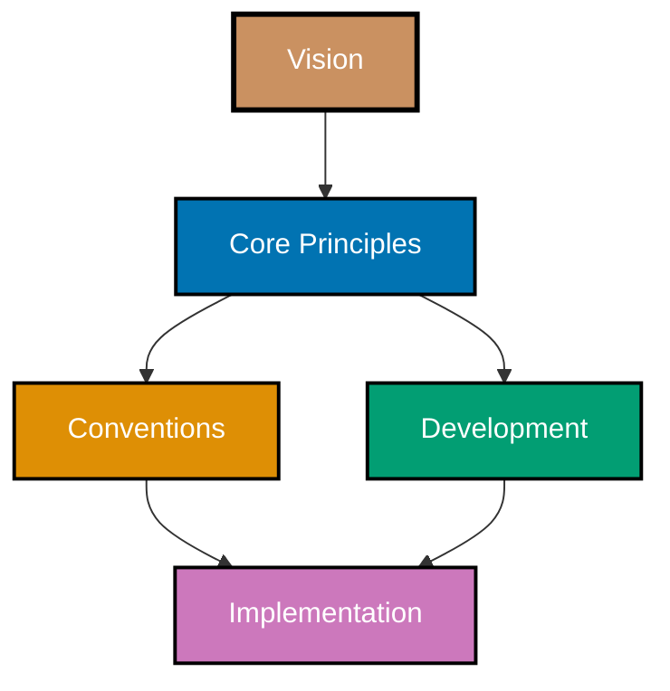

# Core Principles

Foundational principles that guide all conventions and development practices in the open-sharia-enterprise project. These principles represent the **why** behind our conventions and methodologies, and they serve the foundational [Vision](../vision/ex-vi__open-sharia-enterprise.md) of democratizing Shariah-compliant fintech.

## 🎯 Purpose

Core principles establish the philosophical foundation for how we build software and write documentation. These principles are the **governance layer** (Layer 1 in the six-layer hierarchy) - they serve the [Vision](../vision/ex-vi__open-sharia-enterprise.md) (Layer 0) and govern all conventions in `docs/explanation/conventions/` and development practices in `docs/explanation/development/`.

**Principles serve the vision and are stable values.** When creating or modifying any convention or practice, you must verify:

1. It serves the [Vision](../vision/ex-vi__open-sharia-enterprise.md) of democratizing Shariah-compliant fintech
2. It aligns with these principles

If a proposed change conflicts with a principle, either revise the change or document why the principle itself needs reconsideration (rare). All principles must include a "Vision Supported" section showing HOW the principle serves the foundational vision.



**Principle Hierarchy**:

- **Vision** (Layer 0) - Foundational purpose (WHY we exist, WHAT change we seek)
- **Core Principles** (Layer 1 - this section) - Foundational values that serve the vision and guide everything
- **Conventions** (Layer 2) - Documentation standards embodying these principles
- **Development** (Layer 3) - Software practices embodying these principles
- **Implementation** (Layer 4+) - Actual code, agents, workflows, and content following conventions and practices

## 🧪 The Layer Test for Principles

**Question**: Does this document answer "**WHY do we value this?**"

✅ **Belongs in principles/** if it defines:

- A foundational VALUE that governs decision-making
- A philosophical stance that applies across multiple contexts
- A timeless belief that guides conventions and practices
- The REASON behind multiple related standards

❌ **Does NOT belong** if it defines:

- WHAT specific rules to follow (that's a convention)
- HOW to implement something (that's a development practice)
- Step-by-step instructions (that's a how-to guide)
- Technical specifications (that's a reference)

**Examples**:

- "Why we value simplicity in all solutions" → ✅ Principle (foundational value)
- "Why accessibility must be built in from day one" → ✅ Principle (philosophical stance)
- "Why we avoid time estimates in learning materials" → ✅ Principle (timeless belief)
- "File naming must use prefix\_\_identifier format" → ❌ Convention (specific rule)
- "Use git hooks for automated validation" → ❌ Development (implementation practice)

**Key Distinction**: Principles answer "why we care", conventions/development answer "what to do" or "how to do it".

## 📋 Principles Index

### General Principles

Universal principles that apply to all problem-solving contexts - beyond software, content, or any specific domain.

#### 1. [Simplicity Over Complexity](./general/ex-pr-ge__simplicity-over-complexity.md)

Favor minimum viable abstraction and avoid over-engineering. Start simple and add complexity only when proven necessary.

**Key applications**:

- Flat library structure (no deep nesting)
- Single-purpose agents (not multi-role)
- Minimal frontmatter fields (only what's needed)
- Direct markdown (not complex templating)
- Convention documents (not frameworks)

### Content Principles

Principles specific to documentation, education, and communication - how we write, teach, and share knowledge.

#### 2. [Accessibility First](./content/ex-pr-co__accessibility-first.md)

Design for universal access from the start - WCAG compliance, color-blind friendly palettes, alt text, screen reader support. Accessibility benefits everyone.

**Key applications**:

- Color-blind friendly palette in all diagrams
- Alt text required for all images
- Proper heading hierarchy
- Semantic HTML
- WCAG AA contrast standards

#### 3. [No Time Estimates](./content/ex-pr-co__no-time-estimates.md)

People work and learn at vastly different speeds. Focus on outcomes and deliverables, not arbitrary time constraints.

**Key applications**:

- No time estimates in tutorials
- No "X hours" in educational content
- Coverage percentages instead (depth, not duration)
- Outcomes-focused language
- Plan deliverables (not timelines)

#### 4. [Progressive Disclosure](./content/ex-pr-co__progressive-disclosure.md)

Start simple and layer complexity gradually. Beginners see simple patterns, experts access advanced features when needed.

**Key applications**:

- Tutorial levels (Initial Setup → Quick Start → Beginner → Intermediate → Advanced)
- Diátaxis framework (Tutorials vs Reference)
- Documentation hierarchy (Overview → Details)
- File naming (simple prefix system)
- Convention documents (basic principles → advanced patterns)

### Software Engineering Principles

Principles specific to software development practices - configuration, automation, and code organization.

#### 5. [Automation Over Manual](./software-engineering/ex-pr-se__automation-over-manual.md)

Automate repetitive tasks to ensure consistency and reduce human error. Humans should focus on creative work, machines on repetitive tasks.

**Key applications**:

- Git hooks (pre-commit, commit-msg)
- AI agents (docs-checker, plan-validator)
- Prettier (code formatting)
- Commitlint (message validation)
- Link verification cache

#### 6. [Explicit Over Implicit](./software-engineering/ex-pr-se__explicit-over-implicit.md)

Choose explicit composition and configuration over magic, convenience, and hidden behavior. Code should be transparent and understandable.

**Key applications**:

- Explicit tool permissions in AI agents (not "all tools")
- Explicit file naming with prefixes (not "clever" abbreviations)
- Explicit frontmatter fields (not defaults)
- Explicit color hex codes (not CSS color names)

## 🔗 Traceability: From Principles to Implementation

Every principle should be traceable through three layers:

1. **Principle** (WHY) - The foundational value
2. **Convention or Practice** (WHAT/HOW) - The concrete rule implementing the principle
3. **Implementation** (ENFORCE) - Agents, code, or automation enforcing the rule

When documenting a new convention or practice, ALWAYS reference which principles it implements. When creating an agent, ALWAYS reference which conventions/practices it enforces.

### Complete Traceability Examples

#### Example 1: Color Accessibility Principle

**Core Principle**: Accessibility First

**Convention**: [Color Accessibility Convention](../conventions/ex-co__color-accessibility.md)

- Verified accessible palette (Blue, Orange, Teal, Purple, Brown)
- WCAG AA compliance required
- Color-blind testing mandatory

**Development**: [AI Agents Convention](../development/ex-de__ai-agents.md)

- Agent color categorization uses accessible palette
- Colored square emojis (🟦 🟩 🟨 🟪)
- Color is supplementary, not sole identifier

**Implementation**: Actual agent files

- Frontmatter `color` field uses accessible colors
- README displays colored emojis
- Text labels primary, color secondary

#### Example 2: Explicit Over Implicit Principle

**Principle**: Explicit Over Implicit (software engineering)

**Practice**: [AI Agents Convention](../development/ex-de__ai-agents.md)

- Explicit `tools` field listing allowed tools
- No default tool access
- Security through explicit whitelisting

**Implementation**: Multiple agents enforce this

- **agent-maker**: Validates new agents have explicit `tools` field in frontmatter
- **repo-rules-checker**: Audits agents for missing or incomplete tool declarations
- **repo-rules-fixer**: Can add missing frontmatter fields

**Result**: All agent files contain explicit tool lists:

```yaml
---
tools: Read, Glob, Grep
---
```

#### Example 3: Automation Over Manual Principle

**Principle**: Automation Over Manual (software engineering)

**Practice**: [Code Quality Convention](../development/ex-de__code-quality.md)

- Automated formatting via Prettier
- Automated validation via git hooks
- Automated commit message checking

**Implementation**: Multiple systems enforce this

- **Husky + lint-staged**: Pre-commit hook formats code automatically
- **Commitlint**: Commit-msg hook validates message format
- **Various checker agents**: Automated quality validation (docs-checker, repo-rules-checker, etc.)

**Result**: Code quality maintained automatically without manual intervention

## 🧭 Using These Principles

### When Creating Conventions or Practices

Every new convention (documentation rule) or practice (software standard) must trace back to one or more core principles.

**Process**:

1. **Identify the need**: What problem are you solving?
2. **Choose the principle**: Which principle(s) does this implement?
3. **Document the connection**: In the convention/practice document, explicitly reference which principles it embodies
4. **Verify alignment**: Does the proposed rule conflict with any principles?
5. **Plan enforcement**: Which agents or automation will implement this rule?

**Template for new conventions/practices**:

```markdown
## Principles Implemented

This convention implements the following core principles:

- **[Principle Name](link)**: Explain how this rule embodies the principle
- **[Another Principle](link)**: Explain the connection
```

**Questions to ask**:

- Does this convention embody our core principles?
- Which principle does it support?
- Does it create unnecessary complexity? (violates Simplicity Over Complexity)
- Is it explicit and understandable? (violates Explicit Over Implicit)
- Is it accessible to all users? (violates Accessibility First)
- Can it be automated? (supports Automation Over Manual)

### When Making Decisions

Prioritize principles in order of importance:

1. **Accessibility First** - Never compromise accessibility
2. **Explicit Over Implicit** - Clarity beats convenience
3. **Simplicity Over Complexity** - Simple solutions first
4. **Automation Over Manual** - Automate when proven repetitive
5. **Progressive Disclosure** - Support all skill levels
6. **No Time Estimates** - Focus on outcomes

### When Adding New Conventions or Practices

After creating a new convention or practice document:

1. **Use docs-maker** to create the convention/practice document with principles section
2. **Use repo-rules-maker** to make the change effective across repository:
   - Update CLAUDE.md with brief summary
   - Update relevant README files (conventions/development index)
   - Update agents that should enforce the new rule
   - Add validation checks to appropriate checker agents
3. **Use repo-rules-checker** to validate consistency after changes
4. **Use repo-rules-fixer** if issues found (after user review)

**Workflow**: docs-maker (create) → repo-rules-maker (propagate) → repo-rules-checker (validate) → repo-rules-fixer (fix if needed)

### When Reviewing Changes

Check that changes:

- ✅ Respect accessibility standards
- ✅ Use explicit configuration
- ✅ Maintain simplicity
- ✅ Leverage automation appropriately
- ✅ Support progressive learning
- ✅ Avoid artificial time constraints
- ✅ Trace back to core principles (documented in convention/practice)

## 📚 Related Documentation

- [Vision](../vision/ex-vi__open-sharia-enterprise.md) - Foundational purpose that inspires all principles
- [Conventions Index](../conventions/README.md) - Documentation conventions embodying these principles
- [Development Index](../development/README.md) - Development practices embodying these principles
- [Explanation Index](../README.md) - All conceptual documentation

---

**Last Updated**: 2025-12-24
