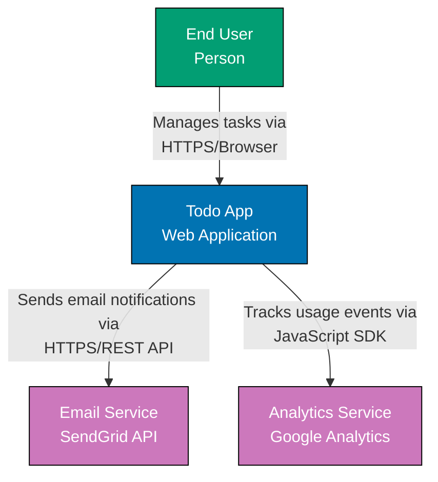
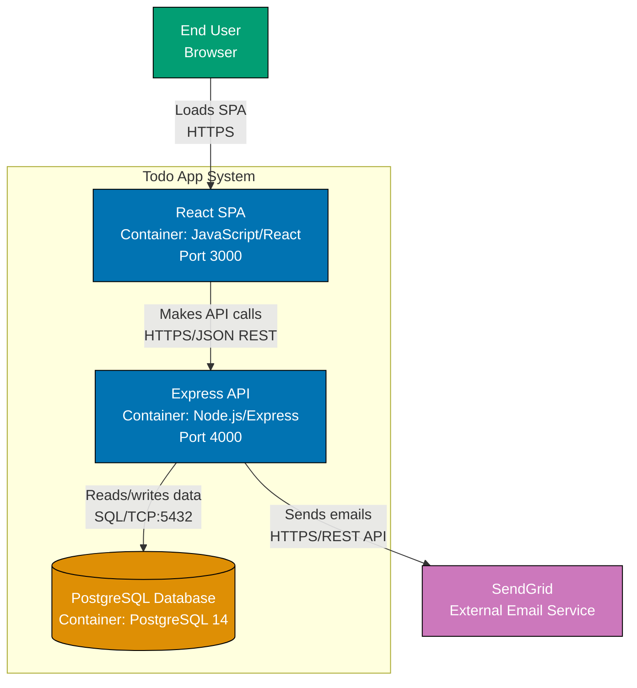
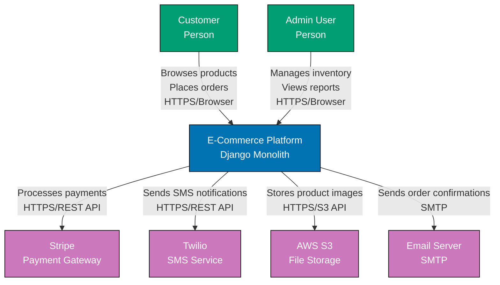
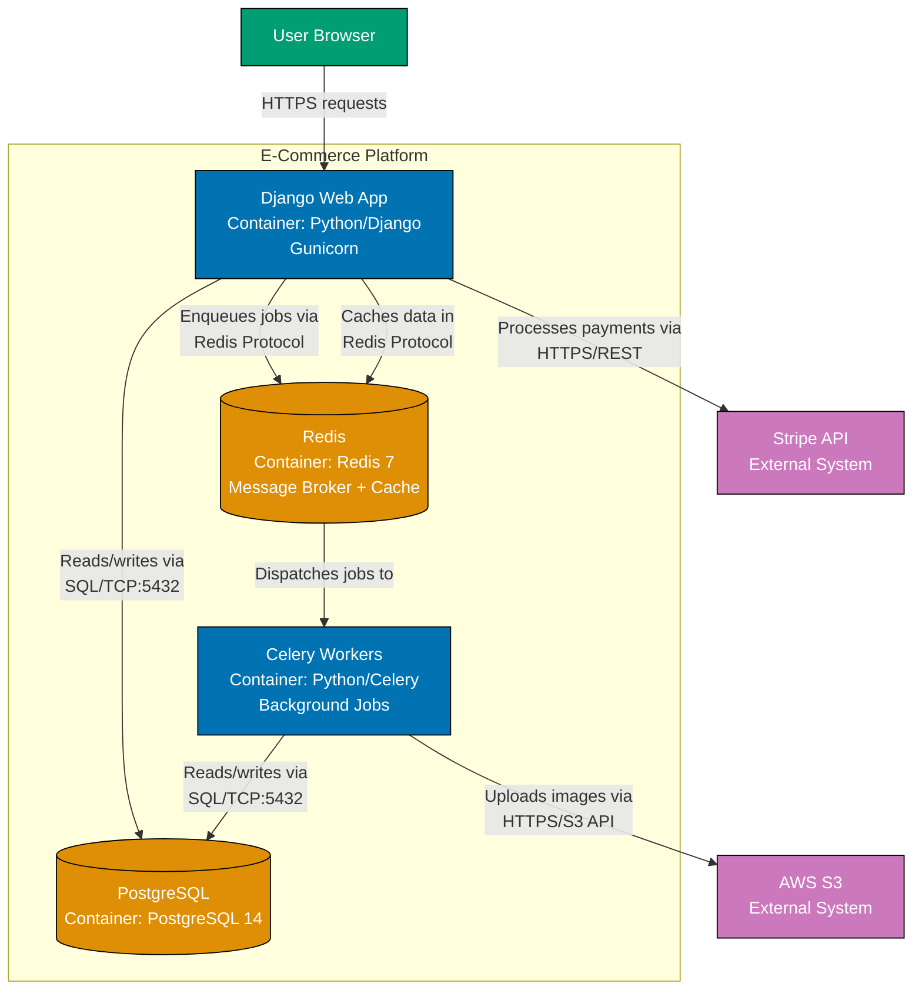
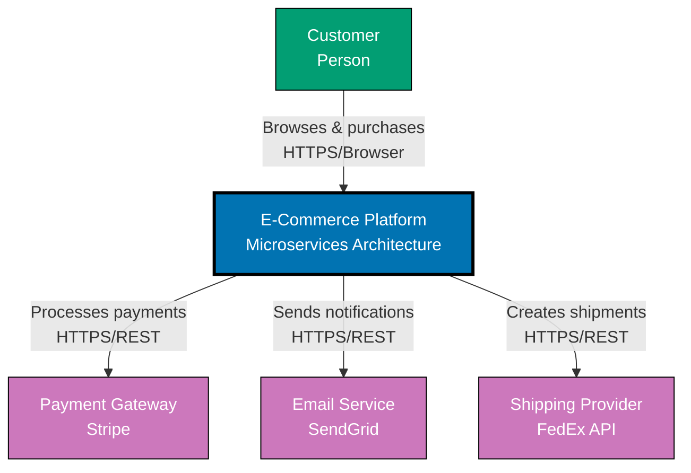
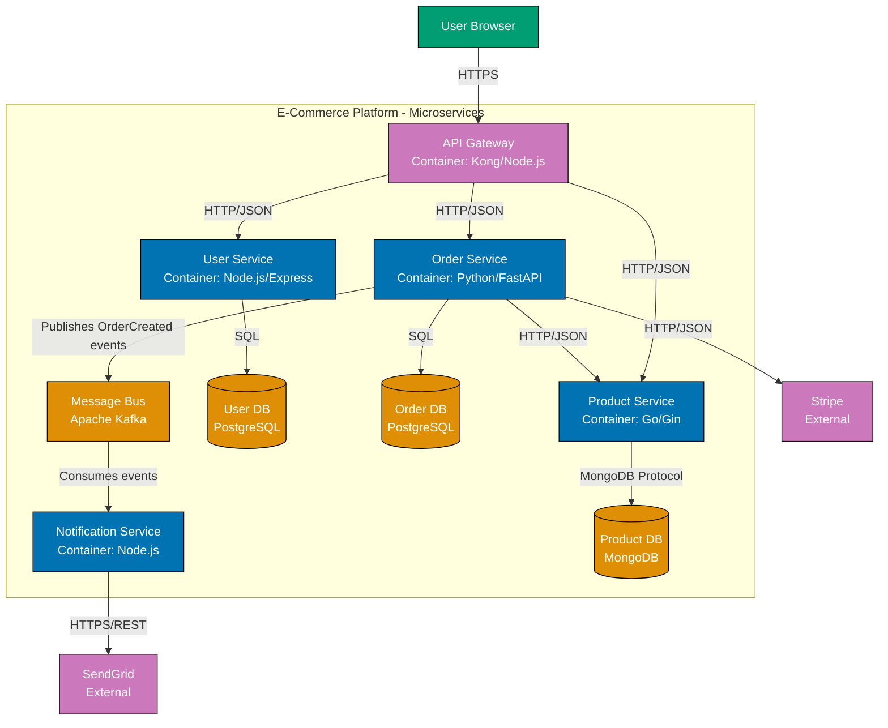

# Simple Application Examples

Practical examples showing when C4 diagrams add value and when they might be overkill for straightforward systems.

## Overview

The C4 model is powerful for documenting complex systems, but not every application needs comprehensive C4 diagrams. This guide helps you understand when diagrams genuinely help versus when they add unnecessary overhead.

**Core Principle**: Create diagrams that answer questions, not diagrams for the sake of having diagrams.

**Key Questions to Ask**:

- Will this diagram help new team members understand the system faster?
- Does the architecture have non-obvious relationships or patterns?
- Are there multiple technical stakeholders who need to understand the system?
- Is the system complex enough that a diagram clarifies rather than restates the obvious?

If you answer "no" to most questions, consider whether you need diagrams at all.

## Example 1: Basic 3-Tier Web App (When Diagrams May Not Be Needed)

**System Description**:

- **Frontend**: React Single Page Application
- **Backend**: Express.js REST API
- **Database**: PostgreSQL
- **Team Size**: 2-3 developers
- **Complexity**: Low - standard CRUD operations, simple authentication

**When This System Might Not Need Extensive C4 Diagrams**:

For very simple 3-tier applications with standard patterns, extensive diagrams can feel like documentation theater. The architecture is self-explanatory from the technology stack itself.

**Minimal Documentation Approach**:

1. **System Context**: Useful for showing external integrations (if any)
2. **Container Diagram**: Useful for showing deployment units
3. **Component Diagrams**: Likely overkill - file structure is self-documenting
4. **Code Diagrams**: Definitely overkill

### System Context Diagram (Still Valuable)

Even for simple systems, a Context diagram helps show external dependencies and users.



**Value Add**: Shows external dependencies (SendGrid, Google Analytics) that aren't obvious from codebase alone.

### Container Diagram (Shows Deployment Units)



**Value Add**: Shows three deployable units and their communication. Helps DevOps understand deployment topology.

**Component Diagram: Likely Overkill**

For a simple Express API with standard structure:

```text
routes/
  tasks.js
  auth.js
controllers/
  taskController.js
  authController.js
services/
  taskService.js
  authService.js
repositories/
  taskRepository.js
  userRepository.js
```

**Verdict**: File structure is self-documenting. A component diagram would just restate what's already obvious from directory layout. Skip it unless there are non-obvious architectural patterns (e.g., event-driven processing, complex business rules).

**Documentation Recommendation**:

- ✅ **Context Diagram**: Yes - shows external dependencies
- ✅ **Container Diagram**: Yes - shows deployment units
- ❌ **Component Diagram**: No - file structure is clear
- ❌ **Code Diagram**: No - definitely overkill

**Alternative to Diagrams**: README with bullet points:

```markdown
## Architecture

- **Frontend**: React SPA (create-react-app) on port 3000
- **Backend**: Express REST API on port 4000
- **Database**: PostgreSQL 14
- **External Services**: SendGrid for email, Google Analytics for tracking
```

For 2-3 developers working on this system, the README bullet points may be sufficient. Create diagrams only if you're onboarding frequently or have stakeholders who need visual documentation.

## Example 2: Monolithic Web Application (When Context Diagram Helps)

**System Description**:

- **Technology**: Django monolith
- **Database**: PostgreSQL
- **Background Jobs**: Celery + Redis
- **External Integrations**: Stripe (payments), Twilio (SMS), AWS S3 (file storage)
- **Team Size**: 5-8 developers
- **Complexity**: Medium - multiple external integrations, background processing

**Why This System Benefits from Diagrams**:

External integrations and background job processing add complexity that isn't obvious from codebase alone. Diagrams clarify system boundaries and integration points.

### System Context Diagram (High Value)



**Value Add**: Immediately shows all external integrations. New developers understand dependencies without reading through settings files.

### Container Diagram (Reveals Internal Structure)



**Value Add**: Shows background job processing with Celery, Redis as both message broker and cache, and which services access external APIs. Non-obvious without diagram.

**Documentation Recommendation**:

- ✅ **Context Diagram**: Yes - multiple external integrations
- ✅ **Container Diagram**: Yes - background processing not obvious
- ⚠️ **Component Diagram**: Maybe - only if Django app structure is complex (e.g., domain-driven design)
- ❌ **Code Diagram**: No - Django ORM models are self-documenting

## Example 3: Small Microservices (When Container Diagram Adds Value)

**System Description**:

- **Microservices**: 3-4 services (User Service, Order Service, Product Service, Notification Service)
- **Technology**: Mix of Node.js, Python, Go
- **Communication**: HTTP REST APIs, Kafka for events
- **Team Size**: 8-12 developers across multiple teams
- **Complexity**: Medium-High - distributed system with async messaging

**Why This System Requires Diagrams**:

Microservices introduce distributed complexity. Service-to-service communication patterns, event flows, and integration points are impossible to understand without diagrams.

### System Context Diagram



### Container Diagram (Critical for Microservices)



**Value Add**: Critical for understanding:

- Service boundaries (which service owns which functionality)
- Database-per-service pattern (each service has own database)
- Synchronous vs. asynchronous communication
- Event-driven patterns (Kafka message bus)
- External system integration points

Without this diagram, developers would need to read code across 4 repositories to understand the architecture.

**Documentation Recommendation**:

- ✅ **Context Diagram**: Yes - shows system boundary
- ✅ **Container Diagram**: Absolutely critical - distributed system complexity
- ✅ **Component Diagram**: Yes - for complex services (e.g., Order Service with saga pattern)
- ⚠️ **Dynamic Diagram**: Highly recommended - show order creation flow across services
- ❌ **Code Diagram**: No - unless explaining specific design patterns

## Decision Matrix: When to Create Diagrams

Use this table to decide which C4 diagrams to create based on system characteristics.

| System Characteristic                               | Context | Container | Component | Dynamic | Code |
| --------------------------------------------------- | ------- | --------- | --------- | ------- | ---- |
| **Simple 3-Tier App (Frontend + API + DB)**         | ✅      | ✅        | ❌        | ❌      | ❌   |
| **Monolith with External Integrations**             | ✅      | ✅        | ⚠️        | ❌      | ❌   |
| **Microservices (3+ services)**                     | ✅      | ✅ ✅     | ✅        | ✅      | ❌   |
| **Large Monolith (50+ modules)**                    | ✅      | ✅        | ✅ ✅     | ⚠️      | ⚠️   |
| **Distributed System with Event-Driven Patterns**   | ✅      | ✅ ✅     | ✅        | ✅ ✅   | ❌   |
| **Simple CRUD App (No External Integrations)**      | ⚠️      | ⚠️        | ❌        | ❌      | ❌   |
| **Serverless Architecture (10+ Lambda Functions)**  | ✅      | ✅ ✅     | ⚠️        | ✅      | ❌   |
| **Enterprise Integration (Multiple Legacy Systems** | ✅ ✅   | ✅        | ⚠️        | ⚠️      | ❌   |
| **Team Size: 1-3 Developers**                       | ⚠️      | ⚠️        | ❌        | ❌      | ❌   |
| **Team Size: 4-10 Developers**                      | ✅      | ✅        | ⚠️        | ⚠️      | ❌   |
| **Team Size: 11+ Developers**                       | ✅      | ✅ ✅     | ✅        | ✅      | ⚠️   |
| **Frequent Onboarding (New Hires Monthly)**         | ✅ ✅   | ✅ ✅     | ✅        | ✅      | ⚠️   |
| **Stable Team (No Onboarding for 6+ Months)**       | ⚠️      | ⚠️        | ❌        | ❌      | ❌   |
| **High Stakeholder Communication Needs**            | ✅ ✅   | ✅        | ⚠️        | ⚠️      | ❌   |
| **Complex Business Logic**                          | ✅      | ✅        | ✅ ✅     | ✅      | ⚠️   |
| **Standard CRUD Operations Only**                   | ⚠️      | ⚠️        | ❌        | ❌      | ❌   |
| **Async Message-Driven Architecture**               | ✅      | ✅ ✅     | ✅        | ✅ ✅   | ❌   |
| **Background Job Processing**                       | ✅      | ✅        | ⚠️        | ⚠️      | ❌   |
| **Real-Time WebSocket Communication**               | ✅      | ✅        | ⚠️        | ✅      | ❌   |

**Legend**:

- ✅ **Create This Diagram**: High value, creates clarity
- ✅ ✅ **Definitely Create**: Critical for understanding
- ⚠️ **Consider Creating**: May add value depending on context
- ❌ **Skip This Diagram**: Likely overkill, low value-to-effort ratio

**Rules of Thumb**:

1. **Always start with Context and Container**: These two provide 80% of value with 20% of effort
2. **Component diagrams for complexity**: Only when containers have non-obvious internal structure
3. **Dynamic diagrams for workflows**: Only when sequence of operations isn't obvious from static diagrams
4. **Code diagrams are rare**: Only for genuinely complex design patterns or legacy code explanation
5. **Team size matters**: Smaller teams (1-3 devs) can often skip diagrams entirely; larger teams (10+) benefit greatly

## When NOT to Create Diagrams

Sometimes diagrams add overhead without adding clarity. Skip diagrams when:

### 1. System is Self-Explanatory

**Example**: Simple script that reads CSV and writes to database.

```bash
# No diagram needed - README is sufficient
python import_data.py --input data.csv --db postgres://localhost/mydb
```

**Why**: One-step process with obvious inputs and outputs.

### 2. Architecture is Industry Standard

**Example**: Standard Rails application with MVC pattern.

**Why**: Developers familiar with Rails already understand the architecture. Diagram restates framework conventions.

### 3. Team is Too Small

**Example**: Solo developer or pair working on side project.

**Why**: Overhead of maintaining diagrams outweighs value when everyone knows the system intimately.

### 4. System Changes Rapidly

**Example**: Early-stage startup pivoting frequently.

**Why**: Diagrams become stale immediately. Wait until architecture stabilizes.

### 5. Code is Self-Documenting

**Example**: Well-structured monorepo with clear module boundaries:

```text
apps/
  web-frontend/
  mobile-app/
  admin-dashboard/
libs/
  auth/
  payments/
  notifications/
```

**Why**: Directory structure already provides architectural overview.

## Key Insights

**Don't Create Diagrams Just to Have Them**

C4 diagrams are tools for communication and understanding. They're not checkboxes to complete. Ask:

- **Does this diagram answer a question someone has?**
- **Does this diagram prevent confusion?**
- **Will this diagram help onboard new team members?**
- **Does this diagram clarify non-obvious patterns?**

If you answer "no", skip the diagram.

**Start Minimal, Add When Needed**

- **Phase 1 (Day 1)**: Context diagram only
- **Phase 2 (Week 1)**: Add Container diagram if system has multiple deployable units
- **Phase 3 (As Complexity Grows)**: Add Component diagrams for complex containers
- **Phase 4 (For Critical Workflows)**: Add Dynamic diagrams for non-obvious interactions

**The Goldilocks Principle**

- **Too Few Diagrams**: New developers struggle to understand system, ask repeated questions
- **Too Many Diagrams**: Diagrams become maintenance burden, quickly outdated, ignored
- **Just Right**: Diagrams answer common questions, stay up-to-date, actually used by team

**Measure Value by Usage**

Good diagrams are:

- Referenced in onboarding sessions
- Included in architecture reviews
- Updated during significant changes
- Linked from documentation and pull requests
- Viewed regularly (check analytics if available)

Bad diagrams are:

- Created once, never updated
- Ignored by team
- Contradict actual architecture
- More complex than the code they document

**Alternative to Diagrams: Structured README**

For simple systems, a well-structured README can provide more value than diagrams:

```markdown
## Architecture

### System Overview

- **Type**: 3-tier web application
- **Frontend**: React SPA
- **Backend**: Express API
- **Database**: PostgreSQL

### External Dependencies

- **Stripe**: Payment processing
- **SendGrid**: Email notifications
- **AWS S3**: File storage

### Deployment

- **Environment**: Docker Compose (dev), Kubernetes (prod)
- **Scaling**: API horizontally scaled, database single instance

### Communication Patterns

- Frontend → Backend: HTTPS/REST
- Backend → Database: SQL
- Backend → External APIs: HTTPS/REST
```

**When README is Sufficient**:

- System has fewer than 5 deployable units
- Architecture follows standard patterns
- Team size is small (1-5 developers)
- Stakeholders are technical and familiar with stack

**When Diagrams Add Value**:

- System has 6+ deployable units
- Non-standard architectural patterns
- Multiple teams or stakeholders
- Frequent onboarding or external communication

## Summary

**Universal Truths**:

1. **Context + Container diagrams provide 80% of value** for most systems
2. **Component diagrams only for complex containers** with non-obvious structure
3. **Dynamic diagrams for critical workflows** that aren't obvious from structure alone
4. **Code diagrams are rare** - only for genuinely complex design patterns
5. **Simple systems may not need any diagrams** - README can be sufficient
6. **Diagrams should answer questions**, not create documentation for its own sake
7. **Measure diagram value by team usage**, not by completeness

**Final Recommendation**:

Create C4 diagrams when they **clarify complexity**, not when they **restate simplicity**. A well-structured README for a simple system is better than comprehensive C4 diagrams that nobody maintains.
