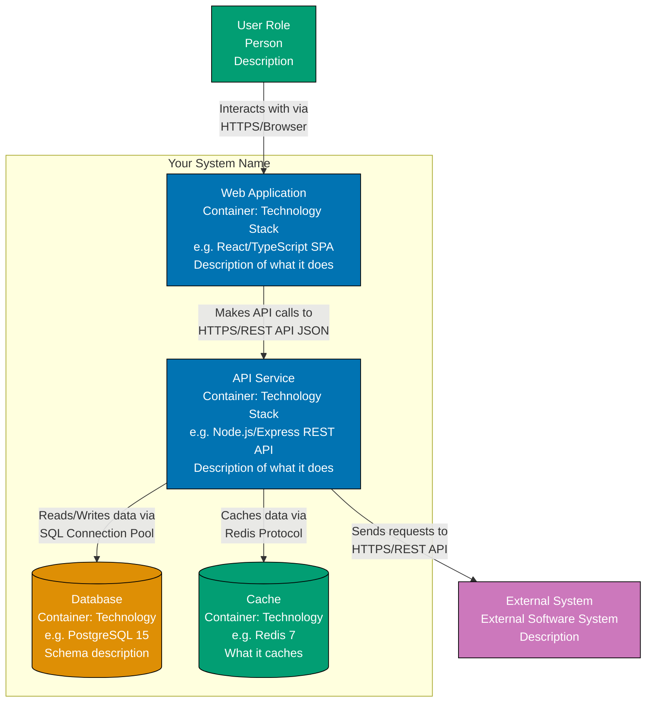

# [Your System Name] - Container Diagram

## Purpose

This diagram zooms into **[Your System Name]** to show the high-level technical building blocks (containers). A container is:

- A separately runnable/deployable unit (application, database, file system, etc.)
- Something that executes code or stores data

**Audience**: Technical stakeholders, developers, architects, DevOps engineers.

## Diagram

## Legend

| Element                 | Color  | Description                                          |
| ----------------------- | ------ | ---------------------------------------------------- |
| **Person**              | Teal   | Users, actors, or roles                              |
| **Application/Service** | Blue   | Executable applications, APIs, services              |
| **Database**            | Orange | Primary data stores (relational, NoSQL)              |
| **Cache/Store**         | Teal   | Secondary data stores (cache, queue, blob)           |
| **External System**     | Purple | External software systems (third-party, other teams) |

## Container Descriptions

### [Container 1: Web Application]

- **Technology**: [e.g., React 18 with TypeScript, hosted on Vercel]
- **Responsibilities**:
  - [e.g., User interface for browsing products]
  - [e.g., Client-side form validation]
  - [e.g., Routing and navigation]
- **Communication**: [e.g., Communicates with API Service via HTTPS/REST]

### [Container 2: API Service]

- **Technology**: [e.g., Node.js 20 with Express framework, deployed on AWS ECS]
- **Responsibilities**:
  - [e.g., Business logic for order processing]
  - [e.g., Authentication and authorization]
  - [e.g., Data validation and transformation]
- **Communication**: [e.g., Exposes REST API, calls PostgreSQL, integrates with Payment Gateway]

### [Container 3: Database]

- **Technology**: [e.g., PostgreSQL 15 on AWS RDS]
- **Responsibilities**:
  - [e.g., Stores customer orders, products, and user accounts]
  - [e.g., Enforces data integrity via constraints and foreign keys]
- **Communication**: [e.g., Accessed via SQL from API Service]

### [Container 4: Cache (Optional)]

- **Technology**: [e.g., Redis 7 on AWS ElastiCache]
- **Responsibilities**:
  - [e.g., Caches frequently accessed product catalog]
  - [e.g., Stores session data]
- **Communication**: [e.g., Accessed via Redis protocol from API Service]

## Technology Stack Summary

| Container       | Technology                   | Deployment Target       | Scaling Strategy     |
| --------------- | ---------------------------- | ----------------------- | -------------------- |
| Web Application | [e.g., React/TypeScript SPA] | [e.g., Vercel CDN]      | [e.g., Automatic]    |
| API Service     | [e.g., Node.js/Express]      | [e.g., AWS ECS Fargate] | [e.g., Horizontal]   |
| Database        | [e.g., PostgreSQL 15]        | [e.g., AWS RDS]         | [e.g., Vertical]     |
| Cache           | [e.g., Redis 7]              | [e.g., AWS ElastiCache] | [e.g., Cluster mode] |

## Key Interactions

### [User → Web Application]

- User accesses web UI via browser (HTTPS)
- Web app is a single-page application (SPA) with client-side routing

### [Web Application → API Service]

- Web app makes REST API calls (HTTPS/JSON)
- Authentication via JWT tokens in Authorization header

### [API Service → Database]

- API service connects to PostgreSQL via connection pool
- Executes SQL queries for CRUD operations

### [API Service → External System]

- [Describe integration: e.g., Calls Payment Gateway for credit card processing via REST API]

## Notes

- Add any important notes about technology choices, scaling considerations, or architectural decisions
- Mention if containers can scale independently or have dependencies

## Related Diagrams

- **[System Context Diagram](./blank-context-diagram.md)**: Shows where [Your System Name] fits in the broader ecosystem
- **[Component Diagram](./blank-component-diagram.md)**: Shows internal structure of [Container Name]
- **[Deployment Diagram](./blank-deployment-diagram.md)**: Shows how containers are deployed to infrastructure

---

**Template Instructions**:

1. Replace `[Your System Name]` with your actual system name
2. Replace container placeholders (WebApp, APIService, Database, Cache) with your actual containers
3. Update technology stacks for each container (e.g., "React 18", "Node.js 20", "PostgreSQL 15")
4. Add or remove containers as needed (most systems have 2-6 containers)
5. Update relationship labels to describe HOW containers communicate (include protocol/method)
6. Fill in "Container Descriptions", "Technology Stack Summary", and "Key Interactions" sections
7. Update frontmatter (title, description, tags, created/updated dates)
8. Delete this template instructions section when done

**See**: [Level 2: Container](../ex-c4armo__02-level-2-container.md) for detailed guidance.
