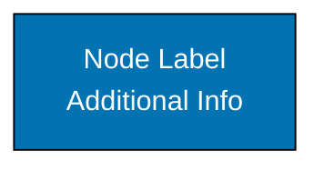

# WCAG-Compliant Color Palette for C4 Diagrams

This document defines the **WCAG AA-compliant** color palette used for all C4 architecture diagrams in this repository. These colors ensure diagrams are accessible to users with color vision deficiencies.

## Color Palette Overview

All C4 diagrams in this repository **MUST** use only these 8 approved colors:

| Color  | Hex Code  | Preview | Primary Use Case                                   |
| ------ | --------- | ------- | -------------------------------------------------- |
| Blue   | `#0173B2` | 🔵      | Primary containers, applications, services         |
| Teal   | `#029E73` | 🟢      | Secondary containers, users, caches, queues        |
| Orange | `#DE8F05` | 🟠      | Databases, persistence layers, data stores         |
| Purple | `#CC78BC` | 🟣      | External systems, third-party APIs, load balancers |
| Brown  | `#CA9161` | 🟤      | Legacy systems, deprecated components              |
| Black  | `#000000` | ⚫      | Borders, text, outlines                            |
| White  | `#FFFFFF` | ⚪      | Backgrounds, text on dark fills                    |
| Gray   | `#808080` | ⚙️      | Infrastructure nodes, supporting services          |

## Contrast Ratios (WCAG AA Compliance)

All colors meet **WCAG AA minimum contrast ratio of 4.5:1** when used correctly:

| Color  | Hex Code  | Contrast with White | Contrast with Black | Recommended Text Color |
| ------ | --------- | ------------------- | ------------------- | ---------------------- |
| Blue   | `#0173B2` | 5.93:1 ✓            | 3.55:1 ✗            | White                  |
| Teal   | `#029E73` | 4.70:1 ✓            | 4.48:1 ✗            | White                  |
| Orange | `#DE8F05` | 3.00:1 ✗            | 7.01:1 ✓            | Black                  |
| Purple | `#CC78BC` | 2.94:1 ✗            | 7.15:1 ✓            | Black                  |
| Brown  | `#CA9161` | 2.99:1 ✗            | 7.03:1 ✓            | Black                  |
| Black  | `#000000` | 1:1 ✗               | 21:1 ✓              | White                  |
| White  | `#FFFFFF` | 21:1 ✓              | 1:1 ✗               | Black                  |
| Gray   | `#808080` | 3.95:1 ✗            | 5.31:1 ✓            | Black or White         |

**Key**:

- ✓ = Meets WCAG AA minimum (4.5:1)
- ✗ = Does not meet WCAG AA minimum

## Mermaid Styling Syntax

Use this exact syntax for all Mermaid diagrams:



**Format Breakdown**:

- `fill:#0173B2` = Background color (hex code)
- `stroke:#000000` = Border color (always black `#000000`)
- `color:#ffffff` = Text color (white `#ffffff` or black `#000000`)

**Examples**:

```mermaid
%% Blue node with white text
style APIService fill:#0173B2,stroke:#000000,color:#ffffff

%% Orange node with black text
style Database fill:#DE8F05,stroke:#000000,color:#000000

%% Teal node with white text
style User fill:#029E73,stroke:#000000,color:#ffffff

%% Purple node with black text
style ExternalAPI fill:#CC78BC,stroke:#000000,color:#000000
```

## Usage Guidelines by Diagram Type

### System Context Diagram (Level 1)

| Element Type     | Recommended Color | Hex Code  | Text Color |
| ---------------- | ----------------- | --------- | ---------- |
| People/Users     | Teal              | `#029E73` | White      |
| Your System      | Blue              | `#0173B2` | White      |
| External Systems | Purple            | `#CC78BC` | Black      |

### Container Diagram (Level 2)

| Element Type            | Recommended Color | Hex Code  | Text Color |
| ----------------------- | ----------------- | --------- | ---------- |
| Applications/Services   | Blue              | `#0173B2` | White      |
| Databases               | Orange            | `#DE8F05` | Black      |
| Caches/Queues           | Teal              | `#029E73` | White      |
| External Systems        | Purple            | `#CC78BC` | Black      |
| People/Users (if shown) | Teal              | `#029E73` | White      |

### Component Diagram (Level 3)

| Element Type           | Recommended Color | Hex Code  | Text Color |
| ---------------------- | ----------------- | --------- | ---------- |
| Components (all types) | Blue              | `#0173B2` | White      |
| Databases              | Orange            | `#DE8F05` | Black      |
| External Systems       | Purple            | `#CC78BC` | Black      |

### Dynamic Diagram (Sequence)

Dynamic diagrams use Mermaid `sequenceDiagram` which has limited color customization. Use standard rendering.

### Deployment Diagram

| Element Type           | Recommended Color | Hex Code  | Text Color     |
| ---------------------- | ----------------- | --------- | -------------- |
| Containers (software)  | Blue              | `#0173B2` | White          |
| Infrastructure Nodes   | Gray              | `#808080` | White or Black |
| Databases              | Orange            | `#DE8F05` | Black          |
| Caches/Queues          | Teal              | `#029E73` | White          |
| Load Balancers/Network | Purple            | `#CC78BC` | Black          |
| People/Users           | Teal              | `#029E73` | White          |

## Special Use Cases

### Legacy or Deprecated Components

Use **Brown** (`#CA9161`) to indicate legacy systems being phased out:

```mermaid
style LegacySystem fill:#CA9161,stroke:#000000,color:#000000
```

### Multi-Paradigm Systems

Use color to distinguish paradigms in multi-paradigm systems:

- **Blue** for functional programming components
- **Purple** for object-oriented components
- **Teal** for procedural components

**See**: [Paradigm Considerations](../ex-c4armo__10-paradigm-considerations.md) for detailed examples.

### Migration Diagrams

When showing before/after states during migration:

- **Blue** for new implementation
- **Gray** for infrastructure (unchanged)
- **Brown** for legacy components being replaced

## Accessibility Verification Checklist

Before publishing diagrams, verify:

- [ ] All colors are from the approved 8-color palette
- [ ] No custom colors used (no `#FF5733` or other hex codes)
- [ ] All dark fills (Blue, Teal, Black) use white text (`color:#ffffff`)
- [ ] All light fills (Orange, Purple, Brown, Gray) use black text (`color:#000000`)
- [ ] All nodes have black borders (`stroke:#000000`)
- [ ] Color is not the only way to distinguish elements (labels provide context)
- [ ] Diagram is readable in grayscale (test by converting to black/white)
- [ ] Contrast ratios meet WCAG AA minimum (4.5:1) - use table above

## Testing for Color Blindness

Verify diagrams are accessible to users with color vision deficiencies:

1. **Deuteranopia (Red-Green Color Blindness)**:
   - Use [Coblis Color Blindness Simulator](https://www.color-blindness.com/coblis-color-blindness-simulator/)
   - Upload screenshot of diagram
   - Select "Deuteranopia" filter
   - Verify elements are still distinguishable

2. **Protanopia (Red-Blind)**:
   - Same tool, select "Protanopia" filter
   - Verify elements distinguishable

3. **Tritanopia (Blue-Yellow Color Blindness)**:
   - Same tool, select "Tritanopia" filter
   - Verify elements distinguishable

4. **Grayscale Test**:
   - Convert diagram to grayscale
   - Verify all elements distinguishable by shade and labels

## Common Mistakes to Avoid

### ❌ Using Custom Colors

```mermaid
%% WRONG: Custom color not in approved palette
style BadNode fill:#FF5733,stroke:#000000,color:#ffffff
```

**Fix**: Use approved palette (e.g., Orange `#DE8F05` for databases)

### ❌ Wrong Text Color for Fill

```mermaid
%% WRONG: Blue fill with black text (contrast too low: 3.55:1)
style BadNode fill:#0173B2,stroke:#000000,color:#000000
```

**Fix**: Use white text on blue fill:

```mermaid
style GoodNode fill:#0173B2,stroke:#000000,color:#ffffff
```

### ❌ Omitting Borders

```mermaid
%% WRONG: No stroke color specified
style BadNode fill:#0173B2,color:#ffffff
```

**Fix**: Always include black borders:

```mermaid
style GoodNode fill:#0173B2,stroke:#000000,color:#ffffff
```

### ❌ Relying Only on Color

**WRONG**: "The blue boxes are internal, purple boxes are external"

**Fix**: Use labels that provide context:

- "User Service (Internal)"
- "Payment Gateway (External)"

## Related Documentation

- **[Repository Diagram Convention](../../../../../governance/conventions/formatting/diagrams.md)** - Full accessibility requirements
- **[C4 Model Overview](../README.md)** - Introduction to C4 architecture model
- **[Best Practices](../ex-c4armo__09-best-practices.md)** - When to use C4, common mistakes
- **[Template README](./README.md)** - How to use diagram templates

## External Resources

- [WCAG 2.1 Contrast Requirements](https://www.w3.org/WAI/WCAG21/Understanding/contrast-minimum.html)
- [WebAIM Contrast Checker](https://webaim.org/resources/contrastchecker/)
- [Coblis Color Blindness Simulator](https://www.color-blindness.com/coblis-color-blindness-simulator/)
