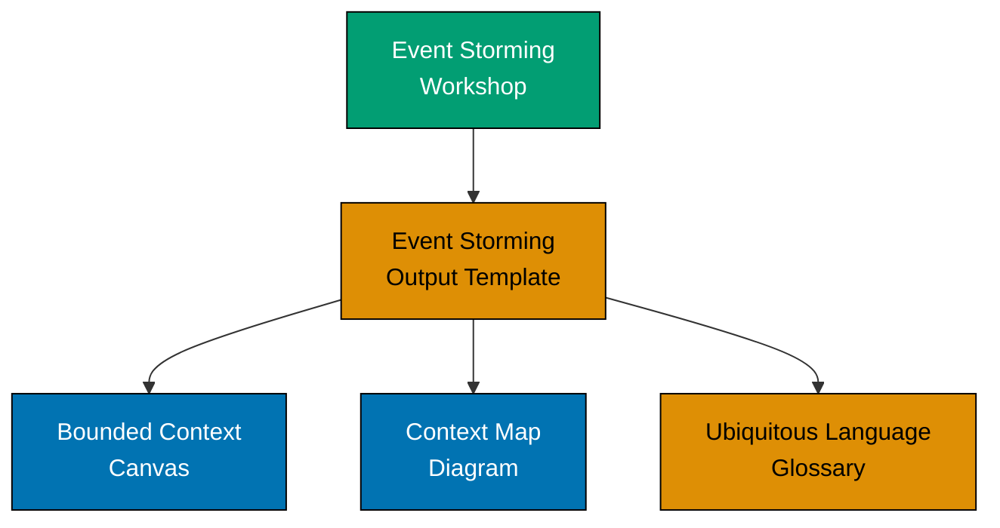
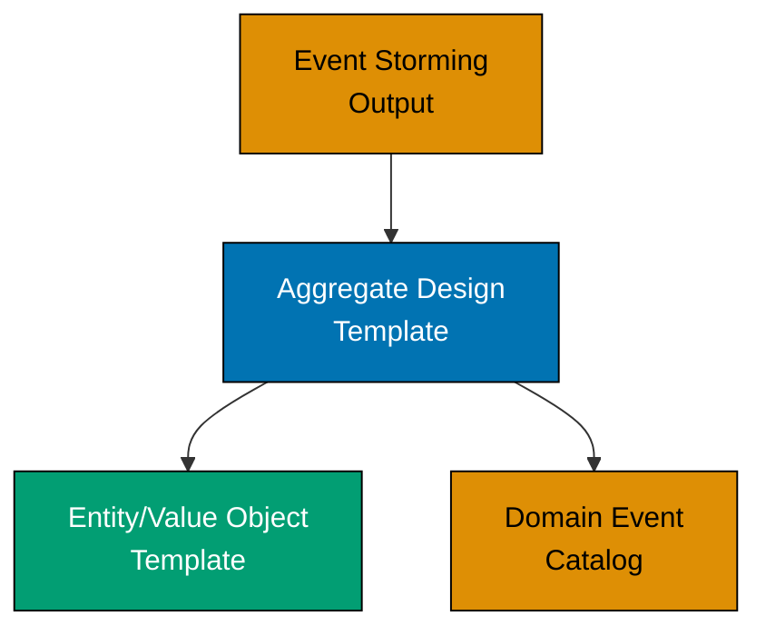

# DDD Templates

This directory provides ready-to-use templates for documenting Domain-Driven Design (DDD) artifacts. These templates support strategic design (bounded contexts, context mapping) and tactical design (aggregates, entities, value objects, domain events).

## Available Templates

### Strategic Design Templates

**1. [Bounded Context Canvas](./bounded-context-canvas.md)** (~12KB)

Comprehensive template for documenting a bounded context with team ownership, ubiquitous language, model components, integration points, and technology decisions.

**When to use**:

- Strategic design workshops
- Documenting existing bounded contexts
- Cross-team alignment on context boundaries
- Onboarding new team members to a context

**Key sections**: Overview, Ubiquitous Language, Business Decisions, Model Components, Integration, Domain Events, Technology, Team Ownership

**Example**: Zakat Calculation Bounded Context with nisab thresholds, hawl tracking, and integration with Accounting/Payment contexts

---

**2. [Context Map Diagram](./context-map-diagram.md)** (~9KB)

Mermaid diagram template visualizing relationships between bounded contexts using DDD integration patterns (Partnership, Customer/Supplier, Conformist, Anticorruption Layer, etc.).

**When to use**:

- System architecture overview
- Integration planning between contexts
- Identifying upstream/downstream dependencies
- Team coordination and communication

**Key patterns**: Partnership, Shared Kernel, Customer/Supplier, Conformist, Anticorruption Layer, Open Host Service, Published Language, Separate Ways

**Example**: OSE Platform context map showing Zakat Calculation, Accounting, Payment, Distribution contexts with integration patterns

---

**3. [Event Storming Output](./event-storming-output.md)** (~10KB)

Structured format for capturing Event Storming workshop results across 9 phases: Domain Events, Hotspots, Commands, Actors, Policies, Read Models, External Systems, Aggregates, Bounded Contexts.

**When to use**:

- After Event Storming workshops (strategic or tactical)
- Documenting domain discoveries before they fade
- Sharing workshop outcomes with stakeholders
- Input for bounded context and aggregate design

**Key sections**: Session metadata, 9 Event Storming phases, key discoveries, action items, risks/open questions

**Example**: Zakat Calculation Event Storming session with hawl completion, nisab threshold evaluation, and cryptocurrency zakat hotspot

---

**4. [Starter Full Documentation](./starter-full-documentation.md)** (~12KB)

Comprehensive DDD documentation set combining strategic and tactical design in a single artifact. Includes bounded contexts, context map, ubiquitous language, aggregates, integration points, technology decisions, and rollout plan.

**When to use**:

- New feature development (greenfield)
- Pre-implementation design reviews
- Stakeholder alignment across business, product, engineering
- Complete domain knowledge transfer

**Key sections**: Bounded Contexts, Context Map, Ubiquitous Language, Core Aggregates, Domain Services, Domain Events, Integration Points, Technology Decisions, Testing Strategy, Migration/Rollout Plan, Risks

**Example**: Halal Product Verification System with ingredient verification, certification issuance, and external E-Number database integration

---

### Tactical Design Templates

**5. [Aggregate Design Template](./aggregate-design-template.md)** (~10KB)

Detailed template for designing aggregates with root entities, contained entities, value objects, invariants, commands, and lifecycle management.

**When to use**:

- Tactical Event Storming follow-up
- Deep dive into aggregate structure
- Defining transactional consistency boundaries
- Implementation planning for aggregates

**Key sections**: Aggregate structure (Mermaid diagram), components (root entity, entities, value objects), invariants, commands, domain events, lifecycle

**Example**: ZakatAssessment aggregate with WealthDeclaration entities, NisabAmount/ZakatRate value objects, and invariants ensuring hawl completion before finalization

---

**6. [Ubiquitous Language Glossary](./ubiquitous-language-glossary.md)** (~8KB)

Comprehensive glossary template for documenting domain terminology with definitions, examples, aliases, and ambiguous term warnings across bounded contexts.

**When to use**:

- Capturing domain expert terminology
- Preventing linguistic ambiguity across contexts
- Onboarding developers to domain language
- Code review reference (ensure code matches domain language)

**Key sections**: Core terms table (term, definition, example, aliases), context-specific terms, ambiguous terms, forbidden terms, synonyms/homonyms

**Example**: Islamic Finance glossary with terms like Nisab, Hawl, Zakatable Assets, distinguishing between "Assessment" (zakat calculation) vs. "Assessment" (risk evaluation)

---

**7. [Domain Event Catalog](./domain-event-catalog.md)** (~9KB)

Comprehensive inventory of all domain events in a bounded context, including triggers, payloads, consumers, processing guarantees, and event flows.

**When to use**:

- Event-driven architecture design
- Integration point documentation
- Event sourcing implementation
- Cross-context event subscription management

**Key sections**: Event specifications table, event flows (Mermaid), processing guarantees (synchronous/asynchronous/ordering), versioning strategy

**Example**: Zakat Calculation events (ZakatCalculated, NisabThresholdMet, HawlCompleted) with event versioning and idempotency strategies

---

**8. [Entity and Value Object Template](./aggregate-design-template.md)** (~7KB)

Template for documenting individual entities and value objects with identity, mutability, equality rules, and lifecycle.

**When to use**:

- Tactical modeling of entity vs. value object distinction
- Implementation reference for developers
- Code review validation (ensure entities/value objects implemented correctly)

**Key sections**: Entity (identity, mutability, lifecycle), Value Object (immutability, equality, validation)

**Example**: Money value object (immutable, structural equality) vs. Transaction entity (unique ID, mutable status)

---

### Supporting Templates

**9. [Color Palette](./color-palette.md)** (~7KB)

WCAG AA-compliant color palette for Mermaid diagrams ensuring accessibility for color-blind users. Specifies colors for Bounded Contexts (blue), Entities (teal), Value Objects (orange), External Systems (purple), etc.

**When to use**:

- All Mermaid diagrams in DDD documentation
- Ensuring consistent color usage across documentation
- Accessibility compliance (WCAG AA contrast ratios)

**Key colors**: Blue (#0173B2, bounded contexts), Teal (#029E73, entities), Orange (#DE8F05, value objects), Purple (#CC78BC, external systems), Brown (#CA9161, legacy systems), Gray (#808080, infrastructure)

**Example**: Context map with blue bounded contexts, purple external systems, accessible for deuteranopia/protanopia/tritanopia

---

## Usage Workflow

### Strategic Design Process

1. **Conduct Event Storming**: Facilitate workshop with domain experts
2. **Capture Discoveries**: Use [Event Storming Output Template](./event-storming-output.md) to document session results
3. **Define Bounded Contexts**: Create [Bounded Context Canvas](./bounded-context-canvas.md) for each identified context
4. **Map Context Relationships**: Create [Context Map Diagram](./context-map-diagram.md) showing integration patterns
5. **Formalize Language**: Document domain terms in [Ubiquitous Language Glossary](./ubiquitous-language-glossary.md)

---

### Tactical Design Process

1. **Identify Aggregates**: From [Event Storming Output](./event-storming-output.md) Phase 8
2. **Design Aggregates**: Use [Aggregate Design Template](./aggregate-design-template.md) for each aggregate
3. **Detail Components**: Use [Entity/Value Object Template](./aggregate-design-template.md) for complex entities/value objects
4. **Catalog Events**: Document all domain events in [Domain Event Catalog](./domain-event-catalog.md)

---

### Greenfield Feature Development

For new features without prior Event Storming:

1. **Start with Full Documentation**: Use [Starter Full Documentation Template](./starter-full-documentation.md) as comprehensive design artifact
2. **Validate with Stakeholders**: Share with business, product, engineering for alignment
3. **Split as Needed**: If documentation exceeds 15KB, split into separate Bounded Context Canvas + Aggregate Design templates
4. **Link to Code**: Reference templates in codebase comments, pull request descriptions

---

## Template Selection Guide

| Your Goal                               | Recommended Template                                              | Alternatives                                          |
| --------------------------------------- | ----------------------------------------------------------------- | ----------------------------------------------------- |
| Document Event Storming workshop        | [Event Storming Output](./event-storming-output.md)               | None                                                  |
| Define a bounded context                | [Bounded Context Canvas](./bounded-context-canvas.md)             | [Starter Full Docs](./starter-full-documentation.md)  |
| Visualize context integration           | [Context Map Diagram](./context-map-diagram.md)                   | None                                                  |
| Design an aggregate                     | [Aggregate Design Template](./aggregate-design-template.md)       | [Starter Full Docs](./starter-full-documentation.md)  |
| Catalog domain events                   | [Domain Event Catalog](./domain-event-catalog.md)                 | [Starter Full Docs](./starter-full-documentation.md)  |
| Document domain terminology             | [Ubiquitous Language Glossary](./ubiquitous-language-glossary.md) | [Bounded Context Canvas](./bounded-context-canvas.md) |
| Design entity vs. value object          | [Entity/Value Object Template](./aggregate-design-template.md)    | [Aggregate Design](./aggregate-design-template.md)    |
| Comprehensive new feature documentation | [Starter Full Documentation](./starter-full-documentation.md)     | Combine multiple templates                            |
| Ensure diagram accessibility            | [Color Palette](./color-palette.md)                               | None (use palette in all diagrams)                    |

---

## Best Practices

### Template Customization

- **Adapt to Your Domain**: Templates provide structure, not rigid rules. Adjust sections based on your bounded context complexity.
- **Example-Driven**: All templates include Islamic Finance/OSE Platform examples. Replace with your domain examples.
- **Remove Unused Sections**: If a section doesn't apply (e.g., no external systems), remove it rather than leaving placeholder text.

### Documentation Quality

- **Active Voice**: Use active voice ("The aggregate enforces...") instead of passive ("Invariants are enforced...").
- **Concrete Examples**: Provide real scenarios, not abstract descriptions. "Zakat rate is 2.5% for cash" beats "Rate varies by type".
- **Visual Diagrams**: Use Mermaid diagrams with [Color Palette](./color-palette.md) for clarity and accessibility.
- **Link to Code**: Reference actual aggregate classes, domain event types in codebase for traceability.

### Version Control

- **Store in Git**: All templates should live alongside code in version control.
- **Update Continuously**: Documentation is a living artifact. Update as domain model evolves (quarterly reviews).
- **Track Changes**: Use git commits to show evolution of domain understanding over time.

### Collaboration

- **Validate with Domain Experts**: All domain terminology, business rules, invariants must be verified by domain experts before finalization.
- **Share Across Teams**: Context Map Diagrams clarify integration responsibilities. Share with dependent teams.
- **Onboarding Tool**: Use templates to onboard new developers. Provide comprehensive domain knowledge transfer.

---

## Accessibility Compliance

All Mermaid diagrams in templates use the [Color Palette](./color-palette.md) ensuring:

- **WCAG AA Compliance**: Minimum 4.5:1 contrast ratio for normal text, 3:1 for large text
- **Color Blindness Friendly**: Palette tested for deuteranopia, protanopia, tritanopia
- **Consistent Application**: Blue (bounded contexts), Teal (entities), Orange (value objects), Purple (external systems)

**Verification Tools**:

- [WebAIM Contrast Checker](https://webaim.org/resources/contrastchecker/)
- [Coblis Color Blindness Simulator](https://www.color-blindness.com/coblis-color-blindness-simulator/)

---

## Related Documentation

### DDD Core Concepts

- **[Introduction to DDD](../ex-ddd__01-introduction-and-philosophy.md)** - Foundational DDD concepts and philosophy
- **[Bounded Contexts](../ex-ddd__03-bounded-contexts.md)** - Comprehensive guide to bounded contexts
- **[Context Mapping](../ex-ddd__04-context-mapping.md)** - Integration patterns between contexts
- **[Strategic Design Process](../ex-ddd__06-strategic-design-process.md)** - Event Storming facilitation guide
- **[Aggregates](../ex-ddd__09-aggregates.md)** - Aggregate design patterns and transactional boundaries
- **[Domain Events](../ex-ddd__12-domain-events.md)** - Event-driven architecture in DDD

### Repository Standards

- **[Diátaxis Framework](../../../../../governance/conventions/meta/diataxis-framework.md)** - Documentation organization philosophy
- **[Diagram Standards](../../../../../governance/conventions/formatting/diagrams.md)** - Repository-wide diagram conventions
- **[Content Quality](../../../../../governance/conventions/content/quality.md)** - Markdown content quality standards
- **[Accessibility First Principle](../../../../../governance/principles/content/accessibility-first.md)** - WCAG AA compliance requirements

---

## Examples Across Templates

### Islamic Finance Domain Examples

All templates include comprehensive Islamic Finance examples from the OSE Platform:

- **Zakat Calculation**: Bounded Context Canvas, Event Storming Output, Aggregate Design (ZakatAssessment aggregate)
- **Halal Product Verification**: Starter Full Documentation (ProductVerification aggregate, ingredient validation)
- **Islamic Financial Transactions**: Entity/Value Object Template (Money value object, Transaction entity)
- **Hawl Tracking**: Domain Event Catalog (HawlCompleted event, time-based policies)

**Why Islamic Finance?**

- **Domain Complexity**: Rich business rules (nisab thresholds, hawl cycles, jurisprudence schools) demonstrate DDD value
- **Real-World Relevance**: Examples from OSE Platform production features, not toy scenarios
- **Learning Aid**: Familiar domain for OSE Platform contributors, but detailed enough for DDD newcomers

---

## Contributing

### Adding New Templates

If you identify a missing DDD artifact template:

1. **Check Existing Templates**: Ensure template doesn't overlap with existing templates
2. **Follow Structure**: Match quality/style of existing templates (active voice, examples, WCAG diagrams)
3. **Include Example**: Provide Islamic Finance or OSE Platform example
4. **Update This README**: Add template to relevant section above

### Improving Templates

- **Fix Errors**: Correct inaccuracies in Islamic jurisprudence or DDD patterns
- **Add Examples**: Expand examples with additional scenarios
- **Clarify Instructions**: Improve template usage guidance
- **Enhance Diagrams**: Improve Mermaid diagrams for clarity (while maintaining accessibility)

---

## References

### DDD Books

- Eric Evans, "Domain-Driven Design: Tackling Complexity in the Heart of Software" (2003) - Foundational DDD concepts
- Vaughn Vernon, "Implementing Domain-Driven Design" (2013) - Practical DDD implementation guide
- Vaughn Vernon, "Domain-Driven Design Distilled" (2016) - Concise DDD overview with Event Storming

### Community Resources

- [DDD Crew](https://github.com/ddd-crew) - Community-driven DDD templates and examples
- [EventStorming.com](https://www.eventstorming.com/) - Official Event Storming resource by Alberto Brandolini
- [Context Mapping](https://github.com/ddd-crew/context-mapping) - Context map patterns and examples
- [Bounded Context Canvas](https://github.com/ddd-crew/bounded-context-canvas) - Nick Tune's original canvas template

### OSE Platform Resources

- [OSE Platform Documentation](https://oseplatform.com/docs) - Platform-specific DDD examples
- [Repository Architecture](../../../../../governance/repository-governance-architecture.md) - Six-layer governance hierarchy
- [AyoKoding DDD Tutorials](https://ayokoding.com/tutorials/domain-driven-design) - Indonesian/English DDD learning resources
