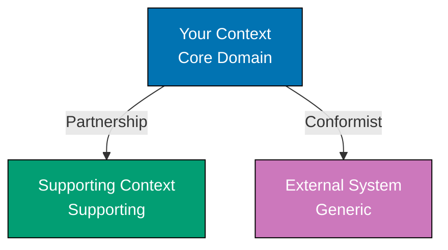
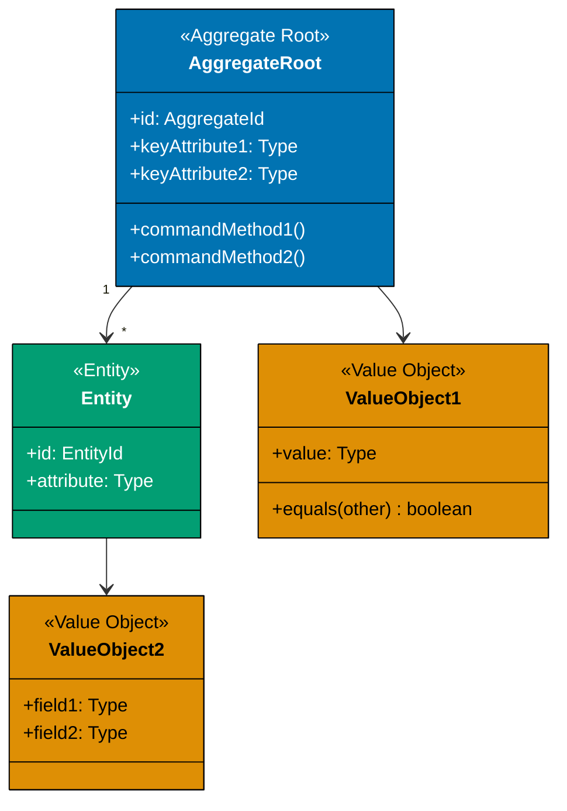
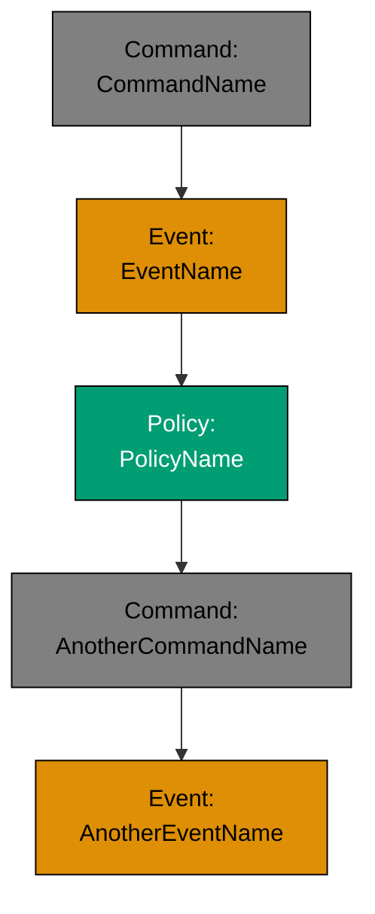
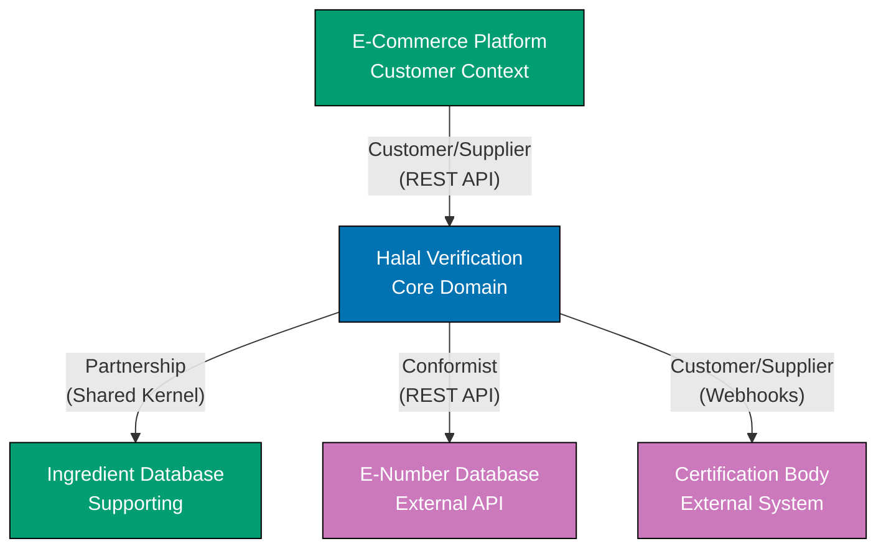
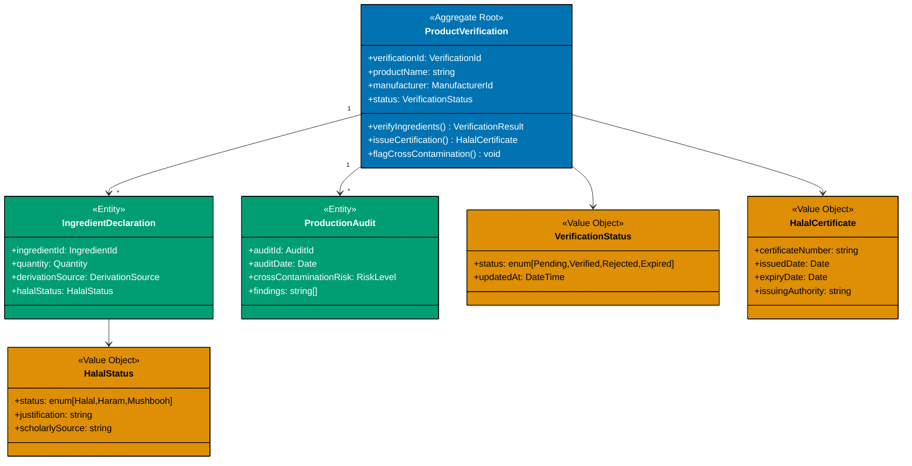
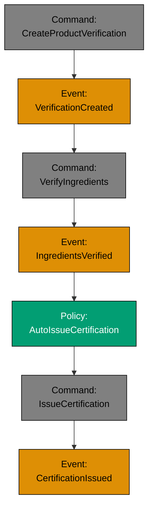

# Starter Full Documentation Template

This template provides a comprehensive DDD documentation set for a new feature or bounded context. Use this template to document strategic and tactical design decisions in a single cohesive artifact.

## Instructions

1. Start with strategic design (bounded contexts, context map)
2. Progress to tactical design (aggregates, entities, value objects)
3. Fill in placeholders with concrete domain knowledge
4. Validate with domain experts before implementation
5. Update continuously as the model evolves
6. Split into separate files if documentation exceeds 15KB

## Template

---

## [FEATURE/DOMAIN NAME] - Full DDD Documentation

### Overview

**Feature Description**:
[2-3 sentences describing what this feature does and its business value]

**Strategic Classification**:
[Choose one: Core Domain / Supporting Subdomain / Generic Subdomain]

**Rationale**:
[Why this classification? What makes it strategically important or generic?]

**Business Value**:

- [Key business benefit 1]
- [Key business benefit 2]
- [Key business benefit 3]

**Stakeholders**:

- **Business Owner**: [Name, Role]
- **Domain Expert**: [Name, Role]
- **Development Team**: [Team name]
- **Key Users**: [User roles who interact with this feature]

---

## Bounded Contexts

### Identified Contexts

**Primary Context: [Context Name]**

- **Responsibility**: [What does this context do?]
- **Ubiquitous Language**: [List 5-10 key domain terms]
- **Team Ownership**: [Which team owns this?]

**Supporting Context: [Context Name]** (if applicable)

- **Responsibility**: [What does this context do?]
- **Ubiquitous Language**: [Key terms]
- **Team Ownership**: [Team]

**External Dependencies**:

- **[System/Context Name]**: [How do we integrate? What data flows?]

---

## Context Map

**Visualization**:



**Relationship Patterns**:

| Upstream Context | Downstream Context | Pattern              | Integration Method | Notes                 |
| ---------------- | ------------------ | -------------------- | ------------------ | --------------------- |
| [Context 1]      | [Context 2]        | Customer/Supplier    | REST API           | [Integration details] |
| [Context 2]      | [External System]  | Conformist           | Events (RabbitMQ)  | [Integration details] |
| [Context 1]      | [Context 3]        | Anticorruption Layer | API + Translator   | [Why ACL is needed?]  |

**Integration Challenges**:

- **[Challenge 1]**: [Description, mitigation strategy]
- **[Challenge 2]**: [Description, mitigation strategy]

---

## Ubiquitous Language

### Core Terms (within this bounded context)

| Term     | Definition           | Example Usage                 | Aliases (if any) |
| -------- | -------------------- | ----------------------------- | ---------------- |
| [Term 1] | [Precise definition] | [How domain experts use this] | [Synonym]        |
| [Term 2] | [Definition]         | [Usage example]               | None             |
| [Term 3] | [Definition]         | [Usage example]               | [Synonym]        |

### Ambiguous Terms (different meanings in other contexts)

- **[Term]**: In this context means [X], but in [Other Context] means [Y]
- **[Term]**: In this context means [A], but in [Other Context] means [B]

### Forbidden Terms (banned from domain model)

- **[Term]**: [Why is this term ambiguous or problematic? What should be used instead?]

### Business Rules in Domain Language

**Rule 1**: [State business rule using domain terms]

- **Example**: [Concrete scenario illustrating the rule]
- **Rationale**: [Why does this rule exist?]

**Rule 2**: [Business rule]

- **Example**: [Scenario]
- **Rationale**: [Reason]

---

## Core Aggregates

### Aggregate 1: [Aggregate Name]

**Purpose**: [What business invariants does this aggregate protect?]

**Structure**:



**Components**:

- **Root Entity**: `[AggregateRoot]` (ID: `[idType]`)
  - Identity: [How is the aggregate uniquely identified?]
  - Key Attributes: [List main attributes]

- **Contained Entities**: `[Entity1]`, `[Entity2]`
  - [Entity1]: [What is its role within the aggregate?]

- **Value Objects**: `[ValueObject1]`, `[ValueObject2]`
  - [ValueObject1]: [What immutable value does this represent?]

**Invariants** (rules that must ALWAYS be true):

1. [Invariant 1: State the rule that cannot be violated]
   - **Validation**: [How is this enforced?]
   - **Example Violation**: [What would break this rule?]

2. [Invariant 2]
   - **Validation**: [Enforcement]
   - **Example Violation**: [Scenario]

**Commands Handled**:

1. **[CommandName]**
   - **Preconditions**: [What must be true before executing?]
   - **Side Effects**: [What changes in the aggregate?]
   - **Events Published**: [Which domain events fire?]

2. **[CommandName]**
   - **Preconditions**: [Conditions]
   - **Side Effects**: [Changes]
   - **Events Published**: [Events]

**Domain Events Published**:

1. **[EventName]**: Fired when [trigger condition]
   - **Payload**: `field1`, `field2`, `field3`
   - **Consumers**: [Which bounded contexts listen to this?]

2. **[EventName]**
   - **Payload**: [Fields]
   - **Consumers**: [Listeners]

**Lifecycle**:

1. **Creation**: [How is the aggregate created? What command or event?]
2. **Updates**: [What commands modify the aggregate?]
3. **Deletion**: [Can the aggregate be deleted? Soft or hard delete?]
4. **Archival**: [Is there a historical record requirement?]

---

### Aggregate 2: [Aggregate Name]

[Repeat structure above for each aggregate]

---

## Domain Services

**Domain Service 1: [ServiceName]**

- **Purpose**: [What stateless operation does this service perform?]
- **Why not in an aggregate?**: [Why can't this logic live in an entity?]
- **Inputs**: [What data does it need?]
- **Outputs**: [What does it return?]
- **Example**: [Concrete usage scenario]

**Domain Service 2: [ServiceName]**

- **Purpose**: [Operation]
- **Why not in an aggregate?**: [Reason]
- **Inputs**: [Data]
- **Outputs**: [Result]
- **Example**: [Scenario]

---

## Domain Events Catalog

**Event Flow** (chronological order):



**Event Specifications**:

| Event Name  | Triggered By        | Payload  | Consumers          | Purpose                        |
| ----------- | ------------------- | -------- | ------------------ | ------------------------------ |
| [EventName] | [Command or Policy] | [Fields] | [Bounded Contexts] | [Why is this event important?] |
| [EventName] | [Source]            | [Fields] | [Listeners]        | [Purpose]                      |

**Event Processing**:

- **Synchronous**: [Which events require immediate processing?]
- **Asynchronous**: [Which events tolerate eventual consistency?]
- **Ordering Guarantees**: [Which events must be processed in order?]

---

## Integration Points

### Inbound Dependencies (who depends on us)

| Dependent Context | Integration Method | Data Provided                 | SLA/Guarantees                |
| ----------------- | ------------------ | ----------------------------- | ----------------------------- |
| [Context Name]    | REST API           | [What capabilities we expose] | [Response time, availability] |
| [Context Name]    | Domain Events      | [What events we publish]      | [Eventual consistency SLA]    |

### Outbound Dependencies (who we depend on)

| Provider Context/System | Integration Method | Data Consumed        | Failure Handling           |
| ----------------------- | ------------------ | -------------------- | -------------------------- |
| [Context Name]          | REST API           | [What data we fetch] | [Retry logic, fallback]    |
| [External System]       | Third-Party API    | [What data we fetch] | [Circuit breaker, caching] |

**Anticorruption Layers**:

- **[External System Name]**: [Why is ACL needed? What translation occurs?]

**Event Subscriptions** (from other contexts):

- **[EventName]**: From [Source Context]
  - **Handler Logic**: [What do we do when this event arrives?]
  - **Idempotency**: [How do we handle duplicate events?]

---

## Technology Decisions

### Implementation Choices

**Language/Framework**: [e.g., TypeScript + Nest.js, Go, Java + Spring]

**Rationale**: [Why this technology?]

**Database**: [e.g., PostgreSQL, MongoDB, Event Store]

**Rationale**: [Why this database?]

**Messaging**: [e.g., RabbitMQ, Kafka, AWS SQS]

**Rationale**: [Why this messaging system?]

### Deployment

**Deployment Unit**: [Microservice, Monolith Module, Serverless Functions]

**Scaling Strategy**: [Horizontal, Vertical, Event-Driven]

**Infrastructure**:

- **Hosting**: [AWS, GCP, Azure, On-Premise]
- **Containers**: [Docker, Kubernetes]
- **CI/CD**: [GitHub Actions, Jenkins, GitLab CI]

### Observability

**Logging**:

- **Framework**: [e.g., Winston, Log4j, Zap]
- **Key Events to Log**: [What domain events or errors need logging?]

**Monitoring**:

- **Metrics**: [What KPIs should be tracked? e.g., command throughput, event latency]
- **Tools**: [Prometheus, Datadog, CloudWatch]

**Tracing**:

- **Distributed Tracing**: [OpenTelemetry, Jaeger, Zipkin]
- **Trace Boundaries**: [Which context boundaries need tracing?]

---

## Testing Strategy

### Unit Tests

**Aggregate Tests**:

- Test invariants: [Verify business rules cannot be violated]
- Test commands: [Ensure correct events published]
- Test state transitions: [Validate lifecycle]

**Value Object Tests**:

- Test equality: [Immutability, structural equality]
- Test validation: [Invalid value object creation]

### Integration Tests

**API Tests**:

- Test inbound API endpoints: [Verify request/response contracts]
- Test outbound API calls: [Mock external dependencies]

**Event Tests**:

- Test event publishing: [Verify events emitted correctly]
- Test event handling: [Verify correct processing of consumed events]

### Domain Tests (Behavior-Driven Development)

**Example Scenario** (Gherkin format):

```gherkin
Feature: [Feature Name]
  As a [user role]
  I want to [perform action]
  So that [business value]

  Scenario: [Scenario Name]
    Given [precondition 1]
    And [precondition 2]
    When [user action or command]
    Then [expected outcome or event]
    And [additional outcome]
```

---

## Migration and Rollout Plan

### Data Migration

**Existing Data** (if applicable):

- **Source**: [Where is legacy data stored?]
- **Transformation**: [How will data be migrated to new aggregates?]
- **Validation**: [How to verify migration correctness?]

**Migration Steps**:

1. [Step 1: e.g., Extract data from legacy system]
2. [Step 2: Transform to new domain model]
3. [Step 3: Validate business rules on migrated data]
4. [Step 4: Cutover to new system]

### Rollout Strategy

**Phase 1: [Name, e.g., "Internal Beta"]**

- **Scope**: [What features? Which users?]
- **Duration**: [Timeframe]
- **Success Criteria**: [How to measure success?]

**Phase 2: [Name, e.g., "Limited Public Release"]**

- **Scope**: [Expanded scope]
- **Duration**: [Timeframe]
- **Success Criteria**: [Metrics]

**Phase 3: [Name, e.g., "Full Production"]**

- **Scope**: [All users]
- **Duration**: [Timeframe]
- **Success Criteria**: [Final KPIs]

**Rollback Plan**:

- **Trigger**: [What conditions require rollback?]
- **Steps**: [How to revert to previous version?]

---

## Risks and Open Questions

### Identified Risks

**Technical Risks**:

1. **[Risk Name]**
   - **Description**: [What could go wrong?]
   - **Impact**: [Business or technical consequences]
   - **Likelihood**: [High, Medium, Low]
   - **Mitigation**: [How to prevent or reduce impact?]

2. **[Risk Name]**
   - **Description**: [Issue]
   - **Impact**: [Consequences]
   - **Likelihood**: [Probability]
   - **Mitigation**: [Strategy]

**Business Risks**:

1. **[Risk Name]**
   - **Description**: [What business concern exists?]
   - **Impact**: [Revenue, reputation, compliance impact]
   - **Likelihood**: [Probability]
   - **Mitigation**: [Strategy]

### Open Questions

**Domain Modeling Questions**:

1. [Question requiring domain expert clarification]
2. [Question about business rules]

**Technical Questions**:

1. [Question requiring technical investigation or proof of concept]
2. [Question about integration feasibility]

**Parking Lot** (deferred for future phases):

- [Feature or decision deferred to later iteration]
- [Nice-to-have enhancement]

---

## Success Metrics

**Business KPIs**:

- **[Metric 1]**: [How to measure? Target value?]
- **[Metric 2]**: [Measurement, target]

**Technical KPIs**:

- **Availability**: [Target uptime percentage]
- **Latency**: [Target response time]
- **Throughput**: [Target requests per second]
- **Error Rate**: [Acceptable error percentage]

**User Satisfaction**:

- **[Metric]**: [e.g., NPS, CSAT, task completion rate]

---

## Related Documentation

- **[Context Map](./context-map-diagram.md)**: Visualize bounded context relationships
- **[Bounded Context Canvas](./bounded-context-canvas.md)**: Detailed canvas for each context
- **[Aggregate Design Template](./aggregate-design-template.md)**: Deep dive into aggregate structure
- **[Event Storming Output](./event-storming-output.md)**: Workshop discoveries

---

## Example: Halal Product Verification System

### Overview

**Feature Description**:
Halal Product Verification System enables businesses to validate product ingredients against Islamic dietary laws (halal/haram classifications), issue halal certifications, and maintain audit trails for regulatory compliance. The system integrates with ingredient databases and provides real-time verification APIs for e-commerce platforms.

**Strategic Classification**:
Core Domain

**Rationale**:
Halal verification is central to OSE Platform's mission of democratizing Sharia-compliant business systems. The complex rules around ingredient sourcing, cross-contamination prevention, and multi-school jurisprudence require deep Islamic knowledge and provide significant competitive differentiation. Generic ingredient databases lack Islamic jurisprudence expertise.

**Business Value**:

- Reduces halal certification costs for small businesses (currently $5,000-$20,000/year from certification bodies)
- Enables real-time ingredient verification (seconds vs. weeks for traditional certification)
- Provides audit trails for regulatory compliance (required in Malaysia, Indonesia, UAE)
- Builds trust with Muslim consumers through transparent verification process

**Stakeholders**:

- **Business Owner**: Fatimah Hassan (Product Manager)
- **Domain Expert**: Sheikh Dr. Yasir Mahmood (Islamic Food Law Scholar)
- **Development Team**: Halal Tech Team (4 developers, 1 QA)
- **Key Users**: Food manufacturers, e-commerce platforms, halal certification auditors

---

## Bounded Contexts

### Identified Contexts

**Primary Context: Halal Verification Context**

- **Responsibility**: Validate product ingredients against Islamic dietary laws, issue halal certifications, maintain ingredient knowledge base
- **Ubiquitous Language**: Halal, Haram, Mushbooh (doubtful), Ingredient, Certification, Najs (impure), Cross-Contamination, Slaughter Method, Alcohol Derivation
- **Team Ownership**: Halal Tech Team

**Supporting Context: Ingredient Database Context**

- **Responsibility**: Maintain global ingredient catalog, E-number mappings, supplier data
- **Ubiquitous Language**: E-number, Ingredient Name, Supplier, Origin, Derivation Source (plant/animal/synthetic)
- **Team Ownership**: Data Team

**External Dependencies**:

- **E-Number Database (European Food Safety Authority)**: REST API for ingredient E-number lookup. Public API, eventual consistency acceptable.
- **Certification Body Registry**: Webhook integration to sync halal certifications from accredited third-party bodies (e.g., JAKIM Malaysia, HFA Australia)

---

## Context Map

**Visualization**:



**Relationship Patterns**:

| Upstream Context              | Downstream Context  | Pattern           | Integration Method | Notes                                                   |
| ----------------------------- | ------------------- | ----------------- | ------------------ | ------------------------------------------------------- |
| Halal Verification            | Ingredient Database | Partnership       | Shared Library     | Shared ingredient taxonomy, bidirectional collaboration |
| E-Number Database (External)  | Halal Verification  | Conformist        | REST API           | We conform to their API, no control over schema         |
| Certification Body (External) | Halal Verification  | Customer/Supplier | Webhooks           | They push certification updates to us                   |
| Halal Verification            | E-Commerce Platform | Customer/Supplier | REST API + Events  | We provide verification API, publish events             |

**Integration Challenges**:

- **E-Number Database Unavailability**: External API may be down during peak usage. Mitigation: Cache ingredient data (30-day TTL), fallback to manual ingredient entry, circuit breaker pattern.
- **Certification Body Schema Variance**: Different certification bodies use incompatible data formats. Mitigation: Anticorruption layer translates inbound webhooks to canonical HalalCertification model.

---

## Ubiquitous Language

### Core Terms (within this bounded context)

| Term                | Definition                                                                                           | Example Usage                                                         | Aliases (if any) |
| ------------------- | ---------------------------------------------------------------------------------------------------- | --------------------------------------------------------------------- | ---------------- |
| Halal               | Permissible according to Islamic law for consumption or use                                          | "This product is halal because all ingredients are plant-derived."    | Permissible      |
| Haram               | Forbidden according to Islamic law (e.g., pork, alcohol, improperly slaughtered meat)                | "Gelatin from pork is haram."                                         | Forbidden        |
| Mushbooh            | Doubtful or questionable ingredient requiring further investigation or scholarly ruling              | "Vanilla extract is mushbooh due to alcohol content."                 | Doubtful         |
| Ingredient          | Raw material or additive used in product formulation                                                 | "Lecithin is an ingredient in chocolate."                             | Component        |
| Certification       | Formal attestation that a product meets halal standards, issued by qualified authority               | "JAKIM issued a halal certification for this factory."                | Certificate      |
| Najs                | Ritually impure substance that cannot contact halal products without contamination                   | "Pork is najs and cannot share production lines with halal products." | Impure           |
| Cross-Contamination | Unintended contact between halal products and haram/najs substances during production                | "Shared fryers risk cross-contamination from pork products."          | Contamination    |
| Slaughter Method    | Procedure for animal slaughter (must be zabiha/dhabiha for meat to be halal)                         | "Beef must use zabiha slaughter method with bismillah recitation."    | Zabiha           |
| Alcohol Derivation  | Source of alcohol in ingredient (synthetic alcohol often permissible, wine-derived alcohol is haram) | "This alcohol is derived from petroleum, not wine, so it's halal."    | None             |
| Derivation Source   | Origin of ingredient (plant, animal, synthetic) - critical for halal classification                  | "Lecithin can be soy-derived (halal) or pork-derived (haram)."        | Origin           |

### Ambiguous Terms (different meanings in other contexts)

- **Certification**: In this context means "halal compliance attestation", but in **Quality Management Context** means "ISO 9001 quality certification"
- **Contamination**: In this context means "haram contact with halal product", but in **Food Safety Context** means "bacterial or chemical contamination"
- **Pure**: In this context means "free from najs (ritual impurity)", but in **Chemistry Context** means "100% substance concentration"

### Forbidden Terms (banned from domain model)

- **"Clean/Unclean"**: Ambiguous and has different meaning in Western food safety vs. Islamic purity laws. Use "Halal/Haram/Najs" instead.
- **"Kosher"**: While related to Islamic dietary laws, kosher (Jewish dietary law) has different rules (e.g., allows alcohol, different slaughter method). Do not conflate with halal.

### Business Rules in Domain Language

**Rule 1**: An ingredient is halal only if its derivation source is halal and no cross-contamination occurred during production.

- **Example**: Lecithin derived from soybeans (plant-based) is halal. Lecithin derived from pork is haram. Soy lecithin produced in a factory with shared equipment used for pork products is mushbooh (requires verification of cleaning procedures).
- **Rationale**: Islamic law requires both inherent permissibility (source) and procedural purity (production process).

**Rule 2**: Alcohol is haram if derived from fermentation of grapes/dates, but permissible if synthetically produced and used in non-intoxicating amounts (< 0.5% residual alcohol).

- **Example**: Vanilla extract with wine-based alcohol is haram. Vanilla extract with synthetic ethanol at 0.3% residual is halal.
- **Rationale**: Islamic jurisprudence distinguishes between intoxicating khamr (wine) and industrial alcohol. Scholarly consensus allows trace synthetic alcohol in manufacturing.

**Rule 3**: Certification is valid only if issued by accredited halal authority and renewed annually with factory audits.

- **Example**: JAKIM (Malaysia) certification is valid for 2 years. After expiration, product cannot be labeled halal until recertified.
- **Rationale**: Prevents outdated certifications from misleading consumers. Factory processes change over time, requiring re-verification.

---

## Core Aggregates

### Aggregate 1: ProductVerification

**Purpose**: Ensures a product's halal status is accurately determined based on ingredient verification, production process review, and certification issuance. Protects invariant: "A certified halal product must have all halal ingredients and no cross-contamination risk."

**Structure**:



**Components**:

- **Root Entity**: `ProductVerification` (ID: `verificationId: UUID`)
  - Identity: Unique verification request per product per manufacturer
  - Key Attributes: `productName`, `manufacturer`, `status` (Pending/Verified/Rejected/Expired)

- **Contained Entities**:
  - `IngredientDeclaration`: Each ingredient used in the product with halal status determination
  - `ProductionAudit`: Factory audit records assessing cross-contamination risk

- **Value Objects**:
  - `HalalStatus`: Immutable halal/haram/mushbooh classification with justification and scholarly source citation
  - `VerificationStatus`: Current state of verification (Pending → Verified/Rejected)
  - `HalalCertificate`: Issued certification with expiry date and certificate number

**Invariants** (rules that must ALWAYS be true):

1. **All ingredients must have determined HalalStatus before certification can be issued**
   - **Validation**: `issueCertification()` command checks all `IngredientDeclaration` entities have non-null `halalStatus`
   - **Example Violation**: Product with 10 ingredients where 9 are verified halal and 1 is pending investigation cannot be certified

2. **A product with ANY haram ingredient cannot be certified halal**
   - **Validation**: `verifyIngredients()` method scans all `IngredientDeclaration` entities; if any have `HalalStatus.status = Haram`, overall product status = Rejected
   - **Example Violation**: Chocolate with halal cocoa, halal sugar, but haram pork-derived gelatin cannot be certified

3. **Certification expiry date must be ≤ 2 years from issuance date**
   - **Validation**: `issueCertification()` enforces `expiryDate ≤ issuedDate + 2 years`
   - **Example Violation**: Cannot issue certification valid for 5 years (exceeds maximum renewal period)

4. **Production audits must be conducted within last 6 months for certification issuance**
   - **Validation**: `issueCertification()` requires most recent `ProductionAudit.auditDate` within 180 days
   - **Example Violation**: Factory audited 8 months ago cannot receive certification without new audit

**Commands Handled**:

1. **VerifyIngredients**
   - **Preconditions**: All `IngredientDeclaration` entities have `derivationSource` declared
   - **Side Effects**: Updates `IngredientDeclaration.halalStatus` for each ingredient, changes aggregate `status` to Verified or Rejected
   - **Events Published**: `IngredientsVerified` (if all halal), `HaramIngredientDetected` (if any haram)

2. **IssueCertification**
   - **Preconditions**: `status = Verified`, all ingredients halal, recent production audit (≤6 months), no cross-contamination risks flagged
   - **Side Effects**: Creates `HalalCertificate` value object, publishes `CertificationIssued` event
   - **Events Published**: `CertificationIssued`

3. **FlagCrossContamination**
   - **Preconditions**: Production audit exists
   - **Side Effects**: Adds `ProductionAudit` entity with cross-contamination findings, changes `status` to Rejected
   - **Events Published**: `CrossContaminationDetected`

4. **RenewCertification**
   - **Preconditions**: Existing certification near expiry (≤30 days), updated production audit conducted
   - **Side Effects**: Extends `HalalCertificate.expiryDate` by 2 years
   - **Events Published**: `CertificationRenewed`

**Domain Events Published**:

1. **IngredientsVerified**: Fired when all ingredients successfully classified as halal
   - **Payload**: `verificationId`, `productName`, `ingredientCount`, `verifiedDate`
   - **Consumers**: E-Commerce Platform Context (display halal badge), Reporting Context (analytics)

2. **HaramIngredientDetected**: Fired when any haram ingredient found
   - **Payload**: `verificationId`, `productName`, `haramIngredient: { name, derivationSource, halalStatus }`
   - **Consumers**: Notification Context (alert manufacturer), Reporting Context

3. **CertificationIssued**: Fired when halal certificate issued
   - **Payload**: `verificationId`, `certificateNumber`, `issuedDate`, `expiryDate`, `manufacturer`
   - **Consumers**: Certification Registry Context (public lookup), E-Commerce Platform (enable halal label)

4. **CrossContaminationDetected**: Fired when production audit finds haram contact risk
   - **Payload**: `verificationId`, `productName`, `riskLevel`, `auditFindings[]`
   - **Consumers**: Notification Context (alert manufacturer), Quality Assurance Context

**Lifecycle**:

1. **Creation**: `CreateProductVerification` command triggered when manufacturer submits verification request (API call)
2. **Updates**: `VerifyIngredients` (domain expert review), `FlagCrossContamination` (auditor finding), `IssueCertification` (after verification complete)
3. **Expiry**: Certification expires after 2 years, `status` changes to Expired (automated policy)
4. **Renewal**: `RenewCertification` command extends certification lifecycle
5. **Archival**: Expired verifications archived to read-only historical database after 7 years (regulatory requirement)

---

### Aggregate 2: IngredientKnowledge

**Purpose**: Maintains authoritative halal classification for global ingredient catalog. Ensures consistency: "An ingredient's halal status is determined by derivation source and scholarly consensus."

[Continue with similar structure for IngredientKnowledge aggregate...]

---

## Domain Services

**Domain Service 1: DerivationSourceAnalyzer**

- **Purpose**: Determines if an ingredient's derivation source (plant, animal, synthetic) makes it halal, haram, or mushbooh
- **Why not in an aggregate?**: Logic requires external scholarly database lookup and E-number API calls, not intrinsic to ProductVerification or IngredientKnowledge aggregate state
- **Inputs**: `ingredientName: string`, `eNumber: string` (optional), `supplier: string`
- **Outputs**: `HalalStatus` (Halal/Haram/Mushbooh with justification)
- **Example**: Input "E471" → Calls E-Number API → Returns "Mono- and diglycerides of fatty acids" → Checks derivation (plant or animal) → If plant-derived, returns `HalalStatus(Halal, "Plant-based emulsifier", "JAKIM Technical Guidelines 2020")`

**Domain Service 2: CrossContaminationRiskEvaluator**

- **Purpose**: Assesses cross-contamination risk based on shared production equipment, cleaning procedures, and production sequencing
- **Why not in an aggregate?**: Requires analysis across multiple production runs and products, not specific to single ProductVerification
- **Inputs**: `productionLineId: string`, `previousProducts: Product[]`, `cleaningProcedure: CleaningProcedure`
- **Outputs**: `RiskLevel` (None, Low, Medium, High)
- **Example**: Production line previously used for pork sausages → Cleaning procedure = "Water rinse only" (insufficient) → Returns `RiskLevel.High`

---

## Domain Events Catalog

**Event Flow** (chronological order):



**Event Specifications**:

| Event Name                 | Triggered By                   | Payload                                                 | Consumers                               | Purpose                                         |
| -------------------------- | ------------------------------ | ------------------------------------------------------- | --------------------------------------- | ----------------------------------------------- |
| IngredientsVerified        | VerifyIngredients command      | verificationId, ingredientCount, verifiedDate           | E-Commerce Platform, Reporting Context  | Notify that all ingredients are halal           |
| HaramIngredientDetected    | VerifyIngredients command      | verificationId, haramIngredient details                 | Notification Context, Manufacturer App  | Alert manufacturer of haram ingredient          |
| CertificationIssued        | IssueCertification command     | certificateNumber, issuedDate, expiryDate, manufacturer | Certification Registry, E-Commerce      | Publish new halal certification                 |
| CertificationExpired       | Scheduled Policy (time-based)  | verificationId, certificateNumber, expiryDate           | Notification Context, E-Commerce        | Alert manufacturer to renew expired certificate |
| CrossContaminationDetected | FlagCrossContamination command | verificationId, riskLevel, auditFindings                | Quality Assurance, Notification Context | Notify of production contamination risk         |

**Event Processing**:

- **Synchronous**: `IngredientsVerified` (E-Commerce Platform needs immediate halal badge update)
- **Asynchronous**: `CertificationExpired` (notification can tolerate eventual consistency, sent within 1 hour)
- **Ordering Guarantees**: `IngredientsVerified` must be processed before `CertificationIssued` (enforced by command preconditions, not event ordering)

---

[Continue with Integration Points, Technology Decisions, Testing Strategy, Migration/Rollout Plan, Risks, and Success Metrics sections following same detailed structure as shown in template above...]

---

## Usage Notes

### When to Use This Template

- **New feature development**: Comprehensive documentation before implementation kickoff
- **Greenfield bounded contexts**: Strategic and tactical design in single artifact
- **Team onboarding**: Provide complete domain knowledge to new developers
- **Stakeholder alignment**: Share with business, product, and engineering for consensus
- **Pre-architecture review**: Prepare detailed design for architecture review board

### When NOT to Use This Template

- **Exploratory Event Storming**: Use [Event Storming Output Template](./event-storming-output.md) for workshop discoveries
- **Mature bounded contexts**: Use [Bounded Context Canvas](./bounded-context-canvas.md) for focused updates
- **Single aggregate design**: Use [Aggregate Design Template](./aggregate-design-template.md) for tactical deep dive

### Keeping It Updated

- **Living document**: Update as domain model evolves (quarterly reviews)
- **Version control**: Store in git alongside code
- **Split when large**: If exceeds 15KB, split into separate Bounded Context Canvas + Aggregate Design templates
- **Link to code**: Reference aggregate classes, domain events in codebase comments

### Complementary Artifacts

This template works well with:

- **[Event Storming Output](./event-storming-output.md)**: Input discoveries into this documentation
- **[Bounded Context Canvas](./bounded-context-canvas.md)**: Focused canvas for each bounded context
- **[Context Map Diagram](./context-map-diagram.md)**: Visualize context relationships
- **[Aggregate Design Template](./aggregate-design-template.md)**: Deep dive into aggregate structure

## Related Documentation

- **[Strategic Design Process](../ex-ddd__06-strategic-design-process.md)** - Event Storming and context mapping
- **[Bounded Contexts](../ex-ddd__03-bounded-contexts.md)** - Comprehensive bounded context guide
- **[Aggregates](../ex-ddd__09-aggregates.md)** - Aggregate design patterns
- **[Domain Events](../ex-ddd__12-domain-events.md)** - Event-driven architecture

## References

- Vaughn Vernon, "Implementing Domain-Driven Design" (2013) - Comprehensive DDD implementation guide
- Eric Evans, "Domain-Driven Design" (2003) - Foundational DDD concepts
- [DDD Crew Resources](https://github.com/ddd-crew) - Community templates and examples
