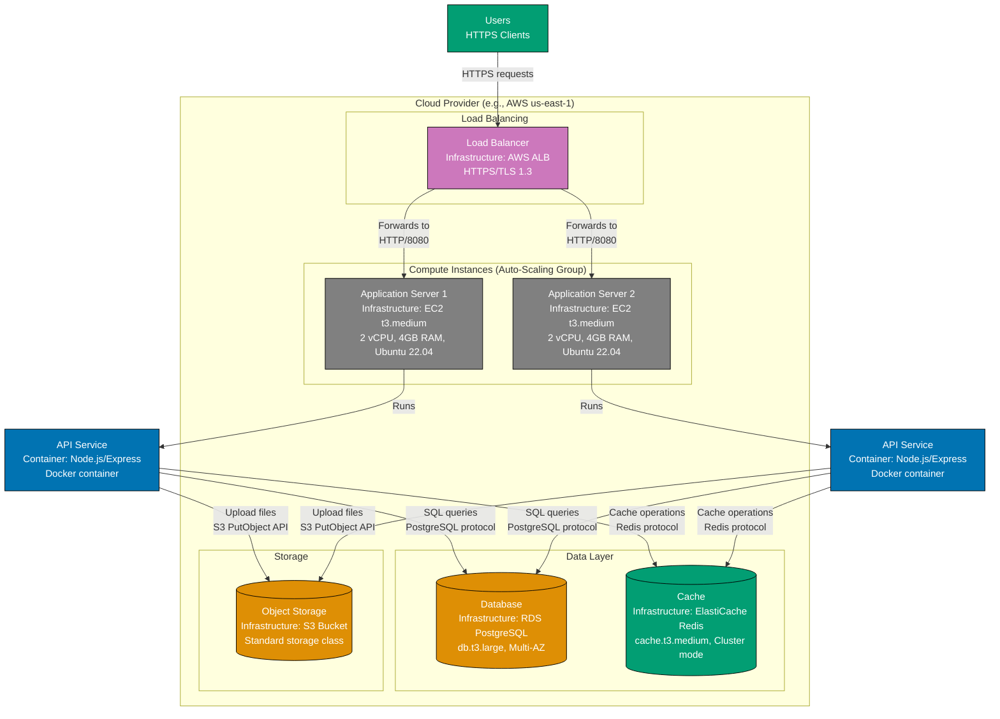

# [Your System Name] - Deployment Diagram ([Environment])

## Purpose

This diagram shows how **[Your System Name]** containers are deployed to infrastructure in **[Environment]** (e.g., Production, Staging, Development). It captures:

- Infrastructure nodes (servers, VMs, containers, cloud resources)
- How software containers are deployed to infrastructure
- Networking and communication paths
- Scaling and redundancy strategies

**Audience**: DevOps engineers, SREs, architects, compliance/security teams.

## Diagram

## Legend

| Element                 | Color  | Description                                    |
| ----------------------- | ------ | ---------------------------------------------- |
| **Person**              | Teal   | End users                                      |
| **Container**           | Blue   | Software containers (apps, services)           |
| **Infrastructure Node** | Gray   | Physical/virtual infrastructure (servers, VMs) |
| **Database**            | Orange | Data storage infrastructure                    |
| **Cache/Queue**         | Teal   | Supporting infrastructure (cache, messaging)   |
| **Load Balancer**       | Purple | Networking infrastructure                      |

## Infrastructure Details

### Load Balancing

- **Type**: [e.g., AWS Application Load Balancer (ALB)]
- **Configuration**:
  - HTTPS/TLS 1.3 termination
  - Health checks periodically to `/health` endpoint
  - Sticky sessions disabled (stateless app)
- **Scaling**: Automatic based on traffic

### Compute Instances

- **Type**: [e.g., AWS EC2 t3.medium instances in Auto-Scaling Group]
- **Specifications**:
  - 2 vCPUs, 4GB RAM
  - Ubuntu 22.04 LTS
  - Docker Engine 24.0
- **Scaling Strategy**:
  - Minimum instances: 2
  - Maximum instances: 10
  - Target CPU utilization: 70%
  - Scale-out cooldown: cooldown period

### Database

- **Type**: [e.g., AWS RDS PostgreSQL 15]
- **Specifications**:
  - db.t3.large (2 vCPUs, 8GB RAM)
  - Multi-AZ deployment for high availability
  - Automated backups (7-day retention)
  - Encrypted at rest (AES-256)
- **Scaling Strategy**: Vertical scaling only (manual)

### Cache

- **Type**: [e.g., AWS ElastiCache Redis 7.0]
- **Specifications**:
  - cache.t3.medium (2 vCPUs, 3.09GB RAM)
  - Cluster mode enabled (3 shards, 1 replica per shard)
  - Automatic failover
- **Scaling Strategy**: Horizontal scaling (add shards)

### Object Storage

- **Type**: [e.g., AWS S3 Standard]
- **Configuration**:
  - Versioning enabled
  - Lifecycle policy: Archive to Glacier after 90 days
  - Server-side encryption (AES-256)

## Deployment Process

1. **Build**: CI/CD pipeline builds Docker image from source
2. **Push**: Image pushed to container registry (e.g., ECR)
3. **Deploy**: Auto-Scaling Group launches new instances with updated image
4. **Health Check**: Load balancer verifies new instances are healthy
5. **Traffic Shift**: Load balancer routes traffic to new instances
6. **Terminate**: Old instances terminated after graceful shutdown

## Networking

- **VPC**: [e.g., 10.0.0.0/16]
- **Subnets**:
  - Public subnets (10.0.1.0/24, 10.0.2.0/24) for load balancers
  - Private subnets (10.0.10.0/24, 10.0.11.0/24) for application servers
  - Database subnets (10.0.20.0/24, 10.0.21.0/24) for RDS
- **Security Groups**:
  - Load Balancer: Allow inbound HTTPS (443) from anywhere
  - Application Servers: Allow inbound HTTP (8080) from load balancer only
  - Database: Allow inbound PostgreSQL (5432) from application servers only

## High Availability

- **Multi-AZ**: Database deployed across two Availability Zones
- **Auto-Scaling**: Application servers scale based on CPU utilization
- **Load Balancing**: Traffic distributed across healthy instances
- **Backup**: Daily automated backups with 7-day retention

## Disaster Recovery

- **RTO (Recovery Time Objective)**: [e.g., defined by requirements]
- **RPO (Recovery Point Objective)**: [e.g., defined by requirements]
- **Backup Strategy**: Automated database backups to S3, cross-region replication
- **Failover Procedure**: [e.g., Promote read replica in secondary region]

## Cost Estimate (Monthly)

| Resource           | Quantity | Unit Cost   | Total Cost    |
| ------------------ | -------- | ----------- | ------------- |
| EC2 Instances      | 2-10     | $30/month   | $60-$300      |
| RDS Database       | 1        | $150/month  | $150          |
| ElastiCache Redis  | 1        | $50/month   | $50           |
| Load Balancer      | 1        | $20/month   | $20           |
| S3 Storage         | 100GB    | $2.30/month | $2.30         |
| **Total Estimate** | -        | -           | **$282-$522** |

## Monitoring and Observability

- **Metrics**: CloudWatch metrics for CPU, memory, network, disk
- **Logging**: Application logs shipped to CloudWatch Logs
- **Tracing**: Distributed tracing with AWS X-Ray (optional)
- **Alerts**: CloudWatch alarms for high CPU, low disk space, failed health checks

## Notes

- Add any important notes about deployment automation, maintenance windows, or planned improvements
- Mention if this environment uses blue-green or canary deployment strategies

## Related Diagrams

- **[Container Diagram](./blank-container-diagram.md)**: Shows the containers being deployed
- **[System Context Diagram](./blank-context-diagram.md)**: Shows where this system fits in the broader ecosystem

---

**Template Instructions**:

1. Replace `[Your System Name]` with your actual system name
2. Replace `[Environment]` with the environment (Production, Staging, Development)
3. Update infrastructure nodes to match your actual deployment:
   - **Cloud**: AWS, GCP, Azure resources
   - **On-Premise**: VMs, bare metal servers, network appliances
   - **Kubernetes**: Clusters, namespaces, pods, services
   - **Serverless**: Lambda functions, API Gateway, managed services
4. Update container-to-infrastructure mappings (which containers run where)
5. Fill in "Infrastructure Details", "Deployment Process", "Networking", and "Cost Estimate" sections
6. Document high availability and disaster recovery strategies
7. Update frontmatter (title, description, tags, created/updated dates)
8. Delete this template instructions section when done

**See**: [Supplementary Diagrams: Deployment Diagram](../ex-c4armo__07-supplementary-diagrams.md#deployment-diagram) for detailed guidance and additional examples (Kubernetes, serverless, edge computing, multi-region).
