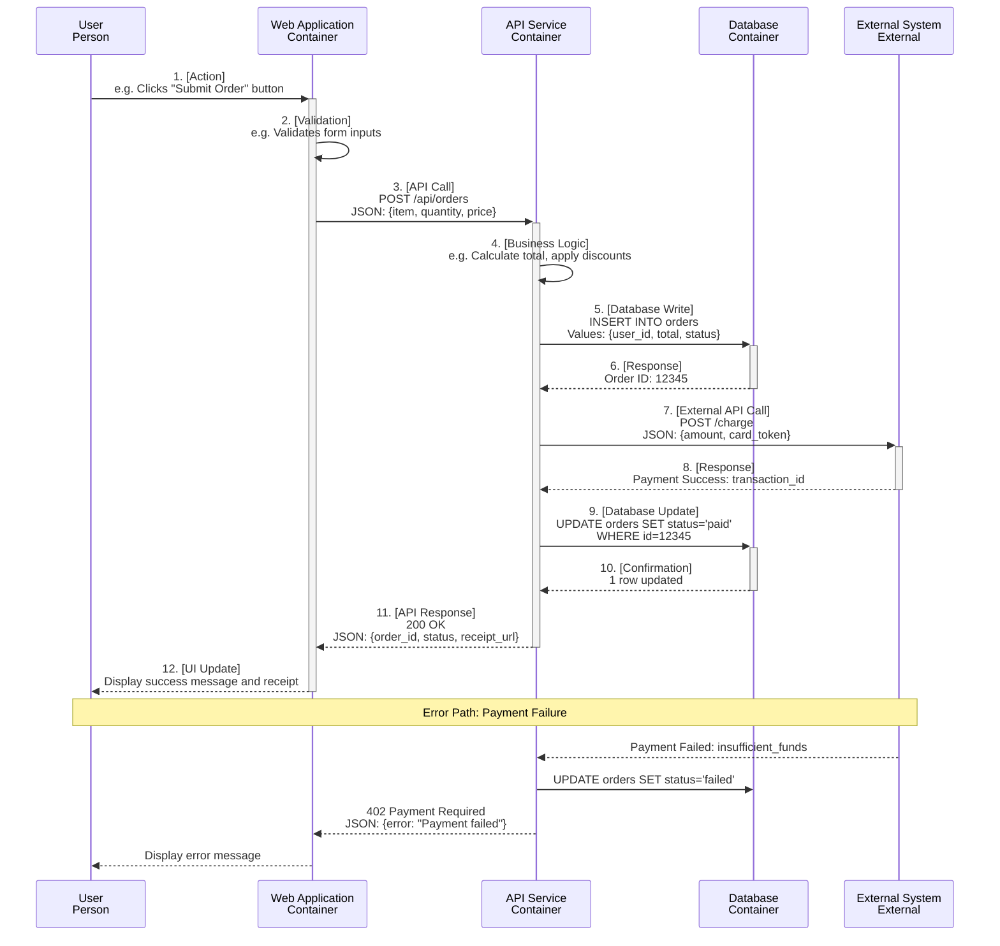

# [Workflow Name] - Dynamic Diagram

## Purpose

This diagram shows the runtime collaboration between containers or components for **[Workflow Name]**. It captures:

- The sequence of interactions over time
- The order in which things happen
- What data is passed between elements
- Error handling paths (optional)

**Audience**: Developers, QA engineers, support teams troubleshooting workflows.

## Diagram



## Workflow Steps

### Happy Path (Success Scenario)

1. **User Action**: User [describes action, e.g., submits order form]
2. **Client-Side Validation**: Web app validates input (e.g., checks required fields)
3. **API Request**: Web app sends POST request to API service with order data
4. **Business Logic**: API service calculates total, applies business rules
5. **Database Write**: API service inserts order record into database
6. **Database Response**: Database returns generated order ID
7. **External API Call**: API service calls payment gateway to charge customer
8. **External Response**: Payment gateway returns success with transaction ID
9. **Database Update**: API service updates order status to "paid"
10. **Database Confirmation**: Database confirms update
11. **API Response**: API service returns success response with order details
12. **UI Update**: Web app displays success message and receipt to user

### Error Path (Failure Scenario)

**Trigger**: Payment gateway returns payment failure (e.g., insufficient funds)

1. Payment gateway returns error response to API service
2. API service updates order status to "failed" in database
3. API service returns 402 Payment Required to web app
4. Web app displays error message to user

## Alternative Flows

### [Alternative Flow 1: e.g., Cached Response]

If order data is cached:

- Step 5-6 skipped (no database read)
- API service returns cached order details immediately

### [Alternative Flow 2: e.g., Retry Logic]

If external API call fails (timeout, 500 error):

- API service retries up to 3 times with exponential backoff
- If all retries fail, order marked as "pending_manual_review"
- User notified of delay

## Data Formats

### Request: POST /api/orders

```json
{
  "item_id": "prod-123",
  "quantity": 2,
  "price": 29.99,
  "card_token": "tok_visa_1234"
}
```

### Response: 200 OK

```json
{
  "order_id": "12345",
  "status": "paid",
  "receipt_url": "https://example.com/receipts/12345",
  "transaction_id": "txn_abc123"
}
```

### Error Response: 402 Payment Required

```json
{
  "error": "Payment failed",
  "reason": "insufficient_funds",
  "order_id": "12345"
}
```

## Performance Considerations

- **Expected Latency**: [e.g., Low latency for happy path]
- **Bottlenecks**: [e.g., External payment API is slowest component]
- **Timeout Policies**: [e.g., Timeout configured for external API calls]

## Notes

- Add any important notes about edge cases, race conditions, or retry logic
- Mention if workflow involves transactions or eventual consistency

## Related Diagrams

- **[Container Diagram](./blank-container-diagram.md)**: Shows the containers involved in this workflow
- **[Component Diagram](./blank-component-diagram.md)**: Shows internal components of API Service

---

**Template Instructions**:

1. Replace `[Workflow Name]` with the actual workflow (e.g., "Place Order Workflow", "User Registration Flow")
2. Replace participants (User, WebApp, APIService, Database, ExternalSystem) with actual elements from your system
3. Update sequence steps to match your workflow (add/remove steps as needed)
4. Add detailed step descriptions in "Workflow Steps" section
5. Document error paths and alternative flows
6. Include sample request/response data formats
7. Update frontmatter (title, description, tags, created/updated dates)
8. Delete this template instructions section when done

**See**: [Supplementary Diagrams: Dynamic Diagram](../ex-c4armo__07-supplementary-diagrams.md#dynamic-diagram) for detailed guidance.
