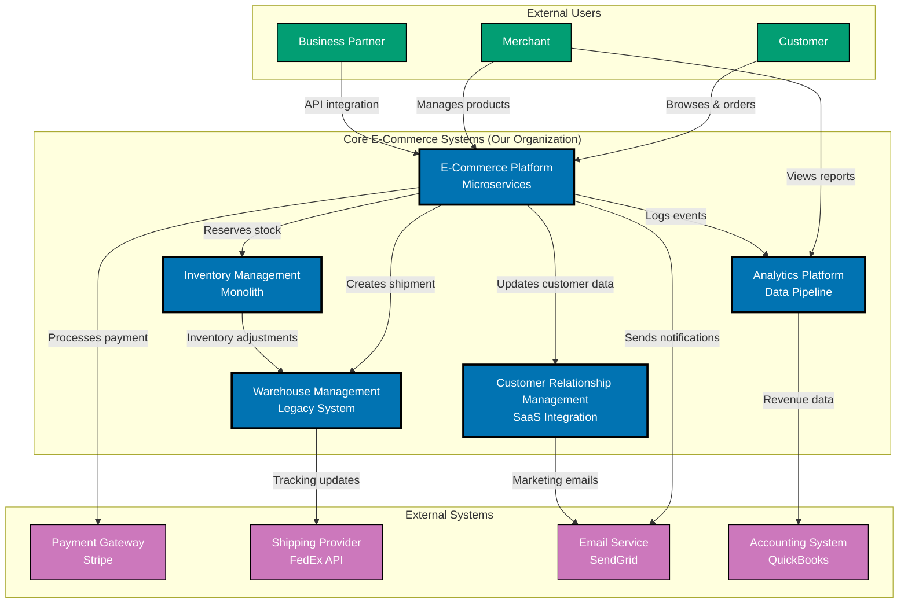
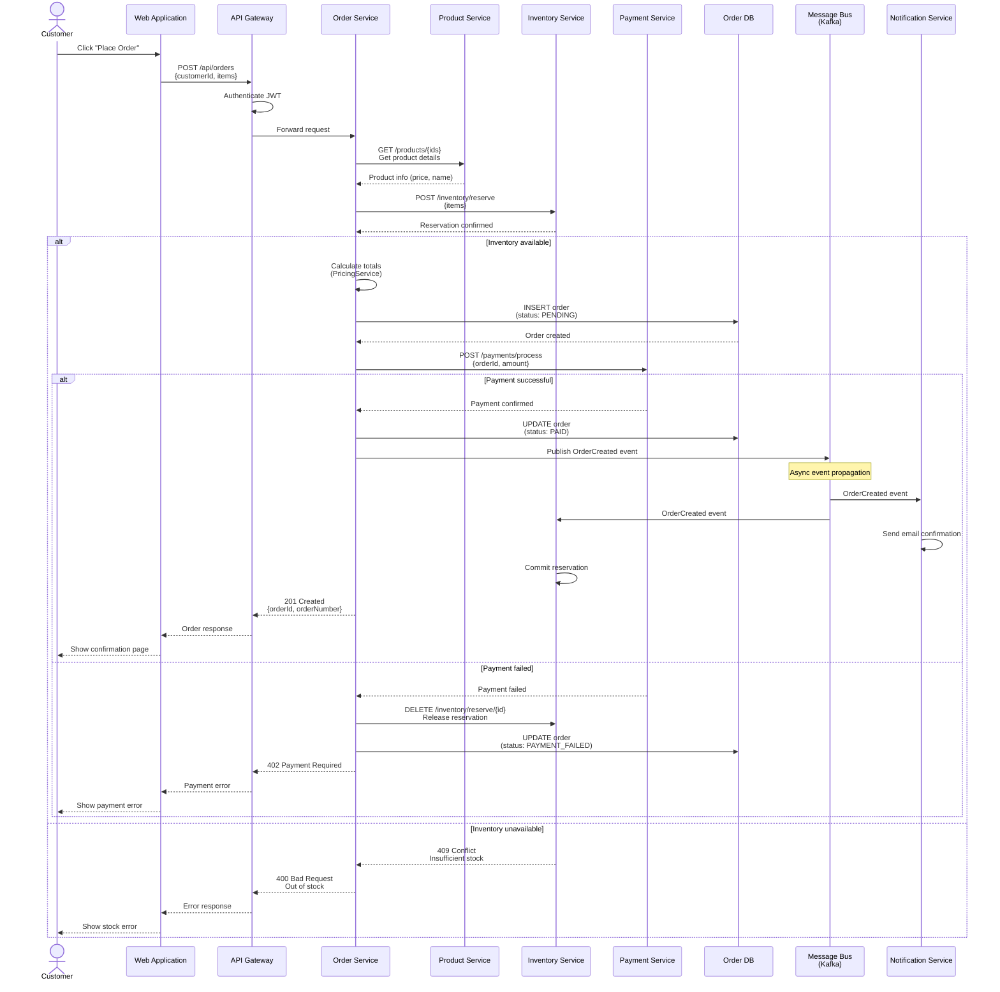
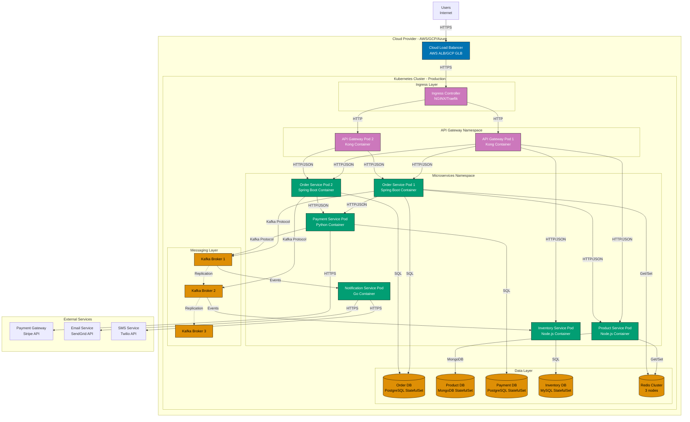
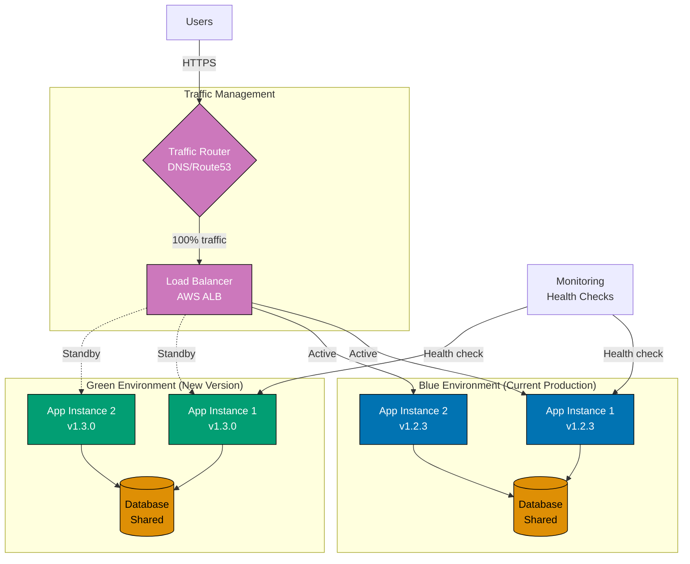
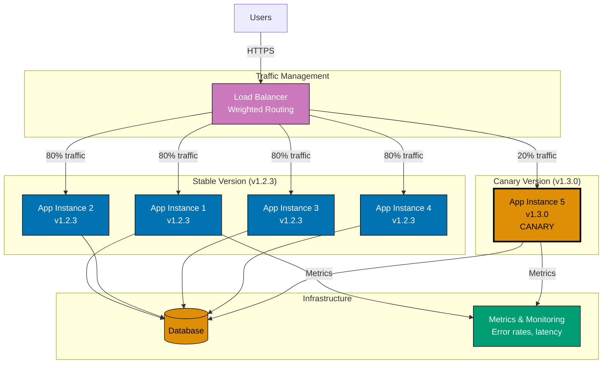
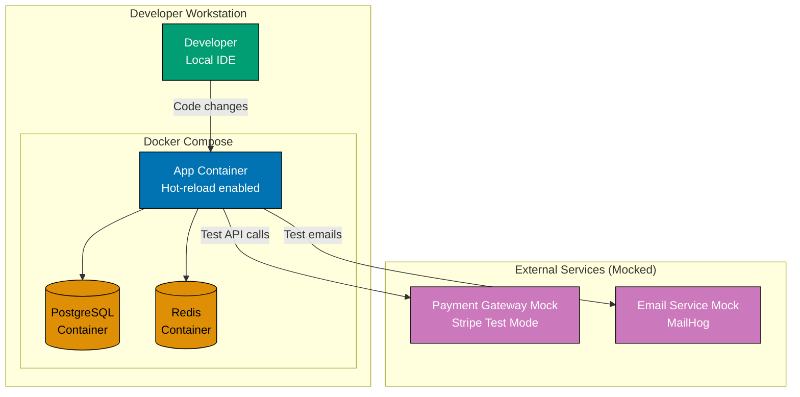
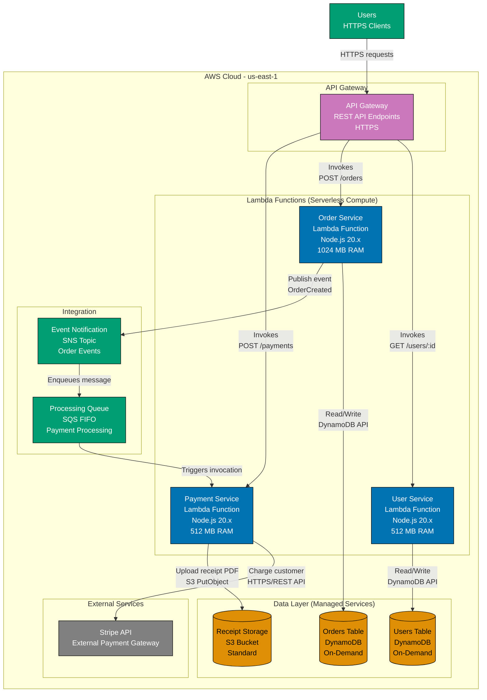
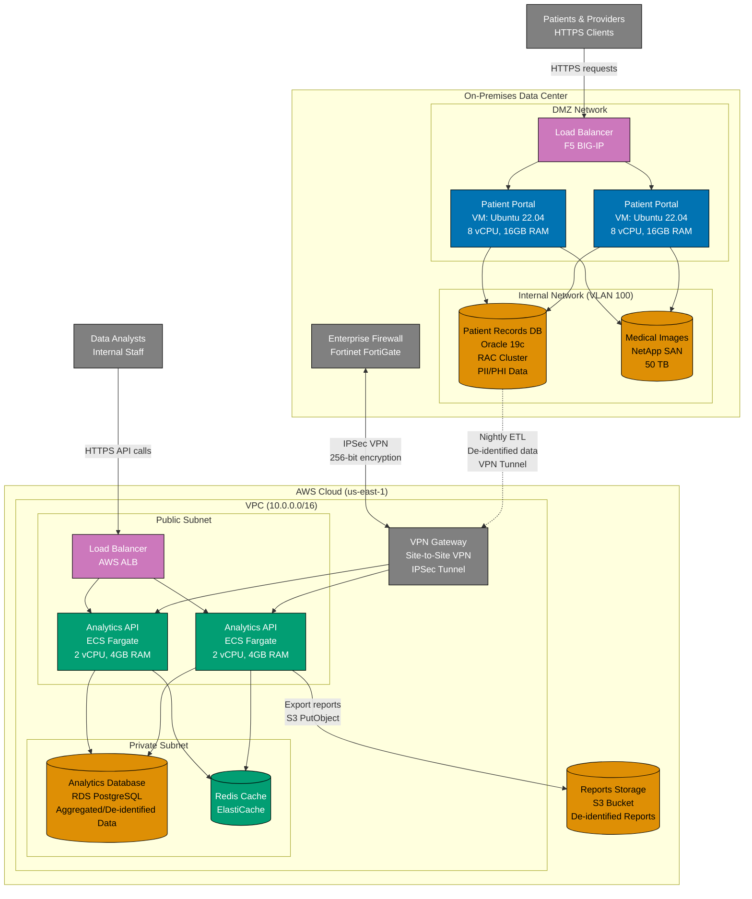
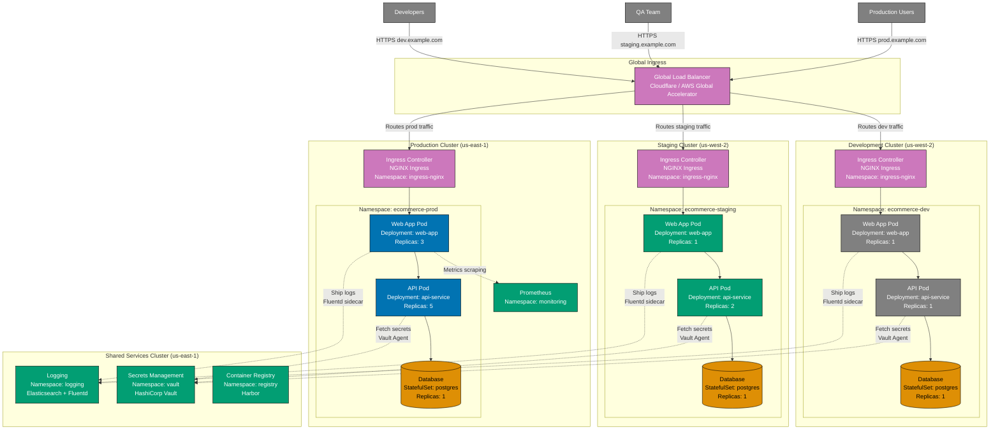

# Supplementary Diagrams

Beyond the four core levels, C4 model includes supporting diagram types that complement the static structural views with additional perspectives.

### Understanding Supplementary vs. Core Diagrams

**Core Diagrams** (Context, Container, Component, Code):

- Focus on **static structure** at different zoom levels
- Show **what exists** and **how it's organized**
- Hierarchical relationship - each level zooms into the previous
- Most teams need only Context and Container diagrams

**Supplementary Diagrams** (Landscape, Dynamic, Deployment):

- Provide **additional perspectives** beyond structure
- Show **relationships across systems**, **runtime behavior**, or **infrastructure mapping**
- Not hierarchical - each addresses a different concern
- Created only when they add specific value

### When to Use Each Supplementary Diagram Type

| Diagram Type         | Purpose                                                               | When to Create                                                                          | Typical Audience                                              |
| -------------------- | --------------------------------------------------------------------- | --------------------------------------------------------------------------------------- | ------------------------------------------------------------- |
| **System Landscape** | Shows multiple systems and their relationships within an organization | Enterprise architecture, multiple systems interacting, organizational overview needed   | Enterprise architects, technical leadership, product managers |
| **Dynamic**          | Illustrates runtime behavior and time-ordered interactions            | Complex workflows, authentication flows, error handling paths, event-driven processes   | Developers, architects, security reviewers                    |
| **Deployment**       | Maps containers to infrastructure and deployment environments         | Infrastructure planning, DevOps setup, scaling strategy, multi-environment architecture | DevOps engineers, infrastructure teams, cloud architects      |

### Decision Matrix: Which Diagram to Create?

**Start Here** (always create these):

1. **System Context** - Mandatory starting point
2. **Container Diagram** - Shows technical building blocks

**Add When Needed**:

1. **System Landscape** - Only if documenting multiple systems across an organization
2. **Dynamic Diagram** - Only for complex workflows that aren't obvious from structure alone
3. **Deployment Diagram** - Only when infrastructure topology matters for understanding
4. **Component Diagrams** - Only for containers with significant internal complexity
5. **Code Diagrams** - Rarely needed; use when existing code alone is insufficient

### How Supplementary Diagrams Work Together

Supplementary diagrams complement core diagrams by answering different questions:

- **System Landscape** answers: "What other systems exist in our organization and how do they relate?"
- **Dynamic Diagram** answers: "What happens when this workflow executes?"
- **Deployment Diagram** answers: "Where does this software run and on what infrastructure?"

These are **orthogonal concerns** - they don't replace each other or form a hierarchy. A complete architecture documentation set might include:

- **1 System Landscape** (optional, enterprise-level)
- **1 System Context** per system
- **1 Container Diagram** per system
- **1-2 Dynamic Diagrams** for critical workflows
- **1-2 Deployment Diagrams** for production and development environments
- **2-3 Component Diagrams** for complex containers
- **1-2 Code Diagrams** for critical components (rare)

**Key Principle**: Create only diagrams that help someone understand the system better. Over-documentation creates maintenance burden and becomes outdated quickly.

### System Landscape Diagram

**Purpose**: Shows multiple software systems and how they relate within an organization or enterprise ecosystem.

**Audience**: Enterprise architects, technical leadership, senior management, product managers, and anyone needing an organizational-level view of the software landscape.

**Scope**: Organization-wide perspective. While a System Context diagram shows one system and its external dependencies, a System Landscape diagram shows multiple systems (often 5-15) and the relationships between them.

**Contains**:

- Multiple software systems (both in-house and external)
- People/organizations that interact with systems
- High-level relationships showing which systems integrate
- Organizational or domain boundaries (optional groupings)

**Key Questions Answered**:

- What software systems exist in our organization?
- How do our systems integrate with each other?
- Which external systems do we depend on?
- What are the major integration points across the enterprise?
- Where are the organizational boundaries between system ownership?

**System Context vs. System Landscape**:

| Aspect             | System Context                                                 | System Landscape                                                       |
| ------------------ | -------------------------------------------------------------- | ---------------------------------------------------------------------- |
| **Focus**          | Single system being documented                                 | Multiple systems across organization                                   |
| **Scope**          | One system + its external dependencies                         | Entire enterprise software ecosystem                                   |
| **Audience**       | System stakeholders (developers, architects, product managers) | Enterprise architects, technical leadership, executives                |
| **Granularity**    | Shows users and external systems interacting with ONE system   | Shows how MULTIPLE systems relate to each other                        |
| **Quantity**       | One per software system                                        | Typically one per organization or business domain                      |
| **Detail Level**   | Medium detail on system boundaries and integrations            | High-level overview, minimal detail                                    |
| **When to Create** | Always - starting point for system documentation               | Optional - only for enterprise architecture or multi-system portfolios |

**When to Use**:

- Documenting enterprise architecture across multiple teams
- Showing how systems owned by different teams integrate
- Providing organizational overview for executive stakeholders
- Identifying redundant systems or integration opportunities
- Planning enterprise-wide migrations or consolidations
- Onboarding enterprise architects or technical leaders

**When NOT to Use**:

- Single-system projects (use System Context instead)
- Small organizations with only 1-2 systems
- When system integrations are simple or non-existent

**Example: Enterprise E-Commerce System Landscape**



**Diagram Explanation**:

- **Our Organization** (blue): Five different systems owned and operated by the organization
  - **E-Commerce Platform**: Modern microservices architecture, customer-facing
  - **Inventory Management**: Monolithic system managing stock levels
  - **Warehouse Management**: Legacy system for fulfillment operations
  - **Analytics Platform**: Data pipeline aggregating events from all systems
  - **CRM**: SaaS integration for customer relationship management
- **Users** (teal): Three types of actors interacting with organizational systems
- **External Systems** (purple): Third-party services providing capabilities
- **Integration Points**: Lines show key integration relationships
  - E-Commerce Platform acts as central hub
  - Inventory and Warehouse systems directly integrated
  - Analytics consumes events from multiple systems
  - External systems provide payment, shipping, email, and accounting capabilities

This landscape view reveals:

1. **System Diversity**: Mix of modern microservices, monolith, legacy system, and SaaS integration
2. **Central Hub**: E-Commerce Platform is the primary entry point and orchestrator
3. **Data Flow**: Analytics aggregates events from multiple sources
4. **External Dependencies**: Four critical third-party integrations
5. **Integration Complexity**: 13 integration points across the organization

**Best Practices**:

- **Limit to 5-15 systems**: More than 15 systems becomes cluttered; split into multiple landscapes
- **Group by organizational boundaries**: Use subgraphs to show team or domain ownership
- **Show only key integrations**: Don't include every possible connection; focus on critical paths
- **Update regularly**: Landscape changes as systems are added, retired, or consolidated
- **Use consistent naming**: Match system names to how they're known in the organization
- **Include system maturity indicators**: Consider labeling legacy, modern, or planned systems
- **Complement with System Context diagrams**: Create detailed System Context diagrams for each system shown in the landscape

### Dynamic Diagram

**Purpose**: Illustrates runtime behavior and interactions over time.

**Formats**:

- **Collaboration Format**: Shows objects and messages between them
- **Sequence Format**: Shows time-ordered interactions (similar to UML sequence diagrams)

**When to Use**:

- Explaining complex workflows
- Documenting authentication flows
- Showing transaction processing
- Illustrating error handling paths

**Example Use Cases**:

- User authentication flow across microservices
- Order processing with inter-service communication
- Event-driven inventory updates

**Example: Order Creation Flow (Microservices Sequence Diagram)**



**Diagram Explanation**:

This sequence diagram illustrates a complex microservices orchestration:

1. **API Gateway**: Entry point handling authentication and routing
2. **Synchronous Calls**:
   - Order Service calls Product Service for product details
   - Order Service calls Inventory Service to reserve stock
   - Order Service calls Payment Service to process payment
3. **Database Operations**: Order Service writes to its own database
4. **Asynchronous Events**:
   - Order Service publishes `OrderCreated` event to Kafka
   - Notification Service subscribes and sends confirmation email
   - Inventory Service subscribes and commits reservation
5. **Error Handling**:
   - Payment failure triggers compensation (release inventory reservation)
   - Inventory unavailability returns early error
6. **Microservices Patterns**:
   - **Saga Pattern**: Coordinated transaction across services
   - **Compensation**: Rollback actions on failure (release reservation)
   - **Event-Driven**: Async notifications via message bus
   - **Circuit Breaker**: (Not shown) Protects against cascading failures

This diagram reveals the complexity of distributed systems: synchronous service-to-service calls, asynchronous event propagation, compensation logic, and multiple failure scenarios. Compare this to a monolithic sequence diagram to see the trade-offs of microservices architecture.

**Note on Dynamic Diagram Formats**:

Dynamic diagrams use **sequence format** (vertical timeline) as shown above. While UML includes "collaboration format" (communication diagrams), diagram-as-code tools have limited support.

**Recommendation**: Always use sequence format for C4 dynamic diagrams.

### Deployment Diagram

**Purpose**: Maps software containers to infrastructure and deployment environments.

**Contains**:

- Infrastructure nodes (servers, containers, cloud services)
- Deployed containers
- Deployment environments (dev, staging, prod)
- Network boundaries and security zones

**When to Use**:

- Planning infrastructure provisioning
- Documenting deployment architecture
- Explaining multi-environment setups
- Identifying scaling opportunities

**Example Elements**:

- Cloud platforms (AWS, Azure, Vercel)
- Kubernetes clusters
- Multi-environment setup (dev, staging, prod)
- Container orchestration and load balancers

**Example: Microservices on Kubernetes (Production Deployment)**



**Diagram Explanation**:

This deployment diagram shows microservices deployed to Kubernetes production cluster:

**Infrastructure Components**:

- **Cloud Load Balancer**: External entry point (AWS ALB, GCP GLB, Azure Load Balancer)
- **Ingress Controller**: Kubernetes ingress routing traffic to services (NGINX, Traefik)
- **Namespaces**: Logical isolation (API Gateway namespace, Microservices namespace)
- **Pods**: Kubernetes deployment units, each running one or more containers
- **StatefulSets**: For stateful applications (databases) with persistent storage
- **Kafka Cluster**: 3-broker cluster for high availability and event streaming

**Microservices Deployment**:

- **Order Service**: 2 pod replicas (horizontal scaling)
- **Product Service**: 1 pod (can scale horizontally)
- **Payment Service**: 1 pod (stateless, can scale)
- **Inventory Service**: 1 pod (handles inventory events)
- **Notification Service**: 1 pod (consumes Kafka events)

**Database-per-Service**:

- Each microservice has its own database (StatefulSet with persistent volumes)
- Different database technologies: PostgreSQL, MongoDB, MySQL
- No shared databases - enforces loose coupling

**Messaging Infrastructure**:

- **Kafka Cluster**: 3 brokers for fault tolerance
- **Event Streaming**: Asynchronous communication between services
- **Replication**: Kafka brokers replicate data for durability

**Key Deployment Patterns**:

1. **Container Orchestration**: Kubernetes manages scheduling, scaling, self-healing
2. **Service Discovery**: Kubernetes DNS for service-to-service communication
3. **Horizontal Scaling**: Multiple pod replicas with load balancing
4. **StatefulSets**: Persistent storage for databases
5. **Namespace Isolation**: Logical separation of concerns
6. **External Services**: Managed third-party APIs (Stripe, SendGrid, Twilio)

**Not Shown** (implied by Kubernetes):

- Health checks (liveness/readiness probes)
- Auto-scaling (HPA - Horizontal Pod Autoscaler)
- ConfigMaps and Secrets for configuration
- Service mesh (Istio/Linkerd) for observability
- Persistent volumes for StatefulSets

This diagram helps DevOps teams understand deployment topology, scaling strategies, and infrastructure dependencies that are invisible in Container diagrams. The complexity of deploying microservices on Kubernetes becomes clear compared to monolithic deployments.

#### Multi-Environment Deployment Patterns

Real-world applications deploy to multiple environments with different infrastructure configurations. Understanding these patterns helps teams plan deployment strategies and infrastructure requirements.

**Common Environments**:

- **Development**: Local or minimal cloud infrastructure for feature development
- **Staging**: Production-like environment for integration testing
- **Production**: Live environment serving real users

**Deployment Strategies**:

- **Blue-Green**: Two identical environments, switch traffic between them
- **Canary**: Gradual rollout to subset of users before full deployment
- **Rolling**: Sequential update of instances one at a time

##### Blue-Green Deployment Pattern

**Blue-Green Example: Zero-Downtime Deployment**



**Pattern Explanation**:

- **Blue Environment**: Currently serving 100% of production traffic (v1.2.3)
- **Green Environment**: New version deployed but not yet active (v1.3.0)
- **Shared Database**: Both environments connect to same database (schema compatible)
- **Traffic Router**: DNS or load balancer routes traffic to active environment
- **Monitoring**: Health checks verify green environment before switch
- **Deployment Process**:
  1. Deploy new version to green environment
  2. Run automated tests against green environment
  3. Switch traffic from blue to green (instant cutover)
  4. Monitor green environment for issues
  5. If issues occur: switch back to blue (instant rollback)
  6. If successful: blue becomes next green for future deployments

**Advantages**: Zero downtime, instant rollback, full testing before production traffic

**Challenges**: Requires double infrastructure, database migrations must be compatible with both versions

##### Canary Deployment Pattern

**Canary Example: Gradual Rollout**



**Pattern Explanation**:

- **Stable Instances**: 4 instances running v1.2.3 (80% of traffic)
- **Canary Instance**: 1 instance running v1.3.0 (20% of traffic)
- **Weighted Routing**: Load balancer sends minority of requests to canary
- **Metrics Monitoring**: Compare error rates and latency between stable and canary
- **Gradual Rollout Process**:
  1. Deploy v1.3.0 to 1 instance (canary receives 20% traffic)
  2. Monitor canary metrics for issues
  3. If metrics healthy: deploy to 2 more instances (50% traffic)
  4. If still healthy: deploy to all instances (100% traffic)
  5. If issues detected at any stage: roll back canary instances

**Advantages**: Limits blast radius of bugs, real production testing with subset of users, gradual confidence building

**Challenges**: Requires robust metrics and alerting, more complex deployment automation, users may see inconsistent behavior

##### Development Environment Pattern

**Development Example: Minimal Local Infrastructure**



**Pattern Explanation**:

- **Developer Workstation**: All infrastructure runs locally via Docker Compose
- **App Container**: Application with hot-reload (code changes reflect immediately)
- **Local Databases**: PostgreSQL and Redis containers with persistent volumes
- **Mocked External Services**:
  - Payment Gateway: Stripe Test Mode (no real charges)
  - Email Service: MailHog (captures emails locally, no sending)
- **Development Workflow**:
  1. Developer runs `docker-compose up` to start all services
  2. Makes code changes in IDE with hot-reload
  3. Tests against local databases and mocked services
  4. No cloud infrastructure needed for development
  5. Tear down with `docker-compose down`

**Advantages**: Fast feedback loop, no cloud costs, works offline, isolated environment per developer

**Challenges**: Different from production (e.g., single instance vs. cluster), may miss infrastructure-specific bugs

**Cloud vs. On-Premise Deployment Patterns**:

| Aspect                | Cloud (AWS/GCP/Azure)                        | On-Premise (Private Data Center)             |
| --------------------- | -------------------------------------------- | -------------------------------------------- |
| **Infrastructure**    | Managed services (RDS, S3, Load Balancers)   | Self-managed servers, storage, networking    |
| **Scaling**           | Auto-scaling groups, elastic resources       | Manual provisioning, fixed capacity          |
| **Deployment**        | Kubernetes (EKS/GKE/AKS), ECS, Lambda        | Kubernetes, Docker Swarm, VMs                |
| **Networking**        | Virtual Private Cloud (VPC), Security Groups | Physical network, firewalls, VLANs           |
| **Storage**           | Object storage (S3), managed databases       | SAN/NAS, self-hosted databases               |
| **Cost Model**        | Pay-per-use, operational expense             | Capital expense (hardware), fixed costs      |
| **Disaster Recovery** | Multi-region replication, automated backups  | Manual backup procedures, limited redundancy |
| **Deployment Speed**  | Minutes (API-driven provisioning)            | Days/weeks (hardware procurement)            |

**When to Create Multiple Deployment Diagrams**:

- **Per Environment**: Create separate diagrams for dev, staging, production if infrastructure differs significantly
- **Per Deployment Strategy**: Document blue-green or canary patterns when using these strategies
- **Cloud vs. On-Premise**: Show both deployment targets if supporting hybrid infrastructure
- **Scaling Scenarios**: Show both small-scale (startup) and large-scale (enterprise) deployments
- **Migration Phases**: Document current state and future state during infrastructure migrations

**Best Practices**:

- **Start simple**: Development environment diagram is often sufficient for small projects
- **Add production diagram**: When deploying to cloud or on-premise, create production deployment diagram
- **Document deployment automation**: Include CI/CD pipeline tools (GitHub Actions, Jenkins) as infrastructure components
- **Show scaling strategy**: Indicate which containers can scale horizontally
- **Update during infrastructure changes**: Deployment diagrams become stale quickly; review quarterly

### Expanded Deployment Examples

Modern deployment patterns extend beyond traditional cloud and on-premise architectures. This section covers serverless, edge computing, multi-region, hybrid cloud, and Kubernetes multi-cluster deployments.

#### Example 3: Serverless Architecture (AWS Lambda)

Serverless computing eliminates infrastructure management by running code in stateless compute containers triggered by events. C4 Deployment diagrams show function-as-a-service (FaaS) mappings and managed services.

**Serverless E-Commerce API Deployment**:



**Serverless Deployment Characteristics**:

- **Compute**: Lambda functions (no servers to manage, auto-scaling)
- **Data**: Managed databases (DynamoDB), object storage (S3)
- **Integration**: Event-driven (SNS topics, SQS queues)
- **Scaling**: Automatic based on request volume (0 to thousands of concurrent executions)
- **Cost Model**: Pay-per-invocation (no idle costs)
- **Cold Start**: First invocation may have higher latency

**When to Use Serverless Deployment Diagrams**:

- Documenting event-driven architectures with FaaS
- Showing managed service dependencies (API Gateway, DynamoDB, S3)
- Explaining auto-scaling behavior and resource limits
- Planning for cold start mitigation strategies

#### Example 4: Edge Computing (Cloudflare Workers)

Edge computing deploys code to geographically distributed edge locations for minimal latency. C4 Deployment diagrams show edge runtime mappings and origin server relationships.

**Global Content API with Edge Caching**:

```mermaid
graph TB
    subgraph "Edge Network (Cloudflare)"
        subgraph "Edge Location 1 (San Francisco)"
            EDGE_SF[Content API Worker<br/>Cloudflare Worker<br/>V8 Isolate Runtime]
            KV_SF[(Edge KV Store<br/>Cloudflare KV<br/>Read Replicas)]
        end

        subgraph "Edge Location 2 (London)"
            EDGE_LONDON[Content API Worker<br/>Cloudflare Worker<br/>V8 Isolate Runtime]
            KV_LONDON[(Edge KV Store<br/>Cloudflare KV<br/>Read Replicas)]
        end

        subgraph "Edge Location 3 (Tokyo)"
            EDGE_TOKYO[Content API Worker<br/>Cloudflare Worker<br/>V8 Isolate Runtime]
            KV_TOKYO[(Edge KV Store<br/>Cloudflare KV<br/>Read Replicas)]
        end
    end

    subgraph "Origin Server (AWS us-east-1)"
        ORIGIN_API[Origin API<br/>Container: Node.js/Express<br/>EC2 t3.medium]
        ORIGIN_DB[(Primary Database<br/>PostgreSQL RDS<br/>db.t3.large)]
    end

    USERS_US[Users (US)]
    USERS_EU[Users (EU)]
    USERS_ASIA[Users (Asia)]

    USERS_US -->|HTTPS GET /content| EDGE_SF
    USERS_EU -->|HTTPS GET /content| EDGE_LONDON
    USERS_ASIA -->|HTTPS GET /content| EDGE_TOKYO

    EDGE_SF -->|Cache hit<br/>Read from KV| KV_SF
    EDGE_SF -.->|Cache miss<br/>HTTPS to origin| ORIGIN_API

    EDGE_LONDON -->|Cache hit<br/>Read from KV| KV_LONDON
    EDGE_LONDON -.->|Cache miss<br/>HTTPS to origin| ORIGIN_API

    EDGE_TOKYO -->|Cache hit<br/>Read from KV| KV_TOKYO
    EDGE_TOKYO -.->|Cache miss<br/>HTTPS to origin| ORIGIN_API

    ORIGIN_API -->|SQL queries| ORIGIN_DB
    ORIGIN_DB -.->|Replicates data<br/>Eventually consistent| KV_SF
    ORIGIN_DB -.->|Replicates data<br/>Eventually consistent| KV_LONDON
    ORIGIN_DB -.->|Replicates data<br/>Eventually consistent| KV_TOKYO

    style EDGE_SF fill:#0173B2,stroke:#000000,color:#ffffff
    style EDGE_LONDON fill:#0173B2,stroke:#000000,color:#ffffff
    style EDGE_TOKYO fill:#0173B2,stroke:#000000,color:#ffffff
    style KV_SF fill:#029E73,stroke:#000000,color:#ffffff
    style KV_LONDON fill:#029E73,stroke:#000000,color:#ffffff
    style KV_TOKYO fill:#029E73,stroke:#000000,color:#ffffff
    style ORIGIN_API fill:#CC78BC,stroke:#000000,color:#ffffff
    style ORIGIN_DB fill:#DE8F05,stroke:#000000,color:#000000
    style USERS_US fill:#808080,stroke:#000000,color:#ffffff
    style USERS_EU fill:#808080,stroke:#000000,color:#ffffff
    style USERS_ASIA fill:#808080,stroke:#000000,color:#ffffff
```

**Edge Computing Deployment Characteristics**:

- **Edge Runtime**: Code runs at 200+ global locations for minimal latency
- **Routing**: Users automatically routed to nearest edge location
- **Cache Hit**: Majority of requests served from edge KV store (fast)
- **Cache Miss**: Edge worker fetches from origin server (slower, then cached)
- **Replication**: Data replicated from origin to edge (eventually consistent)
- **Use Cases**: Content delivery, API gateway, authentication, A/B testing

**When to Use Edge Deployment Diagrams**:

- Global applications requiring low latency worldwide
- Content-heavy applications with edge caching strategies
- Explaining cache hit/miss behavior and replication lag
- Documenting edge compute limitations (CPU time, memory, cold start)

#### Example 5: Multi-Region Active-Active Deployment

Multi-region deployments distribute infrastructure across geographic regions for high availability and disaster recovery. Active-Active patterns serve traffic from all regions simultaneously.

**Global E-Commerce Platform (Active-Active Multi-Region)**:

```mermaid
graph TB
    subgraph "Global Traffic Management"
        DNS[Global DNS<br/>Route53<br/>Geolocation Routing]
    end

    subgraph "Region 1: US East (us-east-1)"
        LB_US[Load Balancer<br/>AWS ALB]
        APP_US1[App Instance 1<br/>ECS Fargate]
        APP_US2[App Instance 2<br/>ECS Fargate]
        DB_US[(Primary Database<br/>Aurora PostgreSQL<br/>Multi-AZ)]
        CACHE_US[(Redis Cluster<br/>ElastiCache)]
    end

    subgraph "Region 2: EU West (eu-west-1)"
        LB_EU[Load Balancer<br/>AWS ALB]
        APP_EU1[App Instance 1<br/>ECS Fargate]
        APP_EU2[App Instance 2<br/>ECS Fargate]
        DB_EU[(Primary Database<br/>Aurora PostgreSQL<br/>Multi-AZ)]
        CACHE_EU[(Redis Cluster<br/>ElastiCache)]
    end

    subgraph "Region 3: Asia Pacific (ap-southeast-1)"
        LB_ASIA[Load Balancer<br/>AWS ALB]
        APP_ASIA1[App Instance 1<br/>ECS Fargate]
        APP_ASIA2[App Instance 2<br/>ECS Fargate]
        DB_ASIA[(Primary Database<br/>Aurora PostgreSQL<br/>Multi-AZ)]
        CACHE_ASIA[(Redis Cluster<br/>ElastiCache)]
    end

    subgraph "Global Data Replication"
        REPLICATION[Aurora Global Database<br/>Cross-Region Replication<br/>minimal lag]
    end

    USERS_US[Users (US)]
    USERS_EU[Users (EU)]
    USERS_ASIA[Users (Asia)]

    USERS_US -->|Routed to nearest region<br/>HTTPS| DNS
    USERS_EU -->|Routed to nearest region<br/>HTTPS| DNS
    USERS_ASIA -->|Routed to nearest region<br/>HTTPS| DNS

    DNS -->|US users| LB_US
    DNS -->|EU users| LB_EU
    DNS -->|Asia users| LB_ASIA

    LB_US --> APP_US1
    LB_US --> APP_US2
    APP_US1 --> DB_US
    APP_US2 --> DB_US
    APP_US1 --> CACHE_US
    APP_US2 --> CACHE_US

    LB_EU --> APP_EU1
    LB_EU --> APP_EU2
    APP_EU1 --> DB_EU
    APP_EU2 --> DB_EU
    APP_EU1 --> CACHE_EU
    APP_EU2 --> CACHE_EU

    LB_ASIA --> APP_ASIA1
    LB_ASIA --> APP_ASIA2
    APP_ASIA1 --> DB_ASIA
    APP_ASIA2 --> DB_ASIA
    APP_ASIA1 --> CACHE_ASIA
    APP_ASIA2 --> CACHE_ASIA

    DB_US <-->|Bi-directional replication<br/>Write forwarding| REPLICATION
    DB_EU <-->|Bi-directional replication<br/>Write forwarding| REPLICATION
    DB_ASIA <-->|Bi-directional replication<br/>Write forwarding| REPLICATION

    style DNS fill:#CC78BC,stroke:#000000,color:#ffffff
    style LB_US fill:#CC78BC,stroke:#000000,color:#ffffff
    style LB_EU fill:#CC78BC,stroke:#000000,color:#ffffff
    style LB_ASIA fill:#CC78BC,stroke:#000000,color:#ffffff
    style APP_US1 fill:#0173B2,stroke:#000000,color:#ffffff
    style APP_US2 fill:#0173B2,stroke:#000000,color:#ffffff
    style APP_EU1 fill:#0173B2,stroke:#000000,color:#ffffff
    style APP_EU2 fill:#0173B2,stroke:#000000,color:#ffffff
    style APP_ASIA1 fill:#0173B2,stroke:#000000,color:#ffffff
    style APP_ASIA2 fill:#0173B2,stroke:#000000,color:#ffffff
    style DB_US fill:#DE8F05,stroke:#000000,color:#000000
    style DB_EU fill:#DE8F05,stroke:#000000,color:#000000
    style DB_ASIA fill:#DE8F05,stroke:#000000,color:#000000
    style CACHE_US fill:#029E73,stroke:#000000,color:#ffffff
    style CACHE_EU fill:#029E73,stroke:#000000,color:#ffffff
    style CACHE_ASIA fill:#029E73,stroke:#000000,color:#ffffff
    style REPLICATION fill:#808080,stroke:#000000,color:#ffffff
    style USERS_US fill:#808080,stroke:#000000,color:#ffffff
    style USERS_EU fill:#808080,stroke:#000000,color:#ffffff
    style USERS_ASIA fill:#808080,stroke:#000000,color:#ffffff
```

**Multi-Region Active-Active Characteristics**:

- **Traffic Routing**: DNS routes users to nearest region (latency-based or geolocation)
- **Regional Independence**: Each region serves requests independently (no cross-region calls)
- **Data Replication**: Database changes replicated across regions (<1s lag with Aurora Global)
- **Failure Handling**: If one region fails, DNS routes traffic to healthy regions
- **Consistency Trade-off**: Eventual consistency across regions (possible conflicts)
- **Use Cases**: Global SaaS platforms, financial services, e-commerce

**Active-Active vs Active-Passive**:

| Aspect               | Active-Active                          | Active-Passive                     |
| -------------------- | -------------------------------------- | ---------------------------------- |
| **Traffic**          | All regions serve production traffic   | Only primary region serves traffic |
| **Failover**         | Automatic (DNS routing)                | Manual or automated failover       |
| **Resource Costs**   | Higher (all regions fully provisioned) | Lower (standby region minimal)     |
| **RTO**              | Near zero (instant traffic shift)      | Minutes to hours                   |
| **Data Consistency** | Eventual consistency challenges        | Simpler (single write source)      |

**When to Use Multi-Region Deployment Diagrams**:

- Applications with global user base requiring low latency
- High availability requirements (99.99%+ uptime SLA)
- Disaster recovery planning and failover strategies
- Documenting data replication topology and consistency models

#### Example 6: Hybrid Cloud (On-Premises + Cloud)

Hybrid cloud architectures combine on-premises infrastructure with cloud services, often for regulatory compliance, data residency, or legacy system integration.

**Healthcare Platform (Hybrid Cloud)**:



**Hybrid Cloud Deployment Characteristics**:

- **On-Premises**: Sensitive data (PII/PHI) remains in private data center for compliance
- **Cloud**: Non-sensitive workloads (analytics, reporting) run in public cloud for scalability
- **Connectivity**: Site-to-Site VPN or AWS Direct Connect for secure communication
- **Data Flow**: ETL processes move de-identified data from on-prem to cloud nightly
- **Security**: Firewall, VPN encryption, network segregation (DMZ, internal VLAN)
- **Use Cases**: Regulated industries (healthcare, finance), legacy system integration

**When to Use Hybrid Deployment Diagrams**:

- Documenting data residency and compliance requirements
- Planning cloud migration strategies (lift-and-shift, strangler pattern)
- Explaining network connectivity and security boundaries
- Showing data flow between on-prem and cloud environments

#### Example 7: Kubernetes Multi-Cluster Federation

Large-scale Kubernetes deployments span multiple clusters for isolation, blast radius reduction, or multi-tenancy. C4 Deployment diagrams show cluster topology and cross-cluster communication.

**Multi-Cluster Kubernetes Platform**:



**Multi-Cluster Kubernetes Characteristics**:

- **Cluster Isolation**: Prod, staging, dev in separate clusters (blast radius control)
- **Namespace Isolation**: Within clusters, namespaces provide soft multi-tenancy
- **Shared Services**: Centralized logging, secrets, container registry across clusters
- **Cross-Cluster Communication**: Service mesh or VPN for inter-cluster traffic
- **Resource Limits**: Different resource quotas per cluster (prod gets more capacity)
- **Use Cases**: Multi-tenancy, environment separation, regulatory isolation

**When to Use Multi-Cluster Deployment Diagrams**:

- Complex Kubernetes deployments with multiple clusters
- Explaining cluster-to-cluster communication patterns
- Documenting shared services architecture
- Planning Kubernetes federation or multi-cluster service mesh

### Deployment Pattern Comparison Table

| Pattern                      | Latency        | Availability | Cost                   | Complexity | Best For                         |
| ---------------------------- | -------------- | ------------ | ---------------------- | ---------- | -------------------------------- |
| **Single Region**            | Regional       | 99.9%        | Low                    | Low        | Startups, regional applications  |
| **Multi-Region (A-A)**       | Global Low     | 99.99%+      | High                   | High       | Global SaaS, financial services  |
| **Multi-Region (A-P)**       | Regional       | 99.95%       | Medium                 | Medium     | DR requirements, cost-conscious  |
| **Serverless**               | Regional       | 99.95%       | Very Low (pay-per-use) | Low        | Event-driven, variable traffic   |
| **Edge Computing**           | Global Minimal | 99.99%       | Medium-High            | Medium     | Content delivery, real-time APIs |
| **Hybrid Cloud**             | Variable       | 99.9%        | Medium-High            | High       | Compliance, legacy integration   |
| **Kubernetes Multi-Cluster** | Regional       | 99.95%       | High                   | Very High  | Large enterprises, multi-tenancy |

### When to Create Deployment Diagrams

Deployment diagrams add value when infrastructure complexity justifies documentation overhead:

**Always Create Deployment Diagrams For**:

- Production environments with multiple infrastructure components
- Multi-region or multi-cloud deployments
- Kubernetes clusters with complex pod/service topologies
- Hybrid cloud architectures bridging on-prem and cloud
- Serverless architectures with numerous FaaS functions and managed services
- Compliance-critical systems requiring infrastructure audit trails

**Consider Creating Deployment Diagrams For**:

- Staging environments that differ significantly from production
- Blue-green or canary deployment strategies
- Edge computing architectures with cache topologies
- Database replication topologies (master-slave, multi-master)
- Disaster recovery and failover architectures

**Skip Deployment Diagrams For**:

- Single-server deployments (e.g., monolith on one VM)
- Development environments identical to production (docker-compose up)
- Static sites deployed to CDN (no infrastructure to document)
- Proof-of-concept applications with temporary infrastructure

**Best Practices**:

- **Start with Container diagram**: Ensure Container diagram exists first (deployment maps containers to infrastructure)
- **One diagram per environment**: Don't mix dev, staging, prod in single diagram (too complex)
- **Show infrastructure relationships**: Load balancers, networking, database replication
- **Indicate scaling strategy**: Fixed instances vs auto-scaling
- **Update quarterly**: Infrastructure changes frequently; review during architecture reviews
- **Use color coding**: Distinguish prod (blue), staging (green), dev (gray), shared services (teal)
