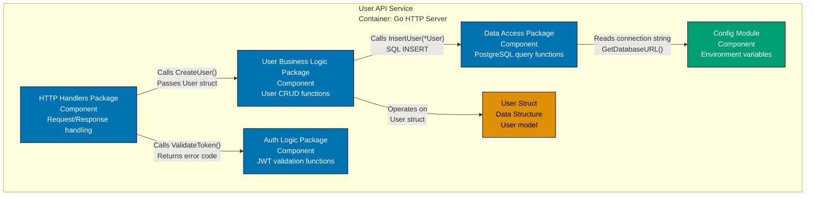
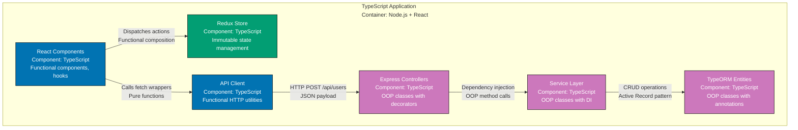
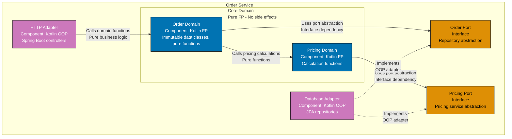
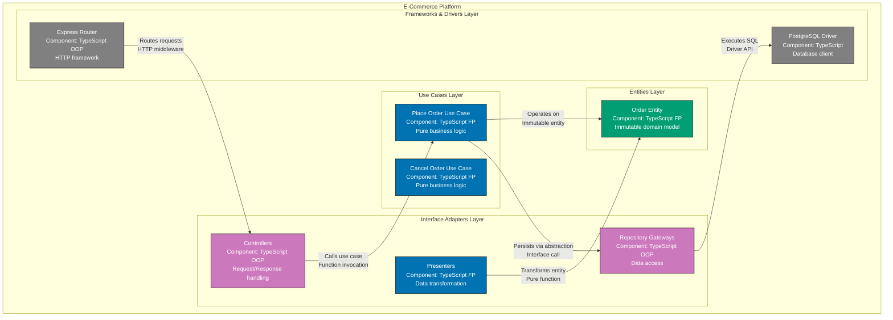
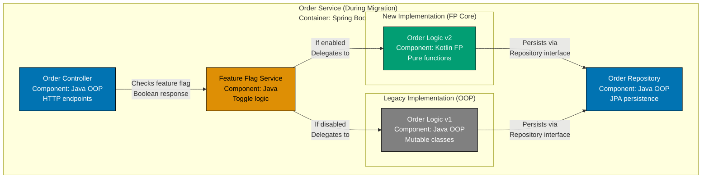

# Paradigm Considerations

The C4 model is paradigm-agnostic by design. The hierarchical zoom levels (Context → Container → Component → Code) apply equally to object-oriented, functional, procedural, and other programming paradigms. The paradigm affects HOW you implement components and code, not WHAT the architectural structure looks like.

### Object-Oriented Programming (OOP)

In object-oriented systems, C4 components manifest as:

- **Classes and objects**: Stateful entities with encapsulated behavior
- **Inheritance hierarchies**: Abstract classes, interfaces, polymorphism
- **Design patterns**: Dependency injection, factories, strategy, observer
- **State management**: Instance variables, mutable object state
- **Error handling**: Exceptions, try/catch blocks
- **Modularity**: Packages, namespaces, modules containing related classes

**Example Technologies**: Java/Spring Boot, C#/.NET, Python/Django, Ruby/Rails, TypeScript/NestJS

### Functional Programming (FP)

In functional systems, C4 components manifest as:

- **Modules with pure functions**: Stateless functions that transform data
- **Data structures**: Immutable structs, algebraic data types, pattern matching
- **Function composition**: Pipelines, higher-order functions, monads
- **State management**: Isolated processes (Actor model), persistent data structures
- **Error handling**: Result types (`Either`, `Option`), railway-oriented programming
- **Modularity**: Modules, contexts, namespaces containing related functions

**Example Technologies**: Elixir/Phoenix, Haskell, OCaml, Clojure, Scala/FP, F#

### C4 Model Across Paradigms - Order Service Example

The following table shows how the same Order Service architecture maps to C4 levels in both paradigms:

| C4 Level           | What It Describes                          | OOP Implementation (Spring Boot) | FP Implementation (Elixir/Phoenix) | Paradigm Impact |
| ------------------ | ------------------------------------------ | -------------------------------- | ---------------------------------- | --------------- |
| **System Context** | Order Service and external actors/systems  | Same - external boundaries       | Same - external boundaries         | **None**        |
| **Container**      | Order Service API, Database, Message Queue | Same - deployment units          | Same - deployment units            | **None**        |
| **Component**      | Internal modules/layers of Order Service   | Classes, Services, Repositories  | Contexts, Routers, GenServers      | **High**        |
| **Code**           | Implementation details within components   | UML Class Diagrams, JPA Entities | Function Signatures, Ecto Schemas  | **High**        |

**Key Insight**: The paradigm only affects **Component** and **Code** levels. System Context and Container diagrams look identical regardless of whether you use OOP, FP, or any other paradigm. The architectural boundaries (what talks to what) remain the same; only the internal organization changes.

### Applying C4 Model to Your Paradigm

When creating C4 diagrams for your system:

**Levels 1-2 (Context, Container)** - Paradigm-independent:

- Focus on **what exists** and **where it runs**
- These levels are the same across all paradigms
- Example: "Order Service API" is a container whether implemented in Java or Elixir

**Level 3 (Component)** - Paradigm-aware:

- **OOP**: Show services, repositories, controllers as components
- **FP**: Show contexts, routers, GenServers as components
- **Mixed**: Some teams use OOP for infrastructure, FP for business logic - show both

**Level 4 (Code)** - Paradigm-specific:

- **OOP**: Use UML class diagrams, show inheritance, show mutable state
- **FP**: Use function signature diagrams, show data transformations, show pure/impure boundaries
- **Either**: Use notation that matches your implementation language

### When to Use OOP vs FP (Balanced Perspective)

The C4 model doesn't prescribe paradigms. Choose based on:

**Favor OOP when**:

- Team expertise is primarily object-oriented
- Domain complexity benefits from encapsulation (complex state machines, rich domain models)
- Ecosystem integration requires OOP frameworks (enterprise Java, .NET)
- Gradual state mutation is natural fit for domain (simulations, games)

**Favor FP when**:

- Concurrency and parallelism are critical (FP's immutability eliminates race conditions)
- Business logic complexity benefits from pure functions (easier testing, reasoning)
- Data transformations dominate (ETL pipelines, stream processing)
- Fault tolerance is paramount (OTP supervision trees, self-healing systems)

**Favor Hybrid when**:

- Different subsystems have different needs (OOP for UI, FP for business logic)
- Transitioning between paradigms (gradual adoption)
- Language supports both well (Scala, TypeScript, Python, Kotlin)

**Reality**: Most successful systems use **pragmatic combinations** rather than paradigm purity. The C4 model helps you document whatever you build, regardless of paradigm choices.

### Procedural Programming

In procedural systems, C4 components manifest as:

- **Functions and procedures**: Stateless or stateful functions that operate on data structures
- **Data structures**: Structs, records, arrays, maps passed between functions
- **Modularity**: Packages, modules, files containing related functions
- **State management**: Explicit state passing, global state, or module-level state
- **Error handling**: Error codes, error structs, panic/recover mechanisms
- **Composition**: Function calls, callbacks, function pointers

**Example Technologies**: C, Go, Rust (procedural subset), Pascal, COBOL

**Key Characteristics**:

- Clear separation between data and behavior
- Functions operate on data structures without encapsulation
- Explicit control flow (loops, conditionals, goto in some languages)
- Memory management often manual or explicit (C) or automatic (Go)

**Procedural vs OOP vs FP Comparison**:

In procedural programming, a `User` is a struct with functions that operate on it:

```go
// Procedural (Go)
type User struct {
    ID    string
    Email string
    Name  string
}

func CreateUser(email, name string) *User {
    return &User{ID: generateID(), Email: email, Name: name}
}

func ValidateUser(u *User) error {
    if u.Email == "" {
        return errors.New("email required")
    }
    return nil
}
```

In OOP, `User` is a class with encapsulated behavior:

```java
// OOP (Java)
public class User {
    private String id;
    private String email;
    private String name;

    public User(String email, String name) {
        this.id = generateID();
        this.email = email;
        this.name = name;
    }

    public void validate() throws ValidationException {
        if (email == null || email.isEmpty()) {
            throw new ValidationException("email required");
        }
    }
}
```

In FP, `User` is immutable data with pure functions:

```elixir
# Functional (Elixir)
defmodule User do
  defstruct [:id, :email, :name]

  def create(email, name) do
    %User{id: generate_id(), email: email, name: name}
  end

  def validate(%User{email: email}) when email == "" or email == nil do
    {:error, "email required"}
  end
  def validate(%User{}), do: :ok
end
```

**C4 Component Diagram for Procedural Architecture (Go API)**:



**Key Differences from OOP Component Diagram**:

- Components are **packages of functions**, not classes
- Data structures (User struct) shown separately from behavior
- Relationships show **function calls** with explicit parameters
- No inheritance hierarchies or polymorphism
- State management explicit (config module, database access)

### Multi-Paradigm Languages

Many modern languages support multiple paradigms. C4 diagrams for these systems should reflect the **dominant paradigm used in each component**, not the language's capabilities.

**Multi-Paradigm Language Examples**:

| Language   | Paradigms Supported           | Typical Usage Pattern                                     | C4 Component Style                     |
| ---------- | ----------------------------- | --------------------------------------------------------- | -------------------------------------- |
| TypeScript | OOP, FP, Procedural           | OOP for classes, FP for utilities, Procedural for scripts | Show classes AND function modules      |
| Rust       | Procedural, FP, OOP (limited) | Procedural with FP influences, traits instead of classes  | Show modules and trait implementations |
| Kotlin     | OOP, FP                       | OOP for domain models, FP for data transformations        | Hybrid - classes with pure functions   |
| Scala      | OOP, FP                       | FP for business logic, OOP for framework integration      | Context-dependent (FP or OOP)          |
| Python     | OOP, FP, Procedural           | OOP for frameworks, Procedural for scripts, FP for data   | Mixed based on module purpose          |
| JavaScript | OOP, FP, Procedural           | FP for React, OOP for Angular, Procedural for Node utils  | Framework-dependent                    |

**Example: TypeScript Full-Stack Application (Multi-Paradigm Component Diagram)**:



**Annotation Guide**:

- **Blue** (FP components): React functional components, API client utilities
- **Teal** (FP state): Redux immutable store
- **Purple** (OOP components): Express controllers, service layer, TypeORM entities

**Key Insight**: Same language (TypeScript), different paradigms in different layers. C4 Component diagram should make this **explicit** through labeling and annotations.

### Comprehensive Paradigm Comparison Table

The table below compares how C4 Component and Code levels differ across paradigms:

| Aspect                      | Procedural (C, Go)                                 | OOP (Java, C#)                         | FP (Elixir, Haskell)                           | Multi-Paradigm (TypeScript, Rust)               |
| --------------------------- | -------------------------------------------------- | -------------------------------------- | ---------------------------------------------- | ----------------------------------------------- |
| **Component Unit**          | Package of functions                               | Class or service                       | Module of pure functions                       | Mixed (classes, modules, traits)                |
| **Data Representation**     | Structs, records                                   | Objects with encapsulated state        | Immutable data structures                      | Depends on layer (structs, classes, types)      |
| **Behavior Location**       | Functions operate on data                          | Methods encapsulated in classes        | Pure functions transform data                  | Mixed (methods and functions)                   |
| **State Management**        | Explicit state passing or global state             | Instance variables, mutable fields     | Isolated processes, persistent data structures | Depends on module (stateful or stateless)       |
| **Error Handling**          | Error codes, error structs                         | Exceptions, try/catch                  | Result types (Either, Option)                  | Mixed (exceptions and Result types)             |
| **Composition**             | Function calls, callbacks                          | Inheritance, composition, polymorphism | Function composition, higher-order functions   | Mixed (inheritance and composition)             |
| **C4 Code Diagram Type**    | Function signatures, call graphs                   | UML class diagrams, sequence diagrams  | Type signatures, data flow diagrams            | Hybrid (depends on component)                   |
| **C4 Component Labels**     | "Package: user_logic"                              | "Service: UserService"                 | "Context: Accounts"                            | "Module: UserManagement (OOP + FP)"             |
| **Example Technologies**    | C, Go, Rust (procedural style), Pascal             | Java/Spring, C#/.NET, Python/Django    | Elixir/Phoenix, Haskell, OCaml, Clojure        | TypeScript, Rust, Kotlin, Scala, Python         |
| **Paradigm Impact on L1-2** | None (Context and Container are paradigm-agnostic) | None                                   | None                                           | None                                            |
| **Paradigm Impact on L3**   | High (show packages and function groupings)        | High (show classes and services)       | High (show contexts and modules)               | High (show mixed components with annotations)   |
| **Paradigm Impact on L4**   | High (function signatures and call graphs)         | High (UML class diagrams)              | High (type signatures and data flow)           | High (hybrid diagrams based on component style) |

### Hybrid Architectures

Some architectural patterns intentionally combine paradigms across layers. C4 diagrams should reflect this hybrid nature.

**Pattern 1: Hexagonal Architecture (Ports and Adapters)**

Hexagonal architecture separates core business logic from infrastructure. Often uses:

- **Core domain**: Pure FP (immutable, testable, side-effect-free)
- **Ports**: Interfaces (OOP abstractions)
- **Adapters**: OOP or procedural implementations (HTTP controllers, database repositories)

**Example: Hexagonal Architecture Component Diagram**:



**Annotation Guide**:

- **Purple** (OOP): Adapters (HTTP, Database)
- **Blue** (FP): Core domain (pure functions, immutable data)
- **Orange** (Interfaces): Ports (abstraction layer)
- **Dashed lines**: "Implements" relationships

**Pattern 2: Clean Architecture (Dependency Rule)**

Clean Architecture enforces dependency flow from outer layers (infrastructure) to inner layers (domain). Paradigm choices by layer:

- **Entities** (innermost): Pure FP or OOP domain models
- **Use Cases**: FP or OOP interactors
- **Interface Adapters**: OOP controllers, presenters, gateways
- **Frameworks & Drivers** (outermost): OOP or procedural framework integration

**Example: Clean Architecture Component Diagram (TypeScript)**:



**Annotation Guide**:

- **Gray** (Infrastructure): Frameworks and drivers (outer layer)
- **Purple** (OOP): Controllers and gateways (adapter layer)
- **Blue** (FP): Use cases and presenters (application logic)
- **Teal** (FP): Entities (core domain)

**Key Insight**: Hybrid architectures intentionally use different paradigms at different layers to maximize benefits (FP for testable business logic, OOP for framework integration).

### Transition Guidance: Migrating Between Paradigms

When transitioning systems between paradigms, C4 diagrams help visualize the migration strategy.

**Common Migration Patterns**:

1. **Monolith to Microservices** (often OOP → OOP + FP):
   - Extract bounded contexts as FP services
   - Keep UI/infrastructure in OOP
   - Container diagrams show new service boundaries

2. **OOP to FP Core** (Hexagonal/Clean Architecture):
   - Refactor business logic to pure functions
   - Keep adapters in OOP
   - Component diagrams show FP core surrounded by OOP adapters

3. **Procedural to OOP** (Legacy modernization):
   - Wrap procedural code in OOP facades
   - Gradually replace with OOP implementations
   - Component diagrams show "Legacy Module (Procedural)" vs "New Module (OOP)"

**Example: Migration Strategy Component Diagram (OOP → Hybrid)**:



**Annotation Guide**:

- **Teal** (New FP): Target implementation (pure functions)
- **Gray** (Legacy OOP): Old implementation (mutable classes)
- **Orange** (Toggle): Feature flag routing logic
- **Blue** (Stable): Unchanged infrastructure (controller, repository)

**Migration Workflow**:

1. **Phase 1**: Create Component diagram showing current state (all OOP)
2. **Phase 2**: Add new FP components alongside legacy OOP (hybrid diagram with feature flags)
3. **Phase 3**: Remove legacy components, update diagram to show final state (FP core)

### Real-World Examples Across Paradigms

**Example 1: Go Microservice (Procedural)**

**System**: User Authentication Service
**Language**: Go (procedural paradigm)
**Container Diagram**:

- Auth API (Go HTTP server)
- PostgreSQL database
- Redis cache

**Component Diagram** (showing procedural organization):

- `handlers` package: HTTP request handlers
- `auth` package: Authentication logic functions
- `users` package: User CRUD functions
- `tokens` package: JWT generation/validation functions
- `database` package: PostgreSQL query functions
- `cache` package: Redis operations functions

**C4 Level 3 Recommendation**: Show **packages of functions**, not classes. Label relationships with function names (e.g., "Calls GenerateToken(userID)").

**Example 2: TypeScript Full-Stack (Multi-Paradigm)**

**System**: E-Commerce Platform
**Language**: TypeScript (multi-paradigm)
**Container Diagram**:

- React SPA (TypeScript/FP for components)
- Express API (TypeScript/OOP for controllers)
- PostgreSQL database

**Component Diagram** (showing multi-paradigm organization):

Frontend (FP):

- React functional components (hooks, composition)
- Redux store (immutable state)
- API client utilities (pure functions)

Backend (OOP):

- Express controllers (classes with decorators)
- Service layer (dependency injection)
- TypeORM entities (Active Record pattern)

**C4 Level 3 Recommendation**: Use **color coding or annotations** to distinguish FP components (frontend) from OOP components (backend). Show different composition styles (functional composition vs dependency injection).

**Example 3: Rust Systems Programming (Procedural + FP)**

**System**: High-Performance Data Pipeline
**Language**: Rust (procedural with FP influences)
**Container Diagram**:

- Data Ingestion Service (Rust)
- Stream Processor (Rust)
- TimescaleDB

**Component Diagram** (showing procedural + FP organization):

- `ingestion` module: Entry point functions
- `parsers` module: Data parsing functions (pure)
- `transformers` module: Data transformation pipelines (pure, functional composition)
- `validators` module: Validation functions (pure)
- `sinks` module: Database write functions (impure)
- `traits`: Shared behavior (trait implementations)

**C4 Level 3 Recommendation**: Show **modules and traits**, distinguish **pure** functions (transformers, validators) from **impure** functions (ingestion, sinks). Highlight functional composition patterns (pipeline operators).

### Cross-References to Examples in This Documentation

**OOP Examples**:

- Component Diagram: See "Example: Order Service Components" in [Level 3: Component Diagram](./ex-sode-c4armo__03-level-3-component.md#example-order-service-components-java-spring-boot-microservice)
- Code Diagram: See "Example 1" and "Example 2" in [Level 4: Code Diagram](./ex-sode-c4armo__05-level-4-code.md)

**FP Examples**:

- Component Diagram: See "Functional Programming Approach" in [Level 3: Component (FP)](./ex-sode-c4armo__04-level-3-component-fp.md)
- Code Diagram: See "Functional Programming Approach" in [Level 4: Code (FP)](./ex-sode-c4armo__06-level-4-code-fp.md)

**Paradigm-Agnostic Examples**:

- System Context: See examples in [Level 1: System Context](./ex-sode-c4armo__01-level-1-system-context.md)
- Container: See examples in [Level 2: Container](./ex-sode-c4armo__02-level-2-container.md)
