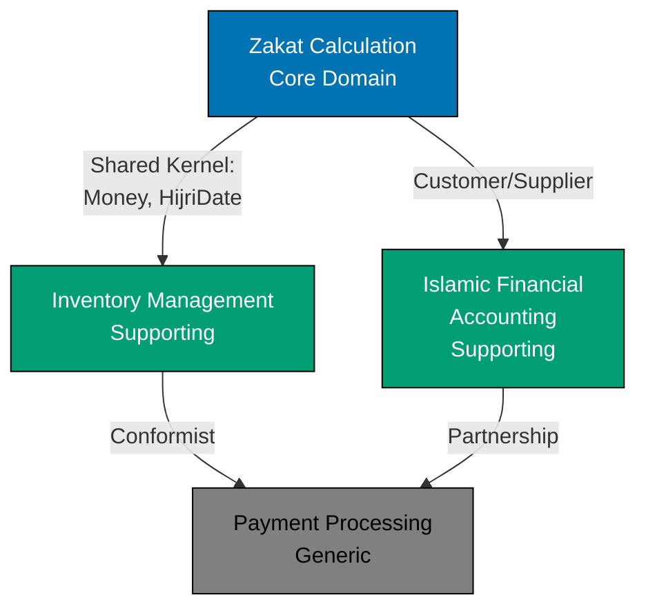

# Domain-Driven Design (DDD) Documentation

Comprehensive documentation on Domain-Driven Design patterns, principles, and practices for building complex business software systems. This documentation emphasizes both strategic patterns (Bounded Contexts, Context Mapping) and tactical patterns (Aggregates, Value Objects, Entities), with examples drawn from Islamic finance and Sharia-compliant business domains.

## What is Domain-Driven Design?

Domain-Driven Design (DDD) is a software development approach that places the business domain at the center of software design. Introduced by Eric Evans in 2003, DDD provides strategic and tactical patterns for managing complexity in large-scale software systems.

**Key Principles:**

- **Ubiquitous Language**: Shared vocabulary between developers and domain experts
- **Bounded Contexts**: Clear boundaries around cohesive domain models
- **Strategic Design**: Understanding the business landscape before implementation
- **Tactical Patterns**: Building blocks for expressing domain logic (Aggregates, Entities, Value Objects)
- **Continuous Learning**: Iterative refinement through collaboration with domain experts

**When to Use DDD:**

- Complex business logic with numerous rules and invariants
- Access to domain experts for collaboration
- Long-lived systems expected to evolve over years
- High cost of defects or regulatory compliance requirements

See [Introduction and Philosophy](./ex-ddd__01-introduction-and-philosophy.md) for a comprehensive overview.

## Documentation Structure

This documentation is organized into strategic design (understanding the business), tactical design (implementing the model), and advanced topics.

### Foundation

- **[01. Introduction and Philosophy](./ex-ddd__01-introduction-and-philosophy.md)** - Overview, history, when to use DDD, decision matrix
- **[02. Ubiquitous Language](./ex-ddd__02-ubiquitous-language.md)** - Creating shared vocabulary with domain experts
- **[README (this file)]** - Navigation and learning paths

### Strategic Design

Strategic patterns focus on understanding the business domain and defining boundaries:

- **[03. Bounded Contexts](./ex-ddd__03-bounded-contexts.md)** - Defining clear boundaries around domain models
- **[04. Context Mapping](./ex-ddd__04-context-mapping.md)** - 9 patterns for integrating bounded contexts
- **[05. Subdomains](./ex-ddd__05-subdomains.md)** - Core, Supporting, and Generic subdomains
- **[06. Strategic Design Process](./ex-ddd__06-strategic-design-process.md)** - Event Storming and Bounded Context Canvas workshops

### Tactical Design

Tactical patterns are building blocks for implementing domain models:

- **[07. Entities](./ex-ddd__07-entities.md)** - Objects with identity and lifecycle
- **[08. Value Objects](./ex-ddd__08-value-objects.md)** - Immutable objects with structural equality
- **[09. Aggregates](./ex-ddd__09-aggregates.md)** - Consistency boundaries and transactional units ⭐ **Most Important**
- **[10. Repositories](./ex-ddd__10-repositories.md)** - Persistence abstraction for aggregates
- **[11. Domain Services](./ex-ddd__11-domain-services.md)** - Stateless operations on domain objects
- **[12. Domain Events](./ex-ddd__12-domain-events.md)** - Capturing business occurrences
- **[13. Factories](./ex-ddd__13-factories.md)** - Complex object construction

### Advanced Topics

Integration with programming paradigms and architectures:

- **[14. DDD and Functional Programming](./ex-ddd__14-ddd-and-functional-programming.md)** - Adapting DDD to FP paradigm
- **[15. Layered Architecture](./ex-ddd__15-layered-architecture.md)** - Domain layer in broader architecture
- **[16. Decision Trees and Best Practices](./ex-ddd__16-decision-trees-and-best-practices.md)** - Practical guidance and common pitfalls
- **[17. DDD and C4 Integration](./ex-ddd__17-ddd-and-c4-integration.md)** - Mapping DDD to C4 architecture diagrams
- **[18. FAQ](./ex-ddd__18-faq.md)** - Common questions and misconceptions

### Templates

Reusable templates for applying DDD patterns:

- **[19. Templates Directory](./ex-ddd__19-templates/)** - Practical templates for DDD artifacts:
  - **[Bounded Context Canvas](./ex-ddd__19-templates/bounded-context-canvas.md)** - Document context details
  - **[Context Map Diagram](./ex-ddd__19-templates/context-map-diagram.md)** - Visualize context relationships
  - **[Ubiquitous Language Glossary](./ex-ddd__19-templates/ubiquitous-language-glossary.md)** - Track domain terminology
  - **[Aggregate Design Template](./ex-ddd__19-templates/aggregate-design-template.md)** - Structure aggregate documentation
  - **[Domain Event Catalog](./ex-ddd__19-templates/domain-event-catalog.md)** - Document domain events

## Learning Paths

Choose a learning path based on your goals and available time.

### 5-Minute Quick Start: Is DDD Right for My Domain?

**Goal**: Determine if DDD is appropriate for your project.

**Path**:

1. Read [Introduction and Philosophy - Decision Matrix](./ex-ddd__01-introduction-and-philosophy.md#decision-matrix) (3 minutes)
2. Review [When to Use DDD](./ex-ddd__01-introduction-and-philosophy.md#when-to-use-domain-driven-design) (2 minutes)

**Outcome**: Clear yes/no decision on adopting DDD with quantitative scoring.

### 30-Minute Practical: Design Your First Bounded Context

**Goal**: Understand strategic design and model one bounded context.

**Path**:

1. **Strategic Foundation** (10 minutes)
   - [Ubiquitous Language](./ex-ddd__02-ubiquitous-language.md) - Create shared vocabulary (5 min)
   - [Bounded Contexts](./ex-ddd__03-bounded-contexts.md#defining-bounded-contexts) - Define boundaries (5 min)

2. **Tactical Basics** (15 minutes)
   - [Aggregates](./ex-ddd__09-aggregates.md#what-is-an-aggregate) - Understand consistency boundaries (7 min)
   - [Value Objects](./ex-ddd__08-value-objects.md#what-is-a-value-object) - Immutable domain primitives (5 min)
   - [Entities](./ex-ddd__07-entities.md#what-is-an-entity) - Identity and lifecycle (3 min)

3. **Apply** (5 minutes)
   - Use [Bounded Context Canvas Template](./ex-ddd__19-templates/bounded-context-canvas.md)
   - Design one bounded context for your domain

**Outcome**: Documented bounded context with key aggregates and value objects identified.

### 2-Hour Deep Dive: Master Strategic and Tactical Design

**Goal**: Comprehensive understanding of DDD strategic and tactical patterns.

**Strategic Design** (60 minutes):

1. [Introduction and Philosophy](./ex-ddd__01-introduction-and-philosophy.md) (15 min)
2. [Ubiquitous Language](./ex-ddd__02-ubiquitous-language.md) (10 min)
3. [Bounded Contexts](./ex-ddd__03-bounded-contexts.md) (15 min)
4. [Context Mapping](./ex-ddd__04-context-mapping.md) - 9 integration patterns (15 min)
5. [Subdomains](./ex-ddd__05-subdomains.md) - Core, Supporting, Generic (5 min)

**Tactical Design** (45 minutes):

1. [Aggregates](./ex-ddd__09-aggregates.md) - Most important tactical pattern (15 min)
2. [Value Objects](./ex-ddd__08-value-objects.md) (10 min)
3. [Entities](./ex-ddd__07-entities.md) (7 min)
4. [Domain Events](./ex-ddd__12-domain-events.md) (8 min)
5. [Repositories](./ex-ddd__10-repositories.md) (5 min)

**Decision Making** (15 minutes):

1. [Decision Trees and Best Practices](./ex-ddd__16-decision-trees-and-best-practices.md) (10 min)
2. [FAQ](./ex-ddd__18-faq.md) (5 min)

**Outcome**: Full understanding of strategic landscape and tactical implementation patterns.

### By Paradigm: Object-Oriented vs. Functional Programming

**For OOP Developers**:

Traditional DDD path with class-based examples:

1. [Introduction and Philosophy](./ex-ddd__01-introduction-and-philosophy.md)
2. [Entities](./ex-ddd__07-entities.md) - Focus on OOP sections
3. [Value Objects](./ex-ddd__08-value-objects.md) - Focus on OOP sections
4. [Aggregates](./ex-ddd__09-aggregates.md) - Class-based aggregate roots
5. [Domain Services](./ex-ddd__11-domain-services.md) - Stateless classes
6. [Layered Architecture](./ex-ddd__15-layered-architecture.md) - Traditional 4-layer

**For FP Developers**:

Adapted DDD for functional programming:

1. [Introduction and Philosophy](./ex-ddd__01-introduction-and-philosophy.md)
2. [DDD and Functional Programming](./ex-ddd__14-ddd-and-functional-programming.md) ⭐ **Start Here**
3. [Value Objects](./ex-ddd__08-value-objects.md) - Focus on FP sections (immutable records)
4. [Entities](./ex-ddd__07-entities.md) - Focus on FP sections (identity-based equality)
5. [Aggregates](./ex-ddd__09-aggregates.md) - Pure functions for validation
6. [Domain Events](./ex-ddd__12-domain-events.md) - Event-driven FP
7. [Repositories](./ex-ddd__10-repositories.md) - Pure data access interfaces

**Key Differences**:

- **OOP**: Encapsulation, state management via classes, method-based behavior
- **FP**: Immutability, pure functions, separated data and behavior, railway-oriented programming

### By Architecture: Microservices vs. Monolith

**For Microservices Architecture**:

DDD strategic patterns align naturally with microservices:

1. [Bounded Contexts](./ex-ddd__03-bounded-contexts.md) - Each microservice is a bounded context
2. [Context Mapping](./ex-ddd__04-context-mapping.md) - API integration patterns
3. [Subdomains](./ex-ddd__05-subdomains.md) - Service decomposition strategy
4. [Domain Events](./ex-ddd__12-domain-events.md) - Event-driven inter-service communication
5. [DDD and C4 Integration](./ex-ddd__17-ddd-and-c4-integration.md) - C4 Container = Bounded Context

**For Monolithic Architecture**:

DDD provides modular organization within a single deployment:

1. [Bounded Contexts](./ex-ddd__03-bounded-contexts.md) - Logical modules within monolith
2. [Layered Architecture](./ex-ddd__15-layered-architecture.md) - Traditional 4-layer structure
3. [Aggregates](./ex-ddd__09-aggregates.md) - Transactional consistency within database
4. [Context Mapping](./ex-ddd__04-context-mapping.md) - Module integration via Shared Kernel
5. [Subdomains](./ex-ddd__05-subdomains.md) - Investment prioritization for future extraction

**Migration Path**: Start with monolith organized by bounded contexts, extract to microservices when needed.

### By Role: Architects, Developers, Domain Experts

**For Software Architects**:

Focus on strategic design and system-level patterns:

1. [Introduction and Philosophy](./ex-ddd__01-introduction-and-philosophy.md) - Decision matrix for DDD adoption
2. [Bounded Contexts](./ex-ddd__03-bounded-contexts.md) - System decomposition
3. [Context Mapping](./ex-ddd__04-context-mapping.md) - 9 integration patterns
4. [Subdomains](./ex-ddd__05-subdomains.md) - Core vs. Supporting vs. Generic
5. [Strategic Design Process](./ex-ddd__06-strategic-design-process.md) - Event Storming facilitation
6. [DDD and C4 Integration](./ex-ddd__17-ddd-and-c4-integration.md) - Architecture visualization
7. [Layered Architecture](./ex-ddd__15-layered-architecture.md) - Hexagonal Architecture variant

**For Developers**:

Focus on tactical patterns and implementation:

1. [Introduction and Philosophy](./ex-ddd__01-introduction-and-philosophy.md) - Core concepts
2. [Ubiquitous Language](./ex-ddd__02-ubiquitous-language.md) - Naming conventions
3. [Aggregates](./ex-ddd__09-aggregates.md) ⭐ **Most Critical** - Transactional boundaries
4. [Value Objects](./ex-ddd__08-value-objects.md) - Immutable domain primitives
5. [Entities](./ex-ddd__07-entities.md) - Identity and lifecycle
6. [Domain Events](./ex-ddd__12-domain-events.md) - Event publishing
7. [Repositories](./ex-ddd__10-repositories.md) - Persistence abstraction
8. [Domain Services](./ex-ddd__11-domain-services.md) - Stateless operations
9. [Factories](./ex-ddd__13-factories.md) - Complex construction
10. [Decision Trees and Best Practices](./ex-ddd__16-decision-trees-and-best-practices.md) - Practical guidance
11. [DDD and Functional Programming](./ex-ddd__14-ddd-and-functional-programming.md) - If using FP

**For Domain Experts**:

Focus on collaboration and model validation:

1. [Introduction and Philosophy - Core Philosophy](./ex-ddd__01-introduction-and-philosophy.md#core-philosophy) - What is domain modeling?
2. [Ubiquitous Language](./ex-ddd__02-ubiquitous-language.md) - Creating shared vocabulary
3. [Strategic Design Process](./ex-ddd__06-strategic-design-process.md) - Event Storming workshop participation
4. [Bounded Contexts](./ex-ddd__03-bounded-contexts.md#identifying-bounded-contexts) - Recognizing domain boundaries
5. [Subdomains](./ex-ddd__05-subdomains.md) - Core vs. Supporting business capabilities
6. [Domain Events](./ex-ddd__12-domain-events.md) - Capturing business occurrences
7. Use [Ubiquitous Language Glossary Template](./ex-ddd__19-templates/ubiquitous-language-glossary.md) to document terms

**Key Insight**: Domain experts don't need to understand code, but should validate that the model accurately represents business reality.

## Domain Examples Throughout Documentation

Examples focus on **Sharia-compliant business systems**:

### Core Domain: Zakat Calculation

Zakat (Islamic almsgiving) requires precise calculations based on Islamic jurisprudence:

- **Aggregates**: `ZakatAssessment` with nisab threshold validation
- **Value Objects**: `ZakatRate`, `NisabAmount`, `HijriDate`, `Money`
- **Domain Events**: `ZakatCalculated`, `NisabThresholdMet`, `AssessmentCreated`
- **Business Rules**: Minimum nisab threshold, lunar year calculations, wealth type classifications

### Supporting Domain: Halal Certification

Product verification for Islamic compliance:

- **Aggregates**: `Product` with halal certification status
- **Value Objects**: `HalalCertification`, `CertificationAuthority`, `ExpiryDate`
- **Domain Events**: `ProductCertified`, `CertificationExpired`, `CertificationRevoked`
- **Business Rules**: Authority validation, expiry tracking, supply chain verification

### Supporting Domain: Islamic Financial Accounting

Riba-free (interest-free) transaction management:

- **Aggregates**: `IslamicFinancialAccount`, `MurabahaContract`
- **Value Objects**: `Money`, `ProfitSharingRatio`, `ContractTerms`
- **Domain Events**: `TransactionApplied`, `RibaDetected`, `ContractApproved`
- **Business Rules**: Interest detection, profit-sharing calculations, contract validity

### Integration Example: Bounded Context Map

These examples demonstrate:

- **Complex business rules** requiring domain expert collaboration (Islamic scholars)
- **High cost of defects** (religious compliance consequences)
- **Regulatory requirements** (halal certification standards)
- **Long-term evolution** (adapting to Islamic jurisprudence interpretations)

## Relationship to Other Documentation

DDD concepts integrate with other architectural approaches in this repository:

### C4 Architecture Model

**[C4 Architecture Model Documentation](../c4-architecture-model/README.md)**

- **C4 System Context** ↔ **DDD Context Maps** - External system integration
- **C4 Containers** ↔ **DDD Bounded Contexts** - Deployment units
- **C4 Components** ↔ **DDD Aggregates** - Internal structure
- **C4 Dynamic Diagrams** ↔ **DDD Domain Events** - Behavior over time

See [DDD and C4 Integration](./ex-ddd__17-ddd-and-c4-integration.md) for detailed mapping.

### Functional Programming Principles

**[Functional Programming Principles](../../../../governance/development/pattern/functional-programming.md)**

- **Immutability** aligns with Value Objects and Entity snapshots
- **Pure Functions** express domain logic without side effects
- **Railway-Oriented Programming** handles validation and errors
- **Separated I/O** isolates domain logic from infrastructure

See [DDD and Functional Programming](./ex-ddd__14-ddd-and-functional-programming.md) for FP-adapted patterns.

### Repository Governance

**[Repository Governance Architecture](../../../../governance/repository-governance-architecture.md)**

- **Layer 0: Vision** - DDD supports democratizing Sharia-compliant enterprise systems
- **Layer 1: Principles** - Simplicity, explicitness, automation align with DDD philosophy
- **Layer 2: Conventions** - Documentation standards, diagram colors, file naming
- **Layer 3: Development** - FP patterns, implementation workflow integrate with DDD

### Nx Monorepo Architecture

**[Monorepo Structure](../../../reference/re__monorepo-structure.md)**

- **`apps/`** - Each app can be one or more bounded contexts
- **`libs/`** - Shared kernel components, domain primitives, infrastructure
- **Nx Project Graph** visualizes bounded context dependencies
- **Build caching** optimizes development workflow

## Templates and Tools

### Bounded Context Canvas

**[Bounded Context Canvas Template](./ex-ddd__19-templates/bounded-context-canvas.md)**

Comprehensive canvas for designing a bounded context:

- Name, description, strategic classification
- Ubiquitous language terms
- Business decisions and rules
- Key aggregates, entities, value objects
- Inbound/outbound dependencies
- Domain events published/consumed

### Context Map Diagram

**[Context Map Diagram Template](./ex-ddd__19-templates/context-map-diagram.md)**

Mermaid diagram template for visualizing bounded context relationships with all 9 integration patterns.

### Event Storming Output

**[Event Storming Output Template](./ex-ddd__19-templates/event-storming-output.md)**

Structured format for documenting Event Storming workshop results across all 9 phases.

### Ubiquitous Language Glossary

**[Ubiquitous Language Glossary Template](./ex-ddd__19-templates/ubiquitous-language-glossary.md)**

Track domain terms with definitions, examples, and related concepts.

### Aggregate Design Template

**[Aggregate Design Template](./ex-ddd__19-templates/aggregate-design-template.md)**

Structured format for documenting aggregate design including invariants, commands, events, and contained entities/value objects.

### Color Palette

**[WCAG AA-Compliant Color Palette](./ex-ddd__19-templates/color-palette.md)**

Accessible colors for Mermaid diagrams:

- Blue `#0173B2` - Bounded Contexts, Aggregate Roots
- Teal `#029E73` - Entities, Supporting Subdomains
- Orange `#DE8F05` - Value Objects, Domain Events
- Purple `#CC78BC` - External Systems
- Brown `#CA9161` - Legacy Systems
- Gray `#808080` - Infrastructure

All colors meet WCAG AA contrast standards (4.5:1 minimum).

### Starter Full Documentation

**[Starter Full Documentation Template](./ex-ddd__19-templates/starter-full-documentation.md)**

Complete DDD documentation set starter for new bounded contexts.

## Common Questions

### Should I start with strategic or tactical patterns?

**Always start with strategic design.** Understanding bounded contexts and subdomain boundaries prevents premature optimization and over-engineering. Tactical patterns (Aggregates, Value Objects) are only effective when applied within well-defined strategic boundaries.

### Can I use DDD with functional programming?

**Yes.** While Eric Evans' original book used OOP (Java), DDD principles translate naturally to FP. Immutability, pure functions, and explicit data flow align well with DDD goals. See [DDD and Functional Programming](./ex-ddd__14-ddd-and-functional-programming.md).

### Is DDD only for microservices?

**No.** DDD works with both monolithic and microservice architectures. Bounded contexts provide modular organization regardless of deployment strategy. Start with a modular monolith and extract microservices when scaling demands it.

### Do I need to use all DDD patterns?

**No.** Apply patterns selectively based on complexity. Lightweight DDD (Ubiquitous Language + Bounded Contexts) may suffice for moderate complexity. Reserve full tactical patterns for complex business logic with high defect costs.

### How does DDD relate to CQRS and Event Sourcing?

DDD complements but doesn't require CQRS (Command Query Responsibility Segregation) or Event Sourcing:

- **CQRS**: Separate read and write models, useful when read/write optimization needs differ
- **Event Sourcing**: Store domain events as source of truth, useful for audit trails and temporal queries
- **DDD + CQRS + Event Sourcing**: Powerful combination for complex domains, but high complexity cost

Start with traditional DDD, add CQRS/Event Sourcing only when specific needs justify the complexity.

### More Questions

See [FAQ](./ex-ddd__18-faq.md) for comprehensive Q&A covering common misconceptions and advanced topics.

## Getting Started Checklist

Ready to apply DDD to your project? Follow this checklist:

**Strategic Design:**

- [ ] Conduct Event Storming workshop with domain experts
- [ ] Identify bounded contexts using [identification techniques](./ex-ddd__03-bounded-contexts.md#identifying-bounded-contexts)
- [ ] Create Ubiquitous Language glossary using [template](./ex-ddd__19-templates/ubiquitous-language-glossary.md)
- [ ] Map context relationships using [Context Mapping patterns](./ex-ddd__04-context-mapping.md)
- [ ] Classify subdomains (Core, Supporting, Generic) using [Subdomains guide](./ex-ddd__05-subdomains.md)
- [ ] Document each bounded context using [Bounded Context Canvas](./ex-ddd__19-templates/bounded-context-canvas.md)

**Tactical Design (per Bounded Context):**

- [ ] Identify aggregates using [decision trees](./ex-ddd__16-decision-trees-and-best-practices.md#aggregate-boundary-decision-tree)
- [ ] Design aggregate roots with invariant protection
- [ ] Extract value objects for domain primitives (Money, Date, Rate, etc.)
- [ ] Define domain events for business occurrences
- [ ] Create repository interfaces for aggregate persistence
- [ ] Implement domain services for operations spanning multiple aggregates

**Validation:**

- [ ] Review model with domain experts using Ubiquitous Language
- [ ] Verify aggregate boundaries maintain consistency
- [ ] Test business rules and invariants
- [ ] Document architectural decisions
- [ ] Create C4 diagrams mapping to bounded contexts (see [DDD and C4 Integration](./ex-ddd__17-ddd-and-c4-integration.md))

## Further Learning Resources

### Books

- **Eric Evans, "Domain-Driven Design: Tackling Complexity in the Heart of Software" (2003)** - The foundational text
- **Vaughn Vernon, "Implementing Domain-Driven Design" (2013)** - Practical implementation guidance
- **Vaughn Vernon, "Domain-Driven Design Distilled" (2016)** - Concise overview
- **Scott Wlaschin, "Domain Modeling Made Functional" (2018)** - FP perspective with F# examples

### Online Resources

- [Martin Fowler - Bounded Context](https://martinfowler.com/bliki/BoundedContext.html)
- [DDD Community Resources](https://github.com/ddd-crew) - Templates, workshops, canvases
- [Virtual Domain-Driven Design Community](https://virtualddd.com/) - Meetups and recordings
- [Domain-Driven Design Europe](https://dddeurope.com/) - Annual conference

### Related Open Sharia Enterprise Documentation

- [C4 Architecture Model](../c4-architecture-model/README.md) - Visual architecture documentation
- [Functional Programming Principles](../../../../governance/development/pattern/functional-programming.md) - FP alignment with DDD
- [Repository Governance Architecture](../../../../governance/repository-governance-architecture.md) - Six-layer hierarchy
- [Monorepo Structure](../../../reference/re__monorepo-structure.md) - Nx workspace organization

## Contributing

This documentation evolves as we apply DDD to the Open Sharia Enterprise platform. Contributions welcome:

- **Examples**: Additional Islamic finance/Sharia-compliant examples
- **Clarifications**: Improved explanations of complex concepts
- **Diagrams**: Enhanced Mermaid diagrams (use [Color Palette](./ex-ddd__19-templates/color-palette.md))
- **Templates**: New templates for DDD practices
- **Cross-references**: Links to related governance and development docs

See [Repository Governance Architecture](../../../../governance/repository-governance-architecture.md) for contribution guidelines.

## Document Metadata

- **Category**: Explanation
- **Subcategory**: Architecture
- **Tags**: Domain-Driven Design, DDD, Strategic Design, Tactical Design, Bounded Contexts, Aggregates, Value Objects, Entities, Domain Events, Islamic Finance, Sharia-Compliant Systems
- **Last Updated**: 2026-01-20
- **Status**: Active
- **Related Documentation**:
  - [C4 Architecture Model](../c4-architecture-model/README.md)
  - [Functional Programming Principles](../../../../governance/development/pattern/functional-programming.md)
  - [Repository Governance Architecture](../../../../governance/repository-governance-architecture.md)
