# Context Mapping

## What is Context Mapping?

**Context Mapping** is the practice of documenting the relationships and integration patterns between Bounded Contexts. A Context Map visualizes how contexts communicate, what models they share (if any), and the organizational and technical constraints that shape these relationships.

Context Maps serve as strategic design tools that help teams:

- **Visualize system architecture** at the domain level
- **Plan integration strategies** between contexts
- **Identify organizational dependencies** and communication patterns
- **Make explicit the trade-offs** in context relationships
- **Navigate political and technical realities** of large organizations

**Key Components:**

- **Bounded Contexts**: The nodes in the map
- **Relationships**: The edges showing how contexts integrate
- **Patterns**: Nine canonical patterns describing relationship types
- **Direction**: Upstream (supplier) vs. downstream (consumer) relationships

## Why Context Mapping Matters

### The Problem: Implicit Integration Chaos

Without explicit context maps, integration between bounded contexts becomes ad-hoc and fragile:

**1. Hidden Dependencies**

Teams discover critical dependencies only when systems fail:

- "I didn't know Billing depends on our Inventory data!"
- "Why did our Halal Certification change break Order Processing?"

**2. Mismatched Expectations**

Upstream and downstream teams have different assumptions:

- Upstream: "We provide data as-is, you adapt"
- Downstream: "We need data in our format"
- Result: Integration breaks or downstream corrupts its model

**3. Political Realities Ignored**

Technical decisions ignore organizational power structures:

- Legacy system teams refuse to change
- New systems forced to conform to old models
- Innovation blocked by political constraints

**4. Inefficient Integration**

Every team solves integration problems independently:

- Duplicate translation layers
- Inconsistent error handling
- No shared patterns or best practices

### The Solution: Explicit Context Maps

Context Maps solve these problems by:

**1. Making Dependencies Visible**

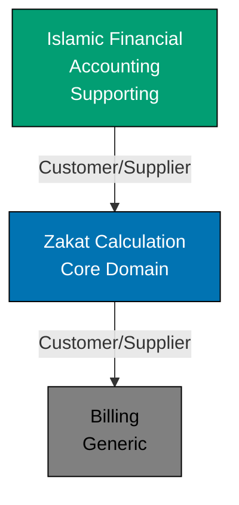

This simple diagram reveals:

- Zakat Calculation depends on Islamic Financial Accounting
- Billing depends on Zakat Calculation
- Changes to IFA may impact ZC, which may impact Billing

**2. Naming Relationship Patterns**

Using named patterns (Customer/Supplier, Conformist, Anti-Corruption Layer) creates shared vocabulary:

- "We should use an Anti-Corruption Layer for the legacy ERP integration"
- Everyone knows what this means and the trade-offs involved

**3. Acknowledging Reality**

Context Maps reflect both technical and organizational realities:

- Legacy systems that won't change
- Teams with different priorities
- Power dynamics and political constraints
- Budget and timeline limitations

**4. Guiding Integration Decisions**

Context Maps help teams choose appropriate integration strategies based on relationship patterns.

## Nine Context Mapping Patterns

DDD identifies nine canonical patterns for context relationships:

### 1. Shared Kernel

**Pattern**: Two teams share a small, carefully managed subset of the domain model. Both teams must coordinate changes to the shared code.

**When to Use**:

- Teams have very similar needs for core concepts
- Close collaboration is feasible
- Shared model is small and stable

**Trade-offs**:

- **Benefits**: Reduces duplication, ensures consistency
- **Costs**: Coordination overhead, slower changes, coupled teams

**Example: Zakat and Islamic Financial Accounting**

Both contexts need precise representations of Islamic financial concepts:

```typescript
// Shared Kernel: libs/ts-islamic-finance-primitives
export class Money {
  constructor(
    readonly amount: Decimal,
    readonly currency: Currency,
  ) {}

  add(other: Money): Money {
    if (!this.currency.equals(other.currency)) {
      throw new Error("Cannot add different currencies");
    }
    return new Money(this.amount.add(other.amount), this.currency);
  }
}

export class HijriDate {
  constructor(
    readonly year: number,
    readonly month: number,
    readonly day: number,
  ) {}

  addLunarYears(years: number): HijriDate {
    // Islamic calendar calculation
  }
}

// Both Zakat Calculation and Islamic Financial Accounting import these
```

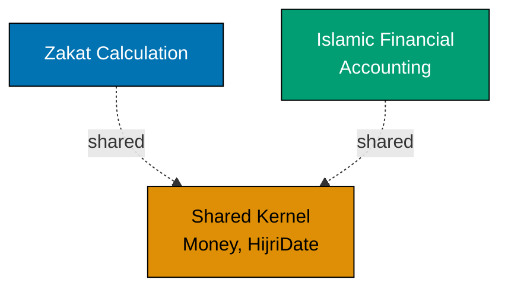

**Coordination**: Both teams must agree on changes to `Money` or `HijriDate`. Shared Kernel is versioned and changes require both teams' approval.

### 2. Customer/Supplier Development

**Pattern**: Downstream context (customer) depends on upstream context (supplier). Teams establish mutual obligations: upstream provides what downstream needs, downstream accepts what upstream can provide.

**When to Use**:

- Clear upstream/downstream relationship
- Both teams willing to collaborate
- Downstream has some influence over upstream

**Trade-offs**:

- **Benefits**: Structured collaboration, clear responsibilities
- **Costs**: Negotiation overhead, potential delays

**Example: Islamic Financial Accounting → Zakat Calculation**

Zakat Calculation (customer) needs wealth data from Islamic Financial Accounting (supplier).

```typescript
// Upstream: Islamic Financial Accounting provides Wealth Snapshot API
export interface WealthSnapshotAPI {
  getWealthSnapshot(holderId: WealthHolderId, atDate: HijriDate): WealthSnapshot;
}

export interface WealthSnapshot {
  holderId: WealthHolderId;
  snapshotDate: HijriDate;
  cashHoldings: Money;
  goldHoldings: GoldAmount;
  silverHoldings: SilverAmount;
  businessInventory: InventoryValuation;
}

// Downstream: Zakat Calculation consumes this API
class ZakatCalculationService {
  constructor(private wealthAPI: WealthSnapshotAPI) {}

  createAssessment(holderId: WealthHolderId, assessmentDate: HijriDate): ZakatAssessment {
    const snapshot = this.wealthAPI.getWealthSnapshot(holderId, assessmentDate);
    return ZakatAssessment.fromWealthSnapshot(snapshot);
  }
}
```

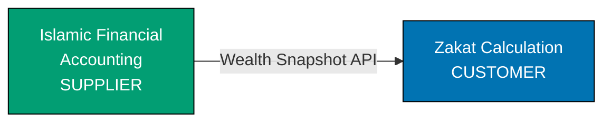

**Coordination**: Regular meetings between teams to discuss API requirements, changes, and roadmap.

### 3. Conformist

**Pattern**: Downstream context adopts the upstream model without translation. Downstream "conforms" to upstream's design.

**When to Use**:

- Upstream won't change for downstream's needs
- Upstream model is good enough for downstream
- Cost of translation layer exceeds benefit
- Teams want to reduce integration complexity

**Trade-offs**:

- **Benefits**: Simple integration, no translation layer
- **Costs**: Downstream model corrupted by upstream concerns, less domain clarity

**Example: Order Processing → Payment Gateway**

Order Processing conforms to the third-party payment gateway's model:

```typescript
// Upstream: Payment Gateway (external SaaS)
interface PaymentGatewayRequest {
  merchant_id: string;
  transaction_amount: number; // cents
  currency_code: string; // ISO 4217
  customer_email: string;
  callback_url: string;
}

// Downstream: Order Processing conforms directly
class OrderCheckoutService {
  processPayment(order: Order): void {
    // Conform to gateway's model directly
    const request: PaymentGatewayRequest = {
      merchant_id: this.config.merchantId,
      transaction_amount: order.total.toCents(),
      currency_code: order.total.currency.toISO4217(),
      customer_email: order.customerEmail,
      callback_url: this.buildCallbackUrl(order.id),
    };

    this.paymentGateway.charge(request);
  }
}
```

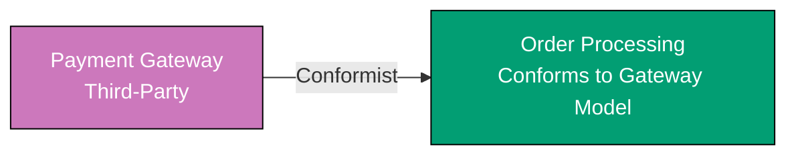

**Trade-off**: Order Processing uses the gateway's terminology (`transaction_amount`, `merchant_id`) instead of domain terms. Acceptable because payment processing is a generic subdomain.

### 4. Anti-Corruption Layer (ACL)

**Pattern**: Downstream context creates a translation layer to convert upstream's model to its own model, protecting domain purity.

**When to Use**:

- Upstream model is poor fit for downstream needs
- Downstream wants to maintain model integrity
- Integration with legacy systems
- Worth the cost of translation layer

**Trade-offs**:

- **Benefits**: Protects downstream model, isolates changes
- **Costs**: Development and maintenance of translation layer

**Example: Halal Certification → Legacy ERP**

Halal Certification integrates with legacy ERP system but maintains its own clean model:

```typescript
// Legacy ERP (upstream) - messy model
interface LegacyProductRecord {
  PROD_ID: number;
  PROD_NM: string;
  SUPP_CD: string;
  CERT_FLG: "Y" | "N" | null;
  CERT_DT: string | null; // "YYYYMMDD" format
  CERT_EXP: string | null; // "YYYYMMDD" format
}

// Anti-Corruption Layer
class LegacyERPAdapter {
  toProductSupplier(record: LegacyProductRecord): ProductSupplier {
    return new ProductSupplier(
      ProductId.fromLegacyId(record.PROD_ID),
      record.PROD_NM,
      SupplierCode.fromString(record.SUPP_CD),
    );
  }

  toHalalCertificationStatus(record: LegacyProductRecord): CertificationStatus {
    if (record.CERT_FLG !== "Y" || !record.CERT_EXP) {
      return CertificationStatus.notCertified();
    }

    const expiryDate = this.parseLegacyDate(record.CERT_EXP);
    if (expiryDate.isBefore(Date.now())) {
      return CertificationStatus.expired(expiryDate);
    }

    return CertificationStatus.certified(this.parseLegacyDate(record.CERT_DT!), expiryDate);
  }

  private parseLegacyDate(dateStr: string): Date {
    const year = parseInt(dateStr.substring(0, 4));
    const month = parseInt(dateStr.substring(4, 6)) - 1;
    const day = parseInt(dateStr.substring(6, 8));
    return new Date(year, month, day);
  }
}

// Halal Certification domain model (downstream) - clean
class Product {
  constructor(
    readonly productId: ProductId,
    readonly name: string,
    readonly supplier: Supplier,
    private certificationStatus: CertificationStatus,
  ) {}
}
```

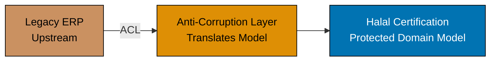

**Benefit**: Halal Certification maintains clean domain model (`ProductId`, `CertificationStatus`) despite messy legacy system.

### 5. Partnership

**Pattern**: Two teams with mutual dependencies commit to coordinating their work. Success or failure of both contexts is intertwined.

**When to Use**:

- Two contexts have tightly coupled business goals
- Both teams willing to commit to coordination
- Shared deadlines or milestones

**Trade-offs**:

- **Benefits**: Coordinated evolution, aligned goals
- **Costs**: High coordination overhead, coupled timelines

**Example: Zakat Calculation ↔ Halal Business Dashboard**

Both contexts support halal-conscious Muslims managing their wealth:

```typescript
// Zakat Calculation provides assessment data
class ZakatAssessmentAPI {
  publishAssessmentCompleted(assessment: ZakatAssessment): void {
    this.eventBus.publish(
      new ZakatAssessmentCompleted(
        assessment.id,
        assessment.wealthHolderId,
        assessment.zakatOwed,
        assessment.finalizedAt,
      ),
    );
  }
}

// Dashboard consumes and displays insights
class DashboardService {
  handleZakatAssessmentCompleted(event: ZakatAssessmentCompleted): void {
    this.updateDashboardMetrics(event.wealthHolderId, {
      lastAssessmentDate: event.finalizedAt,
      zakatOwed: event.zakatOwed,
      nextAssessmentDue: event.finalizedAt.addLunarYears(1),
    });
  }
}
```

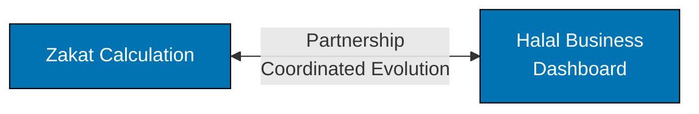

**Coordination**: Weekly sync meetings, shared sprint planning, coordinated releases.

### 6. Separate Ways

**Pattern**: No integration between contexts. Each context solves its problems independently.

**When to Use**:

- No real business need for integration
- Cost of integration exceeds benefit
- Contexts serve entirely different user groups

**Trade-offs**:

- **Benefits**: Complete independence, no coordination overhead
- **Costs**: Potential duplication, no shared data

**Example: Zakat Calculation and Employee HR**

No overlap in business concerns:

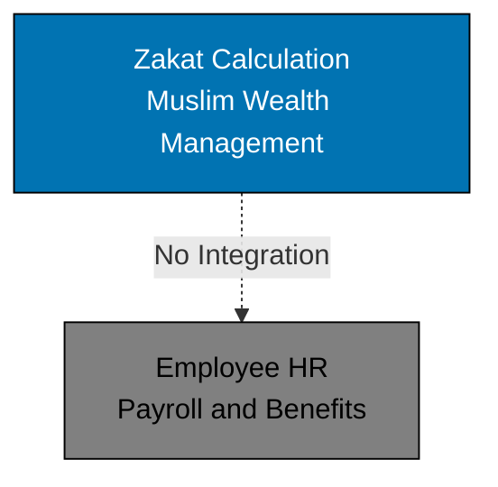

**Decision**: No integration needed. These contexts operate in entirely separate domains.

### 7. Open Host Service

**Pattern**: Upstream context defines a protocol or API as an integration standard, allowing multiple downstream contexts to integrate easily.

**When to Use**:

- Multiple downstream contexts need similar data
- Upstream wants to standardize integration
- Well-defined service boundary

**Trade-offs**:

- **Benefits**: Reusable integration, clear contract
- **Costs**: Maintaining public API, versioning complexity

**Example: Islamic Financial Accounting provides standard API**

```typescript
// Open Host Service: Public API for financial data
export class IslamicFinancialAccountingAPI {
  // REST endpoints
  @Get("/api/v1/wealth-snapshots/:holderId/:date")
  getWealthSnapshot(holderId: string, date: string): WealthSnapshotDTO {
    // ...
  }

  @Get("/api/v1/transactions/:accountId")
  getTransactions(accountId: string, query: TransactionQuery): TransactionDTO[] {
    // ...
  }
}

// Multiple downstreams integrate
class ZakatCalculationService {
  constructor(private ifaAPI: IslamicFinancialAccountingAPI) {}
}

class TaxComplianceService {
  constructor(private ifaAPI: IslamicFinancialAccountingAPI) {}
}

class AuditService {
  constructor(private ifaAPI: IslamicFinancialAccountingAPI) {}
}
```

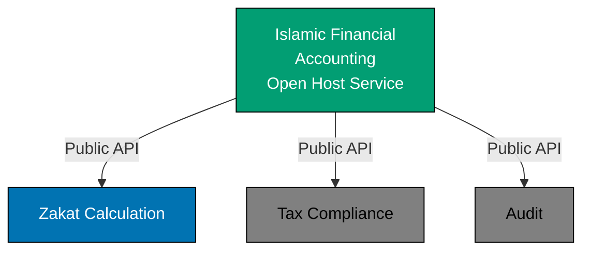

### 8. Published Language

**Pattern**: Translation between contexts uses a well-documented, shared language (often a standard data format or protocol).

**When to Use**:

- Industry standard formats exist (JSON, XML schemas)
- Multiple systems need to exchange data
- Want to leverage existing tooling

**Trade-offs**:

- **Benefits**: Standardized integration, tooling support
- **Costs**: May not perfectly fit domain model

**Example: Islamic Finance using ISO 20022 XML**

```typescript
// Published Language: ISO 20022 XML for financial messages
interface ISO20022PaymentMessage {
  groupHeader: {
    messageId: string;
    creationDateTime: string;
  };
  paymentInformation: {
    paymentMethod: string;
    debtorAccount: {
      iban: string;
    };
    creditorAccount: {
      iban: string;
    };
    instructedAmount: {
      value: number;
      currency: string;
    };
  };
}

// Translator to/from domain model
class ISO20022Translator {
  toPublishedLanguage(payment: IslamicPayment): ISO20022PaymentMessage {
    return {
      groupHeader: {
        messageId: payment.id.toString(),
        creationDateTime: payment.createdAt.toISOString(),
      },
      paymentInformation: {
        paymentMethod: "TRF", // Transfer
        debtorAccount: {
          iban: payment.sourceAccount.iban,
        },
        creditorAccount: {
          iban: payment.destinationAccount.iban,
        },
        instructedAmount: {
          value: payment.amount.value,
          currency: payment.amount.currency.code,
        },
      },
    };
  }
}
```

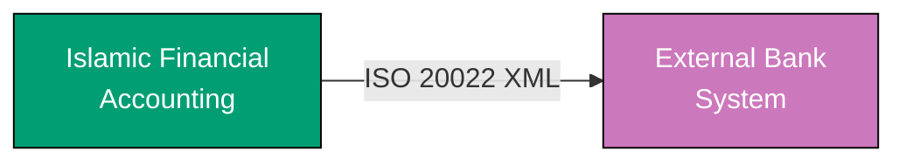

**Published Language** is often combined with **Open Host Service** or **Anti-Corruption Layer**.

### 9. Big Ball of Mud

**Pattern**: Recognition that parts of the system have unclear boundaries, tangled models, and no consistent architecture.

**When to Use** (acknowledgment, not recommendation):

- Legacy systems with organic growth
- Acknowledging reality before refactoring
- Isolating problematic areas

**Trade-offs**:

- **Benefits**: Acknowledges reality, helps plan improvements
- **Costs**: All the problems of unmaintainable code

**Example: Legacy ERP System**

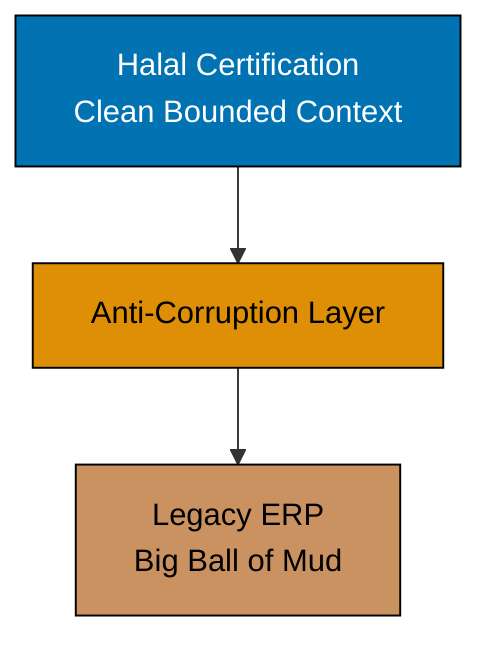

**Strategy**: Use Anti-Corruption Layer to protect clean contexts from the mud. Plan gradual extraction to new bounded contexts.

## Integration Strategy Decision Tree

Use this decision tree to choose integration patterns:

```
Integrating Context A (downstream) with Context B (upstream)

1. Do we need integration at all?
   ├─ NO → Separate Ways
   └─ YES → Continue...

2. Is upstream a legacy/external system we can't change?
   ├─ YES → Is upstream model acceptable for our domain?
   │   ├─ YES → Conformist
   │   └─ NO → Anti-Corruption Layer
   └─ NO → Continue...

3. Are both teams willing to coordinate closely?
   ├─ YES → Do teams have mutual dependencies?
   │   ├─ YES → Partnership
   │   └─ NO → Customer/Supplier Development
   └─ NO → Continue...

4. Can we share a small subset of the model?
   ├─ YES → Shared Kernel
   └─ NO → Continue...

5. Are there multiple downstream consumers?
   ├─ YES → Open Host Service (+ Published Language if standard exists)
   └─ NO → Customer/Supplier Development
```

## Example Context Map: Islamic E-Commerce Platform

Let's map an entire Islamic e-commerce system:

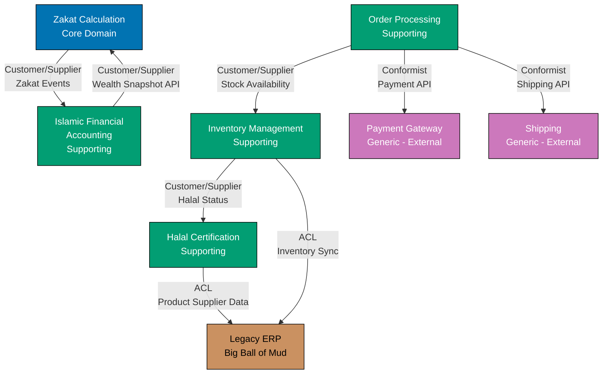

**Analysis:**

**Core Domain (Blue)**:

- **Zakat Calculation**: Competitive differentiator for Islamic finance

**Supporting Domains (Teal)**:

- **Islamic Financial Accounting**: Provides data to Zakat Calculation
- **Halal Certification**: Validates product compliance
- **Inventory Management**: Manages stock
- **Order Processing**: Orchestrates purchases

**Generic Domains (Purple/Gray)**:

- **Payment Gateway**: Third-party SaaS (Conformist)
- **Shipping**: Third-party service (Conformist)

**Legacy (Brown)**:

- **ERP System**: Big Ball of Mud, protected by ACL

**Integration Patterns**:

- **Customer/Supplier**: IFA ↔ ZC, OP → IM, IM → HC
- **Conformist**: OP → Payment/Shipping (generic subdomains)
- **ACL**: HC/IM → Legacy ERP (protect from mud)

## Drawing Context Maps

### 1. Start with Bounded Contexts

Identify all bounded contexts and their strategic classification (Core, Supporting, Generic).

### 2. Identify Relationships

For each pair of contexts, ask:

- Does Context A depend on Context B?
- What data/services does A need from B?
- How are they currently integrated (or will they be)?

### 3. Choose Patterns

Use the decision tree to select appropriate integration patterns.

### 4. Document Direction

Show upstream (supplier) and downstream (customer) clearly:

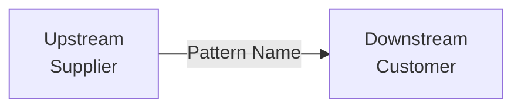

### 5. Add Annotations

Include key information:

- API names
- Event types
- Data formats
- Technology choices

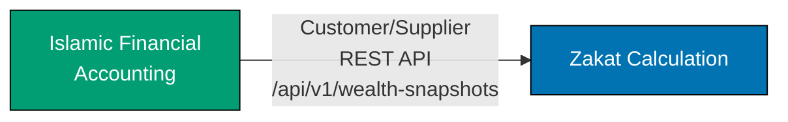

## Context Map Evolution

Context Maps are living documents that evolve as systems grow:

### Initial State: Monolith with Logical Boundaries

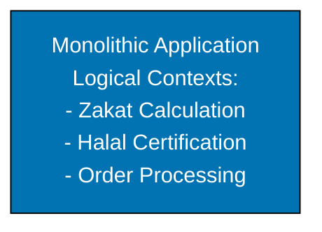

### Evolution 1: Extract Core Domain

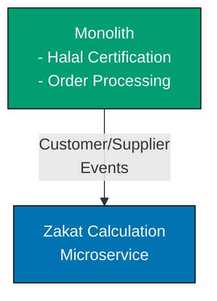

### Evolution 2: Extract Supporting Domains

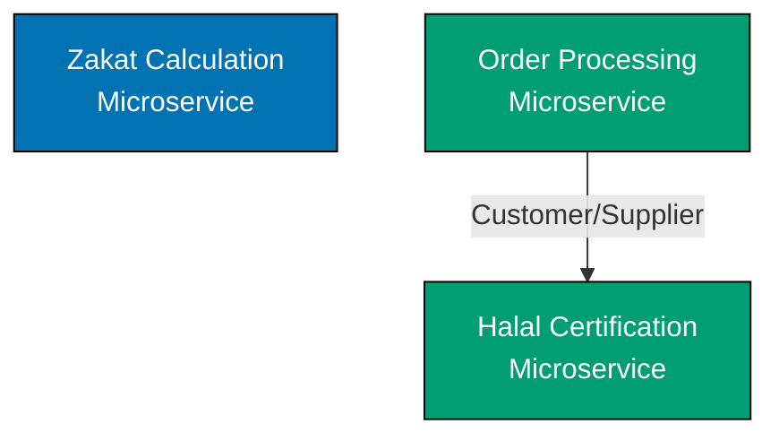

**Migration Strategy**: Start with modular monolith, extract services when scaling or team autonomy demands it.

## Common Mistakes

### 1. Over-Sharing

**Problem**: Sharing too much between contexts (large Shared Kernel).

```typescript
// ANTI-PATTERN: Shared Kernel contains entire domain model
libs/shared-domain/
  ├── zakat/
  ├── halal/
  ├── accounting/
  └── orders/
// Everything coupled!
```

**Solution**: Shared Kernel should only include essential primitives.

```typescript
// BETTER: Minimal Shared Kernel
libs/islamic-finance-primitives/
  ├── money.ts
  ├── hijri-date.ts
  └── currency.ts
// Small, stable, essential
```

### 2. Hidden Conformist

**Problem**: Claiming Customer/Supplier but actually Conformist (downstream has no influence).

**Solution**: Be honest about power dynamics. If upstream won't change, acknowledge Conformist pattern and decide if ACL is worth it.

### 3. Missing Anti-Corruption Layers

**Problem**: Allowing legacy system's poor model to corrupt clean domain models.

**Solution**: Always use ACL when integrating with legacy or external systems.

### 4. Static Context Maps

**Problem**: Drawing context map once and never updating it.

**Solution**: Review and update context maps quarterly or after major changes.

## Summary

Context Mapping makes integration between Bounded Contexts explicit and strategic:

- **Nine Patterns**: Shared Kernel, Customer/Supplier, Conformist, Anti-Corruption Layer, Partnership, Separate Ways, Open Host Service, Published Language, Big Ball of Mud
- **Decision Trees**: Systematic approach to choosing patterns
- **Visual Maps**: Diagrams showing context relationships
- **Living Documents**: Evolve maps as systems grow

Well-designed context maps help teams:

- Navigate organizational and technical realities
- Plan integration strategies
- Protect domain model integrity
- Coordinate across team boundaries

## Next Steps

- **[Subdomains](./ex-ddd__05-subdomains.md)** - Classify contexts as Core, Supporting, or Generic
- **[Strategic Design Process](./ex-ddd__06-strategic-design-process.md)** - Discover contexts and relationships through Event Storming
- **[Bounded Contexts](./ex-ddd__03-bounded-contexts.md)** - Understand the contexts being mapped
- **[Context Map Template](./ex-ddd__19-templates/context-map-diagram.md)** - Document your context maps

## References

- Eric Evans, "Domain-Driven Design" (2003) - Chapter on Context Mapping
- Vaughn Vernon, "Implementing Domain-Driven Design" (2013) - Chapters 3-4
- Vaughn Vernon, "Domain-Driven Design Distilled" (2016) - Chapter 4: Strategic Design with Context Mapping
- [Context Mapper](https://contextmapper.org/) - Tool for modeling context maps
- Michael Plöd, ["Context Mapping"](https://github.com/ddd-crew/context-mapping) - DDD Crew resources
