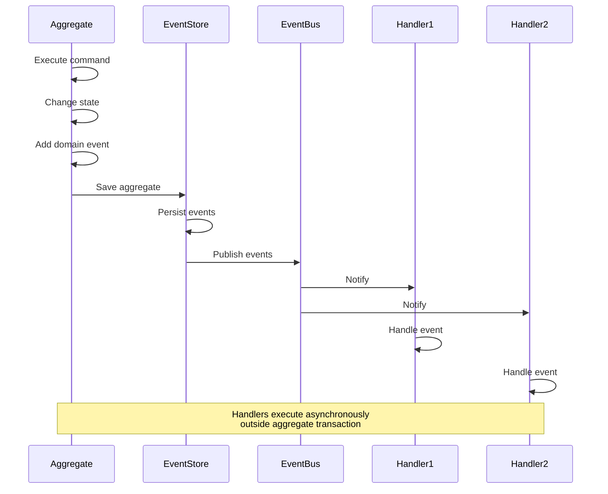

# Domain Events

## What is a Domain Event?

A **Domain Event** is an immutable record of something significant that happened in the domain. Events capture state changes, business actions, and important occurrences that domain experts care about. Domain events enable eventual consistency between aggregates and facilitate integration between bounded contexts.

**Key Characteristics:**

- **Past Tense Naming**: Event names describe what happened (e.g., `ZakatCalculated`, `ProductCertified`)
- **Immutable**: Events cannot be changed after creation
- **Timestamp**: Record when the event occurred
- **Complete Information**: Contain all data needed to understand what happened
- **Domain-Centric**: Express business occurrences, not technical events

**Example**: `ZakatCalculated` is published when a zakat assessment is finalized, capturing the assessment ID, wealth holder ID, calculated amount, and timestamp.

## Why Domain Events Matter

### The Problem: Tight Coupling Between Aggregates

Without domain events, aggregates become tightly coupled:

```typescript
// WITHOUT Domain Events: Tight coupling

class ZakatAssessment {
  constructor(
    readonly id: AssessmentId,
    private billingService: BillingService, // Direct dependency!
    private notificationService: NotificationService, // Direct dependency!
  ) {}

  finalize(nisab: NisabAmount, rate: ZakatRate): void {
    // Calculate zakat
    const zakatAmount = this.calculateZakat(nisab, rate);
    this.zakatAmount = zakatAmount;
    this.status = AssessmentStatus.Finalized;

    // Tightly coupled side effects
    this.billingService.createInvoice(this.wealthHolderId, zakatAmount); // Synchronous coupling
    this.notificationService.sendEmail(this.wealthHolderId, zakatAmount); // Synchronous coupling

    // What if billing fails? Do we rollback zakat calculation?
    // What if notification fails? Does that break finalization?
  }
}
```

**Problems:**

- **Tight Coupling**: Aggregate depends on external services
- **Synchronous Execution**: All side effects must complete before method returns
- **Transaction Scope**: Side effects inside transaction (billing, notifications)
- **Failure Handling**: One failure breaks entire operation
- **Testing Difficulty**: Must mock all dependent services
- **Violates SRP**: Aggregate handles both calculation and notifications

### The Solution: Domain Events

Domain events decouple aggregates from side effects:

```typescript
// WITH Domain Events: Loose coupling

class ZakatAssessment {
  private domainEvents: DomainEvent[] = [];

  finalize(nisab: NisabAmount, rate: ZakatRate): void {
    // Pure domain logic
    const zakatAmount = this.calculateZakat(nisab, rate);
    this.zakatAmount = zakatAmount;
    this.status = AssessmentStatus.Finalized;

    // Publish event (no coupling to handlers)
    this.addDomainEvent(new ZakatCalculated(this.id, this.wealthHolderId, zakatAmount, HijriDate.now()));
  }

  private addDomainEvent(event: DomainEvent): void {
    this.domainEvents.push(event);
  }

  popDomainEvents(): DomainEvent[] {
    const events = [...this.domainEvents];
    this.domainEvents = [];
    return events;
  }

  private calculateZakat(nisab: NisabAmount, rate: ZakatRate): Money {
    // ... calculation logic
  }
}

// Event
class ZakatCalculated {
  readonly occurredAt: HijriDate;

  constructor(
    readonly assessmentId: AssessmentId,
    readonly wealthHolderId: WealthHolderId,
    readonly zakatAmount: Money,
    readonly calculatedAt: HijriDate,
  ) {
    this.occurredAt = HijriDate.now();
  }
}

// Separate event handlers (decoupled)
class BillingEventHandler {
  async handleZakatCalculated(event: ZakatCalculated): Promise<void> {
    // Create invoice asynchronously
    await this.billingService.createInvoice(event.wealthHolderId, event.zakatAmount);
  }
}

class NotificationEventHandler {
  async handleZakatCalculated(event: ZakatCalculated): Promise<void> {
    // Send notification asynchronously
    await this.notificationService.sendEmail(event.wealthHolderId, event.zakatAmount);
  }
}
```

**Benefits:**

- **Loose Coupling**: Aggregate unaware of event handlers
- **Asynchronous Execution**: Handlers execute outside transaction
- **Failure Isolation**: Handler failures don't affect aggregate
- **Easy Testing**: Test aggregate without mocking handlers
- **Extensibility**: Add new handlers without modifying aggregate
- **Audit Trail**: Events provide complete history

## Domain Event Design Principles

### 1. Past Tense Naming

**Rule:** Event names must be past tense, describing what happened.

**Why?** Events are facts - immutable records of occurrences.

**Correct Naming:**

```typescript
// CORRECT: Past tense
class ZakatCalculated {
  // "Calculated" indicates completed action
}

class ProductCertified {
  // "Certified" indicates completed action
}

class ContractApproved {
  // "Approved" indicates completed action
}

class RibaDetected {
  // "Detected" indicates completed action
}

class AssessmentFinalized {
  // "Finalized" indicates completed action
}
```

**Incorrect Naming:**

```typescript
// WRONG: Present tense
class CalculateZakat {} // Sounds like a command

// WRONG: Imperative
class ApproveContract {} // Sounds like a command

// WRONG: Gerund
class CalculatingZakat {} // Sounds like ongoing action
```

### 2. Immutability

**Rule:** Events must be immutable. Once created, they cannot be changed.

**Why?** Events are historical facts. Changing history is dangerous.

```typescript
class ZakatCalculated {
  // All fields readonly
  constructor(
    readonly assessmentId: AssessmentId,
    readonly wealthHolderId: WealthHolderId,
    readonly zakatAmount: Money,
    readonly calculatedAt: HijriDate,
  ) {
    Object.freeze(this); // Enforce immutability
  }
}

// Usage
const event = new ZakatCalculated(assessmentId, wealthHolderId, Money.usd(250), HijriDate.now());

// Cannot modify
event.zakatAmount = Money.usd(300); // Compile error! Property is readonly
```

### 3. Complete Information

**Rule:** Events must contain all information needed to understand what happened.

**Why?** Event consumers should not need to query for additional context.

**Anti-Pattern: Insufficient Data**

```typescript
// ANTI-PATTERN: Incomplete event
class ZakatCalculated {
  constructor(readonly assessmentId: AssessmentId) {} // Only ID - not enough!
}

// Consumer must query for more info
class BillingEventHandler {
  async handleZakatCalculated(event: ZakatCalculated): Promise<void> {
    // Must query repository to get amount - inefficient!
    const assessment = await this.assessmentRepo.findById(event.assessmentId);
    const zakatAmount = assessment.zakatAmount;
    // ...
  }
}
```

**Correct: Complete Information**

```typescript
// CORRECT: All needed information in event
class ZakatCalculated {
  constructor(
    readonly assessmentId: AssessmentId,
    readonly wealthHolderId: WealthHolderId,
    readonly zakatAmount: Money, // Include amount
    readonly totalWealth: Money, // Include wealth
    readonly nisabThreshold: NisabAmount, // Include nisab
    readonly calculatedAt: HijriDate, // Include timestamp
  ) {
    Object.freeze(this);
  }
}

// Consumer has all needed data
class BillingEventHandler {
  async handleZakatCalculated(event: ZakatCalculated): Promise<void> {
    // All data available - no query needed
    await this.billingService.createInvoice(event.wealthHolderId, event.zakatAmount);
  }
}
```

**Balance:** Include enough data for most consumers, but avoid bloating events with excessive detail.

### 4. Timestamp

**Rule:** Events must record when they occurred.

```typescript
class ZakatCalculated {
  readonly occurredAt: HijriDate; // When event happened

  constructor(
    readonly assessmentId: AssessmentId,
    readonly wealthHolderId: WealthHolderId,
    readonly zakatAmount: Money,
  ) {
    this.occurredAt = HijriDate.now(); // Auto-timestamp
    Object.freeze(this);
  }
}
```

**Benefits:**

- Temporal queries (events before/after date)
- Event ordering
- Audit trails
- Debugging

### 5. Single Responsibility

**Rule:** Each event represents one business occurrence.

**Anti-Pattern: Multi-Purpose Event**

```typescript
// ANTI-PATTERN: Event doing too much
class AssessmentUpdated {
  constructor(
    readonly assessmentId: AssessmentId,
    readonly action: "FINALIZED" | "DECLARATION_ADDED" | "DELETED", // Multiple meanings!
    readonly data: any, // Unclear payload
  ) {}
}
```

**Correct: Specific Events**

```typescript
// CORRECT: Specific events for specific occurrences
class ZakatCalculated {
  constructor(
    readonly assessmentId: AssessmentId,
    readonly zakatAmount: Money,
  ) {}
}

class WealthDeclared {
  constructor(
    readonly assessmentId: AssessmentId,
    readonly wealthType: WealthType,
    readonly amount: Money,
  ) {}
}

class AssessmentDeleted {
  constructor(readonly assessmentId: AssessmentId) {}
}
```

## Domain Event Lifecycle



**Note**: This diagram uses WCAG AA-compliant colors. See [Color Palette Template](./templates/ex-sode-dodrdedd-te__color-palette.md).

**Lifecycle Steps:**

1. **Command Execution**: Aggregate executes business operation
2. **State Change**: Aggregate state updated
3. **Event Creation**: Aggregate creates domain event
4. **Event Storage**: Event added to aggregate's event collection
5. **Aggregate Persistence**: Aggregate saved (including events)
6. **Event Publishing**: Events published to event bus
7. **Handler Notification**: Event bus notifies registered handlers
8. **Handler Execution**: Handlers process event asynchronously

## Event Publishing Patterns

### Pattern 1: Aggregate-Collected Events

Events stored in aggregate, published after persistence:

```typescript
// Aggregate with event collection
class ZakatAssessment {
  private domainEvents: DomainEvent[] = [];

  finalize(nisab: NisabAmount, rate: ZakatRate): void {
    // Business logic
    const zakatAmount = this.calculateZakat(nisab, rate);
    this.zakatAmount = zakatAmount;
    this.status = AssessmentStatus.Finalized;

    // Add event
    this.addDomainEvent(new ZakatCalculated(this.id, this.wealthHolderId, zakatAmount, HijriDate.now()));
  }

  private addDomainEvent(event: DomainEvent): void {
    this.domainEvents.push(event);
  }

  // Retrieve and clear events
  popDomainEvents(): DomainEvent[] {
    const events = [...this.domainEvents];
    this.domainEvents = [];
    return events;
  }
}

// Application service publishes events
class ZakatApplicationService {
  constructor(
    private assessmentRepo: ZakatAssessmentRepository,
    private eventBus: EventBus,
  ) {}

  async finalizeAssessment(assessmentId: AssessmentId): Promise<void> {
    const assessment = await this.assessmentRepo.findById(assessmentId);

    assessment.finalize(NisabAmount.goldStandard(), ZakatRate.standard());

    // Save aggregate
    await this.assessmentRepo.save(assessment);

    // Publish events AFTER successful save
    const events = assessment.popDomainEvents();
    for (const event of events) {
      await this.eventBus.publish(event);
    }
  }
}
```

**Benefits:**

- Events tied to aggregate lifecycle
- Events only published after successful persistence
- Transaction-safe

**Drawbacks:**

- Application service must remember to publish events
- Events lost if publishing forgotten

### Pattern 2: Repository Auto-Publishing

Repository automatically publishes events on save:

```typescript
class ZakatAssessmentRepository {
  constructor(
    private db: Database,
    private eventBus: EventBus,
  ) {}

  async save(assessment: ZakatAssessment): Promise<void> {
    await this.db.transaction(async (tx) => {
      // Save aggregate
      await this.persistAggregate(tx, assessment);

      // Auto-publish events
      const events = assessment.popDomainEvents();
      for (const event of events) {
        await this.eventBus.publish(event); // Published within transaction
      }
    });
  }

  private async persistAggregate(tx: Transaction, assessment: ZakatAssessment): Promise<void> {
    // Database persistence logic
  }
}
```

**Benefits:**

- Automatic - no manual publishing needed
- Consistent - events always published

**Drawbacks:**

- Repository has event publishing responsibility (coupling)
- Events published inside transaction (may be undesirable)

### Pattern 3: Event Sourcing

Aggregates reconstructed from events, events are source of truth:

```typescript
// Event-sourced aggregate
class ZakatAssessment {
  private uncommittedEvents: DomainEvent[] = [];

  // Reconstruct from events
  static fromHistory(events: DomainEvent[]): ZakatAssessment {
    const assessment = new ZakatAssessment();

    for (const event of events) {
      assessment.apply(event);
    }

    return assessment;
  }

  finalize(nisab: NisabAmount, rate: ZakatRate): void {
    const zakatAmount = this.calculateZakat(nisab, rate);

    const event = new ZakatCalculated(this.id, this.wealthHolderId, zakatAmount, HijriDate.now());

    // Apply event to update state
    this.apply(event);

    // Store for persistence
    this.uncommittedEvents.push(event);
  }

  private apply(event: DomainEvent): void {
    if (event instanceof ZakatCalculated) {
      this.zakatAmount = event.zakatAmount;
      this.status = AssessmentStatus.Finalized;
    } else if (event instanceof WealthDeclared) {
      this.declarations.push(new WealthDeclaration(event.wealthType, event.amount));
    }
    // ... other event types
  }

  getUncommittedEvents(): DomainEvent[] {
    return [...this.uncommittedEvents];
  }

  markEventsAsCommitted(): void {
    this.uncommittedEvents = [];
  }
}

// Event-sourced repository
class EventSourcedZakatAssessmentRepository {
  async save(assessment: ZakatAssessment): Promise<void> {
    const events = assessment.getUncommittedEvents();

    // Persist events
    await this.eventStore.appendEvents(assessment.id.toString(), events);

    // Publish events
    for (const event of events) {
      await this.eventBus.publish(event);
    }

    assessment.markEventsAsCommitted();
  }

  async findById(id: AssessmentId): Promise<ZakatAssessment | null> {
    const events = await this.eventStore.getEvents(id.toString());

    if (events.length === 0) return null;

    return ZakatAssessment.fromHistory(events);
  }
}
```

**Benefits:**

- Complete audit trail
- Temporal queries (state at any point in time)
- Events naturally published

**Drawbacks:**

- More complex
- Requires event store infrastructure
- Performance considerations (event replay)

## Event Handler Patterns

### Pattern 1: Synchronous Handler (In-Process)

Handler executes synchronously in same process:

```typescript
class BillingEventHandler {
  constructor(private billingService: BillingService) {}

  async handleZakatCalculated(event: ZakatCalculated): Promise<void> {
    // Create invoice
    await this.billingService.createInvoice(event.wealthHolderId, event.zakatAmount);

    console.log(`Invoice created for ${event.wealthHolderId}`);
  }
}

// Event bus dispatches to handler
class InProcessEventBus {
  private handlers: Map<string, Function[]> = new Map();

  subscribe<T extends DomainEvent>(eventType: new (...args: any[]) => T, handler: (event: T) => Promise<void>): void {
    const eventName = eventType.name;
    const existingHandlers = this.handlers.get(eventName) ?? [];
    this.handlers.set(eventName, [...existingHandlers, handler]);
  }

  async publish(event: DomainEvent): Promise<void> {
    const eventName = event.constructor.name;
    const handlers = this.handlers.get(eventName) ?? [];

    // Execute handlers sequentially
    for (const handler of handlers) {
      await handler(event);
    }
  }
}

// Registration
const eventBus = new InProcessEventBus();
const billingHandler = new BillingEventHandler(billingService);

eventBus.subscribe(ZakatCalculated, (event) => billingHandler.handleZakatCalculated(event));
```

**Benefits:**

- Simple implementation
- Immediate execution
- Easy debugging

**Drawbacks:**

- Tightly coupled to process
- No durability (events lost on crash)
- Blocking (slow handlers delay response)

### Pattern 2: Asynchronous Handler (Message Queue)

Handler executes asynchronously via message queue:

```typescript
class ZakatCalculatedHandler {
  async handle(event: ZakatCalculated): Promise<void> {
    // Process event from queue
    await this.billingService.createInvoice(event.wealthHolderId, event.zakatAmount);
  }
}

// Event published to message queue
class MessageQueueEventBus {
  constructor(private messageQueue: MessageQueue) {}

  async publish(event: DomainEvent): Promise<void> {
    // Serialize event
    const message = JSON.stringify(event);

    // Publish to queue
    await this.messageQueue.send(event.constructor.name, message);
  }
}

// Separate process consumes from queue
class EventConsumer {
  constructor(
    private messageQueue: MessageQueue,
    private handlers: Map<string, Function>,
  ) {}

  async start(): Promise<void> {
    this.messageQueue.subscribe("ZakatCalculated", async (message) => {
      const event = JSON.parse(message);
      const handler = this.handlers.get("ZakatCalculated");

      if (handler) {
        await handler(event);
      }
    });
  }
}
```

**Benefits:**

- Asynchronous (non-blocking)
- Durable (events persisted in queue)
- Scalable (multiple consumers)
- Fault-tolerant (retries)

**Drawbacks:**

- More complex infrastructure
- Eventual consistency
- Debugging across processes

### Pattern 3: Event Store Subscription

Handler subscribes to event store:

```typescript
class EventStoreSubscription {
  constructor(
    private eventStore: EventStore,
    private handler: EventHandler,
  ) {}

  async start(): Promise<void> {
    // Subscribe to new events
    this.eventStore.subscribeToAll(async (event: DomainEvent) => {
      await this.handler.handle(event);
    });
  }
}

// Event handler
class ZakatBillingProjection {
  async handle(event: DomainEvent): Promise<void> {
    if (event instanceof ZakatCalculated) {
      await this.createInvoice(event);
    }
  }

  private async createInvoice(event: ZakatCalculated): Promise<void> {
    // Create billing invoice from event
  }
}
```

**Benefits:**

- Decoupled from publisher
- Can replay events
- Supports projections

## Common Domain Events in Islamic Finance

### Zakat Domain Events

```typescript
class ZakatCalculated {
  constructor(
    readonly assessmentId: AssessmentId,
    readonly wealthHolderId: WealthHolderId,
    readonly zakatAmount: Money,
    readonly totalWealth: Money,
    readonly nisabThreshold: NisabAmount,
    readonly calculatedAt: HijriDate,
  ) {
    Object.freeze(this);
  }
}

class WealthDeclared {
  constructor(
    readonly assessmentId: AssessmentId,
    readonly declarationId: WealthDeclarationId,
    readonly wealthType: WealthType,
    readonly amount: Money,
    readonly acquiredDate: HijriDate,
  ) {
    Object.freeze(this);
  }
}

class AssessmentCreated {
  constructor(
    readonly assessmentId: AssessmentId,
    readonly wealthHolderId: WealthHolderId,
    readonly assessmentYear: number,
    readonly createdAt: HijriDate,
  ) {
    Object.freeze(this);
  }
}

class NisabThresholdMet {
  constructor(
    readonly assessmentId: AssessmentId,
    readonly totalWealth: Money,
    readonly nisabThreshold: NisabAmount,
  ) {
    Object.freeze(this);
  }
}
```

### Halal Certification Events

```typescript
class ProductCertified {
  constructor(
    readonly certificationId: CertificationId,
    readonly productId: ProductId,
    readonly authority: CertificationAuthority,
    readonly issuedDate: HijriDate,
    readonly expiryDate: HijriDate,
  ) {
    Object.freeze(this);
  }
}

class CertificationExpired {
  constructor(
    readonly certificationId: CertificationId,
    readonly productId: ProductId,
    readonly expiredDate: HijriDate,
  ) {
    Object.freeze(this);
  }
}

class CertificationRevoked {
  constructor(
    readonly certificationId: CertificationId,
    readonly productId: ProductId,
    readonly reason: string,
    readonly revokedAt: HijriDate,
  ) {
    Object.freeze(this);
  }
}
```

### Islamic Finance Events

```typescript
class TransactionApplied {
  constructor(
    readonly transactionId: TransactionId,
    readonly accountId: AccountId,
    readonly amount: Money,
    readonly type: TransactionType,
    readonly appliedAt: HijriDate,
  ) {
    Object.freeze(this);
  }
}

class RibaDetected {
  constructor(
    readonly transactionId: TransactionId,
    readonly accountId: AccountId,
    readonly detectionReason: string,
    readonly detectedAt: HijriDate,
  ) {
    Object.freeze(this);
  }
}

class ContractApproved {
  constructor(
    readonly contractId: ContractId,
    readonly contractType: "MURABAHA" | "MUSHARAKA" | "MUDARABA",
    readonly parties: string[],
    readonly approvedAt: HijriDate,
  ) {
    Object.freeze(this);
  }
}
```

## Functional Programming Perspective

FP represents events as plain immutable data:

```typescript
// FP-style: Plain immutable record
type ZakatCalculated = {
  readonly eventType: "ZakatCalculated";
  readonly assessmentId: AssessmentId;
  readonly wealthHolderId: WealthHolderId;
  readonly zakatAmount: Money;
  readonly calculatedAt: HijriDate;
  readonly occurredAt: HijriDate;
};

// Factory function
function zakatCalculated(
  assessmentId: AssessmentId,
  wealthHolderId: WealthHolderId,
  zakatAmount: Money,
  calculatedAt: HijriDate,
): ZakatCalculated {
  return Object.freeze({
    eventType: "ZakatCalculated",
    assessmentId,
    wealthHolderId,
    zakatAmount,
    calculatedAt,
    occurredAt: HijriDate.now(),
  });
}

// Event handler as pure function
type EventHandler<E> = (event: E) => IO<void>;

const handleZakatCalculated: EventHandler<ZakatCalculated> = (event) => async () => {
  // Side effect wrapped in IO
  await billingService.createInvoice(event.wealthHolderId, event.zakatAmount);
};

// Aggregate produces events
function finalizeAssessment(
  assessment: ZakatAssessment,
  nisab: NisabAmount,
  rate: ZakatRate,
): [ZakatAssessment, ZakatCalculated[]] {
  const zakatAmount = calculateZakat(assessment.totalWealth, nisab, rate);

  const updatedAssessment = {
    ...assessment,
    zakatAmount,
    status: AssessmentStatus.Finalized,
  };

  const event = zakatCalculated(assessment.id, assessment.wealthHolderId, zakatAmount, HijriDate.now());

  return [updatedAssessment, [event]];
}
```

**FP Benefits:**

- Events are plain data (no classes)
- Handlers are pure functions
- Explicit effects (IO type)
- Easy to test

See [DDD and Functional Programming](./ex-sode-dodrdedd__14-ddd-and-functional-programming.md) for comprehensive FP patterns.

## Testing Domain Events

### Testing Event Creation

```typescript
describe("ZakatAssessment Domain Events", () => {
  it("should publish ZakatCalculated event when finalized", () => {
    // Arrange
    const assessment = ZakatAssessment.create(wealthHolderId);
    assessment.addDeclaration(WealthType.Cash, Money.usd(10000));

    // Act
    assessment.finalize(NisabAmount.goldStandard(), ZakatRate.standard());

    // Assert
    const events = assessment.popDomainEvents();
    expect(events).toHaveLength(1);
    expect(events[0]).toBeInstanceOf(ZakatCalculated);
    expect((events[0] as ZakatCalculated).zakatAmount.amount).toBe(250);
  });

  it("should include all necessary data in event", () => {
    // Arrange
    const assessment = ZakatAssessment.create(wealthHolderId);
    assessment.addDeclaration(WealthType.Cash, Money.usd(10000));

    // Act
    assessment.finalize(NisabAmount.goldStandard(), ZakatRate.standard());

    // Assert
    const events = assessment.popDomainEvents();
    const event = events[0] as ZakatCalculated;

    expect(event.assessmentId).toBeDefined();
    expect(event.wealthHolderId).toBeDefined();
    expect(event.zakatAmount).toBeDefined();
    expect(event.calculatedAt).toBeDefined();
  });
});
```

### Testing Event Handlers

```typescript
describe("BillingEventHandler", () => {
  let handler: BillingEventHandler;
  let mockBillingService: BillingService;

  beforeEach(() => {
    mockBillingService = {
      createInvoice: jest.fn(),
    } as any;

    handler = new BillingEventHandler(mockBillingService);
  });

  it("should create invoice when ZakatCalculated event received", async () => {
    // Arrange
    const event = new ZakatCalculated(assessmentId, wealthHolderId, Money.usd(250), HijriDate.now());

    // Act
    await handler.handleZakatCalculated(event);

    // Assert
    expect(mockBillingService.createInvoice).toHaveBeenCalledWith(wealthHolderId, Money.usd(250));
  });
});
```

## Common Mistakes

### 1. Command Names for Events

**Problem:** Naming events as commands (imperative).

```typescript
// ANTI-PATTERN: Command naming
class CalculateZakat {} // Sounds like a command
class FinalizeAssessment {} // Sounds like a command
```

**Solution:** Use past tense.

```typescript
// CORRECT: Past tense
class ZakatCalculated {}
class AssessmentFinalized {}
```

### 2. Mutable Events

**Problem:** Allowing event modification.

```typescript
// ANTI-PATTERN: Mutable event
class ZakatCalculated {
  constructor(public zakatAmount: Money) {} // Mutable!
}

const event = new ZakatCalculated(Money.usd(250));
event.zakatAmount = Money.usd(300); // Changed history!
```

**Solution:** Make immutable.

```typescript
// CORRECT: Immutable
class ZakatCalculated {
  constructor(readonly zakatAmount: Money) {
    Object.freeze(this);
  }
}
```

### 3. Insufficient Event Data

**Problem:** Events lacking context.

```typescript
// ANTI-PATTERN: Minimal data
class ZakatCalculated {
  constructor(readonly assessmentId: AssessmentId) {} // Only ID
}
```

**Solution:** Include complete data.

```typescript
// CORRECT: Complete data
class ZakatCalculated {
  constructor(
    readonly assessmentId: AssessmentId,
    readonly wealthHolderId: WealthHolderId,
    readonly zakatAmount: Money,
    readonly totalWealth: Money,
  ) {}
}
```

### 4. Forgetting to Publish Events

**Problem:** Events created but not published.

```typescript
// ANTI-PATTERN: Forgot to publish
async finalizeAssessment(id: AssessmentId): Promise<void> {
  const assessment = await this.repo.findById(id);
  assessment.finalize(nisab, rate);
  await this.repo.save(assessment);
  // Forgot: assessment.popDomainEvents() and publish!
}
```

**Solution:** Always publish after save.

```typescript
// CORRECT: Publish events
async finalizeAssessment(id: AssessmentId): Promise<void> {
  const assessment = await this.repo.findById(id);
  assessment.finalize(nisab, rate);
  await this.repo.save(assessment);

  const events = assessment.popDomainEvents();
  for (const event of events) {
    await this.eventBus.publish(event);
  }
}
```

## Introduction to Event Sourcing

**Event Sourcing** is an advanced pattern where events are the source of truth:

**Traditional Persistence:**

- Store current state
- Overwrite on updates
- No history

**Event Sourcing:**

- Store all events
- Reconstruct state by replaying events
- Complete history

**Benefits:**

- Full audit trail
- Temporal queries (state at any point in time)
- Event replay for debugging
- Natural fit with CQRS

**Drawbacks:**

- More complex
- Eventual consistency
- Schema evolution challenges
- Performance (event replay)

**When to Use:**

- Audit requirements critical
- Temporal queries needed
- Event-driven architecture
- CQRS already in use

See specialized Event Sourcing resources for comprehensive coverage. DDD with event sourcing is an advanced topic beyond this guide's scope.

## Summary

Domain events capture significant business occurrences:

- **Past Tense**: Event names describe what happened
- **Immutable**: Events cannot be changed
- **Complete Data**: Include all context needed
- **Timestamp**: Record when event occurred
- **Decoupling**: Enable loose coupling between aggregates

**Benefits:**

- Eventual consistency between aggregates
- Integration between bounded contexts
- Audit trails
- Extensibility (new handlers without changing aggregates)
- Event-driven architecture

## Next Steps

- **[Aggregates](./ex-sode-dodrdedd__09-aggregates.md)** - Understand what publishes events
- **[Domain Services](./ex-sode-dodrdedd__11-domain-services.md)** - Services responding to events
- **[Bounded Contexts](./ex-sode-dodrdedd__03-bounded-contexts.md)** - Integration via events
- **[Context Mapping](./ex-sode-dodrdedd__04-context-mapping.md)** - Event publishing patterns
- **[DDD and Functional Programming](./ex-sode-dodrdedd__14-ddd-and-functional-programming.md)** - FP-style events
- **[Domain Event Catalog Template](./templates/ex-sode-dodrdedd-te__domain-event-catalog.md)** - Document your events

## References

- Vaughn Vernon, "Implementing Domain-Driven Design" (2013) - Chapter 8: Domain Events
- Martin Fowler, ["Event Sourcing"](https://martinfowler.com/eaaDev/EventSourcing.html)
- Udi Dahan, ["Domain Events - Salvation"](https://udidahan.com/2009/06/14/domain-events-salvation/)
- Greg Young, ["CQRS and Event Sourcing"](https://cqrs.files.wordpress.com/2010/11/cqrs_documents.pdf)
