# DDD and C4 Integration

## Overview

Domain-Driven Design (DDD) and the C4 Model are complementary approaches: DDD provides patterns for modeling complex domains, while C4 provides a visual language for documenting software architecture. When combined, they create a powerful framework for both designing and communicating system architecture.

This document shows how to map DDD concepts to C4 levels, visualize bounded contexts, aggregates, and domain events using C4 diagrams, and integrate DDD documentation with C4 architecture models.

**Key Mappings:**

- **System Context** ↔ DDD Context Maps (external systems)
- **Container** ↔ DDD Bounded Contexts (deployable units)
- **Component** ↔ DDD Aggregates (internal structure)
- **Dynamic** ↔ DDD Domain Events (behavior over time)

## C4 Model Quick Recap

The C4 Model provides four levels of architectural diagrams:

1. **System Context**: System and external actors
2. **Container**: Applications, databases, message queues
3. **Component**: Internal structure of containers
4. **Code**: Classes, interfaces (rarely used, code itself is better documentation)

**Benefits**:

- Progressive disclosure (zoom in from context to code)
- Standardized notation
- Tool-agnostic (Mermaid, PlantUML, Structurizr)
- Easy to understand for non-technical stakeholders

See [C4 Architecture Model Documentation](../c4-architecture-model/README.md) for comprehensive C4 guidance.

## Mapping DDD to C4 Levels

### Level 1: System Context ↔ Context Maps

**C4 System Context** shows the system and its external dependencies.

**DDD Context Maps** show bounded contexts and their integration patterns.

**Integration**: Use System Context to visualize external systems that integrate with your bounded contexts.

**Example: Zakat Calculation System Context**

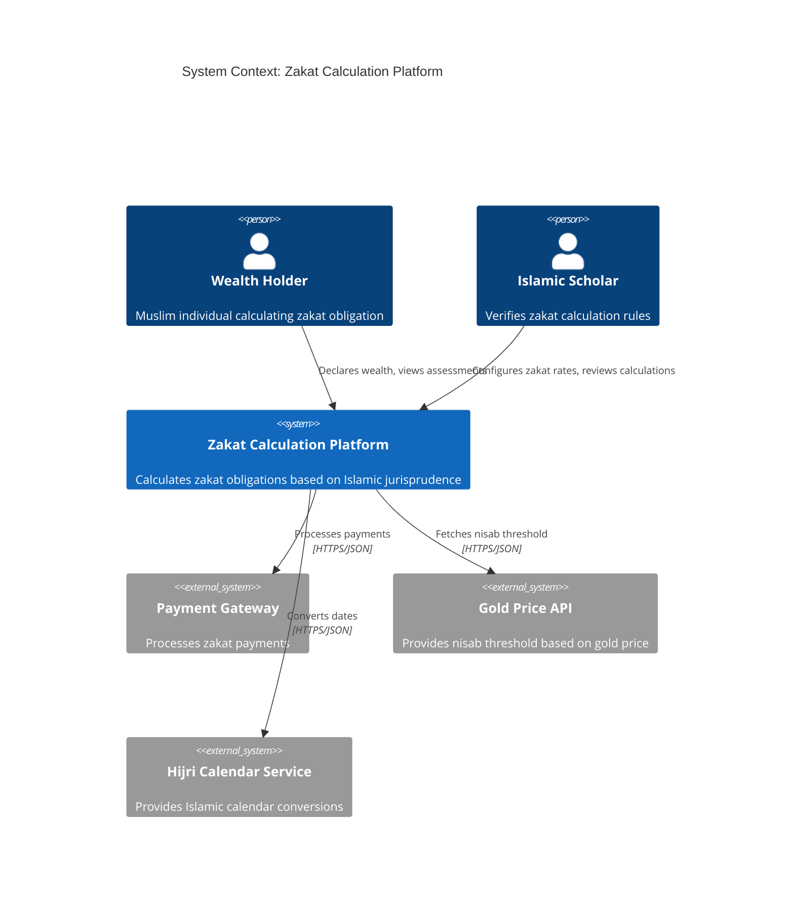

**DDD Context Map Equivalent**:

- **Zakat Calculation** (Core Domain) integrates with:
  - **Payment Processing** (Generic, Conformist relationship)
  - **Commodity Pricing** (Generic, Customer/Supplier)
  - **Calendar Services** (Generic, Published Language)

### Level 2: Container ↔ Bounded Contexts

**C4 Container** shows applications, databases, and services that make up the system.

**DDD Bounded Contexts** define boundaries around cohesive domain models.

**Integration**: Each bounded context typically maps to one or more containers (app + database).

**Example: Zakat Calculation Containers (Bounded Contexts)**

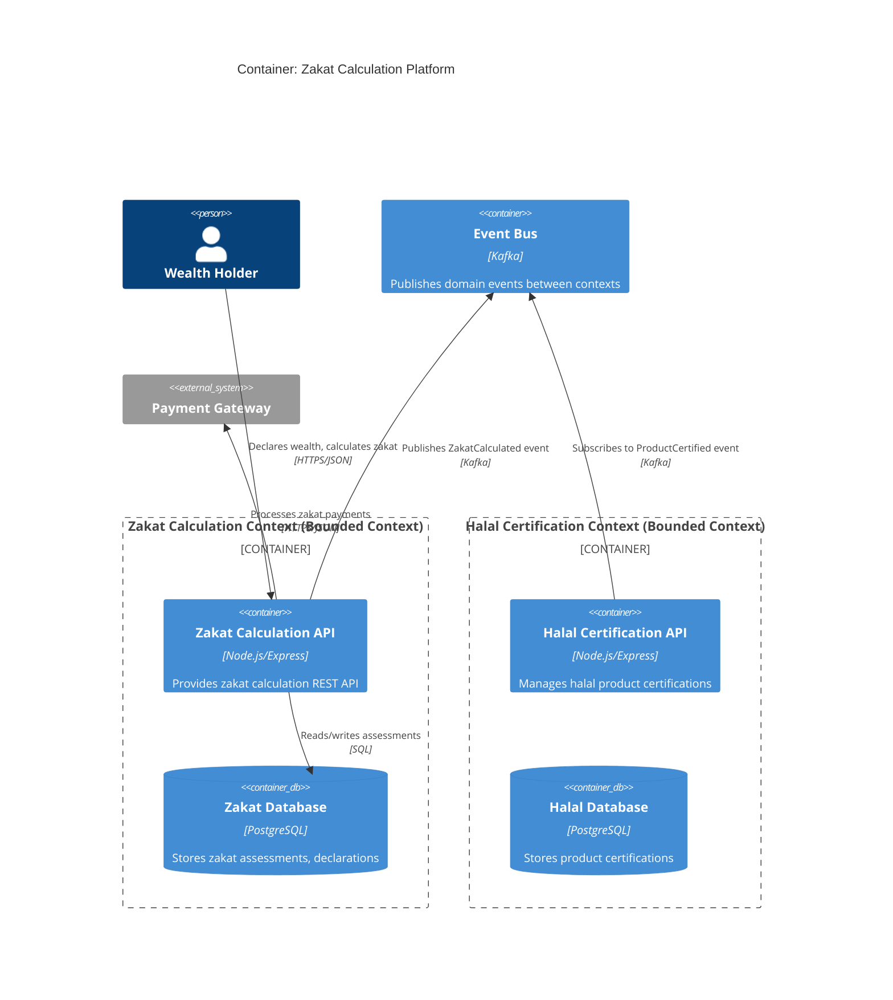

**DDD Bounded Context Mapping**:

- **Zakat Calculation Context**: `zakatAPI` + `zakatDB`
- **Halal Certification Context**: `halalAPI` + `halalDB`
- **Shared Kernel**: `eventBus` (domain events)

**Key Insight**: Bounded contexts are deployment boundaries. Microservices architecture = one bounded context per service.

### Level 3: Component ↔ Aggregates

**C4 Component** shows internal structure of a container.

**DDD Aggregates** are consistency boundaries within bounded contexts.

**Integration**: Components map to aggregates, value objects, domain services, and repositories.

**Example: Zakat Calculation API Components**

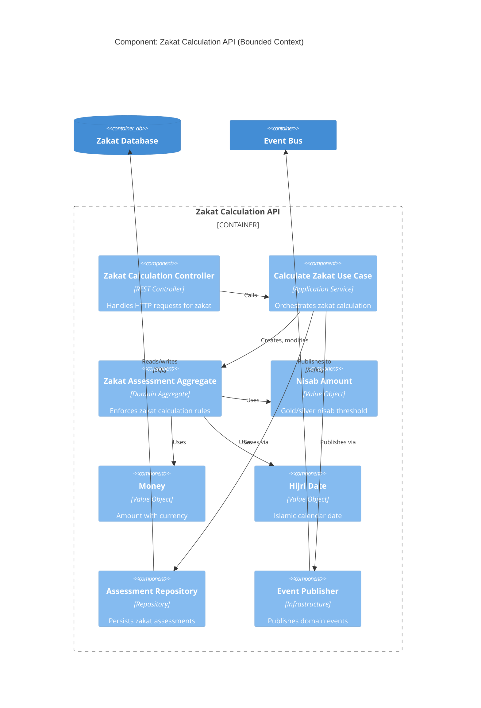

**DDD Aggregate Mapping**:

- **Zakat Assessment Aggregate** (root): `assessmentAggregate`
- **Value Objects**: `nisabVO`, `moneyVO`, `hijriDateVO`
- **Repository**: `assessmentRepo`
- **Application Service**: `calculateUseCase`
- **Presentation**: `zakatController`

**Key Insight**: Aggregates are the core components within a bounded context. They enforce business rules and invariants.

### Level 4: Dynamic ↔ Domain Events

**C4 Dynamic** (Sequence Diagrams) show runtime behavior.

**DDD Domain Events** capture business occurrences.

**Integration**: Use sequence diagrams to show how domain events flow between aggregates and bounded contexts.

**Example: Zakat Calculation Flow with Domain Events**

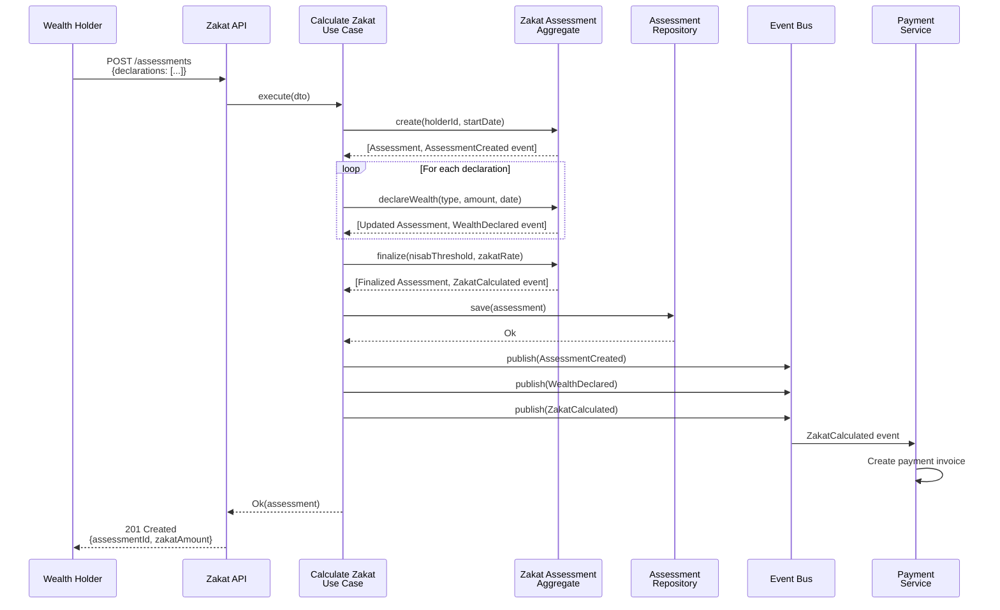

**Domain Events**:

1. **AssessmentCreated**: Assessment initialized
2. **WealthDeclared**: Wealth declaration added
3. **ZakatCalculated**: Zakat amount finalized

**Key Insight**: Domain events enable eventual consistency between aggregates and bounded contexts.

## DDD Patterns in C4 Diagrams

### Bounded Context Canvas ↔ C4 Container

**Bounded Context Canvas** (DDD tool) documents:

- Name, description, strategic classification
- Ubiquitous language terms
- Business decisions and rules
- Key aggregates, entities, value objects
- Inbound/outbound dependencies

**C4 Container Diagram** visualizes:

- Containers (apps, databases)
- Integration points
- Technologies

**Integration**: Use Bounded Context Canvas as specification, C4 Container Diagram as visualization.

**Example**:

```markdown
# Bounded Context: Zakat Calculation

**Strategic Classification**: Core Domain

**Description**: Calculates zakat obligations based on Islamic jurisprudence rules.

**Ubiquitous Language**:

- Zakat: Islamic almsgiving obligation
- Nisab: Minimum wealth threshold for zakat obligation
- Hawl: Lunar year period for wealth assessment

**Key Aggregates**:

- ZakatAssessment (root)

**Value Objects**:

- Money, HijriDate, NisabAmount, ZakatRate

**Inbound Dependencies**:

- Wealth Holder (declares wealth via API)

**Outbound Dependencies**:

- Payment Processing (via ZakatCalculated event)
- Gold Price API (fetches nisab threshold)
```

**C4 Container Diagram** (from earlier) visualizes this bounded context.

### Context Map ↔ C4 System Context + Container

**DDD Context Map** shows integration patterns:

- Shared Kernel
- Customer/Supplier
- Conformist
- Partnership
- Anti-Corruption Layer
- Open Host Service
- Published Language
- Separate Ways
- Big Ball of Mud

**C4 Diagrams** visualize relationships but don't specify patterns.

**Integration**: Annotate C4 relationships with DDD integration patterns.

**Example: Context Map with Integration Patterns**

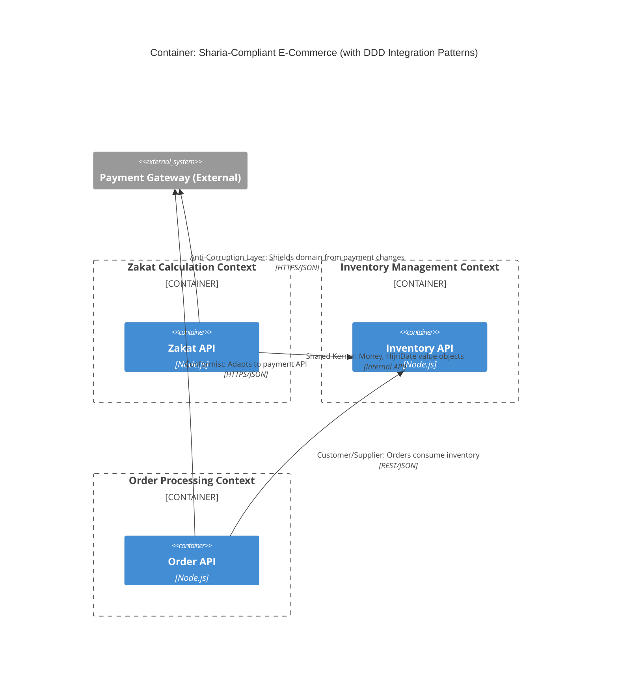

**Key Integration Patterns**:

- **Shared Kernel** (Zakat ↔ Inventory): Shared value objects (Money, HijriDate)
- **Customer/Supplier** (Order ↔ Inventory): Order consumes inventory data
- **Conformist** (Order ↔ Payment): Order adapts to payment API
- **Anti-Corruption Layer** (Zakat ↔ Payment): Zakat protects domain model from payment changes

### Aggregate Boundaries in Component Diagrams

**DDD Aggregates** define transactional consistency boundaries.

**C4 Component Diagrams** show internal structure.

**Integration**: Group components by aggregate boundaries.

**Example: Highlighting Aggregate Boundary**

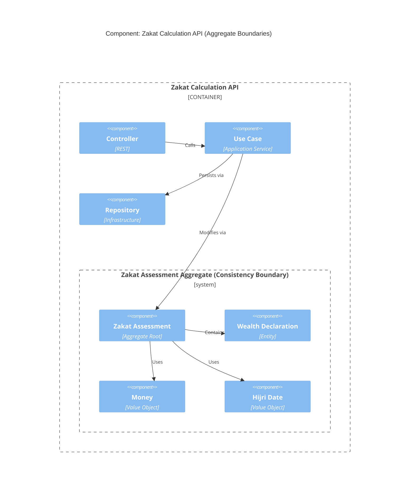

**Key Insight**: Aggregate boundary = transactional boundary. All components within the boundary are saved atomically.

## Example: Full DDD-C4 Integration for Zakat Calculation

### System Context (External Integration)

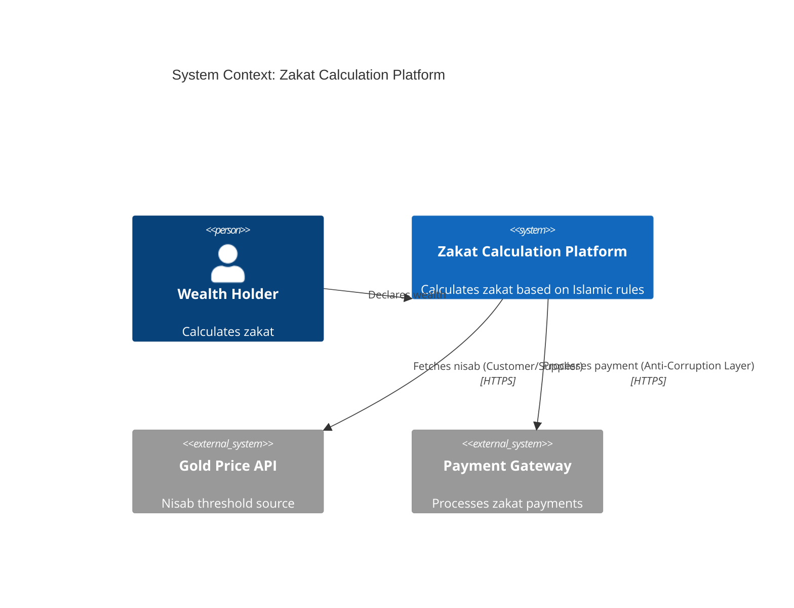

**DDD Context Map**:

- **Zakat Calculation** (Core) ↔ **Gold Pricing** (Generic, Customer/Supplier)
- **Zakat Calculation** (Core) ↔ **Payment Processing** (Generic, Anti-Corruption Layer)

### Container (Bounded Contexts)

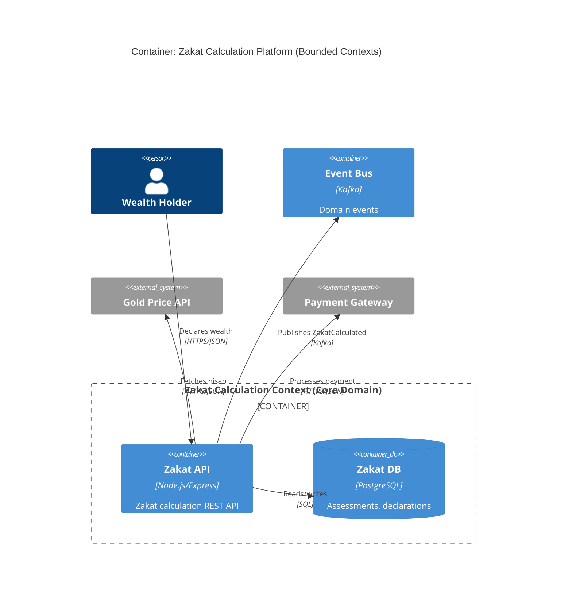

**Bounded Context**: `zakatAPI` + `zakatDB` = Zakat Calculation Context

### Component (Aggregates)

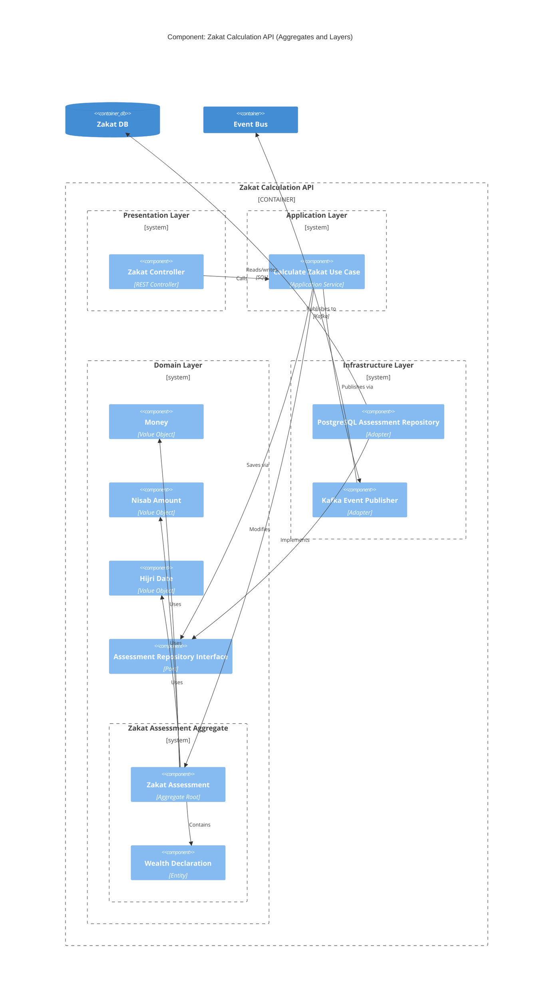

**Layered Architecture**:

- **Presentation**: `zakatController`
- **Application**: `calculateUseCase`
- **Domain**: `assessmentRoot`, `declarationEntity`, value objects, repository interface
- **Infrastructure**: `assessmentRepoImpl`, `eventPublisher`

**Aggregate**: `assessmentRoot` + `declarationEntity`

### Dynamic (Domain Events)

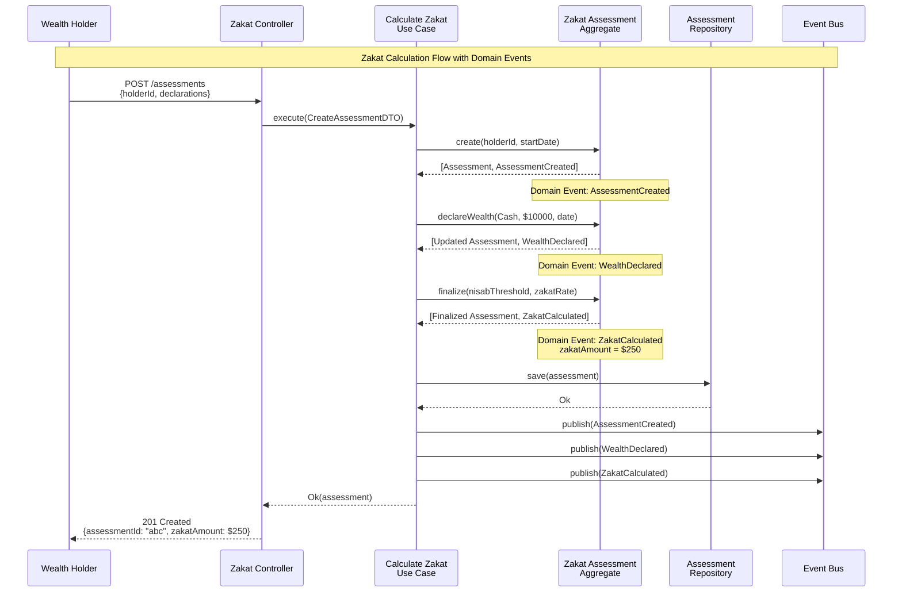

**Domain Events Published**:

1. **AssessmentCreated**: New zakat assessment initialized
2. **WealthDeclared**: Wealth declaration added (cash $10,000)
3. **ZakatCalculated**: Zakat finalized ($250 = $10,000 × 2.5%)

## Cross-Referencing DDD and C4 Documentation

### Linking Bounded Context Documentation to C4 Diagrams

**Bounded Context Documentation** (in `docs/explanation/bounded-contexts/`):

```markdown
# Zakat Calculation Bounded Context

**Architecture Diagrams**: See [C4 Container Diagram - Zakat Calculation](../c4-architecture-model/README.md#container-diagrams)

**Aggregates**:

- ZakatAssessment (see [C4 Component Diagram - Zakat API](../c4-architecture-model/README.md#component-diagrams))

**Integration**:

- External: Payment Gateway (Anti-Corruption Layer) - [System Context](../c4-architecture-model/README.md#system-context-diagrams)
- Internal: Shared Kernel with Inventory Management - [Context Map](./ex-sode-dodrdedd__04-context-mapping.md)
```

### Linking C4 Diagrams to DDD Documentation

**C4 Container Diagram Documentation**:

```markdown
# C4 Container Diagram: Zakat Calculation Platform

**Bounded Contexts**:

- Zakat Calculation Context (Core Domain) - [DDD Documentation](./ex-sode-dodrdedd__03-bounded-contexts.md)
- Inventory Management Context (Supporting) - [DDD Documentation](./ex-sode-dodrdedd__03-bounded-contexts.md)

**Integration Patterns**:

- Zakat ↔ Payment Gateway: Anti-Corruption Layer - [Context Mapping](../domain-driven-design-ddd/ex-sode-dodrdedd__04-context-mapping.md#anti-corruption-layer)
```

### Linking Aggregate Documentation to C4 Component Diagrams

**Aggregate Documentation** (using template):

```markdown
# Zakat Assessment Aggregate

**Architecture Diagram**: [C4 Component Diagram - Zakat API](../c4-architecture-model/README.md#component-diagrams)

**Aggregate Root**: ZakatAssessment

**Entities**:

- WealthDeclaration

**Value Objects**:

- Money, NisabAmount, ZakatRate, HijriDate

**Invariants**:

1. Assessment can only be finalized if hawl (lunar year) is complete
2. Total wealth must meet or exceed nisab threshold
3. Zakat amount = wealth × zakat rate (2.5% standard)

**Domain Events**:

- AssessmentCreated, WealthDeclared, ZakatCalculated (see [C4 Dynamic Diagram](../c4-architecture-model/README.md#dynamic-diagrams))
```

## Tools and Notation

### Mermaid C4 Support

Mermaid supports C4 diagrams with `C4Context`, `C4Container`, `C4Component`, and `C4Dynamic` (experimental).

**Example**:

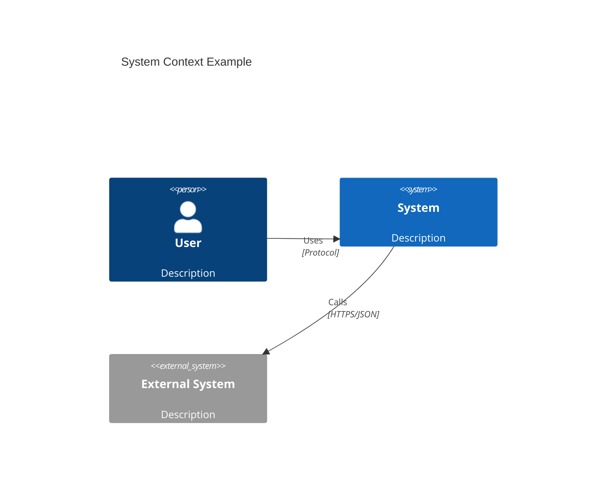

**WCAG AA-Compliant Colors** (from [Color Palette](./templates/ex-sode-dodrdedd-te__color-palette.md)):

- Blue `#0173B2`: Bounded Contexts, Aggregate Roots
- Teal `#029E73`: Entities, Supporting Subdomains
- Orange `#DE8F05`: Value Objects, Domain Events
- Purple `#CC78BC`: External Systems
- Gray `#808080`: Infrastructure

### PlantUML C4 Support

PlantUML has comprehensive C4 support via C4-PlantUML library.

**Example**:

```plantuml
@startuml
!include https://raw.githubusercontent.com/plantuml-stdlib/C4-PlantUML/master/C4_Container.puml

Person(user, "User")
Container(api, "API", "Node.js", "REST API")
ContainerDb(db, "Database", "PostgreSQL", "Stores data")

Rel(user, api, "Uses", "HTTPS")
Rel(api, db, "Reads/writes", "SQL")

@enduml
```

### Structurizr

Structurizr is a dedicated C4 modeling tool with versioning and workspace management.

**Benefits**:

- DSL for defining diagrams
- Automatic layout
- Version control
- Integration with documentation

**Example DSL**:

```
workspace {
    model {
        user = person "Wealth Holder"
        zakatSystem = softwareSystem "Zakat Platform" {
            zakatAPI = container "Zakat API" "Node.js"
            zakatDB = container "Zakat DB" "PostgreSQL"
        }

        user -> zakatAPI "Declares wealth"
        zakatAPI -> zakatDB "Reads/writes"
    }

    views {
        systemContext zakatSystem {
            include *
        }

        container zakatSystem {
            include *
        }
    }
}
```

## Best Practices

### 1. Keep DDD and C4 Documentation Synchronized

**Challenge**: Diagrams and documentation drift out of sync.

**Solution**: Co-locate documentation and diagrams, cross-reference liberally.

```
docs/explanation/
├── domain-driven-design-ddd/
│   ├── bounded-contexts/
│   │   ├── zakat-calculation.md       # References C4 diagrams
│   │   └── inventory-management.md
│   └── aggregates/
│       └── zakat-assessment.md         # References C4 component diagram
├── c4-architecture-model/
│   ├── ex-c4__01-system-context-diagrams.md  # References bounded contexts
│   ├── ex-c4__02-container-diagrams.md       # References bounded contexts
│   └── ex-c4__03-component-diagrams.md       # References aggregates
```

### 2. Use Bounded Contexts as Container Boundaries

**Principle**: One bounded context = one or more containers (typically app + database).

**Anti-Pattern**: Splitting a bounded context across multiple deployable services.

**Example**:

- **Good**: Zakat Calculation Context = `zakatAPI` + `zakatDB`
- **Bad**: Zakat Calculation Context = `zakatAPI1` + `zakatAPI2` + `zakatDB1` + `zakatDB2` (over-engineered)

### 3. Annotate C4 Relationships with DDD Integration Patterns

**C4 Relationship**:

```
Rel(zakatAPI, inventoryAPI, "Shares Money value object", "Internal API")
```

**Add DDD Pattern**:

```
Rel(zakatAPI, inventoryAPI, "Shared Kernel: Money, HijriDate", "Internal API")
```

### 4. Use Dynamic Diagrams for Domain Event Flows

**C4 Dynamic Diagrams** (sequence diagrams) naturally show domain events flowing between components.

**Example**:

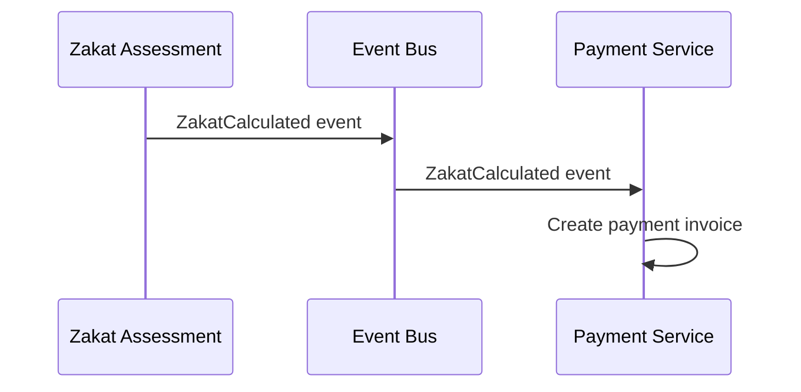

### 5. Link Aggregate Design Templates to Component Diagrams

**Template**: [Aggregate Design Template](./templates/ex-sode-dodrdedd-te__aggregate-design-template.md)

**Component Diagram**: Shows aggregate boundaries visually

**Integration**: Each aggregate documented in template should have corresponding component diagram.

## Summary

DDD and C4 are complementary:

**Mappings:**

- **System Context** ↔ **Context Maps** (external systems)
- **Container** ↔ **Bounded Contexts** (deployment units)
- **Component** ↔ **Aggregates** (internal structure)
- **Dynamic** ↔ **Domain Events** (behavior over time)

**Benefits of Integration:**

- **Visual Communication**: C4 diagrams make DDD concepts accessible to non-technical stakeholders
- **Documentation Coherence**: Cross-references between DDD and C4 docs prevent drift
- **Architectural Clarity**: Bounded contexts as containers, aggregates as components
- **Event Visualization**: Domain events in sequence diagrams

**Best Practices:**

1. Keep DDD and C4 documentation synchronized
2. Use bounded contexts as container boundaries
3. Annotate C4 relationships with DDD integration patterns
4. Use dynamic diagrams for domain event flows
5. Link aggregate design templates to component diagrams

**Tools:**

- **Mermaid**: Simple C4 diagrams in markdown
- **PlantUML**: Comprehensive C4 support
- **Structurizr**: Dedicated C4 modeling tool

## Next Steps

- **[C4 Architecture Model](../c4-architecture-model/README.md)** - Comprehensive C4 documentation
- **[Bounded Contexts](./ex-sode-dodrdedd__03-bounded-contexts.md)** - DDD strategic pattern
- **[Aggregates](./ex-sode-dodrdedd__09-aggregates.md)** - DDD tactical pattern
- **[Context Mapping](./ex-sode-dodrdedd__04-context-mapping.md)** - Integration patterns
- **[Layered Architecture](./ex-sode-dodrdedd__15-layered-architecture.md)** - Organizing layers in C4 component diagrams

## References

- Simon Brown, "The C4 Model for Visualising Software Architecture"
- [C4 Model](https://c4model.com/) - Official C4 documentation
- [Structurizr](https://structurizr.com/) - C4 modeling tool
- [C4-PlantUML](https://github.com/plantuml-stdlib/C4-PlantUML) - PlantUML C4 library
- Eric Evans, "Domain-Driven Design" (2003)
- Vaughn Vernon, "Implementing Domain-Driven Design" (2013)
