# Context Map Diagram Template

This template provides Mermaid diagrams illustrating Context Mapping patterns between bounded contexts. Use these diagrams to visualize strategic relationships in your system.

## Complete Context Map Example

Islamic Finance Platform showing relationships between Zakat, Halal Certification, and Accounting contexts.

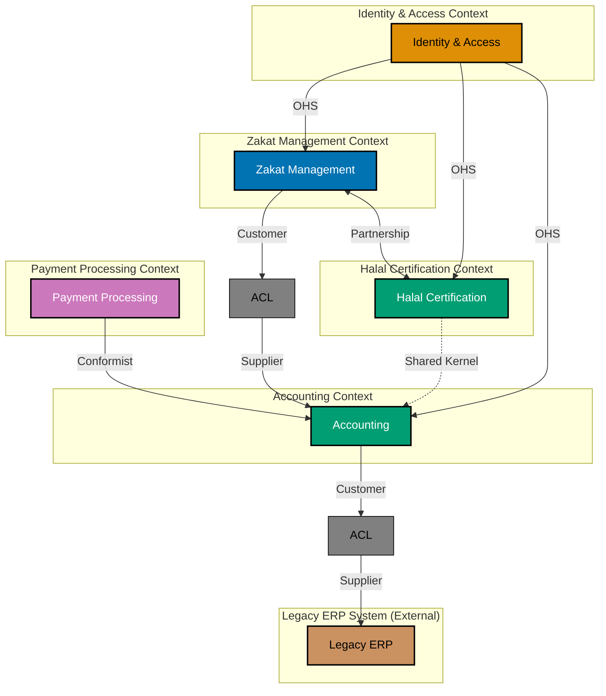

**Relationships Shown**:

- **Zakat → Accounting**: Customer-Supplier with ACL (Zakat translates domain concepts to accounting transactions)
- **Zakat ↔ Halal**: Partnership (close collaboration, both benefit)
- **Identity → All**: Open Host Service (IAM provides authentication/authorization protocol)
- **Payment → Accounting**: Conformist (Payment accepts Accounting's model)
- **Accounting → ERP**: ACL protecting from legacy system
- **Halal ↔ Accounting**: Shared Kernel (common compliance concepts - use cautiously)

## Individual Pattern Templates

### 1. Customer-Supplier Pattern

Downstream (customer) depends on upstream (supplier), but supplier listens to customer needs.

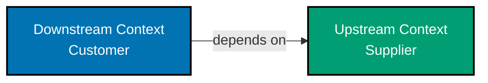

**When to Use**:

- Clear dependency direction
- Upstream team responsive to downstream needs
- Both teams collaborate on interface

**Example**: Zakat Assessment Context (downstream) depends on Nisab Service Context (upstream) for current nisab thresholds.

### 2. Conformist Pattern

Downstream completely conforms to upstream model, no negotiation power.

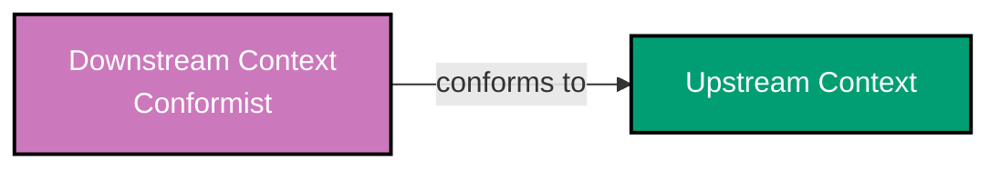

**When to Use**:

- Upstream is external or unwilling to change
- Cost of ACL outweighs benefit
- Upstream model is good enough

**Example**: Small internal reporting tool conforms to enterprise-wide Accounting Context.

### 3. Anticorruption Layer (ACL) Pattern

Translation layer protects downstream from upstream changes.

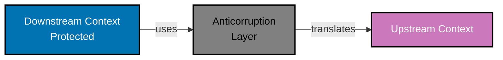

**When to Use**:

- Protect domain model from external influences
- Upstream has different semantics
- Legacy system integration

**Example**: Zakat Context uses ACL to translate its domain concepts (assessment, nisab, hawl) into Accounting Context's journal entries.

**ACL Implementation**:

```typescript
// ACL translates between contexts
class ZakatAccountingAdapter {
  toJournalEntry(assessment: ZakatAssessment, liability: ZakatLiability): JournalEntry {
    // Translate Zakat domain to Accounting domain
    return new JournalEntry({
      date: assessment.hawlEnd,
      description: `Zakat liability for ${assessment.taxpayer.name}`,
      debits: [
        {
          account: AccountCode.ZAKAT_EXPENSE,
          amount: liability.amount,
        },
      ],
      credits: [
        {
          account: AccountCode.ZAKAT_PAYABLE,
          amount: liability.amount,
        },
      ],
      reference: `ZAKAT-${assessment.id.value}`,
    });
  }
}
```

### 4. Open Host Service (OHS) Pattern

Upstream provides protocol/API for anyone to access.

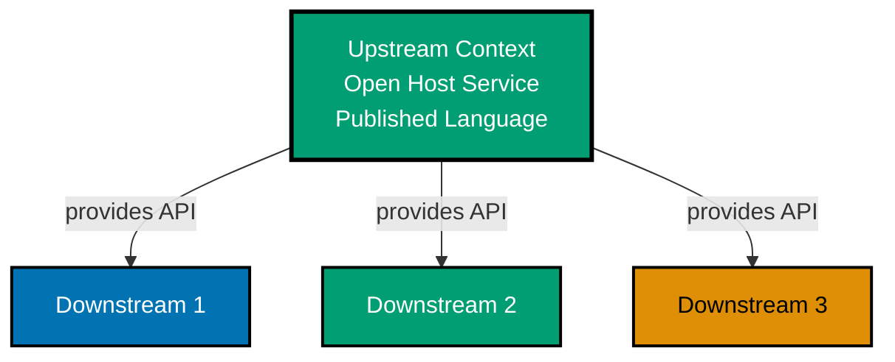

**When to Use**:

- Multiple downstream consumers
- Need stable, well-documented interface
- Upstream wants to protect internal model

**Example**: Identity & Access Management provides authentication/authorization API that all contexts use.

**Published Language** (often paired with OHS):

```typescript
// Well-documented, stable API
interface IdentityService {
  /**
   * Authenticates user credentials
   * @param username - User's unique identifier
   * @param password - User's password
   * @returns Authentication token with 1-hour expiry
   * @throws AuthenticationError if credentials invalid
   */
  authenticate(username: string, password: string): Promise<AuthenticationToken>;

  /**
   * Checks if user has permission for action
   * @param userId - User's unique identifier
   * @param permission - Permission to check (e.g., "zakat:assessment:create")
   * @returns true if user has permission
   */
  hasPermission(userId: UserId, permission: string): Promise<boolean>;
}
```

### 5. Published Language Pattern

Shared, well-documented language for integration (often with OHS).

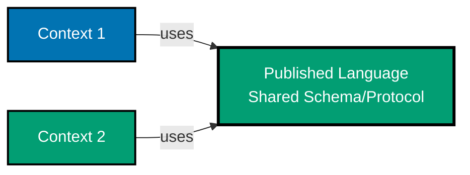

**When to Use**:

- Standard industry protocols (HTTP, gRPC, OpenAPI)
- Shared event schemas
- Multiple teams need common vocabulary

**Example**: Standardized domain event format used across all contexts.

```typescript
// Published event schema
interface DomainEvent {
  eventId: string; // UUID
  eventType: string; // e.g., "zakat.assessment.finalized"
  aggregateId: string;
  aggregateType: string;
  occurredAt: string; // ISO 8601 timestamp
  version: number; // Schema version
  payload: unknown; // Event-specific data
  metadata: {
    correlationId?: string;
    causationId?: string;
    userId?: string;
  };
}
```

### 6. Shared Kernel Pattern

Two contexts share subset of domain model (use sparingly - creates coupling).

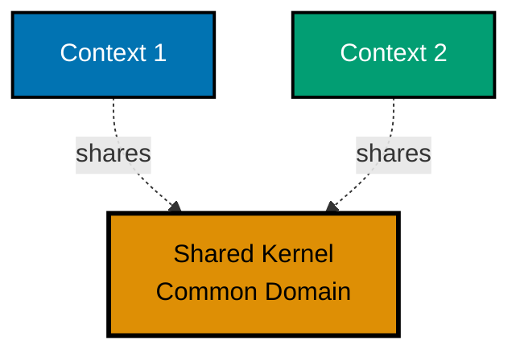

**When to Use** (rarely):

- Very stable core concepts
- High cost of duplication
- Teams coordinate closely

**Example**: Halal Certification and Accounting share compliance-related value objects.

```typescript
// Shared Kernel - used by both contexts
class ComplianceStatus {
  private constructor(private readonly value: "compliant" | "non_compliant" | "under_review") {}

  static compliant(): ComplianceStatus {
    return new ComplianceStatus("compliant");
  }

  static nonCompliant(): ComplianceStatus {
    return new ComplianceStatus("non_compliant");
  }

  // Used by both Halal and Accounting contexts
}
```

**Warning**: Shared Kernel creates tight coupling. Both teams must coordinate changes. Consider duplicating concepts in each context instead.

### 7. Partnership Pattern

Two contexts in mutual dependency, teams collaborate closely.

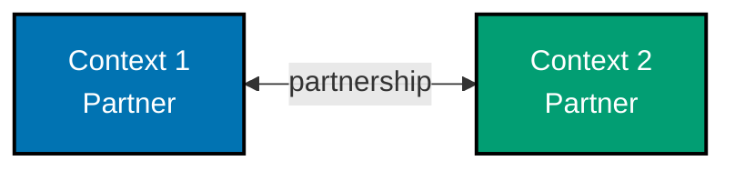

**When to Use**:

- Both contexts need each other
- Teams coordinate release cycles
- Shared success criteria

**Example**: Zakat Assessment and Halal Certification contexts both verify Shariah compliance, coordinate on compliance rules.

### 8. Separate Ways Pattern

No integration between contexts, they work independently.

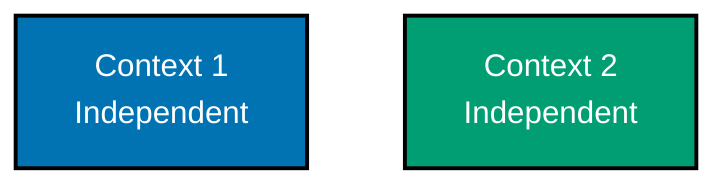

**When to Use**:

- No business need for integration
- Integration cost exceeds value
- Temporary state before future integration

**Example**: Internal HR system and Zakat Management have no overlap, work completely independently.

### 9. Big Ball of Mud Pattern

Legacy or poorly modeled contexts without clear boundaries.

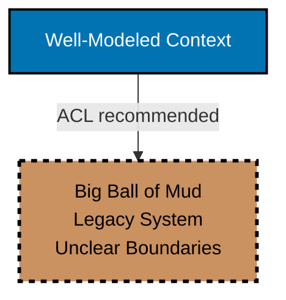

**When to Identify**:

- Legacy systems
- Unclear boundaries
- No ubiquitous language
- Tightly coupled components

**Recommendation**: Use ACL to protect new contexts from Big Ball of Mud. Don't try to model it with DDD patterns.

## Color Palette Reference

Accessible color palette (color-blind friendly, WCAG AA compliant):

```typescript
const ContextColors = {
  // Primary contexts (white text)
  Blue: "#0173B2", // Blue - Bounded Contexts, Aggregate Roots, Core Domain
  Teal: "#029E73", // Teal - Entities, Supporting Subdomains
  Purple: "#CC78BC", // Purple - External Systems, Context Relationships

  // Secondary contexts (black text)
  Orange: "#DE8F05", // Orange - Value Objects, Domain Events
  Brown: "#CA9161", // Brown - Legacy Systems, Generic Subdomains
  Gray: "#808080", // Gray - Supporting Services, Infrastructure, Translation layers (ACL)
};
```

**Text Color Guidelines**:

- Dark backgrounds (Blue, Teal, Purple): White text (`color:#FFFFFF`)
- Light backgrounds (Orange, Brown, Gray): Black text (`color:#000000`)
- All diagrams must use black borders: `stroke:#000000,stroke-width:2px` (or `stroke:#000`)

## Template Usage

### Step 1: Identify Your Contexts

List bounded contexts in your system:

```
1. [Context Name] - [Brief description]
2. [Context Name] - [Brief description]
...
```

### Step 2: Identify Relationships

For each pair of contexts, determine relationship:

- Do they need to integrate? If no → Separate Ways
- If yes, what's the power dynamic?
  - Upstream willing to collaborate? → Customer-Supplier
  - Upstream unwilling to change? → Conformist or ACL
  - Mutual dependency? → Partnership
  - Shared core model? → Shared Kernel (rare)

### Step 3: Draw Diagram

Use Mermaid template:

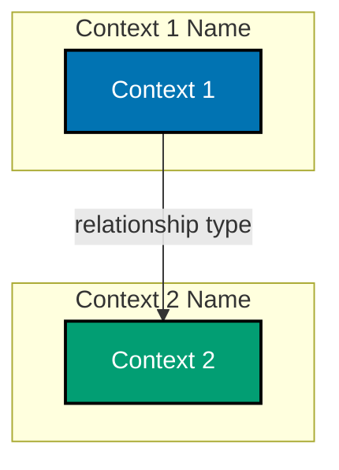

### Step 4: Document Integration Points

For each relationship, document:

- **Pattern**: Which Context Mapping pattern
- **Integration Mechanism**: API, Events, Shared Database (avoid), etc.
- **Data Format**: JSON, Protocol Buffers, etc.
- **Ownership**: Which team owns the integration point
- **SLA**: Response time, availability requirements

## Advanced Example: Multi-Context System

Large Islamic Finance Platform with multiple contexts and relationship types.

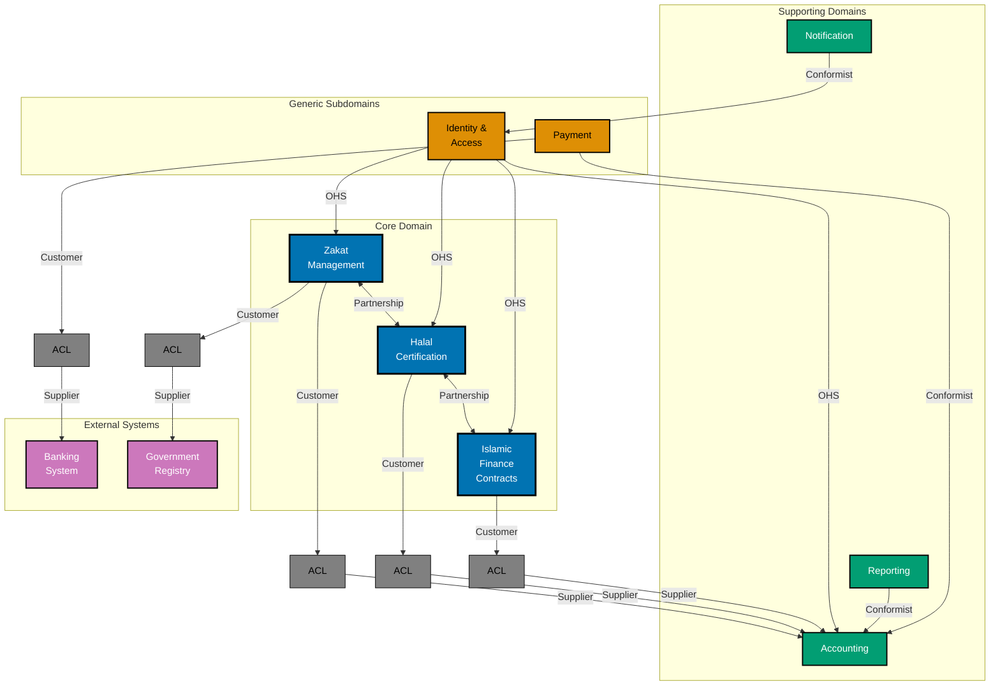

**Key Insights**:

- Core domains (Zakat, Halal, Islamic Finance) use Partnership for close collaboration
- All core domains protect themselves from Accounting via ACL
- Identity provides OHS for all contexts
- Supporting domains (Notification, Reporting) use Conformist
- External systems always protected by ACL

## See Also

- [Strategic Design](../ex-sode-dodrdedd__03-bounded-contexts.md) - Bounded contexts and context mapping concepts
- [Bounded Context Canvas](./ex-sode-dodrdedd-te__bounded-context-canvas.md) - Document individual context details
- [Ubiquitous Language Glossary](./ex-sode-dodrdedd-te__ubiquitous-language-glossary.md) - Track domain terminology per context
- [Accessible Diagrams Convention](../../../../../governance/conventions/formatting/diagrams.md) - Color palette standards
