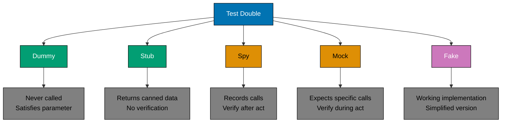
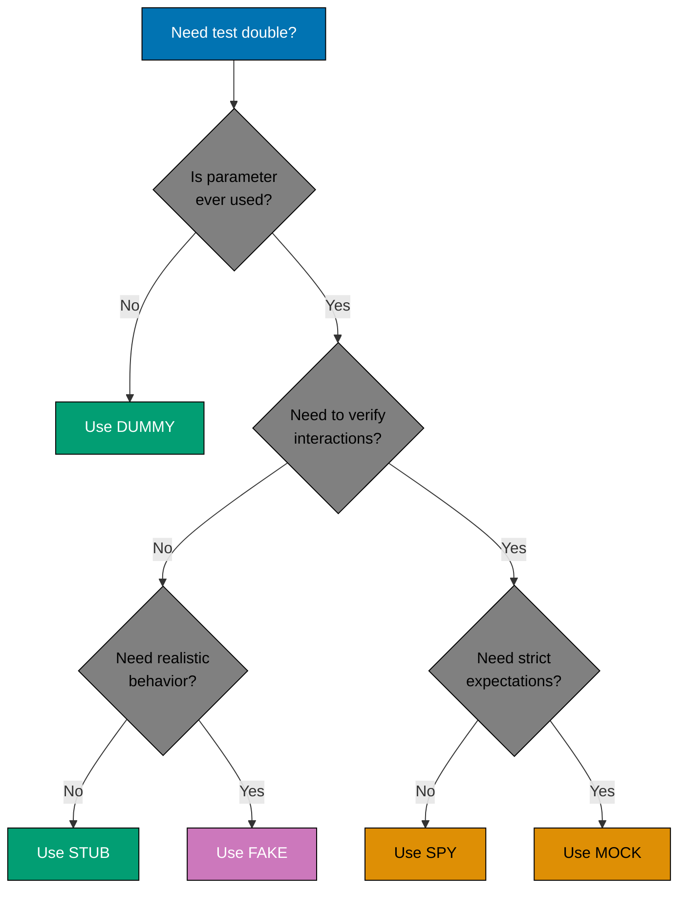

# Test-Driven Development: Test Doubles

## Overview

Test doubles are objects or functions that stand in for real dependencies during testing. They enable fast, isolated unit tests by replacing expensive or unpredictable components (databases, external APIs, time providers) with controllable alternatives.

The term "test double" comes from the film industry's "stunt double"—just as a stunt performer stands in for an actor during dangerous scenes, a test double stands in for a real dependency during testing. Test doubles allow you to verify behavior in isolation, control test conditions precisely, and execute tests in milliseconds rather than seconds.

Mastering test doubles is essential for effective TDD. They enable the "Fast" and "Independent" principles of good unit tests, prevent test fragility, and provide surgical precision when verifying interactions between components.

## Types of Test Doubles

Gerard Meszaros's "xUnit Test Patterns" (2007) cataloged five types of test doubles, each serving different purposes. Understanding when to use each type is critical for writing maintainable tests.



### 1. Dummy Objects

**Definition**: Objects passed to satisfy parameter requirements but never actually used.

**When to use**: Method requires a parameter that won't be called in the specific test scenario.

**Example - Islamic Calendar Date (Unused Parameter):**

```typescript
// DUMMY: DateProvider passed but never called
describe("ZakatCalculator", () => {
  it("should return zero when wealth below nisab", () => {
    // Arrange
    const nisabProvider = { getNisab: () => Money.fromGold(85, "grams") };
    const dateProvider = null as any; // DUMMY - not used in this test
    const calculator = new ZakatCalculator(nisabProvider, dateProvider);

    const wealth = Money.fromGold(50, "grams");

    // Act
    const zakat = calculator.calculate(wealth);

    // Assert
    expect(zakat.equals(Money.zero("gold"))).toBe(true);
  });
});
```

**Characteristics:**

- Never actually invoked during test
- Simplest form of test double
- Often `null`, `undefined`, or empty object
- Used to satisfy type requirements

**When NOT to use**: If the parameter is actually called, use a stub or mock instead.

### 2. Stubs

**Definition**: Objects that return pre-configured responses (canned data) without verification logic.

**When to use**: You need to control the response from a dependency but don't care how many times it's called or with what arguments.

**Example - Nisab Provider Stub:**

```typescript
// STUB: Returns fixed nisab value, no verification
describe("ZakatCalculator", () => {
  it("should calculate 2.5% when wealth exceeds nisab", () => {
    // Arrange - Stub returns fixed value
    const nisabProvider = {
      getNisab: (assetType: string) => Money.fromGold(85, "grams"),
    };

    const calculator = new ZakatCalculator(nisabProvider);
    const wealth = Money.fromGold(100, "grams");

    // Act
    const zakat = calculator.calculate(wealth);

    // Assert - Only verify calculation result
    expect(zakat.equals(Money.fromGold(2.5, "grams"))).toBe(true);
    // No verification of nisabProvider calls
  });
});
```

**Characteristics:**

- Returns hardcoded values
- No verification logic
- Simplest useful test double
- State-based testing (verify return values, not interactions)

**Good for:**

- External data sources (API responses, configuration)
- Time providers (current date/time)
- Random value generators (fixed seed)

### 3. Spies

**Definition**: Objects that record how they were called (arguments, call count, call order), allowing verification **after** the action.

**When to use**: You need to verify that a dependency was called correctly, but you want the verification to happen after the act phase (cleaner AAA structure).

**Example - Audit Logger Spy:**

```typescript
// SPY: Records calls for later verification
describe("HalalCertification", () => {
  it("should log certification approval to audit trail", () => {
    // Arrange
    const auditLogSpy = {
      calls: [] as any[],
      log(event: AuditEvent) {
        this.calls.push(event);
      },
    };

    const certificationService = new HalalCertificationService(auditLogSpy);
    const application = buildCertificationApplication({
      productName: "Halal Beef Sausage",
      ingredients: ["beef", "spices", "water"],
    });

    // Act
    certificationService.approve(application);

    // Assert - Verify spy recorded the call
    expect(auditLogSpy.calls).toHaveLength(1);
    expect(auditLogSpy.calls[0].eventType).toBe("CERTIFICATION_APPROVED");
    expect(auditLogSpy.calls[0].productName).toBe("Halal Beef Sausage");
  });
});
```

**Characteristics:**

- Records all calls
- Verification happens **after** act phase
- More flexible than mocks
- Supports state-based verification of interactions

**Spy with Sinon.js (JavaScript):**

```typescript
import sinon from "sinon";

it("should call audit log with certification event", () => {
  const auditLog = { log: sinon.spy() };
  const service = new HalalCertificationService(auditLog);

  service.approve(application);

  expect(auditLog.log.calledOnce).toBe(true);
  expect(auditLog.log.firstCall.args[0].eventType).toBe("CERTIFICATION_APPROVED");
});
```

### 4. Mocks

**Definition**: Objects with pre-programmed expectations that verify calls **during** the test execution. Mocks fail the test if expectations aren't met.

**When to use**: You need to verify precise interactions (method calls, arguments, call order) and want the test framework to enforce expectations automatically.

**Example - Payment Gateway Mock:**

```typescript
// MOCK: Expects specific interaction pattern
describe("TakafulClaimService", () => {
  it("should process claim payment through Islamic bank", () => {
    // Arrange - Mock expects specific calls
    const bankGatewayMock = {
      _expectedCalls: [] as any[],
      _actualCalls: [] as any[],

      expectTransfer(from: Account, to: Account, amount: Money) {
        this._expectedCalls.push({ method: "transfer", from, to, amount });
        return this;
      },

      transfer(from: Account, to: Account, amount: Money): Promise<TransferResult> {
        this._actualCalls.push({ method: "transfer", from, to, amount });
        return Promise.resolve({ success: true, transactionId: "TXN-123" });
      },

      verify() {
        expect(this._actualCalls).toEqual(this._expectedCalls);
      },
    };

    bankGatewayMock.expectTransfer(Account.fromIban("SA123456"), Account.fromIban("SA789012"), Money.fromSAR(5000));

    const claimService = new TakafulClaimService(bankGatewayMock);

    // Act
    claimService.payApprovedClaim(claimId);

    // Assert - Mock verifies expectations
    bankGatewayMock.verify();
  });
});
```

**Mock with Jest (JavaScript/TypeScript):**

```typescript
it("should transfer funds through Islamic bank", async () => {
  const bankGateway = {
    transfer: jest.fn().mockResolvedValue({ success: true, id: "TXN-123" }),
  };

  const service = new TakafulClaimService(bankGateway);

  await service.payApprovedClaim(claimId);

  expect(bankGateway.transfer).toHaveBeenCalledWith(
    Account.fromIban("SA123456"),
    Account.fromIban("SA789012"),
    Money.fromSAR(5000),
  );
  expect(bankGateway.transfer).toHaveBeenCalledTimes(1);
});
```

**Characteristics:**

- Pre-programmed expectations
- Fails test if expectations not met
- Verification integrated into mock itself
- Interaction-based testing (verify method calls)

**Warning**: Overuse of mocks leads to brittle tests coupled to implementation details. Prefer spies when possible.

### 5. Fakes

**Definition**: Working implementations with simplified logic, often in-memory alternatives to real dependencies.

**When to use**: Real implementation is too slow or complex, but you need more realistic behavior than a stub provides.

**Example - In-Memory Waqf Repository (Fake Database):**

```typescript
// FAKE: In-memory implementation of repository
class InMemoryWaqfRepository implements WaqfRepository {
  private waqfs: Map<WaqfId, Waqf> = new Map();

  async save(waqf: Waqf): Promise<void> {
    this.waqfs.set(waqf.id, waqf);
  }

  async findById(id: WaqfId): Promise<Waqf | null> {
    return this.waqfs.get(id) || null;
  }

  async findByBeneficiary(beneficiaryId: string): Promise<Waqf[]> {
    return Array.from(this.waqfs.values()).filter((w) => w.beneficiaries.some((b) => b.id === beneficiaryId));
  }

  clear() {
    this.waqfs.clear();
  }
}

describe("WaqfManagementService", () => {
  let repository: InMemoryWaqfRepository;
  let service: WaqfManagementService;

  beforeEach(() => {
    repository = new InMemoryWaqfRepository();
    service = new WaqfManagementService(repository);
  });

  it("should create and retrieve waqf by id", async () => {
    // Arrange
    const waqfInput = {
      beneficiaries: [{ id: "mosque-001", share: 100 }],
      assets: [{ type: "LAND", value: Money.fromUSD(100000) }],
    };

    // Act
    const waqfId = await service.createWaqf(waqfInput);
    const retrieved = await service.getWaqf(waqfId);

    // Assert
    expect(retrieved).toBeDefined();
    expect(retrieved!.beneficiaries).toHaveLength(1);
    expect(retrieved!.assets[0].value.equals(Money.fromUSD(100000))).toBe(true);
  });
});
```

**Characteristics:**

- Working implementation (not just canned responses)
- Simplified (in-memory vs. database, synchronous vs. async)
- Shared across multiple tests
- Realistic behavior without real infrastructure

**Common Fakes:**

- In-memory databases
- In-memory file systems
- Simplified HTTP servers
- Local time providers

**Trade-off**: Fakes require maintenance (must stay consistent with real implementation).

## When to Use Each Type



**Decision Matrix:**

| Scenario                       | Test Double Type | Reason                                        |
| ------------------------------ | ---------------- | --------------------------------------------- |
| Unused constructor parameter   | **Dummy**        | Not called in test                            |
| External API returning data    | **Stub**         | Control response, no verification needed      |
| Time/date provider             | **Stub**         | Fixed time for deterministic tests            |
| Repository (simple queries)    | **Fake**         | Need realistic CRUD behavior                  |
| Event publisher verification   | **Spy**          | Verify calls after action                     |
| Payment gateway (strict order) | **Mock**         | Enforce exact call sequence                   |
| Notification service           | **Spy**          | Verify notification sent, flexible assertions |

## Test Doubles in Practice

### Example 1: Zakat Calculation with Multiple Doubles

```typescript
describe("ZakatCalculationService", () => {
  it("should calculate zakat and record in audit log", async () => {
    // STUB: Fixed nisab threshold
    const nisabProvider = {
      getNisab: (assetType: string) => Money.fromGold(85, "grams"),
    };

    // STUB: Fixed date for Hawl calculation
    const clockStub = {
      now: () => new Date("2024-01-15"),
    };

    // SPY: Verify audit logging
    const auditLogSpy = {
      entries: [] as any[],
      log(entry: AuditEntry) {
        this.entries.push(entry);
      },
    };

    // FAKE: In-memory repository
    const repository = new InMemoryZakatRepository();

    const service = new ZakatCalculationService({
      nisabProvider,
      clock: clockStub,
      auditLog: auditLogSpy,
      repository,
    });

    // Act
    const wealth = Money.fromGold(100, "grams");
    const result = await service.calculateAndRecord(wealth, "gold");

    // Assert - Verify calculation
    expect(result.zakatDue.equals(Money.fromGold(2.5, "grams"))).toBe(true);

    // Assert - Verify audit logging (spy)
    expect(auditLogSpy.entries).toHaveLength(1);
    expect(auditLogSpy.entries[0].action).toBe("ZAKAT_CALCULATED");

    // Assert - Verify persistence (fake)
    const stored = await repository.findByDate(new Date("2024-01-15"));
    expect(stored).toHaveLength(1);
  });
});
```

### Example 2: Murabaha Contract with Mock Expectations

```typescript
describe("MurabahaContractService", () => {
  it("should execute contract flow with bank approval", async () => {
    // MOCK: Islamic bank requires specific approval sequence
    const bankMock = {
      calls: [] as string[],

      async validateCustomer(customerId: string): Promise<boolean> {
        this.calls.push(`validateCustomer:${customerId}`);
        return true;
      },

      async checkCreditworthiness(customerId: string): Promise<CreditScore> {
        this.calls.push(`checkCredit:${customerId}`);
        return { score: 750, approved: true };
      },

      async approvePurchase(contractId: string, amount: Money): Promise<Approval> {
        this.calls.push(`approvePurchase:${contractId}:${amount.amount}`);
        return { approved: true, approvalId: "APR-123" };
      },

      verify() {
        // Verify exact sequence
        expect(this.calls).toEqual([
          "validateCustomer:CUST-001",
          "checkCredit:CUST-001",
          "approvePurchase:CONTRACT-001:10000",
        ]);
      },
    };

    const service = new MurabahaContractService(bankMock);

    // Act
    await service.executeContract({
      contractId: "CONTRACT-001",
      customerId: "CUST-001",
      assetPrice: Money.fromUSD(10000),
      markup: Money.fromUSD(500),
    });

    // Assert
    bankMock.verify();
  });
});
```

### Example 3: Test Double Progression (Evolution)

Show how test doubles evolve as requirements change:

```typescript
// ITERATION 1: Simple stub
it("should calculate zakat - v1", () => {
  const nisabProvider = { getNisab: () => 85 }; // Simple stub
  const calculator = new ZakatCalculator(nisabProvider);

  const zakat = calculator.calculate(100);
  expect(zakat).toBe(2.5);
});

// ITERATION 2: Stub with different asset types
it("should calculate zakat - v2", () => {
  const nisabProvider = {
    getNisab: (assetType: string) => {
      return assetType === "gold" ? 85 : 595; // Silver nisab
    },
  };

  const calculator = new ZakatCalculator(nisabProvider);

  expect(calculator.calculate(100, "gold")).toBe(2.5);
  expect(calculator.calculate(600, "silver")).toBe(15);
});

// ITERATION 3: Spy to verify caching behavior
it("should calculate zakat - v3 (cached)", () => {
  const nisabProviderSpy = {
    callCount: 0,
    getNisab: (assetType: string) => {
      nisabProviderSpy.callCount++;
      return assetType === "gold" ? 85 : 595;
    },
  };

  const calculator = new ZakatCalculator(nisabProviderSpy);

  calculator.calculate(100, "gold");
  calculator.calculate(100, "gold"); // Should use cache

  expect(nisabProviderSpy.callCount).toBe(1); // Called only once
});

// ITERATION 4: Fake repository for integration
it("should calculate zakat - v4 (persisted)", async () => {
  const repository = new InMemoryZakatRepository();
  const nisabProvider = { getNisab: (type: string) => 85 };
  const service = new ZakatCalculationService(nisabProvider, repository);

  await service.calculateAndStore(100, "gold", "USER-001");

  const history = await repository.findByUser("USER-001");
  expect(history).toHaveLength(1);
  expect(history[0].amount).toBe(2.5);
});
```

## Mocking Frameworks

Popular frameworks for creating test doubles in different languages:

### JavaScript/TypeScript

**Jest (Built-in Mocking):**

```typescript
// Mock function
const mockFn = jest.fn();
mockFn.mockReturnValue(42);
mockFn.mockResolvedValue(Promise.resolve(42));

// Mock module
jest.mock("./nisabProvider", () => ({
  getNisab: jest.fn().mockReturnValue(85),
}));

// Spy on existing method
const spy = jest.spyOn(calculator, "calculate");
expect(spy).toHaveBeenCalledWith(100, "gold");
```

**Sinon.js:**

```typescript
import sinon from "sinon";

// Stub
const stub = sinon.stub().returns(85);

// Spy
const spy = sinon.spy(auditLog, "log");
expect(spy.calledOnce).toBe(true);

// Mock with expectations
const mock = sinon.mock(bankGateway);
mock.expects("transfer").once().withArgs(account, Money.fromUSD(100));
mock.verify();
```

### Java

**Mockito:**

```java
// Mock
NisabProvider nisabProvider = mock(NisabProvider.class);
when(nisabProvider.getNisab("gold")).thenReturn(Money.fromGold(85));

// Verify
verify(auditLog).log(any(AuditEvent.class));
verify(auditLog, times(1)).log(argThat(e -> e.getType().equals("ZAKAT")));

// Spy (partial mock)
ZakatCalculator calculator = spy(new ZakatCalculator());
doReturn(Money.fromGold(2.5)).when(calculator).calculate(any());
```

### C

**.NET Moq:**

```csharp
// Mock
var nisabProvider = new Mock<INisabProvider>();
nisabProvider.Setup(p => p.GetNisab("gold")).Returns(Money.FromGold(85));

// Verify
auditLog.Verify(log => log.Log(It.IsAny<AuditEvent>()), Times.Once);

// Strict mock (fails on unexpected calls)
var strictMock = new Mock<IBankGateway>(MockBehavior.Strict);
strictMock.Setup(b => b.Transfer(It.IsAny<Account>(), It.IsAny<Money>()));
```

## Anti-Patterns and Pitfalls

### 1. Over-Mocking (Test Fragility)

**Problem**: Mocking too many collaborators couples tests to implementation details.

```typescript
// BAD: Over-mocked test
it("should process halal certification", async () => {
  const validatorMock = jest.fn().mockResolvedValue(true);
  const loggerMock = jest.fn();
  const cacheMock = { get: jest.fn(), set: jest.fn() };
  const dbMock = { save: jest.fn() };
  const eventBusMock = { publish: jest.fn() };
  const notifierMock = { notify: jest.fn() };

  const service = new HalalCertificationService(
    validatorMock,
    loggerMock,
    cacheMock,
    dbMock,
    eventBusMock,
    notifierMock,
  );

  await service.certify(application);

  // Test breaks whenever implementation changes
  expect(validatorMock).toHaveBeenCalled();
  expect(loggerMock).toHaveBeenCalledTimes(3);
  expect(cacheMock.set).toHaveBeenCalled();
  expect(dbMock.save).toHaveBeenCalled();
  expect(eventBusMock.publish).toHaveBeenCalled();
  expect(notifierMock.notify).toHaveBeenCalled();
});

// GOOD: Test behavior, not implementation
it("should approve certification for compliant product", async () => {
  const repository = new InMemoryRepository();
  const validator = new RealHalalValidator(); // Real validator
  const service = new HalalCertificationService(validator, repository);

  const result = await service.certify(compliantApplication);

  expect(result.status).toBe("APPROVED");

  const stored = await repository.findById(result.id);
  expect(stored.status).toBe("APPROVED");
});
```

**Fix**: Only mock external dependencies (I/O). Use real objects for domain logic.

### 2. Mocking Value Objects

**Problem**: Value objects are simple, immutable data structures. Mocking them adds no value.

```typescript
// BAD: Mocking value object
it("should calculate zakat", () => {
  const moneyMock = jest.fn().mockReturnValue({
    amount: 100,
    multiply: jest.fn().mockReturnValue({ amount: 2.5 }),
  });

  const calculator = new ZakatCalculator();
  const result = calculator.calculate(moneyMock);

  expect(result.amount).toBe(2.5);
});

// GOOD: Use real value objects
it("should calculate zakat", () => {
  const wealth = Money.fromGold(100, "grams");
  const calculator = new ZakatCalculator();

  const result = calculator.calculate(wealth);

  expect(result.equals(Money.fromGold(2.5, "grams"))).toBe(true);
});
```

**Fix**: Never mock value objects. They're cheap to construct and deterministic.

### 3. Mock Leakage Between Tests

**Problem**: Mocks persist between tests, causing false passes/failures.

```typescript
// BAD: Shared mock state
describe("ZakatService", () => {
  const repositoryMock = { save: jest.fn() }; // Shared across tests

  it("should save calculation - test 1", async () => {
    const service = new ZakatService(repositoryMock);
    await service.calculate(100);

    expect(repositoryMock.save).toHaveBeenCalledTimes(1);
  });

  it("should save calculation - test 2", async () => {
    const service = new ZakatService(repositoryMock);
    await service.calculate(200);

    // FAILS: Called twice (once from previous test)
    expect(repositoryMock.save).toHaveBeenCalledTimes(1);
  });
});

// GOOD: Fresh mock per test
describe("ZakatService", () => {
  let repositoryMock: any;

  beforeEach(() => {
    repositoryMock = { save: jest.fn() }; // Fresh mock each test
  });

  it("should save calculation - test 1", async () => {
    const service = new ZakatService(repositoryMock);
    await service.calculate(100);

    expect(repositoryMock.save).toHaveBeenCalledTimes(1);
  });

  it("should save calculation - test 2", async () => {
    const service = new ZakatService(repositoryMock);
    await service.calculate(200);

    expect(repositoryMock.save).toHaveBeenCalledTimes(1); // PASSES
  });
});
```

**Fix**: Reset mocks in `beforeEach` or use framework's automatic reset.

### 4. Testing the Mock Instead of the System

**Problem**: Tests verify mock behavior rather than system behavior.

```typescript
// BAD: Testing mock configuration
it("should call bank transfer", async () => {
  const bankMock = { transfer: jest.fn().mockResolvedValue({ success: true }) };
  const service = new TakafulClaimService(bankMock);

  await service.payClaim(claimId);

  // This only tests that we configured the mock correctly
  expect(bankMock.transfer).toHaveBeenCalled();
});

// GOOD: Test system outcome
it("should mark claim as paid after transfer", async () => {
  const bankStub = { transfer: async () => ({ success: true }) };
  const repository = new InMemoryClaimRepository();
  const service = new TakafulClaimService(bankStub, repository);

  await service.payClaim(claimId);

  const claim = await repository.findById(claimId);
  expect(claim.status).toBe("PAID");
  expect(claim.paidAt).toBeDefined();
});
```

**Fix**: Focus assertions on system state changes, not mock interactions.

## Best Practices

### 1. Prefer Fakes for Repositories

Use in-memory fakes for data access rather than mocks:

```typescript
// Repository interface
interface ZakatRepository {
  save(record: ZakatRecord): Promise<void>;
  findByUser(userId: string): Promise<ZakatRecord[]>;
  findByDateRange(start: Date, end: Date): Promise<ZakatRecord[]>;
}

// Fake implementation (reusable across all tests)
class InMemoryZakatRepository implements ZakatRepository {
  private records: ZakatRecord[] = [];

  async save(record: ZakatRecord): Promise<void> {
    this.records.push(record);
  }

  async findByUser(userId: string): Promise<ZakatRecord[]> {
    return this.records.filter((r) => r.userId === userId);
  }

  async findByDateRange(start: Date, end: Date): Promise<ZakatRecord[]> {
    return this.records.filter((r) => r.calculatedAt >= start && r.calculatedAt <= end);
  }

  clear(): void {
    this.records = [];
  }
}

// Usage in tests
describe("ZakatReportingService", () => {
  let repository: InMemoryZakatRepository;

  beforeEach(() => {
    repository = new InMemoryZakatRepository();
  });

  it("should generate annual report", async () => {
    const service = new ZakatReportingService(repository);

    await repository.save(buildZakatRecord({ userId: "USER-001", amount: 100 }));
    await repository.save(buildZakatRecord({ userId: "USER-001", amount: 200 }));

    const report = await service.generateAnnualReport("USER-001", 2024);

    expect(report.totalZakat).toBe(300);
  });
});
```

**Benefits:**

- Realistic behavior (supports complex queries)
- Reusable across all tests
- Fast (in-memory)
- No mock configuration needed

### 2. Use Stubs for External Services

Stub external dependencies with minimal logic:

```typescript
// Stub for Hijri calendar service
const hijriCalendarStub = {
  toHijri: (gregorianDate: Date) => ({
    year: 1445,
    month: 7,
    day: 15,
    monthName: "Rajab",
  }),
};

// Stub for currency exchange rate
const exchangeRateStub = {
  getRate: (from: string, to: string) => {
    if (from === "USD" && to === "SAR") return 3.75;
    if (from === "SAR" && to === "USD") return 0.27;
    throw new Error(`Unknown currency pair: ${from}/${to}`);
  },
};
```

### 3. Isolate Mock Setup in Helper Functions

Extract complex mock configuration into reusable helpers:

```typescript
// Helper function for common mock setup
function createMockBankGateway(overrides?: Partial<BankGateway>): BankGateway {
  return {
    transfer: jest.fn().mockResolvedValue({ success: true, id: "TXN-123" }),
    checkBalance: jest.fn().mockResolvedValue(Money.fromSAR(10000)),
    getTransactionHistory: jest.fn().mockResolvedValue([]),
    ...overrides,
  };
}

// Usage
it("should transfer funds", async () => {
  const bankGateway = createMockBankGateway({
    checkBalance: jest.fn().mockResolvedValue(Money.fromSAR(5000)),
  });

  const service = new TakafulClaimService(bankGateway);
  await service.payClaim(claimId);

  expect(bankGateway.transfer).toHaveBeenCalled();
});
```

### 4. Verify Behavior, Not Implementation

Focus on observable outcomes, not internal method calls:

```typescript
// BAD: Testing implementation details
it("should use cache when available", async () => {
  const cacheMock = { get: jest.fn(), set: jest.fn() };
  const service = new ZakatService(cacheMock);

  await service.calculate(100);

  expect(cacheMock.get).toHaveBeenCalled(); // Implementation detail
  expect(cacheMock.set).toHaveBeenCalled();
});

// GOOD: Test observable behavior
it("should calculate zakat faster on second call (cached)", async () => {
  const repository = new InMemoryRepository();
  const service = new ZakatService(repository);

  const start1 = Date.now();
  await service.calculate(100);
  const duration1 = Date.now() - start1;

  const start2 = Date.now();
  await service.calculate(100);
  const duration2 = Date.now() - start2;

  expect(duration2).toBeLessThan(duration1 * 0.5); // Cached is faster
});
```

## Related Documentation

- **[04. Unit Testing Fundamentals](./ex-sode-tedrdeve__04-unit-testing-fundamentals.md)** - Test structure and isolation principles
- **[06. Testing Patterns](./ex-sode-tedrdeve__06-testing-patterns.md)** - AAA, Given-When-Then, table-driven tests
- **[09. Integration Testing](./ex-sode-tedrdeve__09-integration-testing.md)** - When to use real dependencies vs test doubles
- **[15. Testing Anti-Patterns](./ex-sode-tedrdeve__15-testing-anti-patterns.md)** - Common mistakes with test doubles

## Summary

Test doubles enable fast, isolated unit tests by replacing real dependencies with controlled alternatives:

- **Dummy**: Unused parameter (satisfies type requirements)
- **Stub**: Returns canned data (no verification)
- **Spy**: Records calls for later verification
- **Mock**: Pre-programmed expectations (strict verification)
- **Fake**: Working implementation (simplified, in-memory)

**Key Principles:**

1. Only mock external dependencies (I/O, time, randomness)
2. Never mock value objects or domain entities
3. Prefer fakes for repositories (realistic behavior)
4. Prefer spies over mocks (less brittle)
5. Verify behavior, not implementation details
6. Reset mocks between tests

Mastering test doubles unlocks the full power of TDD—fast feedback, precise isolation, and confidence in refactoring.
