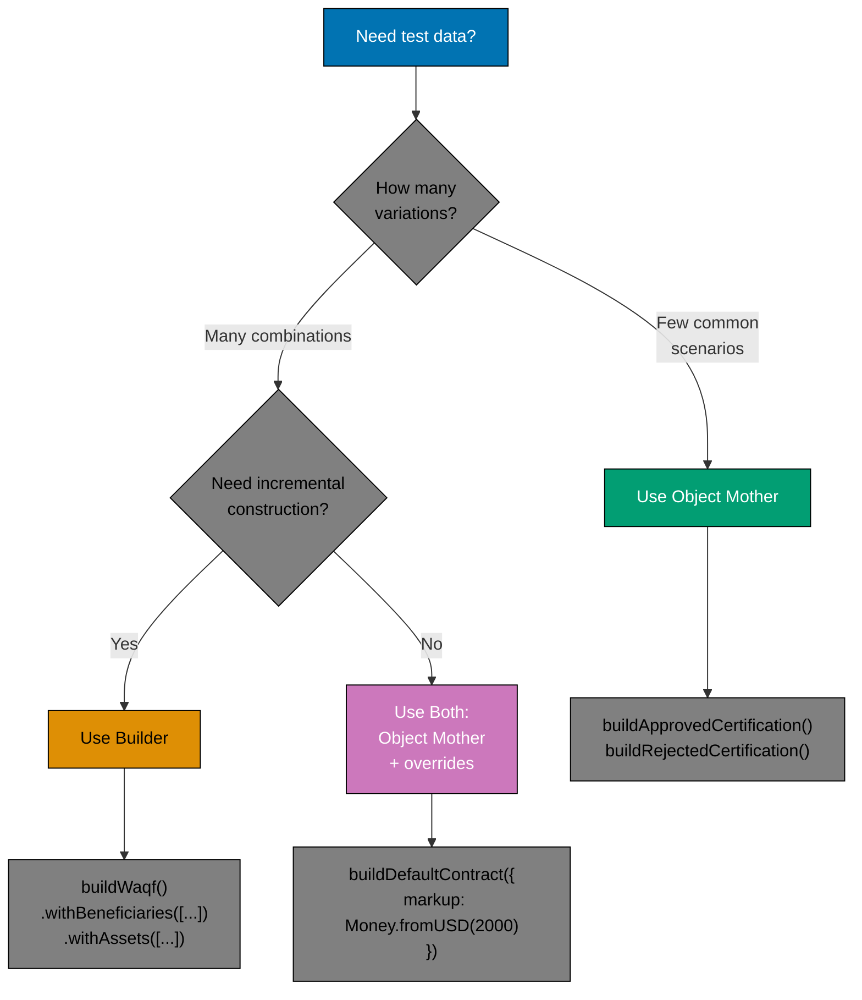

# Test-Driven Development: Test Data Builders

## Overview

Test data builders are patterns for constructing test fixtures—the objects and data needed to set up test scenarios. Rather than repeating complex object construction in every test, builders encapsulate creation logic in reusable, expressive functions.

The Builder pattern and Object Mother pattern are the two primary approaches. Builders provide fluent, chainable APIs for incremental construction, while Object Mothers provide factory functions for common scenarios. Both patterns reduce duplication, improve test readability, and make tests resilient to domain model changes.

Mastering test data builders is essential for maintaining large test suites. They transform brittle, verbose test setup into expressive, maintainable code.

## Why Test Data Builders Matter

### The Problem: Verbose Test Setup

```typescript
// BAD: Repeated construction in every test
describe("MurabahaContractService", () => {
  it("should calculate monthly installment", () => {
    const contract = {
      id: "CONTRACT-001",
      customerId: "CUST-001",
      assetDescription: "Toyota Camry 2024",
      assetPrice: { amount: 50000, currency: "USD" },
      markup: { amount: 2500, currency: "USD" },
      termMonths: 12,
      startDate: new Date("2024-01-01"),
      status: "ACTIVE",
      installments: [],
      createdAt: new Date("2024-01-01"),
      updatedAt: new Date("2024-01-01"),
    };

    const installment = service.calculateMonthlyInstallment(contract);
    expect(installment.amount).toBeCloseTo(4375, 2);
  });

  it("should validate markup percentage", () => {
    const contract = {
      id: "CONTRACT-002",
      customerId: "CUST-002",
      assetDescription: "Honda Accord 2024",
      assetPrice: { amount: 40000, currency: "USD" },
      markup: { amount: 5000, currency: "USD" }, // 12.5% - invalid
      termMonths: 24,
      startDate: new Date("2024-02-01"),
      status: "PENDING",
      installments: [],
      createdAt: new Date("2024-02-01"),
      updatedAt: new Date("2024-02-01"),
    };

    expect(() => service.validateContract(contract)).toThrow("Markup exceeds 10%");
  });
});
```

**Problems:**

- Duplication of construction logic
- Changes to `MurabahaContract` break all tests
- Hard to identify what matters in each test (signal vs noise)
- Error-prone (easy to forget required fields)

### The Solution: Test Data Builders

```typescript
// GOOD: Builder pattern
describe("MurabahaContractService", () => {
  it("should calculate monthly installment", () => {
    const contract = buildMurabahaContract()
      .withAssetPrice(Money.fromUSD(50000))
      .withMarkup(Money.fromUSD(2500))
      .withTermMonths(12)
      .build();

    const installment = service.calculateMonthlyInstallment(contract);
    expect(installment.amount).toBeCloseTo(4375, 2);
  });

  it("should validate markup percentage", () => {
    const contract = buildMurabahaContract()
      .withAssetPrice(Money.fromUSD(40000))
      .withMarkup(Money.fromUSD(5000)) // 12.5% - invalid
      .build();

    expect(() => service.validateContract(contract)).toThrow("Markup exceeds 10%");
  });
});
```

**Benefits:**

- Centralized construction logic
- Expressive, readable tests
- Changes to domain model isolated to builder
- Only specify what matters for each test

## Builder Pattern

The Builder pattern provides a fluent API for constructing objects step by step. Each method returns `this` to enable method chaining.

### Basic Builder Implementation

```typescript
class MurabahaContractBuilder {
  private id: string = "CONTRACT-DEFAULT";
  private customerId: string = "CUST-DEFAULT";
  private assetDescription: string = "Default Asset";
  private assetPrice: Money = Money.fromUSD(10000);
  private markup: Money = Money.fromUSD(500);
  private termMonths: number = 12;
  private startDate: Date = new Date("2024-01-01");
  private status: ContractStatus = "PENDING";

  withId(id: string): this {
    this.id = id;
    return this;
  }

  withCustomerId(customerId: string): this {
    this.customerId = customerId;
    return this;
  }

  withAssetPrice(price: Money): this {
    this.assetPrice = price;
    return this;
  }

  withMarkup(markup: Money): this {
    this.markup = markup;
    return this;
  }

  withTermMonths(months: number): this {
    this.termMonths = months;
    return this;
  }

  withStartDate(date: Date): this {
    this.startDate = date;
    return this;
  }

  withStatus(status: ContractStatus): this {
    this.status = status;
    return this;
  }

  build(): MurabahaContract {
    return {
      id: this.id,
      customerId: this.customerId,
      assetDescription: this.assetDescription,
      assetPrice: this.assetPrice,
      markup: this.markup,
      termMonths: this.termMonths,
      startDate: this.startDate,
      status: this.status,
      installments: [],
      createdAt: new Date(),
      updatedAt: new Date(),
    };
  }
}

// Factory function for convenience
function buildMurabahaContract(): MurabahaContractBuilder {
  return new MurabahaContractBuilder();
}
```

### Usage Examples

```typescript
describe("MurabahaContractService", () => {
  it("should create contract with defaults", () => {
    const contract = buildMurabahaContract().build();

    expect(contract.assetPrice.equals(Money.fromUSD(10000))).toBe(true);
    expect(contract.termMonths).toBe(12);
  });

  it("should create contract with custom values", () => {
    const contract = buildMurabahaContract()
      .withAssetPrice(Money.fromUSD(75000))
      .withMarkup(Money.fromUSD(3750))
      .withTermMonths(24)
      .build();

    expect(contract.assetPrice.equals(Money.fromUSD(75000))).toBe(true);
    expect(contract.termMonths).toBe(24);
  });

  it("should create active contract", () => {
    const contract = buildMurabahaContract().withStatus("ACTIVE").withStartDate(new Date("2024-03-01")).build();

    expect(contract.status).toBe("ACTIVE");
  });
});
```

## Object Mother Pattern

The Object Mother pattern provides factory functions for common test scenarios. Unlike builders (which construct incrementally), Object Mothers return fully-configured objects for specific use cases.

### Basic Object Mother Implementation

```typescript
// Object Mother functions
function buildDefaultMurabahaContract(overrides?: Partial<MurabahaContract>): MurabahaContract {
  return {
    id: "CONTRACT-001",
    customerId: "CUST-001",
    assetDescription: "Default Asset",
    assetPrice: Money.fromUSD(10000),
    markup: Money.fromUSD(500),
    termMonths: 12,
    startDate: new Date("2024-01-01"),
    status: "PENDING",
    installments: [],
    createdAt: new Date("2024-01-01"),
    updatedAt: new Date("2024-01-01"),
    ...overrides,
  };
}

function buildActiveMurabahaContract(overrides?: Partial<MurabahaContract>): MurabahaContract {
  return buildDefaultMurabahaContract({
    status: "ACTIVE",
    startDate: new Date("2024-01-01"),
    ...overrides,
  });
}

function buildCompletedMurabahaContract(overrides?: Partial<MurabahaContract>): MurabahaContract {
  return buildDefaultMurabahaContract({
    status: "COMPLETED",
    startDate: new Date("2023-01-01"),
    installments: [
      // All installments paid
    ],
    ...overrides,
  });
}

function buildInvalidMurabahaContract(overrides?: Partial<MurabahaContract>): MurabahaContract {
  return buildDefaultMurabahaContract({
    markup: Money.fromUSD(1500), // 15% - exceeds limit
    ...overrides,
  });
}
```

### Usage Examples

```typescript
describe("MurabahaContractService", () => {
  it("should approve valid contract", () => {
    const contract = buildDefaultMurabahaContract();

    const result = service.validateContract(contract);

    expect(result.valid).toBe(true);
  });

  it("should reject contract with excessive markup", () => {
    const contract = buildInvalidMurabahaContract();

    expect(() => service.validateContract(contract)).toThrow("Markup exceeds 10%");
  });

  it("should calculate remaining balance for active contract", () => {
    const contract = buildActiveMurabahaContract({
      assetPrice: Money.fromUSD(50000),
      markup: Money.fromUSD(2500),
    });

    const remaining = service.calculateRemainingBalance(contract);

    expect(remaining.amount).toBeGreaterThan(0);
  });
});
```

## Builder vs Object Mother: When to Use Each



**Decision Matrix:**

| Scenario                  | Pattern                          | Example                                                  |
| ------------------------- | -------------------------------- | -------------------------------------------------------- |
| Few well-defined states   | **Object Mother**                | `buildApprovedClaim()`, `buildRejectedClaim()`           |
| Many field combinations   | **Builder**                      | `buildWaqf().withBeneficiaries([...]).withAssets([...])` |
| Simple overrides          | **Object Mother with overrides** | `buildContract({ markup: Money.fromUSD(1000) })`         |
| Complex nested objects    | **Builder**                      | Fluent API for step-by-step construction                 |
| Domain-specific scenarios | **Object Mother**                | `buildHalalCertifiedProduct()`                           |

## Combining Builders and Object Mothers

The most powerful approach combines both patterns: use Object Mothers for common scenarios, and builders when more flexibility is needed.

```typescript
// Object Mothers for common scenarios
function buildPendingZakatCalculation(overrides?: Partial<ZakatCalculation>): ZakatCalculation {
  return {
    id: "CALC-001",
    userId: "USER-001",
    wealth: Money.fromGold(100, "grams"),
    nisab: Money.fromGold(85, "grams"),
    zakatDue: Money.fromGold(2.5, "grams"),
    hawlCompleted: true,
    calculatedAt: new Date("2024-01-15"),
    status: "PENDING",
    ...overrides,
  };
}

function buildPaidZakatCalculation(overrides?: Partial<ZakatCalculation>): ZakatCalculation {
  return buildPendingZakatCalculation({
    status: "PAID",
    paidAt: new Date("2024-01-20"),
    ...overrides,
  });
}

// Builder for complex scenarios
class ZakatCalculationBuilder {
  private data: Partial<ZakatCalculation> = {
    id: "CALC-DEFAULT",
    userId: "USER-DEFAULT",
    wealth: Money.fromGold(100, "grams"),
    nisab: Money.fromGold(85, "grams"),
    zakatDue: Money.fromGold(2.5, "grams"),
    hawlCompleted: true,
    status: "PENDING",
  };

  withWealth(wealth: Money): this {
    this.data.wealth = wealth;
    this.data.zakatDue = wealth.multiply(0.025);
    return this;
  }

  withNisab(nisab: Money): this {
    this.data.nisab = nisab;
    return this;
  }

  notCompletedHawl(): this {
    this.data.hawlCompleted = false;
    this.data.zakatDue = Money.zero("gold");
    return this;
  }

  asPaid(paidAt?: Date): this {
    this.data.status = "PAID";
    this.data.paidAt = paidAt || new Date();
    return this;
  }

  build(): ZakatCalculation {
    return {
      calculatedAt: new Date(),
      ...this.data,
    } as ZakatCalculation;
  }
}

function buildZakatCalculation(): ZakatCalculationBuilder {
  return new ZakatCalculationBuilder();
}

// Usage: Choose the right tool for the job
describe("ZakatReportingService", () => {
  it("should generate report for paid calculations", () => {
    const calc1 = buildPaidZakatCalculation(); // Object Mother - simple
    const calc2 = buildPaidZakatCalculation({ wealth: Money.fromGold(200, "grams") });

    const report = service.generateReport([calc1, calc2]);

    expect(report.totalPaid.equals(Money.fromGold(7.5, "grams"))).toBe(true);
  });

  it("should exclude incomplete Hawl from report", () => {
    const completeHawl = buildPaidZakatCalculation();
    const incompleteHawl = buildZakatCalculation() // Builder - complex scenario
      .withWealth(Money.fromGold(500, "grams"))
      .notCompletedHawl()
      .build();

    const report = service.generateReport([completeHawl, incompleteHawl]);

    expect(report.calculationsIncluded).toBe(1); // Only complete Hawl
  });
});
```

## Advanced Builder Patterns

### 1. Builder with Validation

```typescript
class WaqfBuilder {
  private beneficiaries: Beneficiary[] = [];
  private assets: WaqfAsset[] = [];
  private custodian?: string;

  withBeneficiaries(beneficiaries: Beneficiary[]): this {
    this.beneficiaries = beneficiaries;
    return this;
  }

  withAssets(assets: WaqfAsset[]): this {
    this.assets = assets;
    return this;
  }

  withCustodian(custodian: string): this {
    this.custodian = custodian;
    return this;
  }

  build(): Waqf {
    // Validation before build
    if (this.beneficiaries.length === 0) {
      throw new Error("Waqf must have at least one beneficiary");
    }

    if (this.assets.length === 0) {
      throw new Error("Waqf must have at least one asset");
    }

    const totalShares = this.beneficiaries.reduce((sum, b) => sum + b.share, 0);
    if (Math.abs(totalShares - 100) > 0.01) {
      throw new Error(`Beneficiary shares must sum to 100%, got ${totalShares}%`);
    }

    return {
      id: generateWaqfId(),
      beneficiaries: this.beneficiaries,
      assets: this.assets,
      custodian: this.custodian || "DEFAULT_CUSTODIAN",
      createdAt: new Date(),
      status: "ACTIVE",
    };
  }
}
```

### 2. Builder with Nested Builders

```typescript
class TakafulPolicyBuilder {
  private policyholder?: Policyholder;
  private coverage: Coverage[] = [];
  private premium?: Money;

  withPolicyholder(configure: (builder: PolicyholderBuilder) => PolicyholderBuilder): this {
    const builder = new PolicyholderBuilder();
    this.policyholder = configure(builder).build();
    return this;
  }

  withCoverage(configure: (builder: CoverageBuilder) => CoverageBuilder): this {
    const builder = new CoverageBuilder();
    this.coverage.push(configure(builder).build());
    return this;
  }

  withPremium(premium: Money): this {
    this.premium = premium;
    return this;
  }

  build(): TakafulPolicy {
    if (!this.policyholder) {
      throw new Error("Policy must have a policyholder");
    }

    return {
      id: generatePolicyId(),
      policyholder: this.policyholder,
      coverage: this.coverage,
      premium: this.premium || Money.fromSAR(1000),
      status: "ACTIVE",
      effectiveDate: new Date(),
    };
  }
}

// Usage
const policy = buildTakafulPolicy()
  .withPolicyholder((builder) => builder.withName("Ahmad Hassan").withAge(35).withOccupation("Engineer"))
  .withCoverage((builder) => builder.withType("MEDICAL").withLimit(Money.fromSAR(500000)))
  .withCoverage((builder) => builder.withType("LIFE").withLimit(Money.fromSAR(1000000)))
  .build();
```

### 3. Builder with Random Values (for Fuzz Testing)

```typescript
import { faker } from "@faker-js/faker";

class RandomZakatCalculationBuilder {
  private wealth?: Money;
  private nisab?: Money;

  withRandomWealth(min: number = 0, max: number = 1000000): this {
    const amount = faker.number.float({ min, max, precision: 0.01 });
    this.wealth = Money.fromGold(amount, "grams");
    return this;
  }

  withRandomNisab(): this {
    this.nisab = Money.fromGold(85, "grams"); // Fixed nisab
    return this;
  }

  build(): ZakatCalculation {
    const wealth = this.wealth || Money.fromGold(faker.number.float({ min: 0, max: 10000, precision: 0.01 }), "grams");
    const nisab = this.nisab || Money.fromGold(85, "grams");

    return {
      id: faker.string.uuid(),
      userId: faker.string.uuid(),
      wealth,
      nisab,
      zakatDue: wealth.gte(nisab) ? wealth.multiply(0.025) : Money.zero("gold"),
      hawlCompleted: faker.datatype.boolean(),
      calculatedAt: faker.date.recent(),
      status: faker.helpers.arrayElement(["PENDING", "PAID", "CANCELLED"]),
    };
  }
}

// Usage in property-based tests
it("should always calculate non-negative zakat", () => {
  for (let i = 0; i < 100; i++) {
    const calculation = new RandomZakatCalculationBuilder().withRandomWealth().withRandomNisab().build();

    expect(calculation.zakatDue.amount).toBeGreaterThanOrEqual(0);
  }
});
```

## Test Data Builders for Islamic Finance Domain

### Halal Certification Application Builder

```typescript
function buildHalalCertificationApplication(
  overrides?: Partial<HalalCertificationApplication>,
): HalalCertificationApplication {
  return {
    id: "APP-001",
    productName: "Halal Chicken Sausage",
    manufacturer: "Halal Foods Ltd",
    ingredients: [
      { name: "chicken", source: "halal-certified-farm", percentage: 80 },
      { name: "spices", source: "natural", percentage: 15 },
      { name: "water", source: "municipal", percentage: 5 },
    ],
    certificationBody: "Islamic Food Council",
    submittedAt: new Date("2024-01-15"),
    status: "PENDING",
    reviewedBy: undefined,
    approvedAt: undefined,
    ...overrides,
  };
}

function buildApprovedHalalCertification(
  overrides?: Partial<HalalCertificationApplication>,
): HalalCertificationApplication {
  return buildHalalCertificationApplication({
    status: "APPROVED",
    reviewedBy: "REVIEWER-001",
    approvedAt: new Date("2024-01-20"),
    ...overrides,
  });
}

function buildRejectedHalalCertification(
  reason: string,
  overrides?: Partial<HalalCertificationApplication>,
): HalalCertificationApplication {
  return buildHalalCertificationApplication({
    status: "REJECTED",
    reviewedBy: "REVIEWER-001",
    rejectionReason: reason,
    rejectedAt: new Date("2024-01-20"),
    ingredients: [
      { name: "pork", source: "farm", percentage: 50 }, // Non-halal
      { name: "spices", source: "natural", percentage: 50 },
    ],
    ...overrides,
  });
}
```

### Sukuk Investment Builder

```typescript
class SukukInvestmentBuilder {
  private principal: Money = Money.fromUSD(10000);
  private rate: number = 0.05; // 5% profit rate
  private termYears: number = 5;
  private assetBacked: boolean = true;
  private sukukType: SukukType = "IJARAH";

  withPrincipal(amount: Money): this {
    this.principal = amount;
    return this;
  }

  withProfitRate(rate: number): this {
    this.rate = rate;
    return this;
  }

  withTermYears(years: number): this {
    this.termYears = years;
    return this;
  }

  asIjarah(): this {
    this.sukukType = "IJARAH";
    this.assetBacked = true;
    return this;
  }

  asMusharakah(): this {
    this.sukukType = "MUSHARAKAH";
    this.assetBacked = false;
    return this;
  }

  asMudarabah(): this {
    this.sukukType = "MUDARABAH";
    this.assetBacked = false;
    return this;
  }

  build(): SukukInvestment {
    return {
      id: generateSukukId(),
      principal: this.principal,
      profitRate: this.rate,
      termYears: this.termYears,
      sukukType: this.sukukType,
      assetBacked: this.assetBacked,
      issueDate: new Date(),
      maturityDate: addYears(new Date(), this.termYears),
      status: "ACTIVE",
    };
  }
}

function buildSukukInvestment(): SukukInvestmentBuilder {
  return new SukukInvestmentBuilder();
}

// Usage
describe("SukukInvestmentService", () => {
  it("should calculate profit for Ijarah sukuk", () => {
    const sukuk = buildSukukInvestment()
      .withPrincipal(Money.fromUSD(100000))
      .withProfitRate(0.06)
      .withTermYears(3)
      .asIjarah()
      .build();

    const profit = service.calculateAnnualProfit(sukuk);

    expect(profit.equals(Money.fromUSD(6000))).toBe(true);
  });
});
```

## Best Practices

### 1. Sensible Defaults

Builders and Object Mothers should provide realistic defaults that work for most tests:

```typescript
// GOOD: Sensible defaults
function buildMurabahaContract(overrides?: Partial<MurabahaContract>): MurabahaContract {
  return {
    assetPrice: Money.fromUSD(10000), // Reasonable default
    markup: Money.fromUSD(500), // 5% - valid
    termMonths: 12, // Common term
    status: "PENDING", // Typical starting state
    ...overrides,
  };
}

// BAD: Unrealistic defaults
function buildMurabahaContract(overrides?: Partial<MurabahaContract>): MurabahaContract {
  return {
    assetPrice: Money.fromUSD(0), // Unrealistic
    markup: Money.fromUSD(-100), // Invalid
    termMonths: 0, // Invalid
    status: "UNKNOWN", // Not a real status
    ...overrides,
  };
}
```

### 2. Named Scenarios Over Comments

```typescript
// GOOD: Named functions describe scenario
function buildExpiredTakafulPolicy(): TakafulPolicy {
  return buildTakafulPolicy({
    effectiveDate: new Date("2020-01-01"),
    expiryDate: new Date("2023-12-31"),
    status: "EXPIRED",
  });
}

// BAD: Comment explains unnamed builder
it("should not renew policy", () => {
  // Build policy that expired last year
  const policy = buildTakafulPolicy({
    effectiveDate: new Date("2020-01-01"),
    expiryDate: new Date("2023-12-31"),
    status: "EXPIRED",
  });
});
```

### 3. Keep Builders in Test Directory

```
src/
  domain/
    MurabahaContract.ts
  __tests__/
    builders/
      MurabahaContractBuilder.ts
      TakafulPolicyBuilder.ts
      WaqfBuilder.ts
    MurabahaContractService.test.ts
```

### 4. One Builder File Per Domain Object

Organize builders by domain object, not by test file:

```typescript
// src/__tests__/builders/MurabahaContractBuilder.ts
export function buildMurabahaContract(overrides?: Partial<MurabahaContract>): MurabahaContract {
  // Implementation
}

export function buildActiveMurabahaContract(overrides?: Partial<MurabahaContract>): MurabahaContract {
  // Implementation
}

export function buildCompletedMurabahaContract(overrides?: Partial<MurabahaContract>): MurabahaContract {
  // Implementation
}
```

### 5. Use TypeScript's `Partial<T>` for Overrides

```typescript
// GOOD: Flexible overrides
function buildWaqf(overrides?: Partial<Waqf>): Waqf {
  return {
    id: "WAQF-001",
    beneficiaries: [],
    assets: [],
    ...overrides,
  };
}

// Usage: Only override what you need
const waqf = buildWaqf({ id: "WAQF-CUSTOM" });
```

## Summary

Test data builders transform test setup from verbose, brittle code into expressive, maintainable patterns:

- **Builder Pattern**: Fluent API for incremental construction
- **Object Mother**: Factory functions for common scenarios
- **Hybrid Approach**: Combine both for maximum flexibility

**Key Benefits:**

1. Reduce duplication across test suite
2. Make tests resilient to domain model changes
3. Improve test readability (highlight what matters)
4. Provide sensible defaults
5. Support complex object graphs

**Best Practices:**

- Sensible defaults for common scenarios
- Named scenarios over comments
- Organize builders by domain object
- Use `Partial<T>` for flexible overrides
- Validate in builders when appropriate

Test data builders are essential infrastructure for maintainable test suites. Invest in them early—they pay dividends as the codebase grows.

## Related Documentation

- **[04. Unit Testing Fundamentals](./ex-sode-tedrdeve__04-unit-testing-fundamentals.md)** - Test structure and organization
- **[06. Testing Patterns](./ex-sode-tedrdeve__06-testing-patterns.md)** - AAA pattern and test organization
- **[11. TDD and Functional Programming](./ex-sode-tedrdeve__11-tdd-and-functional-programming.md)** - Builders for functional data structures
- **[12. TDD and DDD](./ex-sode-tedrdeve__12-tdd-and-ddd.md)** - Builders for aggregates and value objects
