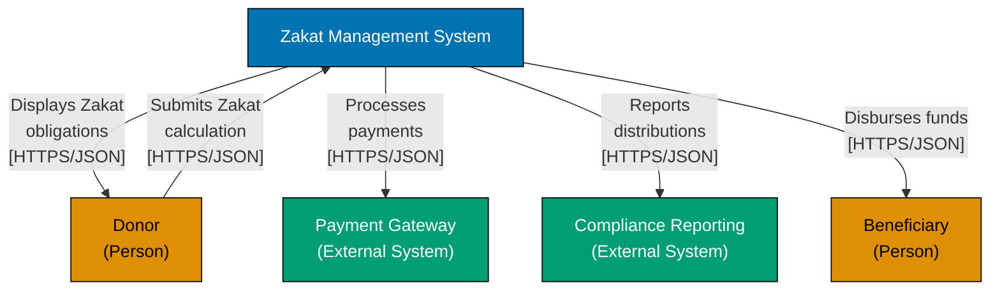
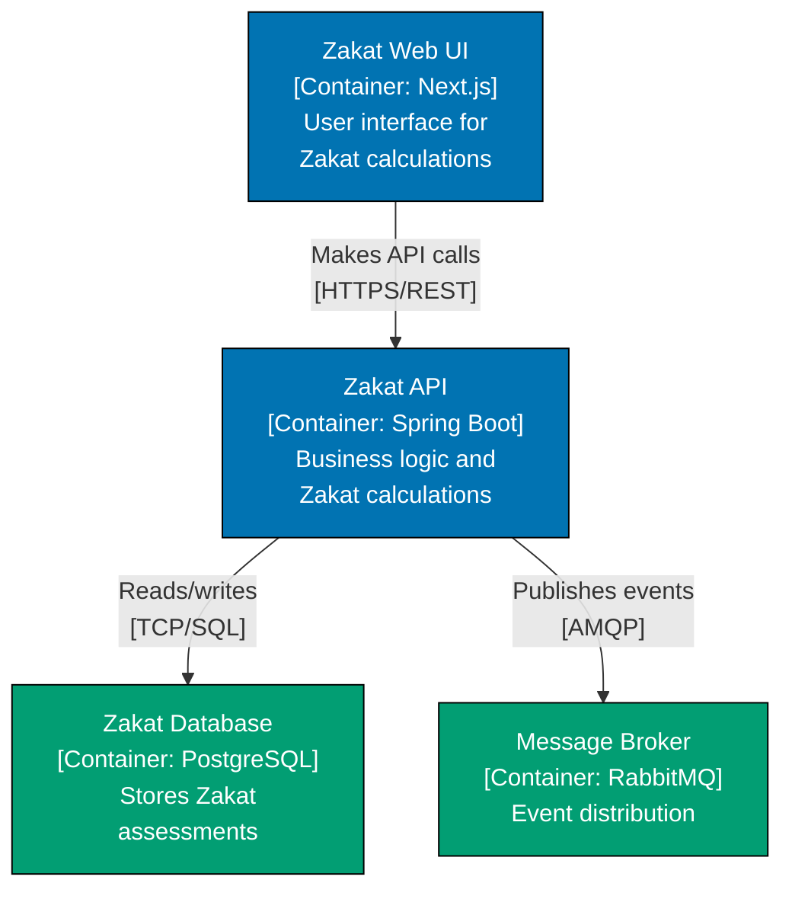

# C4 Architecture Model

**This is THE authoritative reference** for C4 architecture diagrams in OSE Platform.

All C4 diagrams created for the OSE Platform MUST comply with the standards documented here. These standards are mandatory, not optional. Non-compliance blocks documentation review and merge approval.

## Tool and Notation Stack

OSE Platform C4 diagrams MUST use the following tools and conventions:

**Primary Diagramming Tool:**

- **Mermaid** (graph TB syntax, NOT experimental C4 plugin)
- MUST be embedded in markdown files for version control
- MUST support diagram-as-code for automation

**Color Palette (REQUIRED):**

- **WCAG AA-compliant color-blind friendly palette**
- Blue: `#0173B2`, Orange: `#DE8F05`, Teal: `#029E73`, Purple: `#CC78BC`
- MUST meet accessibility standards for all visualizations

**Diagram Types:**

- **System Context** (Level 1) - REQUIRED for all systems
- **Container** (Level 2) - REQUIRED for systems with 2+ deployable units
- **Component** (Level 3) - OPTIONAL, only for complex containers
- **Code** (Level 4) - RARELY USED, prefer IDE-generated diagrams

**Integration Requirements:**

- MUST align C4 containers with DDD bounded contexts
- MUST show FSM states in component diagrams when applicable
- MUST visualize Nx workspace structure at container level

## Prerequisite Knowledge

**REQUIRED**: This documentation assumes you have completed the AyoKoding C4 Architecture Model learning path. These are **OSE Platform-specific C4 standards**, not educational tutorials.

**You MUST understand C4 fundamentals before using these standards:**

- **[C4 Architecture Model Learning Path](../../../../../apps/ayokoding-web/content/en/learn/software-engineering/architecture/c4-architecture-model/)** - Educational foundation for C4 visualization
- **[C4 Architecture Model Overview](../../../../../apps/ayokoding-web/content/en/learn/software-engineering/architecture/c4-architecture-model/overview.md)** - Core C4 concepts (Context, Container, Component, Code)
- **[C4 Architecture Model By Example](../../../../../apps/ayokoding-web/content/en/learn/software-engineering/architecture/c4-architecture-model/by-example/)** - Practical C4 diagram examples

**What this documentation covers**: OSE Platform-specific C4 patterns, Mermaid syntax conventions, color-blind friendly palettes, integration with DDD bounded contexts, repository diagram standards.

**What this documentation does NOT cover**: C4 fundamentals, basic diagram types, generic C4 notation (those are in ayokoding-web).

**See**: [Programming Language Documentation Separation Convention](../../../../../governance/conventions/structure/programming-language-docs-separation.md) for content separation rules.

## Software Engineering Principles

C4 Architecture diagrams in OSE Platform enforce three foundational software engineering principles:

1. **[Explicit Over Implicit](../../../../../governance/principles/software-engineering/explicit-over-implicit.md)** - MUST make system boundaries explicit through clear diagram levels, label all relationships with protocols and data formats, show technology choices on all containers, and define explicit integration patterns between bounded contexts

2. **[Reproducibility First](../../../../../governance/principles/software-engineering/reproducibility.md)** - MUST use diagram-as-code (Mermaid) for version control, standardized notation across all diagrams, WCAG-compliant color palette consistently, and automated diagram generation from architecture decision records

3. **[Automation Over Manual](../../../../../governance/principles/software-engineering/automation-over-manual.md)** - MUST automate diagram generation from code when possible, validate diagram accessibility in CI/CD, use consistent Mermaid templates, and regenerate diagrams from architectural changes

## OSE Platform C4 Standards (Authoritative)

**MUST follow these mandatory standards for all C4 diagrams in OSE Platform:**

1. **[Diagram Standards](./ex-soen-ar-c4armo__diagram-standards.md)** - When to create diagrams, diagram levels (Context/Container/Component), OSE-specific patterns
2. **[Notation Standards](./ex-soen-ar-c4armo__notation-standards.md)** - WCAG colors, Mermaid syntax, labeling conventions, accessibility requirements
3. **[Bounded Context Visualization](./ex-soen-ar-c4armo__bounded-context-visualization.md)** - Mapping DDD bounded contexts to C4 containers, context mapping patterns
4. **[Nx Workspace Visualization](./ex-soen-ar-c4armo__nx-workspace-visualization.md)** - Representing Nx apps and libs in C4 container diagrams
5. **[Tooling Standards](./ex-soen-ar-c4armo__tooling-standards.md)** - Mermaid setup, diagram validation, accessibility testing

## C4 Levels in OSE Platform

### Level 1: System Context (REQUIRED)

**REQUIRED**: All OSE Platform systems MUST have a System Context diagram.

**Purpose**: Show how the system fits into the broader ecosystem.

**MUST include**:

- The system boundary (single box)
- All external users/actors (people icons)
- All external systems (boxes)
- All relationships with protocols (arrows with labels)

**Example**: Zakat Management System context showing donors, beneficiaries, payment gateway, and compliance reporting systems.

**See**: [Diagram Standards](./ex-soen-ar-c4armo__diagram-standards.md#system-context-requirements)

### Level 2: Container (REQUIRED for multi-container systems)

**REQUIRED**: Systems with 2+ deployable units MUST have a Container diagram.

**Purpose**: Show the high-level technical building blocks.

**MUST include**:

- All deployable units (apps, services, databases)
- Technology stack for each container
- Communication protocols between containers
- Alignment with Nx workspace structure
- Alignment with DDD bounded contexts

**Example**: Zakat system showing zakat-calculation-service (Spring Boot), zakat-web-ui (Next.js), zakat-database (PostgreSQL), and message broker (RabbitMQ).

**See**: [Diagram Standards](./ex-soen-ar-c4armo__diagram-standards.md#container-requirements)

### Level 3: Component (OPTIONAL)

**OPTIONAL**: Only create for complex containers with 6+ internal components.

**Purpose**: Show internal structure of a single container.

**MUST include**:

- Major components/modules within the container
- Component responsibilities
- Internal communication patterns
- Integration with FSM states when applicable

**When to skip**: Simple containers with obvious structure, CRUD applications, thin API layers.

**See**: [Diagram Standards](./ex-soen-ar-c4armo__diagram-standards.md#component-requirements)

### Level 4: Code (RARELY USED)

**RARELY USED**: Prefer IDE-generated diagrams or code documentation.

**When to create**: Only when class relationships are architecturally significant (design patterns, framework extension points).

**Prefer instead**: IntelliJ IDEA UML diagrams, JavaDoc class hierarchies, code comments.

## Integration with OSE Platform Architecture

### DDD Bounded Contexts

**SHOULD**: C4 Container diagrams SHOULD use bounded contexts as primary guide for container boundaries.

- Common pattern: One Container = One Bounded Context (starting point for microservices)
- Container boundaries should align with bounded context boundaries
- Context mapping patterns visualized as container relationships
- Each container maintains single ubiquitous language

**See**: [Bounded Context Visualization](./ex-soen-ar-c4armo__bounded-context-visualization.md)

### Nx Workspace Structure

**REQUIRED**: C4 Container diagrams MUST reflect Nx workspace organization.

- Each `apps/` entry = One Container
- Shared `libs/` = Supporting components in Container diagrams
- Nx project dependencies visualized as container relationships

**See**: [Nx Workspace Visualization](./ex-soen-ar-c4armo__nx-workspace-visualization.md)

### FSM States

**OPTIONAL**: Component diagrams MAY show FSM states when state machines are architecturally significant.

- Show state machine as a component
- Label states and transitions
- Indicate which aggregates use the FSM

## Documentation Structure

### Quick Reference

**Mandatory Standards (All architects/developers MUST follow)**:

1. [Diagram Standards](./ex-soen-ar-c4armo__diagram-standards.md) - When to create diagrams, required levels
2. [Notation Standards](./ex-soen-ar-c4armo__notation-standards.md) - WCAG colors, Mermaid syntax, labeling
3. [Tooling Standards](./ex-soen-ar-c4armo__tooling-standards.md) - Mermaid setup, validation tools

**Context-Specific Standards (Apply when relevant)**:

- **DDD Integration**: [Bounded Context Visualization](./ex-soen-ar-c4armo__bounded-context-visualization.md) - Mapping bounded contexts to containers
- **Nx Monorepo**: [Nx Workspace Visualization](./ex-soen-ar-c4armo__nx-workspace-visualization.md) - Representing Nx apps/libs

## Validation and Compliance

C4 diagrams MUST pass the following validation checks:

1. **Accessibility Check**: WCAG AA color contrast verification
2. **Notation Check**: Mermaid syntax validation
3. **Label Check**: All relationships have descriptive labels with protocols
4. **Boundary Check**: Clear system/container/component boundaries
5. **Integration Check**: Alignment with DDD bounded contexts and Nx structure

**Validation Tools**:

- `npm run validate:diagrams` - Automated accessibility and syntax checking
- Manual review by architecture team

## Example: Zakat Management System

### System Context

### Container Diagram

## Related Documentation

- **[DDD Standards](../domain-driven-design-ddd/README.md)** - Domain-Driven Design alignment
- **[Diagram Convention](../../../../../governance/conventions/formatting/diagrams.md)** - Repository-wide diagram standards
- **[Nx Workspace Structure](../../../../reference/re__monorepo-structure.md)** - Monorepo organization

## Principles Implemented/Respected

This documentation implements/respects the following core principles:

- **[Explicit Over Implicit](../../../../../governance/principles/software-engineering/explicit-over-implicit.md)**: By requiring explicit labels on all relationships, clear technology choices on containers, and visible integration patterns, C4 diagrams eliminate hidden assumptions in architecture documentation.

- **[Reproducibility First](../../../../../governance/principles/software-engineering/reproducibility.md)**: By mandating diagram-as-code with Mermaid and standardized WCAG color palette, C4 diagrams can be consistently reproduced across teams and time periods.

- **[Automation Over Manual](../../../../../governance/principles/software-engineering/automation-over-manual.md)**: By using Mermaid syntax and automated validation tools, C4 diagram quality is enforced through CI/CD rather than manual review processes.

---

**Last Updated**: 2026-02-09
