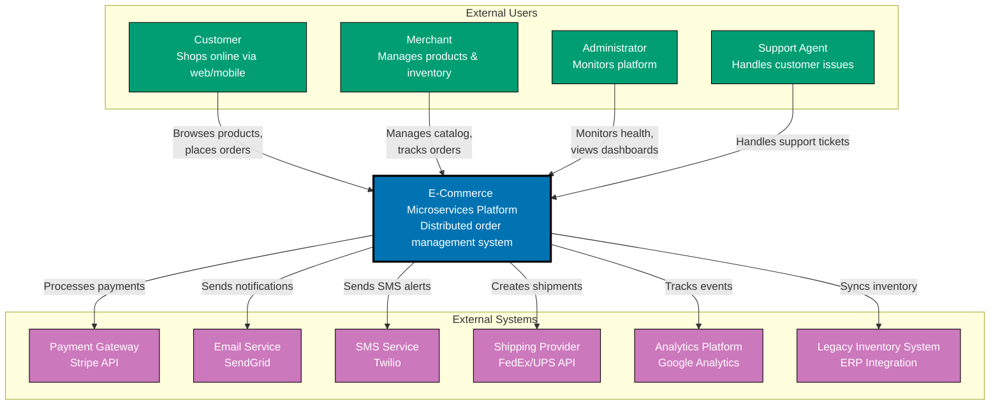

# Level 1: System Context Diagram

## Overview

**Purpose**: Shows how the software system fits into the world around it.

**Audience**: Everyone - executives, stakeholders, developers, operations teams.

**Contains**:

- The software system being documented (in scope)
- People who use the system (actors/personas)
- Other software systems the system interacts with (external dependencies)
- Relationships showing how they interact

**Key Questions Answered**:

- What does this system do?
- Who uses it?
- What other systems does it integrate with?
- What are the system boundaries?

**Example Elements**:

- **In Scope**: "Open Sharia Enterprise Platform - Monorepo with 8 applications"
- **External Users**: Developers, Content Authors, Learners, Enterprise Users
- **External Systems**: GitHub, Vercel, Kubernetes, Container Registry, DNS/CDN

**Best Practices**:

- Keep it high-level - no internal details
- One system context diagram per software system
- Show the big picture that everyone can understand
- Include major user types and external dependencies

System Context diagrams implement **[Explicit Over Implicit](../../../../../governance/principles/software-engineering/explicit-over-implicit.md)** by making system boundaries and external dependencies explicit. Every user type, external system, and integration point is visibly documented, eliminating hidden assumptions about system scope.

**When to Use**:

- Starting point for all architecture documentation
- Presenting to non-technical stakeholders
- Onboarding new team members
- Defining system scope and boundaries

**Example: E-Commerce Microservices Platform Context**

**Diagram Explanation**:

- **In Scope** (blue): E-Commerce Microservices Platform - the distributed system we're documenting
- **People** (teal): Multiple user types with different roles and access levels
- **External Systems** (purple): Third-party services for payments, notifications, shipping, analytics, and legacy system integration
- **Relationships**: Show how diverse users and external systems interact with the platform

This high-level view answers: "What does this distributed system do?" and "How does it fit into the broader ecosystem?" Notice we don't show internal microservices here - that's for the Container diagram.

## Related Principles

- **[Explicit Over Implicit](../../../../../governance/principles/software-engineering/explicit-over-implicit.md)** - System Context diagrams make system boundaries, user types, and external dependencies explicit
- **[Simplicity Over Complexity](../../../../../governance/principles/general/simplicity-over-complexity.md)** - High-level abstraction shows only essential elements, hiding internal complexity

See [C4 Model Best Practices](./ex-soen-ar-c4armo__14-best-practices.md) for comprehensive guidance.
