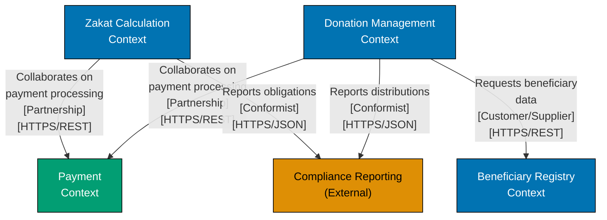
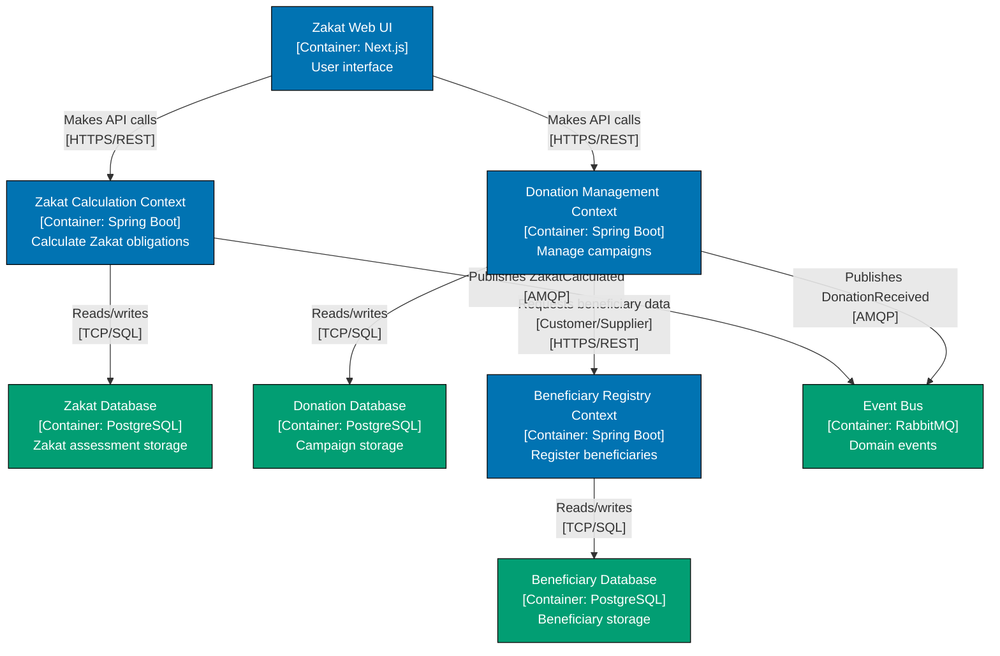
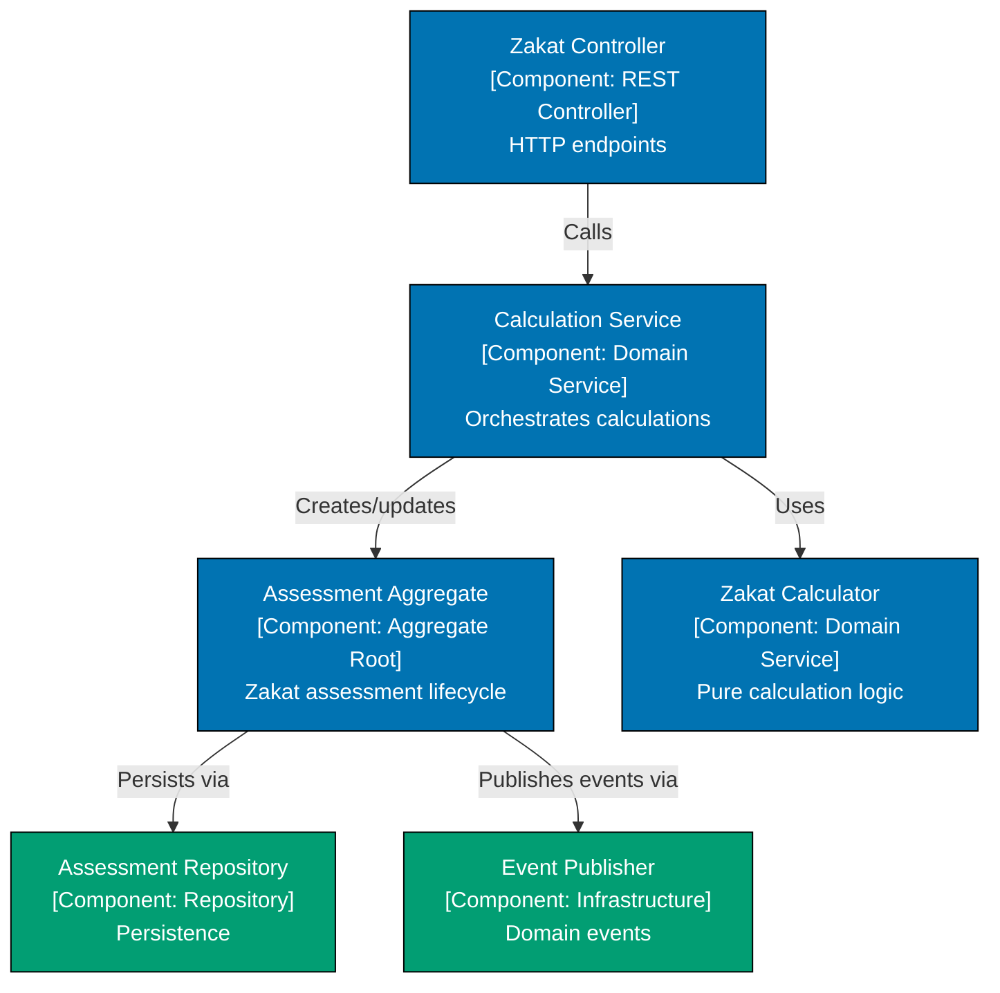
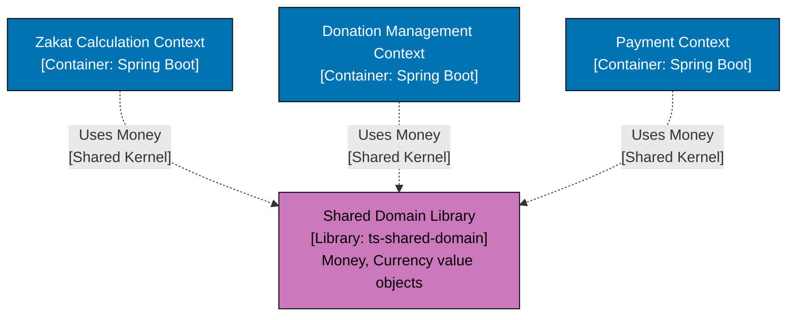

# C4 Bounded Context Visualization

## Prerequisite Knowledge

**REQUIRED**: You MUST understand both C4 and DDD fundamentals before using these standards:

- [AyoKoding C4 Architecture Model](../../../../../apps/ayokoding-web/content/en/learn/software-engineering/architecture/c4-architecture-model/)
- [AyoKoding Domain-Driven Design](../../../../../apps/ayokoding-web/content/en/learn/software-engineering/architecture/domain-driven-design-ddd/)

**This document is OSE Platform-specific**, defining how to visualize DDD bounded contexts in C4 diagrams for THIS codebase.

**See**: [Programming Language Documentation Separation Convention](../../../../../governance/conventions/structure/programming-language-docs-separation.md)

## Purpose

This document defines **authoritative standards** for visualizing DDD bounded contexts using C4 architecture diagrams in OSE Platform.

**Target Audience**: OSE Platform architects, DDD practitioners

**Scope**: Mapping bounded contexts to C4 containers, visualizing context mapping patterns

## Mapping Bounded Contexts to C4 Levels

### System Context = Enterprise Context Map

**System Context diagrams** show how bounded contexts relate across the entire enterprise.

- Each box = One bounded context
- Relationships = Context mapping patterns (Customer/Supplier, Partnership, etc.)

**Use when**: Documenting multiple bounded contexts and their relationships.

### Container = Bounded Context

**REQUIRED**: One Container = One Bounded Context (for microservices architecture).

- Container boundaries = Bounded context boundaries
- Each container represents a cohesive domain model with ubiquitous language
- Containers communicate via well-defined APIs (context mapping)

**Use when**: Documenting internal structure of a single system with multiple bounded contexts.

### Component = Aggregates and Domain Services

**OPTIONAL**: Component diagrams show tactical DDD patterns within a bounded context.

- Components = Aggregates, Domain Services, Repositories
- Show relationships between aggregates
- Show FSM states when applicable

**Use when**: Documenting complex bounded context internals.

## Bounded Context Container Requirements

### Container Naming

**REQUIRED**: Container names MUST reflect the bounded context name and domain.

**Format**: `"[Bounded Context Name] [Container: Technology] Domain responsibility"`

**Examples**:

- `"Zakat Calculation Context [Container: Spring Boot] Calculate Zakat obligations"`
- `"Donation Management Context [Container: Spring Boot] Manage campaigns and donations"`
- `"Beneficiary Registry Context [Container: Spring Boot] Register and verify beneficiaries"`

### Container Boundaries

**REQUIRED**: Container boundaries MUST align with bounded context boundaries.

- No shared database between bounded contexts
- Each bounded context has its own data store
- Communication only via APIs or events

### Context Mapping Patterns in C4

**REQUIRED**: Relationship labels MUST indicate context mapping patterns.

| Pattern              | C4 Label Format                                                    | Example                                                     |
| -------------------- | ------------------------------------------------------------------ | ----------------------------------------------------------- |
| Customer/Supplier    | `"Requests/provides [Pattern: Customer/Supplier] [HTTPS]"` | Donation Context requests beneficiary data from Registry    |
| Partnership          | `"Collaborates [Pattern: Partnership] [HTTPS]"`            | Zakat Context and Payment Context collaborate on processing |
| Shared Kernel        | `"Shares domain [Pattern: Shared Kernel] [Library]"`       | Multiple contexts share Money value object                  |
| Conformist           | `"Conforms to [Pattern: Conformist] [HTTPS]"`              | Reporting Context conforms to Zakat Context API             |
| Anticorruption Layer | `"Translates via ACL [Pattern: ACL] [HTTPS]"`              | Internal context wraps legacy external system               |
| Open Host Service    | `"Exposes API [Pattern: Open Host] [HTTPS/REST]"`          | Zakat Context exposes public API                            |
| Published Language   | `"Uses standard [Pattern: Published Language] [HTTPS]"`    | Multiple contexts use standard JSON Schema                  |

## Example: OSE Platform Bounded Contexts

### System Context (Enterprise Context Map)

### Container Diagram (Single System with Multiple Contexts)

## Component Diagram (Bounded Context Internals)

### OPTIONAL: Show Aggregates and Domain Services

**Component diagrams** can show tactical DDD patterns within a bounded context.

**Example: Zakat Calculation Context Internals**

## Shared Kernel Visualization

### REQUIRED: Show Shared Kernel as Supporting Components

**Shared Kernel** (shared domain models) should be shown as supporting components.

**Example: Money Value Object Shared Across Contexts**

**Note**: Use dashed lines (`-.->`) for library dependencies to distinguish from runtime communication.

## Validation Checklist

Before committing a bounded context visualization, verify:

- [ ] **One Container = One Bounded Context**: Container boundaries align with bounded context boundaries
- [ ] **No shared database**: Each bounded context has its own data store
- [ ] **Context mapping patterns labeled**: All relationships indicate the pattern (Customer/Supplier, Partnership, etc.)
- [ ] **Clear API boundaries**: Communication between contexts via well-defined APIs
- [ ] **Domain events shown**: Event-driven communication visualized through message broker
- [ ] **Shared Kernel visualized**: Shared domain models shown as supporting libraries

## Related Standards

- **[Diagram Standards](./ex-soen-ar-c4armo__diagram-standards.md)** - When to create diagrams, required levels
- **[DDD Standards](../domain-driven-design-ddd/README.md)** - Domain-Driven Design tactical patterns
- **[DDD Context Mapping](../domain-driven-design-ddd/ex-soen-ar-dodrdedd__bounded-context-standards.md)** - Context mapping pattern details

## Principles Implemented

- **[Explicit Over Implicit](../../../../../governance/principles/software-engineering/explicit-over-implicit.md)**: By explicitly labeling context mapping patterns on relationships and showing clear bounded context boundaries, architectural decisions become visible rather than hidden in code.

---

**Last Updated**: 2026-02-09
