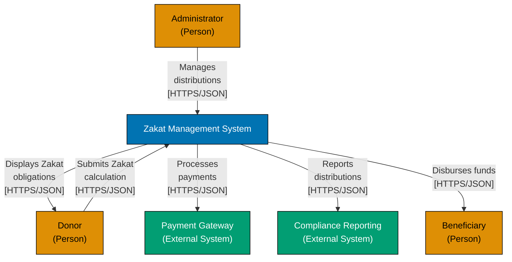
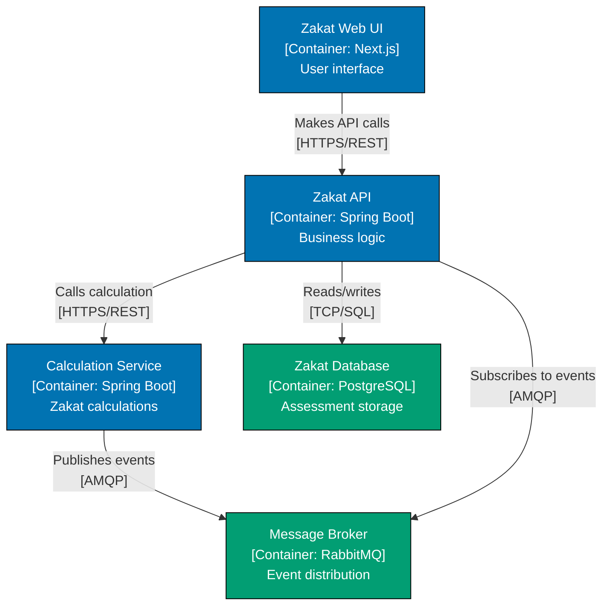

# C4 Diagram Standards

## Prerequisite Knowledge

**REQUIRED**: You MUST understand C4 fundamentals from [AyoKoding C4 Architecture Model](../../../../../apps/ayokoding-web/content/en/learn/software-engineering/architecture/c4-architecture-model/) before using these standards.

**This document is OSE Platform-specific**, not a C4 tutorial. We define HOW to apply C4 in THIS codebase, not WHAT C4 is.

**See**: [Programming Language Documentation Separation Convention](../../../../../governance/conventions/structure/programming-language-docs-separation.md)

## Purpose

This document defines **authoritative standards** for creating C4 architecture diagrams in the OSE Platform. These are prescriptive rules that MUST be followed to ensure consistency, maintainability, and alignment with platform architecture.

**Target Audience**: OSE Platform architects, developers, technical writers

**Scope**: When to create diagrams, required diagram levels, OSE-specific patterns

## When to Create C4 Diagrams

### System Context (Level 1)

**REQUIRED**: All OSE Platform systems MUST have a System Context diagram.

**Create when**:

- New system is added to the platform
- System boundary changes significantly
- External integrations are added or removed
- Documentation is being refreshed

**MUST NOT skip**: System Context is mandatory for all systems, no exceptions.

**Location**: `docs/explanation/software-engineering/architecture/[system-name]/context-diagram.md`

### Container (Level 2)

**REQUIRED**: Systems with 2+ deployable units MUST have a Container diagram.

**Create when**:

- System has multiple deployable units (apps, services, databases)
- Technology stack decisions need documentation
- Communication protocols between components need clarity
- New containers are added to existing system

**MAY skip**: Single-container systems (e.g., standalone CLI tool, single static site)

**Location**: `docs/explanation/software-engineering/architecture/[system-name]/container-diagram.md`

### Component (Level 3)

**OPTIONAL**: Only create for complex containers with 6+ internal components.

**Create when**:

- Container has complex internal structure (6+ major components)
- Component responsibilities need clarification
- Integration patterns within container are non-obvious
- FSM states are architecturally significant

**SHOULD skip**:

- Simple CRUD applications
- Thin API layers
- Containers with obvious structure
- Static sites without business logic

**Location**: `docs/explanation/software-engineering/architecture/[system-name]/[container-name]-component-diagram.md`

### Code (Level 4)

**RARELY USED**: Prefer IDE-generated diagrams or code documentation.

**Create when**:

- Class relationships are architecturally significant (design patterns, framework extension points)
- Onboarding documentation requires class-level detail
- Legacy system reverse engineering is needed

**PREFER instead**:

- IntelliJ IDEA UML diagrams
- JavaDoc class hierarchies
- Code comments and inline documentation

**Location**: Usually NOT created. If necessary: `docs/explanation/software-engineering/architecture/[system-name]/[component-name]-code-diagram.md`

## System Context Requirements

### REQUIRED Elements

All System Context diagrams MUST include:

1. **System boundary** - Single box representing the entire system
2. **External actors** - People who interact with the system (donors, administrators, auditors)
3. **External systems** - Other systems with which this system integrates
4. **Relationships** - Labeled arrows showing data flow and protocols

### Labeling Requirements

**MUST label all relationships** with:

- Action description (e.g., "Submits Zakat calculation")
- Protocol (e.g., "[HTTPS/JSON]", "[AMQP]", "[gRPC]")

**Format**: `"Action description<br/>[Protocol]"`

**Example**:

```mermaid
Donor -->|"Submits Zakat<br/>calculation<br/>[HTTPS/JSON]"| ZMS
```

### OSE-Specific Patterns

**Islamic Finance Systems**:

- MUST show all user roles (donors, beneficiaries, administrators, auditors, Shariah advisors)
- MUST show compliance/reporting systems as external
- MUST show payment gateways as external systems

**Example Context Diagram**:



## Container Requirements

### REQUIRED Elements

All Container diagrams MUST include:

1. **All deployable units** - Apps, services, databases, message brokers
2. **Technology stack** - Framework/language for each container (e.g., "[Container: Spring Boot]")
3. **Communication protocols** - HTTP/REST, gRPC, AMQP, SQL, etc.
4. **Data stores** - Databases, caches, file systems
5. **Message infrastructure** - Event buses, queues, topics

### Container Naming Convention

**Format**: `[Purpose] [Type]<br/>[Container: Technology]<br/>Description`

**Examples**:

- `"Zakat Web UI<br/>[Container: Next.js]<br/>User interface for<br/>Zakat calculations"`
- `"Zakat API<br/>[Container: Spring Boot]<br/>Business logic and<br/>Zakat calculations"`
- `"Zakat Database<br/>[Container: PostgreSQL]<br/>Stores Zakat<br/>assessments"`

### Alignment with Nx Workspace

**REQUIRED**: Container diagrams MUST align with Nx workspace structure.

- Each `apps/[app-name]` → One Container
- Shared `libs/` → Supporting components (shown when architecturally significant)
- Container boundaries match Nx project boundaries

### Alignment with DDD Bounded Contexts

**SHOULD**: Container diagrams SHOULD use bounded contexts as primary guide for container boundaries.

- Common pattern: One Container = One Bounded Context (starting point for microservices)
- Container boundaries should align with bounded context boundaries
- Context mapping patterns visualized as container relationships
- Each container maintains single ubiquitous language

**Example Container Diagram**:



## Component Requirements

### When to Create

**OPTIONAL**: Only create Component diagrams when:

- Container has 6+ major internal components
- Component responsibilities need documentation
- Integration patterns within container are non-obvious
- FSM states are architecturally significant

### REQUIRED Elements

All Component diagrams MUST include:

1. **Major components** - Controllers, services, repositories, domain models
2. **Component responsibilities** - Brief description of each component's purpose
3. **Internal communication** - How components interact
4. **External interfaces** - Entry points and exit points

### Component Naming Convention

**Format**: `[Responsibility]<br/>[Component: Type]<br/>Description`

**Examples**:

- `"Zakat Controller<br/>[Component: REST Controller]<br/>HTTP endpoints"`
- `"Calculation Service<br/>[Component: Domain Service]<br/>Zakat calculations"`
- `"Assessment Repository<br/>[Component: Repository]<br/>Data persistence"`

### FSM Integration

**OPTIONAL**: Component diagrams MAY show FSM states when state machines are architecturally significant.

**Show**:

- State machine as a component
- States and transitions
- Which aggregates use the FSM

## Validation Checklist

Before committing a C4 diagram, verify:

- [ ] **Level appropriate**: Using correct diagram level for the detail shown
- [ ] **All relationships labeled**: Every arrow has description and protocol
- [ ] **Technology stack visible**: All containers show their technology
- [ ] **WCAG colors**: Using approved color palette
- [ ] **Mermaid syntax**: Valid Mermaid graph syntax
- [ ] **Nx alignment**: Containers match Nx workspace structure
- [ ] **DDD alignment**: Containers align with bounded contexts
- [ ] **Clear boundaries**: System/container/component boundaries are explicit

## Color Consistency (CRITICAL)

**REQUIRED**: All C4 diagrams MUST follow the consistent color mapping defined in [Notation Standards](./ex-soen-ar-c4armo__notation-standards.md).

**Quick Reference**:

- **Orange (#DE8F05)**: Person (users, actors)
- **Blue (#0173B2)**: This System / Internal Containers / Core Components
- **Teal (#029E73)**: External Systems / Databases / Infrastructure Components
- **Purple (#CC78BC)**: Future/Planned elements (optional)

This consistency ensures readers can instantly recognize element types by color across all C4 documentation.

## Related Standards

- **[Notation Standards](./ex-soen-ar-c4armo__notation-standards.md)** - WCAG colors, Mermaid syntax, labeling conventions, C4 element color mapping
- **[Bounded Context Visualization](./ex-soen-ar-c4armo__bounded-context-visualization.md)** - Mapping DDD bounded contexts to C4 containers
- **[Nx Workspace Visualization](./ex-soen-ar-c4armo__nx-workspace-visualization.md)** - Representing Nx apps and libs
- **[Color Accessibility Convention](../../../../../governance/conventions/formatting/color-accessibility.md)** - Verified accessible color palette and WCAG compliance

## Principles Implemented

- **[Explicit Over Implicit](../../../../../governance/principles/software-engineering/explicit-over-implicit.md)**: All relationships must have explicit labels with protocols, technology choices must be visible on containers, and system boundaries must be clearly defined.

---

**Last Updated**: 2026-02-09
