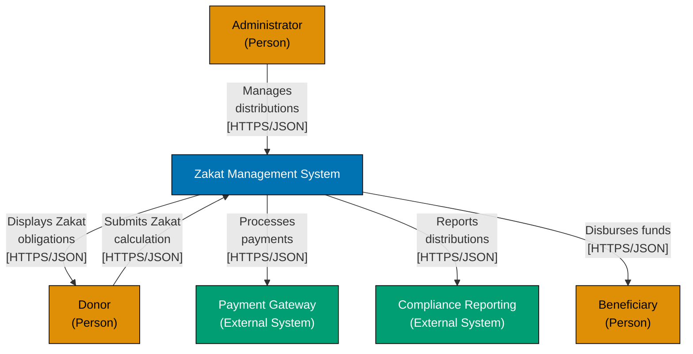
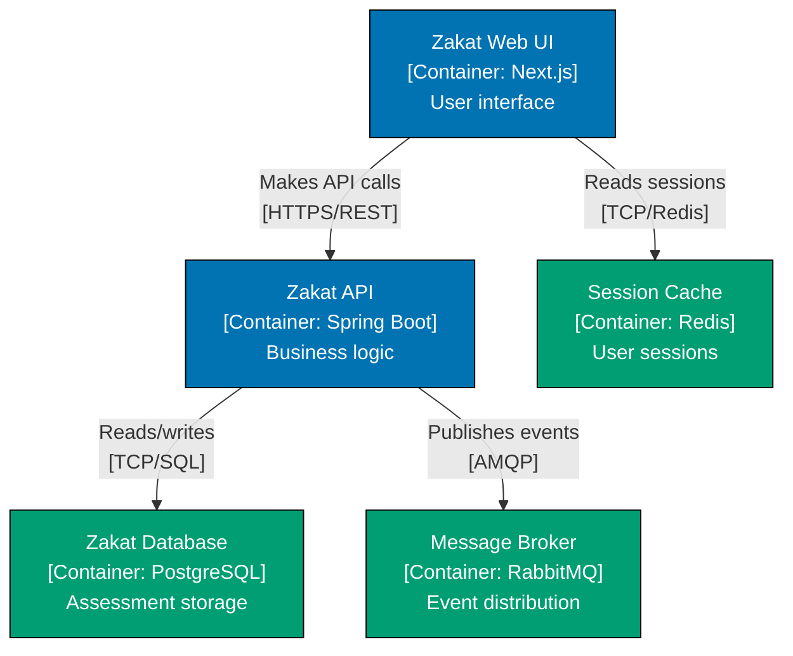

# C4 Notation Standards

## Prerequisite Knowledge

**REQUIRED**: You MUST understand C4 fundamentals from [AyoKoding C4 Architecture Model](../../../../../apps/ayokoding-web/content/en/learn/software-engineering/architecture/c4-architecture-model/) before using these standards.

**This document is OSE Platform-specific**, not a C4 tutorial. We define HOW to apply C4 notation in THIS codebase, not WHAT C4 notation is.

**See**: [Programming Language Documentation Separation Convention](../../../../../governance/conventions/structure/programming-language-docs-separation.md)

## Purpose

This document defines **authoritative notation standards** for C4 diagrams in OSE Platform, ensuring accessibility, consistency, and maintainability.

**Target Audience**: OSE Platform architects, developers, technical writers

**Scope**: WCAG colors, Mermaid syntax, labeling conventions, accessibility requirements

## Color Palette (REQUIRED)

### WCAG AA-Compliant Colors

**REQUIRED**: All C4 diagrams MUST use the following color-blind friendly palette.

These colors meet WCAG AA contrast standards and are distinguishable for all types of color blindness.

| Color Name | Hex Code | Usage                        | Text Color |
| ---------- | -------- | ---------------------------- | ---------- |
| Blue       | #0173B2  | Primary systems/containers   | White #FFF |
| Orange     | #DE8F05  | External actors (people)     | Black #000 |
| Teal       | #029E73  | External systems/data stores | White #FFF |
| Purple     | #CC78BC  | Optional/future components   | Black #000 |

### Mermaid Class Definitions

**REQUIRED**: Use these exact Mermaid class definitions in all diagrams.

```mermaid
classDef blue fill:#0173B2,stroke:#000,color:#FFF
classDef orange fill:#DE8F05,stroke:#000,color:#000
classDef teal fill:#029E73,stroke:#000,color:#FFF
classDef purple fill:#CC78BC,stroke:#000,color:#000
```

### Color Usage Rules

**System Context Diagrams**:

- **Blue**: The system being documented
- **Orange**: External actors (people)
- **Teal**: External systems

**Container Diagrams**:

- **Blue**: Internal containers (apps, services)
- **Teal**: Data stores (databases, caches, message brokers)
- **Purple**: OPTIONAL, future/planned containers

**Component Diagrams**:

- **Blue**: Core components (controllers, services)
- **Teal**: Infrastructure components (repositories, clients)
- **Purple**: OPTIONAL, experimental/future components

### Prohibited Colors

**MUST NOT use**:

- ❌ Red (common color blindness issue)
- ❌ Green (common color blindness issue)
- ❌ Yellow (low contrast)
- ❌ Gray (low contrast, unclear semantic meaning)
- ❌ Any colors not in the approved palette

## Mermaid Syntax Standards

### Graph Direction

**REQUIRED**: Use `graph TD` (top-down) for all C4 diagrams.

```mermaid
graph TD
    %% diagram content here
```

**PROHIBITED**: Do NOT use `graph LR` (left-right), as it makes long labels hard to read.

### Node Definition Format

**REQUIRED**: All nodes MUST use bracket notation with descriptive labels.

**Format**: `NodeID["Label<br/>Additional info"]:::className`

**Example**:

```mermaid
ZMS["Zakat Management System<br/>[System]"]:::blue
API["Zakat API<br/>[Container: Spring Boot]<br/>Business logic"]:::blue
```

### Relationship Labels

**REQUIRED**: All relationships MUST have descriptive labels with protocols.

**Format**: `-->|"Action description<br/>[Protocol]"|`

**Examples**:

```mermaid
Web -->|"Makes API calls<br/>[HTTPS/REST]"| API
API -->|"Reads/writes<br/>[TCP/SQL]"| DB
API -->|"Publishes events<br/>[AMQP]"| MQ
```

**Protocol Notation**:

- `[HTTPS/REST]` - RESTful HTTP APIs
- `[HTTPS/JSON]` - Generic HTTP with JSON payload
- `[HTTPS/GraphQL]` - GraphQL APIs
- `[gRPC]` - gRPC services
- `[TCP/SQL]` - Database connections
- `[AMQP]` - Message queue protocols
- `[WebSocket]` - WebSocket connections
- `[TCP/Redis]` - Redis connections

### Line Breaks

**REQUIRED**: Use `<br/>` for line breaks in multi-line labels.

**Good**:

```mermaid
API["Zakat API<br/>[Container: Spring Boot]<br/>Business logic"]:::blue
```

**Bad** (no line breaks):

```mermaid
API["Zakat API [Container: Spring Boot] Business logic"]:::blue
```

## Labeling Conventions

### System Context Labels

**System Box**:

- Format: `"[System Name]"`
- Example: `"Zakat Management System"`

**External Actors**:

- Format: `"[Role]<br/>(Person)"`
- Example: `"Donor<br/>(Person)"`

**External Systems**:

- Format: `"[System Name]<br/>(External System)"`
- Example: `"Payment Gateway<br/>(External System)"`

### Container Labels

**Containers**:

- Format: `"[Purpose] [Type]<br/>[Container: Technology]<br/>Description"`
- Example: `"Zakat Web UI<br/>[Container: Next.js]<br/>User interface for<br/>Zakat calculations"`

**Data Stores**:

- Format: `"[Purpose] [Type]<br/>[Container: Technology]<br/>Storage description"`
- Example: `"Zakat Database<br/>[Container: PostgreSQL]<br/>Stores Zakat<br/>assessments"`

### Component Labels

**Components**:

- Format: `"[Responsibility]<br/>[Component: Type]<br/>Description"`
- Example: `"Calculation Service<br/>[Component: Domain Service]<br/>Zakat calculations"`

## Accessibility Requirements

### WCAG AA Compliance

**REQUIRED**: All diagrams MUST meet WCAG AA contrast standards.

- **Minimum contrast ratio**: 4.5:1 for text
- **Large text**: 3:1 (18pt+ or 14pt+ bold)
- **Color-blind friendly**: All colors distinguishable for protanopia, deuteranopia, tritanopia

### Alternative Text

**REQUIRED**: All diagram code blocks MUST have descriptive alt text in the surrounding markdown.

**Example**:

```markdown
**System Context Diagram**: The Zakat Management System interacts with donors, beneficiaries, payment gateway, and compliance reporting systems via HTTPS/JSON protocols.

[diagram code block here]
```

### Screen Reader Support

**SHOULD provide**:

- Descriptive heading before diagram
- Text summary of key relationships
- Link to textual architecture documentation

## Complete Example

### System Context Diagram



### Container Diagram



## Validation Checklist

Before committing a C4 diagram, verify:

- [ ] **Colors**: Using only approved WCAG palette
- [ ] **Syntax**: Valid Mermaid `graph TD` syntax
- [ ] **Labels**: All relationships have action + protocol
- [ ] **Line breaks**: Using `<br/>` for multi-line labels
- [ ] **Class definitions**: Mermaid classDef declarations present
- [ ] **Contrast**: Text color appropriate for background (white on blue/teal, black on orange/purple)
- [ ] **Alt text**: Descriptive markdown text surrounding diagram
- [ ] **Protocol notation**: Using standardized protocol notation

## Related Standards

- **[Diagram Standards](./ex-soen-ar-c4armo__diagram-standards.md)** - When to create diagrams, required levels
- **[Diagram Convention](../../../../../governance/conventions/formatting/diagrams.md)** - Repository-wide diagram standards

## Principles Implemented

- **[Explicit Over Implicit](../../../../../governance/principles/software-engineering/explicit-over-implicit.md)**: All relationships must have explicit labels with protocols. Technology choices must be explicitly shown in container labels. No implicit relationships without labels.

- **[Reproducibility First](../../../../../governance/principles/software-engineering/reproducibility.md)**: Standardized WCAG color palette and Mermaid syntax ensures diagrams can be consistently reproduced across teams and time periods.

---

**Last Updated**: 2026-02-09
