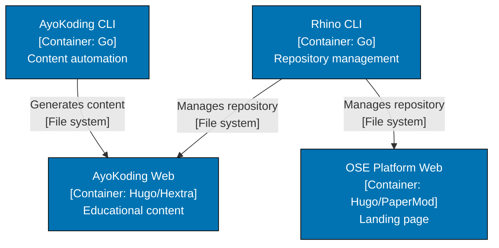
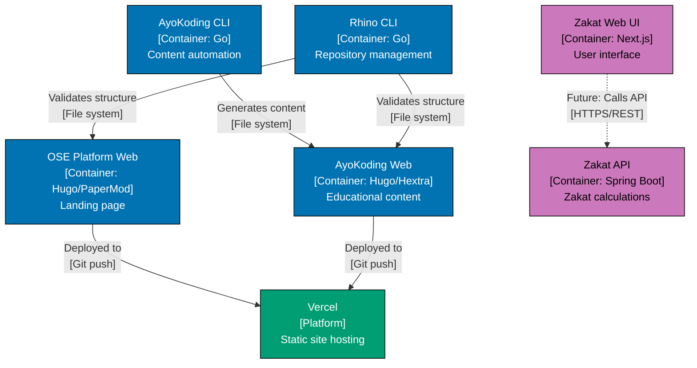

# C4 Nx Workspace Visualization

## Prerequisite Knowledge

**REQUIRED**: You MUST understand C4 fundamentals from [AyoKoding C4 Architecture Model](../../../../../apps/ayokoding-web/content/en/learn/software-engineering/architecture/c4-architecture-model/) before using these standards.

**This document is OSE Platform-specific**, defining how to visualize Nx workspace structure in C4 diagrams for THIS codebase.

**See**: [Programming Language Documentation Separation Convention](../../../../../governance/conventions/structure/programming-language-docs-separation.md)

## Purpose

This document defines **authoritative standards** for visualizing Nx monorepo structure using C4 container diagrams in OSE Platform.

**Target Audience**: OSE Platform architects, Nx developers

**Scope**: Mapping Nx apps and libs to C4 containers, visualizing Nx project dependencies

## Mapping Nx Structure to C4

### Apps → Containers

**REQUIRED**: Each `apps/[app-name]` entry = One C4 Container.

**Nx Structure**:

```
apps/
├── oseplatform-web/        # Hugo static site
├── ayokoding-web/          # Hugo static site
├── ayokoding-cli/          # Go CLI tool
└── rhino-cli/              # Go CLI tool
```

**C4 Container Diagram**:



### Libs → Supporting Components

**OPTIONAL**: Show `libs/` as supporting components when architecturally significant.

**When to show libs**:

- Shared domain models (e.g., `libs/ts-shared-domain/`)
- Reusable utilities used by multiple apps
- Infrastructure abstractions (e.g., `libs/ts-http-client/`)

**When NOT to show libs**:

- Internal implementation details
- Single-use utilities
- Test helpers

### Nx Project Dependencies → Relationships

**REQUIRED**: Nx project dependencies MUST be visualized as container relationships.

**Example**:

If `ayokoding-cli` has an Nx dependency on `ayokoding-web` (builds it), show this as a relationship in the container diagram.

## Container Naming for Nx Apps

### Format

**REQUIRED**: Container names MUST match Nx app names and show technology.

**Format**: `"[App Display Name]<br/>[Container: Technology]<br/>Purpose"`

**Examples**:

- `"OSE Platform Web<br/>[Container: Hugo/PaperMod]<br/>Landing page and platform documentation"`
- `"AyoKoding Web<br/>[Container: Hugo/Hextra]<br/>Bilingual educational content"`
- `"AyoKoding CLI<br/>[Container: Go]<br/>Content automation for Hugo site"`
- `"Zakat API<br/>[Container: Spring Boot]<br/>Zakat calculation business logic"`

## Example: OSE Platform Container Diagram

### Full Platform View



**Note**: Use purple for future/planned containers with dashed lines (`-.->`) for planned relationships.

## Nx Project Graph Integration

### OPTIONAL: Reference Nx Project Graph

C4 container diagrams can reference the Nx project graph for detailed dependency analysis.

**Add note in diagram documentation**:

> For detailed Nx project dependencies, run `nx graph` or visit the [Nx Project Graph documentation](../../../../reference/re__monorepo-structure.md).

### Visualization Strategy

**Simple projects** (1-5 apps):

- Show all apps as containers
- Show key libs as supporting components
- Show all Nx project dependencies

**Complex projects** (6+ apps):

- Group related apps by domain (Zakat, Donation, Beneficiary)
- Show only major Nx dependencies
- Create multiple focused container diagrams per domain

## Validation Checklist

Before committing an Nx workspace visualization, verify:

- [ ] **Apps mapped**: All Nx apps shown as C4 containers
- [ ] **Technology shown**: Each container specifies framework/language
- [ ] **Nx dependencies visualized**: Key project dependencies shown as relationships
- [ ] **Libs selectively shown**: Only architecturally significant libs included
- [ ] **Future apps distinguished**: Planned containers use purple with dashed lines
- [ ] **Deployment shown**: Infrastructure (Vercel, databases) included

## Related Standards

- **[Diagram Standards](./ex-soen-ar-c4armo__diagram-standards.md)** - When to create diagrams, required levels
- **[Nx Workspace Structure](../../../../reference/re__monorepo-structure.md)** - Monorepo organization reference

## Principles Implemented

- **[Explicit Over Implicit](../../../../../governance/principles/software-engineering/explicit-over-implicit.md)**: By explicitly mapping Nx apps to C4 containers and showing project dependencies, the monorepo structure becomes visible in architecture documentation rather than hidden in `nx.json`.

---

**Last Updated**: 2026-02-09
