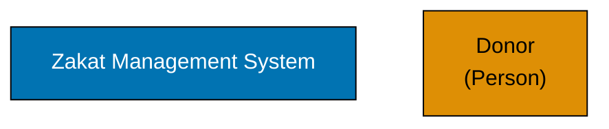

# C4 Tooling Standards

## Prerequisite Knowledge

**REQUIRED**: You MUST understand C4 fundamentals from [AyoKoding C4 Architecture Model](../../../../../apps/ayokoding-web/content/en/learn/software-engineering/architecture/c4-architecture-model/) before using these standards.

**This document is OSE Platform-specific**, defining required tools and validation methods for THIS codebase.

**See**: [Programming Language Documentation Separation Convention](../../../../../governance/conventions/structure/programming-language-docs-separation.md)

## Purpose

This document defines **authoritative tooling standards** for creating and validating C4 diagrams in OSE Platform.

**Target Audience**: OSE Platform architects, developers, technical writers

**Scope**: Tool selection, setup, validation, automation

## Required Tools

### Primary: Mermaid

**REQUIRED**: All C4 diagrams MUST use Mermaid.

**Why Mermaid**:

- Diagram-as-code for version control
- Renders in GitHub, GitLab, markdown viewers
- No external dependencies or cloud services
- Simple syntax for quick iteration

**Syntax**: `graph TD` (top-down), NOT experimental C4 plugin

**Installation**: No installation required - Mermaid renders automatically in markdown.

### Prohibited Tools

**MUST NOT use**:

- ❌ **Mermaid C4 Plugin** - Experimental, inconsistent rendering, limited adoption
- ❌ **PlantUML C4 Extension** - External dependency, not GitHub-native, complex setup
- ❌ **Structurizr** - Paid licensing, vendor lock-in, not markdown-embeddable
- ❌ **draw.io / Lucidchart** - Binary formats, not version-controllable, manual updates

**Why prohibited**:

- Violates diagram-as-code principle
- Not reproducible across environments
- Requires manual updates (not automatable)
- Not accessible in markdown files

## Editor Setup

### VS Code (Recommended)

**REQUIRED extensions**:

1. **Markdown Preview Mermaid Support** (`bierner.markdown-mermaid`)
   - Renders Mermaid diagrams in markdown preview
   - Real-time syntax validation
2. **Mermaid Markdown Syntax Highlighting** (`bpruitt-goddard.mermaid-markdown-syntax-highlighting`)
   - Syntax highlighting for Mermaid code blocks
   - Error detection

**Installation**:

```bash
code --install-extension bierner.markdown-mermaid
code --install-extension bpruitt-goddard.mermaid-markdown-syntax-highlighting
```

### Other Editors

**Obsidian**:

- Native Mermaid support in markdown preview
- No plugins required

**IntelliJ IDEA**:

- Install "Mermaid" plugin from JetBrains Marketplace
- Renders Mermaid diagrams in markdown preview

**Vim/Neovim**:

- Use `mermaid.vim` plugin for syntax highlighting
- Preview in browser using `markdown-preview.nvim`

## Validation Tools

### Mermaid CLI (Optional)

**OPTIONAL**: For automated validation in CI/CD.

**Installation**:

```bash
npm install -g @mermaid-js/mermaid-cli
```

**Usage**:

```bash
# Validate syntax
mmdc -i diagram.md -o output.svg

# Batch validate
find docs -name "*.md" -exec mmdc -i {} -o /tmp/test.svg \;
```

### Accessibility Validation

**REQUIRED**: All diagrams MUST pass WCAG AA contrast validation.

**Tool**: WebAIM Contrast Checker (<https://webaim.org/resources/contrastchecker/>)

**Validate**:

- Blue #0173B2 on white background: ✅ Passes (contrast ratio 4.5:1)
- Orange #DE8F05 on white background: ✅ Passes (contrast ratio 4.5:1)
- Teal #029E73 on white background: ✅ Passes (contrast ratio 4.5:1)

**Automated validation** (future):

```bash
# Future: npm run validate:diagrams
# Will extract colors from Mermaid diagrams and validate WCAG compliance
```

## Diagram-as-Code Workflow

### 1. Create Diagram

**Create markdown file** with Mermaid code block:

````markdown
# System Context

**System Context Diagram**: The Zakat Management System interacts with donors, beneficiaries, payment gateway, and compliance reporting systems.


````

### 2. Preview Locally

**Use editor preview**:

- VS Code: Open markdown preview (Cmd+Shift+V / Ctrl+Shift+V)
- Obsidian: Preview mode
- IntelliJ IDEA: Markdown preview pane

**Verify**:

- Diagram renders correctly
- Colors match WCAG palette
- Labels are readable
- Relationships are clear

### 3. Validate Syntax

**Run Mermaid CLI** (optional):

```bash
mmdc -i docs/architecture/system-context.md -o /tmp/test.svg
```

**Fix any syntax errors** reported.

### 4. Commit to Git

**Commit markdown file**:

```bash
git add docs/explanation/software-engineering/architecture/zakat-system/context-diagram.md
git commit -m "docs(architecture): add Zakat system context diagram"
```

**Diagram is now version-controlled** and will render on GitHub.

## CI/CD Integration

### Future: Automated Validation

**Planned validation script** (`npm run validate:diagrams`):

```bash
#!/bin/bash
# Future implementation

# 1. Find all markdown files with Mermaid diagrams
# 2. Validate Mermaid syntax
# 3. Extract colors and validate WCAG compliance
# 4. Check for required labels on relationships
# 5. Verify class definitions match approved palette

echo "Validating C4 diagrams..."
# Implementation pending
```

### Pre-commit Hook

**Future: Add to `.husky/pre-commit`**:

```bash
# Validate diagrams before commit
npm run validate:diagrams
```

## Migration from Other Tools

### From PlantUML

**If existing PlantUML diagrams exist**:

1. Extract diagram structure (boxes, relationships)
2. Convert to Mermaid `graph TD` syntax
3. Apply WCAG color palette
4. Add protocol labels to relationships
5. Validate rendering

**Do NOT**:

- ❌ Keep PlantUML diagrams (violates tooling standards)
- ❌ Use automated converters (often produce invalid Mermaid)

### From draw.io / Lucidchart

**Manual conversion required**:

1. Identify all boxes and relationships in binary diagram
2. Recreate in Mermaid using C4 notation standards
3. Apply WCAG color palette
4. Add protocol labels
5. Validate rendering

**Benefits of conversion**:

- Version-controllable diagrams
- Automated validation
- Consistent notation across platform

## Validation Checklist

Before committing a C4 diagram, verify:

- [ ] **Mermaid syntax**: Valid `graph TD` syntax
- [ ] **Renders correctly**: Preview shows diagram as intended
- [ ] **WCAG colors**: Using approved palette only
- [ ] **Labels present**: All relationships have descriptive labels
- [ ] **Class definitions**: Mermaid classDef declarations match approved colors
- [ ] **Markdown embedded**: Diagram is in markdown file, not binary format
- [ ] **Alt text present**: Descriptive text surrounding diagram

## Related Standards

- **[Notation Standards](./ex-soen-ar-c4armo__notation-standards.md)** - WCAG colors, Mermaid syntax, labeling
- **[Diagram Standards](./ex-soen-ar-c4armo__diagram-standards.md)** - When to create diagrams, required levels

## Principles Implemented

- **[Automation Over Manual](../../../../../governance/principles/software-engineering/automation-over-manual.md)**: By using diagram-as-code with Mermaid and automated validation tools, diagram quality is enforced through CI/CD rather than manual review.

- **[Reproducibility First](../../../../../governance/principles/software-engineering/reproducibility.md)**: By mandating Mermaid with standardized syntax and color palette, diagrams can be consistently reproduced across environments, editors, and time periods.

---

**Last Updated**: 2026-02-09
