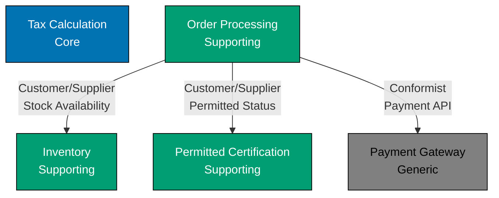
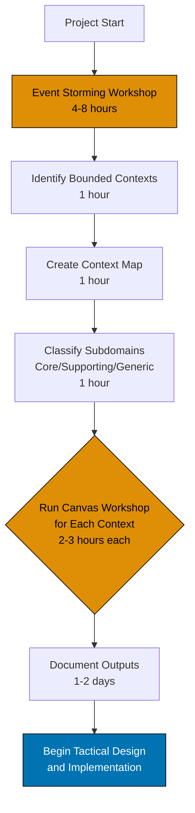

# Strategic Design Process

## What is Strategic Design?

**Strategic Design** is the practice of discovering and modeling the large-scale structure of a system before diving into implementation details. It focuses on understanding the business domain, identifying bounded contexts, classifying subdomains, and planning context relationships.

Strategic design answers questions like:

- What are the key business capabilities?
- Where are the natural boundaries in our domain?
- Which parts of the system provide competitive advantage?
- How should different parts of the system integrate?
- What problems should we tackle first?

**Strategic vs. Tactical:**

- **Strategic Design**: High-level architecture (Bounded Contexts, Subdomains, Context Maps)
- **Tactical Design**: Implementation patterns (Aggregates, Entities, Value Objects, Repositories)

**Critical Insight**: Strategic design must precede tactical patterns. Beautiful aggregates in the wrong bounded context provide no value.

## Why Strategic Design Matters

### The Problem: Diving into Implementation Too Soon

Without strategic design, teams make costly mistakes:

**1. Wrong Boundaries**

Building a monolithic "Product" entity used everywhere:

- Shopping catalog needs images and descriptions
- Inventory needs stock levels and warehouse locations
- Permitted certification needs ingredients and suppliers
- One bloated entity trying to satisfy all contexts

**2. Missing Business Priorities**

Spending months on generic admin panels while core business logic remains poorly designed:

- Generic subdomains get over-engineered
- Core domain gets rushed
- Competitors catch up

**3. Unplanned Integration**

Discovering late that contexts need to integrate:

- Hasty point-to-point integrations
- Tight coupling between contexts
- Model corruption from legacy systems

**4. Misaligned Teams**

Teams working on overlapping areas without coordination:

- Duplicate work
- Conflicting models
- Integration nightmares

### The Solution: Strategic Design Process

A structured process for discovering and modeling the domain:

**Benefits:**

- **Shared Understanding**: Domain experts and developers aligned
- **Right Boundaries**: Bounded contexts match business capabilities
- **Clear Priorities**: Focus on core domain first
- **Planned Integration**: Context relationships explicit and managed
- **Team Alignment**: Clear ownership and communication patterns

## Big Picture Event Storming

**Event Storming** is a collaborative workshop technique for rapidly discovering domain knowledge and bounded contexts. Invented by Alberto Brandolini, it's the most effective way to start strategic design.

### What is Event Storming?

A workshop where:

- **Participants**: Domain experts, developers, product owners, stakeholders
- **Format**: Collaborative, sticky-note-based, visual
- **Duration**: 4-8 hours (can split across multiple sessions)
- **Output**: Timeline of domain events, bounded contexts, commands, policies, and hotspots

**Why it Works:**

- **Visual**: Everyone sees the big picture
- **Collaborative**: No single person dominates
- **Fast**: Covers massive scope in hours
- **Fun**: Engaging, energetic, creative
- **Revealing**: Surfaces disagreements and gaps quickly

### Materials Needed

**Space:**

- Large wall or whiteboard (3-5 meters wide)
- Room for 5-15 people to stand and move around

**Supplies:**

- **Orange sticky notes**: Domain Events
- **Blue sticky notes**: Commands
- **Yellow sticky notes**: Aggregates/Entities
- **Pink sticky notes**: Hotspots/Questions
- **Purple sticky notes**: Policies/Business Rules
- **Green sticky notes**: Read Models/Views
- **Markers**: For writing on notes
- **Masking tape**: To mark swim lanes or context boundaries

### Nine Phases of Big Picture Event Storming

#### Phase 1: Domain Event Storm (45-60 minutes)

**Goal**: Generate all domain events in the system.

**Domain Event**: Something that happened in the past that domain experts care about.

- Named in past tense
- Business-relevant, not technical
- Examples: "Order Placed", "Tax Calculated", "Product Certified as Permitted"

**Process:**

1. **Explain Domain Events**: "Events are things that happened that business cares about. Use orange notes, write in past tense."

2. **Silent Brainstorming** (15 min):
   - Everyone writes events individually
   - No discussion yet
   - Write as many as possible
   - Place on wall in rough chronological order (left to right)

3. **Walkthrough** (30 min):
   - Each person explains their events briefly
   - Place on timeline
   - No debate yet, just capture everything

4. **Remove Duplicates** (15 min):
   - Consolidate identical events
   - Keep subtle differences separate for now

**Example Output (Islamic E-Commerce)**:

```
Customer Registered → Product Catalog Viewed → Product Selected →
Cart Updated → Permitted Certification Verified → Order Placed →
Payment Processed → Inventory Reserved → Order Fulfilled →
Product Shipped → Delivery Confirmed → Tax Calculated →
Tax Payment Made
```

**Facilitator Tips:**

- Encourage participation: "What happens after that?"
- Accept all contributions without judgment
- Keep energy high
- Don't get stuck on details

#### Phase 2: Tell the Story (30-45 minutes)

**Goal**: Walk through the timeline and ensure everyone understands the flow.

**Process:**

1. **Narrate Timeline**:
   - Walk from left to right
   - Read events aloud
   - Domain experts validate: "Yes, that's how it works" or "No, that happens before X"

2. **Reorder Events**:
   - Move events to correct chronological position
   - Identify parallel flows (multiple timelines)

3. **Add Missing Events**:
   - "What happens between X and Y?"
   - Fill gaps discovered during narrative

**Example Corrections**:

- Move "Permitted Certification Verified" before "Product Added to Catalog"
- Add "Threshold Threshold Determined" before "Tax Calculated"
- Identify parallel flow: "Product Shipped" and "Tax Assessment Started" happen independently

#### Phase 3: Identify Commands (30 minutes)

**Goal**: Discover what triggers each event.

**Command**: An action or intention that causes an event.

- Named as imperative verb
- Blue sticky notes
- Placed before corresponding event
- Examples: "Place Order", "Calculate Tax", "Certify Product as Permitted"

**Process:**

1. **Pick High-Value Events**:
   - Start with most important business events
   - "What caused this event to happen?"

2. **Add Command Before Event**:

   ```
   [Place Order] → [Order Placed]
   [Calculate Tax] → [Tax Calculated]
   [Certify Product] → [Product Certified as Permitted]
   ```

3. **Identify Actors**:
   - Who issues the command?
   - Customer, Admin, System, External Service
   - Write on or near command

**Don't Command Everything**:

Not every event needs a command explicitly modeled. Focus on user intentions and critical business decisions.

#### Phase 4: Identify Policies (20-30 minutes)

**Goal**: Discover business rules and automation.

**Policy**: A rule that triggers a command when an event occurs.

- "Whenever X happens, then Y"
- Purple sticky notes
- Connects events to commands

**Process:**

1. **Look for Automation**:
   - "When this event happens, what happens automatically?"

2. **Add Policy Notes**:

   ```
   [Order Placed] → [POLICY: Reserve Inventory] → [Reserve Inventory Command] → [Inventory Reserved]
   ```

3. **Identify Complex Rules**:
   - "Under what conditions does this happen?"
   - "What determines whether X or Y happens?"

**Example Policies (Islamic E-Commerce)**:

- **Order Validation Policy**: "Whenever Order Placed, verify all products are Permitted Certified"
- **Tax Trigger Policy**: "Whenever Hawl Completed, automatically Calculate Tax"
- **Interest Detection Policy**: "Whenever Transaction Submitted, check for Interest indicators"

#### Phase 5: Identify Aggregates (30 minutes)

**Goal**: Find entities and aggregates that handle commands and produce events.

**Aggregate**: The "thing" that receives commands and generates events.

- Yellow sticky notes
- Placed between command and event
- Examples: "Order", "TaxAssessment", "Product"

**Process:**

1. **Ask: "What handles this command?"**:

   ```
   [Place Order] → [ORDER] → [Order Placed]
   [Calculate Tax] → [TAX ASSESSMENT] → [Tax Calculated]
   ```

2. **Look for State Changes**:
   - What needs to remember information?
   - What enforces invariants?

3. **Cluster Related Commands/Events**:
   - Multiple commands on same aggregate?
   - "Submit Order", "Cancel Order", "Fulfill Order" all on "Order"

**Example Aggregates**:

- **Order**: Handles "Place Order", "Cancel Order", "Fulfill Order"
- **TaxAssessment**: Handles "Declare Wealth", "Finalize Assessment"
- **Product**: Handles "Certify as Permitted", "Revoke Certification"

#### Phase 6: Identify Read Models (20 minutes)

**Goal**: Discover what information users need to make decisions.

**Read Model**: Data presented to users to make decisions.

- Green sticky notes
- Examples: "Product Catalog", "Tax Dashboard", "Order History"

**Process:**

1. **Ask Before Commands**: "What information did the user need to issue this command?"

   ```
   [Product Catalog View] → [Add to Cart] → [Product Added to Cart]
   ```

2. **Identify Queries**:
   - "How do users see this information?"
   - "What reports do they need?"

**Example Read Models**:

- **Permitted Product Catalog**: List of certified permitted products
- **Tax Assessment Dashboard**: Current taxable wealth, threshold threshold, tax owed
- **Order Status View**: Order state, tracking number, estimated delivery

#### Phase 7: Identify Hotspots (Ongoing)

**Goal**: Mark areas of confusion, disagreement, or concern.

**Hotspot**: Unresolved question or problem area.

- Pink sticky notes
- Examples: "How do we handle refunds for tax?", "What if certification expires mid-order?"

**Process:**

1. **Encourage Questions**:
   - "Place a pink note if you're confused"
   - "Mark disagreements with pink notes"

2. **Don't Solve Now**:
   - Just capture
   - Discuss later or in follow-up sessions

**Example Hotspots**:

- "What happens if product loses permitted certification after order but before shipment?"
- "How do we calculate tax on cryptocurrency holdings?"
- "Should interest detection block transaction or just warn?"

#### Phase 8: Group into Bounded Contexts (45-60 minutes)

**Goal**: Identify natural boundaries and cluster events into bounded contexts.

**Process:**

1. **Look for Clusters**:
   - Events that seem related
   - Different language or terminology
   - Different actors or business capabilities

2. **Draw Boundaries**:
   - Use masking tape or draw lines
   - Name each bounded context

3. **Validate with Domain Experts**:
   - "Does this grouping make sense?"
   - "Would these be managed by separate teams?"

**Example Grouping (Islamic E-Commerce)**:

```
┌─────────────────────────┐  ┌──────────────────────────┐
│ CATALOG                 │  │ ORDER PROCESSING         │
│                         │  │                          │
│ - Product Added         │  │ - Order Placed           │
│ - Product Updated       │  │ - Order Cancelled        │
│ - Product Removed       │  │ - Order Fulfilled        │
└─────────────────────────┘  └──────────────────────────┘

┌─────────────────────────┐  ┌──────────────────────────┐
│ PERMITTED CERTIFICATION     │  │ TAX CALCULATION          │
│                         │  │                          │
│ - Product Certified     │  │ - Wealth Declared        │
│ - Certification Expired │  │ - Hawl Completed         │
│ - Certification Revoked │  │ - Tax Calculated       │
└─────────────────────────┘  └──────────────────────────┘

┌─────────────────────────┐  ┌──────────────────────────┐
│ INVENTORY               │  │ PAYMENT                  │
│                         │  │                          │
│ - Stock Reserved        │  │ - Payment Processed      │
│ - Stock Released        │  │ - Refund Issued          │
│ - Stock Replenished     │  │ - Payment Failed         │
└─────────────────────────┘  └──────────────────────────┘
```

**Heuristics for Boundaries**:

- **Language Changes**: Different terms for similar concepts
- **Business Capabilities**: Distinct business functions
- **Team Structure**: Different teams manage different areas
- **Subdomain Types**: Core vs. Supporting vs. Generic
- **Coupling**: Tightly coupled events stay together, loosely coupled separate

#### Phase 9: Identify Context Relationships (30 minutes)

**Goal**: Document how bounded contexts integrate.

**Process:**

1. **Find Events Crossing Boundaries**:
   - Event from one context triggers command in another
   - "Order Placed" in Order Processing triggers "Reserve Stock" in Inventory

2. **Identify Integration Patterns**:
   - Customer/Supplier: Order Processing → Inventory
   - Anti-Corruption Layer: Permitted Certification → Legacy ERP
   - Shared Kernel: Tax Calculation and Islamic Financial Accounting share Money, HijriDate

3. **Draw Context Map**:
   - Visualize contexts and relationships
   - Add pattern names

**Example Context Map**:



### Event Storming Best Practices

**Preparation:**

- **Invite Right People**: Domain experts + developers + stakeholders (5-15 people)
- **Set Expectations**: "This will be energetic, collaborative, and visual"
- **Provide Food**: Keep energy high with snacks and drinks

**Facilitation:**

- **Keep Moving**: Don't get stuck on details
- **Accept Everything**: No idea is wrong in brainstorming phase
- **Enforce Timeboxes**: Use timer for each phase
- **Manage Dominant Voices**: Ensure quieter participants contribute

**Follow-Up:**

- **Photograph the Wall**: Document everything
- **Digitize**: Transfer to Miro, Mural, or documentation
- **Address Hotspots**: Schedule follow-up sessions for unresolved questions
- **Share Outputs**: Send summary to all participants

## Bounded Context Design Canvas Workshop

After Event Storming, dive deeper into each bounded context using the **Bounded Context Design Canvas**.

### What is the Canvas?

A structured template for documenting a bounded context:

**Sections:**

1. **Name and Description**
2. **Strategic Classification** (Core, Supporting, Generic)
3. **Business Decisions** (key responsibilities)
4. **Ubiquitous Language** (key terms and definitions)
5. **Domain Model** (aggregates, entities, value objects)
6. **Inbound Communication** (commands, events consumed)
7. **Outbound Communication** (events published, APIs provided)
8. **Dependencies** (other contexts, external systems)

### Canvas Workshop Process

**Preparation** (1 hour):

- Choose one bounded context from Event Storming
- Gather domain experts, developers for that context

**Workshop** (2-3 hours per context):

1. **Name and Classify** (15 min):
   - Agree on name
   - Classify as Core, Supporting, or Generic
   - Describe purpose

2. **Define Responsibilities** (30 min):
   - "What business decisions does this context make?"
   - List 3-7 key responsibilities

3. **Build Ubiquitous Language** (30 min):
   - List key domain terms
   - Define each term precisely
   - Identify synonyms or ambiguities

4. **Sketch Domain Model** (45 min):
   - Identify aggregates (from Event Storming)
   - List entities and value objects
   - Sketch key relationships

5. **Map Communication** (30 min):
   - Inbound: Commands from users, events from other contexts
   - Outbound: Events published, APIs exposed

6. **Identify Dependencies** (15 min):
   - Other bounded contexts consumed
   - External systems integrated

**Example Canvas: Tax Calculation Context**

```markdown
# Bounded Context Canvas: Tax Calculation

## Name and Description

**Name**: Tax Calculation
**Classification**: Core Domain
**Purpose**: Calculate Islamic almsgiving (tax) obligations for wealth holders based on threshold thresholds, wealth types, and Hijri calendar cycles.

## Strategic Classification

**Type**: Core Domain
**Why Core**: Competitive differentiator for Islamic fintech platform. Complex Islamic jurisprudence rules require scholar collaboration. Directly drives user adoption.

## Business Decisions

1. Determine if wealth holder meets threshold threshold
2. Calculate tax owed based on wealth type and tax rate
3. Track hawl (lunar year) completion for wealth holdings
4. Exempt wealth holders below threshold from tax obligation
5. Apply different tax rates for different wealth types
6. Validate wealth declarations for completeness

## Ubiquitous Language

- **Tax**: Obligatory Islamic almsgiving, one of Five Pillars
- **Threshold**: Minimum wealth threshold (85g gold equivalent)
- **Hawl**: Complete lunar year (354-355 days)
- **Taxable Wealth**: Assets subject to tax
- **Tax Rate**: Percentage due (typically 2.5%)
- **Wealth Declaration**: Statement of assets held

## Domain Model

**Aggregates:**

- `TaxAssessment`: Root aggregate managing tax calculation lifecycle

**Entities:**

- `WealthDeclaration`: Asset declaration within assessment

**Value Objects:**

- `AssessmentId`, `ThresholdAmount`, `TaxRate`, `Money`, `HijriDate`, `LunarYearPeriod`

## Inbound Communication

**Commands:**

- `DeclareWealth`: Wealth holder declares assets
- `FinalizeAssessment`: Complete assessment and calculate tax
- `CancelAssessment`: Cancel in-progress assessment

**Events Consumed:**

- `WealthSnapshotUpdated` (from Islamic Financial Accounting)
- `ThresholdThresholdDetermined` (from Market Data)

## Outbound Communication

**Events Published:**

- `TaxCalculated`: Assessment finalized with tax amount
- `TaxExemptionGranted`: Wealth holder exempt (below threshold)
- `AssessmentCreated`: New assessment started

**APIs Provided:**

- `GET /assessments/:id`: Retrieve assessment details
- `GET /assessments/holder/:holderId`: List assessments for wealth holder

## Dependencies

**Bounded Contexts:**

- Islamic Financial Accounting (wealth data)
- Market Data (gold/silver prices for threshold)

**External Systems:**

- None (core domain, fully internal)
```

<!-- TODO: Create Bounded Context Canvas Template at ./templates/ex-soen-ar-dodrdedd-te__bounded-context-canvas.md -->

## Facilitation Techniques

### Managing Difficult Situations

**1. Dominant Participants**

Problem: One person talks too much, others don't contribute.

Solutions:

- **Silent Brainstorming**: Everyone writes individually
- **Round Robin**: Each person speaks in turn
- **Direct Questions**: "Maria, what do you think about this?"

**2. Analysis Paralysis**

Problem: Group gets stuck debating details.

Solutions:

- **Timebox**: "We'll spend 5 more minutes on this, then move on"
- **Park It**: "Let's add a hotspot and return to this later"
- **Facilitator Decision**: "For now, we'll go with X. We can revisit."

**3. Low Energy**

Problem: Participants losing focus or enthusiasm.

Solutions:

- **Take a Break**: 10-15 minute break
- **Change Activity**: Switch from discussion to hands-on sticky notes
- **Celebrate Progress**: "Look how much we've discovered!"

**4. Disagreement**

Problem: Domain experts disagree on how process works.

Solutions:

- **Capture Both Views**: "Let's show both flows and investigate later"
- **Hotspot It**: Mark as unresolved question
- **Explore Further**: "Can you both explain your reasoning?"

**Benefits of Disagreement**: Often reveals implicit complexity or missing bounded contexts!

### Virtual Event Storming

**Tools:**

- **Miro**: Excellent for visual collaboration
- **Mural**: Similar to Miro
- **Lucidspark**: Good for real-time collaboration

**Adaptations:**

- **Pre-create Template**: Set up sticky note colors and areas
- **Screen Sharing**: Show facilitator's view
- **Breakout Rooms**: Split into smaller groups for brainstorming
- **Longer Breaks**: Screen fatigue is real
- **Shorter Sessions**: 2-3 hours max, spread over multiple days

## Workshop Outputs and Documentation

### Immediate Outputs

After Event Storming and Canvas workshops, you should have:

1. **Event Timeline**: Chronological flow of domain events
2. **Bounded Contexts**: Identified and named contexts with boundaries
3. **Context Map**: Visual diagram of context relationships
4. **Canvas Documents**: One canvas per bounded context
5. **Hotspot List**: Unresolved questions and areas for further research
6. **Ubiquitous Language Glossary**: Key terms and definitions

### Digitizing Workshop Outputs

**Process:**

1. **Photograph the Wall**: High-resolution photos from multiple angles

2. **Transfer to Digital Tools**:
   - **Context Map**: Mermaid diagram or Miro board
   - **Event Flow**: Spreadsheet or timeline tool
   - **Canvas**: Markdown documents in repository

3. **Create Documentation**:
   - **Architecture Decision Records (ADRs)**: Document key decisions
   - **Glossary**: `docs/explanation/domain-driven-design-ddd/glossaries/[context]-glossary.md`
   - **Context Canvases**: `docs/explanation/domain-driven-design-ddd/contexts/[context]-canvas.md`

4. **Share with Team**:
   - Email summary to all participants
   - Add to wiki or knowledge base
   - Present to broader team

### Living Documentation

Event Storming outputs are not "done once and forgotten":

**Quarterly Reviews:**

- Re-run mini Event Storming for new features
- Update context map as system evolves
- Refine canvases based on implementation learnings

**Onboarding:**

- Use Event Storming outputs to teach new team members
- Walk through event timeline to explain system
- Show context map to clarify architecture

## Strategic Design Workflow

**End-to-End Process:**



**Timeline for Medium Project:**

- **Week 1**: Event Storming workshop (1 day) + digitize outputs (1 day)
- **Week 2**: Canvas workshops for 2-3 priority contexts
- **Week 3**: Canvas workshops for remaining contexts
- **Week 4**: Finalize documentation, create glossaries
- **Week 5+**: Begin tactical design and implementation

## Event Storming Template Reference

Use the standardized template to run your own Event Storming workshops:

- Event Storming Template (TODO: ./templates/ex-soen-ar-dodrdedd-te\_\_event-storming-output.md)

**Template includes:**

- Pre-workshop checklist
- Facilitator script for each phase
- Sticky note color legend
- Example outputs
- Follow-up tasks

## Summary

Strategic Design provides a structured process for understanding and modeling complex domains:

- **Big Picture Event Storming**: Collaborative workshop to discover domain events, commands, aggregates, and bounded contexts
- **Nine Phases**: Domain Event Storm → Tell the Story → Commands → Policies → Aggregates → Read Models → Hotspots → Group into Contexts → Context Relationships
- **Bounded Context Canvas**: Deep dive into each context's responsibilities, language, model, and dependencies
- **Facilitation Techniques**: Manage participants, energy, and disagreements effectively
- **Living Documentation**: Outputs evolve with system understanding

**Benefits:**

- **Rapid Discovery**: Cover massive scope in hours
- **Shared Understanding**: Domain experts and developers aligned
- **Right Boundaries**: Bounded contexts match business capabilities
- **Clear Priorities**: Focus on core domain
- **Planned Integration**: Context relationships explicit

Start your DDD journey with Event Storming. It's the fastest, most effective way to discover your domain and establish strategic architecture.

## Next Steps

- **Event Storming Template (TODO: ./templates/ex-soen-ar-dodrdedd-te\_\_event-storming-output.md)** - Run your first Event Storming workshop
- <!-- TODO: Bounded Context Canvas Template - ./templates/ex-soen-ar-dodrdedd-te__bounded-context-canvas.md - Document each bounded context -->
- **[Ubiquitous Language](./ex-soen-ar-dodrdedd__02-ubiquitous-language.md)** - Refine terminology from workshops
- **[Bounded Contexts](./ex-soen-ar-dodrdedd__03-bounded-contexts.md)** - Deepen understanding of context boundaries
- **[Context Mapping](./ex-soen-ar-dodrdedd__04-context-mapping.md)** - Formalize context relationships
- **[Subdomains](./ex-soen-ar-dodrdedd__05-subdomains.md)** - Classify and prioritize subdomains

## References

- Alberto Brandolini, "Introducing Event Storming" (2021) - Definitive guide to Event Storming
- Alberto Brandolini, ["Event Storming"](https://www.eventstorming.com/) - Official website with resources
- Vaughn Vernon, "Domain-Driven Design Distilled" (2016) - Chapter 5: Tactical Design with Aggregates
- Nick Tune, ["Bounded Context Design Canvas"](https://github.com/ddd-crew/bounded-context-canvas) - Canvas template and guide
- Mathias Verraes, ["Workshop Facilitation Patterns"](https://verraes.net/2013/08/workshop-facilitation-patterns/) - Facilitation techniques
- Paul Rayner, ["Event Storming Glossary & Cheat Sheet"](https://www.eventstormingjournal.com/glossary/) - Quick reference

## Related Principles

- **[Automation Over Manual](../../../../../governance/principles/software-engineering/automation-over-manual.md)** - Event Storming automates domain discovery through structured workshops
- **[Explicit Over Implicit](../../../../../governance/principles/software-engineering/explicit-over-implicit.md)** - Strategic design makes domain complexity and boundaries explicit

See [Software Engineering Principles](../../../../../governance/principles/software-engineering/README.md) for comprehensive documentation.
