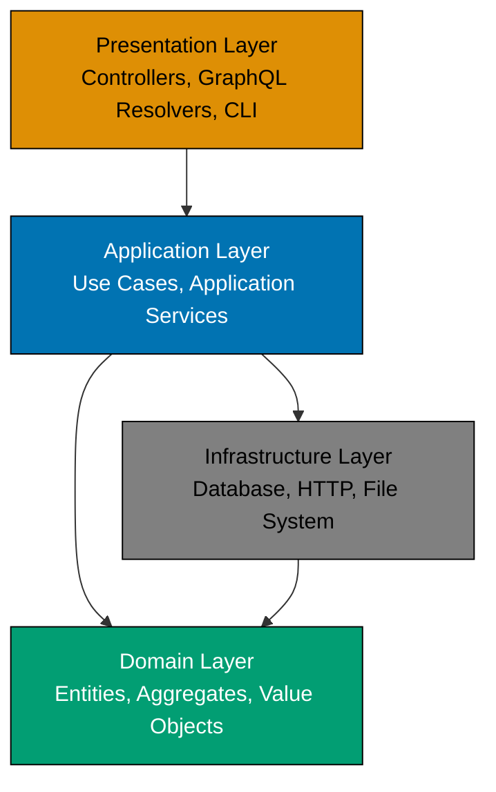
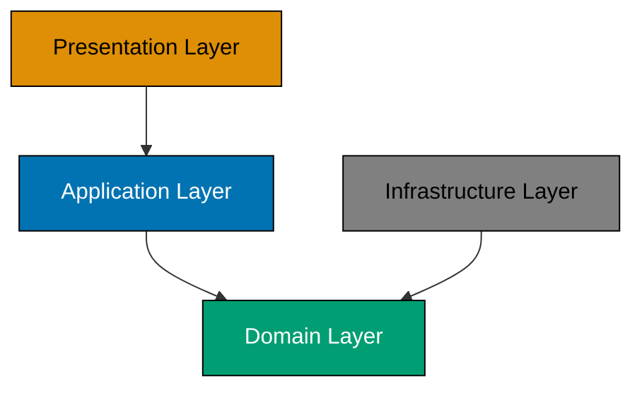
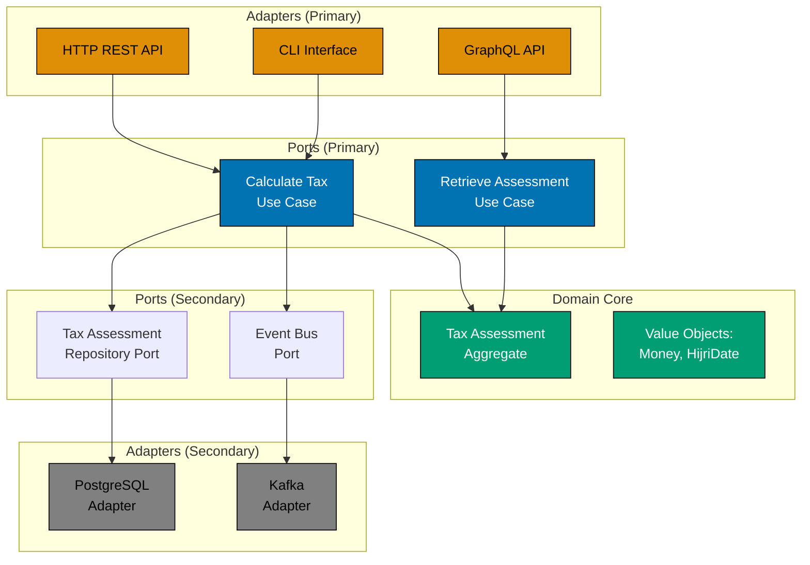

# Layered Architecture

## Overview

Layered Architecture is a software architectural pattern that organizes code into horizontal layers, each with distinct responsibilities and dependencies flowing in one direction. When combined with Domain-Driven Design (DDD), layered architecture ensures the domain layer remains isolated from infrastructure concerns, enabling clean separation between business logic and technical implementation.

This document covers traditional 4-layer architecture, Hexagonal Architecture (Ports & Adapters) variant, integration with Nx monorepo structure, and practical examples from Islamic finance domains.

## The Problem: Tangled Dependencies

Without clear architectural layers, applications devolve into "Big Ball of Mud" where business logic, database access, and UI code are intertwined:

```typescript
// ANTI-PATTERN: Tangled dependencies
class TaxCalculationController {
  async calculate(req: Request, res: Response): Promise<void> {
    // UI concern: parsing request
    const holderId = req.body.holderId;

    // Database concern: direct SQL
    const row = await db.query("SELECT * FROM wealth_declarations WHERE holder_id = $1", [holderId]);

    // Business logic: tax calculation mixed with infrastructure
    let totalWealth = 0;
    for (const decl of row.declarations) {
      totalWealth += decl.amount;
    }

    const threshold = 5000; // Magic number
    const taxRate = 0.025; // Magic number
    const tax = totalWealth > threshold ? totalWealth * taxRate : 0;

    // Persistence concern: direct SQL
    await db.query("INSERT INTO tax_assessments (holder_id, tax_amount) VALUES ($1, $2)", [holderId, tax]);

    // UI concern: formatting response
    res.json({ taxAmount: tax });
  }
}
```

**Problems:**

- **Untestable**: Cannot test business logic without database
- **Unportable**: Changing from SQL to MongoDB requires rewriting business logic
- **Brittle**: Database schema changes break business logic
- **Unclear**: What is the business rule? Hidden among infrastructure code

## Traditional 4-Layer Architecture

Layered architecture solves these problems by separating concerns into distinct layers:



### Layer 1: Presentation Layer

**Responsibility**: Handle user interface and external communication.

**Contains:**

- HTTP Controllers (REST APIs)
- GraphQL Resolvers
- CLI Commands
- WebSocket Handlers
- View Templates (if server-side rendering)

**Dependencies**: Application Layer (orchestrates use cases)

**Never Contains**: Business logic, database queries, domain models

**Example**:

```typescript
// Presentation Layer: HTTP Controller
class TaxCalculationController {
  constructor(private calculateTaxUseCase: CalculateTaxUseCase) {}

  async calculate(req: Request, res: Response): Promise<void> {
    // Parse and validate input (presentation concern)
    const dto = CreateTaxAssessmentDTO.fromRequest(req);

    // Delegate to application layer
    const result = await this.calculateTaxUseCase.execute(dto);

    // Format and return response (presentation concern)
    match(result, {
      ok: (assessment) =>
        res.json({
          assessmentId: assessment.id.toString(),
          taxAmount: assessment.taxAmount?.amount,
          status: assessment.status,
        }),
      err: (error) => res.status(400).json({ error: error.message }),
    });
  }
}
```

### Layer 2: Application Layer

**Responsibility**: Orchestrate use cases and coordinate domain objects.

**Contains:**

- Application Services (Use Cases)
- Data Transfer Objects (DTOs)
- Application-specific validation
- Transaction boundaries
- Event publishing coordination

**Dependencies**: Domain Layer, Infrastructure Layer (via interfaces)

**Never Contains**: Business rules (those belong in Domain Layer)

**Example**:

```typescript
// Application Layer: Use Case
class CalculateTaxUseCase {
  constructor(
    private assessmentRepo: TaxAssessmentRepository, // Interface
    private eventBus: EventBus, // Interface
  ) {}

  async execute(dto: CreateTaxAssessmentDTO): Promise<Result<TaxAssessment, ApplicationError>> {
    // Application-level validation
    if (!dto.holderId) {
      return Err(new ValidationError("Holder ID is required"));
    }

    // Create aggregate (domain logic)
    const createResult = TaxAssessment.create(
      WealthHolderId.fromString(dto.holderId),
      HijriDate.fromString(dto.startDate),
    );

    if (createResult.kind === "err") {
      return Err(new DomainValidationError(createResult.error));
    }

    let [assessment, createEvent] = createResult.value;

    // Add declarations (domain logic)
    for (const declDto of dto.declarations) {
      const declareResult = assessment.declareWealth(
        WealthType[declDto.type],
        Money.usd(declDto.amount),
        HijriDate.fromString(declDto.date),
      );

      if (declareResult.kind === "err") {
        return Err(new DomainValidationError(declareResult.error));
      }

      assessment = declareResult.value[0];
    }

    // Finalize (domain logic)
    const finalizeResult = assessment.finalize(ThresholdAmount.goldStandard(), TaxRate.standard());

    if (finalizeResult.kind === "err") {
      return Err(new DomainValidationError(finalizeResult.error));
    }

    const [finalAssessment, finalizeEvent] = finalizeResult.value;

    // Persistence (infrastructure, but coordinated here)
    await this.assessmentRepo.save(finalAssessment);

    // Event publishing (infrastructure, but coordinated here)
    await this.eventBus.publish(createEvent);
    await this.eventBus.publish(finalizeEvent);

    return Ok(finalAssessment);
  }
}

// Data Transfer Object (DTO)
class CreateTaxAssessmentDTO {
  constructor(
    readonly holderId: string,
    readonly startDate: string,
    readonly declarations: Array<{
      type: string;
      amount: number;
      date: string;
    }>,
  ) {}

  static fromRequest(req: Request): CreateTaxAssessmentDTO {
    return new CreateTaxAssessmentDTO(req.body.holderId, req.body.startDate, req.body.declarations);
  }
}
```

### Layer 3: Domain Layer

**Responsibility**: Express business rules and domain logic.

**Contains:**

- Entities
- Value Objects
- Aggregates
- Domain Events
- Domain Services
- Factories
- Repository Interfaces (not implementations)
- Domain Exceptions

**Dependencies**: None (core domain is self-contained)

**Never Contains**: Database code, HTTP code, framework code

**Example**:

```typescript
// Domain Layer: Aggregate Root
class TaxAssessment {
  private constructor(
    readonly id: AssessmentId,
    readonly holderId: WealthHolderId,
    private declarations: WealthDeclaration[],
    private status: AssessmentStatus,
    private taxAmount: Money | null,
  ) {}

  static create(
    holderId: WealthHolderId,
    startDate: HijriDate,
  ): Result<[TaxAssessment, AssessmentCreated], DomainError> {
    if (!startDate.isValid()) {
      return Err(new InvalidDateError("Start date is invalid"));
    }

    const assessment = new TaxAssessment(AssessmentId.generate(), holderId, [], AssessmentStatus.Draft, null);

    const event: AssessmentCreated = {
      assessmentId: assessment.id,
      holderId,
      createdAt: HijriDate.now(),
    };

    return Ok([assessment, event]);
  }

  declareWealth(
    wealthType: WealthType,
    amount: Money,
    acquiredDate: HijriDate,
  ): Result<[TaxAssessment, WealthDeclared], DomainError> {
    // Business rule: only draft assessments can be modified
    if (this.status !== AssessmentStatus.Draft) {
      return Err(new InvalidOperationError("Cannot modify finalized assessment"));
    }

    // Business rule: amount must be positive
    if (amount.amount <= 0) {
      return Err(new InvalidAmountError("Amount must be positive"));
    }

    const declaration = new WealthDeclaration(DeclarationId.generate(), wealthType, amount, acquiredDate);

    const updatedAssessment = new TaxAssessment(
      this.id,
      this.holderId,
      [...this.declarations, declaration],
      this.status,
      this.taxAmount,
    );

    const event: WealthDeclared = {
      assessmentId: this.id,
      declaration,
      declaredAt: HijriDate.now(),
    };

    return Ok([updatedAssessment, event]);
  }

  finalize(thresholdThreshold: ThresholdAmount, taxRate: TaxRate): Result<[TaxAssessment, TaxCalculated], DomainError> {
    // Business rule: must have declarations
    if (this.declarations.length === 0) {
      return Err(new InvalidOperationError("No wealth declared"));
    }

    // Business rule: tax calculation
    const totalWealth = this.calculateTotalWealth();
    const meetsThreshold = totalWealth.isGreaterThanOrEqual(thresholdThreshold.toMoney());
    const taxAmount = meetsThreshold ? totalWealth.multiply(taxRate.percentage) : Money.zero();

    const newStatus = meetsThreshold ? AssessmentStatus.Finalized : AssessmentStatus.ExemptBelowThreshold;

    const updatedAssessment = new TaxAssessment(this.id, this.holderId, this.declarations, newStatus, taxAmount);

    const event: TaxCalculated = {
      assessmentId: this.id,
      holderId: this.holderId,
      taxAmount,
      calculatedAt: HijriDate.now(),
    };

    return Ok([updatedAssessment, event]);
  }

  private calculateTotalWealth(): Money {
    return this.declarations.reduce((total, decl) => total.add(decl.amount), Money.zero());
  }
}

// Domain Layer: Repository Interface (NOT implementation)
interface TaxAssessmentRepository {
  findById(id: AssessmentId): Promise<Result<TaxAssessment, NotFoundError>>;
  save(assessment: TaxAssessment): Promise<Result<void, PersistenceError>>;
}
```

### Layer 4: Infrastructure Layer

**Responsibility**: Provide technical capabilities (persistence, messaging, external APIs).

**Contains:**

- Database implementations (PostgreSQL, MongoDB)
- Repository implementations (concrete classes)
- HTTP clients
- Message queue clients
- File system access
- Third-party API integrations
- Framework-specific code

**Dependencies**: Domain Layer (implements interfaces defined there)

**Never Contains**: Business rules

**Example**:

```typescript
// Infrastructure Layer: Repository Implementation
class PostgresTaxAssessmentRepository implements TaxAssessmentRepository {
  constructor(
    private db: DatabaseConnection,
    private mapper: TaxAssessmentMapper,
  ) {}

  async findById(id: AssessmentId): Promise<Result<TaxAssessment, NotFoundError>> {
    try {
      const row = await this.db.query("SELECT * FROM tax_assessments WHERE id = $1", [id.value]);

      if (!row) {
        return Err(new NotFoundError(`Assessment ${id.value} not found`));
      }

      const assessment = this.mapper.toDomain(row);
      return Ok(assessment);
    } catch (error) {
      return Err(new NotFoundError(error.message));
    }
  }

  async save(assessment: TaxAssessment): Promise<Result<void, PersistenceError>> {
    try {
      const data = this.mapper.toPersistence(assessment);

      await this.db.query(
        `INSERT INTO tax_assessments (id, holder_id, status, tax_amount, created_at)
         VALUES ($1, $2, $3, $4, $5)
         ON CONFLICT (id) DO UPDATE SET
           status = EXCLUDED.status,
           tax_amount = EXCLUDED.tax_amount`,
        [data.id, data.holderId, data.status, data.taxAmount, data.createdAt],
      );

      return Ok(undefined);
    } catch (error) {
      return Err(new PersistenceError(error.message));
    }
  }
}

// Infrastructure Layer: Mapper (Domain <-> Database)
class TaxAssessmentMapper {
  toDomain(row: any): TaxAssessment {
    // Map database row to domain model
    return new TaxAssessment(
      AssessmentId.fromString(row.id),
      WealthHolderId.fromString(row.holder_id),
      JSON.parse(row.declarations).map(this.declarationToDomain),
      row.status as AssessmentStatus,
      row.tax_amount ? Money.usd(parseFloat(row.tax_amount)) : null,
    );
  }

  toPersistence(assessment: TaxAssessment): any {
    // Map domain model to database row
    return {
      id: assessment.id.value,
      holderId: assessment.holderId.value,
      status: assessment.status,
      taxAmount: assessment.taxAmount?.amount,
      declarations: JSON.stringify(assessment.declarations),
      createdAt: new Date(),
    };
  }

  private declarationToDomain(data: any): WealthDeclaration {
    return new WealthDeclaration(
      DeclarationId.fromString(data.id),
      data.wealthType as WealthType,
      Money.usd(data.amount),
      HijriDate.fromString(data.acquiredDate),
    );
  }
}
```

## Dependency Rule

**Critical Principle**: Dependencies flow inward, never outward.



**Rules:**

1. **Domain Layer** has no dependencies (pure business logic)
2. **Application Layer** depends on Domain Layer
3. **Presentation Layer** depends on Application Layer
4. **Infrastructure Layer** depends on Domain Layer (implements interfaces)

**Dependency Inversion Principle**:

- Application Layer depends on repository **interfaces** (defined in Domain Layer)
- Infrastructure Layer implements those interfaces
- Application Layer never directly depends on Infrastructure Layer

## Hexagonal Architecture (Ports & Adapters)

Hexagonal Architecture (also called Ports & Adapters) is a variant of layered architecture that emphasizes the domain at the center with symmetric ports for input and output.



**Key Concepts:**

- **Hexagon**: Domain core at center
- **Ports**: Interfaces for communication (primary = incoming, secondary = outgoing)
- **Adapters**: Concrete implementations that plug into ports
- **Primary Ports**: Application services (use cases) that drive the domain
- **Secondary Ports**: Repositories, event buses, external services (driven by domain)

**Example**:

```typescript
// ============================================================================
// DOMAIN CORE (Center of Hexagon)
// ============================================================================

class TaxAssessment {
  // Business logic (same as before)
}

// ============================================================================
// PORTS (Interfaces)
// ============================================================================

// Secondary Port: Repository
interface TaxAssessmentRepository {
  findById(id: AssessmentId): Promise<Result<TaxAssessment, NotFoundError>>;
  save(assessment: TaxAssessment): Promise<Result<void, PersistenceError>>;
}

// Secondary Port: Event Bus
interface EventBus {
  publish(event: DomainEvent): Promise<void>;
}

// Primary Port: Use Case
interface CalculateTaxUseCase {
  execute(dto: CreateTaxAssessmentDTO): Promise<Result<TaxAssessment, ApplicationError>>;
}

// ============================================================================
// PRIMARY ADAPTERS (Incoming)
// ============================================================================

// HTTP Adapter
class HttpTaxController {
  constructor(private useCase: CalculateTaxUseCase) {}

  async calculate(req: Request, res: Response): Promise<void> {
    const dto = CreateTaxAssessmentDTO.fromRequest(req);
    const result = await this.useCase.execute(dto);

    match(result, {
      ok: (assessment) => res.json({ assessmentId: assessment.id.toString() }),
      err: (error) => res.status(400).json({ error: error.message }),
    });
  }
}

// GraphQL Adapter
class GraphQLTaxResolver {
  constructor(private useCase: CalculateTaxUseCase) {}

  @Mutation()
  async calculateTax(@Args("input") input: CreateTaxInput): Promise<TaxAssessmentPayload> {
    const dto = new CreateTaxAssessmentDTO(input.holderId, input.startDate, input.declarations);
    const result = await this.useCase.execute(dto);

    return match(result, {
      ok: (assessment) => ({ assessment }),
      err: (error) => ({ error: error.message }),
    });
  }
}

// ============================================================================
// SECONDARY ADAPTERS (Outgoing)
// ============================================================================

// PostgreSQL Adapter
class PostgresTaxAssessmentRepository implements TaxAssessmentRepository {
  // Implementation (same as before)
}

// Kafka Adapter
class KafkaEventBus implements EventBus {
  constructor(private kafkaProducer: KafkaProducer) {}

  async publish(event: DomainEvent): Promise<void> {
    await this.kafkaProducer.send({
      topic: "tax-events",
      messages: [{ value: JSON.stringify(event) }],
    });
  }
}
```

**Benefits:**

- **Testability**: Easy to swap adapters with test doubles
- **Flexibility**: Change HTTP to GraphQL without touching domain
- **Symmetry**: Input and output treated uniformly
- **Plugin Architecture**: Add new adapters without modifying core

## Integration with Nx Monorepo

Nx monorepo structure maps naturally to layered architecture:

```
apps/
├── ose-tax-api/                    # Presentation Layer (REST API)
│   └── src/
│       └── controllers/
│           └── TaxCalculationController.ts
├── ose-tax-graphql/                # Presentation Layer (GraphQL)
│   └── src/
│       └── resolvers/
│           └── TaxResolver.ts

libs/
├── ts-tax-application/             # Application Layer
│   └── src/
│       ├── use-cases/
│       │   ├── CalculateTaxUseCase.ts
│       │   └── RetrieveAssessmentUseCase.ts
│       └── dtos/
│           └── CreateTaxAssessmentDTO.ts
│
├── ts-tax-domain/                  # Domain Layer
│   └── src/
│       ├── aggregates/
│       │   └── TaxAssessment.ts
│       ├── value-objects/
│       │   ├── Money.ts
│       │   ├── HijriDate.ts
│       │   └── ThresholdAmount.ts
│       ├── events/
│       │   ├── AssessmentCreated.ts
│       │   └── TaxCalculated.ts
│       └── ports/                    # Repository interfaces
│           ├── TaxAssessmentRepository.ts
│           └── EventBus.ts
│
├── ts-tax-infrastructure/          # Infrastructure Layer
│   └── src/
│       ├── persistence/
│       │   ├── PostgresTaxRepository.ts
│       │   └── TaxAssessmentMapper.ts
│       └── messaging/
│           └── KafkaEventBus.ts
│
└── ts-shared-kernel/                 # Shared across bounded contexts
    └── src/
        ├── value-objects/
        │   └── Money.ts              # Shared Money value object
        └── types/
            └── Result.ts             # Shared Result type
```

**Nx Dependency Constraints**:

```json
// nx.json or project.json
{
  "targetDefaults": {
    "lint": {
      "dependsOn": [
        {
          "target": "lint",
          "projects": "dependencies"
        }
      ]
    }
  },
  "namedInputs": {
    "default": ["{projectRoot}/**/*"],
    "production": [
      "default",
      "!{projectRoot}/**/*.spec.ts",
      "!{projectRoot}/tsconfig.spec.json"
    ]
  }
}

// .eslintrc.json (enforce layer dependencies)
{
  "overrides": [
    {
      "files": ["libs/ts-tax-domain/**/*.ts"],
      "rules": {
        "@nx/enforce-module-boundaries": [
          "error",
          {
            "allow": [],
            "depConstraints": [
              {
                "sourceTag": "layer:domain",
                "onlyDependOnLibsWithTags": ["layer:domain", "type:shared-kernel"]
              }
            ]
          }
        ]
      }
    },
    {
      "files": ["libs/ts-tax-application/**/*.ts"],
      "rules": {
        "@nx/enforce-module-boundaries": [
          "error",
          {
            "depConstraints": [
              {
                "sourceTag": "layer:application",
                "onlyDependOnLibsWithTags": ["layer:domain", "layer:application", "type:shared-kernel"]
              }
            ]
          }
        ]
      }
    },
    {
      "files": ["libs/ts-tax-infrastructure/**/*.ts"],
      "rules": {
        "@nx/enforce-module-boundaries": [
          "error",
          {
            "depConstraints": [
              {
                "sourceTag": "layer:infrastructure",
                "onlyDependOnLibsWithTags": ["layer:domain", "type:shared-kernel"]
              }
            ]
          }
        ]
      }
    }
  ]
}
```

**Project Tags** (in `project.json`):

```json
// libs/ts-tax-domain/project.json
{
  "name": "ts-tax-domain",
  "tags": ["layer:domain", "bounded-context:tax"]
}

// libs/ts-tax-application/project.json
{
  "name": "ts-tax-application",
  "tags": ["layer:application", "bounded-context:tax"]
}

// libs/ts-tax-infrastructure/project.json
{
  "name": "ts-tax-infrastructure",
  "tags": ["layer:infrastructure", "bounded-context:tax"]
}
```

**Nx enforces:**

- Domain layer cannot import from Application or Infrastructure
- Application layer cannot import from Infrastructure (only via interfaces)
- Infrastructure layer can import from Domain (to implement interfaces)

## Example: Tax Calculation Bounded Context Layers

Complete example showing all layers:

### Domain Layer

```typescript
// libs/ts-tax-domain/src/aggregates/TaxAssessment.ts
export class TaxAssessment {
  private constructor(
    readonly id: AssessmentId,
    readonly holderId: WealthHolderId,
    private declarations: WealthDeclaration[],
    private status: AssessmentStatus,
    private taxAmount: Money | null,
  ) {}

  static create(
    holderId: WealthHolderId,
    startDate: HijriDate,
  ): Result<[TaxAssessment, AssessmentCreated], DomainError> {
    // Domain logic (no infrastructure)
  }

  declareWealth(
    wealthType: WealthType,
    amount: Money,
    acquiredDate: HijriDate,
  ): Result<[TaxAssessment, WealthDeclared], DomainError> {
    // Domain logic (no infrastructure)
  }
}

// libs/ts-tax-domain/src/ports/TaxAssessmentRepository.ts
export interface TaxAssessmentRepository {
  findById(id: AssessmentId): Promise<Result<TaxAssessment, NotFoundError>>;
  save(assessment: TaxAssessment): Promise<Result<void, PersistenceError>>;
}
```

### Application Layer

```typescript
// libs/ts-tax-application/src/use-cases/CalculateTaxUseCase.ts
import { TaxAssessment } from "@open-compliance-enterprise/ts-tax-domain";
import { TaxAssessmentRepository } from "@open-compliance-enterprise/ts-tax-domain/ports";

export class CalculateTaxUseCase {
  constructor(
    private assessmentRepo: TaxAssessmentRepository, // Interface from domain
    private eventBus: EventBus,
  ) {}

  async execute(dto: CreateTaxAssessmentDTO): Promise<Result<TaxAssessment, ApplicationError>> {
    // Orchestrate domain objects
    const createResult = TaxAssessment.create(
      WealthHolderId.fromString(dto.holderId),
      HijriDate.fromString(dto.startDate),
    );

    if (createResult.kind === "err") {
      return Err(new DomainValidationError(createResult.error));
    }

    const [assessment, createEvent] = createResult.value;

    // Persist and publish
    await this.assessmentRepo.save(assessment);
    await this.eventBus.publish(createEvent);

    return Ok(assessment);
  }
}
```

### Infrastructure Layer

```typescript
// libs/ts-tax-infrastructure/src/persistence/PostgresTaxRepository.ts
import { TaxAssessment } from "@open-compliance-enterprise/ts-tax-domain";
import { TaxAssessmentRepository } from "@open-compliance-enterprise/ts-tax-domain/ports";

export class PostgresTaxAssessmentRepository implements TaxAssessmentRepository {
  constructor(
    private db: DatabaseConnection,
    private mapper: TaxAssessmentMapper,
  ) {}

  async findById(id: AssessmentId): Promise<Result<TaxAssessment, NotFoundError>> {
    // Database-specific implementation
    const row = await this.db.query("SELECT * FROM tax_assessments WHERE id = $1", [id.value]);

    if (!row) {
      return Err(new NotFoundError(`Assessment ${id.value} not found`));
    }

    return Ok(this.mapper.toDomain(row));
  }

  async save(assessment: TaxAssessment): Promise<Result<void, PersistenceError>> {
    // Database-specific implementation
    const data = this.mapper.toPersistence(assessment);
    await this.db.query("INSERT INTO tax_assessments (...) VALUES (...)", [data.id, data.holderId, data.status]);
    return Ok(undefined);
  }
}
```

### Presentation Layer

```typescript
// apps/ose-tax-api/src/controllers/TaxCalculationController.ts
import { CalculateTaxUseCase } from "@open-compliance-enterprise/ts-tax-application";

export class TaxCalculationController {
  constructor(private calculateTaxUseCase: CalculateTaxUseCase) {}

  async calculate(req: Request, res: Response): Promise<void> {
    // Parse input (presentation concern)
    const dto = CreateTaxAssessmentDTO.fromRequest(req);

    // Delegate to application layer
    const result = await this.calculateTaxUseCase.execute(dto);

    // Format output (presentation concern)
    match(result, {
      ok: (assessment) =>
        res.json({
          assessmentId: assessment.id.toString(),
          taxAmount: assessment.taxAmount?.amount,
        }),
      err: (error) => res.status(400).json({ error: error.message }),
    });
  }
}
```

## Testing Across Layers

### Domain Layer Tests (Pure, No Mocks)

```typescript
describe("TaxAssessment (Domain)", () => {
  it("should calculate tax when above threshold", () => {
    const createResult = TaxAssessment.create(WealthHolderId.generate(), HijriDate.fromString("1444-01-01"));

    expect(createResult.kind).toBe("ok");

    if (createResult.kind === "ok") {
      let [assessment] = createResult.value;

      const declareResult = assessment.declareWealth(
        WealthType.Cash,
        Money.usd(10000),
        HijriDate.fromString("1444-01-01"),
      );

      expect(declareResult.kind).toBe("ok");

      if (declareResult.kind === "ok") {
        [assessment] = declareResult.value;

        const finalizeResult = assessment.finalize(ThresholdAmount.fromMoney(Money.usd(5000)), TaxRate.standard());

        expect(finalizeResult.kind).toBe("ok");

        if (finalizeResult.kind === "ok") {
          const [final] = finalizeResult.value;
          expect(final.taxAmount?.amount).toBe(250); // 10000 * 0.025
        }
      }
    }
  });
});
```

### Application Layer Tests (Mock Infrastructure)

```typescript
describe("CalculateTaxUseCase", () => {
  it("should persist and publish events", async () => {
    // Mock repository
    const mockRepo: TaxAssessmentRepository = {
      findById: jest.fn(),
      save: jest.fn().mockResolvedValue(Ok(undefined)),
    };

    // Mock event bus
    const mockEventBus: EventBus = {
      publish: jest.fn().mockResolvedValue(undefined),
    };

    const useCase = new CalculateTaxUseCase(mockRepo, mockEventBus);

    const dto = new CreateTaxAssessmentDTO("holder-123", "1444-01-01", [
      { type: "Cash", amount: 10000, date: "1444-01-01" },
    ]);

    const result = await useCase.execute(dto);

    expect(result.kind).toBe("ok");
    expect(mockRepo.save).toHaveBeenCalledTimes(1);
    expect(mockEventBus.publish).toHaveBeenCalledTimes(1);
  });
});
```

### Infrastructure Layer Tests (Integration Tests)

```typescript
describe("PostgresTaxAssessmentRepository", () => {
  let db: TestDatabaseConnection;
  let repo: PostgresTaxAssessmentRepository;

  beforeEach(async () => {
    db = await createTestDatabase();
    repo = new PostgresTaxAssessmentRepository(db, new TaxAssessmentMapper());
  });

  it("should save and retrieve assessment", async () => {
    const assessment = createTestAssessment();

    const saveResult = await repo.save(assessment);
    expect(saveResult.kind).toBe("ok");

    const findResult = await repo.findById(assessment.id);
    expect(findResult.kind).toBe("ok");

    if (findResult.kind === "ok") {
      expect(findResult.value.id.equals(assessment.id)).toBe(true);
    }
  });

  afterEach(async () => {
    await db.close();
  });
});
```

## Common Mistakes

### 1. Anemic Domain Model

**Problem**: Domain layer becomes just data containers, business logic leaks to application layer.

```typescript
// ANTI-PATTERN: Anemic domain
class TaxAssessment {
  id: AssessmentId;
  declarations: WealthDeclaration[];
  status: AssessmentStatus;
  // No behavior, just getters/setters
}

// Business logic in application layer (WRONG)
class CalculateTaxUseCase {
  async execute(dto: CreateTaxAssessmentDTO): Promise<Result<TaxAssessment, Error>> {
    const assessment = new TaxAssessment();
    assessment.declarations = dto.declarations.map((d) => new WealthDeclaration(d));

    // Business logic should be in domain!
    const totalWealth = assessment.declarations.reduce((sum, d) => sum + d.amount, 0);
    const tax = totalWealth > 5000 ? totalWealth * 0.025 : 0;
    assessment.taxAmount = tax;

    await this.repo.save(assessment);
    return Ok(assessment);
  }
}
```

**Solution**: Move business logic to domain layer.

### 2. Infrastructure Leaking into Domain

**Problem**: Domain layer depends on database or HTTP frameworks.

```typescript
// ANTI-PATTERN: Domain depends on infrastructure
import { PrismaClient } from '@prisma/client'; // Database library!

class TaxAssessment {
  async save(prisma: PrismaClient): Promise<void> { // Domain shouldn't know about Prisma
    await prisma.taxAssessment.create({ data: { ... } });
  }
}
```

**Solution**: Use repository interfaces in domain, implementations in infrastructure.

### 3. Bypassing Application Layer

**Problem**: Presentation layer directly accesses domain or infrastructure.

```typescript
// ANTI-PATTERN: Controller directly accessing repository
class TaxController {
  constructor(private repo: PostgresTaxRepository) {} // Should depend on use case

  async calculate(req: Request, res: Response): Promise<void> {
    const assessment = TaxAssessment.create(...);
    await this.repo.save(assessment); // Bypassing application layer
    res.json({ ... });
  }
}
```

**Solution**: Always go through application layer for coordination.

## Summary

Layered Architecture with DDD provides:

**4 Layers:**

1. **Presentation**: UI, controllers, API endpoints
2. **Application**: Use cases, orchestration, transaction boundaries
3. **Domain**: Business logic, aggregates, value objects, entities
4. **Infrastructure**: Database, messaging, external APIs

**Key Principles:**

- Dependencies flow inward (never outward)
- Domain layer has no dependencies (pure business logic)
- Application layer orchestrates domain objects
- Infrastructure implements interfaces defined in domain

**Hexagonal Architecture Variant:**

- Domain at center
- Primary Ports (incoming): Use cases
- Secondary Ports (outgoing): Repositories, event buses
- Adapters plug into ports

**Nx Monorepo Integration:**

- Each layer is a library (`ts-tax-domain`, `ts-tax-application`, `ts-tax-infrastructure`)
- Apps are presentation layer
- Nx enforces dependency constraints via tags

**Benefits:**

- **Testability**: Test domain logic without infrastructure
- **Maintainability**: Clear separation of concerns
- **Portability**: Change database without touching domain
- **Evolvability**: Add new features without breaking existing code

## Next Steps

- **[DDD and Functional Programming](./ex-soen-ar-dodrdedd__14-ddd-and-functional-programming.md)** - Pure functional core fits naturally with layered architecture
- **[Aggregates](./ex-soen-ar-dodrdedd__09-aggregates.md)** - Core domain layer building blocks
- **[Repositories](./ex-soen-ar-dodrdedd__10-repositories.md)** - Infrastructure layer persistence abstraction
- **[DDD and C4 Integration](./ex-soen-ar-dodrdedd__17-ddd-and-c4-integration.md)** - Visualizing layers with C4 diagrams

## References

- Eric Evans, "Domain-Driven Design" (2003) - Chapter on Layered Architecture
- Vaughn Vernon, "Implementing Domain-Driven Design" (2013) - Hexagonal Architecture
- Alistair Cockburn, ["Hexagonal Architecture"](https://alistair.cockburn.us/hexagonal-architecture/)
- Robert C. Martin, "Clean Architecture" (2017) - Dependency Inversion Principle
- Mark Seemann, ["Functional Architecture is Ports and Adapters"](https://blog.ploeh.dk/2016/03/18/functional-architecture-is-ports-and-adapters/)

## Related Principles

- **[Pure Functions Over Side Effects](../../../../../governance/principles/software-engineering/pure-functions.md)** - Layered architecture separates pure domain logic from impure infrastructure
- **[Explicit Over Implicit](../../../../../governance/principles/software-engineering/explicit-over-implicit.md)** - Clear layer boundaries make dependencies explicit

See [Software Engineering Principles](../../../../../governance/principles/software-engineering/README.md) for comprehensive documentation.
