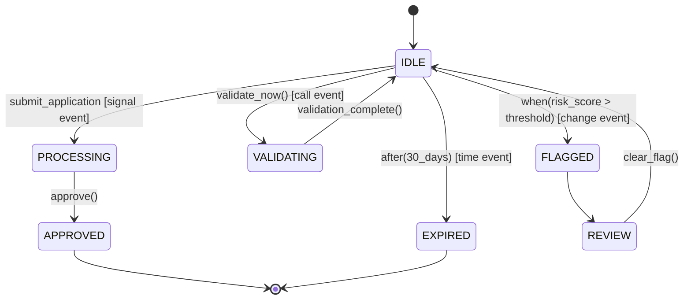
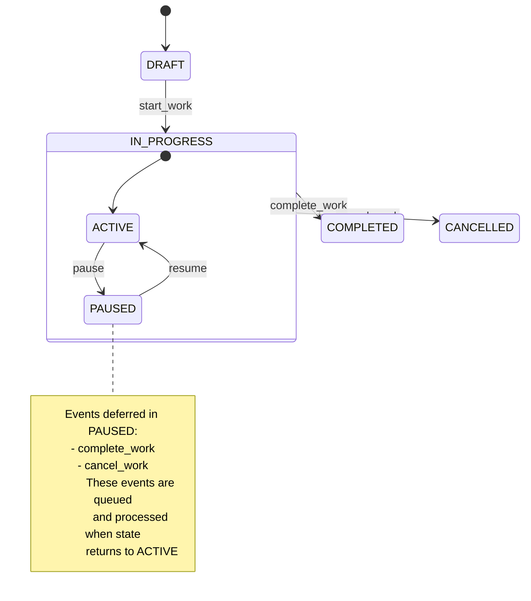
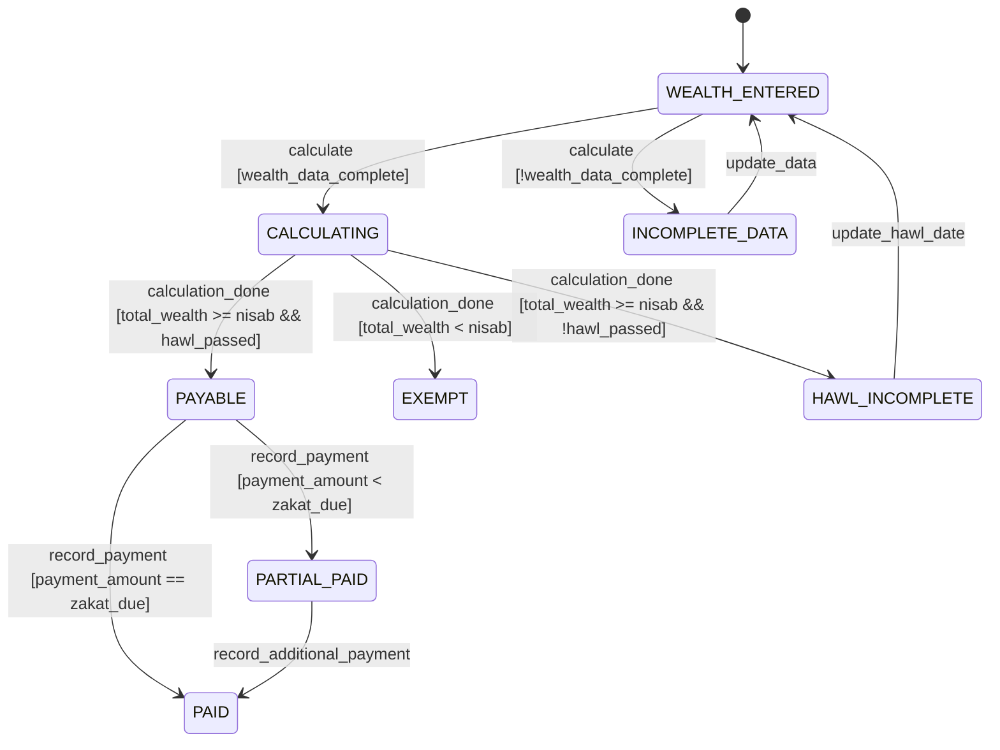
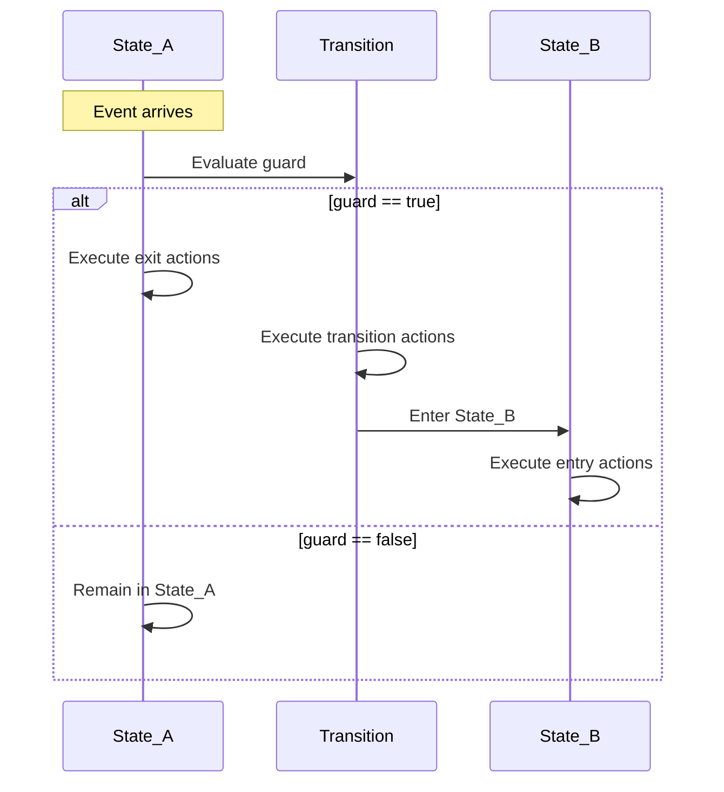
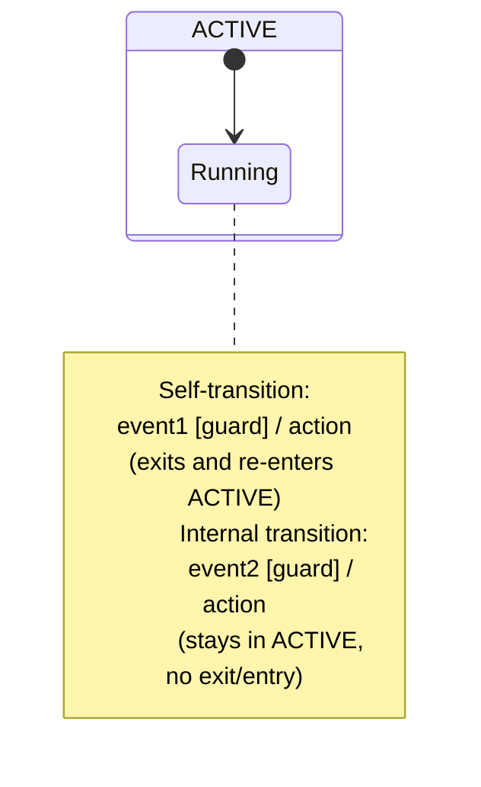
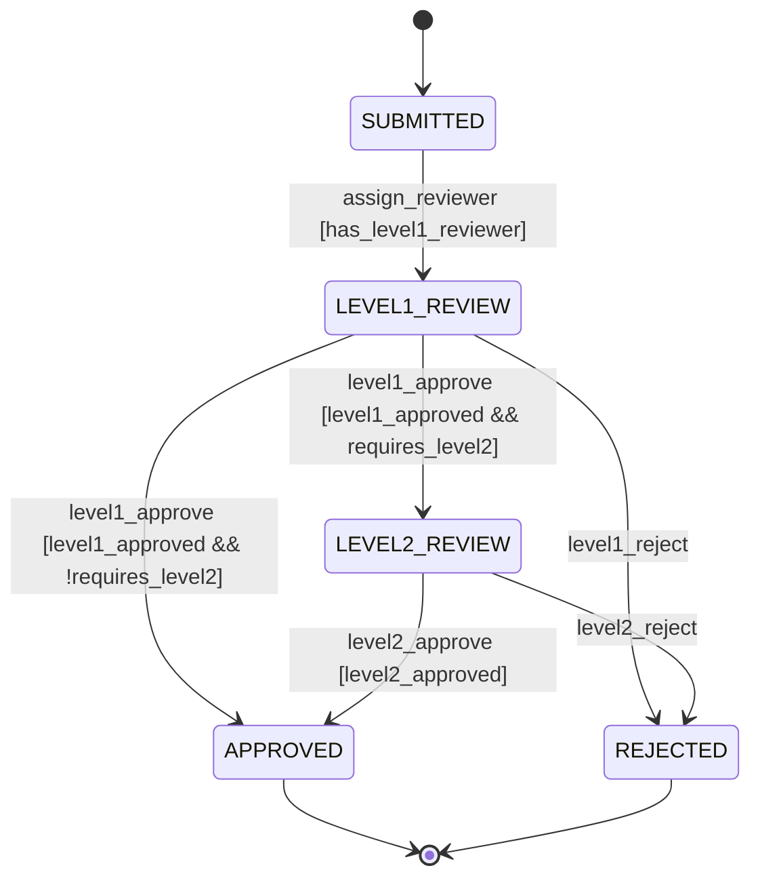
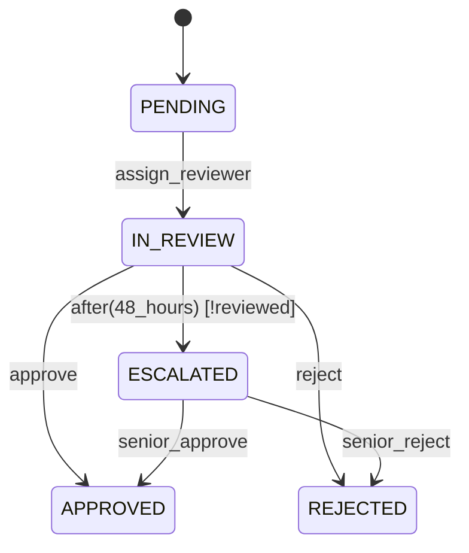
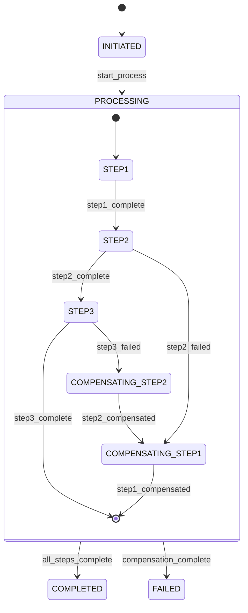

# Events, Guards, and Actions

State transitions in finite state machines are governed by three fundamental mechanisms: **events** (what triggers a transition), **guards** (conditions that must be true), and **actions** (side effects that occur). Understanding these mechanisms is essential for designing robust, predictable state machines.

This document provides an in-depth exploration of event types, guard condition patterns, action execution semantics, and their coordination in FSM implementations.

## Events: Transition Triggers

Events are stimuli that cause state machines to evaluate potential transitions. Events can originate from external sources (user actions, system messages) or internal sources (timeouts, state completion).

### Event Types

State machines recognize four primary event types:

1. **Signal Events**: Discrete occurrences that happen at specific points in time
2. **Call Events**: Synchronous operation invocations that may return values
3. **Time Events**: Triggers based on absolute time or relative duration
4. **Change Events**: Triggers when a boolean condition becomes true



**OSE Example - Zakat Assessment Events**:

```
Signal Events:
- `start_assessment`: User initiates Zakat calculation
- `data_entered`: User completes wealth data entry
- `payment_recorded`: Payment transaction confirmed

Call Events:
- `calculate_nisab()`: Synchronous calculation of Zakat threshold
- `verify_payment(amount)`: Payment validation with return status
- `generate_receipt()`: Receipt generation operation

Time Events:
- `after(365_days)`: Annual Zakat assessment deadline
- `after(7_days)`: Assessment draft expiration
- `at(Ramadan_1st)`: Specific date trigger for reminders

Change Events:
- `when(gold_price_updated)`: Market price change detection
- `when(wealth_total >= nisab)`: Threshold crossing detection
- `when(hawl_complete)`: One lunar year completion
```

### Event Payloads and Parameters

Events can carry data payloads that provide context for transition evaluation and action execution.

**Examples**:

```
// Event with simple value
payment_received(amount: Money)

// Event with structured payload
document_submitted({
  document_type: "KYC_PROOF",
  document_id: "DOC-12345",
  uploaded_by: "USER-789",
  timestamp: "2026-01-21T10:30:00Z"
})

// Event with validation result
compliance_check_completed({
  passed: true,
  risk_score: 12,
  findings: []
})
```

**OSE Example - Murabaha Contract Events**:

```
contract_signed({
  contract_id: "MURB-2026-001",
  principal_amount: 100000.00,
  profit_margin: 0.05,
  buyer_signature: "0x1a2b3c...",
  seller_signature: "0x4d5e6f...",
  timestamp: "2026-01-21T14:00:00Z"
})

payment_made({
  payment_id: "PAY-001",
  amount: 5250.00,
  payment_date: "2026-02-21",
  remaining_balance: 99750.00
})
```

### Event Queues and Deferred Events

Not all events can be processed immediately. Event queues manage event arrival and processing order.

**Event Queue Behaviors**:

1. **Immediate Processing**: Event triggers transition evaluation as soon as it arrives
2. **Deferred Processing**: Event is queued and held until the state machine reaches a state that can handle it
3. **Discarded Events**: Event is ignored if no valid transition exists



**OSE Example - Qard Hasan Loan Application**:

```
State: DOCUMENT_COLLECTION
- accept: upload_document
- defer: approve_loan, disburse_funds
- discard: (none)

Behavior: While in DOCUMENT_COLLECTION, if approve_loan event arrives,
it is queued. Once state transitions to REVIEW, the deferred approve_loan
event is processed.

Rationale: Preventing premature approval while documents are still being
collected, but not losing the approval intent.
```

## Guards: Conditional Transitions

Guards are boolean expressions that determine whether a transition can occur. Even if an event arrives, the transition only executes if the guard evaluates to `true`.

### Guard Syntax and Semantics

**Standard notation**:

```
source_state --> target_state : event [guard_condition] / action
```

**Guard evaluation**:

```
if (event_matches && guard_condition == true) {
  execute_transition();
  execute_actions();
} else {
  remain_in_current_state();
}
```

### Guard Condition Types

#### 1. Simple Boolean Guards

```
PENDING --> APPROVED : approve [is_authorized]
PENDING --> REJECTED : approve [!is_authorized]
```

#### 2. Comparison Guards

```
CALCULATING --> PAYABLE : calculation_complete [zakat_amount > 0]
CALCULATING --> EXEMPT : calculation_complete [zakat_amount == 0]
```

#### 3. Complex Logic Guards

```
APPLICATION --> APPROVED : review_complete [
  credit_score >= 650 &&
  income_verified == true &&
  debt_to_income_ratio < 0.4 &&
  riba_free_income == true
]
```

#### 4. Function Call Guards

```
SUBMITTED --> IN_REVIEW : submit [validate_completeness(application)]
SUBMITTED --> REJECTED : submit [!validate_completeness(application)]
```

**OSE Example - Zakat Eligibility Guards**:



### Guard Best Practices

#### Pure Functions for Guards

Guards should be **pure functions**: deterministic, side-effect-free, and dependent only on event payload and FSM context.

```
// ✅ GOOD: Pure guard function
function is_nisab_met(wealth_total, nisab_threshold) {
  return wealth_total >= nisab_threshold;
}

// ❌ BAD: Guard with side effects
function is_nisab_met(wealth_total, nisab_threshold) {
  log_audit_entry("Nisab check performed"); // Side effect
  return wealth_total >= nisab_threshold;
}
```

#### Avoid Redundant Guards

```
// ❌ BAD: Redundant guards
PENDING --> APPROVED : approve [is_eligible && is_eligible]

// ✅ GOOD: Non-redundant
PENDING --> APPROVED : approve [is_eligible]
```

#### Explicit Guard Conditions

```
// ❌ BAD: Implicit boolean check
PENDING --> APPROVED : approve [user.role]

// ✅ GOOD: Explicit comparison
PENDING --> APPROVED : approve [user.role == "APPROVER"]
```

#### Boundary Value Testing

Guards with numeric comparisons must be tested at boundaries:

```
Guard: [zakat_amount > 0]

Test Cases:
- zakat_amount = -100  => false (negative)
- zakat_amount = 0     => false (boundary)
- zakat_amount = 0.01  => true (just above boundary)
- zakat_amount = 1000  => true (well above boundary)
```

## Actions: Side Effects of Transitions

Actions are operations executed during state transitions. Actions produce side effects: updating context, logging, sending messages, or invoking external systems.

### Action Types and Execution Points

#### 1. Entry Actions

Executed when entering a state, regardless of which transition led to the state.

```
state APPROVED {
  entry / send_approval_notification()
  entry / update_audit_log()
}
```

#### 2. Exit Actions

Executed when leaving a state, regardless of which transition is being taken.

```
state IN_PROGRESS {
  exit / save_progress()
  exit / release_resources()
}
```

#### 3. Transition Actions

Executed during the transition itself, after exit actions and before entry actions.

```
PENDING --> APPROVED : approve [is_eligible] / record_approval_timestamp()
```

#### 4. Do Activities

Long-running actions that execute while the state machine remains in a state. Interrupted when a transition occurs.

```
state PROCESSING {
  do / process_batch_records()
}
```

### Action Execution Order

Understanding the precise order of action execution is critical for correctness.

**Execution sequence for transition from `State_A` to `State_B`**:

1. **Guard evaluation**: Check `[guard_condition]`
2. **Exit actions**: Execute all exit actions of `State_A`
3. **Transition actions**: Execute transition-specific actions
4. **Entry actions**: Execute all entry actions of `State_B`



**OSE Example - Murabaha Contract Activation**:

```
Transition: NEGOTIATION --> ACTIVE : sign_contract [all_parties_signed] / finalize_terms()

Execution Order:
1. Guard check: all_parties_signed == true?
2. Exit NEGOTIATION:
   - save_negotiation_history()
   - release_negotiation_lock()
3. Transition action:
   - finalize_terms() [calculates final amounts, generates contract PDF]
4. Enter ACTIVE:
   - schedule_payment_reminders()
   - notify_accounting_system()
   - start_payment_tracking()
```

### Self-Transitions vs. Internal Transitions

A **self-transition** exits and re-enters the same state, executing exit and entry actions.

An **internal transition** remains in the state without executing exit/entry actions.



**Example**:

```
State: MONITORING

// Self-transition: exits and re-enters
MONITORING --> MONITORING : reset [should_reset] / clear_counters()
  Execution: exit actions → clear_counters() → entry actions

// Internal transition: stays in state
MONITORING : update_metric [valid_metric] / record_value()
  Execution: record_value() only (no exit/entry)
```

**OSE Example - Zakat Assessment State**:

```
State: CALCULATING

// Self-transition (when recalculation needed)
CALCULATING --> CALCULATING : recalculate [wealth_changed] / clear_cached_results()
  - Exits CALCULATING: stop_in_progress_calculation()
  - Transition: clear_cached_results()
  - Enters CALCULATING: start_fresh_calculation()

// Internal transition (when updating progress only)
CALCULATING : progress_update / update_progress_bar(percent)
  - No exit
  - No entry
  - Just updates progress tracking
```

### Action Idempotency

Actions should be **idempotent** when possible: executing the same action multiple times produces the same result as executing it once.

```
// ✅ GOOD: Idempotent action
function set_status(entity, status) {
  entity.status = status; // Setting to same value multiple times is safe
}

// ❌ BAD: Non-idempotent action
function increment_attempt_count(entity) {
  entity.attempt_count += 1; // Multiple executions produce different results
}

// ✅ BETTER: Idempotent with explicit value
function set_attempt_count(entity, count) {
  entity.attempt_count = count;
}
```

**OSE Example - Donation Payment Processing**:

```
Action: record_payment(donation_id, payment_details)

Idempotent Implementation:
- Check if payment_id already recorded
- If exists: verify details match, return success (no-op)
- If not exists: insert payment record

Benefit: If payment_recorded event fires twice (network retry),
the second execution safely recognizes the duplicate and succeeds
without double-recording the payment.
```

## Coordinating Events, Guards, and Actions

Real-world FSMs coordinate events, guards, and actions to model complex business logic.

### Pattern: Multi-Step Approval with Partial Guards



**OSE Example - Qard Hasan Loan Approval**:

```
Context:
- loan_amount: number
- risk_score: number
- level1_approved: boolean
- level2_approved: boolean

Guards:
- requires_level2 = (loan_amount > 10000 || risk_score > 50)

Transitions:
SUBMITTED --> LEVEL1_REVIEW
  event: assign_reviewer
  guard: [has_level1_reviewer]
  action: notify_level1_reviewer()

LEVEL1_REVIEW --> LEVEL2_REVIEW
  event: level1_approve
  guard: [level1_approved && requires_level2]
  action: assign_level2_reviewer()

LEVEL1_REVIEW --> APPROVED
  event: level1_approve
  guard: [level1_approved && !requires_level2]
  action: finalize_approval() / notify_applicant()
```

### Pattern: Time-Based Escalation



**OSE Example - Zakat Distribution Request**:

```
State: IN_REVIEW
  entry: start_review_timer()
  exit: cancel_review_timer()

Transitions:
IN_REVIEW --> APPROVED
  event: approve
  guard: [reviewer_authorized && eligibility_verified]
  action: disburse_funds() / notify_beneficiary()

IN_REVIEW --> ESCALATED
  event: after(48_hours)
  guard: [!reviewed]
  action: notify_senior_reviewer() / flag_overdue()

Context Updates:
- reviewed: boolean (set to true when approve/reject occurs)
- review_timer: timestamp (set in entry action)
```

### Pattern: Compensating Actions on Failure



**OSE Example - Multi-Step Zakat Disbursement**:

```
STEP1: Reserve funds from Zakat pool
  entry: lock_funds(amount)
  exit: (none)

STEP2: Transfer to beneficiary account
  entry: initiate_transfer()
  exit: (none)

STEP3: Record disbursement
  entry: create_disbursement_record()
  exit: (none)

Failure Handling:
STEP2 --> COMPENSATING_STEP1 : transfer_failed
  action: rollback_transfer() / unlock_funds()

STEP3 --> COMPENSATING_STEP2 : recording_failed
  action: reverse_transfer() / notify_admin()
```

## Advanced Topics

### Event Hierarchies

Events can be organized in hierarchies, allowing state machines to respond to general or specific event types.

```
Event Hierarchy:
- payment_received (parent)
  - cash_payment_received (child)
  - card_payment_received (child)
  - bank_transfer_received (child)

Transition:
PENDING --> PAID : payment_received

Behavior: Any of the child events (cash_payment_received, card_payment_received,
bank_transfer_received) will trigger this transition.
```

### Parameterized Guards

Guards can be parameterized functions that receive event payload and context.

```
function is_amount_sufficient(event, context) {
  return event.payment_amount >= context.zakat_due;
}

Transition:
PAYABLE --> PAID : payment_received [is_amount_sufficient(payment_amount, zakat_due)]
```

### Action Chains

Multiple actions can be chained in sequence:

```
DRAFT --> PUBLISHED : publish [content_approved] /
  validate_content() /
  generate_slug() /
  update_search_index() /
  notify_subscribers()
```

**Execution**: Actions execute in order. If any action fails, subsequent actions may be skipped (depends on error handling strategy).

### Deferred Events with Timeouts

Deferred events can have timeouts:

```
State: PAUSED
  defer: complete_work (timeout: 7_days)

Behavior: If complete_work event arrives while in PAUSED, it is queued.
If state transitions back to ACTIVE within 7 days, the event is processed.
If 7 days pass, the deferred event expires and is discarded.
```

## Testing Events, Guards, and Actions

### Guard Testing Strategy

Test all guard combinations:

```
Guard: [is_eligible && is_authorized]

Test Cases:
1. is_eligible=true,  is_authorized=true  => transition occurs
2. is_eligible=true,  is_authorized=false => transition blocked
3. is_eligible=false, is_authorized=true  => transition blocked
4. is_eligible=false, is_authorized=false => transition blocked
```

### Action Testing Strategy

Verify action execution:

```
Test: Transition from PENDING to APPROVED

Assertions:
1. Exit action of PENDING executed exactly once
2. Transition action executed exactly once
3. Entry action of APPROVED executed exactly once
4. Actions executed in correct order
5. Context updated correctly
6. External systems notified
```

### Event Queue Testing

Test deferred event handling:

```
Scenario: Event arrives in wrong state

Steps:
1. Start in state A
2. Send event E (deferred in state A)
3. Verify event queued
4. Transition to state B (event E processable)
5. Verify event E processed
6. Verify correct transition occurred
```

## Common Pitfalls

### Pitfall 1: Side Effects in Guards

**Problem**: Guards with side effects are non-deterministic and difficult to test.

```
// ❌ BAD
function guard_with_side_effect(context) {
  context.check_count += 1; // Side effect
  return context.balance > 100;
}
```

**Solution**: Guards must be pure functions.

```
// ✅ GOOD
function pure_guard(balance) {
  return balance > 100;
}
```

### Pitfall 2: Non-Idempotent Actions

**Problem**: Replaying events causes incorrect state.

```
// ❌ BAD
function increment_attempt(context) {
  context.attempts += 1;
}
```

**Solution**: Design actions to be idempotent or use event IDs to detect duplicates.

```
// ✅ GOOD
function set_attempt(context, attempt_number) {
  context.attempts = attempt_number;
}
```

### Pitfall 3: Missing Guard for Complementary Transitions

**Problem**: Ambiguous transitions when guards are incomplete.

```
// ❌ BAD
PENDING --> APPROVED : review [score >= 70]
PENDING --> REJECTED : review [score < 60]
// What happens when 60 <= score < 70?
```

**Solution**: Ensure guards cover all cases.

```
// ✅ GOOD
PENDING --> APPROVED : review [score >= 70]
PENDING --> NEEDS_REVIEW : review [score >= 60 && score < 70]
PENDING --> REJECTED : review [score < 60]
```

### Pitfall 4: Long-Running Actions in Transitions

**Problem**: Blocking actions delay transition completion.

```
// ❌ BAD
PENDING --> PROCESSING : start / process_large_dataset()
// Blocks until dataset processing completes
```

**Solution**: Use do activities or asynchronous actions.

```
// ✅ GOOD
state PROCESSING {
  do / process_large_dataset()
}

PENDING --> PROCESSING : start / initiate_processing()
```

## Cross-References

- [Core Concepts and Terminology](ex-soen-ar-fistmafs__02-core-concepts-and-terminology.md): Foundational FSM concepts
- [Hierarchical and Nested States](ex-soen-ar-fistmafs__05-hierarchical-and-nested-states.md): Entry/exit actions in hierarchies
- [Testing FSM Implementations](ex-soen-ar-fistmafs__12-testing-fsm-implementations.md): Comprehensive testing strategies
- [OOP Implementation Patterns](ex-soen-ar-fistmafs__08-oop-implementation-patterns.md): Implementing actions in OOP
- [FP Implementation Patterns](ex-soen-ar-fistmafs__09-fp-implementation-patterns.md): Pure functions for guards and actions

## Related Principles

This document demonstrates several core principles:

- [Explicit Over Implicit](../../../../../governance/principles/software-engineering/explicit-over-implicit.md): Explicit guard conditions rather than implicit boolean checks
- [Pure Functions Over Side Effects](../../../../../governance/principles/software-engineering/pure-functions.md): Guards as pure functions with no side effects
- [Immutability Over Mutability](../../../../../governance/principles/software-engineering/immutability.md): Immutable context and state transitions
- [Simplicity Over Complexity](../../../../../governance/principles/general/simplicity-over-complexity.md): Avoiding unnecessary action chains

## Next Steps

After understanding events, guards, and actions:

1. **Learn design patterns**: [Design Patterns and Best Practices](ex-soen-ar-fistmafs__07-design-patterns-and-best-practices.md)
2. **Implement in your paradigm**: [OOP Implementation](ex-soen-ar-fistmafs__08-oop-implementation-patterns.md) or [FP Implementation](ex-soen-ar-fistmafs__09-fp-implementation-patterns.md)
3. **Test your FSM**: [Testing FSM Implementations](ex-soen-ar-fistmafs__12-testing-fsm-implementations.md)
4. **Integrate with architecture**: [Integration with DDD and Architecture](ex-soen-ar-fistmafs__19-integration-with-ddd-and-architecture.md)
