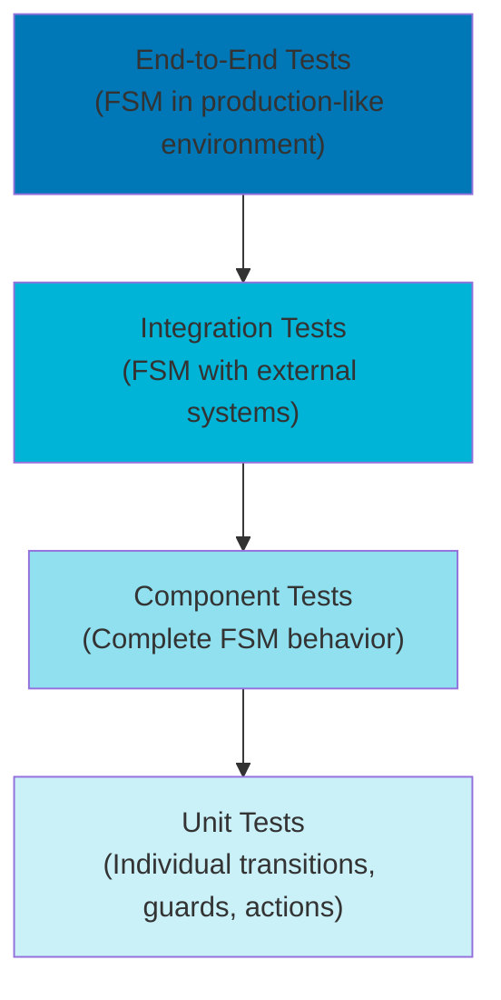

# Testing Finite State Machine Implementations

## Overview

Testing Finite State Machines (FSMs) requires comprehensive strategies that verify not only individual state transitions but also complex scenarios, edge cases, and system-level behavior. Effective FSM testing ensures correctness, reliability, and maintainability while providing confidence for refactoring and evolution. This document presents testing patterns, techniques, and best practices specifically tailored for FSM implementations.

## Purpose

This explanation provides:

- Testing strategies for different FSM aspects
- Unit testing patterns for states and transitions
- Integration testing approaches for FSM systems
- Property-based testing for FSM invariants
- Test data generation techniques
- Mocking and stubbing patterns
- Performance and load testing considerations
- Testing anti-patterns to avoid

## Target Audience

- Software engineers implementing FSMs
- QA engineers designing test strategies
- Test automation engineers building test suites
- Teams adopting FSM-based architectures
- Developers maintaining FSM implementations

## Prerequisites

- Understanding of FSM fundamentals (see `ex-soen-ar-fsm__01-fundamentals-and-theory.md`)
- Familiarity with implementation patterns (see `ex-soen-ar-fsm__04-implementation-patterns-approaches.md`)
- Basic knowledge of testing frameworks (JUnit, TestNG, etc.)
- Understanding of test-driven development concepts
- Familiarity with mocking frameworks

## Testing Pyramid for FSMs



**Test Distribution:**

- **Unit Tests**: 70% - Fast, focused on individual components
- **Component Tests**: 20% - Verify complete FSM behavior
- **Integration Tests**: 8% - Test FSM with dependencies
- **End-to-End Tests**: 2% - Full system validation

## Unit Testing FSM Components

### Testing State Transitions

**Example - Zakat Application State Transitions:**

```java
@ExtendWith(MockitoExtension.class)
class ZakatApplicationFSMTest {
    private ZakatApplicationFSM fsm;

    @Mock
    private ZakatApplicationRepository repository;

    @Mock
    private EventPublisher eventPublisher;

    @BeforeEach
    void setUp() {
        fsm = new ZakatApplicationFSM(repository, eventPublisher);
    }

    @Test
    @DisplayName("Should transition from DRAFT to PENDING_REVIEW when application is submitted")
    void testSubmitApplication() {
        // Arrange
        ZakatApplication application = ZakatApplication.builder()
            .id(new ZakatApplicationId("zakat-001"))
            .state(ZakatApplicationState.DRAFT)
            .wealth(new Wealth(BigDecimal.valueOf(100000)))
            .build();

        when(repository.findById(application.getId()))
            .thenReturn(Optional.of(application));

        // Act
        fsm.submitApplication(application.getId());

        // Assert
        assertEquals(
            ZakatApplicationState.PENDING_REVIEW,
            application.getState(),
            "Application should be in PENDING_REVIEW state after submission"
        );

        verify(repository).save(application);
        verify(eventPublisher).publish(
            argThat(event ->
                event instanceof ZakatApplicationSubmitted
                && ((ZakatApplicationSubmitted) event).getApplicationId()
                    .equals(application.getId())
            )
        );
    }

    @Test
    @DisplayName("Should reject transition when application is not in DRAFT state")
    void testSubmitApplicationInWrongState() {
        // Arrange
        ZakatApplication application = ZakatApplication.builder()
            .id(new ZakatApplicationId("zakat-002"))
            .state(ZakatApplicationState.APPROVED)
            .build();

        when(repository.findById(application.getId()))
            .thenReturn(Optional.of(application));

        // Act & Assert
        assertThrows(
            IllegalStateTransitionException.class,
            () -> fsm.submitApplication(application.getId()),
            "Should not allow submission from APPROVED state"
        );

        verify(repository, never()).save(any());
        verify(eventPublisher, never()).publish(any());
    }

    @Test
    @DisplayName("Should handle application not found")
    void testSubmitApplicationNotFound() {
        // Arrange
        ZakatApplicationId nonExistentId = new ZakatApplicationId("zakat-999");
        when(repository.findById(nonExistentId))
            .thenReturn(Optional.empty());

        // Act & Assert
        assertThrows(
            ZakatApplicationNotFoundException.class,
            () -> fsm.submitApplication(nonExistentId),
            "Should throw exception when application not found"
        );
    }
}
```

### Testing Guards

Guards control whether transitions are allowed. Test both positive and negative cases.

**Example - Loan Application Guards:**

```java
class LoanApplicationGuardsTest {
    private LoanApplicationGuards guards;

    @BeforeEach
    void setUp() {
        guards = new LoanApplicationGuards();
    }

    @Nested
    @DisplayName("Application Completeness Guard")
    class ApplicationCompletenessTests {

        @Test
        @DisplayName("Should allow transition when application is complete")
        void testCompleteApplication() {
            // Arrange
            LoanApplication application = LoanApplication.builder()
                .personalInfo(completePersonalInfo())
                .financialInfo(completeFinancialInfo())
                .documents(requiredDocuments())
                .build();

            // Act
            boolean result = guards.isApplicationComplete(application);

            // Assert
            assertTrue(result, "Complete application should pass guard");
        }

        @Test
        @DisplayName("Should block transition when personal info is missing")
        void testIncompletePersonalInfo() {
            // Arrange
            LoanApplication application = LoanApplication.builder()
                .personalInfo(incompletePersonalInfo())
                .financialInfo(completeFinancialInfo())
                .documents(requiredDocuments())
                .build();

            // Act
            boolean result = guards.isApplicationComplete(application);

            // Assert
            assertFalse(result, "Incomplete personal info should fail guard");
        }

        @Test
        @DisplayName("Should block transition when required documents are missing")
        void testMissingDocuments() {
            // Arrange
            LoanApplication application = LoanApplication.builder()
                .personalInfo(completePersonalInfo())
                .financialInfo(completeFinancialInfo())
                .documents(Collections.emptyList())
                .build();

            // Act
            boolean result = guards.isApplicationComplete(application);

            // Assert
            assertFalse(result, "Missing documents should fail guard");
        }
    }

    @Nested
    @DisplayName("Sharia Compliance Guard")
    class ShariaComplianceTests {

        @Test
        @DisplayName("Should pass when loan has no interest (Riba-free)")
        void testRibaFree() {
            // Arrange
            LoanTerms terms = LoanTerms.builder()
                .interestRate(BigDecimal.ZERO)
                .profitSharingRatio(new BigDecimal("0.30"))
                .build();

            LoanApplication application = LoanApplication.builder()
                .terms(terms)
                .build();

            // Act
            boolean result = guards.isShariaCompliant(application);

            // Assert
            assertTrue(result, "Riba-free loan should be Sharia compliant");
        }

        @Test
        @DisplayName("Should fail when loan has interest (contains Riba)")
        void testContainsRiba() {
            // Arrange
            LoanTerms terms = LoanTerms.builder()
                .interestRate(new BigDecimal("0.05"))  // 5% interest
                .build();

            LoanApplication application = LoanApplication.builder()
                .terms(terms)
                .build();

            // Act
            boolean result = guards.isShariaCompliant(application);

            // Assert
            assertFalse(result, "Interest-bearing loan should not be Sharia compliant");
        }
    }
}
```

### Testing Actions

Actions perform side effects during transitions. Test them in isolation with mocks.

**Example - Contract Approval Actions:**

```java
@ExtendWith(MockitoExtension.class)
class ContractApprovalActionsTest {
    private ContractApprovalActions actions;

    @Mock
    private NotificationService notificationService;

    @Mock
    private AuditService auditService;

    @Mock
    private DocumentGenerationService documentService;

    @BeforeEach
    void setUp() {
        actions = new ContractApprovalActions(
            notificationService,
            auditService,
            documentService
        );
    }

    @Test
    @DisplayName("Should notify all stakeholders on approval")
    void testNotifyStakeholdersOnApproval() {
        // Arrange
        Contract contract = Contract.builder()
            .id(new ContractId("contract-001"))
            .draftedBy(new UserId("user-001"))
            .legalReviewer(new UserId("legal-001"))
            .shariaReviewer(new UserId("sharia-001"))
            .build();

        // Act
        actions.notifyApproval(contract);

        // Assert
        verify(notificationService).notify(
            eq(contract.getDraftedBy()),
            argThat(notification ->
                notification.getType() == NotificationType.CONTRACT_APPROVED
                && notification.getContractId().equals(contract.getId())
            )
        );

        verify(notificationService).notify(
            eq(contract.getLegalReviewer()),
            any(Notification.class)
        );

        verify(notificationService).notify(
            eq(contract.getShariaReviewer()),
            any(Notification.class)
        );
    }

    @Test
    @DisplayName("Should generate final contract document on approval")
    void testGenerateFinalDocument() {
        // Arrange
        Contract contract = Contract.builder()
            .id(new ContractId("contract-002"))
            .state(ContractState.APPROVED)
            .build();

        Document expectedDocument = new Document(
            "final-contract-002.pdf",
            DocumentType.FINAL_CONTRACT
        );

        when(documentService.generateFinalContract(contract))
            .thenReturn(expectedDocument);

        // Act
        Document result = actions.generateFinalDocument(contract);

        // Assert
        assertNotNull(result, "Should return generated document");
        assertEquals(expectedDocument, result);
        verify(documentService).generateFinalContract(contract);
    }

    @Test
    @DisplayName("Should create audit log entry for state transition")
    void testAuditLogCreation() {
        // Arrange
        Contract contract = Contract.builder()
            .id(new ContractId("contract-003"))
            .build();

        ContractState fromState = ContractState.LEGAL_REVIEW;
        ContractState toState = ContractState.SHARIA_REVIEW;
        UserId performedBy = new UserId("user-005");

        // Act
        actions.auditStateTransition(contract, fromState, toState, performedBy);

        // Assert
        verify(auditService).log(
            argThat(entry ->
                entry.getEntityId().equals(contract.getId())
                && entry.getAction().equals("STATE_TRANSITION")
                && entry.getFromState().equals(fromState)
                && entry.getToState().equals(toState)
                && entry.getPerformedBy().equals(performedBy)
            )
        );
    }
}
```

### Testing State Entry and Exit Actions

**Example - Campaign State Lifecycle:**

```java
class CampaignStateLifecycleTest {
    private Campaign campaign;

    @Mock
    private CampaignRepository repository;

    @Mock
    private MetricsService metricsService;

    @BeforeEach
    void setUp() {
        MockitoAnnotations.openMocks(this);
        campaign = Campaign.builder()
            .id(new CampaignId("campaign-001"))
            .goal(BigDecimal.valueOf(100000))
            .build();
    }

    @Test
    @DisplayName("Should initialize metrics on entering FUNDRAISING state")
    void testEnterFundraisingState() {
        // Arrange
        CampaignStateMachine fsm = new CampaignStateMachine(repository, metricsService);

        // Act
        fsm.startFundraising(campaign);

        // Assert
        assertEquals(CampaignState.FUNDRAISING, campaign.getState());
        verify(metricsService).initializeCampaignMetrics(campaign.getId());
        verify(metricsService).recordStateEntry(campaign.getId(), CampaignState.FUNDRAISING);
    }

    @Test
    @DisplayName("Should finalize metrics on exiting FUNDRAISING state")
    void testExitFundraisingState() {
        // Arrange
        campaign.setState(CampaignState.FUNDRAISING);
        campaign.setTotalDonations(campaign.getGoal());

        CampaignStateMachine fsm = new CampaignStateMachine(repository, metricsService);

        // Act
        fsm.reachGoal(campaign);

        // Assert
        assertEquals(CampaignState.GOAL_REACHED, campaign.getState());
        verify(metricsService).recordStateExit(campaign.getId(), CampaignState.FUNDRAISING);
        verify(metricsService).finalizeFundraisingMetrics(
            campaign.getId(),
            campaign.getTotalDonations()
        );
    }
}
```

## Component Testing: Complete FSM Behavior

Component tests verify entire FSM workflows end-to-end.

### Testing State Machine Paths

**Example - Zakat Calculation Workflow:**

```java
@SpringBootTest
class ZakatCalculationFSMIntegrationTest {
    @Autowired
    private ZakatCalculationFSM fsm;

    @Autowired
    private ZakatCalculationRepository repository;

    @Autowired
    private TestEventCollector eventCollector;

    @BeforeEach
    void setUp() {
        repository.deleteAll();
        eventCollector.clear();
    }

    @Test
    @DisplayName("Should complete standard zakat calculation workflow")
    void testStandardCalculationWorkflow() {
        // Arrange: Create calculation in initial state
        ZakatCalculation calculation = ZakatCalculation.builder()
            .id(new ZakatCalculationId("calc-001"))
            .state(ZakatCalculationState.GATHERING_DATA)
            .wealth(new Wealth(BigDecimal.valueOf(100000)))
            .nisabThreshold(BigDecimal.valueOf(85000))
            .build();

        repository.save(calculation);

        // Act: Execute workflow steps
        fsm.startCalculation(calculation.getId());
        fsm.completeDataGathering(calculation.getId());
        fsm.performCalculation(calculation.getId());

        // Assert: Verify final state
        ZakatCalculation result = repository.findById(calculation.getId()).orElseThrow();

        assertEquals(
            ZakatCalculationState.COMPLETED,
            result.getState(),
            "Calculation should reach COMPLETED state"
        );

        assertNotNull(result.getZakatAmount(), "Zakat amount should be calculated");
        assertEquals(
            new BigDecimal("2500.00"),  // 2.5% of 100000
            result.getZakatAmount(),
            "Zakat amount should be 2.5% of wealth"
        );

        // Verify events were published in correct order
        List<DomainEvent> events = eventCollector.getEvents();
        assertEquals(3, events.size(), "Should publish 3 events");

        assertTrue(events.get(0) instanceof ZakatCalculationStarted);
        assertTrue(events.get(1) instanceof ZakatCalculationPerformed);
        assertTrue(events.get(2) instanceof ZakatCalculationCompleted);
    }

    @Test
    @DisplayName("Should route complex calculation to manual review")
    void testComplexCalculationRequiresReview() {
        // Arrange: Create complex calculation
        ZakatCalculation calculation = ZakatCalculation.builder()
            .id(new ZakatCalculationId("calc-002"))
            .state(ZakatCalculationState.GATHERING_DATA)
            .wealth(new Wealth(BigDecimal.valueOf(500000)))
            .hasComplexAssets(true)  // Requires manual review
            .build();

        repository.save(calculation);

        // Act
        fsm.startCalculation(calculation.getId());
        fsm.completeDataGathering(calculation.getId());
        fsm.performCalculation(calculation.getId());

        // Assert
        ZakatCalculation result = repository.findById(calculation.getId()).orElseThrow();

        assertEquals(
            ZakatCalculationState.REVIEW_REQUIRED,
            result.getState(),
            "Complex calculation should require review"
        );

        // Verify review notification event
        List<DomainEvent> events = eventCollector.getEvents();
        assertTrue(
            events.stream().anyMatch(e -> e instanceof ZakatCalculationReviewRequired),
            "Should publish review required event"
        );
    }

    @Test
    @DisplayName("Should handle calculation errors gracefully")
    void testCalculationError() {
        // Arrange: Create calculation with invalid data
        ZakatCalculation calculation = ZakatCalculation.builder()
            .id(new ZakatCalculationId("calc-003"))
            .state(ZakatCalculationState.GATHERING_DATA)
            .wealth(null)  // Invalid: null wealth
            .build();

        repository.save(calculation);

        // Act & Assert
        assertThrows(
            ZakatCalculationException.class,
            () -> {
                fsm.startCalculation(calculation.getId());
                fsm.performCalculation(calculation.getId());
            },
            "Should throw exception for invalid data"
        );

        // Verify error state
        ZakatCalculation result = repository.findById(calculation.getId()).orElseThrow();
        assertEquals(
            ZakatCalculationState.ERROR,
            result.getState(),
            "Should transition to ERROR state on failure"
        );
    }
}
```

### Testing All Valid Transition Paths

Use parameterized tests to verify all valid transitions:

```java
class ContractApprovalTransitionsTest {
    private ContractApprovalFSM fsm;

    static Stream<Arguments> validTransitionProvider() {
        return Stream.of(
            Arguments.of(ContractState.DRAFT, ContractEvent.SUBMIT, ContractState.LEGAL_REVIEW),
            Arguments.of(ContractState.LEGAL_REVIEW, ContractEvent.APPROVE_LEGAL, ContractState.SHARIA_REVIEW),
            Arguments.of(ContractState.LEGAL_REVIEW, ContractEvent.REQUEST_CHANGES, ContractState.REVISION_NEEDED),
            Arguments.of(ContractState.REVISION_NEEDED, ContractEvent.RESUBMIT, ContractState.LEGAL_REVIEW),
            Arguments.of(ContractState.SHARIA_REVIEW, ContractEvent.APPROVE_SHARIA, ContractState.APPROVED),
            Arguments.of(ContractState.SHARIA_REVIEW, ContractEvent.REJECT, ContractState.REJECTED)
        );
    }

    @ParameterizedTest(name = "{0} + {1} -> {2}")
    @MethodSource("validTransitionProvider")
    @DisplayName("Should allow valid transitions")
    void testValidTransitions(
        ContractState fromState,
        ContractEvent event,
        ContractState expectedToState
    ) {
        // Arrange
        Contract contract = Contract.builder()
            .id(new ContractId("contract-" + UUID.randomUUID()))
            .state(fromState)
            .build();

        // Act
        ContractState resultState = fsm.transition(contract, event);

        // Assert
        assertEquals(
            expectedToState,
            resultState,
            String.format(
                "Transition %s + %s should result in %s",
                fromState,
                event,
                expectedToState
            )
        );
    }

    static Stream<Arguments> invalidTransitionProvider() {
        return Stream.of(
            Arguments.of(ContractState.APPROVED, ContractEvent.SUBMIT),
            Arguments.of(ContractState.REJECTED, ContractEvent.APPROVE_LEGAL),
            Arguments.of(ContractState.DRAFT, ContractEvent.APPROVE_SHARIA),
            Arguments.of(ContractState.LEGAL_REVIEW, ContractEvent.RESUBMIT)
        );
    }

    @ParameterizedTest(name = "{0} + {1} should be invalid")
    @MethodSource("invalidTransitionProvider")
    @DisplayName("Should reject invalid transitions")
    void testInvalidTransitions(ContractState fromState, ContractEvent event) {
        // Arrange
        Contract contract = Contract.builder()
            .id(new ContractId("contract-" + UUID.randomUUID()))
            .state(fromState)
            .build();

        // Act & Assert
        assertThrows(
            IllegalStateTransitionException.class,
            () -> fsm.transition(contract, event),
            String.format("Transition %s + %s should be invalid", fromState, event)
        );
    }
}
```

## Property-Based Testing

Property-based testing verifies FSM invariants hold for all inputs.

### Testing FSM Invariants

**Example - State Machine Invariants:**

```java
class LoanApplicationFSMPropertyTest {

    @Property
    @DisplayName("State machine should never reach an undefined state")
    void shouldNeverReachUndefinedState(
        @ForAll("validLoanApplications") LoanApplication application,
        @ForAll("validEvents") LoanApplicationEvent event
    ) {
        // Arrange
        LoanApplicationFSM fsm = new LoanApplicationFSM();
        Set<LoanApplicationState> definedStates = Set.of(
            LoanApplicationState.DRAFT,
            LoanApplicationState.SUBMITTED,
            LoanApplicationState.UNDERWRITING,
            LoanApplicationState.APPROVED,
            LoanApplicationState.REJECTED
        );

        // Act
        try {
            fsm.transition(application, event);
        } catch (IllegalStateTransitionException e) {
            // Expected for invalid transitions
        }

        // Assert
        assertTrue(
            definedStates.contains(application.getState()),
            "State should always be one of the defined states"
        );
    }

    @Property
    @DisplayName("Once in final state, no transitions should be possible")
    void finalStatesShouldBeTerminal(
        @ForAll("finalStateApplications") LoanApplication application,
        @ForAll("validEvents") LoanApplicationEvent event
    ) {
        // Arrange
        LoanApplicationFSM fsm = new LoanApplicationFSM();
        LoanApplicationState initialState = application.getState();

        assertTrue(
            initialState == LoanApplicationState.APPROVED
            || initialState == LoanApplicationState.REJECTED,
            "Application should be in a final state"
        );

        // Act
        try {
            fsm.transition(application, event);
        } catch (IllegalStateTransitionException e) {
            // Expected - final states should not allow transitions
        }

        // Assert
        assertEquals(
            initialState,
            application.getState(),
            "Final state should remain unchanged"
        );
    }

    @Property
    @DisplayName("State transitions should be deterministic")
    void transitionsShouldBeDeterministic(
        @ForAll("validLoanApplications") LoanApplication application,
        @ForAll("validEvents") LoanApplicationEvent event
    ) {
        // Arrange
        LoanApplicationFSM fsm = new LoanApplicationFSM();
        LoanApplication copy1 = application.copy();
        LoanApplication copy2 = application.copy();

        // Act
        LoanApplicationState result1 = null;
        LoanApplicationState result2 = null;

        try {
            fsm.transition(copy1, event);
            result1 = copy1.getState();

            fsm.transition(copy2, event);
            result2 = copy2.getState();
        } catch (IllegalStateTransitionException e) {
            // Both should throw or both should succeed
        }

        // Assert
        assertEquals(
            result1,
            result2,
            "Same input should produce same output (deterministic)"
        );
    }

    @Provide
    Arbitrary<LoanApplication> validLoanApplications() {
        return Combinators.combine(
            Arbitraries.of(LoanApplicationState.class),
            Arbitraries.bigDecimals()
                .between(BigDecimal.valueOf(1000), BigDecimal.valueOf(1000000))
        ).as((state, amount) ->
            LoanApplication.builder()
                .id(new LoanApplicationId(UUID.randomUUID().toString()))
                .state(state)
                .requestedAmount(amount)
                .build()
        );
    }

    @Provide
    Arbitrary<LoanApplication> finalStateApplications() {
        return Combinators.combine(
            Arbitraries.of(
                LoanApplicationState.APPROVED,
                LoanApplicationState.REJECTED
            ),
            Arbitraries.bigDecimals()
                .between(BigDecimal.valueOf(1000), BigDecimal.valueOf(1000000))
        ).as((state, amount) ->
            LoanApplication.builder()
                .id(new LoanApplicationId(UUID.randomUUID().toString()))
                .state(state)
                .requestedAmount(amount)
                .build()
        );
    }

    @Provide
    Arbitrary<LoanApplicationEvent> validEvents() {
        return Arbitraries.of(LoanApplicationEvent.class);
    }
}
```

## Integration Testing with External Systems

### Testing with Message Queues

**Example - Kafka Integration Test:**

```java
@SpringBootTest
@EmbeddedKafka(
    partitions = 1,
    topics = {"zakat-applications"},
    brokerProperties = {
        "listeners=PLAINTEXT://localhost:9092",
        "port=9092"
    }
)
class ZakatApplicationKafkaIntegrationTest {
    @Autowired
    private KafkaTemplate<String, ZakatApplicationEvent> kafkaTemplate;

    @Autowired
    private ZakatApplicationEventConsumer consumer;

    @Autowired
    private ZakatApplicationRepository repository;

    @Test
    @DisplayName("Should process ZakatApplicationSubmitted event from Kafka")
    void testProcessSubmittedEvent() throws Exception {
        // Arrange
        ZakatApplication application = ZakatApplication.builder()
            .id(new ZakatApplicationId("zakat-kafka-001"))
            .state(ZakatApplicationState.DRAFT)
            .build();

        repository.save(application);

        ZakatApplicationSubmitted event = new ZakatApplicationSubmitted(
            application.getId(),
            Instant.now()
        );

        // Act: Publish event to Kafka
        kafkaTemplate.send("zakat-applications", application.getId().value(), event)
            .get(5, TimeUnit.SECONDS);

        // Wait for consumer to process
        await()
            .atMost(Duration.ofSeconds(10))
            .pollInterval(Duration.ofMillis(500))
            .until(() -> {
                Optional<ZakatApplication> updated =
                    repository.findById(application.getId());
                return updated.isPresent()
                    && updated.get().getState() == ZakatApplicationState.PENDING_REVIEW;
            });

        // Assert
        ZakatApplication result = repository.findById(application.getId()).orElseThrow();
        assertEquals(
            ZakatApplicationState.PENDING_REVIEW,
            result.getState(),
            "Application state should be updated via Kafka event"
        );
    }
}
```

### Testing with Database Transactions

**Example - Transactional FSM Test:**

```java
@SpringBootTest
@Transactional
class TransactionalFSMTest {
    @Autowired
    private ContractApprovalFSM fsm;

    @Autowired
    private ContractRepository repository;

    @Autowired
    private TestEntityManager entityManager;

    @Test
    @DisplayName("Should rollback state transition on database error")
    void testRollbackOnError() {
        // Arrange
        Contract contract = Contract.builder()
            .id(new ContractId("contract-tx-001"))
            .state(ContractState.DRAFT)
            .build();

        repository.save(contract);
        entityManager.flush();

        ContractState initialState = contract.getState();

        // Act & Assert: Simulate database error during transition
        assertThrows(
            DataIntegrityViolationException.class,
            () -> {
                fsm.submitContract(contract.getId());
                // Force constraint violation
                entityManager.flush();
            }
        );

        // Clear persistence context and reload
        entityManager.clear();
        Contract reloaded = repository.findById(contract.getId()).orElseThrow();

        // Verify state was rolled back
        assertEquals(
            initialState,
            reloaded.getState(),
            "State should be rolled back on transaction failure"
        );
    }
}
```

## Test Data Generation

### Test Data Builders

**Example - Fluent Test Data Builders:**

```java
public class LoanApplicationTestBuilder {
    private LoanApplicationId id = new LoanApplicationId("test-loan-001");
    private LoanApplicationState state = LoanApplicationState.DRAFT;
    private PersonalInfo personalInfo = defaultPersonalInfo();
    private FinancialInfo financialInfo = defaultFinancialInfo();
    private List<Document> documents = defaultDocuments();
    private BigDecimal requestedAmount = BigDecimal.valueOf(50000);
    private Duration term = Duration.ofDays(365);

    public static LoanApplicationTestBuilder aLoanApplication() {
        return new LoanApplicationTestBuilder();
    }

    public LoanApplicationTestBuilder withId(String id) {
        this.id = new LoanApplicationId(id);
        return this;
    }

    public LoanApplicationTestBuilder inState(LoanApplicationState state) {
        this.state = state;
        return this;
    }

    public LoanApplicationTestBuilder inDraftState() {
        return inState(LoanApplicationState.DRAFT);
    }

    public LoanApplicationTestBuilder submitted() {
        return inState(LoanApplicationState.SUBMITTED);
    }

    public LoanApplicationTestBuilder approved() {
        return inState(LoanApplicationState.APPROVED);
    }

    public LoanApplicationTestBuilder withAmount(BigDecimal amount) {
        this.requestedAmount = amount;
        return this;
    }

    public LoanApplicationTestBuilder withCompleteInfo() {
        this.personalInfo = completePersonalInfo();
        this.financialInfo = completeFinancialInfo();
        this.documents = allRequiredDocuments();
        return this;
    }

    public LoanApplicationTestBuilder withIncompleteInfo() {
        this.personalInfo = incompletePersonalInfo();
        return this;
    }

    public LoanApplicationTestBuilder withShariaCompliantTerms() {
        // No interest, profit-sharing based
        this.financialInfo = FinancialInfo.builder()
            .interestRate(BigDecimal.ZERO)
            .profitSharingRatio(new BigDecimal("0.30"))
            .build();
        return this;
    }

    public LoanApplicationTestBuilder withNonCompliantTerms() {
        // Contains interest (Riba)
        this.financialInfo = FinancialInfo.builder()
            .interestRate(new BigDecimal("0.05"))
            .build();
        return this;
    }

    public LoanApplication build() {
        return LoanApplication.builder()
            .id(id)
            .state(state)
            .personalInfo(personalInfo)
            .financialInfo(financialInfo)
            .documents(documents)
            .requestedAmount(requestedAmount)
            .term(term)
            .build();
    }
}

// Usage in tests
@Test
void testCompleteApplication() {
    LoanApplication application = aLoanApplication()
        .withId("loan-test-001")
        .inDraftState()
        .withCompleteInfo()
        .withShariaCompliantTerms()
        .build();

    assertTrue(guards.isApplicationComplete(application));
    assertTrue(guards.isShariaCompliant(application));
}
```

### Object Mother Pattern

**Example - Domain Object Mothers:**

```java
public class ZakatApplicationMother {
    public static ZakatApplication draftApplication() {
        return ZakatApplication.builder()
            .id(new ZakatApplicationId("zakat-draft-" + UUID.randomUUID()))
            .state(ZakatApplicationState.DRAFT)
            .applicant(UserMother.standardUser())
            .wealth(WealthMother.aboveNisab())
            .build();
    }

    public static ZakatApplication pendingReviewApplication() {
        return ZakatApplication.builder()
            .id(new ZakatApplicationId("zakat-review-" + UUID.randomUUID()))
            .state(ZakatApplicationState.PENDING_REVIEW)
            .applicant(UserMother.standardUser())
            .wealth(WealthMother.aboveNisab())
            .submittedAt(Instant.now().minus(Duration.ofHours(2)))
            .build();
    }

    public static ZakatApplication approvedApplication() {
        return ZakatApplication.builder()
            .id(new ZakatApplicationId("zakat-approved-" + UUID.randomUUID()))
            .state(ZakatApplicationState.APPROVED)
            .applicant(UserMother.standardUser())
            .wealth(WealthMother.aboveNisab())
            .zakatAmount(new BigDecimal("2500.00"))
            .approvedAt(Instant.now())
            .build();
    }

    public static ZakatApplication belowNisabApplication() {
        return ZakatApplication.builder()
            .id(new ZakatApplicationId("zakat-below-" + UUID.randomUUID()))
            .state(ZakatApplicationState.DRAFT)
            .wealth(WealthMother.belowNisab())
            .build();
    }
}

public class WealthMother {
    public static Wealth aboveNisab() {
        return new Wealth(BigDecimal.valueOf(100000));  // Well above typical nisab
    }

    public static Wealth belowNisab() {
        return new Wealth(BigDecimal.valueOf(50000));  // Below typical nisab
    }

    public static Wealth exactlyAtNisab() {
        return new Wealth(BigDecimal.valueOf(85000));  // Exactly at nisab threshold
    }
}
```

## Performance and Load Testing

### Performance Tests for State Transitions

**Example - JMH Benchmarks:**

```java
@State(Scope.Benchmark)
@BenchmarkMode(Mode.Throughput)
@OutputTimeUnit(TimeUnit.SECONDS)
@Warmup(iterations = 3, time = 1, timeUnit = TimeUnit.SECONDS)
@Measurement(iterations = 5, time = 1, timeUnit = TimeUnit.SECONDS)
@Fork(1)
public class FSMPerformanceBenchmark {
    private LoanApplicationFSM fsm;
    private List<LoanApplication> applications;

    @Setup
    public void setup() {
        fsm = new LoanApplicationFSM();
        applications = IntStream.range(0, 1000)
            .mapToObj(i -> LoanApplicationMother.draftApplication())
            .collect(Collectors.toList());
    }

    @Benchmark
    public void measureSingleTransition() {
        LoanApplication application = applications.get(0);
        fsm.submitApplication(application.getId());
    }

    @Benchmark
    public void measureBatchTransitions(Blackhole blackhole) {
        for (LoanApplication application : applications) {
            fsm.submitApplication(application.getId());
            blackhole.consume(application.getState());
        }
    }

    @Benchmark
    public void measureCompleteWorkflow() {
        LoanApplication application = LoanApplicationMother.draftApplication();
        fsm.submitApplication(application.getId());
        fsm.moveToUnderwriting(application.getId());
        fsm.approveApplication(application.getId());
    }
}
```

### Concurrency Testing

**Example - Concurrent State Transitions:**

```java
@SpringBootTest
class ConcurrentFSMTest {
    @Autowired
    private CampaignFSM fsm;

    @Autowired
    private CampaignRepository repository;

    @Test
    @DisplayName("Should handle concurrent donations correctly")
    void testConcurrentDonations() throws InterruptedException {
        // Arrange
        Campaign campaign = Campaign.builder()
            .id(new CampaignId("campaign-concurrent-001"))
            .state(CampaignState.FUNDRAISING)
            .goal(BigDecimal.valueOf(100000))
            .totalDonations(BigDecimal.ZERO)
            .build();

        repository.save(campaign);

        int numberOfThreads = 10;
        int donationsPerThread = 100;
        BigDecimal donationAmount = BigDecimal.valueOf(10);

        ExecutorService executor = Executors.newFixedThreadPool(numberOfThreads);
        CountDownLatch latch = new CountDownLatch(numberOfThreads);
        ConcurrentLinkedQueue<Exception> exceptions = new ConcurrentLinkedQueue<>();

        // Act: Submit concurrent donations
        for (int i = 0; i < numberOfThreads; i++) {
            executor.submit(() -> {
                try {
                    for (int j = 0; j < donationsPerThread; j++) {
                        fsm.processDonation(campaign.getId(), donationAmount);
                    }
                } catch (Exception e) {
                    exceptions.add(e);
                } finally {
                    latch.countDown();
                }
            });
        }

        latch.await(30, TimeUnit.SECONDS);
        executor.shutdown();

        // Assert
        assertTrue(exceptions.isEmpty(), "No exceptions should occur during concurrent processing");

        Campaign result = repository.findById(campaign.getId()).orElseThrow();

        BigDecimal expectedTotal = donationAmount.multiply(
            BigDecimal.valueOf(numberOfThreads * donationsPerThread)
        );

        assertEquals(
            expectedTotal,
            result.getTotalDonations(),
            "Total donations should be sum of all concurrent donations"
        );
    }
}
```

## Testing Anti-Patterns to Avoid

### Anti-Pattern 1: Testing Implementation Details

**Bad:**

```java
@Test
void testInternalStateVariable() {
    // Accessing private field directly
    Field stateField = fsm.getClass().getDeclaredField("currentState");
    stateField.setAccessible(true);
    assertEquals(State.DRAFT, stateField.get(fsm));
}
```

**Good:**

```java
@Test
void testPublicStateAPI() {
    // Test through public API
    assertEquals(State.DRAFT, fsm.getCurrentState());
}
```

### Anti-Pattern 2: Over-Mocking

**Bad:**

```java
@Test
void testWithTooManyMocks() {
    // Mocking everything, including simple value objects
    when(mockApplicationId.value()).thenReturn("app-001");
    when(mockState.toString()).thenReturn("DRAFT");
    when(mockWealth.getAmount()).thenReturn(BigDecimal.valueOf(100000));
    // ... 20 more mocks
}
```

**Good:**

```java
@Test
void testWithRealObjects() {
    // Use real objects for value types, mock only external dependencies
    LoanApplicationId id = new LoanApplicationId("app-001");
    LoanApplicationState state = LoanApplicationState.DRAFT;
    Wealth wealth = new Wealth(BigDecimal.valueOf(100000));

    // Only mock external services
    when(mockNotificationService.send(any())).thenReturn(true);
}
```

### Anti-Pattern 3: Fragile Tests

**Bad:**

```java
@Test
void testWithHardcodedTimestamps() {
    // Test breaks if system time changes
    assertThat(application.getSubmittedAt())
        .isEqualTo(Instant.parse("2024-11-20T10:00:00Z"));
}
```

**Good:**

```java
@Test
void testWithRelativeTimestamps() {
    Instant before = Instant.now();
    application.submit();
    Instant after = Instant.now();

    // Test relative to execution time
    assertThat(application.getSubmittedAt())
        .isAfter(before)
        .isBefore(after);
}
```

### Anti-Pattern 4: Non-Deterministic Tests

**Bad:**

```java
@Test
void testWithRandomness() {
    // Random behavior makes test flaky
    if (Math.random() > 0.5) {
        application.approve();
    }
    // Assertion may or may not pass
}
```

**Good:**

```java
@Test
void testDeterministically() {
    // Controlled, deterministic behavior
    application.approve();
    assertEquals(State.APPROVED, application.getState());
}
```

## Test Coverage Metrics

### Coverage Goals

- **Line Coverage**: Target 80%+ for FSM core logic
- **Branch Coverage**: Target 90%+ for transition logic
- **State Coverage**: 100% - all states must be tested
- **Transition Coverage**: 100% - all transitions must be tested
- **Path Coverage**: Critical paths must be tested

### Mutation Testing

Use mutation testing to verify test quality:

```xml
<!-- Maven PIT configuration -->
<plugin>
    <groupId>org.pitest</groupId>
    <artifactId>pitest-maven</artifactId>
    <version>1.15.0</version>
    <configuration>
        <targetClasses>
            <param>com.oseplatform.fsm.*</param>
        </targetClasses>
        <targetTests>
            <param>com.oseplatform.fsm.*Test</param>
        </targetTests>
        <mutationThreshold>80</mutationThreshold>
        <coverageThreshold>90</coverageThreshold>
    </configuration>
</plugin>
```

## Related Documentation

- **FSM Fundamentals**: `ex-soen-ar-fsm__01-fundamentals-and-theory.md`
- **Implementation Patterns**: `ex-soen-ar-fsm__04-implementation-patterns-approaches.md`
- **Event-Driven FSMs**: `ex-soen-ar-fsm__11-event-driven-and-reactive-fsm.md`
- **Best Practices**: `ex-soen-ar-fsm__17-best-practices.md`

## Summary

Comprehensive FSM testing requires multiple strategies:

- **Unit Tests**: Verify individual components (transitions, guards, actions)
- **Component Tests**: Validate complete FSM workflows
- **Integration Tests**: Test FSM with external systems
- **Property-Based Tests**: Verify invariants hold universally
- **Performance Tests**: Ensure FSM meets performance requirements
- **Concurrency Tests**: Validate thread-safety

Key principles:

1. **Test behavior, not implementation**
2. **Use test data builders for flexibility**
3. **Verify all valid and invalid transitions**
4. **Test error handling and edge cases**
5. **Maintain deterministic tests**
6. **Aim for high coverage of FSM core logic**

Well-tested FSMs provide confidence for refactoring, enable safe evolution, and serve as living documentation of system behavior.

## Principles Applied

- **Explicit Over Implicit**: Tests document expected FSM behavior explicitly
- **Automation Over Manual**: Automated tests replace manual verification
- **Simplicity Over Complexity**: Test focused on behavior, not implementation details
- **Robustness and Reliability**: Comprehensive tests ensure FSM reliability
