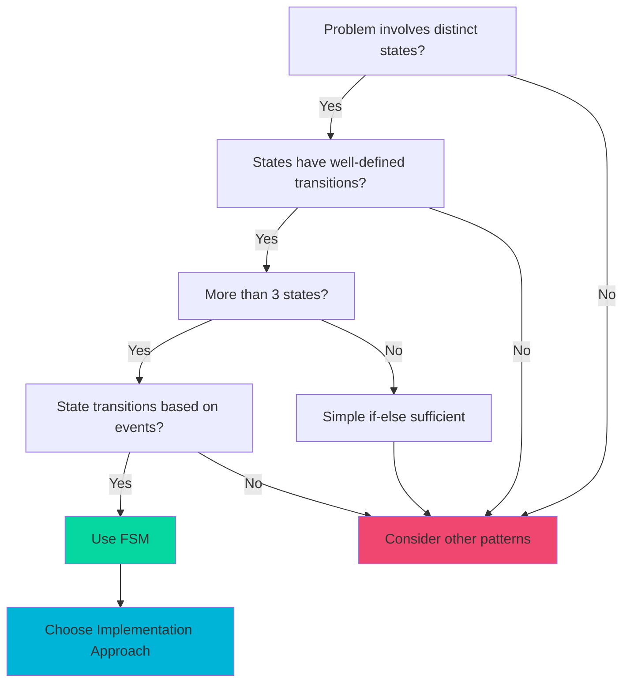
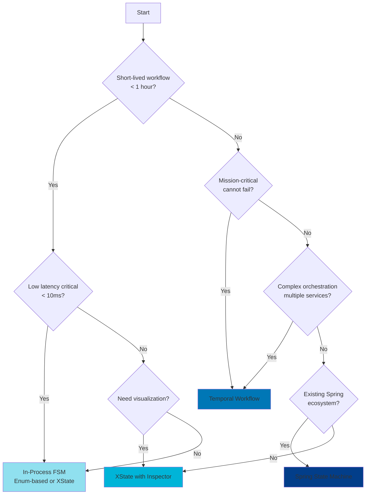

# Decision Trees and Guidelines for FSM Design

## Overview

Choosing the right Finite State Machine (FSM) approach requires evaluating multiple factors including system requirements, team capabilities, operational constraints, and business needs. This document provides decision trees, selection criteria, and practical guidelines to help teams make informed choices about FSM design, implementation strategies, and tooling.

## Purpose

This explanation provides:

- Decision trees for FSM design choices
- Selection criteria for implementation approaches
- Framework selection guidelines
- Complexity assessment methods
- Architecture pattern recommendations
- Migration decision frameworks
- Trade-off analysis templates

## Target Audience

- Software architects designing FSM-based systems
- Technical leads evaluating implementation options
- Platform engineers standardizing FSM approaches
- Teams choosing between FSM frameworks
- Engineering managers planning FSM initiatives

## Prerequisites

- Understanding of FSM fundamentals (see `ex-soen-ar-fsm__01-fundamentals-and-theory.md`)
- Familiarity with implementation patterns (see `ex-soen-ar-fsm__04-implementation-patterns-approaches.md`)
- Knowledge of different frameworks (see `ex-soen-ar-fsm__13-framework-spring-state-machine-xstate.md` and `ex-soen-ar-fsm__14-framework-statecharts-temporal-cadence.md`)

## Primary Decision Tree: Should You Use an FSM?



### When to Use FSM

**Use FSM when:**

1. **Clear State Boundaries**
   - System has distinct, identifiable states
   - State transitions are well-defined
   - Current state affects system behavior

   **Example**: Loan application lifecycle (`draft`, `submitted`, `approved`, `rejected`)

2. **Event-Driven Transitions**
   - State changes triggered by specific events
   - Events can be named and categorized
   - Multiple events may trigger same transition

   **Example**: Zakat application submission triggers `SUBMIT` event

3. **Complex State Logic**
   - More than 3-4 states
   - Multiple possible transitions from each state
   - Guards or conditions on transitions
   - Actions executed during transitions

   **Example**: Contract approval with legal review, Sharia review, and revision cycles

4. **Need for Visualization**
   - Non-technical stakeholders need to understand workflow
   - Documentation requires state diagrams
   - Compliance requires process visualization

   **Example**: Campaign fundraising lifecycle for donor transparency

### When NOT to Use FSM

**Avoid FSM when:**

1. **Simple Binary States**
   - Only 2 states (e.g., `active`/`inactive`)
   - Single transition path
   - No complex logic

   **Alternative**: Boolean flag or enum

2. **Continuous State Changes**
   - State changes continuously (not discrete)
   - No clear boundaries between states
   - Time-based progression

   **Alternative**: State variables with calculators

3. **Excessive State Explosion**
   - Combinatorial state growth (e.g., 10 independent toggles = 1024 states)
   - Better represented as separate concerns

   **Alternative**: Multiple independent state machines or component state

4. **Purely Data-Driven**
   - Behavior doesn't change based on state
   - Only storing status for reporting

   **Alternative**: Status field in database

## Implementation Approach Decision Tree



### Implementation Pattern Selection

#### Pattern 1: Enum-Based State Machine

**Choose When:**

- Simple state machines (3-8 states)
- Performance critical (sub-millisecond transitions)
- Minimal dependencies preferred
- Team comfortable with imperative code

**OSE Example**: User session state

```java
public enum SessionState {
    ANONYMOUS,
    AUTHENTICATED,
    ELEVATED,
    LOCKED,
    EXPIRED
}

public class SessionStateMachine {
    private SessionState currentState = SessionState.ANONYMOUS;

    public void authenticate(User user) {
        if (currentState == SessionState.ANONYMOUS) {
            currentState = SessionState.AUTHENTICATED;
        }
    }
}
```

**Trade-offs:**

- ✓ Fast execution
- ✓ Simple to understand
- ✓ No external dependencies
- ✗ Manual transition logic
- ✗ No automatic validation
- ✗ Harder to visualize

#### Pattern 2: State Pattern (OOP)

**Choose When:**

- State-specific behavior varies significantly
- Encapsulation of state logic desired
- Object-oriented design preferred
- Medium complexity (5-15 states)

**OSE Example**: Document approval workflow

```java
interface DocumentState {
    void submit(Document document);
    void approve(Document document);
    void reject(Document document);
}

class DraftState implements DocumentState {
    @Override
    public void submit(Document document) {
        document.setState(new ReviewState());
        notifyReviewers(document);
    }

    @Override
    public void approve(Document document) {
        throw new IllegalStateTransitionException("Cannot approve draft");
    }
}

class ReviewState implements DocumentState {
    @Override
    public void approve(Document document) {
        document.setState(new ApprovedState());
        notifyAuthor(document);
    }
}
```

**Trade-offs:**

- ✓ Encapsulated state logic
- ✓ Easy to add new states
- ✓ Type-safe transitions
- ✗ More boilerplate code
- ✗ Can be over-engineered for simple cases

#### Pattern 3: Framework-Based (Spring State Machine, XState)

**Choose When:**

- Complex workflows (10+ states)
- Need visualization tools
- Declarative configuration preferred
- Team has framework expertise

**OSE Example**: Zakat distribution workflow (XState)

```typescript
const zakatDistributionMachine = createMachine({
  id: "zakatDistribution",
  initial: "collecting",
  states: {
    collecting: {
      on: { COLLECTION_COMPLETE: "verifying" },
    },
    verifying: {
      on: {
        VERIFICATION_PASSED: "distributing",
        VERIFICATION_FAILED: "error",
      },
    },
    distributing: {
      on: { DISTRIBUTION_COMPLETE: "completed" },
    },
    completed: { type: "final" },
    error: { type: "final" },
  },
});
```

**Trade-offs:**

- ✓ Rich feature set
- ✓ Excellent visualization
- ✓ Built-in testing utilities
- ✗ Framework dependency
- ✗ Learning curve
- ✗ Potential overhead for simple cases

#### Pattern 4: Durable Workflow (Temporal, Cadence)

**Choose When:**

- Long-running workflows (hours to years)
- Cannot afford data loss
- Automatic retries essential
- Distributed orchestration needed

**OSE Example**: Loan lifecycle management

```typescript
export async function loanLifecycleWorkflow(loanId: string): Promise<void> {
  // Multi-year workflow with automatic durability
  await disburseLoan(loanId);

  // Wait for repayment period (months/years)
  for (let month = 0; month < loanTerm; month++) {
    await sleep(Duration.fromDays(30));
    await processMonthlyPayment(loanId, month);
  }

  await closeLoan(loanId);
}
```

**Trade-offs:**

- ✓ Rock-solid durability
- ✓ Automatic retries
- ✓ Handles long-running workflows
- ✗ Operational complexity
- ✗ Infrastructure requirements
- ✗ Higher latency

## Complexity Assessment

### State Machine Complexity Scoring

Calculate complexity score to guide implementation approach:

**Formula:**

```
Complexity Score = (States × 2) + (Transitions × 1) + (Guards × 3) + (Hierarchical Levels × 5)
```

**Scoring Guide:**

| Score  | Complexity   | Recommended Approach               |
| ------ | ------------ | ---------------------------------- |
| 0-20   | Simple       | Enum-based or State Pattern        |
| 21-50  | Moderate     | Framework (Spring/XState)          |
| 51-100 | Complex      | Framework with hierarchical states |
| 100+   | Very Complex | Consider decomposition or Temporal |

**Example: Loan Application FSM**

```
States: 6 (draft, submitted, underwriting, approved, rejected, cancelled)
Transitions: 8
Guards: 4 (application complete, credit check passed, Sharia compliant, manual review needed)
Hierarchical Levels: 1 (underwriting has substates)

Score = (6 × 2) + (8 × 1) + (4 × 3) + (1 × 5)
      = 12 + 8 + 12 + 5
      = 37 (Moderate Complexity)

Recommendation: Framework-based approach (Spring State Machine or XState)
```

### Decomposition Guidelines

**Decompose when:**

1. **High State Count** (> 20 states)
   - Split by bounded context
   - Create sub-state machines
   - Use hierarchical states

2. **Independent Concerns**
   - Separate orthogonal workflows
   - Use parallel state machines
   - Communicate via events

3. **Multiple Actors**
   - One state machine per actor
   - Coordinate via choreography or orchestration

**Example: Contract Approval Decomposition**

Instead of single large FSM:

```
Contract FSM (20 states):
- draft, legal_review_requested, legal_reviewing, legal_approved, legal_rejected,
  sharia_review_requested, sharia_reviewing, sharia_approved, sharia_rejected,
  both_approved, revision_needed, revising, resubmitted, final_approval,
  published, active, expired, terminated, archived, deleted
```

Decompose into three FSMs:

```
1. Contract Lifecycle FSM (5 states):
   - draft, under_review, approved, active, terminated

2. Legal Review FSM (4 states):
   - requested, reviewing, approved, rejected

3. Sharia Review FSM (4 states):
   - requested, reviewing, approved, rejected
```

## Framework Selection Decision Tree

```mermaid
graph TD
    A[Start] --> B{Backend or Frontend?}

    B -->|Backend| C{Java/Spring<br/>ecosystem?}
    B -->|Frontend| D{TypeScript<br/>project?}

    C -->|Yes| E{Long-running<br/>workflow?}
    C -->|No| F{Go-based<br/>project?}

    E -->|Yes| G[Temporal Go/Java SDK]
    E -->|No| H[Spring State Machine]

    F -->|Yes| I[Consider Temporal Go<br/>or custom FSM]
    F -->|No| J{Node.js<br/>backend?}

    J -->|Yes| K[XState or Temporal TypeScript]
    J -->|No| I

    D -->|Yes| L[XState]
    D -->|No| M{Can add<br/>TypeScript?}

    M -->|Yes| L
    M -->|No| N[Framework-agnostic<br/>custom FSM]

    style H fill:#023E8A
    style L fill:#00B4D8
    style G fill:#0077B6

    classDef spring fill:#6DB33F
    classDef xstate fill:#2C3E50
    classDef temporal fill:#000000,color:#FFFFFF
```



### Framework Decision Factors

#### Factor 1: Ecosystem Alignment

**Spring State Machine:**

- ✓ Java projects
- ✓ Spring Boot applications
- ✓ Spring Data integration needed
- ✓ Spring Security integration needed
- ✗ Non-Java projects

**XState:**

- ✓ JavaScript/TypeScript projects
- ✓ React/Vue/Angular/Svelte
- ✓ Node.js backend
- ✓ Cross-platform (web, mobile, desktop)
- ✗ Non-JS ecosystems

**Temporal:**

- ✓ Multi-language projects
- ✓ Long-running workflows
- ✓ Microservices orchestration
- ✓ Mission-critical processes
- ✗ Simple short-lived workflows

#### Factor 2: Workflow Duration

| Duration          | Recommendation                      |
| ----------------- | ----------------------------------- |
| < 1 second        | Enum-based FSM                      |
| 1 sec - 1 minute  | XState or Spring State Machine      |
| 1 minute - 1 hour | XState or Spring State Machine      |
| 1 hour - 1 day    | XState with persistence or Temporal |
| 1 day - 1 month   | Temporal                            |
| > 1 month         | Temporal                            |

#### Factor 3: Team Expertise

**Assessment Questions:**

1. Does team have experience with chosen framework?
2. Is team willing to learn new framework?
3. Is framework well-documented?
4. Is there community support?
5. Are there team members who can mentor others?

**Expertise Matrix:**

| Team Background               | Recommended Framework             |
| ----------------------------- | --------------------------------- |
| Java/Spring experts           | Spring State Machine              |
| JavaScript/TypeScript experts | XState                            |
| Full-stack with React         | XState                            |
| Distributed systems experts   | Temporal                          |
| Polyglot team                 | Temporal (multi-language support) |

#### Factor 4: Operational Capabilities

**Infrastructure Requirements:**

| Framework            | Infrastructure Needed                         |
| -------------------- | --------------------------------------------- |
| Enum-based FSM       | None (embedded)                               |
| XState               | None (embedded)                               |
| Spring State Machine | None (embedded) + optional persistence DB     |
| Temporal             | Temporal cluster + database + operations team |

**Choose Temporal if:**

- Dedicated operations team available
- Can operate Temporal cluster (or use Temporal Cloud)
- Mission-critical workflows justify operational cost
- Need durability guarantees

**Avoid Temporal if:**

- Small team without ops expertise
- Cannot justify infrastructure cost
- Simple workflows don't need durability

## Architecture Pattern Guidelines

### Pattern: Single Monolithic FSM

**Use When:**

- Workflow is cohesive and bounded
- All states belong to single domain concept
- No clear decomposition boundaries

**OSE Example**: Zakat application lifecycle

```
States: draft → pending_review → under_review → approved/rejected
- Single entity (ZakatApplication)
- Linear progression
- No orthogonal concerns
```

**Guidelines:**

- Keep states focused on single entity lifecycle
- Maximum 15-20 states before considering decomposition
- Use hierarchical states for substates

### Pattern: Hierarchical FSM

**Use When:**

- States have natural parent-child relationships
- Substates share common transitions
- Need to model nested behavior

**OSE Example**: Loan application with detailed underwriting

```
States:
- draft
- submitted
- underwriting (parent)
  - credit_check (child)
  - risk_assessment (child)
  - manual_review (child)
- approved
- rejected
```

**Guidelines:**

- Use parent states to group related substates
- Parent exit transitions apply to all children
- Maximum 2-3 levels of hierarchy
- Consider decomposition if deeper nesting needed

### Pattern: Parallel FSMs with Choreography

**Use When:**

- Multiple independent workflows
- Loose coupling preferred
- Event-driven architecture
- Microservices context

**OSE Example**: Contract approval with separate review processes

```
Contract Lifecycle FSM:
- Publishes: ContractSubmitted, ContractApproved

Legal Review FSM:
- Listens: ContractSubmitted
- Publishes: LegalReviewCompleted

Sharia Review FSM:
- Listens: ContractSubmitted
- Publishes: ShariaReviewCompleted

Each FSM operates independently, coordinated via events
```

**Guidelines:**

- Each FSM owns its state independently
- Communication via domain events
- No direct state inspection across FSMs
- Use event sourcing for audit trail

### Pattern: Orchestrated FSMs (Saga)

**Use When:**

- Complex multi-service workflows
- Need centralized coordination
- Compensation logic required
- Strong consistency needed

**OSE Example**: Loan disbursement across multiple services

```
Orchestrator FSM:
States: initiated → funds_reserved → account_created → funds_transferred → completed

Compensation:
- If funds_transferred fails → delete_account + release_funds
- If account_created fails → release_funds
```

**Guidelines:**

- One orchestrator FSM coordinates multiple services
- Orchestrator maintains overall workflow state
- Implement compensation for each step
- Use Temporal/Cadence for durable orchestration

## Migration Decision Framework

### From Imperative to FSM

**Evaluate Migration When:**

1. Increasing bug rate in state logic
2. Difficulty understanding state transitions
3. Adding new states becomes complex
4. Need better visualization
5. Compliance requires process documentation

**Migration Checklist:**

- [ ] Identify all states in current implementation
- [ ] Map all transitions between states
- [ ] Extract guards (conditions) for transitions
- [ ] Extract actions performed during transitions
- [ ] Choose FSM framework
- [ ] Implement FSM equivalent
- [ ] Create comprehensive tests
- [ ] Deploy incrementally with feature flags

**OSE Example**: Migrating campaign management

```java
// Before: Imperative state management
public class Campaign {
    private String status; // "planning", "active", "completed"

    public void startCampaign() {
        if (status.equals("planning") && this.goal != null && this.recipients.size() > 0) {
            status = "active";
            notificationService.notifyDonors(this);
            metricsService.trackCampaignStart(this);
        } else {
            throw new IllegalStateException("Cannot start campaign");
        }
    }
    // ... more complex state logic scattered throughout
}

// After: FSM-based
public enum CampaignState {
    PLANNING, ACTIVE, COMPLETED, CANCELLED
}

public enum CampaignEvent {
    START, COMPLETE, CANCEL
}

// FSM configuration handles transitions, guards, actions
```

### From One Framework to Another

**Temporal ← XState Migration**

**When to Migrate:**

- Workflow duration increasing (hours to days)
- Reliability requirements increasing
- Need automatic retries and persistence
- Willing to invest in infrastructure

**Migration Strategy:**

1. Run both implementations in parallel
2. Route new workflows to Temporal
3. Let existing XState workflows complete naturally
4. Monitor for equivalence
5. Gradually increase Temporal traffic
6. Decommission XState when traffic reaches 0

**XState ← Temporal Migration**

**When to Migrate:**

- Workflow duration decreased (now minutes)
- Operational overhead not justified
- Need lower latency
- Simpler deployment preferred

**Migration Strategy:**

1. Extract Temporal workflow logic
2. Model as XState machine
3. Implement equivalent activities
4. Add custom persistence if needed
5. Deploy behind feature flag
6. A/B test for equivalence
7. Gradually increase XState traffic

## Trade-off Analysis Template

Use this template when evaluating FSM approaches:

```markdown
## FSM Approach Evaluation

### Context

- Domain: [e.g., Loan Application Workflow]
- Team Size: [e.g., 5 engineers]
- Timeline: [e.g., 3 months]

### Requirements

- [ ] Short-lived workflow (< 1 hour)
- [ ] Long-running workflow (> 1 hour)
- [ ] High throughput (> 1000 req/sec)
- [ ] Low latency (< 10ms)
- [ ] Fault tolerance critical
- [ ] Visualization needed
- [ ] Multiple services coordination

### Options Considered

| Criterion        | Enum-based | Spring SM | XState     | Temporal   |
| ---------------- | ---------- | --------- | ---------- | ---------- |
| Complexity Match | ⭐⭐⭐     | ⭐⭐⭐⭐  | ⭐⭐⭐⭐   | ⭐⭐       |
| Team Expertise   | ⭐⭐⭐⭐⭐ | ⭐⭐⭐    | ⭐⭐       | ⭐         |
| Infrastructure   | ⭐⭐⭐⭐⭐ | ⭐⭐⭐⭐  | ⭐⭐⭐⭐   | ⭐⭐       |
| Durability       | ⭐         | ⭐⭐⭐    | ⭐⭐       | ⭐⭐⭐⭐⭐ |
| Visualization    | ⭐         | ⭐⭐      | ⭐⭐⭐⭐⭐ | ⭐⭐⭐⭐   |
| Documentation    | ⭐⭐⭐⭐   | ⭐⭐⭐    | ⭐⭐⭐⭐⭐ | ⭐⭐⭐⭐   |

### Decision

- **Chosen Approach**: [e.g., XState]
- **Rationale**: [e.g., Need excellent visualization, workflow is short-lived, team has TypeScript expertise]
- **Risks**: [e.g., No built-in persistence, need to implement custom]
- **Mitigation**: [e.g., Use PostgreSQL for state persistence, document recovery procedures]
```

## Anti-Patterns to Avoid

### Anti-Pattern 1: Wrong Abstraction Level

**Problem**: Using FSM for non-state problems

```java
// BAD: FSM for continuous value
enum TemperatureState {
    COLD, WARM, HOT, VERY_HOT
}
// Better: Use numeric value with thresholds
```

### Anti-Pattern 2: State Explosion

**Problem**: Too many states from combinations

```java
// BAD: Combinatorial state explosion
enum UserState {
    LOGGED_OUT_NOT_VERIFIED_NO_PROFILE,
    LOGGED_OUT_NOT_VERIFIED_HAS_PROFILE,
    LOGGED_OUT_VERIFIED_NO_PROFILE,
    LOGGED_OUT_VERIFIED_HAS_PROFILE,
    LOGGED_IN_NOT_VERIFIED_NO_PROFILE,
    // ... 16 total combinations
}

// Better: Separate concerns
enum AuthState { LOGGED_OUT, LOGGED_IN }
enum VerificationState { NOT_VERIFIED, VERIFIED }
enum ProfileState { NO_PROFILE, HAS_PROFILE }
```

### Anti-Pattern 3: Framework Overkill

**Problem**: Using complex framework for simple case

```typescript
// BAD: Temporal for 5-second workflow
export async function submitFormWorkflow(formId: string) {
  await validateForm(formId);
  await saveForm(formId);
  await sendConfirmation(formId);
}

// Better: Simple async function
async function submitForm(formId: string) {
  await validateForm(formId);
  await saveForm(formId);
  await sendConfirmation(formId);
}
```

## Related Documentation

- **FSM Fundamentals**: `ex-soen-ar-fsm__01-fundamentals-and-theory.md`
- **Implementation Patterns**: `ex-soen-ar-fsm__04-implementation-patterns-approaches.md`
- **Framework Comparisons**: `ex-soen-ar-fsm__13-framework-spring-state-machine-xstate.md`, `ex-soen-ar-fsm__14-framework-statecharts-temporal-cadence.md`
- **Best Practices**: `ex-soen-ar-fsm__17-best-practices.md`

## Summary

Effective FSM design requires:

1. **Clear Problem Assessment**: Use decision trees to determine if FSM is appropriate
2. **Complexity Evaluation**: Calculate complexity score to guide implementation approach
3. **Framework Selection**: Choose based on ecosystem, duration, expertise, and operational capabilities
4. **Architecture Patterns**: Apply appropriate pattern (monolithic, hierarchical, parallel, orchestrated)
5. **Migration Planning**: Use structured approach when migrating between implementations

Key decision factors:

- **Workflow Duration**: Short-lived vs. long-running
- **Fault Tolerance Needs**: Acceptable failure rate
- **Team Expertise**: Framework familiarity
- **Operational Capabilities**: Infrastructure and ops team
- **Visualization Requirements**: Stakeholder needs

The right FSM approach balances technical requirements, team capabilities, and operational constraints while avoiding common anti-patterns.

## Principles Applied

- **Explicit Over Implicit**: Decision trees make trade-offs explicit
- **Simplicity Over Complexity**: Guidelines favor simplest appropriate solution
- **Standards and Conventions**: Structured evaluation templates
- **Documentation First**: Clear rationale for architectural decisions
