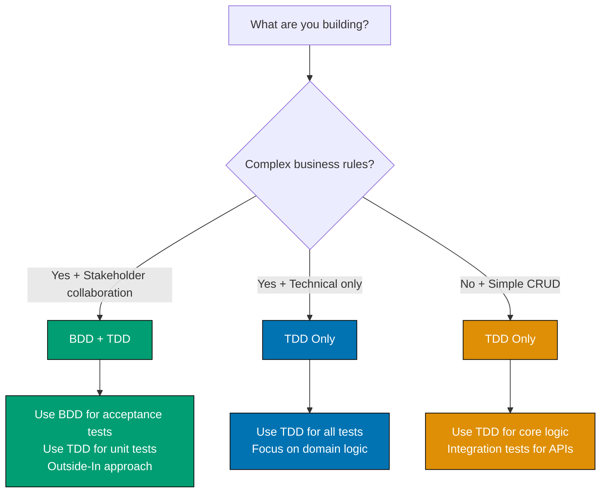
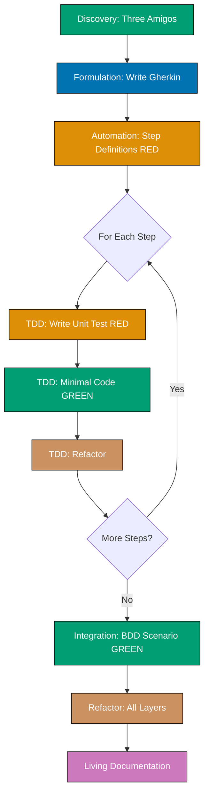

# Software Development Practices

**Understanding-oriented documentation** on software development practices that ensure quality, maintainability, and alignment with business requirements.

## Overview

**The Problem**: Writing tests after code leads to untestable designs, incomplete coverage, and tests that simply verify existing implementation. Business requirements get lost in translation between stakeholders and developers. Teams debate whether tests are worth the effort.

**Our Solution**: Test-first development practices that drive design, ensure coverage, and align implementation with requirements:

1. **Test-Driven Development (TDD)** - Write tests first, then implement code to pass those tests
2. **Behavior-Driven Development (BDD)** - Specify behavior through examples in collaboration with domain experts

Both practices emphasize writing tests before implementation, but at different levels of abstraction. TDD focuses on technical correctness at the unit level, while BDD focuses on business behavior at the feature level.

## Quick Decision: TDD, BDD, or Both?

**Decision Matrix**:

| Your Situation                          | Recommended Approach   | Start With                                                            |
| --------------------------------------- | ---------------------- | --------------------------------------------------------------------- |
| Complex business rules + domain experts | BDD + TDD              | [BDD Three Amigos](./behavior-driven-development-bdd/README.md)       |
| Technical library or framework          | TDD Only               | [TDD Red-Green-Refactor](./test-driven-development-tdd/README.md)     |
| API with business logic                 | BDD + TDD              | [Outside-In TDD](./test-driven-development-tdd/README.md)             |
| Pure functions and algorithms           | TDD Only               | [TDD and FP](./test-driven-development-tdd/README.md)                 |
| Legacy code without tests               | TDD (Characterization) | [TDD Characterization Tests](./test-driven-development-tdd/README.md) |
| New feature with acceptance criteria    | BDD + TDD              | [BDD Gherkin Scenarios](./behavior-driven-development-bdd/README.md)  |

## Documentation Structure

### 🧪 [Test-Driven Development (TDD)](./test-driven-development-tdd/README.md)

**Red-Green-Refactor cycle for building reliable software**

Test-Driven Development is a software development approach where tests are written before production code. The practice follows a simple cycle: write a failing test (Red), make it pass with minimal code (Green), then improve the design (Refactor).

**Key Documentation:**

- [Introduction and Philosophy](test-driven-development-tdd/ex-soen-de-tedrdetd__01-introduction-and-philosophy.md) - Overview, history, when to use TDD
- [Red-Green-Refactor Cycle](test-driven-development-tdd/ex-soen-de-tedrdetd__02-red-green-refactor-cycle.md) - The fundamental TDD workflow ⭐
- [Test Types and Pyramid](test-driven-development-tdd/ex-soen-de-tedrdetd__03-test-types-and-pyramid.md) - Unit, integration, E2E tests
- [Unit Testing Fundamentals](test-driven-development-tdd/ex-soen-de-tedrdetd__04-unit-testing-fundamentals.md) - Test structure and isolation
- [Test Doubles](test-driven-development-tdd/ex-soen-de-tedrdetd__05-test-doubles.md) - Mocks, stubs, spies, fakes
- [TDD and Functional Programming](test-driven-development-tdd/ex-soen-de-tedrdetd__11-tdd-and-functional-programming.md) - Testing pure functions
- [TDD and DDD](test-driven-development-tdd/ex-soen-de-tedrdetd__12-tdd-and-ddd.md) - Testing domain models

**Use TDD when you want to:**

- Build reliable software with high test coverage
- Design APIs and interfaces from the consumer's perspective
- Create a safety net for refactoring
- Document expected behavior through executable examples
- Practice disciplined, incremental development

### 🎭 [Behavior-Driven Development (BDD)](./behavior-driven-development-bdd/README.md)

**Specification by example using Gherkin scenarios**

Behavior-Driven Development extends TDD by focusing on behavior specification through concrete examples written in natural language. BDD emphasizes collaboration between developers, QA, and business stakeholders using a shared vocabulary (Gherkin syntax with Given-When-Then).

**Key Documentation:**

- [Introduction and Philosophy](behavior-driven-development-bdd/ex-soen-de-bedrdebd__01-introduction-and-philosophy.md) - Overview, when to use BDD
- [Gherkin Syntax and Scenarios](behavior-driven-development-bdd/ex-soen-de-bedrdebd__02-gherkin-syntax-and-scenarios.md) - Feature files and Given-When-Then
- [Three Amigos Practice](behavior-driven-development-bdd/ex-soen-de-bedrdebd__04-three-amigos-practice.md) - Collaborative discovery sessions
- [Example Mapping](behavior-driven-development-bdd/ex-soen-de-bedrdebd__05-example-mapping.md) - Visual discovery workshop technique
- [Specification by Example](behavior-driven-development-bdd/ex-soen-de-bedrdebd__06-specification-by-example.md) - Concrete examples over abstract requirements
- [Feature Files and Organization](behavior-driven-development-bdd/ex-soen-de-bedrdebd__08-feature-files-and-organization.md) - Directory structure and conventions
- [BDD and TDD](behavior-driven-development-bdd/ex-soen-de-bedrdebd__13-bdd-and-tdd.md) - Complementary relationship
- [BDD and DDD](behavior-driven-development-bdd/ex-soen-de-bedrdebd__14-bdd-and-ddd.md) - Ubiquitous language in scenarios

**Use BDD when you have:**

- Complex business rules requiring stakeholder collaboration
- Need for living documentation that stays synchronized with code
- Cross-functional teams (developers, QA, business analysts, domain experts)
- Requirements that benefit from concrete examples
- Acceptance criteria that must be testable and unambiguous

## How TDD and BDD Work Together

TDD and BDD complement each other throughout the development process:

| Aspect             | TDD                      | BDD                                  |
| ------------------ | ------------------------ | ------------------------------------ |
| **Focus**          | Technical correctness    | Business behavior                    |
| **Level**          | Unit/Integration         | Feature/Acceptance                   |
| **Language**       | Programming language     | Natural language (Gherkin)           |
| **Audience**       | Developers               | Developers + Business + QA           |
| **When to Write**  | Before implementation    | During requirements discovery        |
| **Test Structure** | Arrange-Act-Assert       | Given-When-Then                      |
| **Granularity**    | Fine-grained (functions) | Coarse-grained (user scenarios)      |
| **Feedback Loop**  | Seconds to minutes       | Minutes to hours                     |
| **Documentation**  | Code as documentation    | Executable specifications            |
| **Refactoring**    | Enables safe refactoring | Validates behavior remains unchanged |

**Example workflow (Outside-In TDD with BDD):**

1. **Discovery** - Hold Three Amigos session to explore feature with business, dev, QA
2. **Formulation** - Write BDD scenarios in Gherkin (Given-When-Then)
3. **Automation (Outer)** - Write step definitions that call application code (RED - fails)
4. **TDD Inner Loop** - For each step:
   - Write unit test (RED)
   - Implement minimal code (GREEN)
   - Refactor (REFACTOR)
   - Repeat until step passes
5. **Integration** - Run BDD scenario end-to-end (GREEN - passes)
6. **Refactor** - Improve design across all layers
7. **Living Documentation** - BDD scenarios serve as up-to-date specification

**Legend**: 🟢 Teal = Passing tests (GREEN) | 🟠 Orange = Failing tests (RED) | 🟤 Brown = Refactoring

See [BDD and TDD Integration](behavior-driven-development-bdd/ex-soen-de-bedrdebd__13-bdd-and-tdd.md) for comprehensive examples.

## Learning Paths

### For Developers New to Testing

1. **Start with TDD fundamentals** - Read [Red-Green-Refactor Cycle](test-driven-development-tdd/ex-soen-de-tedrdetd__02-red-green-refactor-cycle.md)
2. **Practice unit testing** - Read [Unit Testing Fundamentals](test-driven-development-tdd/ex-soen-de-tedrdetd__04-unit-testing-fundamentals.md)
3. **Learn BDD basics** - Read [Gherkin Syntax](behavior-driven-development-bdd/ex-soen-de-bedrdebd__02-gherkin-syntax-and-scenarios.md)
4. **Understand the relationship** - Read [BDD and TDD](behavior-driven-development-bdd/ex-soen-de-bedrdebd__13-bdd-and-tdd.md)

### For Teams Adopting BDD

1. **Understand BDD philosophy** - Read [BDD Introduction](behavior-driven-development-bdd/ex-soen-de-bedrdebd__01-introduction-and-philosophy.md)
2. **Learn discovery techniques** - Read [Three Amigos](behavior-driven-development-bdd/ex-soen-de-bedrdebd__04-three-amigos-practice.md) and [Example Mapping](behavior-driven-development-bdd/ex-soen-de-bedrdebd__05-example-mapping.md)
3. **Practice Gherkin writing** - Practice writing Given-When-Then scenarios for your domain
4. **Integrate with TDD** - Read [BDD and TDD](behavior-driven-development-bdd/ex-soen-de-bedrdebd__13-bdd-and-tdd.md)
5. **Connect to domain modeling** - Read [BDD and DDD](behavior-driven-development-bdd/ex-soen-de-bedrdebd__14-bdd-and-ddd.md)

### For Architects and Technical Leads

1. **Understand testing strategy** - Read [Test Types and Pyramid](test-driven-development-tdd/ex-soen-de-tedrdetd__03-test-types-and-pyramid.md)
2. **Learn when to use each approach** - Review decision matrices in both intro docs
3. **Integrate with architecture** - Read [TDD and DDD](test-driven-development-tdd/ex-soen-de-tedrdetd__12-tdd-and-ddd.md)
4. **Avoid common pitfalls** - Read [TDD Best Practices](test-driven-development-tdd/ex-soen-de-tedrdetd__18-best-practices.md), [TDD Antipatterns](test-driven-development-tdd/ex-soen-de-tedrdetd__19-anti-patterns.md), [BDD Best Practices](behavior-driven-development-bdd/ex-soen-de-bedrdebd__17-best-practices.md), and [BDD Antipatterns](behavior-driven-development-bdd/ex-soen-de-bedrdebd__18-anti-patterns.md)

### For QA Engineers and Business Analysts

1. **Learn BDD collaboration** - Read [Three Amigos Practice](behavior-driven-development-bdd/ex-soen-de-bedrdebd__04-three-amigos-practice.md)
2. **Master Gherkin writing** - Read [Gherkin Syntax](behavior-driven-development-bdd/ex-soen-de-bedrdebd__02-gherkin-syntax-and-scenarios.md)
3. **Practice example mapping** - Read [Example Mapping](behavior-driven-development-bdd/ex-soen-de-bedrdebd__05-example-mapping.md)
4. **Understand automation** - Read [Automation Strategies](behavior-driven-development-bdd/ex-soen-de-bedrdebd__12-automation-strategies.md)

## Practices in This Repository

The open-sharia-enterprise project applies both TDD and BDD:

**TDD Application:**

- Unit tests for all domain logic (Aggregates, Value Objects, Entities)
- Test-first development for pure functions
- Property-based testing for functional code
- Characterization tests for legacy code integration

**BDD Application:**

- Gherkin scenarios for business features (Tax, Loan, Compliance rules)
- Ubiquitous Language from DDD used in feature files
- Three Amigos sessions with domain experts for compliance features
- Living documentation synchronized with Nx monorepo structure

**Complementary Practices:**

- [Domain-Driven Design](../architecture/domain-driven-design-ddd/README.md) - TDD/BDD test domain models
- [C4 Architecture Model](../architecture/c4-architecture-model/README.md) - Document tested components
- [Functional Programming](../../../../governance/development/pattern/functional-programming.md) - Pure functions enable easier testing

## Related Documentation

- **[Software Design Index](../README.md)** - Parent software design documentation
- **[Architecture](../architecture/README.md)** - C4 and DDD documentation
- **[Explanation Documentation Index](../../README.md)** - All conceptual documentation
- **[Functional Programming Principles](../../../../governance/development/pattern/functional-programming.md)** - FP practices in this repository
- **[Implementation Workflow](../../../../governance/development/workflow/implementation.md)** - TDD in development process
- **[Code Quality Standards](../../../../governance/development/quality/code.md)** - Testing requirements

---

**Last Updated**: 2026-01-20
