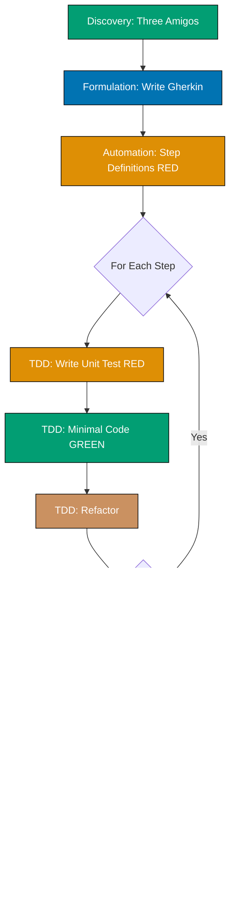

# Software Development Practices

**Understanding-oriented documentation** on software development practices that ensure quality, maintainability, and alignment with business requirements.

## Overview

**The Problem**: Writing tests after code leads to untestable designs, incomplete coverage, and tests that simply verify existing implementation. Business requirements get lost in translation between stakeholders and developers. Teams debate whether tests are worth the effort.

**Our Solution**: Test-first development practices that drive design, ensure coverage, and align implementation with requirements:

1. **Test-Driven Development (TDD)** - Write tests first, then implement code to pass those tests
2. **Behavior-Driven Development (BDD)** - Specify behavior through examples in collaboration with domain experts

Both practices emphasize writing tests before implementation, but at different levels of abstraction. TDD focuses on technical correctness at the unit level, while BDD focuses on business behavior at the feature level.

## Quick Decision: TDD, BDD, or Both?

**Decision Matrix**:

| Your Situation                          | Recommended Approach   | Start With                                                            |
| --------------------------------------- | ---------------------- | --------------------------------------------------------------------- |
| Complex business rules + domain experts | BDD + TDD              | [BDD Three Amigos](./behavior-driven-development-bdd/README.md)       |
| Technical library or framework          | TDD Only               | [TDD Red-Green-Refactor](./test-driven-development-tdd/README.md)     |
| API with business logic                 | BDD + TDD              | [Outside-In TDD](./test-driven-development-tdd/README.md)             |
| Pure functions and algorithms           | TDD Only               | [TDD and FP](./test-driven-development-tdd/README.md)                 |
| Legacy code without tests               | TDD (Characterization) | [TDD Characterization Tests](./test-driven-development-tdd/README.md) |
| New feature with acceptance criteria    | BDD + TDD              | [BDD Gherkin Scenarios](./behavior-driven-development-bdd/README.md)  |

## Documentation Structure

### 🧪 [Test-Driven Development (TDD)](./test-driven-development-tdd/README.md)

**Red-Green-Refactor cycle for building reliable software**

Test-Driven Development is a software development approach where tests are written before production code. The practice follows a simple cycle: write a failing test (Red), make it pass with minimal code (Green), then improve the design (Refactor).

**OSE Platform Standards:**

- [TDD Standards Overview](test-driven-development-tdd/README.md) - Complete prescriptive TDD style guide ⭐
- [TDD Cycle Standards](test-driven-development-tdd/ex-soen-de-tedrdetd__tdd-cycle-standards.md) - Red-Green-Refactor requirements
- [Testing Standards](test-driven-development-tdd/ex-soen-de-tedrdetd__testing-standards.md) - FIRST principles, AAA pattern
- [Test Doubles Standards](test-driven-development-tdd/ex-soen-de-tedrdetd__test-doubles-standards.md) - When to use mocks, stubs, fakes
- [Integration Testing Standards](test-driven-development-tdd/ex-soen-de-tedrdetd__integration-testing-standards.md) - Testcontainers requirements
- [TDD with DDD Standards](test-driven-development-tdd/ex-soen-de-tedrdetd__tdd-with-ddd-standards.md) - Testing aggregates and domain models

**Use TDD when you want to:**

- Build reliable software with high test coverage
- Design APIs and interfaces from the consumer's perspective
- Create a safety net for refactoring
- Document expected behavior through executable examples
- Practice disciplined, incremental development

### 🎭 [Behavior-Driven Development (BDD)](./behavior-driven-development-bdd/README.md)

**Specification by example using Gherkin scenarios**

Behavior-Driven Development extends TDD by focusing on behavior specification through concrete examples written in natural language. BDD emphasizes collaboration between developers, QA, and business stakeholders using a shared vocabulary (Gherkin syntax with Given-When-Then).

**OSE Platform Standards:**

- [BDD Standards Overview](behavior-driven-development-bdd/README.md) - Complete prescriptive BDD style guide ⭐
- [Gherkin Standards](behavior-driven-development-bdd/ex-soen-de-bedrdebd__gherkin-standards.md) - Feature file structure, Given-When-Then requirements
- [Scenario Standards](behavior-driven-development-bdd/ex-soen-de-bedrdebd__scenario-standards.md) - Scenario independence, naming conventions
- [Three Amigos Standards](behavior-driven-development-bdd/ex-soen-de-bedrdebd__three-amigos-standards.md) - Collaborative discovery requirements
- [Living Documentation Standards](behavior-driven-development-bdd/ex-soen-de-bedrdebd__living-documentation-standards.md) - CI/CD integration requirements
- [BDD with DDD Standards](behavior-driven-development-bdd/ex-soen-de-bedrdebd__bdd-with-ddd-standards.md) - Ubiquitous language in scenarios

**Use BDD when you have:**

- Complex business rules requiring stakeholder collaboration
- Need for living documentation that stays synchronized with code
- Cross-functional teams (developers, QA, business analysts, domain experts)
- Requirements that benefit from concrete examples
- Acceptance criteria that must be testable and unambiguous

## How TDD and BDD Work Together

TDD and BDD complement each other throughout the development process:

| Aspect             | TDD                      | BDD                                  |
| ------------------ | ------------------------ | ------------------------------------ |
| **Focus**          | Technical correctness    | Business behavior                    |
| **Level**          | Unit/Integration         | Feature/Acceptance                   |
| **Language**       | Programming language     | Natural language (Gherkin)           |
| **Audience**       | Developers               | Developers + Business + QA           |
| **When to Write**  | Before implementation    | During requirements discovery        |
| **Test Structure** | Arrange-Act-Assert       | Given-When-Then                      |
| **Granularity**    | Fine-grained (functions) | Coarse-grained (user scenarios)      |
| **Feedback Loop**  | Seconds to minutes       | Minutes to hours                     |
| **Documentation**  | Code as documentation    | Executable specifications            |
| **Refactoring**    | Enables safe refactoring | Validates behavior remains unchanged |

**Example workflow (Outside-In TDD with BDD):**

1. **Discovery** - Hold Three Amigos session to explore feature with business, dev, QA
2. **Formulation** - Write BDD scenarios in Gherkin (Given-When-Then)
3. **Automation (Outer)** - Write step definitions that call application code (RED - fails)
4. **TDD Inner Loop** - For each step:
   - Write unit test (RED)
   - Implement minimal code (GREEN)
   - Refactor (REFACTOR)
   - Repeat until step passes
5. **Integration** - Run BDD scenario end-to-end (GREEN - passes)
6. **Refactor** - Improve design across all layers
7. **Living Documentation** - BDD scenarios serve as up-to-date specification

**Legend**: 🟢 Teal = Passing tests (GREEN) | 🟠 Orange = Failing tests (RED) | 🟤 Brown = Refactoring

See [TDD Standards](test-driven-development-tdd/README.md) and [BDD Standards](behavior-driven-development-bdd/README.md) for comprehensive integration patterns and OSE Platform examples.

## Applying Standards by Role

### For Developers

**Prerequisites**: Complete [AyoKoding TDD](../../../../apps/ayokoding-web/content/en/learn/software-engineering/development/test-driven-development-tdd/) and [AyoKoding BDD](../../../../apps/ayokoding-web/content/en/learn/software-engineering/development/behavior-driven-development-bdd/) learning paths first.

1. **TDD Workflow** - Follow [TDD Cycle Standards](test-driven-development-tdd/ex-soen-de-tedrdetd__tdd-cycle-standards.md) for Red-Green-Refactor
2. **Testing Standards** - Apply [Testing Standards](test-driven-development-tdd/ex-soen-de-tedrdetd__testing-standards.md) for FIRST principles
3. **Domain Testing** - Follow [TDD with DDD Standards](test-driven-development-tdd/ex-soen-de-tedrdetd__tdd-with-ddd-standards.md) for aggregates
4. **Integration Tests** - Use [Integration Testing Standards](test-driven-development-tdd/ex-soen-de-tedrdetd__integration-testing-standards.md) for Testcontainers

### For Teams Adopting BDD

**Prerequisites**: Complete [AyoKoding BDD](../../../../apps/ayokoding-web/content/en/learn/software-engineering/development/behavior-driven-development-bdd/) learning path first.

1. **Collaboration** - Follow [Three Amigos Standards](behavior-driven-development-bdd/ex-soen-de-bedrdebd__three-amigos-standards.md) for discovery sessions
2. **Gherkin Writing** - Apply [Gherkin Standards](behavior-driven-development-bdd/ex-soen-de-bedrdebd__gherkin-standards.md) for feature files
3. **Scenario Design** - Follow [Scenario Standards](behavior-driven-development-bdd/ex-soen-de-bedrdebd__scenario-standards.md) for independence
4. **Domain Integration** - Use [BDD with DDD Standards](behavior-driven-development-bdd/ex-soen-de-bedrdebd__bdd-with-ddd-standards.md) for ubiquitous language

### For Architects and Technical Leads

**Prerequisites**: Complete [AyoKoding TDD](../../../../apps/ayokoding-web/content/en/learn/software-engineering/development/test-driven-development-tdd/) and [AyoKoding BDD](../../../../apps/ayokoding-web/content/en/learn/software-engineering/development/behavior-driven-development-bdd/) learning paths first.

1. **Review Complete Standards** - Read [TDD Standards](test-driven-development-tdd/README.md) and [BDD Standards](behavior-driven-development-bdd/README.md)
2. **Architecture Integration** - Follow [TDD with DDD Standards](test-driven-development-tdd/ex-soen-de-tedrdetd__tdd-with-ddd-standards.md)
3. **Testing Strategy** - Use decision matrices above to guide team approach
4. **Living Documentation** - Implement [Living Documentation Standards](behavior-driven-development-bdd/ex-soen-de-bedrdebd__living-documentation-standards.md)

### For QA Engineers and Business Analysts

**Prerequisites**: Complete [AyoKoding BDD](../../../../apps/ayokoding-web/content/en/learn/software-engineering/development/behavior-driven-development-bdd/) learning path first.

1. **Collaboration Standards** - Follow [Three Amigos Standards](behavior-driven-development-bdd/ex-soen-de-bedrdebd__three-amigos-standards.md)
2. **Gherkin Writing** - Apply [Gherkin Standards](behavior-driven-development-bdd/ex-soen-de-bedrdebd__gherkin-standards.md)
3. **Scenario Design** - Follow [Scenario Standards](behavior-driven-development-bdd/ex-soen-de-bedrdebd__scenario-standards.md)
4. **Living Documentation** - Maintain [Living Documentation Standards](behavior-driven-development-bdd/ex-soen-de-bedrdebd__living-documentation-standards.md)

## Practices in This Repository

The open-sharia-enterprise project applies both TDD and BDD:

**TDD Application:**

- Unit tests for all domain logic (Aggregates, Value Objects, Entities)
- Test-first development for pure functions
- Property-based testing for functional code
- Characterization tests for legacy code integration

**BDD Application:**

- Gherkin scenarios for business features (Tax, Loan, Compliance rules)
- Ubiquitous Language from DDD used in feature files
- Three Amigos sessions with domain experts for compliance features
- Living documentation synchronized with Nx monorepo structure

**Complementary Practices:**

- [Domain-Driven Design](../architecture/domain-driven-design-ddd/README.md) - TDD/BDD test domain models
- [C4 Architecture Model](../architecture/c4-architecture-model/README.md) - Document tested components
- [Functional Programming](../../../../governance/development/pattern/functional-programming.md) - Pure functions enable easier testing

## Related Documentation

- **[Software Design Index](../README.md)** - Parent software design documentation
- **[Architecture](../architecture/README.md)** - C4 and DDD documentation
- **[Explanation Documentation Index](../../README.md)** - All conceptual documentation
- **[Functional Programming Principles](../../../../governance/development/pattern/functional-programming.md)** - FP practices in this repository
- **[Implementation Workflow](../../../../governance/development/workflow/implementation.md)** - TDD in development process
- **[Code Quality Standards](../../../../governance/development/quality/code.md)** - Testing requirements

---

**Last Updated**: 2026-01-20
