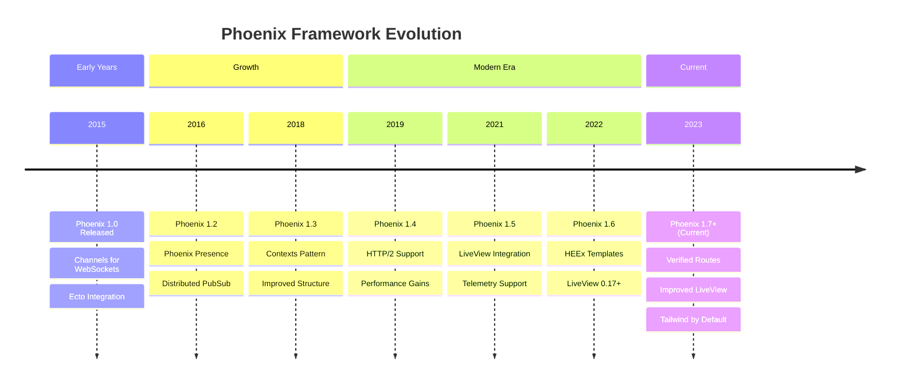

# Phoenix Framework

**Understanding-oriented documentation** on Phoenix framework for building scalable, fault-tolerant real-time applications in the open-sharia-enterprise platform.

## Overview

**Phoenix** is a productive web framework built on Elixir and the Erlang VM (BEAM). It enables building high-performance, fault-tolerant applications that can handle millions of concurrent connections with low latency.

**Version**: Phoenix 1.7+ (targeting latest stable release)
**Elixir Version**: Elixir 1.14+
**Erlang Version**: OTP 25+
**Build Tool**: Mix

### Phoenix Version Timeline



**Version Strategy**:

- Target Phoenix 1.7+ for all new applications
- Phoenix 1.7 introduces verified routes, improved LiveView integration, and better developer experience
- Elixir 1.14+ required for language features (dbg/2, stepped ranges)
- OTP 25+ required for BEAM improvements (JIT compiler enhancements)

## Framework Standards

**This documentation is the authoritative reference** for Phoenix usage standards in the open-sharia-enterprise platform.

All Phoenix applications MUST follow the patterns and practices documented here.

**For Agents**: Reference this documentation when building Phoenix applications.

### Quick Standards Reference

- **Project Structure**: See [Architecture Integration](#architecture-integration)
- **Configuration**: See [Development Workflow](#development-workflow)
- **Best Practices**: See [Best Practices](#best-practices)
- **Common Antipatterns**: See [Common Antipatterns](#common-antipatterns)

**Language Standards**: Also follow language-specific standards from [Elixir](../../programming-languages/elixir/README.md)

## What is Phoenix?

Phoenix provides a productive framework for web development while leveraging the power of the BEAM VM:

- **Channels** - Real-time, bidirectional communication over WebSockets
- **LiveView** - Server-rendered interactive UIs without JavaScript
- **Contexts** - Organized API boundaries for business logic
- **Ecto** - Database wrapper and query generator
- **PubSub** - Distributed real-time messaging
- **Presence** - Track users across distributed nodes

## Why Phoenix?

**For the open-sharia-enterprise platform, Phoenix provides:**

- **Massive concurrency** - Handle millions of connections on modest hardware
- **Fault tolerance** - Self-healing systems with supervisor trees
- **Real-time capabilities** - WebSockets, presence tracking, live updates
- **Functional programming** - Immutability and pure functions by default
- **Low latency** - Microsecond response times for critical operations
- **Scalability** - Horizontal scaling across distributed nodes

## Key Capabilities

### Real-Time Communication

- Phoenix Channels for WebSocket connections
- Presence tracking across distributed nodes
- PubSub for broadcasting to multiple clients
- Channel authentication and authorization
- Soft real-time guarantees

### LiveView (Interactive UIs)

- Server-rendered interactive components
- Real-time updates without JavaScript
- Stateful connections with minimal data transfer
- Form validation and error handling
- File uploads with progress tracking

### API Development

- RESTful JSON APIs
- GraphQL with Absinthe
- API versioning and content negotiation
- Request validation with changesets
- Comprehensive error handling

### Database Access

- Ecto for database interactions
- Schema definitions with changesets
- Query composition with Ecto.Query
- Database migrations
- Multi-tenancy support

### Fault Tolerance

- Supervisor trees for process monitoring
- Automatic process restart on failure
- Circuit breakers for external services
- Error isolation (one process crash doesn't affect others)
- Let it crash philosophy

## Use Cases

**Use Phoenix when you need:**

✅ Real-time features (chat, notifications, live dashboards)
✅ Millions of concurrent connections
✅ Soft real-time requirements (low, predictable latency)
✅ Fault-tolerant, self-healing systems
✅ Distributed systems across multiple nodes
✅ Functional programming with immutability

**Consider alternatives when:**

❌ Your team has no Elixir/functional programming experience
❌ You need extensive third-party library ecosystem (use Node.js/Java)
❌ You're building simple CRUD APIs (Spring Boot may be simpler)
❌ You need Windows-first deployment (BEAM is Linux/Unix-optimized)

## Architecture Integration

### Contexts (Domain Boundaries)

Phoenix uses Contexts to organize code into clear API boundaries:

```
lib/oseplatform/
├── accounts/          # Accounts context
│   ├── user.ex        # Schema
│   ├── queries.ex     # Queries
│   └── commands.ex    # Commands
├── donations/         # Donations context
└── loans/             # Loans context
```

### Functional Core, Imperative Shell

Phoenix encourages separating pure logic from side effects:

- **Contexts** - Pure business logic (functional core)
- **Controllers** - HTTP handling (imperative shell)
- **Channels** - WebSocket handling (imperative shell)
- **LiveView** - UI state management (imperative shell)

### Domain-Driven Design

Phoenix contexts align well with DDD bounded contexts:

- **Contexts** map to bounded contexts
- **Schemas** represent aggregates and entities
- **Changesets** enforce invariants and validation
- **Ecto.Multi** for transactional consistency
- **Events** via PubSub for domain events

## Development Workflow

### Project Setup

```bash
# Create new Phoenix app
mix phx.new oseplatform_api --no-html --no-assets  # API only
mix phx.new oseplatform_web                         # Full-stack

# Install dependencies
mix deps.get

# Setup database
mix ecto.setup

# Run application
mix phx.server

# Run tests
mix test
```

### Configuration

- **config/config.exs** - Shared configuration
- **config/dev.exs** - Development configuration
- **config/prod.exs** - Production configuration
- **config/runtime.exs** - Runtime configuration (environment variables)

### Testing Strategy

1. **Unit tests** - Pure context functions
2. **Integration tests** - Database interactions with Ecto.Sandbox
3. **Channel tests** - WebSocket communication
4. **Controller tests** - HTTP endpoints
5. **LiveView tests** - Interactive UI behavior

## Best Practices

### Context Design

- Keep contexts cohesive (single responsibility)
- Avoid context dependencies (use events instead)
- Expose minimal public API
- Use aliases to keep code clean
- Group related schemas in same context

### Data Validation

- Use changesets for all data validation
- Validate at API boundaries (controllers, channels)
- Keep business rules in context functions
- Return `{:ok, result}` or `{:error, changeset}` tuples
- Use `Ecto.Multi` for complex transactions

### Real-Time Features

- Use Phoenix Channels for bidirectional communication
- Implement channel authentication properly
- Use Presence for tracking connected users
- Broadcast selectively (don't spam all clients)
- Handle disconnections gracefully

### Error Handling

- Let it crash for programming errors
- Handle expected errors explicitly
- Use supervisor trees for fault tolerance
- Log errors with proper context
- Return clear error messages to clients

### Performance

- Use database indexes appropriately
- Preload associations to avoid N+1 queries
- Use `Enum.reduce/3` instead of multiple passes
- Apply caching for expensive operations
- Profile with `:observer` and telemetry

## Common Antipatterns

### ❌ Skipping Changesets

**Problem**: No validation, security vulnerabilities

```elixir
# Bad
def create_user(attrs) do
  %User{}
  |> Map.merge(attrs)  # No validation!
  |> Repo.insert()
end
```

**Solution**: Always use changesets

```elixir
# Good
def create_user(attrs) do
  %User{}
  |> User.changeset(attrs)  # Validated
  |> Repo.insert()
end
```

### ❌ Context Coupling

**Problem**: Contexts calling other contexts directly

```elixir
# Bad
defmodule OsePlatform.Loans do
  alias OsePlatform.Accounts  # Direct dependency

  def create_loan(user_id, attrs) do
    user = Accounts.get_user!(user_id)  # Tight coupling
    # ...
  end
end
```

**Solution**: Use events or pass data explicitly

```elixir
# Good
defmodule OsePlatform.Loans do
  def create_loan(user, attrs) do  # Receive user as parameter
    # ...
  end
end

# Or use events
Phoenix.PubSub.broadcast(
  OsePlatform.PubSub,
  "loans",
  {:loan_created, loan}
)
```

### ❌ N+1 Queries

**Problem**: Loading associations in loops

```elixir
# Bad
def list_users_with_posts do
  Repo.all(User)
  |> Enum.map(fn user ->
    %{user | posts: Repo.all(assoc(user, :posts))}  # N queries!
  end)
end
```

**Solution**: Preload associations

```elixir
# Good
def list_users_with_posts do
  User
  |> Repo.all()
  |> Repo.preload(:posts)  # Single join query
end
```

### ❌ Mutable State in Processes

**Problem**: Using processes as mutable storage

```elixir
# Bad
def handle_call({:increment_counter}, _from, state) do
  new_state = state + 1  # Treating process as mutable variable
  {:reply, new_state, new_state}
end
```

**Solution**: Use functional transformations

```elixir
# Good
def handle_call({:add_item, item}, _from, items) do
  new_items = [item | items]  # Functional update
  {:reply, :ok, new_items}
end
```

## Detailed Documentation

### Core Framework Patterns

- **[Phoenix Idioms](./ex-soen-plwe-elph__idioms.md)** - Framework-specific patterns and idiomatic usage
- **[Best Practices](./ex-soen-plwe-elph__best-practices.md)** - Production-ready development standards
- **[Anti-Patterns](./ex-soen-plwe-elph__anti-patterns.md)** - Common mistakes and how to avoid them

### Application Architecture

- **[Contexts](./ex-soen-plwe-elph__contexts.md)** - Context design, boundaries, and API patterns
- **[Configuration](./ex-soen-plwe-elph__configuration.md)** - Application configuration and secrets management
- **[Testing](./ex-soen-plwe-elph__testing.md)** - Testing strategies and test organization

### Real-Time Features

- **[Phoenix Channels](./ex-soen-plwe-elph__channels.md)** - WebSocket communication and real-time patterns
- **[Phoenix LiveView](./ex-soen-plwe-elph__liveview.md)** - Server-rendered interactive UIs
- **[PubSub](./ex-soen-plwe-elph__idioms.md#6-pubsub-broadcasting)** - Event broadcasting and distribution

### Data Access and Persistence

- **[Data Access](./ex-soen-plwe-elph__data-access.md)** - Ecto schemas, queries, and database patterns
- **[REST APIs](./ex-soen-plwe-elph__rest-apis.md)** - RESTful API design and JSON standards

### Security and Authentication

- **[Security](./ex-soen-plwe-elph__security.md)** - Authentication, authorization, and security best practices

### Production Operations

- **[Performance](./ex-soen-plwe-elph__performance.md)** - Optimization, caching, and scalability
- **[Observability](./ex-soen-plwe-elph__observability.md)** - Logging, metrics, and monitoring
- **[Deployment](./ex-soen-plwe-elph__deployment.md)** - Release management and deployment strategies

### Migration and Upgrade

- **[Version Migration](./ex-soen-plwe-elph__version-migration.md)** - Upgrading from Phoenix 1.6 to 1.7+

## Learning Resources

### Official Documentation

- [Phoenix Framework Guides](https://hexdocs.pm/phoenix/overview.html)
- [Elixir Language Reference](https://elixir-lang.org/docs.html)
- [Ecto Documentation](https://hexdocs.pm/ecto/Ecto.html)
- [Phoenix LiveView](https://hexdocs.pm/phoenix_live_view/)

### Books

- "Programming Phoenix" by Chris McCord, Bruce Tate, and José Valim
- "Programming Elixir" by Dave Thomas
- "Designing Elixir Systems with OTP" by James Edward Gray II

### Platform-Specific Documentation

- **[Functional Programming](../../../../../governance/development/pattern/functional-programming.md)** - FP principles
- **[Domain-Driven Design](../../architecture/domain-driven-design-ddd/README.md)** - DDD with Phoenix
- **[Software Design](../../README.md)** - Architecture patterns

## Phoenix vs Other Frameworks

| Feature                | Phoenix  | Spring Boot | Node.js/Express |
| ---------------------- | -------- | ----------- | --------------- |
| Concurrency Model      | Actor    | Threads     | Event Loop      |
| Concurrent Connections | Millions | Thousands   | Thousands       |
| Fault Tolerance        | Built-in | Manual      | Manual          |
| Real-Time Support      | Native   | Add-on      | Add-on          |
| Type Safety            | Dynamic  | Static      | Dynamic         |
| Ecosystem Size         | Medium   | Large       | Largest         |
| Learning Curve         | Steep    | Medium      | Gentle          |

## Related Documentation

- **[Libraries and Frameworks Index](../README.md)** - Parent frameworks documentation
- **[Software Design](../../README.md)** - Architecture and development practices
- **[Functional Programming](../../../../../governance/development/pattern/functional-programming.md)** - FP principles
- **[Domain-Driven Design](../../architecture/domain-driven-design-ddd/README.md)** - DDD patterns

---

**Last Updated**: 2026-01-25
