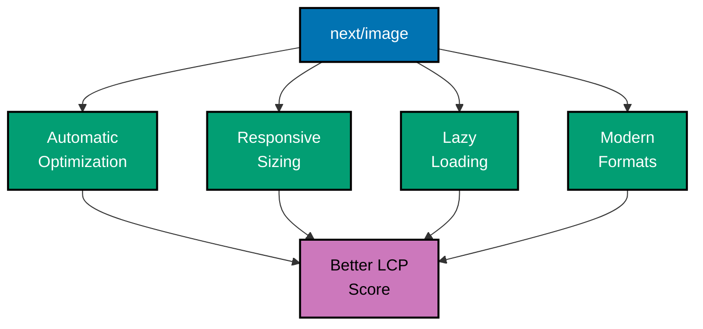
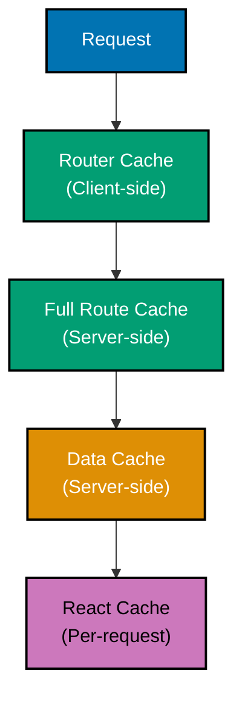

# Next.js Performance

## Quick Reference

**Core Optimizations**:

- [Image Optimization](#image-optimization) - next/image, responsive images
- [Font Optimization](#font-optimization) - next/font, self-hosted fonts
- [Code Splitting](#code-splitting) - Automatic and manual splitting
- [Lazy Loading](#lazy-loading) - Dynamic imports, component loading
- [Caching Strategies](#caching-strategies) - Full route cache, data cache, router cache

**Monitoring & Analysis**:

- [Bundle Analysis](#bundle-analysis) - @next/bundle-analyzer
- [Web Vitals](#web-vitals-monitoring) - LCP, FID, CLS, TTFB
- [Performance Profiling](#performance-profiling) - React DevTools, Lighthouse

**Advanced**:

- [Prefetching](#prefetching) - Link prefetching, custom prefetch
- [Edge Runtime](#edge-runtime-performance) - Edge vs Node.js
- [Static Generation](#static-generation-optimization) - Build-time optimization

## Overview

**Performance optimization** in Next.js is built-in and automatic for many concerns, but understanding and leveraging these features is critical for enterprise applications. Next.js provides automatic code splitting, image optimization, font optimization, and intelligent caching.

**Key Principles**:

- **Automatic optimization** - Many optimizations work out of the box
- **Measure first** - Use Web Vitals and profiling tools
- **Progressive enhancement** - Start with Server Components, add client interactivity sparingly
- **Cache strategically** - Leverage Next.js caching layers
- **Monitor continuously** - Track performance in production

This guide covers Next.js 14+ performance optimization for enterprise applications.

## Image Optimization

### next/image Component

The `next/image` component automatically optimizes images:

```typescript
// app/products/[id]/page.tsx
import Image from 'next/image';

export default function ProductPage({ params }: { params: { id: string } }) {
  return (
    <div>
      <h1>Product Details</h1>

      {/* Optimized image with automatic lazy loading */}
      <Image
        src="/products/laptop.jpg"
        alt="High-performance laptop for business"
        width={800}
        height={600}
        priority // Load immediately (above fold)
      />

      {/* Remote image with automatic optimization */}
      <Image
        src="https://cdn.example.com/products/tablet.jpg"
        alt="Business tablet device"
        width={800}
        height={600}
        sizes="(max-width: 768px) 100vw, (max-width: 1200px) 50vw, 33vw"
      />
    </div>
  );
}
```

### Image Configuration

```typescript
// next.config.ts
import type { NextConfig } from "next";

const nextConfig: NextConfig = {
  images: {
    // Configure remote image domains
    remotePatterns: [
      {
        protocol: "https",
        hostname: "cdn.oseplatform.com",
        pathname: "/images/**",
      },
    ],

    // Image formats (WebP, AVIF)
    formats: ["image/avif", "image/webp"],

    // Device sizes for responsive images
    deviceSizes: [640, 750, 828, 1080, 1200, 1920, 2048, 3840],

    // Image sizes for srcset
    imageSizes: [16, 32, 48, 64, 96, 128, 256, 384],

    // Disable image optimization in development
    unoptimized: process.env.NODE_ENV === "development",
  },
};

export default nextConfig;
```

### OSE Platform: Optimized Waqf Project Images

```typescript
// app/waqf/projects/[id]/page.tsx
import Image from 'next/image';
import { db } from '@/lib/db/client';

export default async function WaqfProjectPage({
  params,
}: {
  params: { id: string };
}) {
  const project = await db.waqfProject.findUnique({
    where: { id: params.id },
    include: { images: true },
  });

  return (
    <div>
      {/* Hero image - prioritize loading */}
      <div className="relative h-96 w-full">
        <Image
          src={project.images[0].url}
          alt={`${project.name} - Main project image`}
          fill
          priority
          sizes="100vw"
          className="object-cover"
        />
      </div>

      {/* Gallery images - lazy load */}
      <div className="grid grid-cols-3 gap-4 mt-8">
        {project.images.slice(1).map((image) => (
          <div key={image.id} className="relative h-48">
            <Image
              src={image.url}
              alt={image.description}
              fill
              sizes="(max-width: 768px) 100vw, (max-width: 1200px) 50vw, 33vw"
              className="object-cover rounded"
            />
          </div>
        ))}
      </div>
    </div>
  );
}
```

### Image Optimization Benefits



## Font Optimization

### next/font with Google Fonts

```typescript
// app/layout.tsx
import { Inter, Roboto_Mono } from 'next/font/google';

// Primary font
const inter = Inter({
  subsets: ['latin'],
  display: 'swap',
  variable: '--font-inter',
});

// Monospace font for code
const robotoMono = Roboto_Mono({
  subsets: ['latin'],
  display: 'swap',
  variable: '--font-roboto-mono',
});

export default function RootLayout({ children }: { children: React.ReactNode }) {
  return (
    <html lang="en" className={`${inter.variable} ${robotoMono.variable}`}>
      <body className={inter.className}>{children}</body>
    </html>
  );
}
```

### Self-Hosted Fonts

```typescript
// app/layout.tsx
import localFont from 'next/font/local';

const customFont = localFont({
  src: [
    {
      path: './fonts/CustomFont-Regular.woff2',
      weight: '400',
      style: 'normal',
    },
    {
      path: './fonts/CustomFont-Bold.woff2',
      weight: '700',
      style: 'normal',
    },
  ],
  variable: '--font-custom',
  display: 'swap',
});

export default function RootLayout({ children }: { children: React.ReactNode }) {
  return (
    <html lang="en" className={customFont.variable}>
      <body className={customFont.className}>{children}</body>
    </html>
  );
}
```

### OSE Platform: Arabic + English Fonts

```typescript
// app/layout.tsx
import { Inter } from 'next/font/google';
import localFont from 'next/font/local';

// English font
const inter = Inter({
  subsets: ['latin'],
  display: 'swap',
  variable: '--font-inter',
});

// Arabic font (self-hosted)
const cairoArabic = localFont({
  src: [
    {
      path: './fonts/Cairo-Regular.woff2',
      weight: '400',
      style: 'normal',
    },
    {
      path: './fonts/Cairo-Bold.woff2',
      weight: '700',
      style: 'normal',
    },
  ],
  variable: '--font-cairo',
  display: 'swap',
});

export default function RootLayout({ children }: { children: React.ReactNode }) {
  return (
    <html lang="en" className={`${inter.variable} ${cairoArabic.variable}`}>
      <body className={inter.className}>{children}</body>
    </html>
  );
}
```

```css
/* globals.css */
body {
  font-family: var(--font-inter), sans-serif;
}

[lang="ar"] {
  font-family: var(--font-cairo), sans-serif;
}
```

## Code Splitting

### Automatic Code Splitting

Next.js automatically splits code by route:

```
Built-in automatic code splitting:
- Each page.tsx → separate bundle
- Each layout.tsx → separate bundle
- Shared components → separate chunks
- Third-party libraries → vendor chunks
```

### Dynamic Imports

```typescript
// app/dashboard/page.tsx
import dynamic from 'next/dynamic';

// Dynamically import heavy component
const HeavyChart = dynamic(() => import('@/components/HeavyChart'), {
  loading: () => <div>Loading chart...</div>,
  ssr: false, // Disable server-side rendering for this component
});

const LargeTable = dynamic(() => import('@/components/LargeTable'), {
  loading: () => <div className="animate-pulse h-96 bg-gray-200"></div>,
});

export default function DashboardPage() {
  return (
    <div>
      <h1>Dashboard</h1>

      {/* Static content loads immediately */}
      <p>Welcome to your dashboard</p>

      {/* Heavy components load on demand */}
      <HeavyChart />
      <LargeTable />
    </div>
  );
}
```

### Conditional Loading

```typescript
'use client';

import { useState } from 'react';
import dynamic from 'next/dynamic';

// Only load when needed
const PDFViewer = dynamic(() => import('@/components/PDFViewer'));

export function DocumentViewer() {
  const [showPDF, setShowPDF] = useState(false);

  return (
    <div>
      <button onClick={() => setShowPDF(true)}>View PDF</button>

      {showPDF && <PDFViewer url="/documents/contract.pdf" />}
    </div>
  );
}
```

### Named Exports

```typescript
// Component with named export
const HeavyComponent = dynamic(
  () => import('@/components/Charts').then((mod) => mod.BarChart),
  { loading: () => <div>Loading...</div> }
);
```

## Lazy Loading

### Component-Level Lazy Loading

```typescript
// app/(platform)/murabaha/applications/page.tsx
import { Suspense } from 'react';
import dynamic from 'next/dynamic';

// Lazy load heavy components
const ApplicationsTable = dynamic(
  () => import('@/features/murabaha/components/ApplicationsTable')
);

const ApplicationChart = dynamic(
  () => import('@/features/murabaha/components/ApplicationChart'),
  { ssr: false }
);

export default function ApplicationsPage() {
  return (
    <div>
      <h1>Murabaha Applications</h1>

      <Suspense fallback={<div>Loading table...</div>}>
        <ApplicationsTable />
      </Suspense>

      <Suspense fallback={<div>Loading chart...</div>}>
        <ApplicationChart />
      </Suspense>
    </div>
  );
}
```

### Route-Based Lazy Loading

```typescript
// app/dashboard/layout.tsx
import { Suspense } from 'react';

export default function DashboardLayout({ children }: { children: React.ReactNode }) {
  return (
    <div>
      <Suspense fallback={<div>Loading...</div>}>
        {children}
      </Suspense>
    </div>
  );
}
```

## Caching Strategies

### Next.js Caching Layers



### Full Route Cache

```typescript
// app/about/page.tsx
// Automatically cached statically
export default function AboutPage() {
  return <div>About Us</div>;
}
```

### Data Cache

```typescript
// app/blog/[slug]/page.tsx
// Cached for 1 hour
export const revalidate = 3600;

export default async function BlogPost({ params }: { params: { slug: string } }) {
  // fetch is automatically cached
  const post = await fetch(`https://api.example.com/posts/${params.slug}`);

  return <article>{/* Render post */}</article>;
}
```

### Router Cache

```typescript
// Client-side navigation automatically caches visited routes
import Link from 'next/link';

export function Navigation() {
  return (
    <nav>
      <Link href="/dashboard">Dashboard</Link>
      <Link href="/zakat">Zakat</Link>
    </nav>
  );
}
```

### Cache Configuration

```typescript
// app/api/data/route.ts
export const dynamic = "force-dynamic"; // Opt out of caching
export const revalidate = 60; // Revalidate every 60 seconds

export async function GET() {
  const data = await fetchData();
  return Response.json(data);
}
```

### Cache Invalidation

```typescript
// features/blog/actions/createPost.ts
'use server';

import { revalidatePath, revalidateTag } from 'next/cache';

export async function createPost(formData: FormData) {
  await db.post.create({ data: /* ... */ });

  // Revalidate specific path
  revalidatePath('/blog');

  // Revalidate by tag
  revalidateTag('posts');
}
```

## Bundle Analysis

### Setup Bundle Analyzer

```bash
npm install --save-dev @next/bundle-analyzer
```

```typescript
// next.config.ts
import withBundleAnalyzer from "@next/bundle-analyzer";
import type { NextConfig } from "next";

const nextConfig: NextConfig = {
  // Your config
};

export default withBundleAnalyzer({
  enabled: process.env.ANALYZE === "true",
})(nextConfig);
```

```json
// package.json
{
  "scripts": {
    "analyze": "ANALYZE=true next build"
  }
}
```

### Analyzing Bundle Size

```bash
npm run analyze
```

**What to look for**:

- Large dependencies (>100KB)
- Duplicate dependencies
- Unused code
- Heavy client components

### Optimization Strategies

```typescript
// ❌ Bad: Import entire library
import _ from "lodash";

// ✅ Good: Import specific functions
import debounce from "lodash/debounce";
import throttle from "lodash/throttle";

// ✅ Better: Use native alternatives
const debounce = (fn, delay) => {
  /* ... */
};
```

## Web Vitals Monitoring

### Built-in Reporting

```typescript
// app/layout.tsx
import { SpeedInsights } from '@vercel/speed-insights/next';

export default function RootLayout({ children }: { children: React.ReactNode }) {
  return (
    <html lang="en">
      <body>
        {children}
        <SpeedInsights />
      </body>
    </html>
  );
}
```

### Custom Web Vitals Reporting

```typescript
// app/layout.tsx
"use client";

import { useReportWebVitals } from "next/web-vitals";

export function WebVitalsReporter() {
  useReportWebVitals((metric) => {
    console.log(metric);

    // Send to analytics
    fetch("/api/analytics", {
      method: "POST",
      body: JSON.stringify(metric),
    });
  });

  return null;
}
```

### Core Web Vitals

**Largest Contentful Paint (LCP)**:

- **Target**: < 2.5s
- **Optimize**: Image loading, server response time, render blocking resources

**First Input Delay (FID)**:

- **Target**: < 100ms
- **Optimize**: Reduce JavaScript execution time, code splitting

**Cumulative Layout Shift (CLS)**:

- **Target**: < 0.1
- **Optimize**: Set image/video dimensions, avoid dynamic content injection

**Time to First Byte (TTFB)**:

- **Target**: < 600ms
- **Optimize**: Server response time, Edge caching, CDN

## Performance Profiling

### React DevTools Profiler

```typescript
// Enable profiling in production
import { Profiler } from 'react';

function onRenderCallback(
  id: string,
  phase: 'mount' | 'update',
  actualDuration: number
) {
  console.log(`${id} (${phase}): ${actualDuration}ms`);
}

export function ProfiledComponent({ children }: { children: React.ReactNode }) {
  return (
    <Profiler id="Dashboard" onRender={onRenderCallback}>
      {children}
    </Profiler>
  );
}
```

### Lighthouse

```bash
# Run Lighthouse
lighthouse https://oseplatform.com --view

# CI/CD integration
npm install -g @lhci/cli
lhci autorun
```

### Performance Budget

```typescript
// next.config.ts
import type { NextConfig } from "next";

const nextConfig: NextConfig = {
  // Set performance budgets
  experimental: {
    optimizePackageImports: ["@mui/material", "@mui/icons-material"],
  },
};

export default nextConfig;
```

## Prefetching

### Automatic Link Prefetching

```typescript
import Link from 'next/link';

export function Navigation() {
  return (
    <nav>
      {/* Automatically prefetches on hover/viewport */}
      <Link href="/dashboard">Dashboard</Link>

      {/* Disable prefetching */}
      <Link href="/admin" prefetch={false}>
        Admin
      </Link>

      {/* Force immediate prefetch */}
      <Link href="/important" prefetch={true}>
        Important Page
      </Link>
    </nav>
  );
}
```

### Manual Prefetching

```typescript
'use client';

import { useEffect } from 'react';
import { useRouter } from 'next/navigation';

export function PrefetchExample() {
  const router = useRouter();

  useEffect(() => {
    // Prefetch route after component mounts
    router.prefetch('/dashboard');
  }, [router]);

  return <div>Content</div>;
}
```

## Edge Runtime Performance

### Edge vs Node.js

```typescript
// Edge runtime (faster cold starts)
export const runtime = "edge";

export async function GET(request: Request) {
  const geo = request.geo;
  return Response.json({ country: geo?.country });
}
```

**Edge Benefits**:

- Global deployment
- ~0ms cold starts
- Lower latency

**Node.js Benefits**:

- Full Node.js APIs
- More CPU/memory
- Complex computations

## Static Generation Optimization

### Parallel Static Generation

```typescript
// app/blog/[slug]/page.tsx
export async function generateStaticParams() {
  const posts = await db.post.findMany({
    select: { slug: true },
  });

  // Generate all paths in parallel
  return posts.map((post) => ({
    slug: post.slug,
  }));
}
```

### Incremental Static Regeneration

```typescript
// app/products/[id]/page.tsx
export const revalidate = 3600; // Revalidate every hour

export async function generateStaticParams() {
  // Only generate top 100 products at build time
  const topProducts = await db.product.findMany({
    take: 100,
    orderBy: { views: "desc" },
  });

  return topProducts.map((product) => ({
    id: product.id,
  }));
}

// Other products generated on-demand
export const dynamicParams = true;
```

## OSE Platform: Complete Performance Strategy

```typescript
// app/(platform)/layout.tsx
import { Inter } from 'next/font/google';
import { SpeedInsights } from '@vercel/speed-insights/next';
import { Analytics } from '@vercel/analytics/react';

const inter = Inter({
  subsets: ['latin'],
  display: 'swap',
  variable: '--font-inter',
});

export default function PlatformLayout({
  children,
}: {
  children: React.ReactNode;
}) {
  return (
    <html lang="en" className={inter.variable}>
      <body className={inter.className}>
        {children}
        <SpeedInsights />
        <Analytics />
      </body>
    </html>
  );
}
```

```typescript
// app/(platform)/dashboard/page.tsx
import { Suspense } from 'react';
import dynamic from 'next/dynamic';
import { ZakatStatsServer } from '@/components/ZakatStatsServer';

// Lazy load heavy chart library
const MurabahaChart = dynamic(
  () => import('@/components/MurabahaChart'),
  {
    loading: () => <div className="animate-pulse h-64 bg-gray-200 rounded" />,
    ssr: false,
  }
);

export const revalidate = 300; // Revalidate every 5 minutes

export default function DashboardPage() {
  return (
    <div>
      <h1>Dashboard</h1>

      {/* Server Component - no client bundle */}
      <Suspense fallback={<div>Loading stats...</div>}>
        <ZakatStatsServer />
      </Suspense>

      {/* Client Component - lazy loaded */}
      <Suspense fallback={<div>Loading chart...</div>}>
        <MurabahaChart />
      </Suspense>
    </div>
  );
}
```

## Best Practices

### ✅ Do

- **Use next/image** for all images
- **Use next/font** for fonts
- **Measure with Web Vitals** before optimizing
- **Use Server Components** by default
- **Lazy load** heavy components
- **Enable caching** strategically
- **Analyze bundle** regularly
- **Monitor production** performance

### ❌ Don't

- **Don't skip image optimization**
- **Don't load unused libraries**
- **Don't use Client Components** unnecessarily
- **Don't skip lazy loading** for heavy components
- **Don't ignore Web Vitals** warnings
- **Don't over-cache** dynamic content
- **Don't skip bundle analysis**

## Performance Checklist

Before deploying:

- [ ] Images optimized with next/image
- [ ] Fonts optimized with next/font
- [ ] Heavy components lazy loaded
- [ ] Bundle analyzed and optimized
- [ ] Web Vitals measured (LCP < 2.5s, FID < 100ms, CLS < 0.1)
- [ ] Caching strategy implemented
- [ ] Prefetching configured
- [ ] Lighthouse score > 90

## Related Documentation

**Core Next.js**:

- [Rendering](ex-soen-plwe-fene__rendering.md) - Rendering strategies
- [Data Fetching](ex-soen-plwe-fene__data-fetching.md) - Caching strategies
- [Server Components](ex-soen-plwe-fene__server-components.md) - Zero-bundle components

**Deployment**:

- [Deployment](ex-soen-plwe-fene__deployment.md) - Production optimization
- [Configuration](ex-soen-plwe-fene__configuration.md) - Performance config

---

**Last Updated**: 2026-01-26
**Next.js Version**: 14+ (Turbopack, automatic optimizations)
