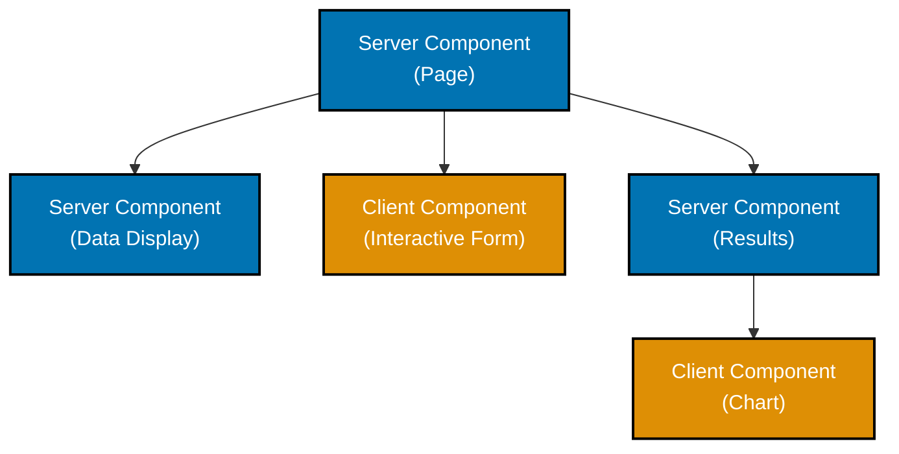

# Next.js Server Components

## Quick Reference

**Core Concepts**:

- [Server Components Fundamentals](#server-components-fundamentals) - Default rendering strategy
- [Client Components](#client-components) - "use client" directive
- [Component Composition](#composing-server-and-client-components) - Mixing RSC and Client
- [Data Fetching](#data-fetching-in-server-components) - Direct backend access
- [Streaming](#streaming-with-suspense) - Progressive rendering
- [Server Actions](#server-actions-integration) - Mutations from components

**Advanced Topics**:

- [Context Providers](#context-in-app-router) - Managing global state
- [Third-Party Libraries](#third-party-library-integration) - Integration patterns
- [Performance Optimization](#performance-optimization) - Minimizing client bundles
- [Security Patterns](#security-patterns) - Protecting sensitive data

## Overview

**React Server Components (RSC)** are a new React paradigm where components render exclusively on the server, sending only HTML to the client. Next.js App Router makes Server Components the **default** rendering strategy.

**Key Benefits**:

- **Zero client bundle** - No JavaScript sent for Server Components
- **Direct backend access** - Database, file system, environment variables
- **Improved performance** - Less JavaScript to download and parse
- **Enhanced security** - Sensitive logic stays on server
- **Better SEO** - Pre-rendered HTML for search engines

This guide covers Server Components patterns for Next.js 14+ with enterprise financial applications.

## Server Components Fundamentals

### Default Behavior

In the App Router, **all components are Server Components by default**:

```typescript
// app/zakat/page.tsx
// Server Component (no "use client" directive)
import { db } from '@/lib/db/client';

export default async function ZakatPage() {
  // Runs on server - can directly access database
  const nisabThreshold = await db.nisab.findFirst({
    orderBy: { effectiveDate: 'desc' },
  });

  return (
    <div>
      <h1>Zakat Calculator</h1>
      <p>Current Nisab: {nisabThreshold.amount} {nisabThreshold.currency}</p>
    </div>
  );
}
```

### Server Component Capabilities

✅ **Server Components can**:

- Use async/await for data fetching
- Access backend resources (database, file system)
- Use server-only code (environment variables, secrets)
- Import server-only libraries
- Reduce client bundle size
- Stream with Suspense

❌ **Server Components cannot**:

- Use React hooks (useState, useEffect, useContext)
- Use browser APIs (localStorage, window, document)
- Handle user interactions (onClick, onChange)
- Use libraries that depend on browser APIs
- Use "use client" or "use server" directives

### OSE Platform Example

```typescript
// app/(platform)/murabaha/applications/page.tsx
import { auth } from '@/lib/auth';
import { db } from '@/lib/db/client';
import { redirect } from 'next/navigation';
import { ApplicationCard } from './_components/ApplicationCard';

export default async function MurabahaApplicationsPage() {
  // Authentication on server
  const session = await auth();
  if (!session) {
    redirect('/login');
  }

  // Direct database access
  const applications = await db.murabahaApplication.findMany({
    where: {
      userId: session.user.id,
      status: { in: ['pending', 'approved', 'rejected'] }
    },
    include: {
      vendor: true,
      installments: true,
    },
    orderBy: { createdAt: 'desc' },
  });

  // Calculate statistics on server
  const totalPending = applications.filter(app => app.status === 'pending').length;
  const totalApproved = applications.filter(app => app.status === 'approved').length;

  return (
    <div>
      <h1>Murabaha Applications</h1>

      <div className="grid grid-cols-3 gap-4 mb-8">
        <div className="border p-4 rounded">
          <p className="text-sm text-gray-600">Total Applications</p>
          <p className="text-3xl font-bold">{applications.length}</p>
        </div>
        <div className="border p-4 rounded">
          <p className="text-sm text-gray-600">Pending Review</p>
          <p className="text-3xl font-bold">{totalPending}</p>
        </div>
        <div className="border p-4 rounded">
          <p className="text-sm text-gray-600">Approved</p>
          <p className="text-3xl font-bold">{totalApproved}</p>
        </div>
      </div>

      <div className="grid gap-4">
        {applications.map((application) => (
          <ApplicationCard key={application.id} application={application} />
        ))}
      </div>
    </div>
  );
}
```

## Client Components

### When to Use Client Components

Use **"use client"** directive when you need:

✅ **Client Components are required for**:

- React hooks (useState, useEffect, useReducer, useContext)
- Browser APIs (localStorage, sessionStorage, window, document)
- User interactions (onClick, onChange, onSubmit)
- Third-party libraries that use browser APIs
- Event listeners (scroll, resize, keydown)
- Animation libraries (Framer Motion, React Spring)

### Defining Client Components

```typescript
// features/zakat/components/ZakatForm.tsx
'use client';

import { useState } from 'react';
import { calculateZakat } from '../actions/calculateZakat';

interface ZakatFormProps {
  defaultNisab: number;
}

export function ZakatForm({ defaultNisab }: ZakatFormProps) {
  const [wealth, setWealth] = useState('');
  const [result, setResult] = useState<number | null>(null);

  const handleSubmit = async (e: React.FormEvent) => {
    e.preventDefault();
    const zakatAmount = await calculateZakat(parseFloat(wealth), defaultNisab);
    setResult(zakatAmount);
  };

  return (
    <form onSubmit={handleSubmit}>
      <label>
        Your Wealth:
        <input
          type="number"
          value={wealth}
          onChange={(e) => setWealth(e.target.value)}
          placeholder="Enter your total wealth"
          required
        />
      </label>

      <p className="text-sm text-gray-600">
        Current Nisab: {defaultNisab}
      </p>

      <button type="submit">Calculate Zakat</button>

      {result !== null && (
        <div className="mt-4 p-4 bg-green-100 rounded">
          <p className="text-lg font-bold">Zakat Amount: {result}</p>
        </div>
      )}
    </form>
  );
}
```

### Client Component Guidelines

**✅ Do**:

- Place "use client" at the **top** of the file
- Keep Client Components **small and focused**
- Pass Server Component data as **props**
- Minimize client-side JavaScript
- Use Client Components at **leaf nodes** when possible

**❌ Don't**:

- Add "use client" unnecessarily
- Fetch data in Client Components (prefer server-side)
- Use Client Components for static content
- Import Server Components into Client Components

## Composing Server and Client Components

### Composition Patterns



### Pattern 1: Server Component with Client Component Children

✅ **Correct** - Server Component imports Client Component:

```typescript
// app/zakat/page.tsx (Server Component)
import { db } from '@/lib/db/client';
import { ZakatForm } from '@/features/zakat/components/ZakatForm'; // Client Component

export default async function ZakatPage() {
  const nisab = await db.nisab.findFirst({
    orderBy: { effectiveDate: 'desc' },
  });

  return (
    <div>
      <h1>Zakat Calculator</h1>

      {/* Server Component data */}
      <div className="mb-4">
        <p>Nisab Threshold: {nisab.amount}</p>
        <p>Based on: {nisab.calculationMethod}</p>
      </div>

      {/* Client Component for interactivity */}
      <ZakatForm defaultNisab={nisab.amount} />
    </div>
  );
}
```

### Pattern 2: Passing Server Components as Props

✅ **Correct** - Pass Server Component as children:

```typescript
// features/waqf/components/DonationModal.tsx (Client Component)
'use client';

import { useState } from 'react';

interface DonationModalProps {
  children: React.ReactNode; // Can receive Server Components
}

export function DonationModal({ children }: DonationModalProps) {
  const [isOpen, setIsOpen] = useState(false);

  return (
    <>
      <button onClick={() => setIsOpen(true)}>Open Donation Form</button>
      {isOpen && (
        <div className="modal">
          {children} {/* Server Component rendered here */}
        </div>
      )}
    </>
  );
}
```

```typescript
// app/waqf/page.tsx (Server Component)
import { db } from '@/lib/db/client';
import { DonationModal } from '@/features/waqf/components/DonationModal';

export default async function WaqfPage() {
  const waqfProjects = await db.waqfProject.findMany({
    where: { active: true },
  });

  return (
    <DonationModal>
      {/* This is a Server Component passed as children */}
      <div>
        <h2>Available Waqf Projects</h2>
        {waqfProjects.map((project) => (
          <div key={project.id}>
            <h3>{project.name}</h3>
            <p>{project.description}</p>
            <p>Goal: {project.fundingGoal}</p>
          </div>
        ))}
      </div>
    </DonationModal>
  );
}
```

### Pattern 3: Shared Component Between Server and Client

**Problem**: Component needs to work in both contexts.

**Solution**: Create separate Server and Client versions:

```typescript
// components/ZakatHistoryList/Server.tsx
import { db } from '@/lib/db/client';

export async function ZakatHistoryListServer({ userId }: { userId: string }) {
  const calculations = await db.zakatCalculation.findMany({
    where: { userId },
    orderBy: { calculatedAt: 'desc' },
  });

  return (
    <div>
      {calculations.map((calc) => (
        <div key={calc.id}>
          <p>Amount: {calc.zakatAmount}</p>
          <p>Date: {calc.calculatedAt.toLocaleDateString()}</p>
        </div>
      ))}
    </div>
  );
}
```

```typescript
// components/ZakatHistoryList/Client.tsx
'use client';

import { useState, useEffect } from 'react';

interface Calculation {
  id: string;
  zakatAmount: number;
  calculatedAt: string;
}

export function ZakatHistoryListClient() {
  const [calculations, setCalculations] = useState<Calculation[]>([]);

  useEffect(() => {
    fetch('/api/zakat/history')
      .then((res) => res.json())
      .then((data) => setCalculations(data));
  }, []);

  return (
    <div>
      {calculations.map((calc) => (
        <div key={calc.id}>
          <p>Amount: {calc.zakatAmount}</p>
          <p>Date: {new Date(calc.calculatedAt).toLocaleDateString()}</p>
        </div>
      ))}
    </div>
  );
}
```

### Anti-Pattern: Client Component Importing Server Component

❌ **Wrong** - Client Component cannot import Server Component:

```typescript
// features/dashboard/components/DashboardLayout.tsx
'use client';

import { useState } from 'react';
import { UserProfile } from './UserProfile'; // ❌ Server Component

export function DashboardLayout() {
  const [sidebarOpen, setSidebarOpen] = useState(false);

  return (
    <div>
      <UserProfile /> {/* ❌ Will error if UserProfile is Server Component */}
    </div>
  );
}
```

✅ **Correct** - Pass Server Component as prop:

```typescript
// features/dashboard/components/DashboardLayout.tsx
'use client';

import { useState } from 'react';

interface DashboardLayoutProps {
  userProfile: React.ReactNode; // Receive as prop
}

export function DashboardLayout({ userProfile }: DashboardLayoutProps) {
  const [sidebarOpen, setSidebarOpen] = useState(false);

  return (
    <div>
      {userProfile} {/* ✅ Rendered here */}
    </div>
  );
}
```

```typescript
// app/dashboard/page.tsx (Server Component)
import { auth } from '@/lib/auth';
import { DashboardLayout } from '@/features/dashboard/components/DashboardLayout';
import { UserProfile } from '@/features/dashboard/components/UserProfile';

export default async function DashboardPage() {
  const session = await auth();

  return (
    <DashboardLayout
      userProfile={<UserProfile user={session.user} />}
    />
  );
}
```

## Data Fetching in Server Components

### Direct Database Access

```typescript
// app/(platform)/murabaha/applications/[id]/page.tsx
import { db } from '@/lib/db/client';
import { notFound } from 'next/navigation';

interface PageProps {
  params: { id: string };
}

export default async function MurabahaApplicationDetailPage({ params }: PageProps) {
  // Direct database query in Server Component
  const application = await db.murabahaApplication.findUnique({
    where: { id: params.id },
    include: {
      user: {
        select: { name: true, email: true },
      },
      vendor: true,
      installments: {
        orderBy: { dueDate: 'asc' },
      },
    },
  });

  if (!application) {
    notFound();
  }

  // Calculate derived data on server
  const totalPaid = application.installments
    .filter(i => i.status === 'paid')
    .reduce((sum, i) => sum + i.amount, 0);

  const totalOutstanding = application.totalAmount - totalPaid;

  return (
    <div>
      <h1>Murabaha Application #{application.applicationNumber}</h1>

      <section>
        <h2>Application Details</h2>
        <p>Applicant: {application.user.name}</p>
        <p>Vendor: {application.vendor.name}</p>
        <p>Amount: {application.requestedAmount}</p>
        <p>Status: {application.status}</p>
      </section>

      <section>
        <h2>Financial Summary</h2>
        <p>Total Contract: {application.totalAmount}</p>
        <p>Total Paid: {totalPaid}</p>
        <p>Outstanding: {totalOutstanding}</p>
      </section>

      <section>
        <h2>Installment Schedule</h2>
        {application.installments.map((installment) => (
          <div key={installment.id}>
            <p>Due: {installment.dueDate.toLocaleDateString()}</p>
            <p>Amount: {installment.amount}</p>
            <p>Status: {installment.status}</p>
          </div>
        ))}
      </section>
    </div>
  );
}
```

### Parallel Data Fetching

```typescript
// app/dashboard/page.tsx
import { db } from '@/lib/db/client';
import { auth } from '@/lib/auth';

async function getZakatStats(userId: string) {
  return db.zakatCalculation.aggregate({
    where: { userId },
    _sum: { zakatAmount: true },
    _count: true,
  });
}

async function getMurabahaStats(userId: string) {
  return db.murabahaApplication.aggregate({
    where: { userId },
    _sum: { requestedAmount: true },
    _count: true,
  });
}

async function getWaqfDonations(userId: string) {
  return db.waqfDonation.aggregate({
    where: { userId },
    _sum: { amount: true },
    _count: true,
  });
}

export default async function DashboardPage() {
  const session = await auth();

  // Fetch in parallel for better performance
  const [zakatStats, murabahaStats, waqfDonations] = await Promise.all([
    getZakatStats(session.user.id),
    getMurabahaStats(session.user.id),
    getWaqfDonations(session.user.id),
  ]);

  return (
    <div>
      <h1>Dashboard</h1>

      <div className="grid grid-cols-3 gap-4">
        <div className="border p-4 rounded">
          <h2>Zakat</h2>
          <p>Calculations: {zakatStats._count}</p>
          <p>Total: {zakatStats._sum.zakatAmount || 0}</p>
        </div>

        <div className="border p-4 rounded">
          <h2>Murabaha</h2>
          <p>Applications: {murabahaStats._count}</p>
          <p>Total: {murabahaStats._sum.requestedAmount || 0}</p>
        </div>

        <div className="border p-4 rounded">
          <h2>Waqf</h2>
          <p>Donations: {waqfDonations._count}</p>
          <p>Total: {waqfDonations._sum.amount || 0}</p>
        </div>
      </div>
    </div>
  );
}
```

### Sequential Data Fetching

```typescript
// app/waqf/projects/[id]/page.tsx
import { db } from '@/lib/db/client';

interface PageProps {
  params: { id: string };
}

export default async function WaqfProjectPage({ params }: PageProps) {
  // Fetch project first
  const project = await db.waqfProject.findUnique({
    where: { id: params.id },
  });

  // Then fetch related data based on project
  const donations = await db.waqfDonation.findMany({
    where: { projectId: project.id },
    orderBy: { createdAt: 'desc' },
    take: 10,
  });

  // Calculate progress based on donations
  const totalDonated = donations.reduce((sum, d) => sum + d.amount, 0);
  const progress = (totalDonated / project.fundingGoal) * 100;

  return (
    <div>
      <h1>{project.name}</h1>
      <p>{project.description}</p>
      <p>Goal: {project.fundingGoal}</p>
      <p>Raised: {totalDonated} ({progress.toFixed(1)}%)</p>

      <h2>Recent Donations</h2>
      {donations.map((donation) => (
        <div key={donation.id}>
          <p>Amount: {donation.amount}</p>
          <p>Date: {donation.createdAt.toLocaleDateString()}</p>
        </div>
      ))}
    </div>
  );
}
```

## Streaming with Suspense

### Basic Streaming

```typescript
// app/dashboard/page.tsx
import { Suspense } from 'react';
import { ZakatStats } from '@/components/ZakatStats';
import { MurabahaStats } from '@/components/MurabahaStats';

export default function DashboardPage() {
  return (
    <div>
      <h1>Dashboard</h1>

      {/* Static content loads immediately */}
      <p>Welcome to your dashboard</p>

      {/* Zakat stats stream independently */}
      <Suspense fallback={<div className="animate-pulse h-32 bg-gray-200 rounded"></div>}>
        <ZakatStats />
      </Suspense>

      {/* Murabaha stats stream independently */}
      <Suspense fallback={<div className="animate-pulse h-32 bg-gray-200 rounded"></div>}>
        <MurabahaStats />
      </Suspense>
    </div>
  );
}
```

### Nested Suspense

```typescript
// app/waqf/projects/page.tsx
import { Suspense } from 'react';
import { ProjectList } from '@/components/ProjectList';
import { ProjectStats } from '@/components/ProjectStats';
import { RecentDonations } from '@/components/RecentDonations';

export default function WaqfProjectsPage() {
  return (
    <div>
      <h1>Waqf Projects</h1>

      {/* Top-level stats */}
      <Suspense fallback={<div>Loading statistics...</div>}>
        <ProjectStats />
      </Suspense>

      {/* Projects with nested loading */}
      <Suspense fallback={<div>Loading projects...</div>}>
        <ProjectList>
          {/* Nested suspense for each project's donations */}
          <Suspense fallback={<div>Loading donations...</div>}>
            <RecentDonations />
          </Suspense>
        </ProjectList>
      </Suspense>
    </div>
  );
}
```

## Server Actions Integration

### Calling Server Actions from Server Components

```typescript
// app/zakat/calculate/page.tsx
import { calculateZakat } from '@/features/zakat/actions/calculateZakat';
import { SubmitButton } from './_components/SubmitButton';

export default function ZakatCalculatePage() {
  return (
    <form action={calculateZakat}>
      <input type="number" name="wealth" placeholder="Your wealth" required />
      <input type="number" name="nisab" placeholder="Nisab threshold" required />
      <SubmitButton />
    </form>
  );
}
```

```typescript
// features/zakat/actions/calculateZakat.ts
"use server";

import { db } from "@/lib/db/client";
import { auth } from "@/lib/auth";
import { revalidatePath } from "next/cache";
import { redirect } from "next/navigation";

export async function calculateZakat(formData: FormData) {
  const session = await auth();
  if (!session) {
    redirect("/login");
  }

  const wealth = parseFloat(formData.get("wealth") as string);
  const nisab = parseFloat(formData.get("nisab") as string);

  const eligible = wealth >= nisab;
  const zakatAmount = eligible ? wealth * 0.025 : 0;

  await db.zakatCalculation.create({
    data: {
      userId: session.user.id,
      wealth,
      nisab,
      zakatAmount,
      eligible,
    },
  });

  revalidatePath("/zakat/history");
  redirect("/zakat/history");
}
```

## Context in App Router

### Creating Context Provider

```typescript
// components/providers/ThemeProvider.tsx
'use client';

import { createContext, useContext, useState } from 'react';

interface ThemeContextType {
  theme: 'light' | 'dark';
  toggleTheme: () => void;
}

const ThemeContext = createContext<ThemeContextType | undefined>(undefined);

export function ThemeProvider({ children }: { children: React.ReactNode }) {
  const [theme, setTheme] = useState<'light' | 'dark'>('light');

  const toggleTheme = () => {
    setTheme((prev) => (prev === 'light' ? 'dark' : 'light'));
  };

  return (
    <ThemeContext.Provider value={{ theme, toggleTheme }}>
      {children}
    </ThemeContext.Provider>
  );
}

export function useTheme() {
  const context = useContext(ThemeContext);
  if (!context) {
    throw new Error('useTheme must be used within ThemeProvider');
  }
  return context;
}
```

### Using Context in Root Layout

```typescript
// app/layout.tsx
import { ThemeProvider } from '@/components/providers/ThemeProvider';

export default function RootLayout({ children }: { children: React.ReactNode }) {
  return (
    <html lang="en">
      <body>
        <ThemeProvider>
          {children}
        </ThemeProvider>
      </body>
    </html>
  );
}
```

## Third-Party Library Integration

### Server-Only Libraries

```typescript
// lib/server/pdf-generator.ts
import PDFDocument from "pdfkit"; // Server-only library

export async function generateZakatReceipt(calculation: ZakatCalculation) {
  const doc = new PDFDocument();

  // Generate PDF on server
  doc.fontSize(20).text("Zakat Calculation Receipt");
  doc.fontSize(12).text(`Wealth: ${calculation.wealth}`);
  doc.fontSize(12).text(`Zakat Amount: ${calculation.zakatAmount}`);

  return doc;
}
```

### Client-Only Libraries

```typescript
// components/ZakatChart.tsx
'use client';

import dynamic from 'next/dynamic';

// Dynamically import chart library (client-only)
const Chart = dynamic(() => import('react-chartjs-2').then((mod) => mod.Line), {
  ssr: false, // Disable SSR for this component
  loading: () => <div>Loading chart...</div>,
});

export function ZakatChart({ data }: { data: number[] }) {
  return <Chart data={{ datasets: [{ data }] }} />;
}
```

### Hybrid Usage

```typescript
// app/zakat/history/page.tsx
import { db } from '@/lib/db/client';
import { ZakatChart } from '@/components/ZakatChart'; // Client Component

export default async function ZakatHistoryPage() {
  // Server Component fetches data
  const calculations = await db.zakatCalculation.findMany({
    orderBy: { calculatedAt: 'asc' },
  });

  const chartData = calculations.map((c) => c.zakatAmount);

  return (
    <div>
      <h1>Zakat History</h1>
      {/* Pass data to Client Component */}
      <ZakatChart data={chartData} />
    </div>
  );
}
```

## Performance Optimization

### Minimize Client Bundle

**✅ Do**:

```typescript
// app/dashboard/page.tsx (Server Component)
import { db } from '@/lib/db/client';
import { UserStats } from '@/components/UserStats'; // Client Component (small)

export default async function DashboardPage() {
  // Heavy data processing on server
  const stats = await db.zakatCalculation.aggregate({
    _sum: { zakatAmount: true },
    _avg: { wealth: true },
    _count: true,
  });

  // Pass processed data to small Client Component
  return <UserStats stats={stats} />;
}
```

**❌ Don't**:

```typescript
// ❌ Heavy client component with data fetching
'use client';

export default function DashboardPage() {
  const [stats, setStats] = useState(null);

  useEffect(() => {
    // Fetching in Client Component - not optimal
    fetch('/api/stats')
      .then(res => res.json())
      .then(data => setStats(data));
  }, []);

  return <div>{/* ... */}</div>;
}
```

### Code Splitting Strategy

```
app/
└── dashboard/
    ├── page.tsx                    # Server Component (no bundle)
    ├── _components/
    │   ├── DashboardHeader.tsx     # Server Component (no bundle)
    │   ├── StatCard.tsx            # Server Component (no bundle)
    │   └── InteractiveChart.tsx    # Client Component (only this bundled)
    └── layout.tsx                  # Server Component (no bundle)
```

## Security Patterns

### Protecting Sensitive Data

```typescript
// app/(platform)/admin/users/page.tsx
import { auth } from '@/lib/auth';
import { db } from '@/lib/db/client';
import { redirect } from 'next/navigation';

export default async function AdminUsersPage() {
  const session = await auth();

  // Authorization check on server
  if (session?.user?.role !== 'admin') {
    redirect('/unauthorized');
  }

  // Sensitive query runs only on server
  const users = await db.user.findMany({
    select: {
      id: true,
      name: true,
      email: true,
      // Exclude sensitive fields like passwordHash
    },
  });

  return (
    <div>
      <h1>User Management</h1>
      {users.map((user) => (
        <div key={user.id}>
          <p>{user.name} - {user.email}</p>
        </div>
      ))}
    </div>
  );
}
```

### Environment Variables

```typescript
// Server Component - can access all env variables
export default async function ServerPage() {
  const apiKey = process.env.SECRET_API_KEY; // ✅ Safe on server
  const data = await fetch(`https://api.example.com?key=${apiKey}`);
  return <div>{/* ... */}</div>;
}

// Client Component - only NEXT_PUBLIC_ variables
'use client';

export function ClientComponent() {
  const publicUrl = process.env.NEXT_PUBLIC_API_URL; // ✅ Safe
  const secretKey = process.env.SECRET_API_KEY; // ❌ undefined in browser
  return <div>{/* ... */}</div>;
}
```

## Best Practices

### ✅ Do

- **Use Server Components by default**
- **Keep Client Components small** and at leaf nodes
- **Fetch data in Server Components**
- **Pass Server Components as children** to Client Components
- **Use Suspense** for streaming
- **Protect sensitive data** on server
- **Minimize client bundle** size

### ❌ Don't

- **Don't add "use client"** unnecessarily
- **Don't fetch data in Client Components** when server-side is better
- **Don't import Server Components** into Client Components
- **Don't duplicate data fetching** across components
- **Don't expose secrets** to client
- **Don't skip loading states**

## Related Documentation

**Core Next.js**:

- [App Router](ex-soen-plwe-fene__app-router.md) - File-system routing
- [Data Fetching](ex-soen-plwe-fene__data-fetching.md) - Data patterns
- [Rendering](ex-soen-plwe-fene__rendering.md) - Rendering strategies
- [Streaming](ex-soen-plwe-fene__rendering.md#streaming) - Progressive rendering

**Performance**:

- [Performance](ex-soen-plwe-fene__performance.md) - Optimization strategies
- [Best Practices](ex-soen-plwe-fene__best-practices.md) - Production standards

**Integration**:

- [TypeScript](ex-soen-plwe-fene__typescript.md) - Type patterns
- [Testing](ex-soen-plwe-fene__testing.md) - Testing Server Components

---

**Last Updated**: 2026-01-26
**Next.js Version**: 14+ (React Server Components stable)
