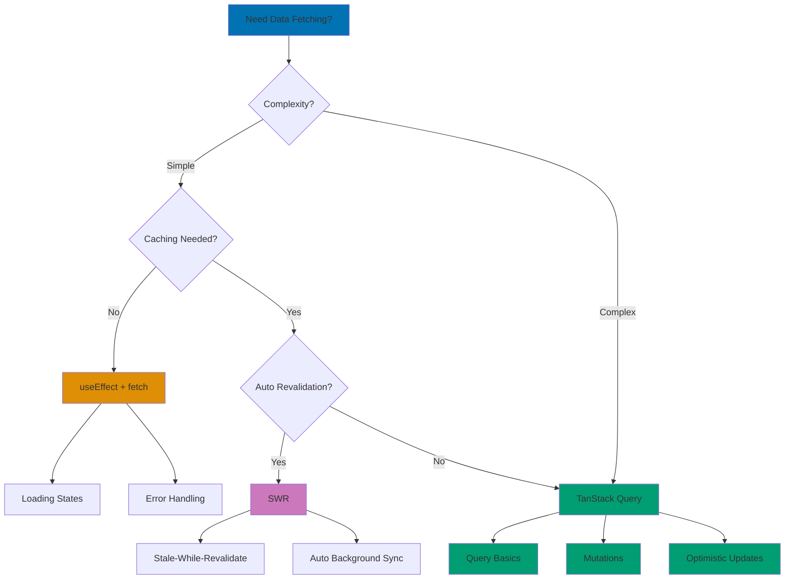

# React Data Fetching

## Quick Reference

**Navigation**: [Stack Libraries](../README.md) > [TypeScript React](./README.md) > Data Fetching

**Related Guides**:

- [Idioms](./ex-soen-plwe-fere__idioms.md) - useEffect patterns
- [Hooks](./ex-soen-plwe-fere__hooks.md) - Data fetching hooks
- [State Management](./ex-soen-plwe-fere__state-management.md) - Server state

## Overview

Data fetching is essential for React applications. This guide covers fetch API, TanStack Query (React Query), SWR, loading states, error handling, and caching strategies.

**Target Audience**: Developers building data-driven React applications, particularly Islamic finance platforms with API integration and real-time data requirements.

**React Version**: React 18.2+ with TypeScript 5+

### Data Fetching Strategy Decision Tree



**Recommendations**:

- **useEffect + fetch**: Simple, one-time data fetching
- **TanStack Query**: Complex apps with caching, mutations, optimistic updates
- **SWR**: Auto-revalidation, focus-revalidation, interval polling

## Basic Fetch with useEffect

### Simple Data Fetching

```typescript
interface UseFetchReturn<T> {
  data: T | null;
  loading: boolean;
  error: Error | null;
}

export const DonationsList: React.FC = () => {
  const [donations, setDonations] = useState<Donation[]>([]);
  const [loading, setLoading] = useState(true);
  const [error, setError] = useState<Error | null>(null);

  useEffect(() => {
    const fetchDonations = async () => {
      try {
        const response = await fetch('/api/donations');
        if (!response.ok) throw new Error('Failed to fetch');

        const data = await response.json();
        setDonations(data);
      } catch (err) {
        setError(err as Error);
      } finally {
        setLoading(false);
      }
    };

    fetchDonations();
  }, []);

  if (loading) return <LoadingSpinner />;
  if (error) return <ErrorMessage error={error} />;

  return (
    <ul>
      {donations.map(d => (
        <li key={d.id}>{d.campaignName}: {d.amount}</li>
      ))}
    </ul>
  );
};
```

### Fetch with Cleanup

```typescript
export const CampaignDetails: React.FC<{ id: string }> = ({ id }) => {
  const [campaign, setCampaign] = useState<Campaign | null>(null);
  const [loading, setLoading] = useState(true);

  useEffect(() => {
    let cancelled = false;

    const fetchCampaign = async () => {
      setLoading(true);

      try {
        const data = await campaignApi.getById(id);

        if (!cancelled) {
          setCampaign(data);
        }
      } catch (error) {
        if (!cancelled) {
          console.error('Fetch error:', error);
        }
      } finally {
        if (!cancelled) {
          setLoading(false);
        }
      }
    };

    fetchCampaign();

    return () => {
      cancelled = true;
    };
  }, [id]);

  if (loading) return <LoadingSpinner />;
  return <div>{campaign?.name}</div>;
};
```

## TanStack Query (React Query)

### Query Basics

```typescript
import { useQuery, useMutation, useQueryClient } from '@tanstack/react-query';

export const DonationsList: React.FC = () => {
  const { data, isLoading, error, refetch } = useQuery({
    queryKey: ['donations'],
    queryFn: async () => {
      const response = await fetch('/api/donations');
      if (!response.ok) throw new Error('Failed to fetch');
      return response.json() as Promise<Donation[]>;
    },
    staleTime: 5 * 60 * 1000, // 5 minutes
    cacheTime: 10 * 60 * 1000, // 10 minutes
  });

  if (isLoading) return <LoadingSpinner />;
  if (error) return <ErrorMessage error={error as Error} />;

  return (
    <div>
      <button onClick={() => refetch()}>Refresh</button>
      <ul>
        {data?.map(d => (
          <li key={d.id}>{d.campaignName}</li>
        ))}
      </ul>
    </div>
  );
};
```

### Mutations

```typescript
export const CreateDonationForm: React.FC = () => {
  const queryClient = useQueryClient();

  const mutation = useMutation({
    mutationFn: (donation: NewDonation) => donationApi.create(donation),

    onSuccess: (newDonation) => {
      // Invalidate and refetch
      queryClient.invalidateQueries({ queryKey: ['donations'] });

      // Or optimistically update
      queryClient.setQueryData<Donation[]>(['donations'], (old = []) => [
        ...old,
        newDonation,
      ]);
    },

    onError: (error) => {
      console.error('Mutation failed:', error);
    },
  });

  const handleSubmit = (data: NewDonation) => {
    mutation.mutate(data);
  };

  return (
    <form onSubmit={e => {
      e.preventDefault();
      handleSubmit(/* form data */);
    }}>
      {/* Form fields */}
      <button type="submit" disabled={mutation.isPending}>
        {mutation.isPending ? 'Submitting...' : 'Submit'}
      </button>
      {mutation.isError && <p>Error: {mutation.error.message}</p>}
      {mutation.isSuccess && <p>Donation created!</p>}
    </form>
  );
};
```

### Pagination

```typescript
import { useQuery } from '@tanstack/react-query';
import { useState } from 'react';

export const PaginatedDonations: React.FC = () => {
  const [page, setPage] = useState(0);

  const { data, isLoading, isPreviousData } = useQuery({
    queryKey: ['donations', page],
    queryFn: () => donationApi.getPage(page, 20),
    keepPreviousData: true, // Keep previous data while loading next page
  });

  return (
    <div>
      {isLoading ? (
        <LoadingSpinner />
      ) : (
        <ul>
          {data?.donations.map(d => (
            <li key={d.id}>{d.campaignName}</li>
          ))}
        </ul>
      )}

      <div className="pagination">
        <button
          onClick={() => setPage(prev => Math.max(0, prev - 1))}
          disabled={page === 0}
        >
          Previous
        </button>

        <span>Page {page + 1}</span>

        <button
          onClick={() => setPage(prev => prev + 1)}
          disabled={isPreviousData || !data?.hasMore}
        >
          Next
        </button>
      </div>
    </div>
  );
};
```

### Infinite Queries

```typescript
import { useInfiniteQuery } from '@tanstack/react-query';

interface DonationsPage {
  donations: Donation[];
  nextCursor: string | null;
}

export const InfiniteDonations: React.FC = () => {
  const {
    data,
    fetchNextPage,
    hasNextPage,
    isFetchingNextPage,
    isLoading,
  } = useInfiniteQuery({
    queryKey: ['donations-infinite'],
    queryFn: ({ pageParam = null }) => donationApi.getPage(pageParam),
    getNextPageParam: (lastPage) => lastPage.nextCursor,
    initialPageParam: null,
  });

  if (isLoading) return <LoadingSpinner />;

  return (
    <div>
      {data?.pages.map((page, i) => (
        <React.Fragment key={i}>
          {page.donations.map((donation) => (
            <DonationCard key={donation.id} donation={donation} />
          ))}
        </React.Fragment>
      ))}

      {hasNextPage && (
        <button
          onClick={() => fetchNextPage()}
          disabled={isFetchingNextPage}
        >
          {isFetchingNextPage ? 'Loading...' : 'Load More'}
        </button>
      )}
    </div>
  );
};
```

### Optimistic Updates

```typescript
export const LikeDonation: React.FC<{ donation: Donation }> = ({ donation }) => {
  const queryClient = useQueryClient();

  const likeMutation = useMutation({
    mutationFn: (donationId: string) => donationApi.like(donationId),

    // Optimistic update
    onMutate: async (donationId) => {
      // Cancel outgoing refetches
      await queryClient.cancelQueries({ queryKey: ['donations'] });

      // Snapshot previous value
      const previousDonations = queryClient.getQueryData<Donation[]>(['donations']);

      // Optimistically update
      queryClient.setQueryData<Donation[]>(['donations'], (old = []) =>
        old.map((d) =>
          d.id === donationId ? { ...d, likes: d.likes + 1, isLiked: true } : d
        )
      );

      // Return rollback function
      return { previousDonations };
    },

    // Rollback on error
    onError: (err, donationId, context) => {
      if (context?.previousDonations) {
        queryClient.setQueryData(['donations'], context.previousDonations);
      }
    },

    // Refetch after success or error
    onSettled: () => {
      queryClient.invalidateQueries({ queryKey: ['donations'] });
    },
  });

  return (
    <button
      onClick={() => likeMutation.mutate(donation.id)}
      disabled={likeMutation.isPending}
    >
      {donation.isLiked ? '❤️' : '🤍'} {donation.likes}
    </button>
  );
};
```

### Dependent Queries

```typescript
export const UserDonations: React.FC<{ userId: string }> = ({ userId }) => {
  // First query: fetch user
  const { data: user } = useQuery({
    queryKey: ['user', userId],
    queryFn: () => userApi.getById(userId),
  });

  // Second query: fetch donations (depends on user)
  const { data: donations, isLoading } = useQuery({
    queryKey: ['donations', user?.id],
    queryFn: () => donationApi.getByUser(user!.id),
    enabled: !!user, // Only run when user is loaded
  });

  if (!user) return <LoadingSpinner />;
  if (isLoading) return <LoadingSpinner />;

  return (
    <div>
      <h2>{user.name}'s Donations</h2>
      <ul>
        {donations?.map((d) => (
          <li key={d.id}>{d.amount}</li>
        ))}
      </ul>
    </div>
  );
};
```

### Parallel Queries

```typescript
export const Dashboard: React.FC = () => {
  const queries = useQueries({
    queries: [
      {
        queryKey: ['donations-total'],
        queryFn: () => donationApi.getTotal(),
      },
      {
        queryKey: ['donors-count'],
        queryFn: () => donorApi.getCount(),
      },
      {
        queryKey: ['campaigns-active'],
        queryFn: () => campaignApi.getActive(),
      },
    ],
  });

  const [totalDonations, donorsCount, activeCampaigns] = queries;

  if (queries.some((q) => q.isLoading)) {
    return <LoadingSpinner />;
  }

  return (
    <div className="dashboard-stats">
      <StatCard label="Total Donations" value={totalDonations.data} />
      <StatCard label="Donors" value={donorsCount.data} />
      <StatCard label="Active Campaigns" value={activeCampaigns.data} />
    </div>
  );
};
```

## SWR (Stale-While-Revalidate)

### Basic SWR

```typescript
import useSWR from 'swr';

const fetcher = (url: string) => fetch(url).then((r) => r.json());

export const DonationsList: React.FC = () => {
  const { data, error, isLoading, mutate } = useSWR<Donation[]>(
    '/api/donations',
    fetcher,
    {
      refreshInterval: 30000, // Refresh every 30 seconds
      revalidateOnFocus: true,
      revalidateOnReconnect: true,
    }
  );

  if (isLoading) return <LoadingSpinner />;
  if (error) return <ErrorMessage error={error} />;

  return (
    <div>
      <button onClick={() => mutate()}>Refresh</button>
      <ul>
        {data?.map((d) => (
          <li key={d.id}>{d.campaignName}</li>
        ))}
      </ul>
    </div>
  );
};
```

### SWR with Mutation

```typescript
import useSWR, { useSWRConfig } from 'swr';

export const DonationForm: React.FC = () => {
  const { mutate } = useSWRConfig();
  const [isSubmitting, setIsSubmitting] = useState(false);

  const handleSubmit = async (donation: NewDonation) => {
    setIsSubmitting(true);

    try {
      const newDonation = await donationApi.create(donation);

      // Optimistic update
      mutate(
        '/api/donations',
        (current: Donation[] = []) => [...current, newDonation],
        { revalidate: false }
      );

      // Revalidate after optimistic update
      await mutate('/api/donations');
    } catch (error) {
      console.error('Failed to create donation:', error);
    } finally {
      setIsSubmitting(false);
    }
  };

  return <form onSubmit={handleSubmit}>{/* Form fields */}</form>;
};
```

### Infinite Loading with SWR

```typescript
import useSWRInfinite from 'swr/infinite';

const getKey = (pageIndex: number, previousPageData: DonationsPage | null) => {
  if (previousPageData && !previousPageData.nextCursor) return null;

  if (pageIndex === 0) return '/api/donations?limit=20';

  return `/api/donations?cursor=${previousPageData!.nextCursor}&limit=20`;
};

export const InfiniteDonations: React.FC = () => {
  const { data, error, size, setSize, isLoading } = useSWRInfinite<DonationsPage>(
    getKey,
    fetcher
  );

  const donations = data ? data.flatMap((page) => page.donations) : [];
  const hasMore = data && data[data.length - 1]?.nextCursor;

  if (isLoading) return <LoadingSpinner />;
  if (error) return <ErrorMessage error={error} />;

  return (
    <div>
      {donations.map((donation) => (
        <DonationCard key={donation.id} donation={donation} />
      ))}

      {hasMore && (
        <button onClick={() => setSize(size + 1)}>Load More</button>
      )}
    </div>
  );
};
```

## Polling & Real-Time Updates

### Polling with React Query

```typescript
export const LiveDonations: React.FC = () => {
  const { data, isLoading } = useQuery({
    queryKey: ['donations-live'],
    queryFn: () => donationApi.getRecent(),
    refetchInterval: 5000, // Poll every 5 seconds
    refetchIntervalInBackground: true, // Continue polling when tab is inactive
  });

  if (isLoading) return <LoadingSpinner />;

  return (
    <div>
      <h3>Recent Donations (Live)</h3>
      <ul>
        {data?.map((d) => (
          <li key={d.id}>
            {d.donorName} donated ${d.amount} - {d.timestamp}
          </li>
        ))}
      </ul>
    </div>
  );
};
```

### WebSocket Integration

```typescript
export const useWebSocket = (url: string) => {
  const [data, setData] = useState<any>(null);
  const [isConnected, setIsConnected] = useState(false);

  useEffect(() => {
    const ws = new WebSocket(url);

    ws.onopen = () => {
      setIsConnected(true);
    };

    ws.onmessage = (event) => {
      const data = JSON.parse(event.data);
      setData(data);
    };

    ws.onclose = () => {
      setIsConnected(false);
    };

    return () => {
      ws.close();
    };
  }, [url]);

  return { data, isConnected };
};

// Usage with React Query
export const RealTimeDonations: React.FC = () => {
  const queryClient = useQueryClient();
  const { data: wsData } = useWebSocket('wss://api.example.com/donations');

  useEffect(() => {
    if (wsData) {
      // Update cache when new donation arrives via WebSocket
      queryClient.setQueryData<Donation[]>(['donations'], (old = []) => [
        wsData,
        ...old,
      ]);
    }
  }, [wsData, queryClient]);

  const { data: donations } = useQuery({
    queryKey: ['donations'],
    queryFn: () => donationApi.getAll(),
  });

  return (
    <div>
      {donations?.map((d) => (
        <DonationCard key={d.id} donation={donation} />
      ))}
    </div>
  );
};
```

## Error Handling & Retry

### Retry Strategies

```typescript
export const DonationsList: React.FC = () => {
  const { data, error, isLoading } = useQuery({
    queryKey: ['donations'],
    queryFn: () => donationApi.getAll(),
    retry: (failureCount, error) => {
      // Don't retry on 404
      if (error instanceof Error && error.message.includes('404')) {
        return false;
      }

      // Retry up to 3 times
      return failureCount < 3;
    },
    retryDelay: (attemptIndex) => Math.min(1000 * 2 ** attemptIndex, 30000),
  });

  if (isLoading) return <LoadingSpinner />;
  if (error) return <ErrorBoundary error={error} />;

  return <div>{/* Render data */}</div>;
};
```

### Error Boundaries

```typescript
interface ErrorBoundaryProps {
  children: React.ReactNode;
  fallback?: React.ReactNode;
}

interface ErrorBoundaryState {
  hasError: boolean;
  error: Error | null;
}

export class ErrorBoundary extends React.Component<
  ErrorBoundaryProps,
  ErrorBoundaryState
> {
  constructor(props: ErrorBoundaryProps) {
    super(props);
    this.state = { hasError: false, error: null };
  }

  static getDerivedStateFromError(error: Error) {
    return { hasError: true, error };
  }

  componentDidCatch(error: Error, errorInfo: React.ErrorInfo) {
    console.error('Error caught by boundary:', error, errorInfo);
  }

  render() {
    if (this.state.hasError) {
      return (
        this.props.fallback || (
          <div className="error-boundary">
            <h2>Something went wrong</h2>
            <p>{this.state.error?.message}</p>
            <button onClick={() => this.setState({ hasError: false, error: null })}>
              Try Again
            </button>
          </div>
        )
      );
    }

    return this.props.children;
  }
}

// Usage
<ErrorBoundary fallback={<ErrorMessage />}>
  <DonationsList />
</ErrorBoundary>
```

## Caching Strategies

### Cache Configuration

```typescript
import { QueryClient, QueryClientProvider } from '@tanstack/react-query';

const queryClient = new QueryClient({
  defaultOptions: {
    queries: {
      staleTime: 5 * 60 * 1000, // 5 minutes
      gcTime: 10 * 60 * 1000, // 10 minutes (formerly cacheTime)
      retry: 1,
      refetchOnWindowFocus: false,
      refetchOnReconnect: true,
    },
  },
});

export const App: React.FC = () => (
  <QueryClientProvider client={queryClient}>
    <Routes />
  </QueryClientProvider>
);
```

### Cache Invalidation

```typescript
export const useDonationMutations = () => {
  const queryClient = useQueryClient();

  const createDonation = useMutation({
    mutationFn: donationApi.create,
    onSuccess: () => {
      // Invalidate all donation queries
      queryClient.invalidateQueries({ queryKey: ["donations"] });

      // Invalidate specific query
      queryClient.invalidateQueries({ queryKey: ["donations", "recent"] });
    },
  });

  const deleteDonation = useMutation({
    mutationFn: donationApi.delete,
    onSuccess: (_, donationId) => {
      // Remove from cache
      queryClient.removeQueries({ queryKey: ["donation", donationId] });

      // Invalidate list
      queryClient.invalidateQueries({ queryKey: ["donations"] });
    },
  });

  return { createDonation, deleteDonation };
};
```

### Prefetching

```typescript
export const DonationCard: React.FC<{ donation: Donation }> = ({ donation }) => {
  const queryClient = useQueryClient();

  const prefetchDetails = () => {
    queryClient.prefetchQuery({
      queryKey: ['donation', donation.id],
      queryFn: () => donationApi.getById(donation.id),
      staleTime: 60000, // 1 minute
    });
  };

  return (
    <div
      onMouseEnter={prefetchDetails} // Prefetch on hover
      onClick={() => navigate(`/donations/${donation.id}`)}
    >
      {donation.campaignName}
    </div>
  );
};
```

## Loading States

### Skeleton Screens

```typescript
export const DonationCardSkeleton: React.FC = () => (
  <div className="donation-card skeleton">
    <div className="skeleton-line" style={{ width: '60%' }} />
    <div className="skeleton-line" style={{ width: '80%' }} />
    <div className="skeleton-line" style={{ width: '40%' }} />
  </div>
);

export const DonationsList: React.FC = () => {
  const { data, isLoading } = useQuery({
    queryKey: ['donations'],
    queryFn: donationApi.getAll,
  });

  if (isLoading) {
    return (
      <div>
        {Array.from({ length: 5 }).map((_, i) => (
          <DonationCardSkeleton key={i} />
        ))}
      </div>
    );
  }

  return (
    <div>
      {data?.map((d) => (
        <DonationCard key={d.id} donation={d} />
      ))}
    </div>
  );
};
```

### Suspense for Data Fetching

```typescript
import { Suspense } from 'react';

export const DonationsWithSuspense: React.FC = () => (
  <Suspense fallback={<LoadingSpinner />}>
    <DonationsList />
  </Suspense>
);

// With multiple suspense boundaries
export const Dashboard: React.FC = () => (
  <div>
    <Suspense fallback={<HeaderSkeleton />}>
      <DashboardHeader />
    </Suspense>

    <Suspense fallback={<StatsSkeleton />}>
      <DashboardStats />
    </Suspense>

    <Suspense fallback={<DonationsSkeleton />}>
      <RecentDonations />
    </Suspense>
  </div>
);
```

## OSE Platform Data Fetching Examples

### Zakat Calculation API

```typescript
interface ZakatCalculationParams {
  wealth: number;
  currency: string;
  userId: string;
}

interface ZakatCalculationResult {
  nisabThreshold: number;
  zakatAmount: number;
  zakatDue: boolean;
  calculationId: string;
}

export const useZakatCalculation = () => {
  return useMutation({
    mutationFn: (params: ZakatCalculationParams) =>
      fetch('/api/zakat/calculate', {
        method: 'POST',
        headers: { 'Content-Type': 'application/json' },
        body: JSON.stringify(params),
      }).then((r) => r.json() as Promise<ZakatCalculationResult>),
  });
};

// Usage
export const ZakatCalculator: React.FC = () => {
  const [wealth, setWealth] = useState(0);
  const { mutate, data, isPending, error } = useZakatCalculation();

  const handleCalculate = () => {
    mutate({
      wealth,
      currency: 'USD',
      userId: 'user-123',
    });
  };

  return (
    <div className="zakat-calculator">
      <input
        type="number"
        value={wealth}
        onChange={(e) => setWealth(Number(e.target.value))}
        placeholder="Enter total wealth"
      />

      <button onClick={handleCalculate} disabled={isPending}>
        {isPending ? 'Calculating...' : 'Calculate Zakat'}
      </button>

      {error && <ErrorMessage error={error} />}

      {data && (
        <div className="result">
          <p>Nisab Threshold: ${data.nisabThreshold.toFixed(2)}</p>
          <p>Zakat Due: {data.zakatDue ? 'Yes' : 'No'}</p>
          {data.zakatDue && (
            <p className="highlight">
              Zakat Amount: ${data.zakatAmount.toFixed(2)}
            </p>
          )}
        </div>
      )}
    </div>
  );
};
```

### Murabaha Contracts with Pagination

```typescript
interface MurabahaContract {
  id: string;
  applicantName: string;
  requestedAmount: number;
  status: 'pending' | 'approved' | 'active' | 'completed';
  createdAt: string;
}

interface ContractsPage {
  contracts: MurabahaContract[];
  total: number;
  page: number;
  pageSize: number;
}

export const useMurabahaContracts = (page: number, status?: string) => {
  return useQuery({
    queryKey: ['murabaha-contracts', page, status],
    queryFn: async () => {
      const params = new URLSearchParams({
        page: page.toString(),
        pageSize: '20',
        ...(status && { status }),
      });

      const response = await fetch(`/api/murabaha/contracts?${params}`);
      return response.json() as Promise<ContractsPage>;
    },
    keepPreviousData: true,
  });
};

// Usage
export const MurabahaContractsList: React.FC = () => {
  const [page, setPage] = useState(0);
  const [status, setStatus] = useState<string | undefined>();

  const { data, isLoading, isPreviousData } = useMurabahaContracts(page, status);

  if (isLoading && !isPreviousData) {
    return <LoadingSpinner />;
  }

  return (
    <div>
      <div className="filters">
        <select value={status || ''} onChange={(e) => setStatus(e.target.value)}>
          <option value="">All Status</option>
          <option value="pending">Pending</option>
          <option value="approved">Approved</option>
          <option value="active">Active</option>
          <option value="completed">Completed</option>
        </select>
      </div>

      <div className="contracts-list">
        {data?.contracts.map((contract) => (
          <ContractCard key={contract.id} contract={contract} />
        ))}
      </div>

      <div className="pagination">
        <button
          onClick={() => setPage((p) => Math.max(0, p - 1))}
          disabled={page === 0 || isPreviousData}
        >
          Previous
        </button>

        <span>
          Page {page + 1} of {Math.ceil(data!.total / data!.pageSize)}
        </span>

        <button
          onClick={() => setPage((p) => p + 1)}
          disabled={
            isPreviousData ||
            page >= Math.ceil(data!.total / data!.pageSize) - 1
          }
        >
          Next
        </button>
      </div>
    </div>
  );
};
```

### Waqf Projects with Real-Time Updates

```typescript
interface WaqfProject {
  id: string;
  name: string;
  description: string;
  targetAmount: number;
  currentAmount: number;
  donorCount: number;
  status: 'active' | 'completed';
}

export const useWaqfProjects = () => {
  const queryClient = useQueryClient();

  // Fetch projects
  const query = useQuery({
    queryKey: ['waqf-projects'],
    queryFn: async () => {
      const response = await fetch('/api/waqf/projects');
      return response.json() as Promise<WaqfProject[]>;
    },
    refetchInterval: 30000, // Refresh every 30 seconds
  });

  // WebSocket for real-time donation updates
  useEffect(() => {
    const ws = new WebSocket('wss://api.example.com/waqf/donations');

    ws.onmessage = (event) => {
      const donation = JSON.parse(event.data);

      // Update specific project in cache
      queryClient.setQueryData<WaqfProject[]>(['waqf-projects'], (old = []) =>
        old.map((project) =>
          project.id === donation.projectId
            ? {
                ...project,
                currentAmount: project.currentAmount + donation.amount,
                donorCount: project.donorCount + 1,
              }
            : project
        )
      );
    };

    return () => ws.close();
  }, [queryClient]);

  return query;
};

// Usage
export const WaqfProjectsGrid: React.FC = () => {
  const { data: projects, isLoading } = useWaqfProjects();

  if (isLoading) {
    return (
      <div className="projects-grid">
        {Array.from({ length: 6 }).map((_, i) => (
          <ProjectCardSkeleton key={i} />
        ))}
      </div>
    );
  }

  return (
    <div className="projects-grid">
      {projects?.map((project) => (
        <WaqfProjectCard key={project.id} project={project} />
      ))}
    </div>
  );
};
```

## Data Fetching Best Practices Checklist

### Query Design

- [ ] Use meaningful query keys
- [ ] Implement proper error handling
- [ ] Add loading states
- [ ] Configure appropriate stale/cache times
- [ ] Use dependent queries when needed
- [ ] Implement pagination for large datasets
- [ ] Prefetch data when possible

### Performance

- [ ] Avoid unnecessary re-fetches
- [ ] Use optimistic updates for better UX
- [ ] Implement request deduplication
- [ ] Cancel requests on unmount
- [ ] Use pagination/infinite scroll for large lists
- [ ] Cache frequently accessed data
- [ ] Prefetch on hover/route change

### Error Handling

- [ ] Implement retry strategies
- [ ] Use error boundaries
- [ ] Show user-friendly error messages
- [ ] Log errors for debugging
- [ ] Handle network failures gracefully
- [ ] Implement offline support

### Real-Time

- [ ] Use polling for simple real-time needs
- [ ] Use WebSockets for complex real-time features
- [ ] Update cache from WebSocket events
- [ ] Handle connection failures
- [ ] Implement reconnection logic

## Related Documentation

- **[Idioms](./ex-soen-plwe-fere__idioms.md)** - useEffect patterns
- **[Hooks](./ex-soen-plwe-fere__hooks.md)** - Data fetching hooks
- **[State Management](./ex-soen-plwe-fere__state-management.md)** - Server state management
- **[Performance](./ex-soen-plwe-fere__performance.md)** - Performance optimization
- **[Security](./ex-soen-plwe-fere__security.md)** - API security

---

**Last Updated**: 2026-01-26
