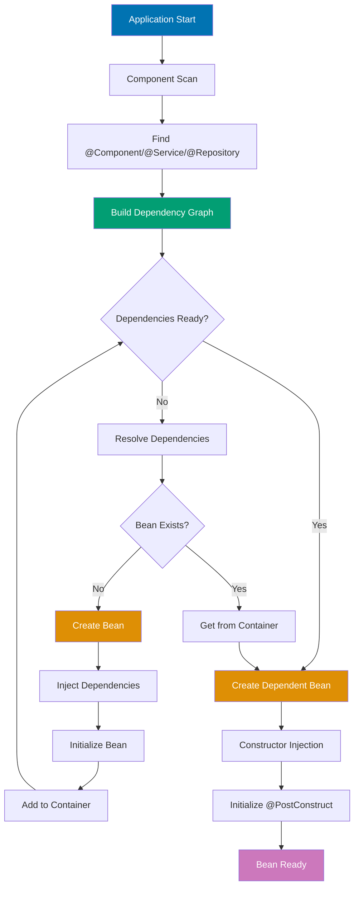

# Spring Boot Dependency Injection

## 📋 Quick Reference

- [Overview](#overview)
- [Constructor Injection](#constructor-injection-recommended)
- [Field Injection (Anti-pattern)](#field-injection-anti-pattern)
- [Bean Scopes](#bean-scopes)
- [Bean Lifecycle](#bean-lifecycle)
- [Qualifiers and Primary](#qualifiers-and-primary)
- [Profiles](#profiles)
- [Configuration Classes](#configuration-classes)
- [Circular Dependencies](#circular-dependencies)
- [Testing with DI](#testing-with-dependency-injection)
- [OSE Platform DI Examples](#ose-platform-di-examples)
- [Related Documentation](#related-documentation)

## Overview

Dependency Injection (DI) is a design pattern where objects receive their dependencies from external sources rather than creating them. Spring Boot's IoC (Inversion of Control) container manages object creation and wiring automatically.

### Why Dependency Injection?

- **Loose Coupling**: Classes depend on abstractions, not concrete implementations
- **Testability**: Easy to inject mocks and test doubles
- **Maintainability**: Dependencies declared explicitly
- **Flexibility**: Easy to swap implementations

### Injection Types in Spring

1. **Constructor Injection** ✅ Recommended
2. **Setter Injection** ⚠️ Use sparingly
3. **Field Injection** ❌ Avoid

## Constructor Injection (Recommended)

Constructor injection is the preferred method in Spring Boot. Dependencies are provided through constructor parameters.

### Dependency Resolution Flow



**Resolution Process**:

1. **Component Scan** (blue): Spring scans for `@Component`, `@Service`, `@Repository` classes
2. **Dependency Graph** (teal): Build graph of all beans and their dependencies
3. **Resolve Dependencies** (orange): For each bean, resolve all constructor parameters
4. **Create Beans** (orange): Instantiate beans in correct order (dependencies first)
5. **Inject** (purple): Inject resolved dependencies via constructor
6. **Initialize**: Run `@PostConstruct` methods
7. **Ready** (purple): Bean available for use

**Key Benefits**:

- **Compile-time safety**: Missing dependencies detected at startup
- **Immutability**: Dependencies can be `final`
- **Testability**: Easy to mock in unit tests
- **No reflection**: No `@Autowired` needed (Spring 4.3+)
- **Fail-fast**: Application won't start if dependencies missing

### Basic Constructor Injection

```java
@Service
public class ZakatCalculationService {

    private final ZakatCalculationRepository repository;
    private final ApplicationEventPublisher eventPublisher;
    private final NisabThresholdService nisabService;

    // No @Autowired needed (Spring 4.3+)
    public ZakatCalculationService(
        ZakatCalculationRepository repository,
        ApplicationEventPublisher eventPublisher,
        NisabThresholdService nisabService
    ) {
        this.repository = repository;
        this.eventPublisher = eventPublisher;
        this.nisabService = nisabService;
    }

    public ZakatCalculationResponse calculate(CreateZakatRequest request, String userId) {
        Money nisab = nisabService.getCurrentNisab(request.currency());

        ZakatCalculation calculation = ZakatCalculation.calculate(
            new Money(request.wealth(), request.currency()),
            nisab,
            userId,
            LocalDate.now()
        );

        ZakatCalculation saved = repository.save(calculation);

        saved.getDomainEvents().forEach(eventPublisher::publishEvent);
        saved.clearDomainEvents();

        return ZakatCalculationMapper.toResponse(saved);
    }
}
```

### Benefits of Constructor Injection

```java
// ✅ GOOD - Constructor injection
@Service
public class MurabahaApplicationService {

    // 1. Immutability - dependencies are final
    private final MurabahaApplicationRepository repository;
    private final InstallmentScheduleCalculator calculator;

    // 2. Explicit dependencies - clear what's required
    public MurabahaApplicationService(
        MurabahaApplicationRepository repository,
        InstallmentScheduleCalculator calculator
    ) {
        // 3. Validation - can add null checks if needed
        this.repository = Objects.requireNonNull(repository, "repository cannot be null");
        this.calculator = Objects.requireNonNull(calculator, "calculator cannot be null");
    }

    // 4. Easy to test - pass mocks in constructor
    public ApplicationResponse approve(String applicationId) {
        MurabahaApplication application = repository.findById(applicationId)
            .orElseThrow(() -> new ResourceNotFoundException("Application not found"));

        application.approve(calculator);

        return MurabahaApplicationMapper.toResponse(repository.save(application));
    }
}

// ❌ BAD - Field injection (see next section)
@Service
public class BadService {
    @Autowired  // ❌ Avoid
    private SomeDependency dependency;
}
```

### Testing Advantage

```java
class MurabahaApplicationServiceTest {

    @Test
    void approve_validApplication_approves() {
        // Easy to create mocks
        MurabahaApplicationRepository mockRepository = mock(MurabahaApplicationRepository.class);
        InstallmentScheduleCalculator mockCalculator = mock(InstallmentScheduleCalculator.class);

        // Inject mocks via constructor
        MurabahaApplicationService service = new MurabahaApplicationService(
            mockRepository,
            mockCalculator
        );

        // Test logic...
    }
}
```

## Field Injection (Anti-pattern)

Field injection uses `@Autowired` directly on fields. **Avoid this pattern.**

### Why Field Injection is Bad

```java
// ❌ BAD - Field injection
@Service
public class BadZakatService {

    @Autowired  // ❌ Problem 1: Mutable dependencies
    private ZakatCalculationRepository repository;

    @Autowired  // ❌ Problem 2: Hidden dependencies
    private ApplicationEventPublisher eventPublisher;

    @Autowired  // ❌ Problem 3: Hard to test
    private NisabThresholdService nisabService;

    // Problem 4: Can create object without dependencies (NullPointerException risk)
    public BadZakatService() {}

    // Problem 5: Can't make dependencies final
    // Problem 6: Circular dependencies detected at runtime, not compile time
}
```

### Problems with Field Injection

1. **Cannot use `final`**: Dependencies are mutable
2. **Hidden dependencies**: Not clear what's required
3. **Hard to test**: Need Spring context or reflection
4. **Nullable dependencies**: Object can be created without dependencies
5. **Circular dependencies**: Detected at runtime
6. **Tight coupling to Spring**: Can't instantiate without Spring

### Migrating from Field to Constructor Injection

```java
// ❌ BEFORE - Field injection
@Service
public class WaqfDonationService {

    @Autowired
    private WaqfDonationRepository donationRepository;

    @Autowired
    private WaqfProjectRepository projectRepository;

    @Autowired
    private ApplicationEventPublisher eventPublisher;

    public DonationResponse createDonation(DonationRequest request) {
        // Logic...
    }
}

// ✅ AFTER - Constructor injection
@Service
public class WaqfDonationService {

    private final WaqfDonationRepository donationRepository;
    private final WaqfProjectRepository projectRepository;
    private final ApplicationEventPublisher eventPublisher;

    public WaqfDonationService(
        WaqfDonationRepository donationRepository,
        WaqfProjectRepository projectRepository,
        ApplicationEventPublisher eventPublisher
    ) {
        this.donationRepository = donationRepository;
        this.projectRepository = projectRepository;
        this.eventPublisher = eventPublisher;
    }

    public DonationResponse createDonation(DonationRequest request) {
        // Logic...
    }
}
```

## Bean Scopes

Bean scope defines the lifecycle and visibility of a bean.

### Singleton Scope (Default)

One instance per Spring container:

```java
@Service  // Default: singleton
public class ZakatCalculationService {

    // Shared instance across entire application
    // Thread-safe if stateless
}

// Explicit singleton
@Component
@Scope("singleton")
public class NisabThresholdService {

    // ✅ GOOD - No mutable state (stateless)
    public Money getCurrentNisab(String currency) {
        // Fetch from database/API
        return new Money(new BigDecimal("5000"), currency);
    }
}

// ❌ BAD - Mutable state in singleton
@Service
public class BadSingletonService {

    private int requestCount;  // ❌ Not thread-safe

    public void processRequest() {
        requestCount++;  // ❌ Race condition
    }
}
```

### Prototype Scope

New instance for each injection:

```java
@Component
@Scope("prototype")
public class ReportGenerator {

    private LocalDateTime generatedAt;  // ✅ OK - new instance each time

    public ReportGenerator() {
        this.generatedAt = LocalDateTime.now();
    }

    public Report generate(String userId) {
        // Generate report with current timestamp
        return new Report(userId, generatedAt);
    }
}

// Usage
@Service
public class ReportService {

    private final ApplicationContext context;

    public ReportService(ApplicationContext context) {
        this.context = context;
    }

    public Report generateReport(String userId) {
        // Get new instance each time
        ReportGenerator generator = context.getBean(ReportGenerator.class);
        return generator.generate(userId);
    }
}
```

### Request Scope

New instance per HTTP request:

```java
@Component
@Scope(value = WebApplicationContext.SCOPE_REQUEST, proxyMode = ScopedProxyMode.TARGET_CLASS)
public class UserContextHolder {

    private String userId;
    private String requestId;

    @PostConstruct
    public void init() {
        this.requestId = UUID.randomUUID().toString();
    }

    public void setUserId(String userId) {
        this.userId = userId;
    }

    public String getUserId() {
        return userId;
    }

    public String getRequestId() {
        return requestId;
    }
}

// Usage in controller
@RestController
@RequestMapping("/api/v1/zakat")
public class ZakatCalculationController {

    private final UserContextHolder userContext;
    private final ZakatCalculationService service;

    public ZakatCalculationController(
        UserContextHolder userContext,
        ZakatCalculationService service
    ) {
        this.userContext = userContext;
        this.service = service;
    }

    @PostMapping("/calculations")
    public ResponseEntity<ZakatCalculationResponse> create(
        @Valid @RequestBody CreateZakatRequest request,
        Principal principal
    ) {
        // Set user context for this request
        userContext.setUserId(principal.getName());

        ZakatCalculationResponse response = service.calculate(request, principal.getName());

        return ResponseEntity
            .created(URI.create("/api/v1/zakat/calculations/" + response.getId()))
            .header("X-Request-ID", userContext.getRequestId())
            .body(response);
    }
}
```

### Session Scope

New instance per HTTP session:

```java
@Component
@Scope(value = WebApplicationContext.SCOPE_SESSION, proxyMode = ScopedProxyMode.TARGET_CLASS)
public class UserPreferences {

    private String currency = "USD";
    private String language = "en";

    public void setCurrency(String currency) {
        this.currency = currency;
    }

    public String getCurrency() {
        return currency;
    }

    // Other preference methods...
}
```

## Bean Lifecycle

Spring manages bean lifecycle from creation to destruction.

### Spring Bean Lifecycle Flow

```mermaid
%% Color Palette: Blue #0173B2, Orange #DE8F05, Teal #029E73, Purple #CC78BC
%% All colors are color-blind friendly and meet WCAG AA contrast standards

graph TD
    A[Container Startup] --> B[Load Bean Definitions]
    B --> C[Bean Instantiation]
    C --> D[Constructor Called]
    D --> E[Populate Properties<br/>Setter Injection]
    E --> F{BeanNameAware?}
    F -->|Yes| G[setBeanName#40;#41;]
    F -->|No| H[Skip]
    G --> I{BeanFactoryAware?}
    H --> I
    I -->|Yes| J[setBeanFactory#40;#41;]
    I -->|No| K[Skip]
    J --> L{ApplicationContextAware?}
    K --> L
    L -->|Yes| M[setApplicationContext#40;#41;]
    L -->|No| N[@PostConstruct Methods]
    M --> N
    N --> O[afterPropertiesSet#40;#41;<br/>InitializingBean]
    O --> P[Custom init-method]
    P --> Q[Bean Ready for Use]

    Q --> R{Application Shutdown?}
    R -->|No| Q
    R -->|Yes| S[@PreDestroy Methods]
    S --> T[destroy#40;#41;<br/>DisposableBean]
    T --> U[Custom destroy-method]
    U --> V[Bean Destroyed]

    style A fill:#0173B2,color:#fff
    style D fill:#029E73,color:#fff
    style N fill:#DE8F05,color:#fff
    style P fill:#DE8F05,color:#fff
    style Q fill:#CC78BC,color:#fff
    style S fill:#DE8F05,color:#fff
    style V fill:#0173B2,color:#fff
```

**Lifecycle Phases**:

1. **Instantiation** (blue): Container creates bean instance
2. **Dependency Injection** (teal): Constructor injection, then setter injection
3. **Aware Interfaces**: BeanNameAware, BeanFactoryAware, ApplicationContextAware (optional)
4. **Initialization** (orange): `@PostConstruct` → `InitializingBean.afterPropertiesSet()` → custom init-method
5. **Ready** (purple): Bean available for application use
6. **Destruction** (orange): `@PreDestroy` → `DisposableBean.destroy()` → custom destroy-method
7. **Destroyed** (blue): Bean removed from container

**Best Practices**:

- Use `@PostConstruct` for initialization (most common)
- Use `@PreDestroy` for cleanup
- Avoid implementing `InitializingBean`/`DisposableBean` interfaces (prefer annotations)
- Keep init/destroy methods lightweight

### Initialization and Destruction

```java
@Component
public class DatabaseConnectionManager {

    private Connection connection;

    // 1. Constructor
    public DatabaseConnectionManager() {
        System.out.println("Constructor called");
    }

    // 2. @PostConstruct - after dependency injection
    @PostConstruct
    public void init() {
        System.out.println("@PostConstruct - Initializing connection pool");
        this.connection = createConnection();
    }

    // 3. @PreDestroy - before bean destruction
    @PreDestroy
    public void cleanup() {
        System.out.println("@PreDestroy - Closing connections");
        if (connection != null) {
            try {
                connection.close();
            } catch (Exception e) {
                // Log error
            }
        }
    }

    private Connection createConnection() {
        // Create database connection
        return null;
    }
}
```

### InitializingBean and DisposableBean

```java
@Component
public class CacheWarmer implements InitializingBean, DisposableBean {

    private final ZakatCalculationRepository repository;
    private final CacheManager cacheManager;

    public CacheWarmer(
        ZakatCalculationRepository repository,
        CacheManager cacheManager
    ) {
        this.repository = repository;
        this.cacheManager = cacheManager;
    }

    @Override
    public void afterPropertiesSet() throws Exception {
        // Called after all dependencies injected
        System.out.println("Warming up cache...");

        List<ZakatCalculation> recentCalculations = repository.findRecentCalculations();
        recentCalculations.forEach(calc -> {
            cacheManager.getCache("zakatCalculations").put(calc.getId(), calc);
        });

        System.out.println("Cache warmed with " + recentCalculations.size() + " entries");
    }

    @Override
    public void destroy() throws Exception {
        // Called before bean destruction
        System.out.println("Clearing cache...");
        cacheManager.getCacheNames().forEach(name -> {
            cacheManager.getCache(name).clear();
        });
    }
}
```

### Lazy Initialization

```java
@Service
@Lazy  // Created only when first used
public class ExpensiveReportService {

    private final ReportRepository repository;

    public ExpensiveReportService(ReportRepository repository) {
        System.out.println("ExpensiveReportService created");  // Won't see unless used
        this.repository = repository;
    }

    public Report generateAnnualReport(String userId) {
        // Expensive operation
        return repository.generateAnnualReport(userId);
    }
}

// Usage
@Service
public class ReportCoordinator {

    private final ExpensiveReportService expensiveReportService;  // Not created until used

    public ReportCoordinator(@Lazy ExpensiveReportService expensiveReportService) {
        this.expensiveReportService = expensiveReportService;
    }

    public Report getReport(String userId, ReportType type) {
        if (type == ReportType.ANNUAL) {
            // ExpensiveReportService created here
            return expensiveReportService.generateAnnualReport(userId);
        }
        // Other report types...
        return null;
    }
}
```

## Qualifiers and Primary

When multiple beans of the same type exist, use `@Qualifier` or `@Primary` to specify which one to inject.

### Using @Qualifier

```java
// Multiple implementations of notification service
public interface NotificationService {
    void sendNotification(String userId, String message);
}

@Service
@Qualifier("email")
public class EmailNotificationService implements NotificationService {

    @Override
    public void sendNotification(String userId, String message) {
        System.out.println("Sending email to " + userId + ": " + message);
    }
}

@Service
@Qualifier("sms")
public class SmsNotificationService implements NotificationService {

    @Override
    public void sendNotification(String userId, String message) {
        System.out.println("Sending SMS to " + userId + ": " + message);
    }
}

// Inject specific implementation
@Service
public class ZakatCalculationService {

    private final ZakatCalculationRepository repository;
    private final NotificationService emailNotification;
    private final NotificationService smsNotification;

    public ZakatCalculationService(
        ZakatCalculationRepository repository,
        @Qualifier("email") NotificationService emailNotification,
        @Qualifier("sms") NotificationService smsNotification
    ) {
        this.repository = repository;
        this.emailNotification = emailNotification;
        this.smsNotification = smsNotification;
    }

    public ZakatCalculationResponse calculate(CreateZakatRequest request, String userId) {
        // Calculate zakat...
        ZakatCalculation saved = repository.save(calculation);

        // Send both email and SMS
        emailNotification.sendNotification(userId, "Zakat calculated: " + saved.getZakatAmount());
        smsNotification.sendNotification(userId, "Zakat: " + saved.getZakatAmount());

        return ZakatCalculationMapper.toResponse(saved);
    }
}
```

### Using @Primary

```java
// Mark one implementation as primary (default)
@Service
@Primary  // This will be injected by default
public class EmailNotificationService implements NotificationService {

    @Override
    public void sendNotification(String userId, String message) {
        System.out.println("Sending email to " + userId + ": " + message);
    }
}

@Service
public class SmsNotificationService implements NotificationService {

    @Override
    public void sendNotification(String userId, String message) {
        System.out.println("Sending SMS to " + userId + ": " + message);
    }
}

// Inject primary bean (no qualifier needed)
@Service
public class SimpleNotificationService {

    private final NotificationService notificationService;  // EmailNotificationService injected

    public SimpleNotificationService(NotificationService notificationService) {
        this.notificationService = notificationService;
    }

    public void notify(String userId, String message) {
        notificationService.sendNotification(userId, message);
    }
}
```

## Profiles

Profiles allow different bean configurations for different environments.

### Profile-Specific Beans

```java
// Development configuration
@Configuration
@Profile("dev")
public class DevConfig {

    @Bean
    public DataSource dataSource() {
        // H2 in-memory database
        return new EmbeddedDatabaseBuilder()
            .setType(EmbeddedDatabaseType.H2)
            .build();
    }

    @Bean
    public NotificationService notificationService() {
        // Mock notification service for development
        return new MockNotificationService();
    }
}

// Production configuration
@Configuration
@Profile("prod")
public class ProdConfig {

    @Bean
    public DataSource dataSource() {
        // PostgreSQL connection pool
        HikariConfig config = new HikariConfig();
        config.setJdbcUrl(System.getenv("DATABASE_URL"));
        config.setMaximumPoolSize(20);
        return new HikariDataSource(config);
    }

    @Bean
    public NotificationService notificationService() {
        // Real email service
        return new EmailNotificationService();
    }
}

// Common configuration (no profile)
@Configuration
public class CommonConfig {

    @Bean
    public ObjectMapper objectMapper() {
        // Used in all environments
        return new ObjectMapper()
            .registerModule(new JavaTimeModule())
            .disable(SerializationFeature.WRITE_DATES_AS_TIMESTAMPS);
    }
}
```

### Profile Activation

```properties
# application.properties
spring.profiles.active=dev

# application-dev.properties
ose.cache.enabled=false
logging.level.root=DEBUG

# application-prod.properties
ose.cache.enabled=true
logging.level.root=INFO
```

### Multiple Profiles

```java
@Configuration
@Profile({"dev", "test"})  // Active in dev OR test
public class NonProdConfig {

    @Bean
    public DataSource dataSource() {
        return new EmbeddedDatabaseBuilder()
            .setType(EmbeddedDatabaseType.H2)
            .build();
    }
}

@Configuration
@Profile("!prod")  // Active in all profiles EXCEPT prod
public class DebugConfig {

    @Bean
    public DebugInterceptor debugInterceptor() {
        return new DebugInterceptor();
    }
}
```

## Configuration Classes

Configuration classes define beans programmatically.

### @Configuration vs @Component

```java
// ✅ GOOD - @Configuration for bean definitions
@Configuration
public class AppConfig {

    @Bean
    public ObjectMapper objectMapper() {
        return new ObjectMapper()
            .registerModule(new JavaTimeModule());
    }

    @Bean
    public RestTemplate restTemplate() {
        return new RestTemplate();
    }

    @Bean
    public ZakatRateProvider zakatRateProvider(RestTemplate restTemplate) {
        // Can call other @Bean methods
        return new RemoteZakatRateProvider(restTemplate);
    }
}

// ⚠️ CAREFUL - @Component with @Bean methods
@Component  // Less optimal for bean definitions
public class NotRecommendedConfig {

    @Bean
    public SomeBean someBean() {
        return new SomeBean();
    }
}
```

### Bean Dependencies

```java
@Configuration
public class ServiceConfig {

    // Bean method can depend on other beans
    @Bean
    public ZakatCalculationService zakatCalculationService(
        ZakatCalculationRepository repository,
        ApplicationEventPublisher eventPublisher,
        NisabThresholdService nisabService
    ) {
        return new ZakatCalculationService(repository, eventPublisher, nisabService);
    }

    // Call other @Bean methods directly
    @Bean
    public NisabThresholdService nisabThresholdService() {
        return new NisabThresholdService(nisabRepository());
    }

    @Bean
    public NisabRepository nisabRepository() {
        return new JpaNisabRepository();
    }
}
```

### Conditional Beans

```java
@Configuration
public class CacheConfig {

    @Bean
    @ConditionalOnProperty(name = "ose.cache.enabled", havingValue = "true")
    public CacheManager cacheManager() {
        // Only created if ose.cache.enabled=true
        return new CaffeineCacheManager("zakatCalculations", "murabahaApplications");
    }

    @Bean
    @ConditionalOnMissingBean  // Only if no CacheManager exists
    public CacheManager noCacheCacheManager() {
        return new NoOpCacheManager();
    }

    @Bean
    @ConditionalOnClass(name = "com.github.benmanes.caffeine.cache.Caffeine")
    public CaffeineCache caffeineCache() {
        // Only if Caffeine is on classpath
        return Caffeine.newBuilder()
            .maximumSize(1000)
            .expireAfterWrite(10, TimeUnit.MINUTES)
            .build();
    }
}
```

## Circular Dependencies

Circular dependencies occur when beans depend on each other directly or indirectly.

### Detecting Circular Dependencies

```java
// ❌ BAD - Circular dependency
@Service
public class ServiceA {

    private final ServiceB serviceB;

    public ServiceA(ServiceB serviceB) {  // Depends on ServiceB
        this.serviceB = serviceB;
    }
}

@Service
public class ServiceB {

    private final ServiceA serviceA;

    public ServiceB(ServiceA serviceA) {  // Depends on ServiceA
        this.serviceA = serviceA;
    }
}

// Error at startup:
// BeanCurrentlyInCreationException: Circular dependency between ServiceA and ServiceB
```

### Resolving Circular Dependencies

**Option 1: Refactor to Remove Cycle** (Recommended)

```java
// ✅ GOOD - Extract shared logic to new service
@Service
public class ServiceA {

    private final SharedService sharedService;

    public ServiceA(SharedService sharedService) {
        this.sharedService = sharedService;
    }
}

@Service
public class ServiceB {

    private final SharedService sharedService;

    public ServiceB(SharedService sharedService) {
        this.sharedService = sharedService;
    }
}

@Service
public class SharedService {
    // Common logic previously in ServiceA/ServiceB
}
```

**Option 2: Use @Lazy** (If refactoring not possible)

```java
// ⚠️ WORKAROUND - Use @Lazy to break cycle
@Service
public class ServiceA {

    private final ServiceB serviceB;

    public ServiceA(@Lazy ServiceB serviceB) {  // Lazy injection breaks cycle
        this.serviceB = serviceB;
    }
}

@Service
public class ServiceB {

    private final ServiceA serviceA;

    public ServiceB(ServiceA serviceA) {
        this.serviceA = serviceA;
    }
}
```

## Testing with Dependency Injection

Constructor injection makes testing easier.

### Unit Testing with Mocks

```java
class ZakatCalculationServiceTest {

    private ZakatCalculationRepository mockRepository;
    private ApplicationEventPublisher mockEventPublisher;
    private NisabThresholdService mockNisabService;

    private ZakatCalculationService service;

    @BeforeEach
    void setUp() {
        // Create mocks
        mockRepository = mock(ZakatCalculationRepository.class);
        mockEventPublisher = mock(ApplicationEventPublisher.class);
        mockNisabService = mock(NisabThresholdService.class);

        // Inject via constructor - no Spring needed
        service = new ZakatCalculationService(
            mockRepository,
            mockEventPublisher,
            mockNisabService
        );
    }

    @Test
    void calculate_validRequest_savesAndPublishes() {
        // Arrange
        CreateZakatRequest request = new CreateZakatRequest(
            new BigDecimal("10000"),
            "USD",
            LocalDate.now()
        );

        when(mockNisabService.getCurrentNisab("USD"))
            .thenReturn(new Money(new BigDecimal("5000"), "USD"));

        ZakatCalculation calculation = ZakatCalculation.calculate(/*...*/);
        when(mockRepository.save(any())).thenReturn(calculation);

        // Act
        ZakatCalculationResponse response = service.calculate(request, "user-123");

        // Assert
        assertThat(response).isNotNull();
        verify(mockNisabService).getCurrentNisab("USD");
        verify(mockRepository).save(any(ZakatCalculation.class));
        verify(mockEventPublisher).publishEvent(any());
    }
}
```

### Integration Testing with @SpringBootTest

```java
@SpringBootTest
class ZakatCalculationIntegrationTest {

    @Autowired
    private ZakatCalculationService service;

    @MockBean  // Replace real bean with mock
    private NotificationService notificationService;

    @Test
    void calculate_fullIntegration_works() {
        // Real service with mocked notification
        CreateZakatRequest request = new CreateZakatRequest(
            new BigDecimal("10000"),
            "USD",
            LocalDate.now()
        );

        ZakatCalculationResponse response = service.calculate(request, "user-123");

        assertThat(response).isNotNull();
        verify(notificationService).sendNotification(eq("user-123"), anyString());
    }
}
```

## OSE Platform DI Examples

### Zakat Calculation Service

```java
@Service
@Transactional
public class ZakatCalculationService {

    private final ZakatCalculationRepository calculationRepository;
    private final NisabThresholdService nisabService;
    private final ApplicationEventPublisher eventPublisher;
    private final NotificationService notificationService;

    public ZakatCalculationService(
        ZakatCalculationRepository calculationRepository,
        NisabThresholdService nisabService,
        ApplicationEventPublisher eventPublisher,
        @Qualifier("email") NotificationService notificationService
    ) {
        this.calculationRepository = calculationRepository;
        this.nisabService = nisabService;
        this.eventPublisher = eventPublisher;
        this.notificationService = notificationService;
    }

    public ZakatCalculationResponse calculate(CreateZakatRequest request, String userId) {
        Money nisab = nisabService.getCurrentNisab(request.currency());

        ZakatCalculation calculation = ZakatCalculation.calculate(
            new Money(request.wealth(), request.currency()),
            nisab,
            userId,
            request.calculationDate()
        );

        ZakatCalculation saved = calculationRepository.save(calculation);

        saved.getDomainEvents().forEach(eventPublisher::publishEvent);
        saved.clearDomainEvents();

        notificationService.sendNotification(
            userId,
            "Zakat calculated: " + saved.getZakatAmount()
        );

        return ZakatCalculationMapper.toResponse(saved);
    }
}
```

### Murabaha Application Service with Multiple Dependencies

```java
@Service
@Transactional
public class MurabahaApplicationService {

    private final MurabahaApplicationRepository applicationRepository;
    private final InstallmentScheduleCalculator scheduleCalculator;
    private final ApplicationEventPublisher eventPublisher;
    private final UserContextHolder userContext;
    private final NotificationService emailNotification;
    private final NotificationService smsNotification;

    public MurabahaApplicationService(
        MurabahaApplicationRepository applicationRepository,
        InstallmentScheduleCalculator scheduleCalculator,
        ApplicationEventPublisher eventPublisher,
        UserContextHolder userContext,
        @Qualifier("email") NotificationService emailNotification,
        @Qualifier("sms") NotificationService smsNotification
    ) {
        this.applicationRepository = applicationRepository;
        this.scheduleCalculator = scheduleCalculator;
        this.eventPublisher = eventPublisher;
        this.userContext = userContext;
        this.emailNotification = emailNotification;
        this.smsNotification = smsNotification;
    }

    public ApplicationResponse approve(String applicationId) {
        MurabahaApplication application = applicationRepository.findById(applicationId)
            .orElseThrow(() -> new ResourceNotFoundException("Application not found"));

        application.approve(scheduleCalculator);

        MurabahaApplication saved = applicationRepository.save(application);

        ApplicationApprovedEvent event = new ApplicationApprovedEvent(
            saved.getId(),
            saved.getUserId(),
            saved.getPrincipal(),
            userContext.getRequestId()
        );
        eventPublisher.publishEvent(event);

        // Send notifications
        String message = "Your Murabaha application has been approved";
        emailNotification.sendNotification(saved.getUserId(), message);
        smsNotification.sendNotification(saved.getUserId(), message);

        return MurabahaApplicationMapper.toResponse(saved);
    }
}
```

### Configuration Example

```java
@Configuration
public class OseApplicationConfig {

    @Bean
    public ObjectMapper objectMapper() {
        return new ObjectMapper()
            .registerModule(new JavaTimeModule())
            .disable(SerializationFeature.WRITE_DATES_AS_TIMESTAMPS)
            .setSerializationInclusion(JsonInclude.Include.NON_NULL);
    }

    @Bean
    @ConditionalOnProperty(name = "ose.cache.enabled", havingValue = "true", matchIfMissing = true)
    public CacheManager cacheManager() {
        return new CaffeineCacheManager(
            "zakatCalculations",
            "murabahaApplications",
            "waqfProjects"
        );
    }

    @Bean
    public InstallmentScheduleCalculator installmentScheduleCalculator() {
        return new InstallmentScheduleCalculator();
    }

    @Bean
    @Profile("dev")
    public NotificationService devNotificationService() {
        return new MockNotificationService();
    }

    @Bean
    @Profile("prod")
    public NotificationService prodNotificationService() {
        return new EmailNotificationService();
    }
}
```

## 🔗 Related Documentation

- [Spring Boot Best Practices](./ex-soen-plwe-jvspbo__best-practices.md) - Production patterns
- [Spring Boot Idioms](./ex-soen-plwe-jvspbo__idioms.md) - Framework patterns
- [Anti-Patterns](./ex-soen-plwe-jvspbo__anti-patterns.md) - Common DI mistakes
- [Testing](./ex-soen-plwe-jvspbo__testing.md) - Testing with DI

---

**Next Steps:**

- Review [Domain-Driven Design](./ex-soen-plwe-jvspbo__domain-driven-design.md) for domain service injection
- Explore [Configuration](./ex-soen-plwe-jvspbo__configuration.md) for externalized configuration
- Check [Observability](./ex-soen-plwe-jvspbo__observability.md) for monitoring injected beans

**Last Updated**: 2026-01-26
