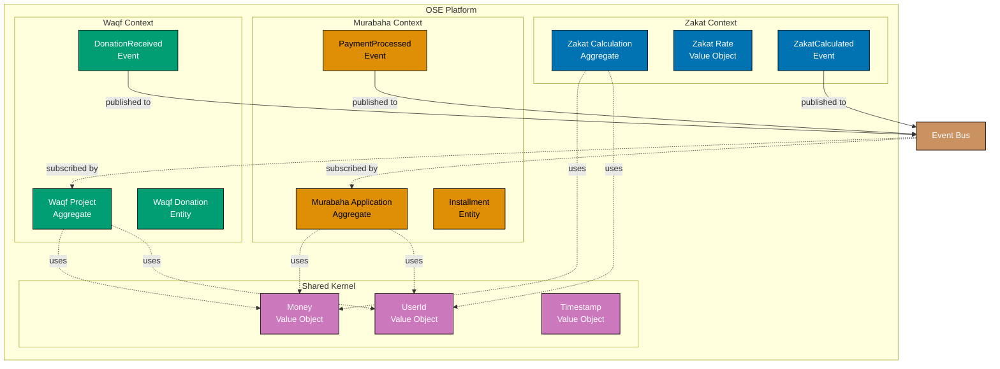

# Spring Boot Domain-Driven Design

## 📋 Quick Reference

- [Overview](#overview)
- [Value Objects](#value-objects)
- [Entities](#entities)
- [Aggregates](#aggregates)
- [Repositories](#repositories)
- [Domain Events](#domain-events)
- [Bounded Contexts](#bounded-contexts)
- [Application Services](#application-services)
- [Domain Services](#domain-services)
- [DDD Best Practices](#ddd-best-practices)
- [OSE Platform DDD Examples](#ose-platform-ddd-examples)
- [Related Documentation](#related-documentation)

## Overview

Domain-Driven Design (DDD) is a software development approach that focuses on modeling complex business domains through collaboration between technical and domain experts. Spring Boot provides excellent support for implementing DDD tactical patterns.

### Core DDD Building Blocks

1. **Value Objects** - Immutable objects defined by their attributes
2. **Entities** - Objects with identity that changes over time
3. **Aggregates** - Clusters of entities treated as a single unit
4. **Repositories** - Abstraction for accessing aggregates
5. **Domain Events** - Record of something that happened in the domain
6. **Bounded Contexts** - Explicit boundaries around domain models

### Why DDD with Spring Boot?

- **Clear Domain Model**: Business logic separated from infrastructure
- **Testability**: Pure domain logic without framework dependencies
- **Maintainability**: Changes isolated within bounded contexts
- **Ubiquitous Language**: Shared vocabulary between developers and domain experts

### DDD Layers in Spring Boot

```
┌─────────────────────────────────────┐
│   Presentation Layer (Controllers)  │
│   - REST endpoints                  │
│   - Request/Response DTOs           │
└─────────────────────────────────────┘
             ▼
┌─────────────────────────────────────┐
│   Application Layer (Services)      │
│   - Use case orchestration          │
│   - Transaction boundaries          │
│   - DTO ↔ Domain mapping           │
└─────────────────────────────────────┘
             ▼
┌─────────────────────────────────────┐
│   Domain Layer                      │
│   - Entities & Value Objects        │
│   - Aggregates                      │
│   - Domain Services                 │
│   - Domain Events                   │
└─────────────────────────────────────┘
             ▼
┌─────────────────────────────────────┐
│   Infrastructure Layer              │
│   - JPA Repositories                │
│   - External API clients            │
│   - Message publishers              │
└─────────────────────────────────────┘
```

## Value Objects

Value objects are immutable objects defined by their attributes rather than identity. In Java, use records for clean, concise value objects.

### Basic Value Object

```java
public record Money(BigDecimal amount, String currency) {

    // Compact constructor for validation
    public Money {
        if (amount == null) {
            throw new IllegalArgumentException("Amount cannot be null");
        }
        if (amount.compareTo(BigDecimal.ZERO) < 0) {
            throw new IllegalArgumentException("Amount cannot be negative");
        }
        if (currency == null || currency.isBlank()) {
            throw new IllegalArgumentException("Currency cannot be null or blank");
        }
        // Validate ISO 4217 currency code
        if (!isValidCurrencyCode(currency)) {
            throw new IllegalArgumentException("Invalid currency code: " + currency);
        }
    }

    // Business methods
    public Money add(Money other) {
        if (!this.currency.equals(other.currency)) {
            throw new IllegalArgumentException(
                "Cannot add different currencies: " + this.currency + " and " + other.currency
            );
        }
        return new Money(this.amount.add(other.amount), this.currency);
    }

    public Money subtract(Money other) {
        if (!this.currency.equals(other.currency)) {
            throw new IllegalArgumentException(
                "Cannot subtract different currencies: " + this.currency + " and " + other.currency
            );
        }
        Money result = new Money(this.amount.subtract(other.amount), this.currency);
        if (result.amount.compareTo(BigDecimal.ZERO) < 0) {
            throw new IllegalArgumentException("Subtraction would result in negative amount");
        }
        return result;
    }

    public Money multiply(BigDecimal factor) {
        if (factor.compareTo(BigDecimal.ZERO) < 0) {
            throw new IllegalArgumentException("Factor cannot be negative");
        }
        return new Money(this.amount.multiply(factor), this.currency);
    }

    public boolean isGreaterThan(Money other) {
        if (!this.currency.equals(other.currency)) {
            throw new IllegalArgumentException("Cannot compare different currencies");
        }
        return this.amount.compareTo(other.amount) > 0;
    }

    public boolean isGreaterThanOrEqual(Money other) {
        if (!this.currency.equals(other.currency)) {
            throw new IllegalArgumentException("Cannot compare different currencies");
        }
        return this.amount.compareTo(other.amount) >= 0;
    }

    public static Money zero(String currency) {
        return new Money(BigDecimal.ZERO, currency);
    }

    private static boolean isValidCurrencyCode(String code) {
        try {
            Currency.getInstance(code);
            return true;
        } catch (IllegalArgumentException e) {
            return false;
        }
    }
}
```

### Embedding Value Objects in Entities

```java
import jakarta.persistence.Embeddable;
import jakarta.persistence.Column;

@Embeddable
public class Money {

    @Column(name = "amount", nullable = false, precision = 19, scale = 4)
    private BigDecimal amount;

    @Column(name = "currency", nullable = false, length = 3)
    private String currency;

    // JPA requires no-arg constructor
    protected Money() {}

    public Money(BigDecimal amount, String currency) {
        // Validation logic...
        this.amount = amount;
        this.currency = currency;
    }

    // Getters and business methods (no setters for immutability)
    public BigDecimal getAmount() {
        return amount;
    }

    public String getCurrency() {
        return currency;
    }

    // Business methods...
}

// Usage in Entity
@Entity
@Table(name = "zakat_calculations")
public class ZakatCalculation {

    @Id
    @GeneratedValue(strategy = GenerationType.UUID)
    private String id;

    @Embedded
    @AttributeOverrides({
        @AttributeOverride(name = "amount", column = @Column(name = "wealth_amount")),
        @AttributeOverride(name = "currency", column = @Column(name = "wealth_currency"))
    })
    private Money wealth;

    @Embedded
    @AttributeOverrides({
        @AttributeOverride(name = "amount", column = @Column(name = "zakat_amount")),
        @AttributeOverride(name = "currency", column = @Column(name = "zakat_currency"))
    })
    private Money zakatAmount;

    // ...
}
```

### OSE Platform Value Objects

```java
// Zakat Rate Value Object
public record ZakatRate(BigDecimal percentage) {

    // Standard 2.5% rate
    public static final ZakatRate STANDARD = new ZakatRate(new BigDecimal("0.025"));

    public ZakatRate {
        if (percentage == null) {
            throw new IllegalArgumentException("Percentage cannot be null");
        }
        if (percentage.compareTo(BigDecimal.ZERO) < 0 || percentage.compareTo(BigDecimal.ONE) > 0) {
            throw new IllegalArgumentException("Percentage must be between 0 and 1");
        }
    }

    public Money applyTo(Money wealth) {
        return wealth.multiply(percentage);
    }
}

// Installment Value Object
public record Installment(
    int number,
    Money amount,
    LocalDate dueDate,
    InstallmentStatus status
) {

    public Installment {
        if (number <= 0) {
            throw new IllegalArgumentException("Installment number must be positive");
        }
        if (amount == null) {
            throw new IllegalArgumentException("Amount cannot be null");
        }
        if (dueDate == null) {
            throw new IllegalArgumentException("Due date cannot be null");
        }
        if (status == null) {
            throw new IllegalArgumentException("Status cannot be null");
        }
    }

    public boolean isOverdue() {
        return status == InstallmentStatus.PENDING && LocalDate.now().isAfter(dueDate);
    }

    public Installment markAsPaid() {
        return new Installment(number, amount, dueDate, InstallmentStatus.PAID);
    }
}

// Waqf Project Goal Value Object
public record WaqfGoal(Money targetAmount, LocalDate deadline) {

    public WaqfGoal {
        if (targetAmount == null) {
            throw new IllegalArgumentException("Target amount cannot be null");
        }
        if (deadline == null) {
            throw new IllegalArgumentException("Deadline cannot be null");
        }
        if (deadline.isBefore(LocalDate.now())) {
            throw new IllegalArgumentException("Deadline cannot be in the past");
        }
    }

    public BigDecimal calculateProgress(Money currentAmount) {
        if (!currentAmount.currency().equals(targetAmount.currency())) {
            throw new IllegalArgumentException("Currency mismatch");
        }
        return currentAmount.amount()
            .divide(targetAmount.amount(), 4, RoundingMode.HALF_UP)
            .multiply(new BigDecimal("100"));
    }

    public boolean isAchieved(Money currentAmount) {
        return currentAmount.isGreaterThanOrEqual(targetAmount);
    }

    public boolean isExpired() {
        return LocalDate.now().isAfter(deadline);
    }
}
```

## Entities

Entities have identity and lifecycle. Unlike value objects, two entities with the same attributes are still distinct if they have different identities.

### Entity with Identity

```java
@Entity
@Table(name = "zakat_calculations")
public class ZakatCalculation {

    @Id
    @GeneratedValue(strategy = GenerationType.UUID)
    private String id;

    @Embedded
    @AttributeOverrides({
        @AttributeOverride(name = "amount", column = @Column(name = "wealth_amount")),
        @AttributeOverride(name = "currency", column = @Column(name = "wealth_currency"))
    })
    private Money wealth;

    @Embedded
    @AttributeOverrides({
        @AttributeOverride(name = "amount", column = @Column(name = "nisab_amount")),
        @AttributeOverride(name = "currency", column = @Column(name = "nisab_currency"))
    })
    private Money nisabThreshold;

    @Embedded
    @AttributeOverrides({
        @AttributeOverride(name = "amount", column = @Column(name = "zakat_amount")),
        @AttributeOverride(name = "currency", column = @Column(name = "zakat_currency"))
    })
    private Money zakatAmount;

    @Column(name = "calculation_date", nullable = false)
    private LocalDate calculationDate;

    @Column(name = "zakat_due", nullable = false)
    private boolean zakatDue;

    @Column(name = "user_id", nullable = false)
    private String userId;

    @CreatedDate
    @Column(name = "created_at", nullable = false, updatable = false)
    private Instant createdAt;

    // JPA requires no-arg constructor
    protected ZakatCalculation() {}

    // Use factory method instead of public constructor
    private ZakatCalculation(
        Money wealth,
        Money nisabThreshold,
        Money zakatAmount,
        LocalDate calculationDate,
        boolean zakatDue,
        String userId
    ) {
        this.wealth = wealth;
        this.nisabThreshold = nisabThreshold;
        this.zakatAmount = zakatAmount;
        this.calculationDate = calculationDate;
        this.zakatDue = zakatDue;
        this.userId = userId;
    }

    // Factory method encapsulates creation logic
    public static ZakatCalculation calculate(
        Money wealth,
        Money nisabThreshold,
        String userId,
        LocalDate calculationDate
    ) {
        if (!wealth.currency().equals(nisabThreshold.currency())) {
            throw new IllegalArgumentException("Wealth and Nisab must have same currency");
        }

        boolean zakatDue = wealth.isGreaterThanOrEqual(nisabThreshold);
        Money zakatAmount = zakatDue
            ? ZakatRate.STANDARD.applyTo(wealth)
            : Money.zero(wealth.currency());

        return new ZakatCalculation(
            wealth,
            nisabThreshold,
            zakatAmount,
            calculationDate,
            zakatDue,
            userId
        );
    }

    // Business methods
    public Money calculateNewZakat(Money updatedWealth) {
        boolean newZakatDue = updatedWealth.isGreaterThanOrEqual(nisabThreshold);
        return newZakatDue ? ZakatRate.STANDARD.applyTo(updatedWealth) : Money.zero(updatedWealth.currency());
    }

    // Getters only (no setters - enforce immutability)
    public String getId() {
        return id;
    }

    public Money getWealth() {
        return wealth;
    }

    public Money getZakatAmount() {
        return zakatAmount;
    }

    public boolean isZakatDue() {
        return zakatDue;
    }

    public String getUserId() {
        return userId;
    }

    // Equals and hashCode based on ID only
    @Override
    public boolean equals(Object o) {
        if (this == o) return true;
        if (!(o instanceof ZakatCalculation that)) return false;
        return id != null && id.equals(that.id);
    }

    @Override
    public int hashCode() {
        return getClass().hashCode();
    }
}
```

### Entity Invariants

Protect entity invariants with validation:

```java
@Entity
@Table(name = "murabaha_applications")
public class MurabahaApplication {

    @Id
    @GeneratedValue(strategy = GenerationType.UUID)
    private String id;

    @Embedded
    @AttributeOverrides({
        @AttributeOverride(name = "amount", column = @Column(name = "principal_amount")),
        @AttributeOverride(name = "currency", column = @Column(name = "principal_currency"))
    })
    private Money principal;

    @Column(name = "profit_rate", nullable = false, precision = 5, scale = 4)
    private BigDecimal profitRate;

    @Column(name = "duration_months", nullable = false)
    private int durationMonths;

    @Enumerated(EnumType.STRING)
    @Column(name = "status", nullable = false)
    private ApplicationStatus status;

    @Column(name = "user_id", nullable = false)
    private String userId;

    protected MurabahaApplication() {}

    private MurabahaApplication(
        Money principal,
        BigDecimal profitRate,
        int durationMonths,
        String userId
    ) {
        // Invariant: Principal must be positive
        if (principal.amount().compareTo(BigDecimal.ZERO) <= 0) {
            throw new IllegalArgumentException("Principal must be positive");
        }

        // Invariant: Profit rate must be between 0 and 100%
        if (profitRate.compareTo(BigDecimal.ZERO) < 0 || profitRate.compareTo(BigDecimal.ONE) > 0) {
            throw new IllegalArgumentException("Profit rate must be between 0 and 1");
        }

        // Invariant: Duration must be between 1 and 360 months (30 years)
        if (durationMonths < 1 || durationMonths > 360) {
            throw new IllegalArgumentException("Duration must be between 1 and 360 months");
        }

        this.principal = principal;
        this.profitRate = profitRate;
        this.durationMonths = durationMonths;
        this.userId = userId;
        this.status = ApplicationStatus.PENDING;
    }

    public static MurabahaApplication create(
        Money principal,
        BigDecimal profitRate,
        int durationMonths,
        String userId
    ) {
        return new MurabahaApplication(principal, profitRate, durationMonths, userId);
    }

    // State transition methods
    public void approve() {
        if (status != ApplicationStatus.PENDING) {
            throw new IllegalStateException("Can only approve pending applications");
        }
        this.status = ApplicationStatus.APPROVED;
    }

    public void reject(String reason) {
        if (status != ApplicationStatus.PENDING) {
            throw new IllegalStateException("Can only reject pending applications");
        }
        this.status = ApplicationStatus.REJECTED;
    }

    public void cancel() {
        if (status == ApplicationStatus.COMPLETED || status == ApplicationStatus.CANCELLED) {
            throw new IllegalStateException("Cannot cancel completed or already cancelled applications");
        }
        this.status = ApplicationStatus.CANCELLED;
    }

    // Getters...
    public String getId() {
        return id;
    }

    public ApplicationStatus getStatus() {
        return status;
    }

    public Money getPrincipal() {
        return principal;
    }
}
```

## Aggregates

Aggregates are clusters of entities and value objects treated as a single unit. The aggregate root is the only entity accessible from outside.

### Aggregate Root with Child Entities

```java
@Entity
@Table(name = "murabaha_applications")
public class MurabahaApplication {  // Aggregate Root

    @Id
    @GeneratedValue(strategy = GenerationType.UUID)
    private String id;

    @Embedded
    private Money principal;

    @Column(name = "profit_rate", nullable = false, precision = 5, scale = 4)
    private BigDecimal profitRate;

    @Column(name = "duration_months", nullable = false)
    private int durationMonths;

    @Enumerated(EnumType.STRING)
    @Column(name = "status", nullable = false)
    private ApplicationStatus status;

    // Child entities - only accessible through aggregate root
    @OneToMany(mappedBy = "application", cascade = CascadeType.ALL, orphanRemoval = true)
    private List<MurabahaInstallment> installments = new ArrayList<>();

    protected MurabahaApplication() {}

    private MurabahaApplication(
        Money principal,
        BigDecimal profitRate,
        int durationMonths,
        String userId
    ) {
        this.principal = principal;
        this.profitRate = profitRate;
        this.durationMonths = durationMonths;
        this.status = ApplicationStatus.PENDING;
    }

    public static MurabahaApplication create(
        Money principal,
        BigDecimal profitRate,
        int durationMonths,
        String userId
    ) {
        return new MurabahaApplication(principal, profitRate, durationMonths, userId);
    }

    // Approve and generate installment schedule
    public void approve() {
        if (status != ApplicationStatus.PENDING) {
            throw new IllegalStateException("Can only approve pending applications");
        }

        this.status = ApplicationStatus.APPROVED;

        // Generate installment schedule
        Money totalAmount = calculateTotalAmount();
        Money monthlyPayment = totalAmount.divide(durationMonths);

        LocalDate dueDate = LocalDate.now().plusMonths(1);
        for (int i = 1; i <= durationMonths; i++) {
            MurabahaInstallment installment = new MurabahaInstallment(
                i,
                monthlyPayment,
                dueDate,
                this
            );
            installments.add(installment);
            dueDate = dueDate.plusMonths(1);
        }
    }

    // Pay installment - controls child entity
    public void payInstallment(int installmentNumber, Money paymentAmount) {
        if (status != ApplicationStatus.APPROVED && status != ApplicationStatus.IN_PAYMENT) {
            throw new IllegalStateException("Application must be approved to make payments");
        }

        MurabahaInstallment installment = findInstallment(installmentNumber);

        if (!paymentAmount.equals(installment.getAmount())) {
            throw new IllegalArgumentException(
                "Payment amount must match installment amount: " + installment.getAmount()
            );
        }

        installment.markAsPaid();

        // Update aggregate status
        if (status == ApplicationStatus.APPROVED) {
            this.status = ApplicationStatus.IN_PAYMENT;
        }

        // Check if all installments paid
        if (allInstallmentsPaid()) {
            this.status = ApplicationStatus.COMPLETED;
        }
    }

    // Private helper methods
    private Money calculateTotalAmount() {
        Money profit = principal.multiply(profitRate);
        return principal.add(profit);
    }

    private MurabahaInstallment findInstallment(int number) {
        return installments.stream()
            .filter(i -> i.getNumber() == number)
            .findFirst()
            .orElseThrow(() -> new IllegalArgumentException("Installment not found: " + number));
    }

    private boolean allInstallmentsPaid() {
        return installments.stream().allMatch(MurabahaInstallment::isPaid);
    }

    // Getters - child entities not exposed directly
    public String getId() {
        return id;
    }

    public ApplicationStatus getStatus() {
        return status;
    }

    public Money getPrincipal() {
        return principal;
    }

    // Read-only view of installments
    public List<InstallmentView> getInstallments() {
        return installments.stream()
            .map(i -> new InstallmentView(
                i.getNumber(),
                i.getAmount(),
                i.getDueDate(),
                i.getStatus()
            ))
            .toList();
    }
}

// Child entity - not directly accessible
@Entity
@Table(name = "murabaha_installments")
class MurabahaInstallment {

    @Id
    @GeneratedValue(strategy = GenerationType.UUID)
    private String id;

    @Column(name = "installment_number", nullable = false)
    private int number;

    @Embedded
    @AttributeOverrides({
        @AttributeOverride(name = "amount", column = @Column(name = "installment_amount")),
        @AttributeOverride(name = "currency", column = @Column(name = "installment_currency"))
    })
    private Money amount;

    @Column(name = "due_date", nullable = false)
    private LocalDate dueDate;

    @Enumerated(EnumType.STRING)
    @Column(name = "status", nullable = false)
    private InstallmentStatus status;

    @ManyToOne(fetch = FetchType.LAZY)
    @JoinColumn(name = "application_id", nullable = false)
    private MurabahaApplication application;

    protected MurabahaInstallment() {}

    MurabahaInstallment(int number, Money amount, LocalDate dueDate, MurabahaApplication application) {
        this.number = number;
        this.amount = amount;
        this.dueDate = dueDate;
        this.status = InstallmentStatus.PENDING;
        this.application = application;
    }

    void markAsPaid() {
        if (status == InstallmentStatus.PAID) {
            throw new IllegalStateException("Installment already paid");
        }
        this.status = InstallmentStatus.PAID;
    }

    // Package-private getters for aggregate root
    int getNumber() {
        return number;
    }

    Money getAmount() {
        return amount;
    }

    LocalDate getDueDate() {
        return dueDate;
    }

    InstallmentStatus getStatus() {
        return status;
    }

    boolean isPaid() {
        return status == InstallmentStatus.PAID;
    }
}

// Read-only view for exposing child entity data
public record InstallmentView(
    int number,
    Money amount,
    LocalDate dueDate,
    InstallmentStatus status
) {}
```

### Aggregate Consistency Boundaries

```java
// ✅ GOOD - Operations within aggregate boundary
public void payInstallment(int installmentNumber, Money paymentAmount) {
    // All operations on aggregate and its children within transaction
    MurabahaInstallment installment = findInstallment(installmentNumber);
    installment.markAsPaid();

    // Update aggregate state
    if (allInstallmentsPaid()) {
        this.status = ApplicationStatus.COMPLETED;
    }
}

// ❌ BAD - Modifying child entity directly breaks encapsulation
// Client code should NEVER do this:
MurabahaInstallment installment = installmentRepository.findById(id);
installment.markAsPaid();  // ❌ Bypasses aggregate root

// ✅ GOOD - Always go through aggregate root:
MurabahaApplication application = applicationRepository.findById(appId);
application.payInstallment(installmentNumber, paymentAmount);
```

## Repositories

Repositories provide collection-like interface for accessing aggregates.

### Repository Pattern

```java
// Repository interface - domain layer
public interface ZakatCalculationRepository extends JpaRepository<ZakatCalculation, String> {

    // Query methods using domain language
    List<ZakatCalculation> findByUserId(String userId);

    List<ZakatCalculation> findByUserIdAndZakatDue(String userId, boolean zakatDue);

    Optional<ZakatCalculation> findByUserIdAndCalculationDate(String userId, LocalDate date);

    @Query("SELECT z FROM ZakatCalculation z WHERE z.userId = :userId " +
           "AND z.calculationDate BETWEEN :startDate AND :endDate")
    List<ZakatCalculation> findByUserIdAndDateRange(
        @Param("userId") String userId,
        @Param("startDate") LocalDate startDate,
        @Param("endDate") LocalDate endDate
    );

    // Aggregate queries
    @Query("SELECT SUM(z.zakatAmount.amount) FROM ZakatCalculation z " +
           "WHERE z.userId = :userId AND z.zakatDue = true")
    BigDecimal sumZakatAmountByUser(@Param("userId") String userId);
}

// Usage in application service
@Service
@Transactional
public class ZakatCalculationService {

    private final ZakatCalculationRepository repository;

    public ZakatCalculationService(ZakatCalculationRepository repository) {
        this.repository = repository;
    }

    public ZakatCalculationResponse calculate(CreateZakatRequest request, String userId) {
        // Business logic
        ZakatCalculation calculation = ZakatCalculation.calculate(
            new Money(request.wealth(), request.currency()),
            new Money(request.nisabThreshold(), request.currency()),
            userId,
            LocalDate.now()
        );

        // Persist aggregate
        ZakatCalculation saved = repository.save(calculation);

        return ZakatCalculationMapper.toResponse(saved);
    }

    public List<ZakatCalculationResponse> findUserCalculations(String userId) {
        return repository.findByUserId(userId).stream()
            .map(ZakatCalculationMapper::toResponse)
            .toList();
    }
}
```

### Specification Pattern for Complex Queries

```java
import org.springframework.data.jpa.domain.Specification;

public class MurabahaApplicationSpecifications {

    public static Specification<MurabahaApplication> hasStatus(ApplicationStatus status) {
        return (root, query, cb) -> cb.equal(root.get("status"), status);
    }

    public static Specification<MurabahaApplication> hasUserId(String userId) {
        return (root, query, cb) -> cb.equal(root.get("userId"), userId);
    }

    public static Specification<MurabahaApplication> principalGreaterThan(BigDecimal amount) {
        return (root, query, cb) -> cb.greaterThan(root.get("principal").get("amount"), amount);
    }

    public static Specification<MurabahaApplication> createdBetween(Instant start, Instant end) {
        return (root, query, cb) -> cb.between(root.get("createdAt"), start, end);
    }
}

// Repository with Specification support
public interface MurabahaApplicationRepository
        extends JpaRepository<MurabahaApplication, String>,
                JpaSpecificationExecutor<MurabahaApplication> {
}

// Usage
@Service
public class MurabahaApplicationService {

    private final MurabahaApplicationRepository repository;

    public List<MurabahaApplicationResponse> findApplications(
        String userId,
        ApplicationStatus status,
        BigDecimal minPrincipal
    ) {
        Specification<MurabahaApplication> spec = Specification
            .where(MurabahaApplicationSpecifications.hasUserId(userId))
            .and(MurabahaApplicationSpecifications.hasStatus(status))
            .and(MurabahaApplicationSpecifications.principalGreaterThan(minPrincipal));

        return repository.findAll(spec).stream()
            .map(MurabahaApplicationMapper::toResponse)
            .toList();
    }
}
```

## Domain Events

Domain events capture something significant that happened in the domain.

### Publishing Domain Events

```java
// Domain event
public record ZakatCalculatedEvent(
    String calculationId,
    String userId,
    Money zakatAmount,
    LocalDate calculationDate,
    Instant occurredAt
) {
    public ZakatCalculatedEvent(
        String calculationId,
        String userId,
        Money zakatAmount,
        LocalDate calculationDate
    ) {
        this(calculationId, userId, zakatAmount, calculationDate, Instant.now());
    }
}

// Aggregate publishes event
@Entity
@Table(name = "zakat_calculations")
public class ZakatCalculation {

    @Id
    @GeneratedValue(strategy = GenerationType.UUID)
    private String id;

    @Embedded
    private Money zakatAmount;

    @Transient  // Not persisted
    private final List<Object> domainEvents = new ArrayList<>();

    // Factory method
    public static ZakatCalculation calculate(
        Money wealth,
        Money nisabThreshold,
        String userId,
        LocalDate calculationDate
    ) {
        ZakatCalculation calculation = new ZakatCalculation(/*...*/);

        // Register domain event
        calculation.registerEvent(new ZakatCalculatedEvent(
            calculation.getId(),
            userId,
            calculation.getZakatAmount(),
            calculationDate
        ));

        return calculation;
    }

    private void registerEvent(Object event) {
        domainEvents.add(event);
    }

    public List<Object> getDomainEvents() {
        return List.copyOf(domainEvents);
    }

    public void clearDomainEvents() {
        domainEvents.clear();
    }
}

// Application service publishes events
@Service
@Transactional
public class ZakatCalculationService {

    private final ZakatCalculationRepository repository;
    private final ApplicationEventPublisher eventPublisher;

    public ZakatCalculationService(
        ZakatCalculationRepository repository,
        ApplicationEventPublisher eventPublisher
    ) {
        this.repository = repository;
        this.eventPublisher = eventPublisher;
    }

    public ZakatCalculationResponse calculate(CreateZakatRequest request, String userId) {
        ZakatCalculation calculation = ZakatCalculation.calculate(/*...*/);

        // Persist
        ZakatCalculation saved = repository.save(calculation);

        // Publish domain events
        saved.getDomainEvents().forEach(eventPublisher::publishEvent);
        saved.clearDomainEvents();

        return ZakatCalculationMapper.toResponse(saved);
    }
}
```

### Handling Domain Events

```java
// Synchronous event handler (same transaction)
@Component
public class ZakatCalculationEventHandler {

    private final NotificationService notificationService;
    private final AuditLogRepository auditLogRepository;

    @EventListener
    @Transactional(propagation = Propagation.MANDATORY)  // Must be in transaction
    public void handleZakatCalculated(ZakatCalculatedEvent event) {
        // Log calculation for audit
        AuditLog log = new AuditLog(
            "ZAKAT_CALCULATED",
            event.userId(),
            "Zakat calculated: " + event.zakatAmount(),
            event.occurredAt()
        );
        auditLogRepository.save(log);
    }
}

// Asynchronous event handler (separate transaction)
@Component
public class ZakatNotificationHandler {

    private final NotificationService notificationService;

    @Async
    @EventListener
    @Transactional(propagation = Propagation.REQUIRES_NEW)  // New transaction
    public void sendZakatCalculationNotification(ZakatCalculatedEvent event) {
        // Send email notification
        notificationService.sendEmail(
            event.userId(),
            "Zakat Calculation Complete",
            "Your zakat calculation is complete. Amount: " + event.zakatAmount()
        );
    }
}
```

### OSE Platform Domain Events

```java
// Murabaha payment event
public record PaymentProcessedEvent(
    String applicationId,
    int installmentNumber,
    Money paymentAmount,
    String userId,
    Instant processedAt
) {}

// Waqf donation event
public record DonationReceivedEvent(
    String donationId,
    String projectId,
    Money donationAmount,
    String donorId,
    Instant receivedAt
) {}

// Event handler example - Update project progress
@Component
public class WaqfProjectEventHandler {

    private final WaqfProjectRepository projectRepository;

    @EventListener
    @Transactional(propagation = Propagation.MANDATORY)
    public void updateProjectProgress(DonationReceivedEvent event) {
        WaqfProject project = projectRepository.findById(event.projectId())
            .orElseThrow(() -> new ResourceNotFoundException("Project not found"));

        project.addDonation(event.donationAmount());

        if (project.isGoalAchieved()) {
            // Publish another event
            projectRepository.save(project);
        }
    }
}
```

## Bounded Contexts

Bounded contexts define explicit boundaries around domain models.

### OSE Platform Bounded Contexts



**Context Boundaries**:

- **Blue (Zakat Context)**: Manages obligatory charity calculations
- **Orange (Murabaha Context)**: Handles Islamic financing applications
- **Teal (Waqf Context)**: Manages charitable endowment projects
- **Purple (Shared Kernel)**: Common value objects used across contexts
- **Brown (Event Bus)**: Domain events for inter-context communication

**Key Principles**:

1. **Explicit Boundaries**: Each context has its own domain model
2. **Shared Kernel**: Common value objects prevent duplication
3. **Event-Driven**: Contexts communicate via domain events
4. **Autonomy**: Each context can evolve independently

### Package Structure for Bounded Contexts

```
src/main/java/com/example/ose/
├── zakat/                          # Zakat bounded context
│   ├── domain/
│   │   ├── model/
│   │   │   ├── ZakatCalculation.java
│   │   │   ├── Money.java
│   │   │   └── ZakatRate.java
│   │   ├── repository/
│   │   │   └── ZakatCalculationRepository.java
│   │   └── event/
│   │       └── ZakatCalculatedEvent.java
│   ├── application/
│   │   ├── ZakatCalculationService.java
│   │   └── dto/
│   │       ├── CreateZakatRequest.java
│   │       └── ZakatCalculationResponse.java
│   └── infrastructure/
│       ├── persistence/
│       │   └── JpaZakatCalculationRepository.java
│       └── web/
│           └── ZakatCalculationController.java
│
├── murabaha/                       # Murabaha bounded context
│   ├── domain/
│   │   ├── model/
│   │   │   ├── MurabahaApplication.java
│   │   │   ├── MurabahaInstallment.java
│   │   │   └── Installment.java
│   │   ├── repository/
│   │   │   └── MurabahaApplicationRepository.java
│   │   └── event/
│   │       ├── ApplicationApprovedEvent.java
│   │       └── PaymentProcessedEvent.java
│   ├── application/
│   │   ├── MurabahaApplicationService.java
│   │   └── dto/
│   │       ├── CreateApplicationRequest.java
│   │       └── ApplicationResponse.java
│   └── infrastructure/
│       └── web/
│           └── MurabahaApplicationController.java
│
└── waqf/                           # Waqf bounded context
    ├── domain/
    │   ├── model/
    │   │   ├── WaqfProject.java
    │   │   ├── WaqfDonation.java
    │   │   └── WaqfGoal.java
    │   ├── repository/
    │   │   ├── WaqfProjectRepository.java
    │   │   └── WaqfDonationRepository.java
    │   └── event/
    │       └── DonationReceivedEvent.java
    ├── application/
    │   ├── WaqfProjectService.java
    │   └── dto/
    │       ├── CreateProjectRequest.java
    │       └── ProjectResponse.java
    └── infrastructure/
        └── web/
            └── WaqfProjectController.java
```

### Shared Kernel

Value objects shared across bounded contexts:

```java
// shared/domain/value/
public record Money(BigDecimal amount, String currency) {
    // Shared by all contexts
}

public record UserId(String value) {
    // Shared identity type
}
```

### Context Mapping

```java
// Anti-Corruption Layer - Translates between contexts
@Component
public class MurabahaToZakatAdapter {

    private final ZakatCalculationService zakatService;

    // Convert Murabaha domain concepts to Zakat domain
    public ZakatCalculationResponse calculateZakatOnProfit(
        MurabahaApplication application
    ) {
        // Calculate profit
        Money profit = application.calculateProfit();

        // Translate to Zakat context
        CreateZakatRequest request = new CreateZakatRequest(
            profit.amount(),
            profit.currency(),
            Money.zero(profit.currency()).amount(),  // No nisab for profit
            LocalDate.now()
        );

        return zakatService.calculate(request, application.getUserId());
    }
}
```

## Application Services

Application services orchestrate use cases and coordinate domain objects.

### Application Service Pattern

```java
@Service
@Transactional
public class ZakatCalculationService {

    private final ZakatCalculationRepository calculationRepository;
    private final NisabThresholdService nisabService;
    private final ApplicationEventPublisher eventPublisher;

    public ZakatCalculationService(
        ZakatCalculationRepository calculationRepository,
        NisabThresholdService nisabService,
        ApplicationEventPublisher eventPublisher
    ) {
        this.calculationRepository = calculationRepository;
        this.nisabService = nisabService;
        this.eventPublisher = eventPublisher;
    }

    // Use case: Calculate Zakat
    public ZakatCalculationResponse calculate(CreateZakatRequest request, String userId) {
        // 1. Get nisab threshold (infrastructure concern)
        Money nisabThreshold = nisabService.getCurrentNisab(request.currency());

        // 2. Execute domain logic
        ZakatCalculation calculation = ZakatCalculation.calculate(
            new Money(request.wealth(), request.currency()),
            nisabThreshold,
            userId,
            request.calculationDate()
        );

        // 3. Persist aggregate
        ZakatCalculation saved = calculationRepository.save(calculation);

        // 4. Publish domain events
        saved.getDomainEvents().forEach(eventPublisher::publishEvent);
        saved.clearDomainEvents();

        // 5. Map to DTO
        return ZakatCalculationMapper.toResponse(saved);
    }

    // Use case: Get user calculations
    @Transactional(readOnly = true)
    public List<ZakatCalculationResponse> getUserCalculations(String userId) {
        return calculationRepository.findByUserId(userId).stream()
            .map(ZakatCalculationMapper::toResponse)
            .toList();
    }

    // Use case: Get annual zakat summary
    @Transactional(readOnly = true)
    public AnnualZakatSummary getAnnualSummary(String userId, int year) {
        LocalDate startDate = LocalDate.of(year, 1, 1);
        LocalDate endDate = LocalDate.of(year, 12, 31);

        List<ZakatCalculation> calculations = calculationRepository
            .findByUserIdAndDateRange(userId, startDate, endDate);

        BigDecimal totalZakat = calculations.stream()
            .filter(ZakatCalculation::isZakatDue)
            .map(c -> c.getZakatAmount().amount())
            .reduce(BigDecimal.ZERO, BigDecimal::add);

        return new AnnualZakatSummary(
            year,
            calculations.size(),
            new Money(totalZakat, calculations.get(0).getZakatAmount().currency())
        );
    }
}
```

## Domain Services

Domain services encapsulate domain logic that doesn't naturally fit in entities or value objects.

### Domain Service Pattern

```java
// Domain service for complex calculation
@Component
public class InstallmentScheduleCalculator {

    public List<Installment> calculateSchedule(
        Money principal,
        BigDecimal profitRate,
        int durationMonths
    ) {
        // Calculate total amount (principal + profit)
        Money profit = principal.multiply(profitRate);
        Money totalAmount = principal.add(profit);

        // Calculate monthly payment
        BigDecimal monthlyAmount = totalAmount.amount()
            .divide(new BigDecimal(durationMonths), 2, RoundingMode.HALF_UP);
        Money monthlyPayment = new Money(monthlyAmount, totalAmount.currency());

        // Generate schedule
        List<Installment> schedule = new ArrayList<>();
        LocalDate dueDate = LocalDate.now().plusMonths(1);

        for (int i = 1; i <= durationMonths; i++) {
            Installment installment = new Installment(
                i,
                monthlyPayment,
                dueDate,
                InstallmentStatus.PENDING
            );
            schedule.add(installment);
            dueDate = dueDate.plusMonths(1);
        }

        return schedule;
    }
}

// Usage in aggregate
@Entity
public class MurabahaApplication {

    public void approve(InstallmentScheduleCalculator calculator) {
        if (status != ApplicationStatus.PENDING) {
            throw new IllegalStateException("Can only approve pending applications");
        }

        this.status = ApplicationStatus.APPROVED;

        // Use domain service
        List<Installment> schedule = calculator.calculateSchedule(
            principal,
            profitRate,
            durationMonths
        );

        // Convert to installment entities
        for (Installment installment : schedule) {
            MurabahaInstallment entity = new MurabahaInstallment(
                installment.number(),
                installment.amount(),
                installment.dueDate(),
                this
            );
            installments.add(entity);
        }
    }
}
```

## DDD Best Practices

### 1. Always Access Aggregates Through Repository

```java
// ✅ GOOD - Access aggregate through repository
MurabahaApplication application = applicationRepository.findById(id)
    .orElseThrow(() -> new ResourceNotFoundException("Application not found"));
application.payInstallment(1, paymentAmount);
applicationRepository.save(application);

// ❌ BAD - Accessing child entity directly
MurabahaInstallment installment = installmentRepository.findById(installmentId);
installment.markAsPaid();  // ❌ Breaks aggregate boundary
```

### 2. Keep Aggregates Small

```java
// ✅ GOOD - Small focused aggregate
@Entity
public class ZakatCalculation {
    @Id
    private String id;

    @Embedded
    private Money wealth;

    @Embedded
    private Money zakatAmount;

    // No child entities - simple aggregate
}

// ⚠️  CAREFUL - Large aggregate with many children
@Entity
public class User {
    @Id
    private String id;

    @OneToMany(mappedBy = "user", cascade = CascadeType.ALL)
    private List<ZakatCalculation> calculations;  // Could be hundreds

    @OneToMany(mappedBy = "user", cascade = CascadeType.ALL)
    private List<MurabahaApplication> applications;  // Could be hundreds

    // ❌ Too large - consider separate aggregates
}
```

### 3. Use Value Objects for Concepts Without Identity

```java
// ✅ GOOD - Money as value object (no identity needed)
public record Money(BigDecimal amount, String currency) {}

// ❌ BAD - Money as entity (unnecessary identity)
@Entity
public class Money {
    @Id
    @GeneratedValue
    private Long id;  // ❌ Money doesn't need identity

    private BigDecimal amount;
    private String currency;
}
```

### 4. Protect Invariants in Aggregates

```java
// ✅ GOOD - Invariant protected
public class MurabahaApplication {

    public void payInstallment(int number, Money amount) {
        if (status != ApplicationStatus.APPROVED && status != ApplicationStatus.IN_PAYMENT) {
            throw new IllegalStateException("Application must be approved");  // ✅ Invariant check
        }

        MurabahaInstallment installment = findInstallment(number);
        installment.markAsPaid();

        // ✅ Update aggregate state consistently
        if (allInstallmentsPaid()) {
            this.status = ApplicationStatus.COMPLETED;
        }
    }
}
```

### 5. Use Factory Methods for Complex Creation

```java
// ✅ GOOD - Factory method encapsulates creation logic
public static ZakatCalculation calculate(
    Money wealth,
    Money nisabThreshold,
    String userId,
    LocalDate calculationDate
) {
    if (!wealth.currency().equals(nisabThreshold.currency())) {
        throw new IllegalArgumentException("Currency mismatch");
    }

    boolean zakatDue = wealth.isGreaterThanOrEqual(nisabThreshold);
    Money zakatAmount = zakatDue
        ? ZakatRate.STANDARD.applyTo(wealth)
        : Money.zero(wealth.currency());

    return new ZakatCalculation(wealth, nisabThreshold, zakatAmount, calculationDate, zakatDue, userId);
}

// ❌ BAD - Public constructor with complex logic
public ZakatCalculation(
    Money wealth,
    Money nisabThreshold,
    String userId,
    LocalDate calculationDate
) {
    // Complex logic in constructor - hard to test
    this.zakatDue = wealth.isGreaterThanOrEqual(nisabThreshold);
    this.zakatAmount = zakatDue ? wealth.multiply(new BigDecimal("0.025")) : Money.zero(wealth.currency());
}
```

### Production DDD Checklist

Before deploying:

- [ ] All domain logic in domain layer (entities, value objects, domain services)
- [ ] Aggregates have clear boundaries and enforce invariants
- [ ] Repositories only return aggregate roots
- [ ] Child entities not accessible outside aggregate
- [ ] Value objects are immutable (use records where possible)
- [ ] Factory methods used for complex object creation
- [ ] Domain events published for significant business events
- [ ] Application services coordinate but don't contain business logic
- [ ] Bounded contexts clearly defined with explicit boundaries
- [ ] Ubiquitous language used consistently in code and documentation

## OSE Platform DDD Examples

### Complete Zakat Context

```java
// Value Object
public record Money(BigDecimal amount, String currency) {
    // Validation and business methods...
}

// Entity
@Entity
@Table(name = "zakat_calculations")
public class ZakatCalculation {

    @Id
    @GeneratedValue(strategy = GenerationType.UUID)
    private String id;

    @Embedded
    private Money wealth;

    @Embedded
    private Money zakatAmount;

    @Column(name = "zakat_due")
    private boolean zakatDue;

    @Column(name = "user_id")
    private String userId;

    public static ZakatCalculation calculate(
        Money wealth,
        Money nisabThreshold,
        String userId,
        LocalDate date
    ) {
        boolean zakatDue = wealth.isGreaterThanOrEqual(nisabThreshold);
        Money zakatAmount = zakatDue
            ? ZakatRate.STANDARD.applyTo(wealth)
            : Money.zero(wealth.currency());

        return new ZakatCalculation(wealth, zakatAmount, zakatDue, userId);
    }

    // Getters...
}

// Repository
public interface ZakatCalculationRepository extends JpaRepository<ZakatCalculation, String> {
    List<ZakatCalculation> findByUserId(String userId);
}

// Application Service
@Service
@Transactional
public class ZakatCalculationService {

    private final ZakatCalculationRepository repository;
    private final NisabThresholdService nisabService;

    public ZakatCalculationResponse calculate(CreateZakatRequest request, String userId) {
        Money nisab = nisabService.getCurrentNisab(request.currency());

        ZakatCalculation calculation = ZakatCalculation.calculate(
            new Money(request.wealth(), request.currency()),
            nisab,
            userId,
            LocalDate.now()
        );

        ZakatCalculation saved = repository.save(calculation);
        return ZakatCalculationMapper.toResponse(saved);
    }
}
```

### Complete Murabaha Context with Aggregate

```java
// Aggregate Root
@Entity
@Table(name = "murabaha_applications")
public class MurabahaApplication {

    @Id
    @GeneratedValue(strategy = GenerationType.UUID)
    private String id;

    @Embedded
    private Money principal;

    @Column(name = "profit_rate")
    private BigDecimal profitRate;

    @Column(name = "duration_months")
    private int durationMonths;

    @Enumerated(EnumType.STRING)
    private ApplicationStatus status;

    @OneToMany(mappedBy = "application", cascade = CascadeType.ALL, orphanRemoval = true)
    private List<MurabahaInstallment> installments = new ArrayList<>();

    public static MurabahaApplication create(
        Money principal,
        BigDecimal profitRate,
        int durationMonths,
        String userId
    ) {
        return new MurabahaApplication(principal, profitRate, durationMonths);
    }

    public void approve(InstallmentScheduleCalculator calculator) {
        if (status != ApplicationStatus.PENDING) {
            throw new IllegalStateException("Can only approve pending applications");
        }

        this.status = ApplicationStatus.APPROVED;

        List<Installment> schedule = calculator.calculateSchedule(
            principal,
            profitRate,
            durationMonths
        );

        for (Installment installment : schedule) {
            MurabahaInstallment entity = new MurabahaInstallment(
                installment.number(),
                installment.amount(),
                installment.dueDate(),
                this
            );
            installments.add(entity);
        }
    }

    public void payInstallment(int number, Money amount) {
        // Business logic...
    }
}

// Application Service
@Service
@Transactional
public class MurabahaApplicationService {

    private final MurabahaApplicationRepository repository;
    private final InstallmentScheduleCalculator scheduleCalculator;

    public ApplicationResponse approve(String applicationId) {
        MurabahaApplication application = repository.findById(applicationId)
            .orElseThrow(() -> new ResourceNotFoundException("Application not found"));

        application.approve(scheduleCalculator);

        MurabahaApplication saved = repository.save(application);
        return MurabahaApplicationMapper.toResponse(saved);
    }

    public PaymentResponse payInstallment(
        String applicationId,
        int installmentNumber,
        PaymentRequest request
    ) {
        MurabahaApplication application = repository.findById(applicationId)
            .orElseThrow(() -> new ResourceNotFoundException("Application not found"));

        Money paymentAmount = new Money(request.amount(), request.currency());
        application.payInstallment(installmentNumber, paymentAmount);

        repository.save(application);

        return new PaymentResponse(applicationId, installmentNumber, "PAID");
    }
}
```

## 🔗 Related Documentation

- [Spring Boot Best Practices](./ex-soen-plwe-jvspbo__best-practices.md) - Production patterns
- [Data Access](./ex-soen-plwe-jvspbo__data-access.md) - JPA and repository patterns
- [Functional Programming](./ex-soen-plwe-jvspbo__functional-programming.md) - Immutability and pure functions
- [Spring Boot Idioms](./ex-soen-plwe-jvspbo__idioms.md) - Framework patterns

---

**Next Steps:**

- Review [Dependency Injection](./ex-soen-plwe-jvspbo__dependency-injection.md) for managing domain services
- Explore [Testing](./ex-soen-plwe-jvspbo__testing.md) for testing DDD components
- Check [Performance](./ex-soen-plwe-jvspbo__performance.md) for aggregate optimization

**Last Updated**: 2026-01-26
