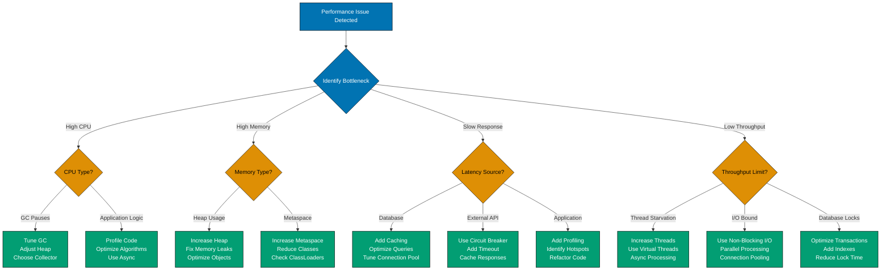

# Spring Boot Performance

## 📋 Quick Reference

- [JVM Performance Tuning](#jvm-performance-tuning) - Heap sizing, GC selection, JVM flags
- [Application Profiling](#application-profiling) - JFR, VisualVM, metrics
- [Caching Strategies](#caching-strategies) - Caffeine, Redis, eviction policies
- [Async Processing](#async-processing) - @Async, CompletableFuture, virtual threads
- [Database Performance](#database-performance) - Connection pooling, query optimization, N+1 prevention
- [HTTP Performance](#http-performance) - Response compression, HTTP/2, connection tuning
- [OSE Platform Examples](#ose-platform-examples) - Real-world performance patterns
- [Performance Checklist](#performance-checklist) - Production optimization checklist
- [Related Documentation](#related-documentation)

## Overview

Performance optimization is critical for production Spring Boot applications. This guide covers JVM tuning, application profiling, caching strategies, async processing patterns, database optimization, and HTTP performance tuning.

**Spring Boot Version**: 3.x
**Java Version**: 17+ (21+ for Virtual Threads)

**Key Performance Areas**:

- **JVM Tuning**: Heap sizing, garbage collection, JVM flags
- **Application Profiling**: JFR, VisualVM, metrics collection
- **Caching**: Local (Caffeine) and distributed (Redis) caching
- **Async Processing**: Non-blocking operations, virtual threads
- **Database**: Connection pooling, query optimization, indexing
- **HTTP**: Compression, HTTP/2, connection reuse

### Performance Optimization Decision Tree



**Optimization Strategy**:

1. **Identify**: Use profiling tools (JFR, VisualVM, Actuator metrics)
2. **Measure**: Establish baseline metrics before optimization
3. **Optimize**: Apply targeted solution from decision tree
4. **Verify**: Measure again to confirm improvement
5. **Document**: Record what worked for future reference

## JVM Performance Tuning

### Heap Sizing

**Problem**: Default heap size may not match application needs.

**Solution**: Configure heap size based on actual memory usage and GC patterns.

```properties
# application.properties - JVM heap configuration
# Set via JAVA_TOOL_OPTIONS or command line

# Initial heap size (start with 25% of max heap)
-Xms2g

# Maximum heap size (based on available memory and container limits)
-Xmx8g

# Metaspace (for class metadata, adjust based on class count)
-XX:MetaspaceSize=256m
-XX:MaxMetaspaceSize=512m
```

**Kubernetes Deployment**:

```yaml
# deployment.yaml
apiVersion: apps/v1
kind: Deployment
metadata:
  name: zakat-service
spec:
  template:
    spec:
      containers:
        - name: zakat-service
          image: zakat-service:latest
          resources:
            requests:
              memory: "2Gi"
              cpu: "500m"
            limits:
              memory: "8Gi"
              cpu: "2000m"
          env:
            - name: JAVA_TOOL_OPTIONS
              value: >-
                -Xms2g
                -Xmx6g
                -XX:MaxMetaspaceSize=512m
                -XX:+UseZGC
                -XX:+ZGenerational
```

**Best Practices**:

- Set `-Xms` to 25-50% of `-Xmx` for predictable startup
- Leave 25% of container memory for non-heap (off-heap, OS, buffers)
- Monitor actual heap usage before tuning

### Garbage Collection Selection

**G1GC (Default in Java 17+)**:

```properties
# G1GC - Good balance for most applications
-XX:+UseG1GC
-XX:MaxGCPauseMillis=200
-XX:G1HeapRegionSize=16m
-XX:InitiatingHeapOccupancyPercent=45
```

**ZGC (Low-Latency, Java 21+)**:

```properties
# ZGC - Sub-millisecond pauses, requires Java 21+
-XX:+UseZGC
-XX:+ZGenerational
```

**Shenandoah GC (Alternative Low-Latency)**:

```properties
# Shenandoah - Low-latency alternative to ZGC
-XX:+UseShenandoahGC
-XX:ShenandoahGCHeuristics=adaptive
```

**When to Use Each**:

- **G1GC**: Default choice, good for most workloads (heap < 32GB)
- **ZGC**: Low-latency requirements (P99 < 10ms), large heaps (8GB+)
- **Shenandoah**: Low-latency alternative, more tuning options

### JVM Flags for Production

```properties
# application.properties - Production JVM flags

# GC Logging (essential for troubleshooting)
-Xlog:gc*:file=/var/log/gc.log:time,uptime,level,tags:filecount=5,filesize=10M

# Crash dumps
-XX:+HeapDumpOnOutOfMemoryError
-XX:HeapDumpPath=/var/log/heapdump.hprof

# Performance flags
-XX:+UseStringDeduplication
-XX:+OptimizeStringConcat
-XX:+UseCompressedOops
-XX:+UseCompressedClassPointers

# Container awareness (automatically detects limits)
-XX:+UseContainerSupport
-XX:MaxRAMPercentage=75.0
```

## Application Profiling

### Java Flight Recorder (JFR)

**Enable JFR** (no performance overhead in production):

```properties
# application.properties
-XX:StartFlightRecording=disk=true,dumponexit=true,filename=/var/log/recording.jfr
```

**Start JFR via JMX**:

```java
@Component
@Slf4j
public class JfrController {

    @PostMapping("/admin/jfr/start")
    public ResponseEntity<String> startRecording() {
        try {
            ProcessBuilder pb = new ProcessBuilder(
                "jcmd",
                String.valueOf(ProcessHandle.current().pid()),
                "JFR.start",
                "name=production-recording",
                "duration=60s",
                "filename=/tmp/recording.jfr"
            );
            Process process = pb.start();
            int exitCode = process.waitFor();

            if (exitCode == 0) {
                log.info("JFR recording started");
                return ResponseEntity.ok("Recording started");
            } else {
                log.error("Failed to start JFR recording");
                return ResponseEntity.status(500).body("Failed to start recording");
            }
        } catch (Exception ex) {
            log.error("Error starting JFR", ex);
            return ResponseEntity.status(500).body("Error: " + ex.getMessage());
        }
    }
}
```

### Spring Boot Actuator Profiling

```java
@Configuration
public class MetricsConfig {

    @Bean
    public TimedAspect timedAspect(MeterRegistry registry) {
        return new TimedAspect(registry);
    }

    @Bean
    public MeterRegistryCustomizer<MeterRegistry> metricsCommonTags() {
        return registry -> registry.config()
            .commonTags(
                "application", "zakat-service",
                "environment", "production"
            );
    }
}

@Service
@Slf4j
public class ZakatCalculationService {

    private final MeterRegistry meterRegistry;

    @Timed(value = "zakat.calculation", percentiles = {0.5, 0.95, 0.99})
    public ZakatCalculationResponse calculate(CreateZakatRequest request) {
        Timer.Sample sample = Timer.start(meterRegistry);

        try {
            // Business logic
            ZakatCalculation result = performCalculation(request);

            sample.stop(Timer.builder("zakat.calculation.success")
                .tag("currency", request.currency())
                .register(meterRegistry));

            return toResponse(result);
        } catch (Exception ex) {
            sample.stop(Timer.builder("zakat.calculation.error")
                .tag("error", ex.getClass().getSimpleName())
                .register(meterRegistry));
            throw ex;
        }
    }
}
```

## Caching Strategies

### Caffeine (Local Cache)

**Configuration**:

```java
@Configuration
@EnableCaching
public class CacheConfig {

    @Bean
    public CacheManager cacheManager() {
        CaffeineCacheManager cacheManager = new CaffeineCacheManager(
            "nisabRates",
            "exchangeRates",
            "zakatCalculations"
        );

        cacheManager.setCaffeine(Caffeine.newBuilder()
            .maximumSize(10_000)
            .expireAfterWrite(Duration.ofMinutes(30))
            .recordStats()
        );

        return cacheManager;
    }

    @Bean
    public CacheMetricsRegistrar cacheMetricsRegistrar(
        CacheManager cacheManager,
        MeterRegistry meterRegistry
    ) {
        CaffeineCacheManager caffeineCacheManager = (CaffeineCacheManager) cacheManager;

        caffeineCacheManager.getCacheNames().forEach(cacheName -> {
            Cache cache = caffeineCacheManager.getCache(cacheName);
            if (cache != null) {
                com.github.benmanes.caffeine.cache.Cache<Object, Object> nativeCache =
                    (com.github.benmanes.caffeine.cache.Cache<Object, Object>) cache.getNativeCache();

                CaffeineCacheMetrics.monitor(meterRegistry, nativeCache, cacheName);
            }
        });

        return new CacheMetricsRegistrar();
    }

    public static class CacheMetricsRegistrar {}
}
```

**Usage**:

```java
@Service
@Slf4j
public class NisabThresholdService {

    private final ExternalNisabApi externalApi;

    @Cacheable(
        value = "nisabRates",
        key = "#currency + '-' + #date",
        unless = "#result == null"
    )
    public Money getNisabThreshold(String currency, LocalDate date) {
        log.info("Cache miss - fetching nisab threshold for {} on {}", currency, date);
        return externalApi.fetchNisabThreshold(currency, date);
    }

    @CacheEvict(value = "nisabRates", key = "#currency + '-' + #date")
    public void evictNisabThreshold(String currency, LocalDate date) {
        log.info("Evicting nisab threshold cache for {} on {}", currency, date);
    }

    @CacheEvict(value = "nisabRates", allEntries = true)
    @Scheduled(cron = "0 0 1 * * *") // Daily at 1 AM
    public void evictAllNisabThresholds() {
        log.info("Evicting all nisab threshold caches");
    }
}
```

### Redis (Distributed Cache)

**Configuration**:

```java
@Configuration
@EnableCaching
public class RedisCacheConfig {

    @Bean
    public RedisCacheConfiguration cacheConfiguration() {
        return RedisCacheConfiguration.defaultCacheConfig()
            .entryTtl(Duration.ofMinutes(30))
            .disableCachingNullValues()
            .serializeKeysWith(
                RedisSerializationContext.SerializationPair.fromSerializer(
                    new StringRedisSerializer()
                )
            )
            .serializeValuesWith(
                RedisSerializationContext.SerializationPair.fromSerializer(
                    new GenericJackson2JsonRedisSerializer()
                )
            );
    }

    @Bean
    public RedisCacheManager cacheManager(RedisConnectionFactory connectionFactory) {
        Map<String, RedisCacheConfiguration> cacheConfigurations = new HashMap<>();

        // Short-lived cache (5 minutes)
        cacheConfigurations.put("zakatCalculations",
            RedisCacheConfiguration.defaultCacheConfig()
                .entryTtl(Duration.ofMinutes(5))
        );

        // Medium-lived cache (30 minutes)
        cacheConfigurations.put("nisabRates",
            RedisCacheConfiguration.defaultCacheConfig()
                .entryTtl(Duration.ofMinutes(30))
        );

        // Long-lived cache (24 hours)
        cacheConfigurations.put("exchangeRates",
            RedisCacheConfiguration.defaultCacheConfig()
                .entryTtl(Duration.ofHours(24))
        );

        return RedisCacheManager.builder(connectionFactory)
            .cacheDefaults(cacheConfiguration())
            .withInitialCacheConfigurations(cacheConfigurations)
            .build();
    }
}
```

**Cache-Aside Pattern**:

```java
@Service
@Slf4j
public class ExchangeRateService {

    private final RedisTemplate<String, ExchangeRate> redisTemplate;
    private final ExternalExchangeRateApi externalApi;

    public Money convert(Money amount, String targetCurrency) {
        String cacheKey = "exchange-rate:" + amount.currency() + ":" + targetCurrency;

        // 1. Try cache first
        ExchangeRate rate = redisTemplate.opsForValue().get(cacheKey);

        if (rate != null) {
            log.debug("Cache hit for exchange rate: {}", cacheKey);
            return new Money(
                amount.amount().multiply(rate.getRate()),
                targetCurrency
            );
        }

        // 2. Cache miss - fetch from external API
        log.info("Cache miss for exchange rate: {}", cacheKey);
        rate = externalApi.fetchExchangeRate(amount.currency(), targetCurrency);

        // 3. Store in cache with TTL
        redisTemplate.opsForValue().set(cacheKey, rate, Duration.ofHours(24));

        return new Money(
            amount.amount().multiply(rate.getRate()),
            targetCurrency
        );
    }
}
```

### Cache Eviction Strategies

**Time-based eviction**:

```java
@Service
public class CacheEvictionService {

    private final CacheManager cacheManager;

    // Evict every hour
    @Scheduled(cron = "0 0 * * * *")
    public void evictHourly() {
        evictCache("zakatCalculations");
    }

    // Evict daily at midnight
    @Scheduled(cron = "0 0 0 * * *")
    public void evictDaily() {
        evictCache("nisabRates");
        evictCache("exchangeRates");
    }

    private void evictCache(String cacheName) {
        Cache cache = cacheManager.getCache(cacheName);
        if (cache != null) {
            cache.clear();
            log.info("Evicted cache: {}", cacheName);
        }
    }
}
```

**Event-based eviction**:

```java
@Component
@Slf4j
public class NisabUpdatedEventListener {

    private final CacheManager cacheManager;

    @EventListener
    public void handleNisabUpdated(NisabThresholdUpdatedEvent event) {
        String cacheKey = event.getCurrency() + "-" + event.getDate();

        Cache cache = cacheManager.getCache("nisabRates");
        if (cache != null) {
            cache.evict(cacheKey);
            log.info("Evicted nisab rate cache for: {}", cacheKey);
        }
    }
}
```

## Async Processing

### @Async Configuration

```java
@Configuration
@EnableAsync
public class AsyncConfig implements AsyncConfigurer {

    @Override
    @Bean(name = "taskExecutor")
    public Executor getAsyncExecutor() {
        ThreadPoolTaskExecutor executor = new ThreadPoolTaskExecutor();
        executor.setCorePoolSize(10);
        executor.setMaxPoolSize(50);
        executor.setQueueCapacity(100);
        executor.setThreadNamePrefix("async-");
        executor.setRejectedExecutionHandler(new ThreadPoolExecutor.CallerRunsPolicy());
        executor.setWaitForTasksToCompleteOnShutdown(true);
        executor.setAwaitTerminationSeconds(60);
        executor.initialize();
        return executor;
    }

    @Override
    public AsyncUncaughtExceptionHandler getAsyncUncaughtExceptionHandler() {
        return (ex, method, params) -> {
            log.error("Async method {} threw exception: {}",
                method.getName(), ex.getMessage(), ex);
        };
    }
}
```

**@Async Usage**:

```java
@Service
@Slf4j
public class EmailNotificationService {

    @Async("taskExecutor")
    public CompletableFuture<Void> sendZakatCalculationEmail(
        String userId,
        ZakatCalculation calculation
    ) {
        try {
            log.info("Sending email to user: {}", userId);

            // Simulate email sending
            Thread.sleep(2000);

            log.info("Email sent successfully to user: {}", userId);
            return CompletableFuture.completedFuture(null);
        } catch (Exception ex) {
            log.error("Failed to send email to user: {}", userId, ex);
            return CompletableFuture.failedFuture(ex);
        }
    }
}

@Service
@Slf4j
public class ZakatCalculationService {

    private final EmailNotificationService emailService;
    private final PdfGenerationService pdfService;

    @Transactional
    public ZakatCalculationResponse calculate(CreateZakatRequest request, String userId) {
        // Synchronous business logic
        ZakatCalculation calculation = performCalculation(request, userId);
        ZakatCalculation saved = repository.save(calculation);

        // Async operations (don't block response)
        emailService.sendZakatCalculationEmail(userId, saved);
        pdfService.generateZakatReport(saved);

        return toResponse(saved);
    }
}
```

### CompletableFuture Composition

```java
@Service
@Slf4j
public class MurabahaApplicationService {

    private final CreditCheckService creditCheckService;
    private final RiskAssessmentService riskAssessmentService;
    private final CollateralVerificationService collateralService;

    public CompletableFuture<MurabahaApplicationResult> processApplication(
        MurabahaApplicationRequest request
    ) {
        // Run three checks in parallel
        CompletableFuture<CreditScore> creditCheck =
            CompletableFuture.supplyAsync(() ->
                creditCheckService.checkCredit(request.getApplicantId())
            );

        CompletableFuture<RiskAssessment> riskCheck =
            CompletableFuture.supplyAsync(() ->
                riskAssessmentService.assessRisk(request)
            );

        CompletableFuture<CollateralStatus> collateralCheck =
            CompletableFuture.supplyAsync(() ->
                collateralService.verifyCollateral(request.getCollateralId())
            );

        // Combine results when all complete
        return CompletableFuture.allOf(creditCheck, riskCheck, collateralCheck)
            .thenApply(v -> {
                try {
                    CreditScore credit = creditCheck.join();
                    RiskAssessment risk = riskCheck.join();
                    CollateralStatus collateral = collateralCheck.join();

                    boolean approved = credit.getScore() >= 650
                        && risk.getRiskLevel().equals("LOW")
                        && collateral.isVerified();

                    log.info("Murabaha application processed - approved: {}", approved);

                    return new MurabahaApplicationResult(approved, credit, risk, collateral);
                } catch (Exception ex) {
                    log.error("Error processing Murabaha application", ex);
                    throw new CompletionException(ex);
                }
            })
            .exceptionally(ex -> {
                log.error("Murabaha application processing failed", ex);
                return MurabahaApplicationResult.rejected(ex.getMessage());
            });
    }
}
```

### Virtual Threads (Java 21+)

```java
@Configuration
public class VirtualThreadConfig {

    @Bean(name = "virtualThreadExecutor")
    public Executor virtualThreadExecutor() {
        return Executors.newVirtualThreadPerTaskExecutor();
    }
}

@Service
@Slf4j
public class WaqfDonationService {

    private final WaqfDonationRepository repository;
    private final Executor virtualThreadExecutor;

    public List<WaqfDonationResult> processBulkDonations(
        List<WaqfDonationRequest> requests
    ) throws InterruptedException, ExecutionException {
        // Submit all tasks to virtual thread executor
        List<CompletableFuture<WaqfDonationResult>> futures = requests.stream()
            .map(request -> CompletableFuture.supplyAsync(
                () -> processSingleDonation(request),
                virtualThreadExecutor
            ))
            .toList();

        // Wait for all to complete
        CompletableFuture<Void> allOf = CompletableFuture.allOf(
            futures.toArray(new CompletableFuture[0])
        );

        allOf.join();

        // Collect results
        return futures.stream()
            .map(CompletableFuture::join)
            .toList();
    }

    private WaqfDonationResult processSingleDonation(WaqfDonationRequest request) {
        try {
            log.debug("Processing donation on virtual thread: {}",
                Thread.currentThread());

            WaqfDonation donation = WaqfDonation.create(
                request.donorId(),
                request.amount(),
                request.projectId()
            );

            WaqfDonation saved = repository.save(donation);

            return WaqfDonationResult.success(saved.getId());
        } catch (Exception ex) {
            log.error("Failed to process donation", ex);
            return WaqfDonationResult.failure(ex.getMessage());
        }
    }
}
```

## Database Performance

### HikariCP Connection Pooling

```properties
# application.properties - HikariCP configuration

# Pool sizing (connections = ((core_count * 2) + effective_spindle_count))
spring.datasource.hikari.maximum-pool-size=20
spring.datasource.hikari.minimum-idle=10

# Connection timeout
spring.datasource.hikari.connection-timeout=30000

# Idle timeout (10 minutes)
spring.datasource.hikari.idle-timeout=600000

# Max lifetime (30 minutes)
spring.datasource.hikari.max-lifetime=1800000

# Connection test query
spring.datasource.hikari.connection-test-query=SELECT 1

# Leak detection (15 seconds)
spring.datasource.hikari.leak-detection-threshold=15000

# Pool name for monitoring
spring.datasource.hikari.pool-name=ZakatServicePool
```

**Monitor pool metrics**:

```java
@Component
@Slf4j
public class HikariMetricsMonitor {

    private final HikariDataSource dataSource;
    private final MeterRegistry meterRegistry;

    @PostConstruct
    public void registerMetrics() {
        HikariPoolMXBean poolMXBean = dataSource.getHikariPoolMXBean();

        Gauge.builder("hikari.connections.active", poolMXBean, HikariPoolMXBean::getActiveConnections)
            .description("Active database connections")
            .register(meterRegistry);

        Gauge.builder("hikari.connections.idle", poolMXBean, HikariPoolMXBean::getIdleConnections)
            .description("Idle database connections")
            .register(meterRegistry);

        Gauge.builder("hikari.connections.total", poolMXBean, HikariPoolMXBean::getTotalConnections)
            .description("Total database connections")
            .register(meterRegistry);

        Gauge.builder("hikari.connections.pending", poolMXBean, HikariPoolMXBean::getThreadsAwaitingConnection)
            .description("Threads waiting for connections")
            .register(meterRegistry);
    }
}
```

### Query Optimization

**N+1 Problem - BAD**:

```java
// ❌ N+1 query problem
@Service
public class BadWaqfProjectService {

    @Transactional(readOnly = true)
    public List<WaqfProjectResponse> findAllWithDonations() {
        List<WaqfProject> projects = repository.findAll(); // 1 query

        return projects.stream()
            .map(project -> {
                List<WaqfDonation> donations = donationRepository
                    .findByProjectId(project.getId()); // N queries!

                return new WaqfProjectResponse(project, donations);
            })
            .toList();
    }
}
```

**Solution - EntityGraph**:

```java
// ✅ GOOD - EntityGraph to fetch associations
@Repository
public interface WaqfProjectRepository extends JpaRepository<WaqfProject, String> {

    @EntityGraph(attributePaths = {"donations", "donations.donor"})
    @Query("SELECT p FROM WaqfProject p")
    List<WaqfProject> findAllWithDonations();
}

@Service
public class WaqfProjectService {

    @Transactional(readOnly = true)
    public List<WaqfProjectResponse> findAllWithDonations() {
        // Single query with JOIN FETCH
        List<WaqfProject> projects = repository.findAllWithDonations();

        return projects.stream()
            .map(WaqfProjectMapper::toResponse)
            .toList();
    }
}
```

**Solution - JOIN FETCH**:

```java
@Repository
public interface MurabahaContractRepository extends JpaRepository<MurabahaContract, String> {

    @Query("""
        SELECT c FROM MurabahaContract c
        JOIN FETCH c.installments i
        JOIN FETCH c.customer
        WHERE c.status = :status
        """)
    List<MurabahaContract> findActiveContractsWithInstallments(
        @Param("status") ContractStatus status
    );
}
```

### Batch Operations

```java
@Service
@Slf4j
public class ZakatCalculationBatchService {

    private final EntityManager entityManager;

    @Transactional
    public void createBulkCalculations(List<CreateZakatRequest> requests, String userId) {
        int batchSize = 50;

        for (int i = 0; i < requests.size(); i++) {
            CreateZakatRequest request = requests.get(i);

            ZakatCalculation calculation = ZakatCalculation.calculate(
                new Money(request.wealth(), request.currency()),
                getNisabThreshold(request.currency(), request.calculationDate()),
                userId,
                request.calculationDate()
            );

            entityManager.persist(calculation);

            // Flush and clear every batch
            if (i > 0 && i % batchSize == 0) {
                entityManager.flush();
                entityManager.clear();
                log.debug("Flushed batch at index {}", i);
            }
        }

        // Flush remaining
        entityManager.flush();
        entityManager.clear();

        log.info("Created {} zakat calculations in batches", requests.size());
    }
}
```

**Batch configuration**:

```properties
# application.properties - JPA batch configuration
spring.jpa.properties.hibernate.jdbc.batch_size=50
spring.jpa.properties.hibernate.order_inserts=true
spring.jpa.properties.hibernate.order_updates=true
spring.jpa.properties.hibernate.jdbc.batch_versioned_data=true
```

### Database Indexing

```java
@Entity
@Table(
    name = "zakat_calculations",
    indexes = {
        @Index(name = "idx_user_date", columnList = "user_id, calculation_date"),
        @Index(name = "idx_currency", columnList = "currency"),
        @Index(name = "idx_zakat_due", columnList = "zakat_due"),
        @Index(name = "idx_created_at", columnList = "created_at")
    }
)
public class ZakatCalculation {

    @Id
    @Column(name = "id", length = 36)
    private String id;

    @Column(name = "user_id", nullable = false, length = 36)
    private String userId;

    @Column(name = "calculation_date", nullable = false)
    private LocalDate calculationDate;

    @Column(name = "currency", nullable = false, length = 3)
    private String currency;

    @Column(name = "zakat_due", nullable = false)
    private boolean zakatDue;

    @Column(name = "created_at", nullable = false)
    private Instant createdAt;

    // Other fields...
}
```

**Query with index usage**:

```java
@Repository
public interface ZakatCalculationRepository extends JpaRepository<ZakatCalculation, String> {

    // Uses idx_user_date composite index
    @Query("""
        SELECT c FROM ZakatCalculation c
        WHERE c.userId = :userId
          AND c.calculationDate BETWEEN :startDate AND :endDate
        ORDER BY c.calculationDate DESC
        """)
    List<ZakatCalculation> findByUserAndDateRange(
        @Param("userId") String userId,
        @Param("startDate") LocalDate startDate,
        @Param("endDate") LocalDate endDate
    );

    // Uses idx_currency and idx_zakat_due indexes
    @Query("""
        SELECT c FROM ZakatCalculation c
        WHERE c.currency = :currency
          AND c.zakatDue = true
        """)
    List<ZakatCalculation> findZakatDueByCurrency(@Param("currency") String currency);
}
```

## HTTP Performance

### Response Compression

```properties
# application.properties - GZIP compression
server.compression.enabled=true
server.compression.mime-types=application/json,application/xml,text/html,text/xml,text/plain
server.compression.min-response-size=1024
```

**Custom compression configuration**:

```java
@Configuration
public class CompressionConfig {

    @Bean
    public FilterRegistrationBean<CompressionFilter> compressionFilter() {
        FilterRegistrationBean<CompressionFilter> registration = new FilterRegistrationBean<>();
        registration.setFilter(new CompressionFilter());
        registration.addUrlPatterns("/api/*");
        registration.setOrder(1);
        return registration;
    }
}

public class CompressionFilter implements Filter {

    @Override
    public void doFilter(
        ServletRequest request,
        ServletResponse response,
        FilterChain chain
    ) throws IOException, ServletException {
        HttpServletRequest httpRequest = (HttpServletRequest) request;
        HttpServletResponse httpResponse = (HttpServletResponse) response;

        String acceptEncoding = httpRequest.getHeader("Accept-Encoding");

        if (acceptEncoding != null && acceptEncoding.contains("gzip")) {
            GZIPResponseWrapper gzipResponse = new GZIPResponseWrapper(httpResponse);
            chain.doFilter(request, gzipResponse);
            gzipResponse.close();
        } else {
            chain.doFilter(request, response);
        }
    }
}
```

### HTTP/2 Configuration

```properties
# application.properties - HTTP/2
server.http2.enabled=true
server.ssl.enabled=true
server.ssl.key-store=classpath:keystore.p12
server.ssl.key-store-password=changeit
server.ssl.key-store-type=PKCS12
```

### Connection Timeout Tuning

```properties
# application.properties - Connection timeouts
server.tomcat.connection-timeout=20000
server.tomcat.keep-alive-timeout=60000
server.tomcat.max-keep-alive-requests=100

# Thread pool
server.tomcat.threads.min-spare=10
server.tomcat.threads.max=200
server.tomcat.max-connections=8192
server.tomcat.accept-count=100
```

### RestTemplate Performance

```java
@Configuration
public class RestTemplateConfig {

    @Bean
    public RestTemplate restTemplate() {
        // Use Apache HttpClient for connection pooling
        PoolingHttpClientConnectionManager connectionManager =
            new PoolingHttpClientConnectionManager();
        connectionManager.setMaxTotal(200);
        connectionManager.setDefaultMaxPerRoute(20);

        RequestConfig requestConfig = RequestConfig.custom()
            .setConnectTimeout(5000)
            .setSocketTimeout(10000)
            .setConnectionRequestTimeout(5000)
            .build();

        CloseableHttpClient httpClient = HttpClients.custom()
            .setConnectionManager(connectionManager)
            .setDefaultRequestConfig(requestConfig)
            .evictExpiredConnections()
            .evictIdleConnections(60, TimeUnit.SECONDS)
            .build();

        HttpComponentsClientHttpRequestFactory requestFactory =
            new HttpComponentsClientHttpRequestFactory(httpClient);

        return new RestTemplate(requestFactory);
    }
}
```

## OSE Platform Examples

### Zakat Calculation with Caching

```java
@Service
@Slf4j
@Transactional
public class ZakatCalculationService {

    private final ZakatCalculationRepository repository;
    private final NisabThresholdService nisabService; // Cached
    private final ExchangeRateService exchangeRateService; // Cached
    private final EmailNotificationService emailService; // Async
    private final MeterRegistry meterRegistry;

    public ZakatCalculationResponse calculate(
        CreateZakatRequest request,
        String userId
    ) {
        Timer.Sample sample = Timer.start(meterRegistry);

        try {
            // 1. Get nisab threshold (cached - fast)
            Money nisabThreshold = nisabService.getNisabThreshold(
                request.currency(),
                request.calculationDate()
            );

            // 2. Convert to base currency if needed (cached exchange rates)
            Money wealthInBaseCurrency = exchangeRateService.convert(
                new Money(request.wealth(), request.currency()),
                "USD"
            );

            // 3. Perform calculation
            ZakatCalculation calculation = ZakatCalculation.calculate(
                new Money(request.wealth(), request.currency()),
                nisabThreshold,
                userId,
                request.calculationDate()
            );

            // 4. Save to database
            ZakatCalculation saved = repository.save(calculation);

            // 5. Send async notification (don't block response)
            emailService.sendZakatCalculationEmail(userId, saved);

            // 6. Record metrics
            sample.stop(Timer.builder("zakat.calculation.duration")
                .tag("currency", request.currency())
                .tag("zakatDue", String.valueOf(saved.isZakatDue()))
                .register(meterRegistry));

            meterRegistry.counter("zakat.calculations.total",
                "currency", request.currency(),
                "zakatDue", String.valueOf(saved.isZakatDue())
            ).increment();

            log.info("Zakat calculation completed - id: {}, zakatDue: {}",
                saved.getId(), saved.isZakatDue());

            return ZakatCalculationMapper.toResponse(saved);

        } catch (Exception ex) {
            sample.stop(Timer.builder("zakat.calculation.error")
                .tag("error", ex.getClass().getSimpleName())
                .register(meterRegistry));

            log.error("Zakat calculation failed", ex);
            throw ex;
        }
    }
}
```

### Murabaha Application Parallel Processing

```java
@Service
@Slf4j
public class MurabahaApplicationService {

    private final Executor virtualThreadExecutor;
    private final CreditCheckService creditCheckService;
    private final RiskAssessmentService riskAssessmentService;
    private final CollateralVerificationService collateralService;
    private final MurabahaApplicationRepository repository;
    private final MeterRegistry meterRegistry;

    public MurabahaApplicationResponse submitApplication(
        MurabahaApplicationRequest request
    ) {
        Timer.Sample sample = Timer.start(meterRegistry);

        try {
            // Run 3 verification checks in parallel using virtual threads
            CompletableFuture<CreditScore> creditCheckFuture =
                CompletableFuture.supplyAsync(
                    () -> creditCheckService.checkCredit(request.getApplicantId()),
                    virtualThreadExecutor
                );

            CompletableFuture<RiskAssessment> riskCheckFuture =
                CompletableFuture.supplyAsync(
                    () -> riskAssessmentService.assessRisk(request),
                    virtualThreadExecutor
                );

            CompletableFuture<CollateralStatus> collateralCheckFuture =
                CompletableFuture.supplyAsync(
                    () -> collateralService.verifyCollateral(request.getCollateralId()),
                    virtualThreadExecutor
                );

            // Wait for all checks to complete
            CompletableFuture.allOf(
                creditCheckFuture,
                riskCheckFuture,
                collateralCheckFuture
            ).join();

            // Evaluate results
            CreditScore creditScore = creditCheckFuture.join();
            RiskAssessment riskAssessment = riskCheckFuture.join();
            CollateralStatus collateralStatus = collateralCheckFuture.join();

            boolean approved = creditScore.getScore() >= 650
                && riskAssessment.getRiskLevel().equals("LOW")
                && collateralStatus.isVerified();

            // Save application
            MurabahaApplication application = MurabahaApplication.create(
                request,
                approved,
                creditScore,
                riskAssessment,
                collateralStatus
            );

            MurabahaApplication saved = repository.save(application);

            // Record metrics
            sample.stop(Timer.builder("murabaha.application.duration")
                .tag("approved", String.valueOf(approved))
                .register(meterRegistry));

            meterRegistry.counter("murabaha.applications.total",
                "approved", String.valueOf(approved)
            ).increment();

            log.info("Murabaha application processed - id: {}, approved: {}",
                saved.getId(), approved);

            return MurabahaApplicationMapper.toResponse(saved);

        } catch (Exception ex) {
            sample.stop(Timer.builder("murabaha.application.error")
                .tag("error", ex.getClass().getSimpleName())
                .register(meterRegistry));

            log.error("Murabaha application processing failed", ex);
            throw ex;
        }
    }
}
```

### Waqf Donation Batch Processing

```java
@Service
@Slf4j
public class WaqfDonationBatchService {

    private final EntityManager entityManager;
    private final WaqfProjectRepository projectRepository;
    private final EmailNotificationService emailService;
    private final MeterRegistry meterRegistry;

    @Transactional
    public WaqfDonationBatchResult processBatch(
        List<WaqfDonationRequest> requests
    ) {
        Timer.Sample sample = Timer.start(meterRegistry);

        int batchSize = 50;
        int successCount = 0;
        int failureCount = 0;
        List<String> errors = new ArrayList<>();

        try {
            for (int i = 0; i < requests.size(); i++) {
                try {
                    WaqfDonationRequest request = requests.get(i);

                    // Verify project exists (cached)
                    WaqfProject project = projectRepository.findById(request.projectId())
                        .orElseThrow(() -> new ProjectNotFoundException(request.projectId()));

                    // Create donation
                    WaqfDonation donation = WaqfDonation.create(
                        request.donorId(),
                        new Money(request.amount(), request.currency()),
                        project.getId(),
                        LocalDate.now()
                    );

                    entityManager.persist(donation);
                    successCount++;

                    // Send async confirmation (don't block batch)
                    emailService.sendDonationConfirmationEmail(
                        request.donorId(),
                        donation
                    );

                    // Flush and clear every batch
                    if (i > 0 && i % batchSize == 0) {
                        entityManager.flush();
                        entityManager.clear();
                        log.debug("Flushed batch at index {}", i);
                    }

                } catch (Exception ex) {
                    failureCount++;
                    errors.add("Index " + i + ": " + ex.getMessage());
                    log.error("Failed to process donation at index {}", i, ex);
                }
            }

            // Flush remaining
            entityManager.flush();
            entityManager.clear();

            // Record metrics
            sample.stop(Timer.builder("waqf.donation.batch.duration")
                .tag("total", String.valueOf(requests.size()))
                .register(meterRegistry));

            meterRegistry.counter("waqf.donations.batch.processed",
                "status", "success"
            ).increment(successCount);

            meterRegistry.counter("waqf.donations.batch.processed",
                "status", "failure"
            ).increment(failureCount);

            log.info("Waqf donation batch completed - success: {}, failure: {}",
                successCount, failureCount);

            return new WaqfDonationBatchResult(
                successCount,
                failureCount,
                errors
            );

        } catch (Exception ex) {
            sample.stop(Timer.builder("waqf.donation.batch.error")
                .tag("error", ex.getClass().getSimpleName())
                .register(meterRegistry));

            log.error("Waqf donation batch processing failed", ex);
            throw ex;
        }
    }
}
```

## Performance Checklist

### JVM Configuration

- [ ] Heap size configured based on actual memory usage (`-Xms`, `-Xmx`)
- [ ] Metaspace sized appropriately (`-XX:MetaspaceSize`, `-XX:MaxMetaspaceSize`)
- [ ] Garbage collector selected based on requirements (G1GC, ZGC, Shenandoah)
- [ ] GC logging enabled for troubleshooting (`-Xlog:gc*`)
- [ ] Heap dumps enabled for OOM analysis (`-XX:+HeapDumpOnOutOfMemoryError`)
- [ ] Container awareness enabled (`-XX:+UseContainerSupport`)
- [ ] Production JVM flags configured (string deduplication, compressed oops)

### Application Profiling

- [ ] JFR configured for continuous profiling
- [ ] Spring Boot Actuator enabled for metrics
- [ ] Micrometer metrics registered for critical operations
- [ ] Custom timers added for business operations
- [ ] Percentile metrics configured (P50, P95, P99)
- [ ] Prometheus endpoint exposed for scraping
- [ ] Grafana dashboards created for visualization

### Caching

- [ ] Caffeine configured for local caching with appropriate sizes
- [ ] Redis configured for distributed caching where needed
- [ ] Cache TTL configured appropriately per cache
- [ ] Cache eviction strategy defined (time-based, event-based)
- [ ] Cache metrics exposed (hit rate, miss rate, eviction count)
- [ ] `@Cacheable` used with proper key expressions
- [ ] `unless` clause used to avoid caching nulls
- [ ] Cache warming strategy for critical caches

### Async Processing

- [ ] `@EnableAsync` configured with custom executor
- [ ] Thread pool sized appropriately (core, max, queue capacity)
- [ ] Rejected execution handler configured (CallerRunsPolicy)
- [ ] Async exception handler configured
- [ ] Graceful shutdown configured (`waitForTasksToCompleteOnShutdown`)
- [ ] `@Async` used for non-blocking operations (email, notifications)
- [ ] CompletableFuture used for parallel operations
- [ ] Virtual threads considered for Java 21+ deployments

### Database Performance

- [ ] HikariCP connection pool sized appropriately
- [ ] Connection timeout configured
- [ ] Leak detection enabled
- [ ] Pool metrics exposed
- [ ] N+1 queries prevented with `@EntityGraph` or JOIN FETCH
- [ ] Batch operations configured (`hibernate.jdbc.batch_size`)
- [ ] Indexes created for frequently queried columns
- [ ] Composite indexes for multi-column queries
- [ ] Query plans analyzed with EXPLAIN
- [ ] Read-only transactions marked with `@Transactional(readOnly = true)`

### HTTP Performance

- [ ] Response compression enabled (GZIP)
- [ ] HTTP/2 enabled
- [ ] Connection timeouts configured
- [ ] Keep-alive configured
- [ ] Thread pool sized for expected load
- [ ] RestTemplate configured with connection pooling
- [ ] Connection reuse enabled
- [ ] Idle connection eviction configured

### Monitoring

- [ ] Health checks configured (liveness, readiness)
- [ ] Metrics collected for all critical operations
- [ ] Logs structured in JSON format
- [ ] MDC used for request tracing
- [ ] Distributed tracing enabled (Zipkin/Jaeger)
- [ ] Alerting configured for critical metrics
- [ ] SLOs defined and monitored
- [ ] Performance baselines established

## 🔗 Related Documentation

- [Spring Boot README](./README.md) - Framework overview and getting started
- [Best Practices](./ex-soen-plwe-jvspbo__best-practices.md) - Production best practices
- [Observability](./ex-soen-plwe-jvspbo__observability.md) - Monitoring and observability patterns
- [Data Access](./ex-soen-plwe-jvspbo__data-access.md) - JPA and database access patterns
- [Configuration](./ex-soen-plwe-jvspbo__configuration.md) - Application configuration

**External Resources**:

- [Spring Boot Performance Documentation](https://docs.spring.io/spring-boot/reference/actuator/metrics.html)
- [HikariCP Configuration](https://github.com/brettwooldridge/HikariCP#configuration-knobs-baby)
- [Java Flight Recorder](https://docs.oracle.com/javacomponents/jmc-5-4/jfr-runtime-guide/about.htm)
- [G1GC Tuning](https://www.oracle.com/technical-resources/articles/java/g1gc.html)
- [ZGC Documentation](https://wiki.openjdk.org/display/zgc/Main)

---

**Next Steps:**

- Review [Observability](./ex-soen-plwe-jvspbo__observability.md) for monitoring patterns
- Explore [Configuration](./ex-soen-plwe-jvspbo__configuration.md) for externalized config
- Check [Best Practices](./ex-soen-plwe-jvspbo__best-practices.md) for production standards
