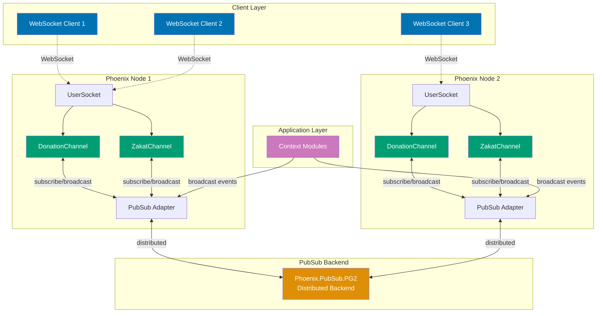
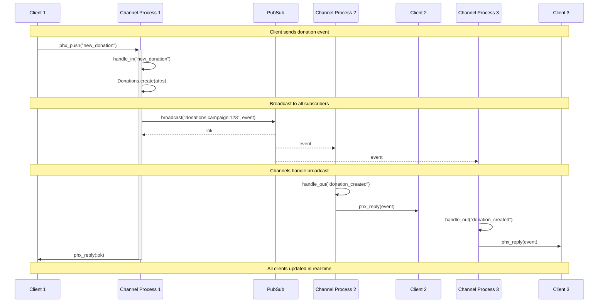

# Phoenix Channels Guide

## Quick Reference

**Navigation**: [Stack Libraries](../README.md) > [Elixir Phoenix](./README.md) > Channels

**Related Guides**:

- [LiveView](ex-soen-plwe-to-elph__liveview.md) - Modern real-time alternative
- [Security](ex-soen-plwe-to-elph__security.md) - Channel authentication
- [Testing](ex-soen-plwe-to-elph__testing.md) - Channel testing patterns
- [Observability](ex-soen-plwe-to-elph__observability.md) - Monitoring channels

## Overview

Phoenix Channels provide a powerful abstraction for real-time, bidirectional communication between clients and servers. Built on top of WebSockets (with long-polling fallback), channels enable features like live updates, chat systems, presence tracking, and collaborative editing.

**Target Audience**: Developers building real-time features in Phoenix applications, especially for Islamic finance platforms requiring live updates for donations, Zakat calculations, and financial dashboards.

**Phoenix Version**: 1.7+ with Elixir 1.14+

## Core Concepts

### Channel Architecture

Channels operate on a publish-subscribe model with several key components:



**Architecture Layers**:

- **Client Layer** (blue): WebSocket clients connecting from browsers/mobile apps
- **Channel Processes** (teal): One process per client connection, handles join/leave/messages
- **PubSub Backend** (orange): Distributed message bus, routes messages across nodes
- **Application Layer** (purple): Business logic contexts that broadcast domain events

**Key Benefits**:

- **Process isolation**: Each connection is isolated process (crash won't affect others)
- **Horizontal scaling**: PubSub distributes messages across multiple nodes
- **Fault tolerance**: Supervisor trees restart crashed channels automatically
- **Soft real-time**: Microsecond message latency with millions of concurrent connections

```elixir
# User Socket - Connection authentication and channel routing
defmodule OseWeb.UserSocket do
  use Phoenix.Socket

  # Channel routes - map topics to channel modules
  channel "donations:*", OseWeb.DonationChannel
  channel "zakat:*", OseWeb.ZakatChannel
  channel "presence:*", OseWeb.PresenceChannel

  # Socket authentication
  @impl true
  def connect(%{"token" => token}, socket, _connect_info) do
    case verify_token(token) do
      {:ok, user_id} ->
        {:ok, assign(socket, :user_id, user_id)}

      {:error, _reason} ->
        :error
    end
  end

  # Anonymous connections
  def connect(_params, socket, _connect_info) do
    {:ok, assign(socket, :user_id, nil)}
  end

  @impl true
  def id(socket), do: "user_socket:#{socket.assigns.user_id}"

  defp verify_token(token) do
    # Use Phoenix.Token for secure token verification
    case Phoenix.Token.verify(
           OseWeb.Endpoint,
           "user socket",
           token,
           max_age: 86400
         ) do
      {:ok, user_id} -> {:ok, user_id}
      {:error, _} -> {:error, :invalid_token}
    end
  end
end
```

### Channel Module Structure

```elixir
defmodule OseWeb.DonationChannel do
  use Phoenix.Channel

  alias Ose.Donations
  alias OseWeb.Presence

  # Join authorization
  @impl true
  def join("donations:lobby", _payload, socket) do
    # Public lobby - anyone can join
    {:ok, socket}
  end

  def join("donations:campaign:" <> campaign_id, payload, socket) do
    # Verify user can access this campaign
    user_id = socket.assigns.user_id

    case Donations.authorize_campaign_access(user_id, campaign_id) do
      {:ok, _permissions} ->
        send(self(), {:after_join, campaign_id})
        {:ok, assign(socket, :campaign_id, campaign_id), socket}

      {:error, reason} ->
        {:error, %{reason: reason}}
    end
  end

  # After join - track presence and send initial state
  @impl true
  def handle_info({:after_join, campaign_id}, socket) do
    push(socket, "presence_state", Presence.list(socket))

    {:ok, _} =
      Presence.track(socket, socket.assigns.user_id, %{
        online_at: inspect(System.system_time(:second))
      })

    # Send initial campaign state
    campaign = Donations.get_campaign_with_stats(campaign_id)
    push(socket, "campaign_state", %{campaign: campaign})

    {:noreply, socket}
  end

  # Handle incoming messages
  @impl true
  def handle_in("new_donation", %{"amount" => amount, "donor_name" => donor_name}, socket) do
    campaign_id = socket.assigns.campaign_id
    user_id = socket.assigns.user_id

    case Donations.create_donation(%{
           campaign_id: campaign_id,
           user_id: user_id,
           amount: amount,
           donor_name: donor_name
         }) do
      {:ok, donation} ->
        # Broadcast to all subscribers
        broadcast!(socket, "donation_created", %{
          donation: donation,
          new_total: Donations.get_campaign_total(campaign_id)
        })

        {:reply, {:ok, %{donation_id: donation.id}}, socket}

      {:error, changeset} ->
        {:reply, {:error, %{errors: format_errors(changeset)}}, socket}
    end
  end

  def handle_in("update_goal", %{"new_goal" => new_goal}, socket) do
    campaign_id = socket.assigns.campaign_id
    user_id = socket.assigns.user_id

    # Only campaign organizers can update goal
    with {:ok, _} <- Donations.verify_organizer(user_id, campaign_id),
         {:ok, campaign} <- Donations.update_goal(campaign_id, new_goal) do
      broadcast!(socket, "goal_updated", %{new_goal: new_goal})
      {:reply, {:ok, %{campaign: campaign}}, socket}
    else
      {:error, :unauthorized} ->
        {:reply, {:error, %{reason: "unauthorized"}}, socket}

      {:error, changeset} ->
        {:reply, {:error, %{errors: format_errors(changeset)}}, socket}
    end
  end

  # Handle outgoing messages
  @impl true
  def handle_out("donation_created", payload, socket) do
    # Can filter or transform messages per-socket
    push(socket, "donation_created", payload)
    {:noreply, socket}
  end

  # Graceful shutdown
  @impl true
  def terminate(_reason, socket) do
    # Cleanup resources if needed
    :ok
  end

  defp format_errors(changeset) do
    Ecto.Changeset.traverse_errors(changeset, fn {msg, opts} ->
      Enum.reduce(opts, msg, fn {key, value}, acc ->
        String.replace(acc, "%{#{key}}", to_string(value))
      end)
    end)
  end
end
```

## Authentication and Authorization

### Token-Based Authentication

```elixir
# Generate token in controller
defmodule OseWeb.SessionController do
  use OseWeb, :controller

  def create(conn, %{"email" => email, "password" => password}) do
    case Ose.Accounts.authenticate_user(email, password) do
      {:ok, user} ->
        # Generate socket token
        token = Phoenix.Token.sign(
          OseWeb.Endpoint,
          "user socket",
          user.id
        )

        json(conn, %{
          user: user,
          token: token
        })

      {:error, _reason} ->
        conn
        |> put_status(:unauthorized)
        |> json(%{error: "Invalid credentials"})
    end
  end
end

# Client-side usage (JavaScript)
const token = response.data.token;
const socket = new Socket("/socket", {
  params: {token: token}
});
socket.connect();
```

### Channel-Level Authorization

```elixir
defmodule OseWeb.ZakatChannel do
  use Phoenix.Channel

  alias Ose.Zakat

  # User-specific channel with strict authorization
  @impl true
  def join("zakat:user:" <> user_id, _payload, socket) do
    requested_user_id = String.to_integer(user_id)
    current_user_id = socket.assigns.user_id

    cond do
      # User accessing their own channel
      current_user_id == requested_user_id ->
        {:ok, assign(socket, :zakat_user_id, requested_user_id)}

      # Admin override
      is_admin?(current_user_id) ->
        {:ok, assign(socket, :zakat_user_id, requested_user_id)}

      true ->
        {:error, %{reason: "unauthorized"}}
    end
  end

  # Message-level authorization
  @impl true
  def handle_in("calculate_zakat", params, socket) do
    user_id = socket.assigns.zakat_user_id

    # Verify user owns the assets
    with {:ok, assets} <- Zakat.get_user_assets(user_id),
         {:ok, calculation} <- Zakat.calculate(assets, params) do
      {:reply, {:ok, calculation}, socket}
    else
      {:error, reason} ->
        {:reply, {:error, %{reason: reason}}, socket}
    end
  end

  defp is_admin?(user_id) do
    # Implementation
    false
  end
end
```

### Role-Based Access Control

```elixir
defmodule OseWeb.AdminChannel do
  use Phoenix.Channel

  alias Ose.Accounts

  @impl true
  def join("admin:" <> _topic, _payload, socket) do
    user_id = socket.assigns.user_id

    case Accounts.get_user_role(user_id) do
      {:ok, role} when role in [:admin, :super_admin] ->
        {:ok, assign(socket, :role, role)}

      _ ->
        {:error, %{reason: "admin access required"}}
    end
  end

  @impl true
  def handle_in("moderate_donation", %{"donation_id" => id, "action" => action}, socket) do
    # Super admins have full access, regular admins have limited
    case {socket.assigns.role, action} do
      {:super_admin, _} ->
        perform_moderation(id, action)

      {:admin, action} when action in ["approve", "flag"] ->
        perform_moderation(id, action)

      _ ->
        {:reply, {:error, %{reason: "insufficient permissions"}}, socket}
    end
  end

  defp perform_moderation(id, action) do
    # Implementation
    {:reply, {:ok, %{}}, socket}
  end
end
```

## Broadcasting Patterns

### Channel Communication Architecture



**Communication Flow**:

1. **Client sends event**: Client 1 sends "new_donation" via WebSocket
2. **Channel handles**: Channel process handles event, creates donation
3. **Broadcast**: Channel broadcasts to PubSub topic
4. **Distribution**: PubSub delivers to all subscribed channel processes
5. **Transform**: Each channel can transform event via `handle_out/3`
6. **Push to clients**: Channels push events to their connected clients

### Topic-Based Broadcasting

```elixir
defmodule Ose.DonationNotifier do
  @moduledoc """
  Broadcasts donation events to connected clients.
  """

  alias Phoenix.PubSub

  @pubsub Ose.PubSub

  # Broadcast to specific campaign
  def notify_donation_created(campaign_id, donation) do
    PubSub.broadcast(
      @pubsub,
      "donations:campaign:#{campaign_id}",
      {:donation_created, donation}
    )
  end

  # Broadcast to all donation channels
  def notify_milestone_reached(campaign_id, milestone) do
    PubSub.broadcast(
      @pubsub,
      "donations:lobby",
      {:milestone_reached, %{campaign_id: campaign_id, milestone: milestone}}
    )
  end

  # Local broadcast (same node only)
  def notify_local(topic, event, payload) do
    PubSub.local_broadcast(
      @pubsub,
      topic,
      {event, payload}
    )
  end

  # Broadcast from context
  def broadcast_zakat_due(user_id, calculation) do
    PubSub.broadcast(
      @pubsub,
      "zakat:user:#{user_id}",
      {:zakat_due, calculation}
    )
  end
end
```

### Intercept and Transform

```elixir
defmodule OseWeb.DonationChannel do
  use Phoenix.Channel

  # Declare which events to intercept
  intercept ["donation_created", "sensitive_update"]

  @impl true
  def handle_out("donation_created", payload, socket) do
    # Transform based on user permissions
    transformed_payload =
      if can_see_donor_details?(socket) do
        payload
      else
        Map.put(payload, :donor_name, "Anonymous")
      end

    push(socket, "donation_created", transformed_payload)
    {:noreply, socket}
  end

  @impl true
  def handle_out("sensitive_update", payload, socket) do
    # Only send to authorized users
    if authorized_for_sensitive_data?(socket) do
      push(socket, "sensitive_update", payload)
      {:noreply, socket}
    else
      {:noreply, socket}
    end
  end

  defp can_see_donor_details?(socket) do
    # Implementation
    true
  end

  defp authorized_for_sensitive_data?(socket) do
    # Implementation
    false
  end
end
```

### Conditional Broadcasting

```elixir
defmodule OseWeb.WaqfChannel do
  use Phoenix.Channel

  @impl true
  def handle_in("create_waqf", params, socket) do
    user_id = socket.assigns.user_id

    case Ose.Waqf.create(user_id, params) do
      {:ok, waqf} ->
        # Broadcast to different audiences
        broadcast_to_stakeholders(waqf)
        {:reply, {:ok, %{waqf: waqf}}, socket}

      {:error, changeset} ->
        {:reply, {:error, %{errors: format_errors(changeset)}}, socket}
    end
  end

  defp broadcast_to_stakeholders(waqf) do
    # Public announcement - minimal details
    broadcast_public_waqf(waqf)

    # Notify trustees - full details
    broadcast_to_trustees(waqf)

    # Notify beneficiaries - relevant details
    broadcast_to_beneficiaries(waqf)
  end

  defp broadcast_public_waqf(waqf) do
    Phoenix.PubSub.broadcast(
      Ose.PubSub,
      "waqf:public",
      {:waqf_created, %{
        id: waqf.id,
        type: waqf.type,
        created_at: waqf.inserted_at
      }}
    )
  end

  defp broadcast_to_trustees(waqf) do
    Enum.each(waqf.trustees, fn trustee ->
      Phoenix.PubSub.broadcast(
        Ose.PubSub,
        "waqf:trustee:#{trustee.user_id}",
        {:waqf_assigned, waqf}
      )
    end)
  end

  defp broadcast_to_beneficiaries(waqf) do
    Enum.each(waqf.beneficiaries, fn beneficiary ->
      Phoenix.PubSub.broadcast(
        Ose.PubSub,
        "waqf:beneficiary:#{beneficiary.user_id}",
        {:waqf_available, %{
          id: waqf.id,
          benefit_amount: beneficiary.allocation
        }}
      )
    end)
  end

  defp format_errors(changeset) do
    # Implementation from previous example
    %{}
  end
end
```

## Presence Tracking

### Basic Presence Setup

```elixir
# lib/ose_web/channels/presence.ex
defmodule OseWeb.Presence do
  @moduledoc """
  Provides presence tracking for channels.
  """

  use Phoenix.Presence,
    otp_app: :ose,
    pubsub_server: Ose.PubSub
end

# In your channel
defmodule OseWeb.DonationChannel do
  use Phoenix.Channel

  alias OseWeb.Presence

  @impl true
  def handle_info({:after_join, _campaign_id}, socket) do
    # Track user presence
    {:ok, _} = Presence.track(socket, socket.assigns.user_id, %{
      online_at: inspect(System.system_time(:second)),
      name: socket.assigns.user_name,
      role: socket.assigns.role
    })

    # Send current presence state
    push(socket, "presence_state", Presence.list(socket))

    {:noreply, socket}
  end
end
```

### Advanced Presence with Metadata

```elixir
defmodule OseWeb.CollaborationChannel do
  use Phoenix.Channel

  alias OseWeb.Presence

  @impl true
  def join("collab:document:" <> doc_id, _payload, socket) do
    send(self(), {:after_join, doc_id})
    {:ok, assign(socket, :document_id, doc_id)}
  end

  @impl true
  def handle_info({:after_join, doc_id}, socket) do
    user_id = socket.assigns.user_id

    # Track with rich metadata
    {:ok, _} = Presence.track(socket, user_id, %{
      online_at: System.system_time(:second),
      name: get_user_name(user_id),
      avatar: get_user_avatar(user_id),
      cursor_position: nil,
      current_section: nil,
      typing: false
    })

    # Send presence list
    push(socket, "presence_state", Presence.list(socket))

    {:noreply, socket}
  end

  @impl true
  def handle_in("cursor_moved", %{"position" => position}, socket) do
    user_id = socket.assigns.user_id

    # Update presence metadata
    {:ok, _} = Presence.update(socket, user_id, fn meta ->
      Map.put(meta, :cursor_position, position)
    end)

    {:noreply, socket}
  end

  @impl true
  def handle_in("typing", %{"typing" => typing}, socket) do
    user_id = socket.assigns.user_id

    {:ok, _} = Presence.update(socket, user_id, fn meta ->
      meta
      |> Map.put(:typing, typing)
      |> Map.put(:typing_at, System.system_time(:second))
    end)

    {:noreply, socket}
  end

  defp get_user_name(user_id) do
    # Implementation
    "User #{user_id}"
  end

  defp get_user_avatar(user_id) do
    # Implementation
    "/avatars/default.png"
  end
end
```

### Presence List Processing

```elixir
# Client-side presence handling (JavaScript)
"""
let channel = socket.channel("collab:document:123", {});
let presence = new Presence(channel);

presence.onSync(() => {
  let users = [];
  presence.list((id, {metas}) => {
    // metas is an array of presence metadata
    let user = metas[0]; // Get most recent metadata
    users.push({
      id: id,
      name: user.name,
      avatar: user.avatar,
      typing: user.typing,
      cursor: user.cursor_position
    });
  });
  renderUsers(users);
});

channel.on("presence_state", state => {
  presence.syncState(state);
});

channel.on("presence_diff", diff => {
  presence.syncDiff(diff);
});
"""

# Server-side presence queries
defmodule Ose.Presence.Tracker do
  alias OseWeb.Presence

  def list_online_users(topic) do
    Presence.list(topic)
    |> Enum.map(fn {user_id, %{metas: metas}} ->
      meta = List.first(metas)
      %{
        user_id: user_id,
        online_at: meta.online_at,
        name: meta.name
      }
    end)
  end

  def count_online_users(topic) do
    Presence.list(topic)
    |> map_size()
  end

  def is_user_online?(topic, user_id) do
    Presence.list(topic)
    |> Map.has_key?(to_string(user_id))
  end

  def get_typing_users(topic) do
    Presence.list(topic)
    |> Enum.filter(fn {_id, %{metas: metas}} ->
      meta = List.first(metas)
      Map.get(meta, :typing, false)
    end)
    |> Enum.map(fn {user_id, _} -> user_id end)
  end
end
```

## Message Patterns

### Request-Reply Pattern

```elixir
defmodule OseWeb.CalculatorChannel do
  use Phoenix.Channel

  @impl true
  def handle_in("calculate_nisab", %{"currency" => currency, "gold_price" => price}, socket) do
    case Ose.Zakat.calculate_nisab(currency, price) do
      {:ok, nisab} ->
        {:reply, {:ok, %{nisab: nisab, currency: currency}}, socket}

      {:error, reason} ->
        {:reply, {:error, %{reason: reason}}, socket}
    end
  end

  # Async reply pattern
  @impl true
  def handle_in("complex_calculation", params, socket) do
    # Start async task
    task = Task.async(fn ->
      Ose.Zakat.complex_calculation(params)
    end)

    # Store task reference
    socket = assign(socket, :calculation_task, task)

    # Reply immediately
    {:reply, {:ok, %{status: "processing"}}, socket}
  end

  @impl true
  def handle_info({ref, result}, socket) do
    # Task completed
    Process.demonitor(ref, [:flush])

    # Send result to client
    push(socket, "calculation_complete", %{result: result})

    {:noreply, socket}
  end

  @impl true
  def handle_info({:DOWN, _ref, :process, _pid, _reason}, socket) do
    # Task failed
    push(socket, "calculation_failed", %{reason: "calculation error"})
    {:noreply, socket}
  end
end
```

### Streaming Pattern

```elixir
defmodule OseWeb.ReportChannel do
  use Phoenix.Channel

  @impl true
  def handle_in("generate_report", %{"type" => type, "year" => year}, socket) do
    user_id = socket.assigns.user_id

    # Start streaming report generation
    Task.start(fn ->
      stream_report(socket, user_id, type, year)
    end)

    {:reply, {:ok, %{status: "started"}}, socket}
  end

  defp stream_report(socket, user_id, type, year) do
    # Send progress updates
    push_progress(socket, 0, "Fetching data...")

    donations = Ose.Donations.get_user_donations(user_id, year)
    push_progress(socket, 25, "Processing donations...")

    zakat = Ose.Zakat.get_user_calculations(user_id, year)
    push_progress(socket, 50, "Processing Zakat...")

    waqf = Ose.Waqf.get_user_contributions(user_id, year)
    push_progress(socket, 75, "Processing Waqf...")

    report = generate_final_report(donations, zakat, waqf)
    push_progress(socket, 100, "Complete")

    # Send final report
    Phoenix.Channel.push(socket, "report_ready", %{report: report})
  end

  defp push_progress(socket, percent, message) do
    Phoenix.Channel.push(socket, "report_progress", %{
      percent: percent,
      message: message
    })

    # Simulate work
    Process.sleep(100)
  end

  defp generate_final_report(_donations, _zakat, _waqf) do
    # Implementation
    %{}
  end
end
```

### Batch Processing Pattern

```elixir
defmodule OseWeb.BatchChannel do
  use Phoenix.Channel

  @impl true
  def handle_in("batch_import", %{"donations" => donations}, socket) do
    total = length(donations)
    ref = make_ref()

    # Process in batches
    Task.start(fn ->
      donations
      |> Enum.chunk_every(100)
      |> Enum.with_index()
      |> Enum.each(fn {batch, index} ->
        result = Ose.Donations.batch_create(batch)

        push(socket, "batch_progress", %{
          batch: index + 1,
          processed: min((index + 1) * 100, total),
          total: total,
          successful: length(result.successful),
          failed: length(result.failed)
        })
      end)

      push(socket, "batch_complete", %{ref: ref})
    end)

    {:reply, {:ok, %{ref: ref, total: total}}, socket}
  end
end
```

## Error Handling

### Graceful Error Handling

```elixir
defmodule OseWeb.TransactionChannel do
  use Phoenix.Channel

  require Logger

  @impl true
  def handle_in("process_payment", params, socket) do
    case process_payment_safe(params, socket) do
      {:ok, result} ->
        {:reply, {:ok, result}, socket}

      {:error, :validation_error, errors} ->
        {:reply, {:error, %{type: "validation", errors: errors}}, socket}

      {:error, :payment_failed, reason} ->
        {:reply, {:error, %{type: "payment", reason: reason}}, socket}

      {:error, :insufficient_funds} ->
        {:reply, {:error, %{type: "funds", message: "Insufficient funds"}}, socket}

      {:error, reason} ->
        Logger.error("Unexpected payment error: #{inspect(reason)}")
        {:reply, {:error, %{type: "system", message: "Payment processing failed"}}, socket}
    end
  end

  defp process_payment_safe(params, socket) do
    user_id = socket.assigns.user_id

    with {:ok, validated} <- validate_payment(params),
         {:ok, balance} <- check_balance(user_id, validated.amount),
         {:ok, payment} <- Ose.Payments.process(user_id, validated) do
      {:ok, %{payment: payment, new_balance: balance - validated.amount}}
    else
      {:error, %Ecto.Changeset{} = changeset} ->
        {:error, :validation_error, format_errors(changeset)}

      {:error, :insufficient_funds} = error ->
        error

      {:error, reason} ->
        {:error, :payment_failed, reason}
    end
  end

  defp validate_payment(params) do
    # Implementation
    {:ok, params}
  end

  defp check_balance(user_id, amount) do
    # Implementation
    {:ok, 1000}
  end

  defp format_errors(changeset) do
    # Implementation
    %{}
  end
end
```

### Channel Crash Recovery

```elixir
defmodule OseWeb.ResilientChannel do
  use Phoenix.Channel

  require Logger

  @impl true
  def join(topic, _payload, socket) do
    # Recover state if reconnecting
    state = recover_state(topic, socket.assigns.user_id)

    {:ok, %{recovered: state != nil}, assign(socket, :state, state || %{})}
  end

  @impl true
  def handle_in("important_action", params, socket) do
    # Persist state before processing
    persist_state(socket)

    case process_action(params, socket) do
      {:ok, result} ->
        {:reply, {:ok, result}, socket}

      {:error, reason} ->
        Logger.warning("Action failed: #{inspect(reason)}")
        {:reply, {:error, %{reason: reason}}, socket}
    end
  end

  @impl true
  def terminate(reason, socket) do
    Logger.info("Channel terminating: #{inspect(reason)}")

    # Persist state for recovery
    persist_state(socket)

    :ok
  end

  defp recover_state(topic, user_id) do
    # Load from cache/database
    case Ose.Cache.get("channel_state:#{topic}:#{user_id}") do
      nil -> nil
      state -> state
    end
  end

  defp persist_state(socket) do
    topic = socket.topic
    user_id = socket.assigns.user_id
    state = socket.assigns.state

    Ose.Cache.put("channel_state:#{topic}:#{user_id}", state, ttl: 3600)
  end

  defp process_action(_params, _socket) do
    {:ok, %{}}
  end
end
```

## Performance Optimization

### Message Batching

```elixir
defmodule OseWeb.LiveDashboardChannel do
  use Phoenix.Channel

  @batch_interval 100

  @impl true
  def join("dashboard:live", _payload, socket) do
    # Start batching process
    schedule_batch_send()

    {:ok, assign(socket, :pending_messages, [])}
  end

  @impl true
  def handle_info({:metric_update, metric}, socket) do
    # Add to batch instead of immediate send
    pending = [metric | socket.assigns.pending_messages]

    {:noreply, assign(socket, :pending_messages, pending)}
  end

  @impl true
  def handle_info(:send_batch, socket) do
    # Send batched messages
    unless Enum.empty?(socket.assigns.pending_messages) do
      push(socket, "metrics_batch", %{
        metrics: Enum.reverse(socket.assigns.pending_messages),
        timestamp: System.system_time(:millisecond)
      })
    end

    # Schedule next batch
    schedule_batch_send()

    {:noreply, assign(socket, :pending_messages, [])}
  end

  defp schedule_batch_send do
    Process.send_after(self(), :send_batch, @batch_interval)
  end
end
```

### Rate Limiting

```elixir
defmodule OseWeb.RateLimitedChannel do
  use Phoenix.Channel

  @max_messages_per_second 10

  @impl true
  def join(topic, _payload, socket) do
    socket =
      socket
      |> assign(:message_count, 0)
      |> assign(:window_start, System.system_time(:second))

    {:ok, socket}
  end

  @impl true
  def handle_in(event, payload, socket) do
    case check_rate_limit(socket) do
      :ok ->
        socket = increment_message_count(socket)
        process_message(event, payload, socket)

      {:error, :rate_limited} ->
        {:reply, {:error, %{reason: "rate limit exceeded"}}, socket}
    end
  end

  defp check_rate_limit(socket) do
    current_time = System.system_time(:second)
    window_start = socket.assigns.window_start

    if current_time > window_start do
      # New window
      :ok
    else
      if socket.assigns.message_count < @max_messages_per_second do
        :ok
      else
        {:error, :rate_limited}
      end
    end
  end

  defp increment_message_count(socket) do
    current_time = System.system_time(:second)
    window_start = socket.assigns.window_start

    if current_time > window_start do
      # Reset window
      socket
      |> assign(:message_count, 1)
      |> assign(:window_start, current_time)
    else
      update_in(socket.assigns.message_count, &(&1 + 1))
    end
  end

  defp process_message(event, payload, socket) do
    # Process the message
    {:noreply, socket}
  end
end
```

### Connection Pooling

```elixir
# config/config.exs
config :ose, OseWeb.Endpoint,
  pubsub_server: Ose.PubSub

config :ose, Ose.PubSub,
  adapter: Phoenix.PubSub.PG2,
  pool_size: System.schedulers_online() * 2

# Efficient broadcasting
defmodule Ose.Notifier do
  @pubsub Ose.PubSub

  def notify_all(event, payload) do
    # Direct pubsub - no channel overhead
    Phoenix.PubSub.broadcast(@pubsub, "global", {event, payload})
  end

  def notify_user(user_id, event, payload) do
    Phoenix.PubSub.broadcast(@pubsub, "user:#{user_id}", {event, payload})
  end
end
```

## Testing Channels

### Basic Channel Tests

```elixir
defmodule OseWeb.DonationChannelTest do
  use OseWeb.ChannelCase

  alias OseWeb.DonationChannel
  alias OseWeb.UserSocket

  setup do
    user = insert(:user)
    campaign = insert(:campaign)

    {:ok, socket} = connect(UserSocket, %{"token" => generate_token(user)})
    {:ok, _, socket} = subscribe_and_join(socket, DonationChannel, "donations:campaign:#{campaign.id}")

    %{socket: socket, user: user, campaign: campaign}
  end

  test "join authenticates user", %{campaign: campaign} do
    # Unauthenticated join should fail
    {:ok, socket} = connect(UserSocket, %{})

    assert {:error, %{reason: "unauthorized"}} =
             subscribe_and_join(socket, DonationChannel, "donations:campaign:#{campaign.id}")
  end

  test "new_donation broadcasts to channel", %{socket: socket, campaign: campaign} do
    # Send donation message
    ref = push(socket, "new_donation", %{
      "amount" => "100.00",
      "donor_name" => "Test Donor"
    })

    # Should receive reply
    assert_reply ref, :ok, %{donation_id: _id}

    # Should broadcast to all subscribers
    assert_broadcast "donation_created", %{
      donation: %{amount: _amount},
      new_total: _total
    }
  end

  test "validates donation amount", %{socket: socket} do
    ref = push(socket, "new_donation", %{
      "amount" => "-10",
      "donor_name" => "Invalid"
    })

    assert_reply ref, :error, %{errors: errors}
    assert errors.amount
  end

  defp generate_token(user) do
    Phoenix.Token.sign(OseWeb.Endpoint, "user socket", user.id)
  end
end
```

### Testing Presence

```elixir
defmodule OseWeb.CollaborationChannelTest do
  use OseWeb.ChannelCase

  alias OseWeb.CollaborationChannel
  alias OseWeb.Presence

  setup do
    user1 = insert(:user, name: "User 1")
    user2 = insert(:user, name: "User 2")
    document = insert(:document)

    {:ok, socket1} = connect(UserSocket, %{"token" => generate_token(user1)})
    {:ok, _, socket1} = subscribe_and_join(socket1, CollaborationChannel, "collab:document:#{document.id}")

    {:ok, socket2} = connect(UserSocket, %{"token" => generate_token(user2)})
    {:ok, _, socket2} = subscribe_and_join(socket2, CollaborationChannel, "collab:document:#{document.id}")

    %{socket1: socket1, socket2: socket2, user1: user1, user2: user2, document: document}
  end

  test "tracks user presence", %{socket1: socket1, user1: user1, user2: user2} do
    # Wait for presence sync
    :timer.sleep(100)

    presences = Presence.list(socket1)

    assert map_size(presences) == 2
    assert Map.has_key?(presences, to_string(user1.id))
    assert Map.has_key?(presences, to_string(user2.id))
  end

  test "updates presence metadata", %{socket1: socket1, user1: user1} do
    # Send cursor update
    push(socket1, "cursor_moved", %{"position" => %{x: 100, y: 200}})

    :timer.sleep(100)

    presences = Presence.list(socket1)
    user_presence = presences[to_string(user1.id)]
    meta = List.first(user_presence.metas)

    assert meta.cursor_position == %{x: 100, y: 200}
  end

  test "removes presence on disconnect", %{socket1: socket1, socket2: socket2, user1: user1} do
    # Disconnect socket1
    leave(socket1)

    :timer.sleep(100)

    presences = Presence.list(socket2)
    refute Map.has_key?(presences, to_string(user1.id))
  end

  defp generate_token(user) do
    Phoenix.Token.sign(OseWeb.Endpoint, "user socket", user.id)
  end
end
```

### Integration Tests

```elixir
defmodule OseWeb.DonationFlowTest do
  use OseWeb.ChannelCase

  alias OseWeb.DonationChannel

  test "complete donation flow" do
    # Setup
    organizer = insert(:user)
    donor = insert(:user)
    campaign = insert(:campaign, organizer: organizer, goal: 1000)

    # Organizer connects
    {:ok, org_socket} = connect(UserSocket, %{"token" => generate_token(organizer)})

    {:ok, _, org_socket} =
      subscribe_and_join(org_socket, DonationChannel, "donations:campaign:#{campaign.id}")

    # Donor connects
    {:ok, donor_socket} = connect(UserSocket, %{"token" => generate_token(donor)})

    {:ok, _, donor_socket} =
      subscribe_and_join(donor_socket, DonationChannel, "donations:campaign:#{campaign.id}")

    # Donor makes donation
    ref = push(donor_socket, "new_donation", %{
      "amount" => "500.00",
      "donor_name" => donor.name
    })

    assert_reply ref, :ok, %{donation_id: donation_id}

    # Both should receive broadcast
    assert_broadcast "donation_created", %{donation: donation, new_total: 500}
    assert donation.id == donation_id

    # Organizer updates goal
    ref = push(org_socket, "update_goal", %{"new_goal" => "2000"})
    assert_reply ref, :ok, %{campaign: updated_campaign}
    assert updated_campaign.goal == 2000

    # Both should receive goal update
    assert_broadcast "goal_updated", %{new_goal: 2000}
  end

  defp generate_token(user) do
    Phoenix.Token.sign(OseWeb.Endpoint, "user socket", user.id)
  end
end
```

## Production Patterns

### Monitoring and Metrics

```elixir
defmodule OseWeb.MonitoredChannel do
  use Phoenix.Channel

  require Logger

  @impl true
  def join(topic, _payload, socket) do
    :telemetry.execute(
      [:ose, :channel, :join],
      %{count: 1},
      %{topic: topic, user_id: socket.assigns.user_id}
    )

    Logger.info("Channel join: #{topic} by user #{socket.assigns.user_id}")

    {:ok, socket}
  end

  @impl true
  def handle_in(event, _payload, socket) do
    start_time = System.monotonic_time()

    result = process_event(event, socket)

    duration = System.monotonic_time() - start_time

    :telemetry.execute(
      [:ose, :channel, :message],
      %{duration: duration},
      %{event: event, topic: socket.topic}
    )

    result
  end

  @impl true
  def terminate(reason, socket) do
    :telemetry.execute(
      [:ose, :channel, :terminate],
      %{count: 1},
      %{reason: reason, topic: socket.topic}
    )

    Logger.info("Channel terminate: #{socket.topic}, reason: #{inspect(reason)}")

    :ok
  end

  defp process_event(_event, socket) do
    {:noreply, socket}
  end
end

# Setup telemetry handlers
defmodule Ose.Telemetry do
  def setup do
    :telemetry.attach_many(
      "ose-channel-metrics",
      [
        [:ose, :channel, :join],
        [:ose, :channel, :message],
        [:ose, :channel, :terminate]
      ],
      &handle_event/4,
      nil
    )
  end

  defp handle_event([:ose, :channel, :join], measurements, metadata, _config) do
    # Record join metrics
    :telemetry.execute([:ose, :metrics, :counter], %{value: 1}, %{
      metric: "channel.joins",
      topic: metadata.topic
    })
  end

  defp handle_event([:ose, :channel, :message], measurements, metadata, _config) do
    # Record message duration
    :telemetry.execute([:ose, :metrics, :histogram], measurements, %{
      metric: "channel.message.duration",
      event: metadata.event
    })
  end

  defp handle_event([:ose, :channel, :terminate], _measurements, metadata, _config) do
    # Record disconnections
    :telemetry.execute([:ose, :metrics, :counter], %{value: 1}, %{
      metric: "channel.disconnects",
      reason: metadata.reason
    })
  end
end
```

### Graceful Shutdown

```elixir
defmodule OseWeb.GracefulChannel do
  use Phoenix.Channel

  @impl true
  def join(topic, _payload, socket) do
    # Register for shutdown notifications
    Process.flag(:trap_exit, true)

    {:ok, socket}
  end

  @impl true
  def terminate(:shutdown, socket) do
    # Graceful shutdown - notify client
    push(socket, "shutdown_notice", %{
      reason: "server shutting down",
      reconnect_delay: 5000
    })

    # Allow time for message to send
    Process.sleep(100)

    :ok
  end

  def terminate(reason, socket) do
    Logger.warning("Channel terminated unexpectedly: #{inspect(reason)}")
    :ok
  end
end
```

### Circuit Breaker Pattern

```elixir
defmodule OseWeb.ResilientAPIChannel do
  use Phoenix.Channel

  @circuit_breaker_threshold 5
  @circuit_breaker_timeout 60_000

  @impl true
  def handle_in("external_api_call", params, socket) do
    case check_circuit_breaker() do
      :closed ->
        make_api_call(params, socket)

      :open ->
        {:reply, {:error, %{reason: "service temporarily unavailable"}}, socket}

      :half_open ->
        # Try one request
        case make_api_call(params, socket) do
          {:reply, {:ok, _}, _} = result ->
            reset_circuit_breaker()
            result

          error ->
            open_circuit_breaker()
            error
        end
    end
  end

  defp make_api_call(params, socket) do
    case ExternalAPI.call(params) do
      {:ok, result} ->
        record_success()
        {:reply, {:ok, result}, socket}

      {:error, reason} ->
        record_failure()
        {:reply, {:error, %{reason: reason}}, socket}
    end
  end

  defp check_circuit_breaker do
    case Ose.Cache.get("circuit_breaker:state") do
      nil -> :closed
      state -> state
    end
  end

  defp record_failure do
    failures = Ose.Cache.get("circuit_breaker:failures") || 0
    new_failures = failures + 1

    Ose.Cache.put("circuit_breaker:failures", new_failures)

    if new_failures >= @circuit_breaker_threshold do
      open_circuit_breaker()
    end
  end

  defp record_success do
    Ose.Cache.delete("circuit_breaker:failures")
  end

  defp open_circuit_breaker do
    Ose.Cache.put("circuit_breaker:state", :open, ttl: @circuit_breaker_timeout)

    # After timeout, enter half-open state
    Process.send_after(self(), :half_open_circuit, @circuit_breaker_timeout)
  end

  defp reset_circuit_breaker do
    Ose.Cache.put("circuit_breaker:state", :closed)
    Ose.Cache.delete("circuit_breaker:failures")
  end

  @impl true
  def handle_info(:half_open_circuit, socket) do
    Ose.Cache.put("circuit_breaker:state", :half_open)
    {:noreply, socket}
  end
end
```

## Related Documentation

- **[LiveView Guide](ex-soen-plwe-to-elph__liveview.md)** - Modern alternative to channels
- **[Security Guide](ex-soen-plwe-to-elph__security.md)** - Authentication and authorization
- **[Testing Guide](ex-soen-plwe-to-elph__testing.md)** - Channel testing strategies
- **[Observability Guide](ex-soen-plwe-to-elph__observability.md)** - Monitoring and logging
- **[Performance Guide](ex-soen-plwe-to-elph__performance.md)** - Optimization techniques
- **[Deployment Guide](ex-soen-plwe-to-elph__deployment.md)** - Production deployment
- **[Phoenix Documentation](https://hexdocs.pm/phoenix/channels.html)** - Official reference
